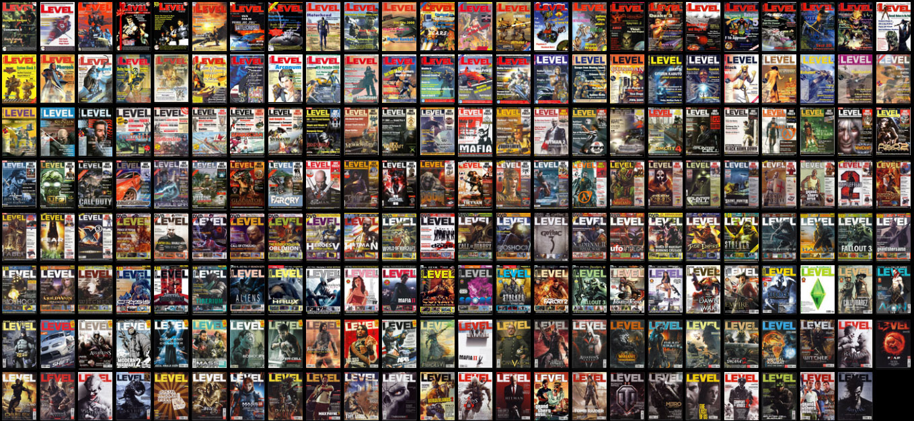

Colecţia digitală a revistei LEVEL e în sfârşit completă!

După cum ştiţi, luna septembrie este luna în care aniversăm apariţia primului număr al revistei. Cu această ocazie, ultimul set de 26 de reviste care mai lipseau (anii 2011-2013) [a fost scanat](https://forum.candaparerevista.ro/viewtopic.php?p=85411#p85411). Graţie eforturilor membrilor comunităţii din ultimii 10 ani, începând din 2008, toate cele 191 de numere ale revistei sunt acum scanate şi disponibile pentru lectură şi căutare online, sau pentru download în format PDF.

Linkuri relevante:

* [Site ArhivaRevisteVechi](http://arhivarevistevechi.mythweb.ro/) - arhiva LEVEL completă online, cu posibilitate de căutare şi linkuri de download pentru reviste şi suplimente, unde există.
* [Thread forum "Reviste Vechi"](https://forum.candaparerevista.ro/app.php/arhiva-reviste) - aici e locul discuţiilor despre reviste şi primul loc unde se postează revistele scanate (nu doar Level).
* [Pagina wiki revista Level](https://revistevechi.awiki.org/level) - un wiki unde sunt centralizate mai toate revistele vechi care au existat în România, dar secțiunea despre Level conține cele mai multe informații.

Iată şi lista celor au contribuit cu reviste scanate de-a lungul vremii:

* mac85
* Ragnarok
* Vlad Dracul
* Cristan
* Tzapu
* Fibra
* Jaunty
* p0mpilik
* alex.v
* TaikoKaira

Mai sunt destule de făcut, baza de date de periat şi funcţiile de căutare de îmbunătăţit, dar cu timpul (şi cu ajutorul voluntarilor, pentru cine e interesat), le-om face pe toate. Dacă sunteţi curioşi, aveţi mai jos linkuri şi către paginile proiectelor:

* [Site ArhivaRevisteVechi](https://github.com/cristan2/ArhivaRevisteVechi) (GitHub)
* [Baza de date / cuprinsul revistelor](https://github.com/adakaleh/revistevechi-db) (GitHub)
* [Wiki Reviste Vechi](https://revistevechi.awiki.org/)

Şi, să nu uităm, un ultim link: threadul aniversar ["LEVEL - 20+ ani!"](https://forum.candaparerevista.ro/viewtopic.php?f=61&t=1619) de pe forum.

La mulţi ani, Level! ■