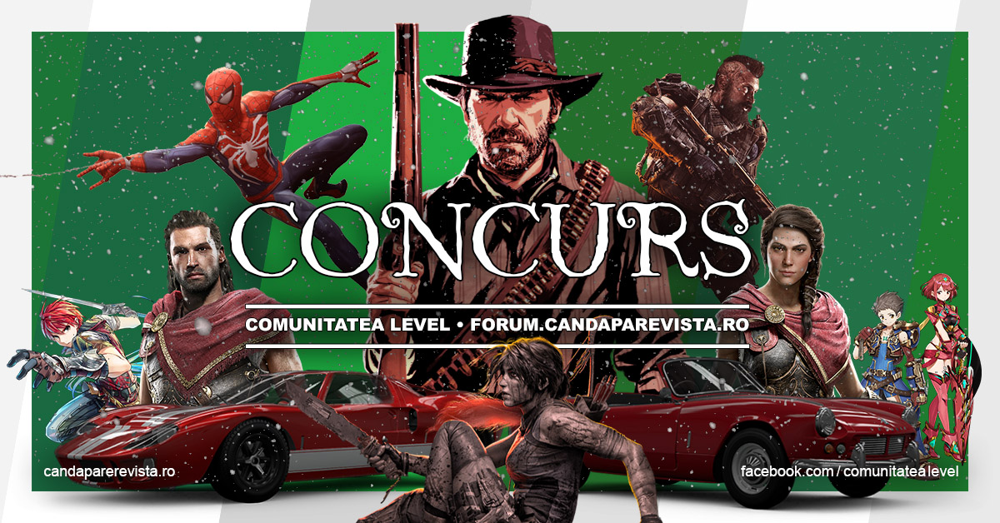

Gameri de pretutindeni, cu ocazia [lansării site-ului candaparerevista.ro](/blog/2018/10/gold/) (și fix la timp pentru Moș Niculae!) avem pentru voi un concurs care sperăm să vă placă.

### Cine suntem noi?
Cei din comunitatea LEVEL deja ne știți, pentru toți ceilalți, suntem o mână de entuziaști care administrează [forumul candaparerevista](https://forum.candaparerevista.ro/), urmașul spiritual al forumului revistei LEVEL. De curând am lansat și site-ul pe care vă aflați, unde puteți găsi review-uri scrise de utilizatori de pe forum și retrospective săptămânale din industria jocurilor.

### Cum participați la concurs?
Răspundeți [aici pe forum](https://forum.candaparerevista.ro/viewtopic.php?f=87&t=1980&p=88326) la întrebarea **„Care e jocul tău preferat din 2018 și de ce?”**.

### Ce aveți voi de câștigat?
Unui norocos i se va oferi prin tragere la sorți unul dintre jocurile de mai jos în format fizic, în funcție de sistemul preferat:

#### PS4
* Red Dead Redemption 2
* Assassin's Creed Odyssey
* Marvel's Spider-Man

#### Xbox One
* Red Dead Redemption 2
* Assassin's Creed Odyssey
* Forza Horizon 4

#### Nintendo Switch
* Ys VIII Lacrimosa of Dana
* Starlink Battle for Atlas Starter Pack
* Xenoblade Chronicles 2

#### PC
* Assassin's Creed Odyssey
* Shadow of the Tomb Raider
* Call of Duty Black Ops 4

### Ce avem noi de câștigat?
Vrem să ne răsplătim comunitatea, dar și să întâlnim oameni pasionați de jocuri cu care să împărtășim impresii și păreri despre jocuri (și nu numai!) pe forumul nostru.

### Cât durează concursul?
Înscrierile pentru concurs se încheie pe data de 4 Decembrie, iar pe 6 Decembrie vom anunța câștigătorul. ■