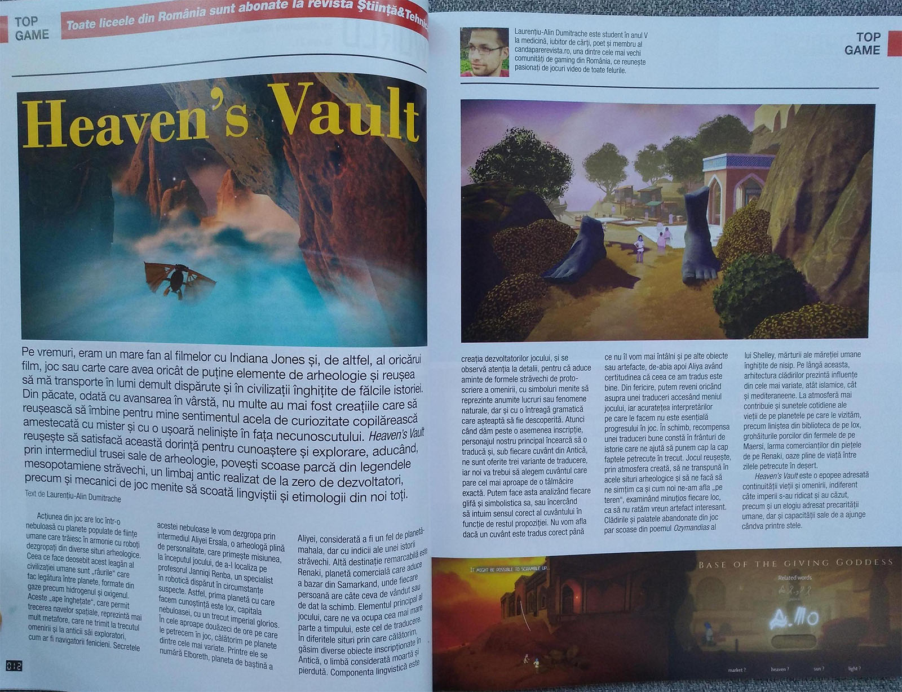
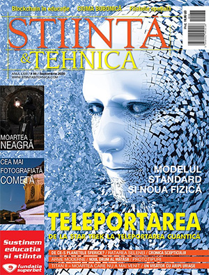

De câteva săptămâni încoace, aproape printr-o întâmplare, s-a înfiripat o colaborare între comunitatea noastră și [revista Știință & Tehnică](https://stiintasitehnica.com/). Astfel, membrii forumului au acum posibilitatea să contribuie cu articole despre jocuri care să aibă legătură tematică cu profilul revistei: știință, inginerie, antropologie, anticipație, medicină etc. Găsiți mai multe [detalii pe forum](https://forum.candaparerevista.ro/viewtopic.php?f=90&t=2514).

Astfel că, începând de luna asta, avem primul articol publicat. Review-ul jocului **Heaven's Vault**, scris de un membru al comunității noastre, a apărut în [numărul pe septembrie](https://scontent.fotp3-3.fna.fbcdn.net/v/t1.0-9/118722374_3285201961547640_1336186719365648367_n.jpg?_nc_cat=102&_nc_sid=e3f864&_nc_ohc=PYY65tdDTbIAX_ip-vJ&_nc_ht=scontent.fotp3-3.fna&oh=2321d3732f1a00268b612cb4e6ac58c4&oe=5F7D685F) al revistei.

Un alt articol este deja gata de publicare, iar pe forum ne pregătim de următorul, un [articol special](https://forum.candaparerevista.ro/viewtopic.php?f=90&t=2515) la care oricine poate contribui. Vă așteptăm!

