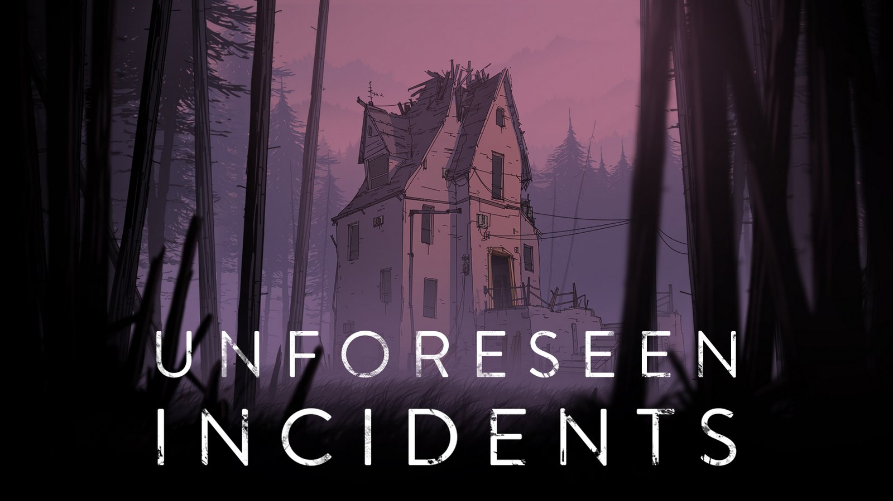

> _Retrospectiva săptămânii_ este rubrica duminicală în care trecem în revistă evenimentele săptămânii de pe frontul de gaming: știri şi articole (scrise de alții, bineînțeles, că e mai ușor aşa), industrie, lansări, oferte de jocuri, toate numai de savurat la cafeaua de duminică dimineața. (Și la care oricine poate contribui. ^[Dacă ai citit vreun articol sau vreo știre interesantă și crezi că merită inclusă în retrospectiva săptămânii, te așteptăm cu recomandarea ta pe forum, pe unul din topicurile dedicate: [Știri](https://forum.candaparerevista.ro/viewtopic.php?f=4&t=46), [Articole](https://forum.candaparerevista.ro/viewtopic.php?f=4&t=206), [Gaming România](https://forum.candaparerevista.ro/viewtopic.php?f=4&t=1622), [Oferte jocuri](https://forum.candaparerevista.ro/viewtopic.php?f=62&t=25)] )

Inaugurăm cu acest articol o rubrică nouă, cu apariție duminicală, pe care sperăm să reușim s-o menținem cât mai mult timp. În principal va fi doar o colecție de linkuri cu comentarii ocazionale, despre ce s-a mai întâmplat în _gaming_ și ce articole mișto am mai citit prin alte părți. Linkurile le luăm din ce se postează pe forum și din ce mai citim noi. Și vom încheia cu recomandarea unui titlu de jucat pentru săptămâna următoare, un joc care merită încercat (nu obligatoriu o apariție recentă). Ca și orice altceva de pe site, rubrica e deschisă oricui vrea să contribuie cu un link sau chiar cu toată postarea.

Forma articolului s-ar putea să mai sufere modificări, așa că să nu fiți surprinși dacă data viitoare vor fi, să zicem, două articole în loc de unul, sau schimbăm secțiunile.

### Ştiri
* A [murit](https://zonait.tv/criticul-de-jocuri-john-bain-a-decedat/) John Bain aka 'TotalBiscuit'; avea doar 33 ani. 
* _Visual novels_ și alte jocuri cu conținut explicit sunt în pericol de a fi [excluse de pe steam](http://gamasutra.com/view/news/318380/Valve_threatens_to_pull_games_now_deemed_sexually_explicit_from_Steam.php).
* Apple a respins accesul [aplicației Steam Link](https://arstechnica.com/gaming/2018/05/valve-apple-wont-let-the-steam-link-app-on-the-ios/) pe App Store. Știrea e amuzantă dintr-un anumit punct de vedere.
* Lansarea lui **The Wolf Among Us 2** [se amână pe 2019](https://telltale.com/news/2018/05/the-wolf-among-us-2-coming-in-2019/). Telltale zic că motivul întârzierii este dorința de a experimenta mai mult cu modul în care își prezintă jocul povestea. Rămâne de văzut dacă asta se va traduce într-o schimbare radicală a rețetei cu care ne-au obișnuit.
* Următorul joc **Halo** e un [_arcade cabinet_ 4K](https://www.halowaypoint.com/en-us/news/first-look-halo-fireteam-raven-arcade-experience) pentru patru jucători. normal. What?!

### Articole (critică, dev, design)
* [The Myth of the Monomyth](http://www.gamasutra.com/blogs/WolfgangWalk/20180514/318014/The_Myth_of_the_Monomyth.php) (Gamasutra)
* (Q&A) [How the BattleTech devs built an engrossing tactics game on a budget](http://gamasutra.com/view/news/318335/How_the_BattleTech_devs_built_an_engrossing_tactics_game_on_a_budget.php) (Gamasutra)
* [Sonic & All-Stars Racing Transformed turned the mascot racer into serious competition](https://www.rockpapershotgun.com/2018/05/24/sonic-all-stars-racing-transformed-turned-the-mascot-racer-into-serious-competition/) (RPS)
* [Confessions of a teenage asset ripper](https://www.rockpapershotgun.com/2018/05/24/confessions-of-a-teenage-asset-ripper/) (RPS)
* [Opinion: So, you want to talk about porn on Steam](http://gamasutra.com/view/news/318836/Opinion_So_you_want_to_talk_about_porn_on_Steam.php) (Gamasutra)
* [How GDPR is affecting the games you love](https://www.engadget.com/2018/05/26/how-gdpr-is-affecting-the-games-you-love/) (Engadget)
* [Mike Bithell’s Quarantine Circular is a fantastic conversation with an alien](https://www.polygon.com/2018/5/22/17376610/quarantine-circular-review-pc-mike-bithell) (Polygon) + [Honesty contributed to Subsurface Circular's 2 percent refund rate](http://gamasutra.com/view/news/318848/Honesty_contributed_to_Subsurface_Circulars_2_percent_refund_rate.php) (Gamasutra)
* [Analysis: Player interest in Call of Duty’s campaigns is cratering](https://arstechnica.com/gaming/2018/05/analysis-player-interest-in-call-of-dutys-campaigns-is-cratering/) (Ars Technica)
* [Why it feels great to hit things in Vermintide 2](https://www.rockpapershotgun.com/2018/05/23/why-it-feels-great-to-hit-things-in-vermintide-2/) (RPS)
* (Video) [Josh Sawyer shares a boatload of design insight from Pillars of Eternity II] (http://gamasutra.com/view/news/318822/Josh_Sawyer_shares_a_boatload_of_design_insight_from_Pillars_of_Eternity_II.php) (Gamasutra)
* [It’s (Potentially) Dangerous to Go Alone – Exploring the Fog of War](https://oldgrizzledgamers.com/idle-thoughts/the-fog-of-war-a-brief-history/), o scurtă istorie a unui element ce pare acum nelipsit din jocurile de strategie. (Old Grizzled Gamers)
* [Being the boss of Dragon Age](https://www.eurogamer.net/articles/2018-05-25-being-the-boss-of-dragon-age): Mike Laidlow despre 15 ani de jocuri la BioWare (Eurogamer)
* [Tim Schafer: “I haven't made my best game yet”](https://www.gamesindustry.biz/articles/2018-05-23-tim-schafer-i-havent-made-my-best-game-yet) (gamesindustry.biz)
* [FTL and Into the Breach: Two-of-an-unkind](https://www.gamesindustry.biz/articles/2018-05-23-ftl-and-into-the-breach-two-of-an-unkind) (gamesindustry.biz)

### Made în România
* 20 mai: s-a închis forumul computergames.ro. Anunţul fusese făcut cu o lună în urmă, pe 20 aprilie, odată cu [închiderea site-ului](https://www.paginademedia.ro/2018/04/site-ul-computergamesro-s-a-inchis-dupa-20-de-ani-de-ce). O parte dintre useri încearcă să reconstruiască forumul [aici](https://forum.computergamers.ro/). Arhive ale forumului pot fi găsite [aici](https://revistevechi.awiki.org/computer_games).
* 20 mai: s-a [încheiat ediţia 2018](https://zonait.tv/est-european-comic-con-2018-inca-o-editie-fara-cusur/) a East European Comic Con.
* 25 mai: Jocul [Yaga](http://yaga-game.com/), al studioului românesc [Breadcrumbs Interactive](https://breadcrumbsinteractive.com/), [a câștigat concursul Nordic Discovery Contest](https://discovery-contest.nordicgame.com/ngdc-season-ii-grand-finals-awards/) desfășurat în cadrul ediției 2018 (23-25 mai) a Nordic Game Conference ce se ține anual în Suedia, la Malmö. Pentru context, concursul Discovery Contest se desfășoară pe parcursul mai multor runde timp de un an, la această ediție participând peste 400 de jocuri, iar finaliștii se întrec în cadrul conferinței anuale. Totodată, acest concurs este separat de competiția Nordic Game Awards, care se desfășoară în cadrul aceleiași conferințe și care a fost câștigat de action-ul Echo. (De menționat că pe lista scurtă a finaliștilor Discovery Contest s-a aflat încă un joc românesc, **Second Hand: Frankie’s Revenge**, al studioului [Rikodu](http://www.rikodu.com/)).

### Anunţuri şi lansări de jocuri
#### Anunţate
* 23 mai: [Battlefield V](https://www.rockpapershotgun.com/2018/05/23/battlefield-v-is-about-making-friends-building-forts-and-daily-chores/)
* **Stoneshard**, un roguelike open-world cu estetică pixel art, are acum o [campanie pe kickstarter](https://www.kickstarter.com/projects/1926605606/stoneshard-open-world-roguelike-rpg-with-tactical). Jocul va fi lansat în early access în decembrie 2018.

#### Lansate
* 21 mai: [The Elder Scrolls Online: Summerset](https://www.elderscrollsonline.com/en-us/updates/chapter/summerset), un nou expansion pentru ESO.
* 22 mai: [Ancestors Legacy](https://destructivecreations.pl/ancestors-legacy/) ([Steam](https://store.steampowered.com/app/620590/Ancestors_Legacy/), [Humble](https://www.humblebundle.com/store/ancestors-legacy)).
* 24 mai: [Unforeseen Incidents](http://www.unforeseen-incidents.com/), adventure point'n click ([Steam](https://store.steampowered.com/app/501790/Unforeseen_Incidents/), [gog.com](https://www.gog.com/game/unforeseen_incidents), [Humble](https://www.humblebundle.com/store/unforeseen-incidents)).
* 24 mai: [Dark Souls Remastered](https://www.bandainamcoent.com/games/ds-remastered) ([Steam](https://store.steampowered.com/app/570940/DARK_SOULS_REMASTERED/)). Este singura versiune în care se mai poate achiziționa pe PC această veritabilă legendă action-RPG. Varianta lansată inițial în 2012 a fost retrasă - cei care o dețin o pot însă accesa în continuare și beneficiază de reducere cu 50% la versiunea Remastered.
* 24 mai: [Bloodstained: Curse of the Moon](http://curseofthemoon.com/en/), un metroidvania retro-pixelat ca multe altele, doar că ăsta e și bun ([Steam](https://store.steampowered.com/app/838310/Bloodstained_Curse_of_the_Moon/)).

### Oferte jocuri
#### Humble Bundle
* La [bundle-ul lunii iunie](https://www.humblebundle.com/monthly), care debutase cu [Destiny 2](https://www.humblebundle.com/store/destiny-2), au fost adăugate ca _early unlocks_ și jocurile [Pillars of the Earth](https://www.humblebundle.com/store/ken-folletts-the-pillars-of-the-earth) și [Cook, Serve, Delicious 2](https://www.humblebundle.com/store/cook-serve-delicious-2). Bundle-ul costă 12$ și poate fi achiziționat până pe 1 iunie, când vor fi disponibile și restul jocurilor din pachet.
* Până pe 29 mai este încă disponibil [bundle-ul cu jocuri multiplayer](https://www.humblebundle.com/games/hooked-on-multiplayer-2018-bundle) care se remarcă în special prin două dintre titlurile preferate ale forumului: **Duck Game** (la nivelul de mijloc, aprox. 4,6€) și **Rocket League** (la nivelul superior, 12€).
* Sunt ultimele zile și pentru [Spring Sale](https://www.humblebundle.com/store), cu o mulțime de jocuri reduse. Nimic nemaivăzut, procentele obișnuite pentru acest gen de promoții pe Humble, dar asta nu înseamnă că nu găsiți un preț bun dacă căutați. Câteva recomandări: [Darkest Dungeon](https://www.humblebundle.com/store/darkest-dungeon) (€8,79), [Prison Architect](https://www.humblebundle.com/store/prison-architect) (€6,49), [Bayonetta](https://www.humblebundle.com/store/bayonetta) (€9,99), [Slay the Spire](https://www.humblebundle.com/store/slay-the-spire) (€12,79). Și dacă aveți un abonament activ la Humble Monthly, aveți o reducere suplimentară de 10% la prețurile din store.

#### Steam
Aici e în desfășurare [Spring Cleaning Event](https://store.steampowered.com/springcleaning). O mulțime de jocuri sunt free to play până pe data de 28 mai și pot fi achiziționate la reducere. Câteva recomandări: [Tyranny](https://store.steampowered.com/app/362960/Tyranny/) (14,27€), [Borderlands 2](https://store.steampowered.com/app/49520/Borderlands_2/) (7,49€), [Shadow of Mordor](https://store.steampowered.com/app/241930/Middleearth_Shadow_of_Mordor/) (8€), [Don’t Starve Together](https://store.steampowered.com/app/322330/Dont_Starve_Together/) (8,99€), [Cities Skylines](https://store.steampowered.com/app/255710/Cities_Skylines/) (6,99€) și [Dead by Daylight](https://store.steampowered.com/app/381210/Dead_by_Daylight/) (9,99€), [Grim Fandango Remastered](https://store.steampowered.com/app/316790/Grim_Fandango_Remastered/) (2,99€), [Pathologic Classic HD](https://store.steampowered.com/app/384110/Pathologic_Classic_HD/) (1,94€), [Gorky 17](https://store.steampowered.com/app/253920/Gorky_17/) (0,99€).

#### gog.com
* [Promoția de weekend](https://www.gog.com/promo/20180525_weekend_thq): **Delta Force 1** și **2** (1,49$), **Imperium Galactica II** (3,29$), **AquaNox 1** și **2** (1,49$), **Summoner** (1,49$), **Codename Panzers: Phase One** & **Two** (3,74$ fiecare), **Nexus: The Jupiter Incident** (2,49$), **Silver** (2,99$) și altele
* [Promoția săptămânală](https://www.gog.com/promo/20180521_weekly_sale): **Ground Control 1** & **2**, **Aliens vs Predator Classic**, **Empire Earth**, **Lords of Magic**, **Moonbase Commander** (2$ fiecare), **The 7th Guest** (1,19$)

#### Fanatical
Aici, pentru bani mai puțini, puteți găsi de obicei jocuri multe și cel puțin decente. Săptămâna asta recomandarea ar fi [All Stars X Bundle](https://www.fanatical.com/en/bundle/all-stars-x-bundle): pentru doar 2,09€ vă alegeți cu 10 jocuri, printre care **Chroma Squad**, **Skullgirls**, **Deadlight**, **The Way**, **12 is Better Than 6** și altele. Chiar dacă aveți deja unele dintre ele, e o ofertă foarte bună.

## Recomandarea săptămânii: _Unforeseen Incidents_

[Unforeseen Incidents](http://www.unforeseen-incidents.com/) (site oficial) este unul dintre cele mai interesante jocuri adventure din ultima vreme, extraordinar de arătos, cu o poveste interesantă și gameplay pe măsură. (vezi şi [discuţiile pe forum](https://forum.candaparerevista.ro/viewtopic.php?f=8&t=1820))

Iată şi câteva review-uri: [New Game Network](https://www.newgamenetwork.com/article/1901/unforeseen-incidents-review/), [Adventure Gamers](https://adventuregamers.com/articles/view/35212), [RPS](https://www.rockpapershotgun.com/2018/05/25/wot-i-think-unforeseen-incidents/#more-546445), [Venture Beat](https://venturebeat.com/2018/05/29/unforeseen-incidents-review-a-mystery-with-a-few-too-many-punchlines/).