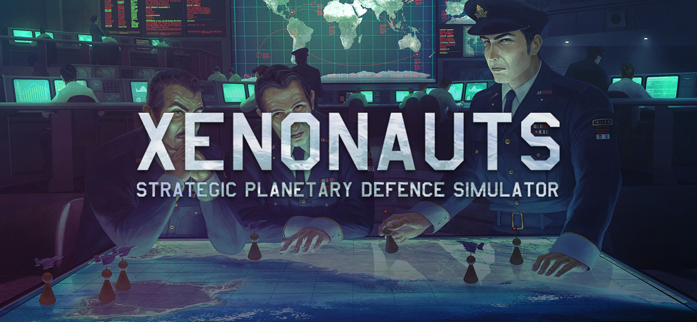

> _Retrospectiva săptămânii_ este rubrica duminicală în care trecem în revistă evenimentele săptămânii de pe frontul de gaming: știri şi articole (scrise de alții, bineînțeles, că e mai ușor aşa), industrie, lansări, oferte de jocuri, toate numai de savurat la cafeaua de duminică dimineața. (Și la care oricine poate contribui. ^[Dacă ai citit vreun articol sau vreo știre interesantă și crezi că merită inclusă în retrospectiva săptămânii, te așteptăm cu recomandarea ta pe forum, pe unul din topicurile dedicate: [Știri](https://forum.candaparerevista.ro/viewtopic.php?f=4&t=46), [Articole](https://forum.candaparerevista.ro/viewtopic.php?f=4&t=206), [Gaming România](https://forum.candaparerevista.ro/viewtopic.php?f=4&t=1622), [Oferte jocuri](https://forum.candaparerevista.ro/viewtopic.php?f=62&t=25)] )

### Ştiri
* The World Health Organization [a anunțat includerea „gaming disorder” pe lista tulburărilor psihice](https://edition.cnn.com/2018/06/18/health/video-game-disorder-who/index.html) în ediția 11 a International Classification of Diseases. Cum era de așteptat, [industria jocurilor se opune cu vehemență acestei clasificări](https://www.pcgamer.com/games-industry-pushes-back-against-the-world-health-organizations-new-gaming-disorder-classification/). (PC Gamer)
* **Xenonauts 2** apelează la [crowdfunding prin Kickstarter](https://www.kickstarter.com/projects/69341191/xenonauts-2-strategic-planetary-defence-simulator), dupa 3 ani de dezvoltare, ocazie cu care au lansat și un demo jucabil.
* Steam oferă acum posibilitatea de a vedea câți bani ai cheltuit pe jocuri de-a lungul timpului. Totalul se poate verifica foarte simplu accesând [acest link](https://help.steampowered.com/en/accountdata/AccountSpend).
* Diablo 1 a fost reverse engineered iar codul său sursă este acum [disponibil pe GitHub](https://github.com/galaxyhaxz/devilution).
* [Microsoft renunță la planurile de dezvoltare VR pe Xbox](https://www.theverge.com/2018/6/20/17485852/microsoft-xbox-one-no-vr-headset-support-windows-mixed-reality-e3-2018) (The Verge)
* [16 studiouri renunță la un presupus spyware inclus în jocurile lor, după scandalul făcut de fani](https://steamed.kotaku.com/16-studios-removing-alleged-spyware-from-pc-games-after-1826966946). Câteva dintre jocurile „afectate” sunt **The Elder Scrolls Online**, **Conan Exiles**, **Secret World Legends** și **Warhammer: Vermintide**. (Kotaku)
* [Escape from Monkey Island](https://www.gog.com/news/release_escape_from_monkey_island) este acum disponibil pe GOG.

### Articole (critică, dev, design)
* [One Finger Death Punch is the Perfect Action Game](http://www.kotaku.co.uk/2018/06/19/one-finger-death-punch-is-the-perfect-action-game) (Kotaku)
* [Four developers of scary games explain how to make scary games very scary indeed](https://www.rockpapershotgun.com/2018/06/21/four-developers-of-scary-games-explain-how-to-make-scary-games-very-scary-indeed/) (RPS)
* [Un articol cuprinzător](https://www.filfre.net/2018/06/another-world/) despre arta din Another World - un cult classic franțuzesc
* [Developers Say Twitch is Hurting Single-Player Games](http://www.ign.com/articles/2018/06/19/developers-say-twitch-is-hurting-single-player-games) (IGN)
* [66% of console players still prefer physical games over digital](https://www.gamasutra.com/view/news/320224/Analyst_66_of_console_players_still_prefer_physical_games_over_digital.php) (Gamasutra)
* [Elijah Wood on Why He’s Making a Video Game](https://variety.com/2018/gaming/features/elijah-wood-transference-ubisoft-1202849603/) (Variety)
* [Why Warner Bros. keeps picking up new games and studios](https://venturebeat.com/2018/06/19/why-warner-bros-keeps-picking-up-new-games-and-studios/) (Venture Beat)
* (Video) [Procedurally generating history in Caves of Qud] (https://www.gamasutra.com/view/news/320624/Video_Procedurally_generating_history_in_Caves_of_Qud.php) (Gamasutra)

### Anunţuri şi lansări de jocuri
#### Anunţate
* **Life is Strange 2** - primul episod va fi lansat pe [27 septembrie 2018](https://twitter.com/LifeIsStrange/status/1010175578811625472).
* **Valkyria Chronicles 4** are acum o dată de lansare ([25 septembrie 2018](https://twitter.com/SEGA/status/1009104141652713472)) și este disponibil pentru preorders.

### Oferte jocuri
#### Humble Bundle
* [Konami Sale](https://www.humblebundle.com/store/promo/konami-digital-entertainment-sale/). Sunt la reducere ultimele jocuri din seria Metal Gear Solid, Castlevania și Pro Evolution Soccer 2018.

#### Steam
* A început [**Summer Sale**](https://store.steampowered.com/). Pe lângă numeroasele oferte nu lipsește tradiționala activitate de comunitate. Anul ăsta avem un minigame cu extratereștri care oferă șansa de a câștiga unul din jocurile puse la bătaie (Apotheon, Legend of Grimrock 2, Botanicula și multe altele). Pentru reduceri avem câteva recomandări de pe forum: [XING - The Land Beyond](https://store.steampowered.com/app/299400/XING_The_Land_Beyond/) (11,99 €), [Prey](https://store.steampowered.com/app/480490/Prey/) (14,99 €), [Rumu](https://store.steampowered.com/app/723270/Rumu/) (9,99 €), [STASIS](https://store.steampowered.com/app/380150/STASIS/) (5,59 €), [Caves of Qud](https://store.steampowered.com/app/333640/Caves_of_Qud/) (8,99€), [The Painscreek Killings](https://store.steampowered.com/app/624270/The_Painscreek_Killings/) (4,99 €) și [Dragon’s Lair](https://store.steampowered.com/app/227380/Dragons_Lair/) (4,99 €). Acesta din urmă este și una dintre nominalizările la Gaming Club. Dacă îl luați, împărtășiți-ne impresiile voastre pe [threadul său](https://forum.candaparerevista.ro/viewtopic.php?f=82&t=1823).

#### gog.com
* Este [weekendul Daedalic pe GOG](https://www.gog.com/promo/20180622_daedalic_weekend). Dacă n-ați profitat de ofertele din ultimele săptămâni, o puteți face acum.

#### Fanatical
* [Indie Legends 8 Bundle](https://www.fanatical.com/en/bundle/indie-legends-8-bundle) - doar €3.69 și merită pentru Fahrenheit, **Convoy** (Mad Max indie, pentru care avem și noi review pe site), **Organ Trail**, **Train Valley** (un puzzle drăguț cu trenulețe) și bineînțeles trilogia **Broken Sword**.

#### Altele
* [Summer Sale](https://itch.io/) pe itch.io

## Recomandarea săptămânii

**Xenonauts** este probabil cea mai apropiată reconstituire de dată recentă a ceea ce a fost seria X-Com (a nu se confunda cu XCOM-urile moderne). În așteptarea sequelului proaspăt anunțat, vă recomandăm să puneți mâna pe el și să vă faceți încălzirea. Este oferit la reducere pe Steam, [pentru doar 5,74 €](https://store.steampowered.com/app/223830/Xenonauts/).
