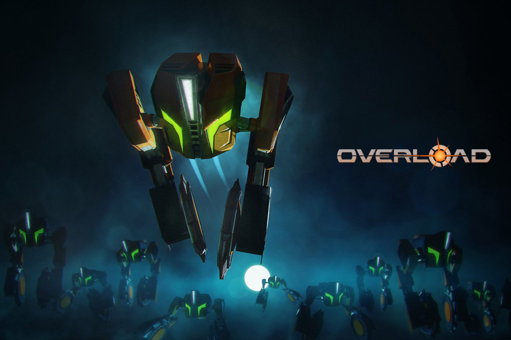

> _Retrospectiva săptămânii_ este rubrica duminicală în care trecem în revistă evenimentele săptămânii de pe frontul de gaming: știri şi articole (scrise de alții, bineînțeles, că e mai ușor aşa), industrie, lansări, oferte de jocuri, toate numai bune de savurat la cafeaua de duminică dimineața. (Și la care oricine poate contribui. ^[Dacă ai citit vreun articol sau vreo știre interesantă și crezi că merită inclusă în retrospectiva săptămânii, te așteptăm cu recomandarea ta pe forum, pe unul din topicurile dedicate: [Știri](https://forum.candaparerevista.ro/viewtopic.php?f=4&t=46), [Articole](https://forum.candaparerevista.ro/viewtopic.php?f=4&t=206), [Gaming România](https://forum.candaparerevista.ro/viewtopic.php?f=4&t=1622), [Oferte jocuri](https://forum.candaparerevista.ro/viewtopic.php?f=62&t=25)] )

### Ştiri
* 29 mai: după NES şi SNES, vom avea o nouă retro-consolă pe piaţă: [Intellivision](https://www.destructoid.com/-update-it-s-2018-and-there-s-a-new-intellivision-console-505177.phtml)
* 29 mai: PUBG [dă în judecată](https://gamasutra.com/view/news/319017/PUBG_Corp_files_copyright_infringement_lawsuit_against_Fortnite_dev_Epic_Games.php) Fortnite pe probleme de battle royale.
* 30 mai: Controversatul joc Active Shooter este interzis pe Steam ([Eurogamer](https://www.eurogamer.net/articles/2018-05-25-valve-steam-school-shooting-game), [Gamasutra](https://gamasutra.com/view/news/319029/Valve_removes_mass_shooting_game_and_its_troll_dev_from_Steam.php))
* 30 mai: Epic Games declară că [anunțul lui S.T.A.L.K.E.R 2 a fost pripit](http://www.ign.com/articles/2018/05/30/stalker-2-was-announced-without-consulting-anyone)
* 1 iunie: Evolve [îşi pregăteşte trecerea](https://www.eurogamer.net/articles/2018-06-02-the-end-is-near-for-evolve) către Veşnicele Plaiuri ale Vânătorii. Dacă nu l-aţi încercat până acum (există şi o variantă free2play), nu mai aveţi mult timp.
* 1 iunie: Bungie lucrează la un joc nou de 100 de milioane de dolari([Kotaku](https://kotaku.com/bungie-gets-100-million-for-new-non-destiny-game-1826496634), [PC Gamer](https://www.pcgamer.com/bungie-partners-with-chinese-gaming-company-to-create-new-worlds/))

### Articole (critică, dev, design)
* (Interviu) [“We accommodate for every stupid thing that you wanna do” – how Disco Elysium makes detective games work](https://www.rockpapershotgun.com/2018/05/29/disco-elysium-rpg-details/) (RPS)
* [20 years of Fallout: Lessons learned shipping games in the wasteland](https://www.gamasutra.com/view/news/258465/20_years_of_Fallout_Lessons_learned_shipping_games_in_the_wasteland.php) (Gamasutra)
* [The future of CRPGs beyond nostalgia - Three developers weigh in on the direction of the revitalised genre](https://www.pcgamer.com/the-future-of-crpgs/) (PC Gamer)
* [The great video game exodus](https://www.gamasutra.com/view/news/318588/The_great_video_game_exodus.php) (Gamasutra)
* [Paradox: "If a game can't be played for 500 hours we probably shouldn't be publishing it"](https://www.gamesindustry.biz/articles/2018-05-31-paradox-if-a-game-cant-be-played-for-500-hours-we-probably-shouldnt-be-publishing-it) (gamesindustry.biz)
* Poate v-ar interesa să aruncaţi un ochi pe [Game Design Document](http://www.pixsoriginadventures.co.uk/ultima-underworld-3-design-document/) pentru defunctul Ultima Underworld 3? Şi dacă tot ajungeţi pe blogul lui Pix, mai staţi puţin şi exploraţi, aveţi destule de citit, mai ales dacă sunteţi pasionaţi de jocurile Origin (sau alte jocuri vechi).  (via [RPGCodex](http://www.rpgcodex.net/forums/index.php?threads/design-document-for-cancelled-ultima-underworld-3-project-unveiled-by-origin-historian-pix.122216/))
* [Game companies need to cut the crap—loot boxes are obviously gambling](https://arstechnica.com/gaming/2018/05/op-ed-game-companies-need-to-cut-the-crap-loot-boxes-are-obviously-gambling/) (Ars Technica)
* Despre cum se crează un oraş open-world: [Mafia 3's World Fabric](https://www.gamasutra.com/blogs/NathanCheever/20180601/319240/Mafia_3s_World_Fabric.php). Autorul continuă cu acest articol o serie despre “hărţile” la care a lucrat, inclusiv [Mafia 3's World Maps](https://gamasutra.com/blogs/NathanCheever/20180413/315925/) (Gamasutra)
* [The Evolution of Boss Designs in Video Games](https://www.gamasutra.com/blogs/JoshBycer/20180531/319068/The_Evolution_of_Boss_Designs_in_Video_Games.php) (Gamasutra)
* PC Gamer şi-au făcut singuri un [_fanzine_ al propriei reviste](https://www.pcgamer.com/we-made-a-pc-gamer-indie-zine-read-it-for-free-here/). Dacă nu-ţi face nimeni, fă-ţi singur, nu? (PC Gamer)
* Un [ditamai articolul](https://www.polygon.com/2018/5/29/17386066/the-rocky-story-of-retro-studios-before-metroid-prime) despre Retro, studioul din spatele Metroid Prime. (Polygon)

### Made în România
* 29 mai și 30 mai: Destructoid au [un articol despre Yaga](https://www.destructoid.com/yaga-is-a-charming-action-rpg-take-on-slavic-folklore-505037.phtml) și [altul despre Second Hand: Frankie's Revenge](https://www.destructoid.com/co-op-action-game-second-hand-frankie-s-revenge-nails-melee-combat-505023.phtml), cu prilejul participării în finala Nordic Discovery Contest de [săptămâna trecută]().
* 29-31 mai: a avut loc [Indie Prize](http://www.indieprize.org/london2018/index.html) în cadrul Casual Connect Londra 2018, unde au participat două jocuri româneşti: [Raiders Of The Lost Island](http://www.raidersofthelostisland.com/) al lui Alexandru Simion (omul din spatele motorului [DizzyAge](http://www.yolkfolk.com/dizzyage/)) (vezi şi [Steam](https://store.steampowered.com/app/867980/Raiders_Of_The_Lost_Island/)), iar cel de-al doilea joc e [Interrogation](https://critique-gaming.com/interrogation/) al celor de la [Critique Gaming](https://critique-gaming.com/).
* 1 iunie s-a lansat [Azuran Tales: Trials](https://trials.azurantales.com/) de la studioul [Tiny Trinket Games](http://tinytrinket.games/press/sheet.php?p=azuran_tales_trials) ([Steam](https://store.steampowered.com/app/848200/Azuran_Tales_Trials/)).

### Anunţuri şi lansări de jocuri
#### Anunţate
* 29 mai: re-release (sau doar release, în cazul PC-ului), pentru **Killer7** ([Eurogamer](https://www.eurogamer.net/articles/2018-05-29-gamecube-classic-killer7-is-getting-a-pc-re-release)).
* 30 mai: **Fallout 76** teased şi apoi anunţat ([Eurogamer](https://www.eurogamer.net/articles/2018-05-30-bethesda-announces-fallout-76), [RPS](https://www.rockpapershotgun.com/2018/05/30/fallout-76-trailer/)). Ceea ce pare să fi creat o atenţie destul de mare: [Bethesda stream for new Fallout game pulls 2m unique viewers](https://www.gamesindustry.biz/articles/2018-05-31-bethesda-twitch-stream-for-new-fallout-game-pulls-2m-unique-viewers) (gamesindustry.biz). Sau, în funcţie de cum vrei să priveşti, [Bethesda trolled 2 million Fallout fans for 24 hours, and it was glorious](https://www.polygon.com/2018/5/31/17412688/fallout-76-bethesda-stream-twitch) (Polygon).
* 30 mai: **Team Sonic Racing** ([Eurogamer](https://www.eurogamer.net/articles/2018-05-30-walmart-leaks-switch-game-team-sonic-racing), [PC Gamer](https://www.pcgamer.com/team-sonic-racing-a-co-op-driven-kart-racer-has-a-reveal-trailer/)). Anunţul vă entuziasmează pentru că v-a plăcut **Sonic & All-Stars Racing Transformed** şi sunteţi de părere că e unul dintre cele mai bune jocuri de kart racing.
* 30 mai: Spiderweb Software, compania/omul din spatele seriilor **Avadon**, **Avernum** şi **Geneforge** a lansat un [Kickstarter](https://www.kickstarter.com/projects/619141553/queens-wish-the-conqueror) pentru o serie nouă: Queen’s Wish. Şi au şi fost finanţaţi: [We Did Our First Kickstarter! And It Worked!](http://jeff-vogel.blogspot.com/2018/05/we-did-our-first-kickstarter-and-it.html).
* 31 mai: Următorul Assasin’s Creed este Odyssey şi a fost [confirmat de Ubisoft](https://twitter.com/assassinscreed/status/1002331391789617152), acțiunea părând a fi plasată ~~într-o bandă desenată~~ în Grecia antică. Mai multe detalii urmează la E3, în luna iunie.
* 1 iunie: data de lansare a lui **Underworld Ascendant**, succesorul spiritual al lui Ultima Underworld, [a fost stabilită](https://steamcommunity.com/games/692840/announcements/detail/1669027282164682404) pentru septembrie 2018 odată cu lansarea unui noi [trailer](https://youtu.be/Bk0oZtHKWfU)), dar preview-urile nu sunt foarte optimiste ([PC Gamer](https://www.pcgamer.com/underworld-ascendant-doesnt-feel-like-the-great-comeback-we-were-hoping-for/), [Ars Technica](https://arstechnica.com/gaming/2018/06/underworld-ascendant-world-premiere-hands-on-so-far-its-underwhelm-ascendant/)).
* 1 iunie: avem [dată de lansare](https://www.rockpapershotgun.com/2018/06/01/new-vegas-mod-fallout-new-california-due-this-october/) şi pentru mod-ul **Fallout: New California** (conversie totală pentru Fallout: New Vegas). După 5 ani de dezvoltare, va fi lansat anul acesta, pe 23 octombrie. 

#### Lansate
* 29 mai: [Street Fighter 30th Anniversary Collection](https://streetfighter.com/street-fighter-30th-anniversary-collection/), o colecție de 12 jocuri Street Fighter ([Steam](https://store.steampowered.com/app/586200/Street_Fighter_30th_Anniversary_Collection/), plus interesant: [Street Fighter 30th Anniversary Collection is a treasure trove of trivia](https://www.rockpapershotgun.com/2018/05/30/street-fighter-30th-anniversary-collection-is-a-treasure-trove-of-trivia/) (RPS), [Street Fighter 30th Anniversary Collection is arcade nostalgia done right](https://arstechnica.com/gaming/2018/05/street-fighter-30th-anniversary-collection-is-arcade-nostalgia-done-right/) (Ars Technica)).
* 29 mai: [Yoku's Island Express](http://villa-gorilla.com/), un platformer pinball open world (da, ce vă mirați?!) ([Steam](https://store.steampowered.com/app/334940/Yokus_Island_Express/)) (Reviews: [Waypoint](https://waypoint.vice.com/en_us/article/pav35n/yokus-island-express-is-metroid-plus-pinball-and-its-sooooooooooo-good), [Eurogamer](https://www.eurogamer.net/articles/2018-05-29-yokus-island-express-review), [Hardcore Gamer](https://www.hardcoregamer.com/2018/05/29/review-yokus-island-express/300547/)).
* 29 mai: [Unworthy](http://www.unworthygame.com/), “metroidvania soulslike” ([Steam](https://store.steampowered.com/app/613190/Unworthy/)).
* 29 mai: [Agony](http://agonygame.com/) ([Steam](https://store.steampowered.com/app/487720/Agony/)), un simulator de plimbăreală și supraviețuire prin iad. Se voia un joc dominat de imagini „tari”, 18+, dar o bună parte din el a fost cenzurată la lansare. Iar gameplay-ul, ei bine, nu este prea grozav. Sau cel puțin așa zice [IGN în reviewul lor](http://www.ign.com/articles/2018/05/31/agony-review).
* 29 mai: [Moonlighter](http://moonlighterthegame.com/), un simulator action-RPG/shop-management (conceptul ar trebui să vă fie familiar dacă aţi jucat Recettear) ([Steam](https://store.steampowered.com/app/606150/Moonlighter/), [gog.com](https://www.gog.com/game/moonlighter)).
* 31 mai: [Overload](https://playoverload.com/), succesorul spiritual al lui Descent ([Steam](https://store.steampowered.com/app/448850/Overload/)).
* 31 mai: [Cultist Simulator](http://weatherfactory.biz/cultist-simulator/), un simulator de… agricultură, ați ghicit! De la creatorul jocurilor Fallen London și Sunless Sea.  ([Steam](https://store.steampowered.com/app/718670/Cultist_Simulator/), [Humble Store](https://www.humblebundle.com/store/cultist-simulator), [gog.com](https://www.gog.com/game/cultist_simulator_perpetual_edition)) (Reviews: [Eurogamer](https://www.eurogamer.net/articles/2018-05-31-cultist-simulator-review), [RPS](https://www.rockpapershotgun.com/2018/05/31/cultist-simulator-review/)).
* 31 mai: [Milanoir](http://www.milanoirgame.com/), o pixeleală 2D de acțiune cu mafioți ieșiți din filmele italiene de dinainte de ‘89 ([Steam](https://store.steampowered.com/app/642830/Milanoir/), [gog.com](https://www.gog.com/game/milanoir)).

### Oferte jocuri
#### Humble Bundle
* Pentru împătimiții seriei ARMA, a ieșit [un nou bundle](https://www.humblebundle.com/games/arma-2018-bundle) care include diverse jocuri și expansionuri ale seriei.
* Early unlocks pentru [humble monthly-ul de luna viitoare](https://www.humblebundle.com/monthly) sunt [Hearts of Iron IV](https://www.humblebundle.com/store/hearts-of-iron-iv-cadet-edition), [Blackwake](https://www.humblebundle.com/store/blackwake) și [Portal Knights](https://www.humblebundle.com/store/portal-knights).

#### Steam
* Reduceri la jocurile [Games Workshop](https://store.steampowered.com/sale/skulls), inclusiv **Total War: Warhammer**.
* Promoție și la jocurile [Dungeons & Dragons](https://store.steampowered.com/sale/dungeonsdragons/), până pe 8 iunie, cu prețuri de 4-5€ pentru variantele enhanced ale **Planescape: Torment**, **Baldur’s Gate I** && **II** sau **Icewind Dale**, sau 7,5€ pentru **Lords of Waterdeep**.
 

#### gog.com
O singură promoţie în acest moment, o adunătură eclectică de [jocuri vechi şi indies moderne](https://www.gog.com/promo/20180528_weekly_sale), în care puteţi găsi, printre altele: **FlatOut 1** şi **2**, **Ghost Master**, **Sacred Gold** sau **Terminal Velocity**, la preţuri de 1,49$ / 1,99$, plus varianta remasterizată (ce include şi originalul) a lui **King of Dragon Pass**, la 7,19$.

#### Altele
* [Green Man Gaming](https://www.greenmangaming.com/) oferă 25% reducere la orice joc PC cumpărat de la ei. Pentru a beneficia de reducere trebuie să aplicați voucherul **JUNE25**. Puteţi achiziţiona astfel, de exemplu, [Tiny Rails](https://www.greenmangaming.com/games/tiny-rails/) (un sim cu trenuleţe pixel art) cu aprox. 4€.
* **Dishonored 2** este disponibil cu o reducere de 64% (14,49€) pe [DLGamer](https://www.dlgamer.com/eu/games/buy-dishonored-2-36333).

## Recomandarea săptămânii: _Overload_

[Overload](https://playoverload.com/) este, cu excepţia numelui, un nou joc Descent: se joacă la fel (inclusiv tastele default) şi e făcut de aceiaşi oameni. Şi chiar le-a ieşit cum trebuie. Are cam tot ce vreţi: nave, tuneluri întunecate şi niveluri labirintice, sfere de energie, camere secrete, lavă, un reactor care trebuie aruncat în aer (şi de care trebuie să fugi apoi), multiplayer (inclusiv LAN), VR, QTE-uri (just kidding) şi claustrofobie din plin. A, şi [are şi demo](https://store.steampowered.com/app/450220/Overload_Playable_Teaser_30/).

Iar dacă nu aţi fost fani Descent (what is wrong with you?), puteţi alege **Yoku's Island Express** sau **Cultist Simulator**, fiecare oferind o experienţă originală. Deci avem ceva pentru fiecare.