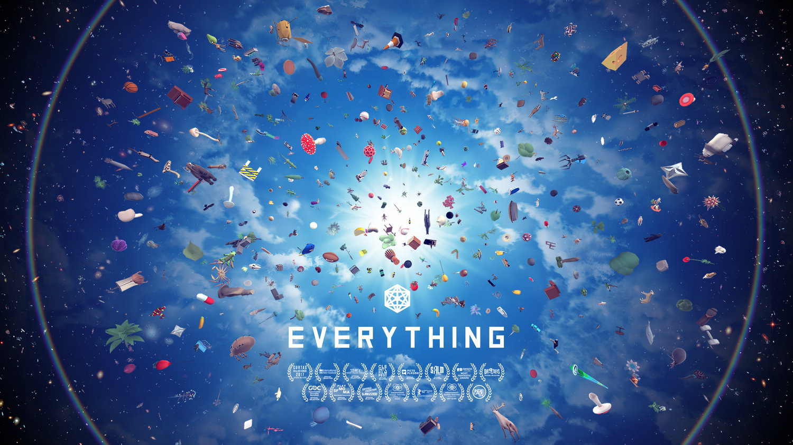

> _Retrospectiva săptămânii_ este rubrica duminicală în care trecem în revistă evenimentele săptămânii de pe frontul de gaming: știri şi articole (scrise de alții, bineînțeles, că e mai ușor aşa), industrie, lansări, oferte de jocuri, toate numai bune de savurat la cafeaua de duminică dimineața. (Și la care oricine poate contribui. ^[Dacă ai citit vreun articol sau vreo știre interesantă și crezi că merită inclusă în retrospectiva săptămânii, te așteptăm cu recomandarea ta pe forum, pe unul din topicurile dedicate: [Știri](https://forum.candaparerevista.ro/viewtopic.php?f=4&t=46), [Articole](https://forum.candaparerevista.ro/viewtopic.php?f=4&t=206), [Gaming România](https://forum.candaparerevista.ro/viewtopic.php?f=4&t=1622), [Oferte jocuri](https://forum.candaparerevista.ro/viewtopic.php?f=62&t=25)] )

## Ştiri
### E3
Săptămâna aceasta a fost, după cum ştiţi, dominată de desfăşurarea expoziţiei E3 în perioada 12-14 iunie, perioadă care a fost precedată însă de diverse conferinţe pre-expoziţionale. Aveţi mai jos o scurtă trecere în revistă a evenimentelor:

#### Jocuri anunţate

**The Elder Scrolls VI** (Bethesda), **Babylon’s Fall** (Platinum), **Metro Exodus** (4A Games), **Overcooked 2** (Ghost Town Games), **Sable** (Shedworks), **Control** (Remedy), **Maneater** (Blindside), **Just Cause 4** (Avalanche Studios), **Assassin's Creed Odyssey** (Ubisoft), **Command & Conquer Rivals** pentru mobile (EA), **My Friend Pedro** (Devolver), **Starfield** (Bethesda), **Doom Eternal** (Bethesda), **Wolfenstein Youngblood** (Machine Games), **Dying Light 2** (Techland), **Gears of War 5** (Microsoft), **Devil May Cry 5** (Capcom), **Forza Horizon 4** (Microsoft), **Sekiro: Shadows Die Twice** (From Software), **Halo Infinite** (343 Industries), **Unravel 2** (EA), **Sea of Solitude** (EA), **Jedi: Fallen Order** (Respawn), **Satisfactory** (Coffee Stain), **Battletoads** (DLaLa Studios), **Captain Spirit** (Dontnod), **Beyond Blue** (BBC Studios/E-Line Media)

#### Sumarul conferinţelor de presă

* **EA**: [Polygon trailers](https://www.polygon.com/e3/2018/6/9/17444812/ea-play-e3-2018-trailers-anthem-battlefield-5-fifa-nba-madden), [Polygon ştiri](https://www.polygon.com/e3/2018/6/9/17444646/ea-e3-2018-trailers-news), [Ars Technica](https://arstechnica.com/gaming/2018/06/ea-at-e3-bioware-confirms-anthem-in-feb-2019-madden-returns-to-pc/), [Game Informer](https://www.gameinformer.com/e3-2018/2018/06/09/e3-2018-ea-press-conference-highlights)
* **Microsoft**: [RPS](https://www.rockpapershotgun.com/2018/06/11/every-pc-game-at-microsofts-e3-2018-conference/), [Polygon trailers](https://www.polygon.com/e3/2018/6/10/17446560/microsoft-xbox-trailers-e3-2018-halo-infinite-devil-may-cry-5), [Polygon ştiri](https://www.polygon.com/e3/2018/6/10/17446760/microsoft-xbox-e3-2018-trailers-news), [Ars Technica](https://arstechnica.com/gaming/2018/06/microsoft-pushes-exclusives-premieres-at-pre-e3-press-conference/), [Game Informer](https://www.gameinformer.com/e3-2018/2018/06/10/e3-2018-microsoft-press-conference-highlights)
* **Square Enix**: [Polygon trailers](https://www.polygon.com/e3/2018/6/11/17446636/square-enix-trailers-e3-2018-kingdom-hearts-3), [Polygon ştiri](https://www.polygon.com/e3/2018/6/11/17449356/square-enix-e3-2018-trailers-news), [Ars Technica](https://arstechnica.com/gaming/2018/06/square-enix-at-e3-yes-kingdom-hearts-iii-is-finally-coming-out/), [Game Informer](https://www.gameinformer.com/e3-2018/2018/06/11/e3-2018-square-enix-press-conference-highlights)
* **Ubisoft**: [Ars Technica](https://arstechnica.com/gaming/2018/06/ubisoft-at-e3-beyond-good-evil-is-back/), [RPS](https://www.rockpapershotgun.com/2018/06/12/every-pc-game-at-ubisofts-e3-press-conference/) (doar jocuri PC), [Polygon trailers](https://www.polygon.com/e3/2018/6/11/17446604/ubisoft-trailers-gameplay-e3-2018-assassins-creed-odyssey-beyond-good-and-evil-2), [Polygon ştiri](https://www.polygon.com/e3/2018/6/11/17450220/ubisoft-e3-2018-trailers-news)
* **Sony**: [Polygon trailers](https://www.polygon.com/e3/2018/6/11/17449202/sony-playstation-trailers-ps4-gameplay-e3-2018-death-stranding-last-of-us-2), [Polyon ştiri](https://www.polygon.com/e3/2018/6/11/17451808/sony-playstation-e3-2018-trailers-news), [Ars Technica](https://arstechnica.com/gaming/2018/06/sony-at-e3-death-stranding-is-every-bit-as-bizarre-as-kojima-fans-dreamed/)
* **Bethesda**: [Polygon ştiri](https://www.polygon.com/e3/2018/6/10/17447448/bethesda-e3-2018-trailers-news), [Polygon trailers](https://www.polygon.com/e3/2018/6/10/17446570/bethesda-e3-2018-trailers-wolfenstein-elder-scrolls-6), [Ars Technica](https://arstechnica.com/gaming/2018/06/bethesda-at-e3-elder-scrolls-vi-starfield-confirmed-for-next-generation/)
* **Nintendo**: [Polygon trailers](https://www.polygon.com/e3/2018/6/12/17446654/nintendo-direct-trailer-gameplay-e3-2018-super-smash-bros-ridley-fortnite), [Polygon ştiri](https://www.polygon.com/e3/2018/6/12/17453520/nintendo-direct-e3-2018-trailers-news), [Ars Technica](https://arstechnica.com/gaming/2018/06/nintendo-at-e3-decembers-smash-bros-ultimate-dominated-a-slew-of-switch-news)
* **PC Gaming**: [Ars Technica](https://arstechnica.com/gaming/2018/06/pc-gaming-show-e3-2018-everything-and-the-kitchen-sink/), [Eurogamer](https://www.eurogamer.net/articles/2018-06-12-a-few-missed-morsels-from-the-pc-gaming-show), [Polygon ştiri](https://www.polygon.com/e3/2018/6/11/17451302/pc-gaming-show-e3-2018-trailers-news)
* [Every E3 2018 news story](https://www.pcgamer.com/every-e3-2018-news-story/) şi [Every game at E3 2018 and its PC outlook](https://www.pcgamer.com/every-game-at-e3-2018-and-its-pc-outlook/) (PC Gamer)
* Sumarul E3 pe zile:
  * Eurogamer: [vineri](https://www.eurogamer.net/articles/2018-06-15-the-e3-bulletin-friday) (aveţi la început linkuri către toate zilele)
  * Game Informer: [marţi](https://www.gameinformer.com/e3-2018/2018/06/12/e3-2018-tuesday-recap), [miercuri](https://www.gameinformer.com/e3-2018/2018/06/13/e3-2018-wednesday-recap), [joi](https://www.gameinformer.com/e3-2018/2018/06/14/e3-2018-thursday-recap)

#### Alte articole despre E3

* GamesIndustry.biz au publicat o [o revistă gratuită de 80 de pagini](https://www.gamesindustry.biz/articles/2018-06-08-read-the-gamesindustry-biz-e3-special-magazine-right-here) cu rol de __avanpremieră__ a E3
* [E3 2018: The best game trailers](https://www.polygon.com/e3/2018/6/11/17446390/e3-2018-games-trailers-playstation-xbox-nintendo-ea-bethesda) (Polygon)
* [The 25 best game trailers from E3 2018](https://www.theverge.com/2018/6/12/17451588/e3-2018-games-trailers-xbox-playstation-ea-bethesda-nintendo) (The Verge)
* [The 10 biggest stories of E3 2018](https://www.theverge.com/e3/2018/6/15/17467140/e3-2018-biggest-news-fallout-fortnite-smash-bros-cyberpunk) (The Verge)
* [Fortnite is the biggest and most influential title at E3 2018 | How Fortnite is transforming the gaming industry](https://www.theverge.com/2018/6/12/17442602/fortnite-battle-royale-trend-e3-2018-epic-games-e-sports-tournament) (The Verge)
* [10 trends we noticed at E3 2018](https://www.pcgamer.com/10-trends-we-noticed-at-e3-2018/) (PC Gamer)
* [The highs and lows of E3 2018](https://www.pcgamer.com/the-highs-and-lows-of-e3-2018/) (PC Gamer)
* [The Best Open Worlds Of E3 2018](https://www.gameinformer.com/e3-2018/2018/06/15/the-best-open-worlds-of-e3-2018) (Game Informer)
* [The Best Indie Games Of E3 2018](https://www.gameinformer.com/e3-2018/2018/06/14/the-best-indie-games-of-e3-2018) (Game Informer)
* [Eurogamer's best of E3 2018](https://www.eurogamer.net/articles/2018-06-15-eurogamers-best-of-e3-2018) (Eurogamer)
* [The best moments of E3 2018](https://www.eurogamer.net/articles/2018-06-16-the-best-moments-of-e3-2018) (Eurogamer)
* [The GamesIndustry.biz E3 Award Winners](https://www.gamesindustry.biz/articles/2018-06-15-the-gamesindustry-biz-e3-2018-award-winners) (GamesIndustry.biz)
* Anunţul Ubisoft că lucrează cu platforma de crowdsourcing HitRecord pentru [crearea de assets](https://www.gamasutra.com/view/news/319791/Ubisoft_works_with_HitRECord_to_crowdsource_assets_for_Beyond_Good__Evil_2.php) pentru Beyond Good & Evil 2 stârneşte controverse privind drepturile şi plata artiştilor (exemple: [Gamasutra](https://www.gamasutra.com/view/news/320110/Editor_Roundtable_How_does_Ubisofts_HitRecord_partnership_impact_devs.php), [RPS](https://www.rockpapershotgun.com/2018/06/15/hitrecord-claim-no-spec-work-on-bge2/), [Polygon](https://www.polygon.com/e3/2018/6/16/17464332/hitrecord-beyond-good-and-evil-2-nospec)). Fondatorul HitRecord, actorul Joseph Gordon-Levitt, [încearcă să explice situaţia](https://medium.com/@hitRECordJoe/community-collaboration-vs-spec-work-8592692a875e).

#### Cyberpunk 2077

A fost probabil cel mai popular joc de la E3 (cel mai vizionat trailer sigur a fost, după cum [zice PC Gamer](https://www.pcgamer.com/e3-2018-best-trailers-pc/)). În afară de trailer, CD Projekt Red au mai prezentat şi un demo, dar numai jurnaliştilor. Iată câteva preview-uri şi interviuri:

* [We watched 50 minutes of uncut Cyberpunk 2077 gameplay and interviewed CD Projekt about it](https://www.eurogamer.net/articles/2018-06-13-we-watched-50-minutes-of-uncut-cyberpunk-2077-gameplay-and-interviewed-cd-projekt-about-it) (Eurogamer)
* [Cyberpunk 2077’s demo at E3 was a vivid, drug-huffing first-person romp of guns and butts](https://www.rockpapershotgun.com/2018/06/13/cyberpunk-2077-e3-gameplay-demo/) (RPS)
* [We Pick Apart The Cyberpunk 2077 E3 Demo](https://www.gameinformer.com/humor/2018/06/14/we-pick-apart-the-cyberpunk-2077-e3-demo) (Game Informer)
* [Impressions And Details From 50 Minutes Of Gameplay](https://www.gameinformer.com/preview/2018/06/12/impressions-and-details-from-50-minutes-of-gameplay) (Game Informer)
* [A chat with CD Projekt Red about the romances, flying cars and hacking of Cyberpunk 2077](https://www.rockpapershotgun.com/2018/06/14/cyberpunk-2077-interview-e3-2018/) (RPS)
* [Three things Cyberpunk 2077 gets right about the original tabletop RPG](https://www.polygon.com/e3/2018/6/15/17465660/cyberpunk-2077-preview-pc-ps4-xbox-one-tabletop-rpg) (Polygon)
* [Cyberpunk 2077’s trailer tried to sneak a bunch of good news past you](https://www.polygon.com/e3/2018/6/10/17447066/cyberpunk-2077-trailer-hidden-text) (Polygon) şi [Cyberpunk 2077 Re-Announced](http://www.rpgcodex.net/forums/index.php?threads/microsoft-e3-2018-press-conference-cyberpunk-2077-re-announced.122384/) (RPG Codex)
* [Cyberpunk 2077: Everything we learned from the jam-packed E3 demo](https://www.pcgamer.com/cyberpunk-2077-everything-we-learned-from-the-jam-packed-e3-demo/) (PC Gamer)
* [Cyberpunk 2077 interview: "We wanted to test ourselves as a studio" to make a game so different than The Witcher](https://www.pcgamer.com/cyberpunk-2077-interview-we-wanted-to-test-ourselves-as-a-studio-to-make-a-game-so-different-than-the-witcher/) (PC Gamer)
* [Cyberpunk 2077 world premiere: 50 minutes of William Gibson-level insanity](https://arstechnica.com/gaming/2018/06/cyberpunk-2077-world-premiere-50-minutes-of-william-gibson-level-insanity/) (Ars Technica)
* [First Cyberpunk 2077 gameplay details revealed](http://www.rpgcodex.net/forums/index.php?threads/first-cyberpunk-2077-gameplay-details-revealed.122442/) (RPG Codex)
* [E3 2018: Cyberpunk 2077 astounds, but so do the crowds](https://www.gamesindustry.biz/articles/2018-06-14-e3-2018-cyberpunk-2077-astounds-but-so-do-the-crowds) (GamesIndustry.biz)
* [Cyberpunk 2077 Is a Violent, Impressive Blend of Deus Ex and The Witcher 3](http://www.kotaku.co.uk/2018/06/13/cyberpunk-2077-is-a-violent-impressive-blend-of-deus-ex-and-the-witcher-3) (Kotaku)
* Avem şi nişte [concept art](https://www.pcgamer.com/cyberpunk-2077-concept-art-illustrates-the-trailers-beginnings/) (PC Gamer)
* De urmărit şi [discuţiile de pe forumul nostru](https://forum.candaparerevista.ro/viewtopic.php?f=5&t=1069)

### Alte știri
* Telltale sunt chemaţi în judecată de fostul CEO ([Gamasutra](https://www.gamasutra.com/view/news/320086/Former_Telltale_CEO_and_cofounder_Kevin_Bruner_is_suing_the_studio.php), [GamesIndustry.biz](https://www.gamesindustry.biz/articles/2018-06-15-former-telltale-ceo-sues-developer-for-alleged-breach-of-contract) )
* Telltale lucrează cu Netflix la două noi proiecte legate de Stranger Things şi Minecraft ([RPS](https://www.rockpapershotgun.com/2018/06/13/netflix-telltale-license-swap-deal/), [GamesIndustry.biz](https://www.gamesindustry.biz/articles/2018-06-14-netflix-and-telltale-partner-on-minecraft-tv-show-stranger-things-game))
* Steam anunţă [schimbări la componentele sociale ale platformei](https://steamcommunity.com/updates/chatupdate) ([Gamasutra](https://www.gamasutra.com/view/news/319901/Valve_unveils_new_Discordlike_chat_features_for_Steam.php), [Eurogamer](https://www.eurogamer.net/articles/2018-06-13-valve-launches-all-new-steam-chat-and-friends-beta-and-its-basically-discord), [GamesIndustry.biz](https://www.gamesindustry.biz/articles/2018-06-13-valve-to-challenge-discord-with-overhauled-steam-chat))
* Valve [lansează Steam China](https://www.gamesindustry.biz/articles/2018-06-12-valve-launching-steam-china-with-perfect-world) (GamesIndustry.biz)
* Epic [a bugetat 100 milioane de dolari](https://www.gameinformer.com/index.php/2018/06/13/the-100000000-fortnite-competitive-season-starts-this-fall) pentru organizarea de competiţii Fortnite în toată lumea, începând din toamnă (Game Informer)
* Microsoft [cumpără câteva studiouri de jocuri](https://www.rockpapershotgun.com/2018/06/11/microsoft-buy-forza-horizon-and-hellblade-studios/): Playground Games (Forza Horizon), Ninja Theory (Hellblade), Undead Labs (State of Decay), Compulsion Games (We Happy Few)
* [Se stinge lumina](https://www.gamasutra.com/view/news/319866/LawBreakers_shutting_down_in_September_following_Boss_Key_closure.php) în septembrie pentru jocul LawBreakers. Pentru a îndulci pastila, jocul e gratis de acum până la capătul drumului (Gamasutra)
* Creatorul lui Binding of Isaac, Edmund McMillen, [lucrează la un joc multiplayer](https://www.pcgamer.com/the-binding-of-isaac-creator-edmund-mcmillen-is-working-on-a-multiplayer-game/). Încă nu se cunosc prea multe detalii, dar aparent nu va avea legătură cu Binding of Isaac sau Super Meat Boy. (PC Gamer)
* Pe 11 iunie a intrat în vigoare în SUA abrogarea reglementărilor federale privind neutralitatea internetului. Deşi marii furnizori de internet [anunţă că nu au de gând să profite](https://arstechnica.com/tech-policy/2018/06/comcast-att-verizon-say-they-have-no-paid-prioritization-plans/) de pe urma eliminării restricţiilor, unele state au luat măsuri şi [au început să implementeze propriile legi](https://arstechnica.com/tech-policy/2018/06/first-state-net-neutrality-law-took-effect-today-countering-fcc-repeal/) pentru a reglementa serviciile de internet (Ars Technica)

## Articole (critică, dev, design)
* [How Prey succeeds in giving players space to tell their own stories](https://www.gamasutra.com/blogs/AlexWawro/20170606/299405/How_Prey_succeeds_in_giving_players_space_to_tell_their_own_stories.php) (Gamasutra)
* [After the Dawn: a mini-retrospective on Cultist Simulator](https://www.gamasutra.com/blogs/ALEXISKENNEDY/20180611/319686/After_the_Dawn_a_miniretrospective_on_Cultist_Simulator.php) (Gamasutra)
* [The sales & design thinking that gave SpyParty a strong launch](https://www.gamasutra.com/view/news/319318/The_sales__design_thinking_that_gave_SpyParty_a_strong_launch.php)  (Gamasutra)
* (Video) [See Grim Fandango’s cast reunite for a live read-through](https://www.rockpapershotgun.com/2018/06/13/grim-fandango-e3-live-performance/) (RPS)
* [Finding The Themes](https://www.gamasutra.com/blogs/GregoryPellechi/20180611/319620/Finding_The_Themes.php) (Gamasutra)
* [Why Battle Royale Games Like Fortnite Are Everywhere (It’s Not Just Money)](https://www.wired.com/story/fortnite-battlefield-rise-of-battle-royale/) (Wired)
* [How a tweet brought cult classic Metal Wolf Chaos back to life 15 years later](https://www.theverge.com/2018/6/14/17464474/metal-wolf-chaos-xd-from-software-re-release-masanori-takeuchi-interview-e3-2018) (The Verge)

## Made în România
* Benoît Sokal, artistul belgian din spatele jocurilor Amerzone și seriei Syberia, s-a aflat pentru scurtă vreme în România. El a participat ca invitat la [Festivalul Internațional de Benzi Desenate](https://revistanautilus.ro/news/evenimente/tematica-sff-la-festivalul-international-de-benzi-desenate-in-acest-weekend-la-sibiu/) de la Sibiu, iar apoi, pe 11 iunie, a susținut [o conferinţă la ARCUB](https://arcub.ro/despre-benzi-desenate-si-jocuri-video-benoit-sokal/), în București, despre benzi desenate şi jocuri. Totodată, a fost și invitatul Mihaelei Dedeoglu în emisiunea Zebra de la Radio RFI România, a cărei înregistrare o găsiți [integral pe Facebook](https://m.facebook.com/story.php?story_fbid=10155330665236640&id=187935071639) (atenție, e în limba franceză).

## Anunţuri şi lansări de jocuri
### Anunţate
* inXile vor lansa [o versiune remasterizată pentru Wasteland 1](http://www.rpgcodex.net/forums/index.php?threads/inxile-to-release-wasteland-1-remaster-in-early-2019-part-of-new-30th-anniversary-bundle.122433/) în 2019 (RPG Codex)
* [Dată de lansare](http://www.rpgcodex.net/forums/index.php?threads/divinity-original-sin-2-definitive-edition-releasing-on-august-31st.122430/) pentru Divinity: Original Sin 2 Definitive Edition: 31 august (RPG Codex)

### Lansate
* 9 iunie: **Unravel 2** ([Origin](https://www.origin.com/irl/en-us/store/unravel/unravel-two))
* 11 iunie: **Mooncrash**, DLC pentru Prey ([Steam](https://store.steampowered.com/app/865670/Prey__Mooncrash/))
* 12 iunie: [Jurassic World Evolution](https://www.jurassicworldevolution.com/en-GB) ([Steam](https://store.steampowered.com/app/648350/Jurassic_World_Evolution/)) un dinopark-management sim de la producătorii lui Planet Coaster
* 12 iunie: **Hollow Knight** s-a lansat și pe Switch. Posesorii acestei console nu ar trebui să rateze unul dintre cele mai reușite jocuri metroidvania apărute în ultimii ani. [Trailerul de lansare pe Switch](https://www.youtube.com/watch?v=Pk98MeQWUTw) include și un mic teaser despre viitorul DLC, Gods & Glory.
* 14 iunie: **Sky Noon**, un shooter multiplayer cu un concept interesant ([Steam](https://store.steampowered.com/app/569530/Sky_Noon/))
* 15 iunie: **LEGO The Incredibles** ([Steam](https://store.steampowered.com/app/818320/LEGO_The_Incredibles/))

## Oferte jocuri
### Humble Bundle
* [Build your own 2K bundle](https://www.humblebundle.com/store/promo/2k-byob/)

### Steam
* [CroTeam 25th Anniversary Sale](https://store.steampowered.com/sale/croteam) - până la finalul weekendului sunt la reducere jocurile din seria Serious Sam și Talos Principle.
* [Klei Weekend Sale](https://store.steampowered.com/sale/klei/) - până pe 21 iunie sunt la reducere câteva jocuri indie din portofoliul celor de la Klei: [Don’t Starve](https://store.steampowered.com/bundle/312/Dont_Starve_MEGA_PACK/) (3,74 euro jocul de bază, 11,22 euro pentru mega pack), [Crypt of the Necrodancer](https://store.steampowered.com/app/247080/Crypt_of_the_NecroDancer/) (2,99 euro), [Invisible Inc.](https://store.steampowered.com/app/243970/Invisible_Inc/) (4,99 euro), [Oxygen Not Included](https://store.steampowered.com/app/457140/Oxygen_Not_Included/) (13,79 euro) și altele.
* Alte promoții: [Rocketbirds: Hardboiled Chicken](https://store.steampowered.com/app/215510/Rocketbirds_Hardboiled_Chicken/) (0,99€), [Mountain](https://store.steampowered.com/app/313340/Mountain/) (redus de la 0,99€ la 0,49€), [Everything](https://store.steampowered.com/app/582270/Everything/) (5,09€), [TOXIKK](https://store.steampowered.com/app/324810/TOXIKK/) (8,99€), [Conarium](https://store.steampowered.com/app/313780/Conarium/) (7,99€), [Kelvin and the Infamous Machine](https://store.steampowered.com/app/376520/Kelvin_and_the_Infamous_Machine/) (3,74€), [Teleglitch: Die More Edition](https://store.steampowered.com/app/234390/Teleglitch_Die_More_Edition/) (3,24€)
* [Quake Champions](https://store.steampowered.com/app/611500/Quake_Champions/) e gratis până pe 18 iunie. Ca să-l păstraţi, trebuie să-l instalaţi şi să jucaţi cel puţin un meci.

### gog.com
Pe 18 se termină sale-ul de vară, grăbiți-vă dacă vreți să cumpărați ceva. Iată doar câteva recomandări:

* Jocurile din seria Shadowrun: [Shadowrun Returns](https://www.gog.com/game/shadowrun_returns) (2,49 euro), [Shadowrun: Dragonfall](https://www.gog.com/game/shadowrun_dragonfall_directors_cut) (2,49 euro), [Shadowrun Hong Kong](https://www.gog.com/game/shadowrun_hong_kong_extended_edition) (4,09 euro).
* [Colecția Might and Magic I-VI](https://www.gog.com/game/might_and_magic_6_limited_edition) pentru 3,87 euro, sau clasicul [Might and Magic VII](https://www.gog.com/game/might_and_magic_7_for_blood_and_honor) pentru doar 1,29 euro.
* Cu ocazia prezentării Cyberpunk 2077, gog.com au făcut și [o listă cu jocuri cu tematică cyberpunk](https://www.gog.com/partner/summer_cyberpunk) pe care le puteți cumpăra, să vă fie la îndemână (dintre care **Beneath a Steel Sky** e încă gratis, dacă nu l-ați luat încă).

De asemenea, **XCOM** cel nou (primul) e acum și pe gog.com, în formulă completă cu toate DLC-urile (da, inclusiv Enemy Within) și e și la reducere pentru o perioadă scurtă: 5.99 euro.

### Fanatical
* Dacă vi-l doreați și nu l-ați prins la una din celelalte 999 de promoții care apar aproape zilnic, aveți acum ocazia să cumpărați [Lords of the Fallen Game of the Year Edition](https://www.fanatical.com/en/game/lords-of-the-fallen-game-of-the-year-edition) cu doar 4,49€
* Un [bundle ieftin](https://www.fanatical.com/en/bundle/fully-loaded-4-bundle) cu de toate la doar 2€, în care sigur veți găsi cel puțin câteva jocuri interesante. Aveți, printre altele, un JRPG (**Ara Fell**), un simulator de mașini (**GT Legends**), o strategie istorică (**Grand Ages: Rome**), un _”walking simulator”_ (**CAT Interstellar**) și **Memoranda**, un adventure clasic point-and-click, care susține că e _”inspired by author Haruki Murakami’s surreal short stories”_ (și nici nu arată rău).

## Recomandarea săptămânii: _Everything_

După săptămâna care a trecut, recomandarea evidentă ar fi fost ceva în spiritul Cyberpunk 2077, dar pentru asta lista făcută de gog.com (mai sus) e mai mult decât suficientă, având cyberpunk pentru toate gusturile (iar dacă asta nu e de ajuns, puteți căuta și text adventure-ul [CYPHER: Cyberpunk Text Adventure](https://www.cabrerabrothers.com/cypher.php), care a avut și un review mai mult decât pozitiv în Level în 2011).

În schimb, recomandarea acestei săptămâni e ceva diferit, nu doar de genul cyberpunk, dar și de orice altceva ați mai jucat până acum.

[Everything](http://www.everything-game.com/) este un joc greu și ușor de descris în același timp: poți fi _orice_. Stați, nu cred că ați înțeles prea bine. E un joc în care **poți fi ORICE**: o plantă, un animal, un continent, un atom, un băț de chibrit, o pasăre, o clădire. Orice vezi, poți fi tu. Jocul e creația artistului [David O'Reilly](http://www.davidoreilly.com/), cel care a creat și **Mountain**, și despre care veți afla mai multe dacă deschideți linkurile de mai jos. Aveți [aici](https://www.youtube.com/watch?v=HdJk8ROpuEo) un filmuleţ de 10 minute, cu secvențe din joc, cu care artistul a participat și la [festivalul de film de la Berlin](https://www.berlinale.de/en/archiv/jahresarchive/2017/02_programm_2017/02_Filmdatenblatt_2017_201719625.html) în 2017

  * Cumpără: e la reducere pe [Steam](https://store.steampowered.com/app/582270/Everything/) pentru doar 5 euro.
  * Câteva review-uri: [RPS](https://www.rockpapershotgun.com/2017/04/25/everything-review/), [Polygon](https://www.polygon.com/2017/12/5/16737692/game-of-the-year-2017-goty-everything-ps4-pc), [Wired](https://www.wired.com/2017/03/everything-game-review/), [The Guardian](https://www.theguardian.com/technology/2017/mar/24/everything-review-david-oreilly-game)
  * Articole interesante:
    * [The Video Game That Claims Everything Is Connected](https://www.theatlantic.com/technology/archive/2017/03/a-video-game-about-everything/520518/)
    * [Road to the IGF: David O'Reilly's Everything](https://www.gamasutra.com/view/news/289490/Road_to_the_IGF_David_OReillys_Everything.php)
    * [How Everything conjures infinity with camera tricks](https://www.rockpapershotgun.com/2017/08/25/how-everything-conjures-infinity-with-camera-tricks/)
    * [Everything creator David OReilly explains how artists can forge their own path](https://www.gamasutra.com/view/news/296670/Everything_creator_David_OReilly_explains_how_artists_can_forge_their_own_path.php) (video)
    * [A Panda? An Office Building? A Galaxy? You Can Become Literally Anything in this F*cking Incredible Video Game](https://creators.vice.com/en_us/article/534qax/everything-video-game-david-o-reilly-interview)
    * [Art Or Game? Double Fine On Marketing David O’Reilly’s ‘Everything’](http://www.alistdaily.com/strategy/double-fine-on-marketing-david-oreilly-everything/)
    * [From Atoms to Entire Galaxies: “Everything”](https://www.aec.at/aeblog/en/2017/09/07/everything/)
    * [A Short Conversation About 'Everything' with Creator David OReilly](https://www.rollingstone.com/glixel/interviews/a-short-conversation-about-everything-with-creator-david-oreilly-w474501)