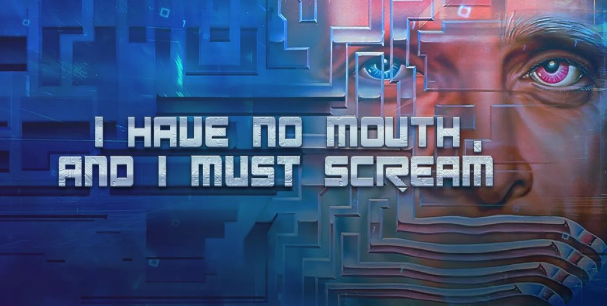

> _Retrospectiva săptămânii_ este rubrica duminicală în care trecem în revistă evenimentele săptămânii de pe frontul de gaming: știri şi articole (scrise de alții, bineînțeles, că e mai ușor aşa), industrie, lansări, oferte de jocuri, toate numai de savurat la cafeaua de duminică dimineața. (Și la care oricine poate contribui. ^[Dacă ai citit vreun articol sau vreo știre interesantă și crezi că merită inclusă în retrospectiva săptămânii, te așteptăm cu recomandarea ta pe forum, pe unul din topicurile dedicate: [Știri](https://forum.candaparerevista.ro/viewtopic.php?f=4&t=46), [Articole](https://forum.candaparerevista.ro/viewtopic.php?f=4&t=206), [Gaming România](https://forum.candaparerevista.ro/viewtopic.php?f=4&t=1622), [Oferte jocuri](https://forum.candaparerevista.ro/viewtopic.php?f=62&t=25)] )

## Ştiri

* Pe 28 iunie a murit Harlan Ellison, celebrul scriitor de science fiction, creator, printre altele, al povestirii care a dat naştere jocului “I Have No Mouth, and I Must Scream” ([Variety](https://variety.com/2018/tv/news/harlan-ellison-dead-dies-star-trek-1202861048/), [NY Times](https://www.nytimes.com/2018/06/29/obituaries/harlan-ellison-intensely-prolific-science-fiction-writer-dies-at-84.html))
* Edmund McMillen a pornit [o campanie de Kickstarter pentru Binding of Isaac: Four Souls](https://www.kickstarter.com/projects/isaacfoursouls/the-binding-of-isaac-four-souls), un boardgame bazat pe celebrul său roguelike. Campania și-a depăsit țelul cu peste 1400%, dar încă puteți contribui - la pragul de 25$ (+ taxe transport) veți primi jocul în format fizic.
* Se pare că [Telltale va renunța să mai folosească deja învechitul lor engine](https://www.eurogamer.net/articles/2018-06-25-finally-telltale-is-ditching-its-old-engine), în favoarea lui Unity (Eurogamer)
* În ultima vreme luptele s-au mutat din arenele virtuale în sălile de tribunal:
  * Creatorii lui Star Control apelează la crowdfunding pentru a-și acoperi cheltuielile de judecată în procesul cu Stardock. Ițele sunt încurcate, dar puteți citi mai multe despre asta pe [RPS](https://www.rockpapershotgun.com/2018/06/25/star-control-legal-battle/), [Gamasutra](http://www.gamasutra.com/view/news/320682/Star_Control_creators_raising_2M_to_defend_against_Stardock_lawsuit.php) sau [Gameinformer](https://www.gameinformer.com/2018/06/23/star-control-developers-start-fundraiser-for-ongoing-legal-battle-against-stardock).
  * [Bethesda a dat în judecată Warner Bros](https://www.gameinformer.com/2018/06/22/bethesda-sues-warner-bros-over-mobile-westworld-game), acuzându-i că au copiat Fallout Shelter în jocul lor pentru mobile Westworld. Aparent nu este vorba doar de „inspirație” la nivel conceptual, ci s-ar fi folosit inclusiv [fragmente de cod din Fallout Shelter](https://www.gamesindustry.biz/amp/2018-06-22-bethesda-sues-over-westworld-mobile-game).
  * PUBG renunță la procesul intentat Epic Games pentru copierea rețetei de battle royale ([Eurogamer](https://www.eurogamer.net/amp/2018-06-27-pubg-pulls-out-of-fortnite-lawsuit), [GamesIndustry.biz](https://www.gamesindustry.biz/amp/2018-06-27-playerunknowns-battlegrounds-dev-drops-lawsuit-against-fortnite))
  * În schimb [Epic dă în judecată un fost angajat pentru că a încălcat termenii NDA](http://www.gamasutra.com/view/news/320720/Epic_is_suing_former_employee_for_leaking_Fortnite_spoilers_.php), leak-urile sale cauzând „daune ireparabile” studioului (Gamasutra)
* Blizzard vrea să patenteze reluările din Overwatch ([Gamasutra](http://www.gamasutra.com/view/news/320803/Blizzard_applied_for_a_patent_on_Overwatchs_Play_of_the_Game_highlight_system.php), [PC Gamer](https://www.pcgamer.com/blizzard-wants-to-patent-overwatchs-play-of-the-game-feature/))
* Comitetul Olimpic Internaţional va discuta despre includerea e-sports în programul olimpic ([GamesIndustry.biz](https://www.gamesindustry.biz/articles/2018-06-30-international-olympic-committee-to-host-esports-forum), [The Next Web](https://thenextweb.com/gaming/2018/06/28/the-olympic-committee-is-hosting-an-esports-forum/))
* Încă e la stadiul de zvon, dar se pare că Google ar putea să intre pe piaţa de gaming cu o platformă de streaming şi ceva hardware ([Kotaku](https://kotaku.com/sources-google-is-planning-a-game-platform-that-could-1827217387))
* Anul viitor începe producția la un [serial Halo](https://arstechnica.com/gaming/2018/06/halo-tv-show-going-into-production-in-early-2019/) (Ars Technica)
* Valve lucrează la propriul set de unelte de analiză care ar trebui să suplinească funcționalitățile oferite de Steam Spy ([Gamasutra](https://www.gamasutra.com/view/news/321096/Valve_is_working_on_its_own_more_accurate_and_more_useful_Steam_Spylike_tools.php), [GamesIndustry.biz](https://www.gamesindustry.biz/articles/2018-06-29-valve-working-on-something-better-than-steamspy))
* Are loc [Summer Games Done Quick](https://gamesdonequick.com/) în perioada 24 iunie - 1 iulie (găsiţi pe [Game Informer](https://www.gameinformer.com/2018/06/29/check-out-some-of-sgdqs-coolest-and-most-eventful-runs) şi o selecţie cu câteva _runs_ interesante)

## Articole (critică, dev, design)

* [Clear 100 Hours In Your Calendar Cos CRPGs Are Here To Stay](https://www.rockpapershotgun.com/2018/06/26/clear-100-hours-in-your-calendar-cos-crpgs-are-here-to-stay/)) (RPS)
* [Sable is a Beautiful Tribute to 1980s French Comics, and Much More Besides](http://www.kotaku.co.uk/2018/06/27/sable-is-a-beautiful-tribute-to-1980s-french-comics-and-much-more-besides) (mai aveţi un interviu şi pe [Forbes](https://www.forbes.com/sites/maxthielmeyer/2018/06/26/sable-developer-greg-kythreotis-talks-art-and-architecture-in-e3s-prettiest-game/)) (Kotaku)
* [The Classic Adventurer](http://classicadventurer.co.uk/) e o revistă dedicată vechilor jocuri adventure în mod text; ediţiile digitale sunt gratuite, iar numărul 2 tocmai ce a fost lansat
* [The Origins of Assassin&#039;s Creed](https://unwinnable.com/2018/06/26/the-origins-of-assassins-creed-reprint/) (Unwinnable)
* [Stop Expecting Games to Build Empathy](https://www.wired.com/story/games-and-empathy/) (Wired)
* [Japan&#39;s Video Game Bars Are In Danger](https://kotaku.com/japans-video-game-bars-are-in-danger-1827199831) (Kotaku)
* [The Flare Path: Ukrainian Edition](https://www.rockpapershotgun.com/2018/06/29/the-flare-path-ukrainian-edition/) - despre jocurile studiului ucrainean Creoteam, **Soldiers: Heroes of World War II**, **Football, Tactics & Glory**, **Graviteam Tactics**, şi discuţii cu directorul studioului (RPS)
* (Video) [What We Can Learn From RPG Design Guru Josh Sawyer](http://www.ign.com/articles/2018/06/26/what-we-can-learn-from-rpg-design-guru-josh-sawyer-a-ign-unfiltered-32) (IGN)
* (Video) [The designer of  Six Ages  &  King of Dragon Pass  on the power of systemic stories](https://www.gamasutra.com/view/news/321104/The_designer_of_Six_Ages_amp__King_of_Dragon_Pass_on_the_power_of_systemic_stories.php) (Gamasutra)
* (Video) [Video: How  West of Loathing  became a game made out of jokes](https://www.gamasutra.com/view/news/320910/Video_How_West_of_Loathing_became_a_game_made_out_of_jokes.php) (Gamasutra)
* (Podcast) [Designer Notes 40: Brian Reynolds - Part 3](https://www.idlethumbs.net/designernotes/episodes/brian-reynolds-part-3) (plus linkuri către [Part 2](https://www.idlethumbs.net/designernotes/episodes/brian-reynolds-part-2/), [Part 1](https://www.idlethumbs.net/designernotes/episodes/brian-reynolds-part-1/)) (Idle Thumbs)

#### Istorie
* [How a Diablo expansion led to behind the scenes trouble](https://www.polygon.com/features/2018/6/29/17517376/diablo-hellfire-expansion-behind-the-scenes-trouble) (Polygon)
* [How Condemned Paved the Way for the Resurgence of Horror Games](http://www.kotaku.co.uk/2018/06/29/how-condemned-paved-the-way-for-the-resurgence-of-horror-games) (Kotaku)
* [Buy Low, Sell High: Vivendi's History in Video Games](http://www.kotaku.co.uk/2018/06/26/buy-low-sell-high-vivendis-history-in-video-games) (Kotaku)
* (Video) [The Entire History of &#x27;World of Warcraft&#x27; in One (Long) Video](https://www.wired.com/story/world-of-warcraft-history/) (Wired)

#### Design, world-building
* [Combining pinball with platforming to build the levels of  Yoku's Island Express ](http://www.gamasutra.com/view/news/319656/Combining_pinball_with_platforming_to_build_the_levels_of_Yokus_Island_Express.php) (Gamasutra)
* [The making of Bioshock's twisted green belt, Arcadia](https://www.pcgamer.com/the-making-of-bioshocks-twisted-green-belt-arcadia/) (PC Gamer)
* (Poze frumoase) [The Art Of God Of War](https://kotaku.com/the-art-of-god-of-war-1827091501) (Kotaku)

## Made în România
* 29 iunie: a avut loc [Indigo 2018](https://www.dutchgamegarden.nl/indigo/), un eveniment expoziţional din Olanda la care a participat şi echipa [Sand Sailor](http://www.blackthefall.com/sand-sailor-studio.html) (cei din spatele lui Black The Fall), care şi-au prezentat noul lor joc, [Bossgard](http://www.bossgard.com/)
* Eric Koch de la **thatgamecompany** (**Flow**, **Flower**, **Journey**) vine în România pe 4 iulie pentru o întâlnire cu comunitatea. Vă puteţi înscrie pe [pagina evenimentului organizat de Amber şi TechHub](https://www.techhub.com/event/amber-session-game-production-journey-w-eric-koch/).

## Anunţuri şi lansări de jocuri
#### Anunţate
* [9 Monkeys of Shaolin](http://9monkeysofshaolin.com/), un beat’em up clasic cu tematică Kung-Fu ([IndieGames](http://indiegames.com/2018/06/kung-fu_receives_the_stylish_b.html))
* **Blacksad: Under the Skin**, un adventure bazat pe celebra serie de benzi desenate [Blacksad](https://www.herocollector.com/en-gb/Article/blacksad-why-you-should-be-reading-it). Jocul va fi dezvoltat de Pendulo Studios, cei responsabili şi de seria Runaway (VGChartz)

#### Lansate
* 25 iunie: **The Awesome Adventures of Captain Spirit**, jocul gratuit plasat în acelaşi univers din **Life is Strange** ([Steam](https://store.steampowered.com/app/845070/The_Awesome_Adventures_of_Captain_Spirit/))
* 29 iunie: [The Crew 2](https://thecrew-game.ubisoft.com/the-crew-2/en-us/home/) ([Steam](https://store.steampowered.com/app/646910/The_Crew_2/), [Ubi Store](https://store.ubi.com/eu/the-crew--2--motor-edition/598d7de688a7e3b7368b457c.html))
* 29 iunie: **Myst III: Exile** şi **Myst IV: Revelation** [(re)lansate pe gog.com](https://www.gog.com/news/release_myst_iii_exile_myst_iv_revelation)
* 29 iunie: colecţia **Crash Bandicoot N. Sane Trilogy** ce conţine primele 3 jocuri din seria Crash Bandicoot remasterizate ([Steam](https://store.steampowered.com/app/731490/Crash_Bandicoot_N_Sane_Trilogy/))

## Oferte jocuri
#### Humble Bundle
* Dacă sunteți interesați de **Hearts of Iron IV**, **Blackwake** sau **Portal Knights**, vă reamintim că acestea sunt [early unlocks la bundle-ul lunii iulie](https://www.humblebundle.com/monthly). Acesta mai poate fi cumpărat până vineri, 6 iulie.
* [Into the Breach](https://www.humblebundle.com/store/into-the-breach) e ceva mai ieftin decât pe Steam.

#### Steam
Summer Sale continuă până miercuri. Dacă sunteți încă nehotărâți, iată o nouă listă de oferte recomandate pe forum: [The Last Door](https://store.steampowered.com/app/284390/The_Last_Door__Collectors_Edition/) (2,49 €), [Subnautica](https://store.steampowered.com/app/264710/Subnautica/) (18,39 €), [Oxenfree](https://store.steampowered.com/app/388880/Oxenfree/) (4,99 €), [Absolver](https://store.steampowered.com/app/473690/Absolver/) (14,99 €), [The Binding of Isaac: Rebirth](https://store.steampowered.com/bundle/2405/The_Binding_of_Isaac_Rebirth_Complete_Bundle/), [Vampire Bloodlines](https://store.steampowered.com/app/2600/Vampire_The_Masquerade__Bloodlines/) (4,99 €), [Divinity: Original Sin](https://store.steampowered.com/app/373420/Divinity_Original_Sin__Enhanced_Edition/) (11,99 €), [Shovel Knight](https://store.steampowered.com/app/250760/Shovel_Knight_Treasure_Trove/) (18,39 €), [Superbrothers: Sword & Sworcery EP](https://store.steampowered.com/app/204060/Superbrothers_Sword__Sworcery_EP/) (1,79 €), [Dragon's Dogma: Dark Arisen](https://store.steampowered.com/app/367500/Dragons_Dogma_Dark_Arisen/) (9,89 €), [Stephen's Sausage Roll](https://store.steampowered.com/app/353540/Stephens_Sausage_Roll/) (5,59€), [Redout](https://store.steampowered.com/app/517710/Redout_Enhanced_Edition/) (9,59€), [Slay the Spire](https://store.steampowered.com/app/646570/Slay_the_Spire/) (10,07€).

(Găsiţi mai multe recomandări pe [threadul dedicat de pe forum](https://forum.candaparerevista.ro/viewtopic.php?f=62&t=14), unde puteţi lăsa, desigur, şi recomandările voastre.)

#### gog.com
* [Weekend Sale](https://www.gog.com/promo/20180629_weekend_sale): seria **Commandos**, **Battle Brothers**, **Journeyman Project** și multe altele la reducere.
* [Myst saga](https://www.gog.com/promo/20180628_launch_promo_myst_iii_iv): toate jocurile din seria Myst (cu excepţia "noutăţilor" Myst III şi Myst IV) la reducere.

#### Fanatical
* [GTA V e ieftin](https://www.greenmangaming.com/games/grand-theft-auto-v) (£10.56)
* E în desfăşurare şi o promoţie [Slitherine](https://www.fanatical.com/en/publishers/slitherine-ltd.), dacă vă interesează jocuri de strategie precum **Distant Worlds Universe**, **Battlestar Galactica: Deadlock**, **QVADRIGA** sau **Warhammer 40,000: Armageddon**. Aveţi şi o reducere suplimentară cu codul RED10.

## Recomandarea săptămânii: _I Have No Mouth And I Must Scream_

În memoria lui Harlan Ellison, săptămâna asta vă recomandăm **I Have No Mouth And I Must Scream**, un point & click SF/horror bazat pe povestirea lui cu același nume. Harlan Ellison s-a implicat direct în dezvoltarea jocului (mai mult de atât, vocea maleficului AM este chiar a lui). În ciuda numelui sonor din spatele proiectului, însă, jocul nu a fost un succes comercial la vremea lui. A devenit însă un cult classic care trebuie încercat de orice împătimit de jocuri adventure.

Puteți citi mai multe despre cum a decurs realizarea jocului în [acest articol de pe Game Informer](https://www.gameinformer.com/b/features/archive/2016/01/14/classic-gi-i-have-no-mouth-and-i-must-scream.aspx).

Jocul poate fi achiziționat de pe [Steam](https://store.steampowered.com/app/245390/I_Have_No_Mouth_and_I_Must_Scream/) (redus la 1,49 € până miercuri) sau [gog.com](https://www.gog.com/game/i_have_no_mouth_and_i_must_scream) (4,89 €). Dacă îl luaţi de pe gog.com, veţi primi ca bonus şi un PDF cu povestirea originală.
