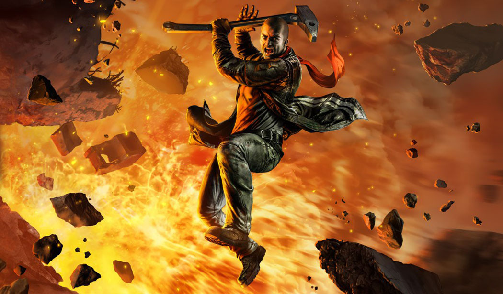

> _Retrospectiva săptămânii_ este rubrica duminicală în care trecem în revistă evenimentele săptămânii de pe frontul de gaming: știri şi articole (scrise de alții, bineînțeles, că e mai ușor aşa), industrie, lansări, oferte de jocuri, toate numai de savurat la cafeaua de duminică dimineața. (Și la care oricine poate contribui. ^[Dacă ai citit vreun articol sau vreo știre interesantă și crezi că merită inclusă în retrospectiva săptămânii, te așteptăm cu recomandarea ta pe forum, pe unul din topicurile dedicate: [Știri](https://forum.candaparerevista.ro/viewtopic.php?f=4&t=46), [Articole](https://forum.candaparerevista.ro/viewtopic.php?f=4&t=206), [Gaming România](https://forum.candaparerevista.ro/viewtopic.php?f=4&t=1622), [Oferte jocuri](https://forum.candaparerevista.ro/viewtopic.php?f=62&t=25)] )

## Ştiri

* Valve au publicat topul celor mai vândute și jucate jocuri de anul ăsta ([Steam](https://store.steampowered.com/2018_so_far), [Gamasutra](https://www.gamasutra.com/view/news/321451/Valve_highlights_the_best_selling_and_most_played_Steam_games_of_2018.php))
* Tot de la Valve, dar fără voia lor de data asta, apar niște cifre interesante legate de numărul total de jucători unici (respectiv cumpărători) pentru jocurile care au achievements ([Ars Technica](https://arstechnica.com/gaming/2018/07/steam-data-leak-reveals-precise-player-count-for-thousands-of-games/), [RPS](https://www.rockpapershotgun.com/2018/07/06/steam-blocks-another-weird-trick-for-estimating-sales), [Eurogamer](https://www.eurogamer.net/articles/2018-07-06-valve-quietly-blocks-new-method-to-estimate-steam-sales-figures), [GamesIndustry.biz](https://www.gamesindustry.biz/articles/2018-07-06-valve-quickly-shuts-down-developer-method-for-estimating-steam-sales))
* Summer Games Done Quick a strâns cea mai mare sumă din donaţii pentru caritate din istoria evenimentului: 2,1 milioane de dolari ([Gamasutra](https://www.gamasutra.com/view/news/321154/Summer_Games_Done_Quick_raises_recordbreaking_21M_for_charity.php))
* Ubisoft vor să renunţe la “experienţele de sine stătătoare” ([Gamasutra](https://www.gamasutra.com/view/news/321342/NeverEnding_Story_Ubisoft_keen_to_move_away_from_finite_experiences.php))
* Doi scenarişti din echipa Guild Wars 2 au fost concediaţi după o dispută încinsă pe Twitter cu un fan ([Game Informer](https://www.gameinformer.com/2018/07/06/two-writers-fired-from-guild-wars-2-developer-after-twitter-argument), [GamesIndustry.biz](https://www.gamesindustry.biz/articles/2018-07-06-arenanet-sends-all-the-wrong-messages))
* Fred Wester părăseşte poziţia de CEO al Paradox după 15 ani. În luna dinaintea plecării a început să publice o serie de _tweets_ în care dezvăluie momente amuzante din istoria companiei. [Kotaku a adunat o parte dintre ele](https://kotaku.com/a-video-game-company-actually-shared-some-funny-stories-1827276428)

## Articole (critică, dev, design)
* [From pen and paper to Dying Light 2 - Chris Avellone wants to flip the RPG script](https://www.vg247.com/2018/07/03/dying-light-2-chris-avellone-techland-interview/) (VG247)
* [AI achieves &quot;human-level performance&quot; in Quake III Arena](https://www.gamesindustry.biz/articles/2018-07-04-ai-achieves-human-level-performance-in-quake-iii-arena) (GamesIndustry.biz)
* [10 Real-Life Activities I Only Enjoy In Video Games](https://www.gameinformer.com/funny-to-a-point/2018/07/06/10-real-life-activities-i-only-enjoy-in-video-games) (Game Informer)
* [The European TV channel making documentaries with video games](https://www.gamesindustry.biz/articles/2018-07-06-the-european-tv-channel-making-documentaries-with-video-games) (GamesIndustry.biz)
* [Making the most of voice talent](https://www.gamesindustry.biz/articles/2018-07-02-making-the-most-of-voice-talent) (GamesIndustry.biz)
* [I&#39;m Glad I Started Playing The Witcher 1 Last](https://kotaku.com/im-glad-i-started-playing-the-witcher-1-last-1827318490) (Kotaku)
* [Where are the Radical Politics of Cyberpunk?](https://waypoint.vice.com/en_us/article/ne5jg7/radical-politics-cyberpunk-2077) (Waypoint)
* [&#39;Vampyr&#39; is a Deeply Flawed Game, But That&#39;s Exactly Why It&#39;s So Memorable](https://waypoint.vice.com/en_us/article/ywea3x/vampyr-is-a-deeply-flawed-game-but-thats-exactly-why-its-so-memorable) (Waypoint)
* [The Ticking Clock in Cultist Simulator](https://unwinnable.com/2018/07/02/the-ticking-clock-in-cultist-simulator/) (Unwinnable)

#### Istorie
* [How StarCraft and Shower Epiphanies Influenced Diablo 2's Design](https://www.gamasutra.com/blogs/DavidCraddock/20180706/321425/How_StarCraft_and_Shower_Epiphanies_Influenced_Diablo_2s_Design.php) (Gamasutra)
* [12 years ago Rockstar served up the antithesis of GTA, and it was amazing](https://www.eurogamer.net/articles/2018-07-01-12-years-ago-rockstar-served-up-the-antithesis-of-gta-and-it-was-amazing) (Eurogamer)
* [The Future of Halo: From Monkey Nuts to Infinity](https://www.gamasutra.com/blogs/RomanTolstykh/20180702/321114/The_Future_of_Halo_From_Monkey_Nuts_to_Infinity.php) (Gamasutra)
* [How Harlan Ellison’s Most Famous Short Story Became An Amazing Video Game](https://kotaku.com/how-harlan-ellison-s-most-famous-short-story-became-an-1827327887) (Kotaku)

#### Design, world-building
* [Telling a great road trip tale without words in  Far: Lone Sails ](https://www.gamasutra.com/view/news/320532/Telling_a_great_road_trip_tale_without_words_in_Far_Lone_Sails.php) (Gamasutra)
* [How one person created the lushly organic world of Ghost Of A Tale](https://www.rockpapershotgun.com/2018/07/04/how-one-person-created-the-lushly-organic-world-of-ghost-of-a-tale/) (RPS)
* [What Works And Why: Juicy maths in Slay The Spire](https://www.rockpapershotgun.com/2018/07/05/what-works-and-why-juicy-maths-in-slay-the-spire/) (RPS)
* [The Story Behind Ultima’s Morality](https://kotaku.com/the-story-behind-ultima-s-morality-1827298253) (Kotaku)

## Made în România
* GamesIndustry.biz le-au luat un interviu celor de la Breadcrumbs Interactive despre jocul lor **Yaga**, care a câștigat competiția Nordic Discovery. ([GamesIndustry.biz](https://www.gamesindustry.biz/articles/2018-07-04-breadcrumbs-interactive-embraced-slavic-folklore-to-find-yagas-unique-voice))
* Dacă sunteți curioși cum arată piața de indie gaming în România și ce rol poate avea un _incubator_, aruncați un ochi pe AMA-ul susținut de Catalin Butnariu, unul dintre fondatorii Carbon Incubator (Gray Dawn a fost lansat cu ajutorul lor), pe Discord ([Discord](http://gamedevs.ro/AMA/carbon.html ))

## Anunţuri şi lansări de jocuri
#### Anunţate
* **Dakar18** va fi lansat pe 11 septembrie 2018 ([trailer](https://www.youtube.com/watch?v=O2IzZoqQtGE))
* **Devotion**, un joc horror first person de la dezvoltatorii taiwanezi ai lui Detention ([trailer](https://www.youtube.com/watch?v=pEfRkPRxMgc))
* **AI: The Somnium Files**, un nou adventure de la creatorul seriei Zero Escape ([Destructoid](https://www.destructoid.com/zero-escape-series-creator-announces-ai-the-somnium-files-at-anime-expo-2018-511409.phtml), [Eurogamer](https://www.eurogamer.net/articles/2018-07-06-zero-escape-director-reveals-new-murder-mystery-adventure-ai-the-somnium-files))
* **This is the Police 2** se lansează pe 2 august ([Destructoid](https://www.destructoid.com/prepare-to-be-told-you-re-a-loose-cannon-in-this-is-the-police-2-510983.phtml))

#### Lansate
* 3 iulie: **Red Faction Guerrilla Re-Mars-tered** ([Steam](https://store.steampowered.com/app/667720/Red_Faction_Guerrilla_ReMarstered/))
* 5 iulie: **From the Ashes**, un DLC pentru **Kingdom Come: Deliverance** ([Steam](https://store.steampowered.com/app/883150/Kingdom_Come_Deliverance__From_the_Ashes/))
* 6 iulie: **Dungeon Warfare II** ([Steam](https://store.steampowered.com/app/698540/Dungeon_Warfare_2/))
* 7 iulie: **AirMech Wastelands** ([Steam](https://store.steampowered.com/app/595770/AirMech_Wastelands/))

## Oferte jocuri
#### Humble Bundle
* **A Hat in Time**, **The Escapists 2** și **Conan Exiles** sunt [early unlocks pentru următorul Humble Monthly](https://www.humblebundle.com/monthly). Le puteți lua cu 12$, urmând ca peste 26 de zile să primiți și alte jocuri în acest pachet.
* Este în desfășurare [DRM Freedom Sale](https://www.humblebundle.com/store/promo/drmfreedom-sale/) pentru încă două zile. O mulțime de jocuri indie sunt la reducere, printre care **SOMA** la cel mai mic preț de până acum (4,19 €), **Hollow Knight** (9,89 €), **Into the Breach** (10,39 €), **Undertale** (4,49 €), **Prison Architect** (6,49 €), **The Curious Expedition** (9,74 €) sau Doorkickers (2,84 €).

#### Steam
Summer Sale s-a încheiat, dar reducerile nu se opresc cu totul:

* [Rocket League](https://store.steampowered.com/app/252950/Rocket_League/) are o reducere de cu 50% (9,99 €) și este free to play pentru restul acestui weekend.
* Alte reduceri notabile: [seria Red Faction](https://store.steampowered.com/sub/15630/) (19,80 €), [The Witness](https://store.steampowered.com/app/210970/The_Witness/) (11,09 €), [Bulletstorm: Full Clip Edition](https://store.steampowered.com/app/501590/Bulletstorm_Full_Clip_Edition/) (9,25 €), [Life Goes On: Done to Death](https://store.steampowered.com/app/250050/Life_Goes_On_Done_to_Death/) (1,99 €) și [Road Redemption](https://store.steampowered.com/app/300380/Road_Redemption/) (9,99 €).

#### gog.com
* Reduceri la **Banished**, **Mount & Blade**, **Expeditions: Viking**, **Stronghold** și multe altele în [această promoție medievală](https://www.gog.com/promo/20180706_medieval_sale).
* Tot în acest weekend e valabilă și [o promoție horror](https://www.gog.com/promo/20180706_horror_weekend) la care puteți lua printre altele **Vampire the Masquerade: Bloodlines** & **Redemption**, **Shadowman**, **Sanitarium**, **The 7th Guest** și seriile **Alone in the Dark**, **Phantasmagoria**, **Outlast**, **Penumbra** și **Amnesia**.
* Mai e încă în vigoare și promoția săptămânală, care cuprinde diverse jocuri vechi precum **Bad Mojo Redux**, **I Have No Mouth And I Must Scream**, **Fragile Allegiance**,  seria **System Shock**, dar și unele mai noi precum **Devil Daggers**, **Oriental Empires**, sau **Kim**, un adventure în genul lui 80 Days plasat în India de secol XIX a lui Rudyard Kipling.

#### Altele
* Pe Fanatical, **seria Commandos** + **Praetorians** + **Imperial Glory** sunt disponibile pentru 1 euro în [acest bundle](https://www.fanatical.com/en/bundle/pyro-bundle).
* Indie Gala [vă propune](https://www.indiegala.com/crackerjack) **Steel Division: Normandy 44** la un preț $10.49 pentru încă o zi.

## Recomandarea săptămânii: _Red Faction Guerrilla Re-Mars-tered_

Un joc pe care probabil că îl aveți cu toții, Red Faction: Guerilla tocmai a primit un facelift și o relansare săptămâna aceasta. Upgrade-ul include texturi refăcute, rezoluții 4K, umbre, lumini și efecte noi, și e gratuit pentru posesorii lui Red Faction: Guerilla.

Pe lângă setting-ul care acum e din ce în ce mai folosit, planeta Marte, jocul iese în evidență prin nivelul de distrugere pe care îl puteți cauza în mediul înconjurător, practic neegalat până acum într-un joc open-world. Dacă l-ați jucat înainte, merită să mai dați o tură, iar pentru cei care nu l-au jucat, e ocazia ideală.

Câteva impresii despre ediția relansată: [PC Gamer](https://www.pcgamer.com/red-faction-guerrilla-re-mars-tered-brings-back-the-best-destruction-ever/), [RPS](https://www.rockpapershotgun.com/2018/07/03/wot-i-think-red-faction-guerrilla-re-mars-tered/), [o comparație video între ediția originală și cea nouă](https://www.youtube.com/watch?v=X6gjbcE2i5k), plus [review-ul din Level] (http://arhivarevistevechi.mythweb.ro/arhiva/articole.php?editie-id=145&articol=6033) despre jocul original.

Dacă nu-l aveți, îl puteți cumpăra de pe [Steam](https://store.steampowered.com/app/667720/Red_Faction_Guerrilla_ReMarstered/), [Humble](https://www.humblebundle.com/store/red-faction-guerrilla-re-mars-tered) sau [gog.com](https://www.gog.com/game/red_faction_guerrilla_remarstered).