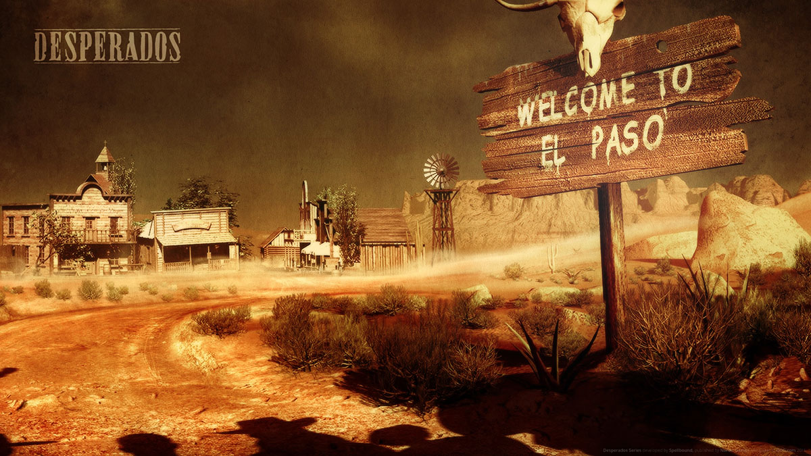

> _Retrospectiva săptămânii_ este rubrica duminicală în care trecem în revistă evenimentele săptămânii de pe frontul de gaming: știri şi articole (scrise de alții, bineînțeles, că e mai ușor aşa), industrie, lansări, oferte de jocuri, toate numai de savurat la cafeaua de duminică dimineața. (Și la care oricine poate contribui. ^[Dacă ai citit vreun articol sau vreo știre interesantă și crezi că merită inclusă în retrospectiva săptămânii, te așteptăm cu recomandarea ta pe forum, pe unul din topicurile dedicate: [Știri](https://forum.candaparerevista.ro/viewtopic.php?f=4&t=46), [Articole](https://forum.candaparerevista.ro/viewtopic.php?f=4&t=206), [Gaming România](https://forum.candaparerevista.ro/viewtopic.php?f=4&t=1622), [Oferte jocuri](https://forum.candaparerevista.ro/viewtopic.php?f=62&t=25)] )

## Ştiri

* Un modder a descoperit cum o singură literă “mâncată” dintr-un fișier de configurare a avariat serios AI-ul xenomorphilor din **Aliens: Colonial Marines** ([Ars Technica](https://arstechnica.com/gaming/2018/07/a-years-old-one-letter-typo-led-to-aliens-colonial-marines-awful-ai/))
* Serverele **Old School Runescape** au fost oprite temporar, după ce un bug introdus odată cu un patch a introdus în inventarul mai multor jucători cantitatea maximă de monezi de aur pe care o suportă jocul. Serverele au fost repornite ulterior după ce a fost remediată problema ([PC Gamer](https://www.pcgamer.com/old-school-runescape-pulled-offline-as-billions-of-gold-appear-out-of-nowhere/))
* Epic anunţă că a crescut procentul oferit creatorilor de _assets_ vândute pe Unreal Engine Marketplace de la 70% la 88%, datorită, parţial, şi succesului fenomenal al **Fortnite** ([UnrealEngine.com](https://www.unrealengine.com/en-US/blog/epic-announces-unreal-engine-marketplace-88-12-revenue-share))
* Blizzard a introdus într-un update recentă "o notă de bună purtare" menită să scadă gradul de “toxicitate” al comunităţii online care joacă **Overwatch**. Noile schimbări se pare că au un mare succes ([Eurogamer](https://www.eurogamer.net/articles/2018-07-14-blizzard-says-overwatchs-new-systems-are-already-improving-in-game-behaviour), [RPS](https://www.rockpapershotgun.com/2018/07/10/overwatchs-new-endorsement-system-works-but-makes-being-nice-mean-less/))
* Ofensiva contra proastei creşteri continuă și în **Rainbow Six Siege** - Ubisoft banează instantaneu orice jucător care folosește insulte rasiste sau homofobe ([PC Gamer](https://www.pcgamer.com/rainbow-six-toxicity-ban/))
* Inkle Studios (**80 Days**) organizează un game jam în perioada 31 august - 3 septembrie pentru a dezvolta jocuri cu **ink**, limbajul de scripting folosit și în jocuri precum **80 Days** sau **Sorcery!** ([Gamasutra](https://www.gamasutra.com/view/news/322063/Inkle_Studios_announces_ink_jam_encourages_devs_to_learn_ink.php))
* Designerul James Ohlen se retrage de la BioWare după 22 ani, timp în care a fost, printre altele, _lead designer_ la Baldur's Gate 1 şi 2 şi Neverwinter Nights ([RPS](https://www.rockpapershotgun.com/2018/07/13/james-ohlen-leaves-bioware/))
* Se pare că **Mafia III** a avut iniţial altă introducere, dar a fost eliminată (nu doar înlocuită, ci ştearsă) pentru că ar fi putut stârni o mare controversă ([Eurogamer](https://www.eurogamer.net/articles/2018-07-11-mafia-3-cut-opening-so-controversial-all-trace-of-it-had-to-be-erased))
* Cu ultimul update, Valve blochează permanent containerele din Counter-Strike: Global Offensive pentru jucătorii din Belgia şi Olanda, după ce în iunie le blocase temporar în urma avertismentelor emise de autorităţi în privinţa _loot boxes_. Au reactivat în schimb Steam Trading și Steam Market ([Eurogamer](https://www.eurogamer.net/articles/2018-07-12-cs-go-update-blocks-players-in-netherlands-and-belgium-from-opening-loot-boxes), [counter-strike.net](http://blog.counter-strike.net/index.php/2018/07/20618/))
* Publisherul Kalypso achiziţionează drepturile pentru seria **Commandos**, pe care plănuieşte să o continue cu jocuri noi ([Eurogamer](https://www.eurogamer.net/articles/2018-07-12-tropico-publisher-kalypso-acquires-rights-to-classic-stealth-tactics-series-commandos))
* Formulările vagi de tipul “Coming Soon” au fost interzise de un tribunal din Germania ([TechPowerUp](https://www.techpowerup.com/245920/german-court-bans-vague-dates-like-coming-soon-in-marketing-and-sales)) (thx @zme-ul)
* **Desperados: Wanted Dead Or Alive** primeşte un update după 17 ani pentru a-l face jucabil pe sisteme moderne ([RPS](https://www.rockpapershotgun.com/2018/07/10/desperados-wanted-dead-or-alive-windows-10-crash-fixed/))

## Articole (critică, dev, design)
* Pentru început, câteva articole despre scandalul ArenaNet de săptămâna trecută:
  * [Opinion: It's past time to get serious about social media policies](https://www.gamasutra.com/view/news/321979/Opinion_Its_past_time_to_get_serious_about_social_media_policies.php) (Gamasutra)
  * [In The Wake Of ArenaNet Firings, Game Studios Rethink Their Social Media Policies](http://www.kotaku.co.uk/2018/07/14/in-the-wake-of-arenanet-firings-game-studios-rethink-their-social-media-policies) (Kotaku)
  * [ArenaNet firings cast a chilling shadow across the game industry](https://www.theverge.com/2018/7/12/17565218/arenanet-guild-wars-firing-games-social-media-harassment) (The Verge)
* [The US town ruled by an AI storyteller](https://www.eurogamer.net/articles/2018-07-14-the-us-town-ruled-by-an-ai-storyteller) (Eurogamer)
* [Retro Games as a Revivalist Movement](https://www.gamasutra.com/blogs/JohnRose/20180709/321546/Retro_Games_as_a_Revivalist_Movement.php) (Gamasutra)
* [Meet the dev making his first DOS game -- in 2018](https://www.gamasutra.com/view/news/320530/Meet_the_dev_making_his_first_DOS_game__in_2018.php) (Gamasutra)
* [Steam Spy and the need for numbers](https://www.gamesindustry.biz/articles/2018-07-10-steam-spy-and-the-need-for-numbers) (GamesIndustry.biz)
* [We Asked Nintendo, Microsoft, and 12 Other Devs How They Deal With Crunch](https://waypoint.vice.com/en_us/article/mbkm33/we-asked-nintendo-microsoft-and-12-other-devs-how-they-deal-with-crunch) (Waypoint)
* [Greatest Video Game Composers: Norihiko Hibino](http://www.vgchartz.com/article/277243/greatest-video-game-composers-norihiko-hibino/) (VGChartz)
* [It&#39;s Hard Work Turning A Skyrim Mod Into A Standalone Game](https://kotaku.com/its-hard-work-turning-a-skyrim-mod-into-a-standalone-ga-1827378941) (Kotaku)

### _Not-a-review_
* (Far Cry 5) [The futile search for a single message in Far Cry 5](https://www.pcgamer.com/the-futile-search-for-a-single-message-in-far-cry-5/ (atenție), spoiler despre sfârșit) (PC Gamer)
* (LawBreakers) [LawBreakers didn&#8217;t deserve such an ignoble end](https://www.rockpapershotgun.com/2018/07/12/lawbreakers-didnt-deserve-such-an-ignoble-end/) (RPS)
* (Warframe) [Warframe has quietly become the best free-to-play game on PC](https://www.pcgamer.com/warframe-has-quietly-become-the-best-free-to-play-game-on-pc/) (PC Gamer)
* (Fortnite) [Calling Fortnite a battle royale game misses the point](https://www.polygon.com/fortnite/2018/7/13/17568900/fortnite-battle-royale-cultural-phenomenon) (Polygon)
* (Doki Doki Literature Club) [Screen Sculpture | Doki Doki Literature Club](http://www.heterotopiaszine.com/2018/07/09/screen-sculpture-doki-doki-literature-club/) (Heterotopias)
* (Hollow Knight) [I’ve Been to Hell, Friends, and It Has a Name: Deepnest](https://waypoint.vice.com/en_us/article/43pdn9/ive-been-to-hell-friends-and-it-has-a-name-deepnest) (Waypoint)
* (Spec Ops: The Line) [Heart of Darkness | Behind the AI and Storytelling of Spec Ops: The Line](https://www.gamasutra.com/blogs/TommyThompson/20180709/321286/Heart_of_Darkness__Behind_the_AI_and_Storytelling_of_Spec_Ops_The_Line.php) (Gamasutra)
* (Bioshock) [BioShock&#39;s Jewish Roots Run Deep](https://kotaku.com/bioshocks-jewish-roots-run-deep-1827482206) (Kotaku)

### Vocea industriei
* Tim Willits (id Software): [Avoiding cannibalization in the post-apocalypse](https://www.gamesindustry.biz/articles/2018-07-09-avoiding-cannibalization-in-the-post-apocalypse) (GamesIndustry.biz)
* Hidetaka Miyazaki (From Software): [Interview: Miyazaki on the Limbs and Lore of Sekiro: Shadows Die Twice](https://blog.us.playstation.com/2018/07/13/interview-miyazaki-on-the-limbs-and-lore-of-sekiro-shadows-die-twice/) (PlayStation.Blog)
* Tomas Rawlings (Auroch Digital): [&#147;There is no magic formula&#148; for getting noticed on Steam](https://www.gamesindustry.biz/articles/2018-07-09-there-is-no-magic-formula-for-getting-noticed-on-steam) (GamesIndustry.biz)
* Grace Carroll (Creative Assembly): [Fighting a toxic Steam community - and winning](https://www.gamesindustry.biz/articles/2018-07-11-fighting-a-toxic-steam-community-and-winning) (GamesIndustry.biz)
* Jade Raymond (EA, ex-Ubisoft): [Jade Raymond on applying lessons from Assassin's Creed to her new project at EA](https://www.gamesindustry.biz/articles/2018-07-13-jade-raymonds-on-the-success-of-assassins-creed-and-her-new-ip-at-electronic-arts) (GamesIndustry.biz)
* Ben Wanat (Crystal Dynamics, ex-Visceral): [Visceral had some cool ideas for Dead Space 4](https://www.eurogamer.net/articles/2018-07-13-visceral-had-some-cool-ideas-for-dead-space-4) (Eurogamer)
* Rami Ismail (Vlambeer): [“Indie is dead” but that’s a good thing, says Rami Ismail](https://www.pcgamesn.com/indie-is-dead) (PCGamesN)

### Istorie
* [Where Are Prince Of Persia: The Sands Of Time&#39;s Developers Now?](https://kotaku.com/where-are-prince-of-persia-the-sands-of-times-develope-1827556681) (Kotaku)
* [&#8216;StarCraft II&#8217;: How Blizzard Brought the King of Esports Back From the Dead](https://variety.com/2018/gaming/features/starcraft-ii-esports-history-1202873246/) (Variety)
* [The Game Archaeologist: A history of EverQuest&#8217;s expansions](https://massivelyop.com/2018/07/14/the-game-archaeologist-a-history-of-everquests-expansions/) (Massively OP)

### Design, world-building
* [How Journey only truly made sense when almost everything had been cut](https://www.eurogamer.net/articles/2018-07-08-how-journey-only-truly-made-sense-when-almost-everything-had-been-cut) (Eurogamer)
* [Romanticism and the art of Dark Souls III](https://www.gamasutra.com/blogs/ReneHaase/20180711/321757/Romanticism_and_the_art_of_Dark_Souls_III.php) (Gamasutra)
* [Photo Mode: A Tribute](https://www.polygon.com/videos/2018/7/9/17528640/photo-mode-god-of-war-doom-no-mans-sky-compilation) (Polygon)

## Made în România

* [Care sunt jocurile preferate ale românilor și cât cheltuiesc pe an pe ele](https://playtech.ro/2018/jocuri-preferate-romani-2017/) (Playtech)

## Anunţuri şi lansări de jocuri
### Anunţate
* **Little Misfortune**, un nou adventure de la Killmonday Games (creatorii lui **Fran Bow**) ([Gamereactor](https://www.gamereactor.eu/news/678863/))
* **Modern Air Combat**, un flight sim de la creatorii **DCS** Warthog şi **Lock On** ([Polygon](https://www.polygon.com/2018/7/13/17570028/modern-air-combat-eagle-dynamics-announcement-price-release-date))
* **Element: Space**, RPG squad-based cu acţiunea în viitor ([RPG Codex](http://www.rpgcodex.net/forums/index.php?threads/element-space-is-an-upcoming-sci-fi-turn-based-tactical-rpg-from-argentina.122872/))
* **Remnant: From the Ashes**, un "third-person survival-action shooter" ce va avea "four-player co-op in _dynamically generated worlds_" , de la producătorii lui **Darksiders III** ([IGN](http://www.ign.com/articles/2018/07/12/darksiders-3-dev-announces-remnant-from-the-ashes))
* **Override: Mech City Brawl**, nişte bătaie multiplayer cu mechs ([VGChartz](http://www.vgchartz.com/article/277221/override-mech-city-brawl-announced-for-ps4-xbox-one-pc/))

### Acum cu dată de lansare
* **Advanced Gungeons & Draguns**, dlc gratuit pentru **Enter the Gungeon**: 19 iulie ([Twitter](https://twitter.com/DodgeRollGames/status/1017798842220150784))
* **Chasm**: 31 iulie ([PC Gamer](https://www.pcgamer.com/chasm-the-procedurally-generated-metroidvania-will-arrive-at-the-end-of-july/))
* **Pillars of Eternity 2: Beast of Winter**: 2 august ([Eurogamer](https://www.eurogamer.net/articles/2018-07-12-pillars-of-eternity-2s-first-big-expansion-beast-of-winter-gets-an-august-release-date))
* **Dead Cells**: iese din early access pe 7 august ([Steam Community](https://steamcommunity.com/games/588650/announcements/detail/1687044219367010627))
* **Monster Hunter World**: 9 august ([PC Gamer](https://www.pcgamer.com/monster-hunter-world-pc-release-date-set/))
* **Gladiabots**: 9 august ([RPS](https://www.rockpapershotgun.com/2018/07/11/gladiabots-early-access-date-august-9/))
* **Phantom Doctrine**: 14 august ([Game Informer](https://www.gameinformer.com/news/2018/07/11/xcom-like-spy-strategy-game-phantom-doctrine-releasing-next-month))
* **The Bard's Tale 4**: 18 septembrie ([VideoGamer](https://www.videogamer.com/news/the-bards-tale-4-launching-on-pc-in-september))
* **Darksiders III**: 27 noiembrie ([Eurogamer](https://www.eurogamer.net/articles/2018-07-09-darksiders-3-gets-a-november-release-date))

### Lansate
* 9 iulie: **Hero-U: Rogue to Redemption** ([gog.com](https://www.gog.com/game/herou_rogue_to_redemption), [Steam](https://store.steampowered.com/app/375440/HeroU_Rogue_to_Redemption/))
* 10 iulie: **Ice Caves of Europa** ([Steam](https://store.steampowered.com/app/503780/Ice_Caves_of_Europa/))
* 10 iulie: **The Culling 2** ([Steam](https://store.steampowered.com/app/752720/The_Culling_2/), dar lansarea s-a dovedit a fi un dezastru ([Eurogamer](https://www.eurogamer.net/articles/2018-07-13-the-culling-2-flop-forces-difficult-discussions-about-future-of-developer-xaviant), [PC Gamer](https://www.pcgamer.com/the-culling-2-gets-hit-with-very-negative-reviews-on-steam/))
* 12 iulie: **Warhammer 40,000: Gladius - Relics of War** ([gog.com](https://www.gog.com/game/warhammer_40000_gladius_relics_of_war_pack), [Steam](https://store.steampowered.com/app/489630/Warhammer_40000_Gladius__Relics_of_War/))
* 12 iulie: **The Free Ones** ([Steam](https://store.steampowered.com/app/670350/The_Free_Ones/))
* 13 iulie: **Earthfall** ([Steam](https://store.steampowered.com/app/415590/Earthfall/))
* 13 iulie: **Danger Zone 2** ([Steam](https://store.steampowered.com/app/513690/Danger_Zone_2/))
* 13 iulie: **The Spectrum Retreat** ([Steam](https://store.steampowered.com/app/763250/The_Spectrum_Retreat/))
* 13 iulie: **Octopath Traveler** (Switch) ([Nintendo Store](https://www.nintendo.com/games/detail/octopath-traveler-switch))
* 13 iulie: **Captain Toad: Treasure Tracker** (Switch) ([Nintendo Store](https://www.nintendo.com/games/detail/captain-toad-treasure-tracker-switch))

## Oferte jocuri

#### Humble Bundle
* [Square Enix Publisher Week](https://www.humblebundle.com/store/promo/square-enix-publisher-sale/) ține încă 8 zile, timp în care puteți cumpăra o mulțime de jocuri la reducere din seriile **Final Fantasy**, **Thief**, **Deus Ex**, **Legacy of Kain**, **Dungeon Siege** și altele.

#### Steam
* [Slay the Spire](https://store.steampowered.com/app/646570/Slay_the_Spire/), un foarte popular roguelite combinat cu joc de cărți, poate fi luat cu 10,07 €.
* [Superhot](https://store.steampowered.com/app/322500/SUPERHOT/), despre care a scris și Nervozix [pe forum](https://forum.candaparerevista.ro/viewtopic.php?f=77&t=1215), are prețul redus la 11,49 €.
* [Life Goes On: Done to Death](https://store.steampowered.com/app/250050/Life_Goes_On_Done_to_Death/), un puzzle platformer plin de umor la numai 1,99 €, cel mai mic preţ de până acum.
* [Warhammer: End Times - Vermintide](https://store.steampowered.com/app/235540/Warhammer_End_Times__Vermintide/) este și el la ofertă cu un preț de 6,99 €.

#### gog.com
* Că tot vorbim de **Vermintide**, gog.com oferă și ei la reducere [o serie de jocuri bazate pe universul Warhammer](https://www.gog.com/promo/20180712_warhammer_tiein).
* În [această promoție dedicată jocurilor franțuzești](https://www.gog.com/promo/20180712_french_weekend) puteți pune mâna pe o mulțime de jocuri vechi și noi: **Dead Cells**, **Furi**, **Ghost of a Tale**, **Rayman**, **Legacy of Kain**, **Wizard of Legend**, **Little Big Adventure** și multe altele.

#### Fanatical
* [Fanatical Anthology Fantasy Bundle](https://www.fanatical.com/en/bundle/fanatical-anthology-fantasy-bundle) - pentru 3,09 € puteți lua la pachet **Rune**, **Two Worlds II**, **Drakensang**, **Wizardry 6** & **7**, **Inquisitor**, **Etherlords I** & **II**, **Heroes of Annihilated Empires** (un hibrid strategy-RPG pe nedrept trecut cu vederea) și alte câteva jocuri.
* [SEGA](https://www.fanatical.com/en/publishers/sega) au o promoţie la toate jocurile lor, ocazie bună să (re)încercaţi **Aliens: Colonial Marines** cu AI-ul îmbunătăţit, pentru 2,99 €. Pe lângă atotprezentele jocuri din seriile Warhammer, Sonic sau Total War, mai găsiţi şi jocuri precum **Alpha Protocol** la doar 1,49 €, sau, dacă căutaţi acţiune pură, [acest combo](https://www.fanatical.com/en/bundle/bayonetta-plus-vanquish-pack) care include **Bayonetta** și **Vanquish** pentru 11,99 €.

#### Indie Gala
* E o [promoţie SEGA](https://www.indiegala.com/store/sega-games) şi aici, dar cu o ofertă mult mai redusă. Avantajul e că preţurile sunt în dolari, deci puteţi lua **Alpha Protocol** sau **Aliens: Colonial Marines** puţin mai ieftin, iar în plus **Bayonetta** e la 6$ (aprox. 5,30 €) [pe Indie Gala](https://www.indiegala.com/crackerjack), cel mai mic preț de până acum (timp de încă o zi, sau până se termină cheile).
* Mai găsiţi aici şi un [bundle cu strategii TBS](https://www.indiegala.com/turn-based-definitive-steam-games-bundle) pentru 4,99$, ce s-ar putea să vă atragă atenţia cu **Chaos Reborn** (ultimul joc al lui Julian Gollop), **Warhammer 40,000: Regicide** sau titlurile 3 şi 4 din seria **Penny Arcade's On the Rain-Slick Precipice of Darkness**, sau **Post Human W.A.R**, dacă vă place să încercaţi câte un indie necunoscut, dar cu potenţial.

## Recomandarea săptămânii: _Desperados: Wanted Dead Or Alive_

Din moment ce e la promoție pentru doar 1 euro, atât pe [GOG](https://www.gog.com/game/desperados_wanted_dead_or_alive) cât și pe [Steam](https://store.steampowered.com/app/260730/Desperados_Wanted_Dead_or_Alive/), nu aveți nicio scuză să nu încercați acest clasic al anilor 2000. Mai ales acum că [tocmai a primit un update](https://www.rockpapershotgun.com/2018/07/10/desperados-wanted-dead-or-alive-windows-10-crash-fixed/), şi aveţi şi [imagini cu hărţile complete](https://imgur.com/a/vzuUK) ale jocului de la un fan binevoitor.

Jocul a primit nota 95 în [Level](http://arhivarevistevechi.mythweb.ro/arhiva/articole.php?editie-id=46&articol=1639&pagina=32), Claude descriindu-l ca pe o aventură de neuitat în Vestul Sălbatic, pentru jucătorii răbdători și care nu se tem de provocări. Şi noi aici nu ne temem de provocări, nu?

