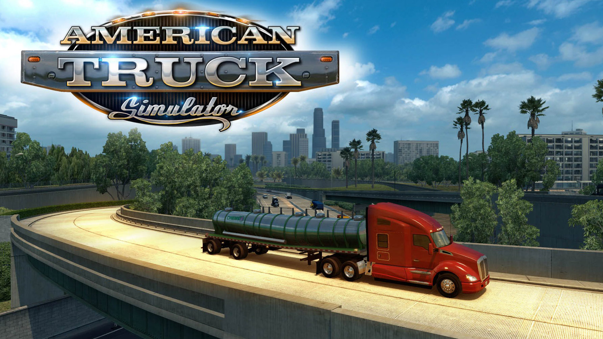

> _Retrospectiva săptămânii_ este rubrica duminicală în care trecem în revistă evenimentele săptămânii de pe frontul de gaming: știri şi articole (scrise de alții, bineînțeles, că e mai ușor aşa), industrie, lansări, oferte de jocuri, toate numai de savurat la cafeaua de duminică dimineața. (Și la care oricine poate contribui. ^[Dacă ai citit vreun articol sau vreo știre interesantă și crezi că merită inclusă în retrospectiva săptămânii, te așteptăm cu recomandarea ta pe forum, pe unul din topicurile dedicate: [Știri](https://forum.candaparerevista.ro/viewtopic.php?f=4&t=46), [Articole](https://forum.candaparerevista.ro/viewtopic.php?f=4&t=206), [Gaming România](https://forum.candaparerevista.ro/viewtopic.php?f=4&t=1622), [Oferte jocuri](https://forum.candaparerevista.ro/viewtopic.php?f=62&t=25)] )

## Ştiri

* Actorul Nathan Fillion a produs şi lansat pe cont propriu un scurt-metraj **Uncharted**, în care interpretează rolul lui Nathan Drake ([Ars Technica](https://arstechnica.com/gaming/2018/07/nathan-fillion-as-nathan-drake-uncharted-dreams-come-true-in-unofficial-video/), [Kotaku](https://kotaku.com/nathan-fillion-made-an-uncharted-fan-film-and-its-exce-1827624753)) şi a discutat cu Kotaku despre asta ([Kotaku](https://kotaku.com/nathan-fillion-tells-us-how-that-great-uncharted-fan-fi-1827634379))
* După lansarea dezastruoasă de săptămâna trecută, Xaviant Games retrage **The Culling 2** de la vânzare şi-şi concentrează eforturile pe întreţinerea şi dezvoltarea primului titlu al seriei ([GamesIndustry.biz](https://www.gamesindustry.biz/articles/2018-07-18-xaviant-games-removes-the-culling-2-from-storefronts), [RPS](https://www.rockpapershotgun.com/2018/07/18/the-culling-to-relaunch-free-to-play/), [Kotaku](https://kotaku.com/the-culling-2-tanks-so-hard-that-developers-pull-game-f-1827691214))
* Abonamentul lunar la **World of Warcraft** va include de acum acces la jocul de bază şi toate extensiile sale (mai puţin ultimul, încă nelansatul **Battle for Azeroth**) ([GamesIndustry.biz](https://www.gamesindustry.biz/articles/2018-07-18-blizzard-makes-wow-base-game-and-expansions-free-to-subscribers), [RPS](https://www.rockpapershotgun.com/2018/07/18/world-of-warcraft-no-need-to-buy/))
* Probabil că știați că Fortnite are un succes uriaș, dar știați și **cât** de uriaș? Ei bine, se pare că achizițiile in-game au generat, din octombrie 2017 până în luna mai A.D. venituri de 1 miliard (!) de dolari pentru Epic Games ([GamesIndustry.biz](https://www.gamesindustry.biz/articles/2018-07-17-fortnite-has-earned-usd1-billion-from-in-game-purchases-alone))
* Vânzători third-party au comercializat pe Amazon jocuri piratate precum **Frostpunk** sau **Surviving Mars** ([Kotaku](https://kotaku.com/amazon-temporarily-sells-pirated-copies-of-popular-pc-g-1827638232), [GamesIndustry.biz](https://www.gamesindustry.biz/articles/2018-07-16-amazon-may-have-sold-pirated-games), [Gamasutra](http://www.gamasutra.com/view/news/322419/Amazon_claims_to_be_spiking_listings_for_pirated_games.php))
* **Middle-Earth: Shadow of War** elimină _loot boxes_ permanent ([WB Community](https://community.wbgames.com/t5/Official-Announcements/Middle-earth-Shadow-of-War-Patch-14-July-17-2018/td-p/1882311), [RPS](https://www.rockpapershotgun.com/2018/07/17/middle-earth-shadow-of-war-boxes-gone/), [Kotaku](https://kotaku.com/shadow-of-war-is-now-microtransaction-free-1827666902))
* Un fost angajat Valve face dezvăluiri despre viaţa în companiile cu structură liberă (self-organizing company), cel mai probabil fiind vorba chiar de Valve. Tweet-urile sale descriu un o atmosferă departe de imaginea idealizată care s-a format despre Valve (thx @ne0lith) ([PC Gamer](https://www.pcgamer.com/ex-valve-employee-describes-ruthless-industry-politics/), [Reddit thread](https://www.reddit.com/r/valve/comments/8zmp07/former_valve_employee_tweets_his_experience_at/))

## Articole (critică, dev, design)

* [Why Great Strategy Games Need Great AI Generals](https://waypoint.vice.com/en_us/article/j5n89x/why-great-strategy-games-need-great-ai-generals) (Waypoint)
* [Brian Shared His Steam Account With His Dad. Then His Dad Stole It.](https://waypoint.vice.com/en_us/article/43pvep/brian-shared-his-steam-account-with-his-dad-then-his-dad-stole-it) (Waypoint)
* [Guiding children towards healthy gaming](https://www.gamesindustry.biz/articles/2018-07-19-guiding-children-towards-healthy-gaming) (GamesIndustry.biz)
* [Game remakes shouldn't be afraid to change the classics](https://www.pcgamer.com/game-remakes-shouldnt-be-afraid-to-change-the-classics/) (PC Gamer)
* [Dungeons &amp; Dragons helped me appreciate narrative game design](https://www.eurogamer.net/articles/2018-07-21-dungeons-and-dragons-helped-me-appreciate-narrative-game-design) (Eurogamer)
* [Does bad archaeology make for the best games?](https://www.eurogamer.net/articles/2018-07-18-does-bad-archaeology-make-for-the-best-games) (Eurogamer)
* [Crowdfunding and Video Games: 2018 Mid-Year Update](http://www.gamasutra.com/blogs/ThomasBidaux/20180717/322259/Crowdfunding_and_Video_Games_2018_MidYear_Update.php) (Gamasutra)
* [Who will will the race to be the dominant streaming service for games?](https://www.gamasutra.com/blogs/MorganJaffit/20180717/322226/Who_will_will_the_race_to_be_the_dominant_streaming_service_for_games.php) (Gamasutra)

#### _Not-a-review_
* (Wolfenstein II) [How Wolfenstein II Lost Its Head Over Toxic Masculinity](https://unwinnable.com/2018/07/17/how-wolfenstein-ii-lost-its-head-over-toxic-masculinity/) (Unwinnable)
* (World of Warcraft) [Breaking down Azeroth's gates](https://www.gamesindustry.biz/articles/2018-07-19-breaking-down-azeroths-gates) (GamesIndustry.biz)
* (Sable) [Sable’s developers are trying to capture the spirit of discovery](https://www.rockpapershotgun.com/2018/07/19/sables-developers-are-trying-to-capture-the-spirit-of-discovery/) (RPS)
* (Hitman) [Hitman and the joy of killing your boss](https://www.rockpapershotgun.com/2018/07/19/hitman-and-the-joy-of-killing-your-boss/) (RPS)
* (Yoku’s Island Express) [How a cup of coffee saved Yoku’s Island Express](https://www.rockpapershotgun.com/2018/07/18/how-a-cup-of-coffee-saved-yokus-island-express/) (RPS)
* (Hearthstone) [How data analysis is helping Hearthstone players crush their opponents](https://www.pcgamer.com/how-data-analysis-is-helping-hearthstone-players-crush-their-opponents/) (PC Gamer)
* (Cultist Simulator) [Cultist Simulator: the retrospective](https://www.gamasutra.com/blogs/LottieBevan/20180716/322016/Cultist_Simulator_the_retrospective.php) (Gamasutra)

#### Vocea industriei
* Sean Murray (Hello Games) a vorbit cu presa pentru prima dată după doi ani, într-o serie de interviuri despre **No Man’s Sky**:
  * [We Spent an Hour Talking to Hello Games About Everything ‘No Man’s Sky’](https://waypoint.vice.com/en_us/article/zmk4w8/we-spent-an-hour-talking-to-hello-games-about-everything-no-mans-sky) (Waypoint)
  * [No Man’s Sky developer Sean Murray: ‘It was as bad as things can get’](https://www.theguardian.com/games/2018/jul/20/no-mans-sky-next-hello-games-sean-murray-harassment-interview) (The Guardian)
  * [The big Sean Murray interview](https://www.eurogamer.net/articles/2018-07-20-the-big-sean-murray-interview) (Eurogamer)
  * [&ldquo;We always knew we were making a polarising game&rdquo;: Sean Murray on the shaky past, exciting present, and bright future of No Man&rsquo;s Sky](https://www.gamesradar.com/we-always-knew-we-were-making-a-polarising-game-sean-murray-on-the-shaky-past-exciting-present-and-bright-future-of-no-mans-sky/) (GamesRadar+)
  * TL;DR: [Sean Murray breaks his silence on No Man’s Sky’s development, launch](https://arstechnica.com/gaming/2018/07/sean-murray-breaks-his-silence-on-no-mans-skys-development-launch/) (Ars Technica)
* Todd Howard şi Pete Hines (Bethesda):  [The Elder Scrolls VI, Starfield and the future of video game giant Bethesda](https://www.theguardian.com/games/2018/jul/18/bethesda-games-interview-todd-howard-pete-hines-elder-scrolls-starfield) (The Guardian)
* Din nou Pete Hines (Bethesda): [Fallout 76 and the thrill of 'stranger danger'](https://www.gamesindustry.biz/articles/2018-07-18-fallout-76-and-the-benefits-of-stranger-danger) (GamesIndustry.biz)
* Arnie Jorgensen (Stoic) [End of a Saga: What Stoic learnt from the Mass Effect finale](https://www.gamesindustry.biz/articles/2018-07-19-end-of-a-saga-what-stoic-learnt-from-the-mass-effect-finale) (GamesIndustry.biz)
* O discuţie despre industria gamedev din America Latină, dar aplicabilă şi pentru România: [&quot;Real innovation is coming from emerging markets in many spaces - game development is one of them&quot;](https://www.gamesindustry.biz/articles/2018-07-18-real-innovation-is-coming-from-emerging-markets-in-many-spaces-game-development-is-one-of-them) (GamesIndustry.biz)
* Peter O'Reilly (Unity Asset Store):  [&quot;Games wouldn't see the light of day&quot; without asset stores](https://www.gamesindustry.biz/articles/2018-07-19-well-88-percent-of-what-asks-unitys-global-head-of-asset-store) (GamesIndustry.biz)
* Michael Schade (Rockfish): [Live Steam broadcasting will change the game for indie marketing](https://www.gamesindustry.biz/articles/2018-07-20-rockfish-steam-store-page-broadcasting-is-a-game-changer-for-indie-marketing) (GamesIndustry.biz)
* Raphael Lacoste (Ubisoft): [Why Ubisoft isn&#8217;t replacing artists with AI tech for Assassin&#8217;s Creed](https://venturebeat.com/2018/07/19/why-ubisoft-isnt-replacing-artists-with-ai-tech-for-assassins-creed/) (VentureBeat)
* Laurent Detoc (Ubisoft): [Why Ubisoft needs 12,000 game developers](https://venturebeat.com/2018/06/21/why-ubisoft-needs-12000-game-developers/) (VentureBeat)

#### Istorie
* [30 years ago, Bionic Commando proved video game grappling hooks are awesome](https://games.avclub.com/30-years-ago-bionic-commando-proved-video-game-grappli-1827755958) (A.V. Club)
* [The history of hit points](https://www.pcgamer.com/the-history-of-hit-points/) (PC Gamer)
* [The Creativity Driving DOS Nostalgia](https://tedium.co/2018/07/17/dos-nostalgia-squirrel-monkey-interview/) (Tedium)
* [Modern Mallard: Duck Hunt&#x27;s Missing Upgrade](https://tedium.co/2018/07/17/duck-hunt-modern-mallard/) (Tedium)

#### Design, world-building
* [Nature&#039;s Grasp | Assassin&#039;s Creed: Origins](http://www.heterotopiaszine.com/2018/07/18/natures-grasp-assassins-creed-origins/) (Heterotopias)
* [The Anatomy of a Stealth Encounter](http://www.gamasutra.com/blogs/TravisHoffstetter/20180719/322423/The_Anatomy_of_a_Stealth_Encounter.php) (Gamasutra)
* [Level design: Tricks of the trade](https://www.gamasutra.com/blogs/JonathonWilson/20180720/322564/Level_design_Tricks_of_the_trade.php) (Gamasutra)

## Anunţuri şi lansări de jocuri
#### Anunţate
* **The Light Keeps Us Safe**, un nou joc cu roboți și furișare de la Big Robot, care au mai făcut un joc cu roboți și furișare (**Sir, You Are Being Hunted**) ([RPS](https://www.rockpapershotgun.com/2018/07/20/big-robot-announce-the-light-keeps-us-safe), [Eurogamer](https://www.eurogamer.net/articles/2018-07-20-the-light-keeps-us-safe-announced-as-big-robots-latest-game))
* **King Tide**, battle royale sub apă ([RPS](https://www.rockpapershotgun.com/2018/07/20/king-tide-is-underwater-battle-royale-with-sharks/))
* **Total War: Rome 2 Rise Of The Republic**, cu dată de lansare pe 9 august ([Gamereactor](https://www.gamereactor.eu/news/681053), [RPS](https://www.rockpapershotgun.com/2018/07/19/total-war-2-rise-of-the-republic-dlc/))
* **Exapunks**, un joc de “cyberpunk hacking” de la Zachtronics ([RPS](https://www.rockpapershotgun.com/2018/07/18/exapunks-zachlike-date-announcement/), [PC Gamer](https://www.pcgamer.com/opus-magnum-studio-zachtronics-unveils-its-new-hacking-game-exapunks/))
* **The Cycle**, un shooter multiplayer SF (nu e deathmatch sau battle royale, ci “competitive quester”) de la Yager (**Spec Ops: The Line**) ([Games Informer](https://www.gameinformer.com/preview/2018/07/20/spec-ops-the-line-developer-sets-its-sights-on-multiplayer), [PC Gamer](https://www.pcgamer.com/the-cycle-is-a-competitive-quester-coming-from-spec-ops-studio-yager/))

#### Acum cu dată de lansare
* **State of Mind**: 15 august ([Hardcore Gamer](https://www.hardcoregamer.com/2018/07/12/transhumanist-thriller-state-of-mind-confirmed-for-august-release/305958/))
* **Pathfinder: Kingmaker**: 25 septembrie ([RPS](https://www.rockpapershotgun.com/2018/07/20/pathfinder-kingmaker-date-trailer/))

#### Lansate
* 16 iulie: **Thief of Thieves: Season One** ([Steam](https://store.steampowered.com/app/635390/Thief_of_Thieves_Season_One/))
* 17 iulie: **Adventure Time: Pirates Of The Enchiridion** ([Steam](https://store.steampowered.com/app/728240/Adventure_Time_Pirates_of_the_Enchiridion/))
* 17 iulie: **MOTHERGUNSHIP** ([Steam](https://store.steampowered.com/app/574090/MOTHERGUNSHIP/), [Humble Store](https://www.humblebundle.com/store/mothergunship))
* 17 iulie: **GNOG** ([Steam](https://store.steampowered.com/app/290510/GNOG/), [gog.com](https://www.gog.com/game/gnog), [Humble Store](https://www.humblebundle.com/store/gnog))
* 17 iulie: **Mugsters** ([Steam](https://store.steampowered.com/app/712180/Mugsters/))
* 19 iulie: **Pool Panic** ([Steam](https://store.steampowered.com/app/522240/Pool_Panic/))
* 19 iulie: **Detective Case and Clown Bot in: The Express Killer** ([Steam](https://store.steampowered.com/app/711920/Detective_Case_and_Clown_Bot_in_The_Express_Killer/), [Indie Gala](https://www.indiegala.com/store/product/detective-case-and-clown-bot-in-the-express-killer/711920) - dacă îl luaţi de aici, primiţi gratis şi primul joc din serie, **Detective Case and Clown Bot in: Murder in the Hotel Lisbon**)
* 20 iulie: **The Miskatonic** ([Steam](https://store.steampowered.com/app/870290/The_Miskatonic/))

## Oferte jocuri
#### Humble Bundle
* [Pixel Perfect Platformers Sale](https://www.humblebundle.com/store/promo/pixel-perfect-platformers-sale): sunt la reducere numeroase platformere, și nu doar pixel perfect, ci și diverse jocuri metroidvania și alte side scrollers mai vechi sau mai noi. Nouă ne-au sărit în ochi **Cuphead**, **Rayman Origins** & **Legends**, **INSIDE**, cele două colecții **Megaman**, **Axiom Verge**, precum și seriile **Trine** și **Oddworld**
* [Frontier Sale](https://www.humblebundle.com/store/promo/frontier-sale), dacă aşteptaţi o reducere la **Elite: Dangerous** sau **Planet Coaster**
* [Humble CI Games Bundle](https://www.humblebundle.com/games/cigames-bundle): un bundle ale cărui highlights sunt **Lords of the Fallen** și seria **Sniper**

#### Steam
* [Double Fine Publisher Weekend](https://store.steampowered.com/sale/doublefine). Până mâine sunt la reducere toate jocurile produse sau distribuite de Double Fine. Puteți încerca fie un remastered classic precum **Day of the Tentacle**, **Grim Fandango** sau **Full Throttle**, fie câteva dintre producțiile lor mai mult sau mai puțin recente - **Psychonauts**, **Brutal Legend** sau **Broken Age**
* [Enter the Gungeon](https://store.steampowered.com/app/311690/Enter_the_Gungeon/) are prețul redus cu 50% (7,49 €). Concomitent cu reducerea, jocul a primit și o doză masivă de conținut gratuit în ultimul DLC - **Advanced Gungeons & Draguns**
* [Middle Earth: Shadow of War](https://store.steampowered.com/app/356190/Middleearth_Shadow_of_War/) este la promoție cu -66% (20,40 € pentru varianta de bază, 34 € pentru Gold Edition)
* [Darksiders Franchise Pack](https://store.steampowered.com/sub/81557/): **Darksiders Warmastered Edition** + **Darksiders II Deathinitive Edition** pentru 7,49 €
* [American Truck Simulator](https://store.steampowered.com/app/270880/American_Truck_Simulator/) la un preţ bun, 4,49 €

#### gog.com
* [Odd Weekend Sale](https://www.gog.com/partner/oddweekendsale): o promoție la jocuri relativ recente precum **Battletech**, **Cuphead**, **Wizard of Legend**, **Overload** și multe altele
* Încă o promoţie [Interplay](https://www.gog.com/promo/20180720_interplay_weekend), dacă încă nu aveţi toate jocurile, voi şi cunoscuţii voştri. Dar aveţi ce alege: seriile **Descent**, **Freespace**, **Earthworm Jim**, adventure-uri **Star Trek** şi alţi clasici ca **Evolva**, **Giants: Citizen Kabuto**, **Sacrifice** sau **Toonstruck**

#### Fanatical
* [S.T.A.L.K.E.R. Complete Bundle](https://www.fanatical.com/en/bundle/stalker-complete-bundle): **Shadow of Chernobyl**, **Clear Sky** și **Call of Pripyat** pentru 7,59 €

#### Altele
* A început [Summer Sale pe Green Man Gaming](https://www.greenmangaming.com/summer-sale/). La fiecare 12 și 24 ore apar câteva noi flash deals cu reduceri de până la 80%
* Indie Gala are diverse reduceri, dar cu preţuri în dolari, precum [Mad Max](https://www.indiegala.com/store/product/mad-max/234140_gb) ($ 4.99), [Borderlands 2 GOTY](https://www.indiegala.com/store/product/borderlands-2-game-of-the-year/32848) ($ 7.99), sau [seria Hitman](https://www.indiegala.com/store/hitman-games)
* [Chrono.gg](https://chrono.gg/) are la reducere doar până diseară [Exoplanet: First Contact](https://store.steampowered.com/app/531660/Exoplanet_First_Contact/) pentru 12 $, un space western RPG aflat încă în Early Access

## Recomandarea săptămânii: _American Truck Simulator_

Şosele nesfârşite şi motoare puternice, ce-ţi poţi dori mai mult de la vară? După succesul avut de **Euro Truck Simulator 2**, SCS Software au mutat seria în America, păstrând însă reţeta, adăugând însă autostrăzile şi atmosfera americană de road trip, la care contribuie din plin şi muzica. Jocul are bineînţeles şi partea de simulare a afacerii, în care îţi dezvolţi afacerea cu camioane şi transporţi marfă, şi partea de simulare fizică a camioanelor, dar puteţi ignora liniştiti toate părţile astea dacă vreţi şi să vă bucuraţi doar de condus, mai ales dacă aveţi un volan.

Jocul a fost foarte bine primit la lansare, fiind apreciat atât de jucători (numărul 1 în topul Steam) cât şi de presă: [RPS](https://www.rockpapershotgun.com/2016/02/04/american-truck-simulator-review/), [PC Gamer](https://www.pcgamer.com/american-truck-simulator-review/), [Eurogamer](https://www.eurogamer.net/articles/2016-02-03-american-truck-simulator-review), [Polygon](https://www.polygon.com/2016/2/4/10906288/american-truck-simulator-review), [Hardcore Gamer](https://www.hardcoregamer.com/2016/02/21/review-american-truck-simulator/193563/).

Atenţie, jocul de bază conţine doar 3 state, California, Nevada şi Arizona (e o zonă foarte mare, oricum), dar mai există nişte DLC-uri care extind zona de condus.

Cumpăraţi-l de pe [Steam](https://store.steampowered.com/app/270880/American_Truck_Simulator/), unde îl găsiţi momentan la reducere cu 5 euro. Are și [demo](steam://install/441960) dacă vreți să-l încercați înainte.
