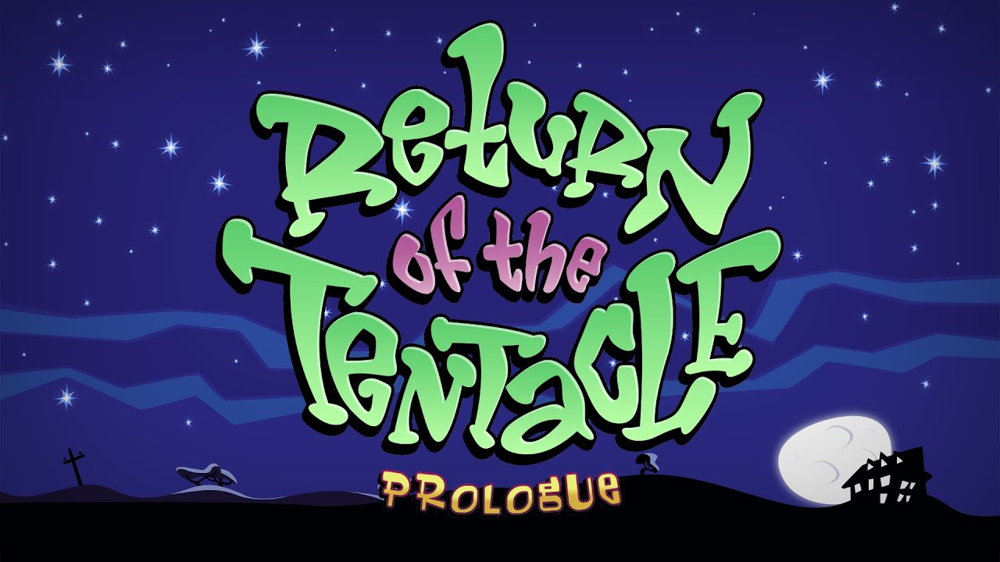

> _Retrospectiva săptămânii_ este rubrica duminicală în care trecem în revistă evenimentele săptămânii de pe frontul de gaming: știri şi articole (scrise de alții, bineînțeles, că e mai ușor aşa), industrie, lansări, oferte de jocuri, toate numai de savurat la cafeaua de duminică dimineața. (Și la care oricine poate contribui. ^[Dacă ai citit vreun articol sau vreo știre interesantă și crezi că merită inclusă în retrospectiva săptămânii, te așteptăm cu recomandarea ta pe forum, pe unul din topicurile dedicate: [Știri](https://forum.candaparerevista.ro/viewtopic.php?f=4&t=46), [Articole](https://forum.candaparerevista.ro/viewtopic.php?f=4&t=206), [Gaming România](https://forum.candaparerevista.ro/viewtopic.php?f=4&t=1622), [Oferte jocuri](https://forum.candaparerevista.ro/viewtopic.php?f=62&t=25)] )

## Ştiri

* Un hacker din Bulgaria a fost arestat pentru că a spart sistemul de protecție anti-piratare Denuvo ([Kotaku](https://kotaku.com/renowned-hacker-arrested-for-cracking-denuvo-anti-pirac-1827874582), [PC Gamer](https://www.pcgamer.com/denuvo-sues-voski-the-pirate-who-helped-crack-it/), [GamesIndustry.biz](https://www.gamesindustry.biz/articles/2018-07-26-denuvo-investigation-reportedly-leads-to-arrest-for-games-pirate-voksi))
* După ştirea de săptămâna trecută despre **Aliens: Colonial Marines**, săptămâna asta avem o altă ştire despre un joc a cărui performanţă a fost îmbunătăţită semnificativ cu un simplu delete. Aflăm astfel că o singură linie de cod din **Warhammer Online: Age of Reckoning**, moștenită de pe vremea MMO-ului Dark Age of Camelot, avea ca efect fragmentarea jocului, ducând la o experiență de joc neplăcută pentru toți jucătorii ([Gamasutra](http://www.gamasutra.com/view/news/323020/An_overlooked_line_of_code_led_to_slow_performance_for_Warhammer_Online.php), [Waypoint](https://waypoint.vice.com/en_us/article/ywk3qb/mmo-code-typo))
* Nintendo dă în judecată două site-uri din Statele Unite care puneau la dispoziția vizitatorilor numeroase jocuri vechi ale companiei japoneze sub formă de ROMs, fie online, jucabile în browser, fie ca download, pentru a fi jucate într-un emulator ([Gamasutra](http://www.gamasutra.com/view/news/322665/Nintendo_files_lawsuit_against_two_popular_ROM_websites.php), [Ars Technica](https://arstechnica.com/gaming/2018/07/nintendo-to-rom-sites-forget-cease-and-desist-now-were-suing/), [PC Gamer](https://www.pcgamer.com/nintendo-files-lawsuit-against-emulator-sites/))
* Din nou LOOT BOXES!:
  * Valve revine asupra deciziei de a bloca cutiile în Olanda și Belgia şi implementează altă soluţie: au reactivat _loot boxes_, dar acum afișează de la începutul conținutul lor ([Gamasutra](http://www.gamasutra.com/view/news/322911/Dota_2_loot_boxes_now_reveal_contents_ahead_of_purchase_for_Dutch_players.php), [PC Gamer](https://www.pcgamer.com/dota-2-players-in-the-netherlands-can-now-see-whats-in-loot-boxes-before-they-buy/))
  * Pe de altă parte, Turn 10 Studios anunţă că vor elimina cutiile din **Forza Motorsport 7**, iar în **Forza Horizon 4** nu le vor implementa ([PC Gamer](https://www.pcgamer.com/forzas-loot-boxes-and-paid-tokens-are-going-away/), [Eurogamer](https://www.eurogamer.net/articles/2018-07-26-loot-boxes-to-be-removed-from-forza-motorsport-7))
  * Iar **Rocket League** au publicat şansele de reuşită pentru obiectele din cutiuţele lor ([PC Gamer](https://www.pcgamer.com/rocket-league-loot-box-odds-revealed/))

## Articole (critică, dev, design)

* USGamer au publicat o serie de trei articole despre scenariștii din spatele jocurilor jocurilor:
  * Partea I: [Out of the Wild West: Inside the Evolution of Games Writing](https://www.usgamer.net/articles/writing-in-games-feature-part-one-wild-west) (USgamer.net)
  * Partea II: [Narrative Paramedics: Meet the Writers Called in to Patch Up Games](https://www.usgamer.net/articles/writing-in-games-feature-part-two-narrative-paramedics) (USgamer.net)
  * Partea III: [From The Witcher 3 to Queer Dating Sims: How Writers are Expanding the Boundaries of Video Game Storytelling](https://www.usgamer.net/articles/writing-in-games-feature-part-three-cd-projekt-red) (USgamer.net)
* [The road to video game hell](https://www.eurogamer.net/articles/2018-07-23-the-road-to-video-game-hell) (Eurogamer)
* [Game Studio With No Bosses Pays Everyone The Same](https://kotaku.com/game-studio-with-no-bosses-pays-everyone-the-same-1827872972) (Kotaku)
* [Skill vs RNG -- The Debate of Controlling Progress](http://www.gamasutra.com/blogs/JoshBycer/20180725/322827/Skill_vs_RNG__The_Debate_of_Controlling_Progress.php) (Gamasutra)
* [Video Games and the Importance of Challenging Yourself](https://www.gamasutra.com/blogs/AndrewHeikkila/20180722/322621/Video_Games_and_the_Importance_of_Challenging_Yourself.php) (Gamasutra)
* [What it's like to launch an indie game in 2018, hour-by-hour](https://www.pcgamer.com/what-its-like-to-launch-an-indie-game-in-2018-hour-by-hour/) (PC Gamer)
* [Ghosts, cocaine, fistfights, porn, poop, and police - the untold stories of game development - VG247](https://www.vg247.com/2018/07/25/ghosts-toilets-cocaine-fistfights-porn-poop-police-untold-stories-game-development/) (VG247)
* [Why competitive gaming is starting to look a lot like professional sports](https://www.theverge.com/2018/7/27/17616532/overwatch-league-of-legends-nba-nfl-esports) (The Verge)

#### _Not-a-review_
* (Darkest Dungeon) [Two years later, Darkest Dungeon is completely different for the better](https://arstechnica.com/gaming/2018/07/two-years-later-darkest-dungeon-is-completely-different-for-the-better/) (Ars Technica)
* (Hollow Knight) [Hollow Knight beats Metroid, Dark Souls at their own brutal game](https://arstechnica.com/gaming/2018/07/hollow-knight-beats-metroid-dark-souls-at-their-own-brutal-game/) (Ars Technica)
* (Hollow Knight) [A Fun Example of Video Game Logic](http://www.kotaku.co.uk/2018/07/26/a-fun-example-of-video-game-logic) (Kotaku)
* (Night in the Woods) [Narrativizing Night in the Woods](https://www.gamasutra.com/blogs/JustinReeve/20180727/322644/Narrativizing_Night_in_the_Woods.php) (Gamasutra)
* (No Man's Sky) [Is multiplayer really what No Man's Sky needs?](https://www.pcgamer.com/is-multiplayer-really-what-no-mans-sky-needs/) (PC Gamer)
* (Genital Jousting) [How a game about dicks sold hundreds of thousands of copies](https://www.pcgamer.com/how-a-game-about-dicks-sold-hundreds-of-thousands-of-copies/) (PC Gamer)
* (Singularity) [Remembering Singularity, Raven Software's forgotten shooter](https://www.eurogamer.net/articles/2018-07-22-remembering-singularity-raven-softwares-forgotten-shooter) (Eurogamer)
* (Dragon Age) [An English Major and Her Xbox: Dragon Age and the Bible](http://sidequest.zone/2018/07/26/an-english-major-and-her-xbox-dragon-age-and-the-bible/) (Sidequest)

#### Vocea industriei
* Brendan Greene (PUBG Corporation): [Video chat with PUBG creator: “We could put battle royale in everything”](https://arstechnica.com/gaming/2018/07/video-chat-with-pubg-creator-we-could-put-battle-royale-in-everything/) (Ars Technica)
* Fredrik Wester (Paradox): [&quot;We've released crappy games in the past... I don't want to do that anymore&quot;](https://www.gamesindustry.biz/articles/2018-07-27-paradox-weve-released-crappy-games-in-the-past-i-dont-want-to-do-that-anymore) (GamesIndustry.biz)
* Chet Faliszek (Bossa Studios, ex-Valve): [Old Man Faliszek](http://www.kotaku.co.uk/2018/07/27/old-man-faliszek) (Kotaku)

#### Istorie
* Un documentar despre istoria gog.com realizat de cei de la Noclip: [How piracy led to GOG encouraging DRM-free releases](http://www.gamasutra.com/view/news/322696/How_piracy_led_to_GOG_encouraging_DRMfree_releases_.php) (Gamasutra) , [Noclip&#8217;s latest documentary charts the rise of GOG](https://www.rockpapershotgun.com/2018/07/23/noclip-gog-documentary-video/) (RPS) sau video direct: [GOG: Preserving Gaming&#39;s Past &amp; Future](https://www.youtube.com/watch?v=ffngZOB1U2A)) (YouTube)
* [The Game Archaeologist: Digging up the history of City of Heroes](https://massivelyop.com/2018/07/28/the-game-archaeologist-digging-up-the-history-of-city-of-heroes/) (Massively OP)
* [Geneza lui Counter-Strike](https://zonait.tv/geneza-lui-counter-strike/) (zonait.tv )

#### Design, world-building
* [The Mechanics of Worldbuilding](https://www.gamasutra.com/blogs/JustinReeve/20180725/322643/The_Mechanics_of_Worldbuilding.php) (Gamasutra)
* [Technological Oppression | Remember Me](http://www.heterotopiaszine.com/2018/07/26/technological-oppression-remember/) (Heterotopias)
* [Building Worlds](https://www.slowrun.me/2018/07/building-worlds.html) (SlowRun)
* [The Joy of getting lost in Shape of the World](https://www.rockpapershotgun.com/2018/07/23/the-joy-of-getting-lost-in-shape-of-the-world/) (RPS)
* [The D20 Beat: Re-creating The Bard&#8217;s Tale most iconic scene](https://venturebeat.com/2018/07/22/the-d20-beat-re-creating-the-bards-tale-most-iconic-scene/) (VentureBeat)

## Made în România

* (Video) Interviu cu membrii studioului Critique Gaming (**Interrogation**) ([Cavaleria.ro](https://cavaleria.ro/gaming/jocurile-video-romania-2/))

#### Anunţate
* **Forsaken Remastered** (da, _clona-de-Descent-din-anii-90-Forsaken_) apare pe 31 iulie ([PC Gamer](https://www.pcgamer.com/90s-sci-fi-shooter-forsaken-is-coming-back-next-week/), [Polygon](https://www.polygon.com/2018/7/24/17607706/forsaken-remastered-release-date-windows-pc-xbox-one))
* **Salt & Sanctuary** vine și pe Switch pe 2 august ([YouTube](https://www.youtube.com/watch?v=flMpzI1_WH0))
* **Irony Curtain: From Matryoshka with Love** (thx @cg1700) ([Gematsu](https://gematsu.com/2018/07/point-and-click-adventure-game-irony-curtain-from-matryoshka-with-love-announced-for-ps4-xbox-one-switch-and-pc), [VG247](https://www.vg247.com/2018/07/25/irony-curtain-satirical-adventure-game-surviving-cartoon-totalitarianism/))
* Două expansion-uri de la Amplitude Studios vin pe 2 august: **Endless Space 2 Supremacy** și **Endless Legend Inferno** ([PC Gamer](https://www.pcgamer.com/endless-space-2-and-endless-legend-announce-new-expansions-due-august-2/))
* **Devil's Hunt**, un action game bazat pe romanul unui autor din Polonia despre un război între demoni și îngeri ([Gamereactor](https://www.gamereactor.eu/news/682453), [PC Gamer](https://www.pcgamer.com/devils-hunt-is-a-new-action-game-that-will-take-you-to-hell-and-back-again/))
* **Steel Division 2**, următoarea strategie de la Eugen Systems, care se mută acum pe frontul de est ([PC Gamer](https://www.pcgamer.com/steel-division-2-announced-moving-to-the-eastern-front/))
* **Among Trees**, un “small vibrant first-person survival adventure”, “set in a colorful wilderness world teeming with life” ([RPS](https://www.rockpapershotgun.com/2018/07/23/among-trees-pretty-survival-game/))
* **The Sojourn**, un first-person exploration-puzzle adventure ([VentureBeat](https://venturebeat.com/2018/07/26/the-sojourn-is-a-dimension-shifting-puzzler-in-a-fantasy-world/))
* **Rising Lords**, un TBS medieval ce aduce mai mult cu un board-game, și cu ture simultane ([Gamereactor](https://www.gamereactor.eu/news/682043))

#### Acum cu dată de lansare
* **Anamorphine**: 31 iulie ([PC Gamer](https://www.pcgamer.com/anamorphine-an-adventure-about-coping-with-mental-illness-comes-out-on-july-31/))
* **Fractured Lands**: 31 iulie ([PC Gamer](https://www.pcgamer.com/fractured-lands-the-mad-max-battle-royale-game-races-into-early-access-next-week/))
* **Guacamelee! 2**: 21 august ([RPS](https://www.rockpapershotgun.com/2018/07/24/guacamelee-2-release-date-august-21st/))
* **The Occupation**: 9 octombrie ([PC Gamer](https://www.pcgamer.com/the-occupation-an-investigative-race-against-the-clock-will-launch-in-october/))

#### Lansate
* 22 iulie: prima parte din **Return of the Tentacle**, un fan-fiction sequel pentru **Day of the Tentacle** ([PC Gamer](https://www.pcgamer.com/part-one-of-fan-made-day-of-the-tentacle-sequel-available-to-download/), [itch.io](https://catmic.itch.io/return-of-the-tentacle))
* 24 iulie: episodul 3 din **The Council** ([Steam](https://store.steampowered.com/app/287630/The_Council/))
* 24 iulie: **Semblance** ([Steam](https://store.steampowered.com/app/700160/Semblance/), [gog.com](https://www.gog.com/game/semblance))
* 24 iulie: **Airheart** ([Steam](https://store.steampowered.com/app/531180/AIRHEART__Tales_of_broken_Wings/))
* 25 iulie: **Camp W** ([Steam](https://store.steampowered.com/app/820510/Camp_W/))
* 25 iulie: **Ys: Memories of Celceta** ([Steam](https://store.steampowered.com/app/587110/Ys_Memories_of_Celceta/))
* 26 iulie: **Sleep Tight**: ([Steam](https://store.steampowered.com/app/755670/Sleep_Tight/))
* 26 iulie: **The Banner Saga 3** ([Steam](https://store.steampowered.com/app/485460/The_Banner_Saga_3/))

## Oferte jocuri

#### Humble Bundle
Opţiuni numeroase în acest weekend:

* Cei care achiziționează 12 luni de Humble Monthly [vor primi 20$ credit în Humble Wallet](https://www.humblebundle.com/monthly/)
* [No Man&#39;s Sky](https://www.humblebundle.com/store/no-mans-sky) are 50% reducere (29,99€) cu ocazia ultimului update, care a adăugat multiplayer. Dacă vreți jocul și nu aveți un abonament activ de Humble Monthly, care vă dă 10% reducere suplimentară, mai bine îl luați de pe Steam, unde e puțin mai ieftin
* [Fellow Traveller Publisher Sale](https://www.humblebundle.com/store/promo/fellow-traveller-publisher-sale/), din care ați putea alege, de exemplu, [Hacknet](https://www.humblebundle.com/store/hacknet) (1,99€) , [Screencheat](https://www.humblebundle.com/store/screencheat) (4,41€)  sau [FRAMED Collection](https://www.humblebundle.com/store/framed-collection) (6,99€)
* Promoţia de weekend este [RPG Weekend](https://www.humblebundle.com/store/promo/rpg-weekend/) cu o mulțime de RPG-uri mai noi sau mai vechi la reducere: [The Witcher 3: Wild Hunt GOTY](https://www.humblebundle.com/store/the-witcher-3-wild-hunt-game-of-the-year-edition) (19,99€) , [Kingdom Come: Deliverance](https://www.humblebundle.com/store/kingdom-come-deliverance) (34,99€), [ELEX](https://www.humblebundle.com/store/elex) (24,99€), [Torment: Tides of Numenera](https://www.humblebundle.com/store/torment-tides-of-numenera) (14,84€) , [Wasteland 2: Director&#39;s Cut](https://www.humblebundle.com/store/wasteland-2-directors-cut-digital-deluxe-edition) (13,74€) , [Tyranny - Commander Edition](https://www.humblebundle.com/store/tyranny-commander-edition) (14,27€)
* Vinerea viitoare se deblochează Humble Monthly-ul de august. Vă reamintim că _early unlocks_ pentru această lună sunt [A Hat in Time](https://www.humblebundle.com/store/a-hat-in-time), [The Escapists 2](https://www.humblebundle.com/store/the-escapists-2) și [Conan Exiles](https://www.humblebundle.com/store/conan-exiles), deci e cazul să vă grăbiți dacă vreți să le luați pentru 12$

#### Steam
Şi aici avem numeroase opţiuni:

* [Supergiant Collection](https://store.steampowered.com/sale/super_giant/), din care aţi putea lua [Pyre](https://store.steampowered.com/app/462770/Pyre/) (7,99€), [Transistor](https://store.steampowered.com/app/237930/Transistor/) (3,79€), [Bastion](https://store.steampowered.com/app/107100/Bastion/) (2,99€)
* [No Man's Sky](https://store.steampowered.com/app/275850/No_Mans_Sky/) (27,49€) are și aici 50% reducere, dar e puțin mai iefin decât pe Humble
* [Battlezone Franchise](https://store.steampowered.com/sale/battlezone) are o promoție la remasterizările recente ale jocurilor clasice: [Battlezone 98 Redux](https://store.steampowered.com/app/301650/Battlezone_98_Redux) (4,99€), [Battlezone: Combat Commander](https://store.steampowered.com/app/624970/Battlezone_Combat_Commander/) (6,79€), dar și la noul [Battlezone Gold Edition](https://store.steampowered.com/app/312650/Battlezone_Gold_Edition/) (17,49€)
* Alte reduceri: [Browsing](https://store.steampowered.com/search/?filter=weeklongdeals:) [Shadowgate](https://store.steampowered.com/app/294440/Shadowgate/) (2,99€), [Tower of Guns](https://store.steampowered.com/app/266110/Tower_of_Guns/) (3,74€), [Figment]([Figment](https://store.steampowered.com/app/493540/Figment/) (9,99€) ) (9,99€), [Valiant Hearts: The Great War / Soldats Inconnus : Mémoires de la Grande Guerre](https://store.steampowered.com/app/260230/Valiant_Hearts_The_Great_War__Soldats_Inconnus__Mmoires_de_la_Grande_Guerre/) (5,09€), [Valley](https://store.steampowered.com/app/378610/Valley/) (2,99€), [Knights of Honor](https://store.steampowered.com/app/25830/Knights_of_Honor/) (2,49€), [Figment]([Figment](https://store.steampowered.com/app/493540/Figment/) (9,99€) ) (9,99€), [Door Kickers](https://store.steampowered.com/app/248610/Door_Kickers/) (2,84€), iar [Rogue Legacy](https://store.steampowered.com/app/241600/Rogue_Legacy/) (3,74€) a primit săptămâna trecută și primul său update după mai bine 4 ani (mai multe detalii [aici](https://steamcommunity.com/games/241600/announcements/detail/1723075465318263728))

#### gog.com
* Tot catalogul Telltale [a intrat la reducere](https://www.gog.com/promo/20180727_telltale_weekend). Recomandăm atât clasicele [Tales of Monkey Island](https://www.gog.com/game/tales_of_monkey_island) (4,89€) , [Wolf Among Us, The](https://www.gog.com/game/wolf_among_us_the) (8,09€), [The Walking Dead: Season 1](https://www.gog.com/game/walking_dead_season_1_the) (12,19€), cât și mai noile [Batman: The Enemy Within - The Telltale Series](https://www.gog.com/game/batman_the_enemy_within_the_telltale_series) (17,29€), sau [Marvel’s Guardians of the Galaxy: The Telltale Series](https://www.gog.com/game/guardians_of_the_galaxy) (12,19€)
* Pentru cei cu afinități nipone există și [o promoţie Ys, Agarest şi altele](https://www.gog.com/promo/20180725_japanese_midweek): [Ys I &amp; II Chronicles+](https://www.gog.com/game/ys_i_ii_chronicles) (3,69€), [Elminage Gothic](https://www.gog.com/game/elminage_gothic) (1,69€), [Higurashi When They Cry Hou - Ch.1 Onikakushi](https://www.gog.com/game/higurashi_when_they_cry_hou_ch1_onikakushi) (1,49€), [Hyperdimension Neptunia Re;Birth1](https://www.gog.com/game/hyperdimension_neptunia_rebirth1) (4,89€) și multe altele. Dar mai bine îl întrebați pe cg100 pe forum ce să vă luați de aici.
* Promoția [Noclip & Classic Gaming Sale](https://www.gog.com/partner/noclip), prilejuită de lansarea documentarului Noclip despre gog.com, conține o mulțime de jocuri, în care găsiți, pe lângă “clasici” de serviciu, și alte jocuri mai puțin vizibile sau prezente mai rar prin promoții, precum [Al-Qadim: The Genie&#039;s Curse](https://www.gog.com/game/alqadim_the_genies_curse) (1,69€) , [Throne of Darkness](https://www.gog.com/game/throne_of_darkness) (2,99€) , [Gabriel Knight: Sins of the Fathers](https://www.gog.com/game/gabriel_knight_sins_of_the_fathers) (3,19€) , [Arcanum: Of Steamworks and Magick Obscura](https://www.gog.com/game/arcanum_of_steamworks_and_magick_obscura) (3,19€) , [Jazz Jackrabbit Collection](https://www.gog.com/game/jazz_jackrabbit_collection) (6,49€) , [Escape from Monkey Island](https://www.gog.com/game/escape_from_monkey_island) (4,19€) , [Redline](https://www.gog.com/game/redline) (1,29€)  și o mulțime de alte jocuri (serios, sunt cam 100 la reducere).
* Battlezone [are o promoție și aici](https://www.gog.com/promo/20180726_battlezone)
* Și [No Man&#039;s Sky](https://www.gog.com/game/no_mans_sky) (24,29€)  are aceeași reducere de 50% aici, cu diferența că update-ul cu multiplayer încă n-a ajuns și la varianta DRM-free.

#### GreenManGaming
* [Nioh: Complete Edition](https://store.steampowered.com/app/485510/Nioh_Complete_Edition___Complete_Edition/) la cel mai mic preţ de până acum (aprox. 23€)
* Continuă [Summer Sale](https://www.greenmangaming.com/summer-sale/), cu flash deals la fiecare 12 ore

## Recomandarea săptămânii: _Return of the Tentacle_

**Return of the Tentacle** este un sequel făcut de o mână de fani ai lui **Day of the Tentacle**, un clasic al genului adventure. Oamenii din spatele jocului au reușit să păstreze viu spiritul originalului, atât prin stilul grafic ce este aproape identic cu cel din DotT, cât și prin muzica inspirată din coloana sonoră a jocului vechi.

Puzzle-urile sunt destul de logice, doar cu ocazionale momente mai nebunești ce fac trimitere la logica întortocheată a lui DotT. Am fost plăcut surprins, de asemenea, de cât de line sunt tranzițiile între scene și cât de curat funcționează interfața. Deși voice acting-ul lasă de dorit în unele locuri, precum și calitatea dialogurilor, recomand călduros **Return of the Tentacle** pentru pasionații genului sau cei care doar vor să se întoarcă în timp, în universul acela întors pe dos.

Jocul este făcut cu pasiune, atât pentru original cât și pentru jocurile LucasArts, cele două ore de joc fiind presărate cu trimiteri destul de spumoase la alte titluri ale companiei. Unui neinițiat îi recomand să joace originalul mai întâi pentru a înțelege toate referințele, mai ales că varianta remastered e apărută deja de doi ani. Cu o durată de doar două ore jocul este numai bun de jucat într-o seară, fiind o experiență lejeră, de vară. (**Azad**)

Linkuri:

* [Site oficial + Download](https://catmic.itch.io/return-of-the-tentacle)
* Jocul original/remastered: [Steam](https://store.steampowered.com/app/388210/Day_of_the_Tentacle_Remastered/), [Humble Store](https://www.humblebundle.com/store/day-of-the-tentacle-remastered), [gog.com](https://www.gog.com/game/day_of_the_tentacle_remastered)
* [Discuţii pe forum](https://forum.candaparerevista.ro/viewtopic.php?f=8&t=1841)
