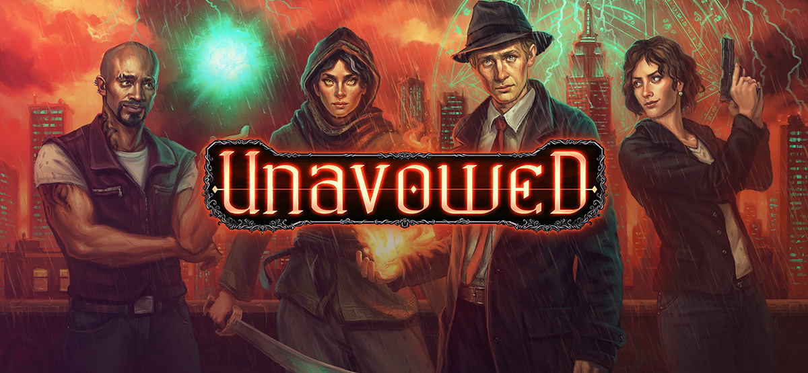

> _Retrospectiva săptămânii_ este rubrica duminicală în care trecem în revistă evenimentele săptămânii de pe frontul de gaming: știri şi articole (scrise de alții, bineînțeles, că e mai ușor aşa), industrie, lansări, oferte de jocuri, toate numai de savurat la cafeaua de duminică dimineața. (Și la care oricine poate contribui. ^[Dacă ai citit vreun articol sau vreo știre interesantă și crezi că merită inclusă în retrospectiva săptămânii, te așteptăm cu recomandarea ta pe forum, pe unul din topicurile dedicate: [Știri](https://forum.candaparerevista.ro/viewtopic.php?f=4&t=46), [Articole](https://forum.candaparerevista.ro/viewtopic.php?f=4&t=206), [Gaming România](https://forum.candaparerevista.ro/viewtopic.php?f=4&t=1622), [Oferte jocuri](https://forum.candaparerevista.ro/viewtopic.php?f=62&t=25)] )

## Ştiri
* Discord anunță **The Discord Store**. ([Discord app blog](https://blog.discordapp.com/the-discord-store-beta-9a35596fdd4))
* Blizzard confirmă oficial că are în lucru mai multe proiecte legate de Diablo. Primele detalii vor fi comunicate la sfârșitul anului. ([Ars Technica](https://arstechnica.com/gaming/2018/08/blizzard-confirms-multiple-diablo-projects-in-production-news-by-end-of-2018/))
* Bethesda oferă mai multe informații despre **Fallout 76**: varianta beta, care va fi lansată în octombrie, va fi disponibilă tuturor celor care au precomandat jocul, iar progresul jucătorilor se va transfera în varianta finală. Cel mai surprinzător e însă anunțul că **Fallout 76** nu va fi lansat pe Steam, ci va fi distribuit prin platforma proprie, bethesda.net. ([PC Gamer](https://www.pcgamer.com/fallout-76-wont-launch-on-steam/))
* Nu doar cei de la Bethesda încearcă să renunțe la „the middle man”. **Fortnite** a fost scos de pe Google Play, Tim Sweeney de la Epic calificând ca fiind „disproporționat” comisionul de 30% perceput de cei de la Google. ([Pocket Gamer](https://www.pocketgamer.biz/news/68713/epic-tim-sweeney-interview-fortnite-bypasses-google-play/))
* În așteptarea sezonului final din **The Walking Dead**, de la Telltale vine **Story Builder**, o aplicație care vă permite să reconstituiți deciziile luate de-a lungul seriei. Ulterior, acestea vor putea fi importate în noul joc. ([PC Gamer](https://www.pcgamer.com/the-walking-deads-story-builder-lets-you-re-make-all-your-tough-decisions-before-final-season/))
* Ubisoft renunță la dezvoltarea lui **Steep** pe Nintendo Switch. ([Twitter](https://twitter.com/Steep_Game/status/1027527193528856576?s=09))
* **Cuphead** s-a vândut în peste 3 milioane de exemplare. ([Studio MDHR](http://studiomdhr.com/cuphead-goes-triple-platinum/))
* **EmuParadise**, un site popular printre cei pasionați de emularea jocurilor vechi, a anunțat că va da jos toate ROM-urile găzduite până acum pe site. Anunțul vine după ce Nintendo a dat în judecată alte două site-uri de emulare. ([PC Gamer](https://www.pcgamer.com/fearing-legal-action-emulation-hub-emuparadise-is-removing-all-its-roms/))
* **Quake Champions** este acum permanent free to play. ([RPS](https://www.rockpapershotgun.com/2018/08/10/quake-champions-free-to-play-launch/))

## Articole (critică, dev, design)
* [Cyber Demons | The AI of DOOM (2016)](https://www.gamasutra.com/blogs/TommyThompson/20180806/323715/Cyber_Demons__The_AI_of_DOOM_2016.php) (Gamasutra)
* [The daunting aftermath of releasing your dream game, as told by the devs of Stardew Valley, Owlboy, and more](https://www.pcgamer.com/the-daunting-aftermath-of-releasing-your-dream-game-as-told-by-the-devs-of-stardew-valley-owlboy-and-more/) (PC Gamer)
* (video) [Why Japan's Gaming Bars are Fighting for Survival](https://www.youtube.com/watch?v=pyPW4g6H66w) (Super Bunnyhop)
* [Exclusive Interview with Larian Studios Kieron Kelly and Edouard](http://invisioncommunity.co.uk/exclusive-interview-with-larian-studios-keiron-kelly-and-edouard/) (Invision Game Community)
* (video) [How different mediums influence storytelling](https://www.gamasutra.com/view/news/324251/Video_How_different_mediums_influence_storytelling.php) (Gamasutra)
* [The Super-Fans of Detroit: Become Human Hate Most of the Game](http://www.kotaku.co.uk/2018/08/10/the-super-fans-of-detroit-become-human-hate-most-of-the-game) (Kotaku)
* [Why Video Game Characters Almost Never Remove Their Clothes](http://www.kotaku.co.uk/2018/08/09/why-video-game-characters-almost-never-remove-their-clothes) (Kotaku)
* [What Men and Women Consider Hardcore Gaming Are Not The Same](https://www.gamasutra.com/blogs/NickYee/20180802/323466/What_Men_and_Women_Consider_Hardcore_Gaming_Are_Not_The_Same.php) (Gamasutra)

## Made în România
* **Gibbous: A Cthulhu Adventure** are acum [un trailer oficial](https://www.youtube.com/watch?v=JAMl8W2HeDE) și [o pagină de steam](https://store.steampowered.com/app/914020/Gibbous___A_Cthulhu_Adventure/), de unde puteți adăuga jocul în wishlist. Data apariției? Soon™.

## Anunţuri şi lansări de jocuri
#### Anunţate
* **The Missing**, ultimul joc al lui SWERY, se va lansa anul acesta pe PC, PS4, Xbox One și Switch ([site oficial](https://www.arcsystemworks.jp/missing/))
* **Torchlight Frontiers** ([trailer](https://www.youtube.com/watch?v=5Xj6OGVIKTM))
* **Delve League**, expansion pentru **Path of Exile** ([site oficial](https://www.pathofexile.com/delve))
* **Doom Eternal**, acum cu gameplay video de la Quakecon 2018 ([video](https://www.youtube.com/watch?v=L_d0KO6QS5c))

#### Lansate
* 7 august: **Dead Cells** a ieșit din early access ([Steam](https://store.steampowered.com/app/588650/Dead_Cells/), [GOG](https://www.gog.com/game/dead_cells))
* 7 august: **Overcooked 2** ([Steam](https://store.steampowered.com/app/728880/Overcooked_2/))
* 8 august: **Unavowed** ([Steam](https://store.steampowered.com/app/336140/Unavowed/), [GOG](https://www.gog.com/game/unavowed))
* 9 august: **Monster Hunter: World** ([Steam](https://store.steampowered.com/app/582010/MONSTER_HUNTER_WORLD/))
* 9 august: **Rise of the Republic**, DLC pentru **Total War: Rome II** ([Steam](https://store.steampowered.com/app/850010/Total_War_ROME_II__Rise_of_the_Republic_Campaign_Pack/))
* 10 august: **We Happy Few** a ieșit din early access ([Steam](https://store.steampowered.com/app/320240/We_Happy_Few/), [GOG](https://www.gog.com/game/we_happy_few_preorder))

## Oferte jocuri
#### Steam
* [Quakecon sale](https://store.steampowered.com/sale/quakeconsale/) : [Prey](https://store.steampowered.com/app/480490/Prey/) (14,99€), [DOOM](https://store.steampowered.com/app/379720/DOOM/) (9,99€), [Wolfenstein II - The New Colossus](https://store.steampowered.com/app/612880/Wolfenstein_II_The_New_Colossus/) (23,99€), [Dishonored Complete Collection](https://store.steampowered.com/sub/183039/) (34,99€) și multe altele. De asemenea, **The Elder Scrolls Online** este free to play până pe 15 august.
* [Hunt Showdown](https://store.steampowered.com/app/594650/Hunt_Showdown/), de la creatorii lui **Crysis**, este free to play până la finalul weekendului. Are și prețul redus la 23,99€ în acest interval.
* Alte reduceri: [West of Loathing](https://store.steampowered.com/app/597220/West_of_Loathing/) (7,36€), [Four Last Things](https://store.steampowered.com/app/503400/Four_Last_Things/) (1,99€), [The Evil Within 2](https://store.steampowered.com/app/601430/The_Evil_Within_2/) (23,99€).

#### Humble Bundle
* [Brawler Sale](https://www.humblebundle.com/store/promo/brawler-sale/), cu o mulțime de exponenți ai unor serii legendare, precum [Street Fighter V](https://www.humblebundle.com/store/street-fighter-v-arcade-edition) (23,99€), [Tekken 7](https://www.humblebundle.com/store/tekken-7) (19,99€), [Mortal Kombat XL](https://www.humblebundle.com/store/mortal-kombat-xl) (9,99€) sau [Marvel vs Capcom Infinite](https://www.humblebundle.com/store/marvel-vs-capcom-infinite) (24,99€).
* [Quakecon sale](https://www.humblebundle.com/store/promo/quakecon/), cu aceeași selecție de jocuri de la promoția de pe steam.

#### gog.com
* [Weekend sale](https://www.gog.com/promo/20180810_weekend_sale): [Darkest Dungeon](https://www.gog.com/game/darkest_dungeon) (8,09€), [Ziggurat](https://www.gog.com/game/ziggurat) (3,09€), [Worms Armageddon](https://www.gog.com/game/worms_armageddon) (2,49€), [Prison Architect](https://www.gog.com/game/prison_architect) (4,99€) și multe altele.
* [Weekly sale](https://www.gog.com/promo/20180806_weekly_sale), de la care vă recomandăm [Hotline Miami](https://www.gog.com/game/hotline_miami) (2,09€), [Trine](https://www.gog.com/game/trine_enchanted_edition) (1,79€), [To The Moon](https://www.gog.com/game/to_the_moon) (2,79€), [Convoy](https://www.gog.com/game/convoy) (3,09€) și [A Hat In Time](https://www.gog.com/game/a_hat_in_time) (19,59€)

#### Fanatical
* A revenit la ofertă [un combo despre care am mai scris edițiile trecute](https://www.fanatical.com/en/bundle/bayonetta-plus-vanquish-pack). Dacă vă grăbiți puțin, pentru 10,99 € puteți lua **Bayonetta** și **Vanquish**.

## Recomandarea săptămânii: *Unavowed*

După o serie de jocuri ceva mai „blânde” d.p.d.v. al poveștii și magnitudinii, cei de la Wadjet Eye au revenit în forță cu **Unavowed**, o explozie de forțe supranaturale care va ține jucătorul captivat pe tot parcursul aventurii. Acțiunea se petrece într-un New York invadat de diferite forțe eterice, precum fantome și creaturi interdimensionale, jucătorul fiind pus în pielea unui proaspăt recrut al organizației Unavowed, grup care se ocupă cu vânarea acestor dihănii. Misiunea ta va fi să urmărești demonul care te-a posedat și sub influența căruia ai comis numeroase atrocități.

Atmosfera este apăsătoare, dată de ploaia continuă și estetica diferită a fiecărui cartier, de la suburbii serene la Brooklyn-ul acoperit de neon. Imersiunea este completată de ritmuri de jazz și blues, potrivite cu substratul trist al jocului. Suferința din **Unavowed** nu este una subtilă, elegantă, ca în celelalte jocuri de la Wadjet, precum seria **Blackwell** sau **Primordia**. Aceasta, în schimb, este puternică, colectivă, fără a da în bombastic, de un existențialism dureros. Deși jocul oferă alegeri, niciuna nu are consecințe doar bune sau rele, moralitatea fiind cenușie.

Cu o scriitură de calitate și personaje bine conturate, Unavowed este unul din cele mai bune jocuri adventure din ultimii și nu pot decât să îl recomand călduros. (**Azad**)

* Cumpără de pe [Steam](https://store.steampowered.com/app/336140/Unavowed/) sau [GOG](https://www.gog.com/game/unavowed).
* [Discuții pe forum](https://forum.candaparerevista.ro/viewtopic.php?f=8&t=1464)
