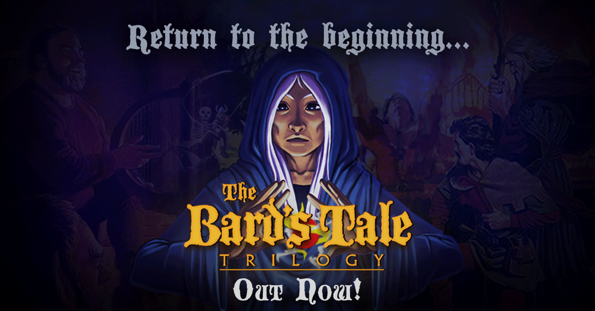

> _Retrospectiva săptămânii_ este rubrica duminicală în care trecem în revistă evenimentele săptămânii de pe frontul de gaming: știri şi articole (scrise de alții, bineînțeles, că e mai ușor aşa), industrie, lansări, oferte de jocuri, toate numai de savurat la cafeaua de duminică dimineața. (Și la care oricine poate contribui. ^[Dacă ai citit vreun articol sau vreo știre interesantă și crezi că merită inclusă în retrospectiva săptămânii, te așteptăm cu recomandarea ta pe forum, pe unul din topicurile dedicate: [Știri](https://forum.candaparerevista.ro/viewtopic.php?f=4&t=46), [Articole](https://forum.candaparerevista.ro/viewtopic.php?f=4&t=206), [Gaming România](https://forum.candaparerevista.ro/viewtopic.php?f=4&t=1622), [Oferte jocuri](https://forum.candaparerevista.ro/viewtopic.php?f=62&t=25)] )

## Ştiri
* Arkane vor lua o pauză de la **Dishonored** și **Prey** și vor „explora” experiențe multiplayer ([VG247](https://www.vg247.com/2018/08/14/arkane-dishonored-3-the-crossing/))
* THQ Nordic a achiziționat drepturile pentru trilogia de jocuri **Timesplitters**
([THQ Nordic](https://news.cision.com/thq-nordic-ab/r/thq-nordic-acquires-timesplitters,c2592484), [Polygon](https://www.polygon.com/2018/8/15/17692384/thq-nordic-timesplitters-crytek))
* Se pare că Valve lucrează în culise la dezvoltarea unui toolset care să permită jocurilor făcute pentru Windows să ruleze pe Linux ([VG247](https://www.vg247.com/2018/08/15/windows-steam-games-linux-compatibility-steam-play/), [Ars Technica](https://arstechnica.com/gaming/2018/08/valve-seems-to-be-working-on-tools-to-get-windows-games-running-on-linux/))
* Valve lucrează și la Steam.tv, un upgrade pentru Steam Broadcasting. Și nu doar atât, dar l-au și „lansat” din greșeală, oprindu-l apoi la scurt timp ([Eurogamer](https://www.eurogamer.net/articles/2018-08-18-valve-accidentally-launches-steam-tv-early), [Kotaku](https://kotaku.com/valve-launches-steam-tv-which-could-be-a-twitch-compet-1828431411))
* Bethesda face presiuni ca **Elder Scrolls Legends** să suporte cross-play pe toate platformele pe care e lansat. Dată fiind politica Sony, asta ar putea însemna că acest joc nu va ajunge și pe PS4  ([Ars Technica](https://arstechnica.com/gaming/2018/08/bethesda-tries-to-force-sony-to-stop-blocking-cross-console-gameplay/), [Destructoid](https://www.destructoid.com/sony-s-rigid-cross-play-stance-might-prevent-elder-scrolls-legends-from-seeing-a-ps4-release-516960.phtml))
* Se lucrează la un serial de televiziune inspirat de **Vampyr** ([Polygon](https://www.polygon.com/2018/8/17/17715108/vampyr-tv-dontnod-fox-21), [Engadget](https://www.engadget.com/2018/08/17/vampyr-tv-show-on-the-way/))
* inXile va reduce definitiv prețul lui **The Bard’s Tale IV** dacă suficienți useri de Steam și GOG îl vor adăuga pe wishlist-urile lor. La 500.000 de listări, prețul final va ajunge la 30 euro, iar add on-ul **The Haernhold** va fi gratuit ([Destructoid](https://www.destructoid.com/the-bard-s-tale-iv-is-permanently-lowering-its-price-in-exchange-for-steam-and-gog-wishlists-518639.phtml))
* **Monster Hunter: World** este retras de la vânzare în China. Motivul nu este clar, dar autoritățile chineze au menționat un „număr mare de plângeri” ([Engadget](https://www.engadget.com/2018/08/14/monster-hunter-world-pulled-china/))
* Apar semnale din ce în ce mai clare că vom avea un film Uncharted, și nu va fi cu Nathan Fillion ([Eurogamer](https://www.eurogamer.net/articles/2018-08-12-the-uncharted-movie-is-close-to-the-starting-line-says-director))
* EA, Epic, Sony și Unity lucrează împreună cu alte companii pentru a defini un set de bune practici pentru HDR ([Gamasutra](http://www.gamasutra.com/view/news/324802/EA_Unity_Epic_and_others_unite_to_promote_best_practices_for_HDR.php), [GamesIndustry.biz](https://www.gamesindustry.biz/articles/2018-08-17-microsoft-sony-other-major-publishers-form-hdr-gaming-interest-group))
* IGN retrage de pe site toate articolele redactorului Filip Miucin, după un scandal de plagiat în care s-a descoperit că s-a inspirat mai mult decât era cazul din review-ul unui youtuber ([GamesIndustry.biz](https://www.gamesindustry.biz/articles/2018-08-15-ign-pulls-all-of-writers-work-after-plagiarism-scandal), [Kotaku](https://kotaku.com/ign-pulls-ex-editors-posts-after-dozens-more-plagiarism-1828357792))
* PUBG atinge pragul de 100 de milioane de descărcări pentru varianta de mobile ([Engadget](https://www.engadget.com/2018/08/16/pubg-mobile-100-million-downloads/))

## Articole (critică, dev, design)
* [Dying Light 2's choices will power &#147;the ultimate vision for the open world&#148;](https://www.gamesindustry.biz/articles/2018-08-14-dying-light-2s-choices-will-power-the-ultimate-vision-for-the-open-world) (GamesIndustry.biz)
* [Dungeons &amp; Dragons Is a Double-edged Sword | Unwinnable](https://unwinnable.com/2018/08/15/dungeons-dragons-is-a-double-edged-sword/) (Unwinnable)
* [Video games magazines and me](https://www.eurogamer.net/articles/2018-08-18-video-games-magazines-and-me) (Eurogamer)
* [Flaws Of An Undead Genre - What's Wrong With Point & Click Adventures?](http://www.gamasutra.com/blogs/MarcusBumer/20180814/324402/Flaws_Of_An_Undead_Genre__Whats_Wrong_With_Point__Click_Adventures.php) (Gamasutra)
* [There Is No Longer A ‘Best’ Time To Play A Video Game](https://kotaku.com/there-is-no-longer-a-best-time-to-play-a-video-game-1797679257) (Kotaku)
* [What It Means To Buy A Video Game](https://kotaku.com/what-it-means-to-buy-a-video-game-1828336634) (Kotaku)
* [The precarious business of living off modding](https://www.pcgamer.com/the-precarious-business-of-living-off-modding/) (PC Gamer)
* [The IGN Plagiarism Incident Once Again Highlights the Strange Place Occupied by Game Reviews](https://www.usgamer.net/articles/game-reviews-are-both-more-important-and-less-important-than-ever) (USGamer)
* [Grinding as repetition as savefiles as insistence](https://www.blog.radiator.debacle.us/2018/08/grinding-as-repetition-as-savefiles-as.html) (Radiator Blog)
* [Nintendo&#39;s Offensive, Tragic, and Totally Legal Erasure of ROM Sites](https://motherboard.vice.com/en_us/article/bjbped/nintendos-offensive-tragic-and-totally-legal-erasure-of-rom-sites) (Motherboard), plus [In Defence of ROMs, A Solution To Dying Games And Broken Copyright Laws](http://www.kotaku.co.uk/2018/08/15/in-defense-of-roms-a-solution-to-dying-games-and-broken-copyright-laws) (Kotaku)

### _Not-a-review_
* (GTA V) [How Grand Theft Auto created a virtual underground clubbing scene](https://www.theguardian.com/games/2018/aug/16/how-grand-theft-auto-created-a-virtual-underground-clubbing-scene) (The Guardian)
* (PES) [The battle with FIFA was lost long ago, but PES soldiers on](https://www.eurogamer.net/articles/2018-08-15-pes-soldiers-on-but-the-battle-with-fifa-was-lost-long-ago) (Eurogamer)
* (Gone Home) [How  Gone Home 's design constraints lead to a powerful story](http://gamasutra.com/view/news/198340/How_Gone_Homes_design_constraints_lead_to_a_powerful_story.php) (Gamasutra)
* (World Of Warcraft) [A Look Inside How Blizzard Maintains World Of Warcraft&#039;s Lore](https://www.gameinformer.com/2018/08/14/a-look-inside-how-blizzard-maintains-world-of-warcrafts-lore) (Games Informer)
* (World Of Warcraft) [After 14 years, the biggest obstacle for World of Warcraft is time, not technology](https://www.gamesindustry.biz/articles/2018-08-13-after-fourteen-years-of-world-of-warcraft-infrastructure-isnt-a-limitation) (GamesIndustry.biz)

### Vocea industriei
* Lukasz Kukawski (gog.com): [Streaming is another layer of DRM](https://www.gamesindustry.biz/articles/2018-08-13-gog-streaming-is-another-layer-of-drm) (GamesIndustry.biz)

### Istorie
* [The Game Archaeologist: City of Heroes&#8217; launch history and the Marvel lawsuit](https://massivelyop.com/2018/08/12/the-game-archaeologist-digging-into-the-history-of-city-of-heroes-part-two/) (Massively OP)
* [Giant Bomb Still Changing Video Games Media 10 Years Later](https://variety.com/2018/gaming/features/giant-bomb-interview-10-years-1202895978/) (Variety)
* [Game Classics: Sonic the Hedgehog (1991)](https://remptongames.com/2018/08/18/game-classics-sonic-the-hedgehog-1991/) (Rempton Games)

### Design, world-building
* (Video) [Sebastien Benard breaks down the fine details of Dead Cells' design](http://www.gamasutra.com/view/news/324804/Sebastien_Benard_breaks_down_the_fine_details_of_Dead_Cells_design.php) (Gamasutra)

## Made în România
* Jocul **Interrogation** [participă](https://collective.square-enix.com/projects/490/interrogation/) în programul [Square Enix Collective](https://collective.square-enix.com/projects/). Dacă interesul publicului este suficient de mare (măsurat în voturi), Square Enix va susține financiar proiectul.
* **Door Kickers: Action Squad** iese din Early Access pe 10 septembrie ([Steam](https://store.steampowered.com/app/686200/Door_Kickers_Action_Squad/)).

## Anunţuri şi lansări de jocuri
### Anunţate
* **Domas** ([Gematsu](https://gematsu.com/2018/08/bandai-namco-summer-horror-project-teaser-website-launched))
* **Boyfriend Dungeon** ([Kickstarter](https://www.kickstarter.com/projects/kitfoxgames/boyfriend-dungeon-date-your-weapons))
* **Inmost** ([YouTube](https://www.youtube.com/watch?v=VhVEgxwmlXg))
* **Megaquarium** ([Destructoid](https://www.destructoid.com/an-aquarium-management-sim-seems-like-a-good-idea-518677.phtml), [RPS](https://www.rockpapershotgun.com/2018/08/17/fish-tycoon-megaquarium-splashes-out-in-september/))
* **Gris** ([Nomada Studio](https://nomada.studio/), [Hardcore Gamer](https://www.hardcoregamer.com/2018/08/13/gris-is-as-beautiful-as-it-is-haunting-in-reveal-trailer/308762/))
* **Outward** ([Hardcore Gamer](https://www.hardcoregamer.com/2018/08/14/open-world-rpg-outward-asks-you-to-embrace-the-adventurer-inside/308895/))
* **Nighthawks**, un RPG cu vampiri într-un setting modern de la Wadjet Eye ([PC Gamer](https://www.pcgamer.com/sunless-sea-writer-and-blackwell-developer-team-up-for-urban-vampire-rpg-nighthawks/), [RPS](https://www.rockpapershotgun.com/2018/08/15/nighthawks-vampire-rpg-announced/))
* **Jagged Alliance: Rage!** ([PC Gamer](https://www.pcgamer.com/jagged-alliance-rage-is-a-turn-based-strategy-game-about-old-broken-mercs/), [RPS](https://www.rockpapershotgun.com/2018/08/14/new-jagged-alliance-game-2018/))
* **Sniper: Ghost Warrior Contracts** ([VGChartz](http://www.vgchartz.com/article/277790/sniper-ghost-warrior-contracts-announced-for-ps4-xbox-one-pc/))
* **Let It Die** apare și pe PC ([VideoGamer](https://www.videogamer.com/news/goichi-sudas-let-it-die-is-coming-to-pc))
* **Mad Machines**, o clonă de Rocket League cu roboți gladiatori, care la lansare va fi disponibil în exclusivitate - pentru o perioadă limitată - doar pe Discord Store ([PC Gamer](https://www.pcgamer.com/mad-machines-looks-like-rocket-league-with-massive-armored-robots-instead-of-cars/))

### Acum cu dată de lansare
* 21 august: **Burnout Paradise Remastered** vine și pe PC ([Destructoid](https://www.destructoid.com/burnout-paradise-remastered-hits-pc-next-week-with-a-discount-for-returning-players-518680.phtml), [Eurogamer](https://www.eurogamer.net/articles/2018-08-17-burnout-paradise-remastered-speeds-onto-pc-next-week))
* 23 august: **7 Billion Humans**, continuarea lui **Human Resources Machine** ([PC Gamer](https://www.pcgamer.com/world-of-goo-devs-new-game-launches-next-week/))
* 29 august: **SCUM** intră în Early Access ([Destructoid](https://www.destructoid.com/detailed-survival-game-scum-finally-coming-to-early-access-later-this-month-517184.phtml))
* 30 august: **The Messenger** ([YouTube](https://www.youtube.com/watch?v=2vaYsgOHTlI&t=), [Steam](https://store.steampowered.com/app/764790/The_Messenger/))
* 9 octombrie: **My Memory of Us** ([PC Gamer](https://www.pcgamer.com/patrick-stewart-will-narrate-my-memory-of-us-a-game-about-children-in-the-holocaust/))
* 19 octombrie: **Dark Souls Remastered** se lansează pe Nintendo Switch ([Bandai Namco Twitter](https://twitter.com/BandaiNamcoUS/status/1029367163562405888))

### Amânate
* 13 noiembrie: **Spyro Reignited Trilogy** ([Activision Blog](https://blog.activision.com/t5/More-Games/A-Message-from-Toys-for-Bob/ba-p/10807365))
* 2019: **Tropico 6** ([RPS](https://www.rockpapershotgun.com/2018/08/17/tropico-6-release-date-details/))

### Lansate
* 13 august: **World of Warcraft: Battle for Azeroth** ([World of Warcraft](https://worldofwarcraft.com/en-us/battle-for-azeroth))
* 13 august: **Sword Legacy Omen** ([Steam](https://store.steampowered.com/app/690140/Sword_Legacy_Omen/))
* 14 august: **Phantom Doctrine** ([Steam](https://store.steampowered.com/app/559100/Phantom_Doctrine/), [gog.com](https://www.gog.com/game/phantom_doctrine_pack))
* 14 august: **Bard’s Tale Trilogy** ([Steam](https://store.steampowered.com/app/843260/The_Bards_Tale_Trilogy/), [gog.com](https://www.gog.com/game/the_bards_tale_trilogy))
* 14 august: **Death’s Gambit** ([Steam](https://store.steampowered.com/app/356650/Deaths_Gambit/), [gog.com](https://www.gog.com/game/deaths_gambit))
* 14 august: **Deathgarden** (early access) ([Steam](https://store.steampowered.com/app/555440/Deathgarden/))
* 15 august: **Graveyard Keeper** ([Steam](https://store.steampowered.com/app/599140/Graveyard_Keeper/), [gog.com](https://www.gog.com/game/graveyard_keeper))
* 15 august: **Dustwind** iese din Early Access ([Steam](https://store.steampowered.com/app/600460/Dustwind/))
* 15 august: **State of Mind** ([Steam](https://store.steampowered.com/app/437630/State_of_Mind/), [gog.com](https://www.gog.com/game/state_of_mind))
* 15 august: **Pendula Swing** (episodul 1 e gratis) ([Steam](https://store.steampowered.com/app/840290/Pendula_Swing_Episode_1__Tired_and_Retired/))

## Oferte jocuri
#### Humble Bundle
* [Jackbox Party Bundle](https://www.humblebundle.com/games/jackbox-party-bundle)
* [VR Sale](https://www.humblebundle.com/store/promo/vr-sale/)
* [Rainbow Six Siege Sale](https://www.humblebundle.com/store/promo/rainbow-six-siege-sale/)

#### Steam
* Weekend deals: seriile **Danganronpa** și **Steins;Gate** [la reducere](https://store.steampowered.com/sale/spike-chunsoft/)
* Alte oferte: [toată colecția de jocuri cu și despre Lara Croft](https://store.steampowered.com/bundle/2823/Tomb_Raider_Collection/), [Rakuen](https://store.steampowered.com/app/559210/Rakuen/) (5,99€), [Four Last Things](https://store.steampowered.com/app/503400/Four_Last_Things)(1,99€), [Trine 2](https://store.steampowered.com/app/35720/Trine_2_Complete_Story/) (2,54€), [Thunder Wolves](https://store.steampowered.com/app/232970/Thunder_Wolves/) (2,49€) , [Don't open the doors!](https://store.steampowered.com/app/533950/Dont_open_the_doors/) (4,39€), [Painkiller Black Edition](https://store.steampowered.com/app/39530/Painkiller_Black_Edition/) (2,49€), [Crazy Machines 3](https://store.steampowered.com/app/351920/Crazy_Machines_3/) (3,99€)

#### gog.com
* [Promoție Bethesda](https://www.gog.com/promo/20180817_bethesda_weekend): [Fallout](https://www.gog.com/game/fallout) (2,09€) , [Fallout 2](https://www.gog.com/game/fallout_2) (2,09€), [Elder Scrolls III: Morrowind GOTY Edition, The](https://www.gog.com/game/the_elder_scrolls_iii_morrowind_goty_edition) (6,09€), [Call of Cthulhu: Dark Corners of the Earth](https://www.gog.com/game/call_of_cthulhu_dark_corners_of_the_earth) (2,49€), [Return to Castle Wolfenstein](https://www.gog.com/game/return_to_castle_wolfenstein) (1,69€), seria **Quake** și alți clasici.
* [Promoția săptămânală](https://www.gog.com/promo/20180813_weekly_sale): [ELEX](https://www.gog.com/game/elex) (24,99€) , [Master of Orion 1+2](https://www.gog.com/game/master_of_orion_1_2) (1,29€), [Undertale](https://www.gog.com/game/undertale) (4,09€) , [Cook, Serve, Delicious! 2!!](https://www.gog.com/game/cook_serve_delicious_2) (6,49€), [SpellForce 3](https://www.gog.com/game/spellforce_iii) (33,49€).

#### Fanatical
* Continuă [Summer Sale](https://www.fanatical.com/en/on-sale): [Doom](https://www.fanatical.com/en/game/doom) (9,89€) , [Alien Isolation Collection](https://www.fanatical.com/en/game/alien-isolation-collection) (9,19€) , [Turok](https://www.fanatical.com/en/game/turok) (4,99€) , [Fallout 4](https://www.fanatical.com/en/game/fallout-4) (9,89€) și altele. Aveți și o reducere suplimentară de 10% cu codul `SUMMER10`.
* [Icewind Dale + Planescape Torment Pack](https://www.fanatical.com/en/bundle/icewind-dale-plus-planescape-torment-pack) (5,99€) până luni sau până se epuizează cheile disponibile

#### Altele
* Promoții Paradox pe [WinGameStore](https://www.wingamestore.com/showcase/Paradox-Strategy-Sale/) și [Paradox Plaza](https://www.paradoxplaza.com/on-sale/)
* Câteva boardgames digitale bune pe [Indie Gala](https://www.indiegala.com/store/asmodee-games), printre care [SmallWorld 2](https://www.indiegala.com/store/product/small-world-2/235620) (1,99$) și [Twilight Struggle](https://www.indiegala.com/store/product/twilight-struggle/406290) (4,99$)
* [Origin Access](https://www.origin.com/irl/en-us/store/origin-access/) adaugă jocuri noi, printre care **Fe**, **Figment**, **Ghost of a Tale** sau **Pillars of the Earth**. Abonamentul costă 4 euro pe lună sau 25 euro pe an ([VG247](https://www.vg247.com/2018/08/17/origin-access-fe-ghost-of-a-tale-pillars-of-the-earth-pc/))

## Recomandarea săptămânii: _The Bard's Tale Trilogy_

Recomandarea acestei săptămâni e un RPG cât se poate de old-school, dar cu un strat de vopsea modernă pe deasupra. Trilogia inițială a apărut în anii ‘80, iar variantele remasterizate au luat ființă ca parte a unui _stretch goal_ din campania de Kickstarter organizată de inXile pentru The Bard’s Tale IV. De remasterizarea trilogiei nu s-au ocupat însă tot inXile, ci doar au supervizat contractorii externi.

Printre îmbunățirile aduse de noua versiune se numără grafică și sunet îmbunătățite (mai jos în galerie aveți niște imagini comparative), compatibilitatea cu sistemele moderne și diverse schimbări pentru a ușura gameplay-ul, precum salvări, automapping sau tooltips.

Titlul s-ar putea să vă inducă puțin în eroare - momentan, „trilogia” conține doar primul titlu al seriei, colecția urmând să fie completată cu update-uri mai târziu în acest an, în toamnă și în iarnă.

* Cumpără: [Steam](https://store.steampowered.com/app/843260/The_Bards_Tale_Trilogy/), [Humble Store](https://www.humblebundle.com/store/the-bards-tale-trilogy), [gog.com](https://www.gog.com/game/the_bards_tale_trilogy)
* [Discuții pe forum](https://forum.candaparerevista.ro/viewtopic.php?f=5&t=1889&p=83818). Tot aici găsiți și niște [tips & tricks](https://forum.candaparerevista.ro/viewtopic.php?f=5&t=1889&p=83818#p83817) foarte utile, împărtășite cu generozitate de cioLAN.

> **Notă**: jocul e disponibil și în cadrul [CandApareRevista Level 1 Review Program](https://forum.candaparerevista.ro/viewtopic.php?f=84&t=1883&p=83876#p83744), asta însemnând că-l puteți obține gratuit (thx @sebas) dacă sunteți dispuși să-i scrieți un review.