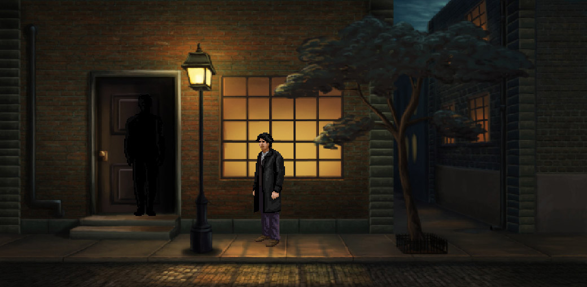

> _Retrospectiva săptămânii_ este rubrica duminicală în care trecem în revistă evenimentele săptămânii de pe frontul de gaming: știri şi articole (scrise de alții, bineînțeles, că e mai ușor aşa), industrie, lansări, oferte de jocuri, toate numai de savurat la cafeaua de duminică dimineața. (Și la care oricine poate contribui. ^[Dacă ai citit vreun articol sau vreo știre interesantă și crezi că merită inclusă în retrospectiva săptămânii, te așteptăm cu recomandarea ta pe forum, pe unul din topicurile dedicate: [Știri](https://forum.candaparerevista.ro/viewtopic.php?f=4&t=46), [Articole](https://forum.candaparerevista.ro/viewtopic.php?f=4&t=206), [Gaming România](https://forum.candaparerevista.ro/viewtopic.php?f=4&t=1622), [Oferte jocuri](https://forum.candaparerevista.ro/viewtopic.php?f=62&t=25)] )

## Ştiri

* Parlamentul European a votat pe 12 septembrie o nouă directivă ce reglementează drepturile de copyright ale oricărui tip de _media_ de pe internet. ([Politico](https://www.politico.eu/article/european-parliament-votes-to-adopt-copyright-reform/), [The Verge](https://www.theverge.com/2018/9/12/17849868/eu-internet-copyright-reform-article-11-13-approved), [CNBC](https://www.cnbc.com/2018/09/12/eu-lawmakers-pass-controversial-digital-copyright-law.html), [CNET](https://www.cnet.com/news/eu-votes-to-adopt-upload-filters-as-part-of-internet-copyright-law/)). Mai multe detalii:
  * [Today, Europe Lost The Internet. Now, We Fight Back.](https://www.eff.org/deeplinks/2018/09/today-europe-lost-internet-now-we-fight-back) (EFF)
  * [New Copyright Powers, New &quot;Terrorist Content&quot; Regulations: A Grim Day For Digital Rights in Europe](https://www.eff.org/deeplinks/2018/09/new-copyright-powers-new-terrorist-content-regulations-grim-day-digital-rights) (EFF)
  * [‘Internet is under threat’: what you need to know about the EU’s Copyright Directive](https://www.polygon.com/2018/9/11/17843664/copyright-directive-europian-union-parliament-explained-internet-article-13-youtube-fair-use) (Polygon)
  * [Cum vor schimba Articolul 11 și Articolul 13 internetul în Europa?](https://zonait.tv/cum-vor-schimba-articolul-11-si-articolul-13-internetul-in-europa/) (ZonaIT)
* EA ignoră reglementările Belgiei în domeniul jocurilor de noroc şi **nu** scoate loot boxes din jocurile FIFA. Ca atare, devin subiectul unei anchete penale a Parchetului General al Belgiei. ([PCGamesN](https://www.pcgamesn.com/ea-loot-boxes-belgium), [Ars Technica](https://arstechnica.com/gaming/2018/09/ea-defies-belgian-loot-box-decision-setting-up-potential-gambling-lawsuit/), [GamesIndustry.biz](https://www.gamesindustry.biz/articles/2018-09-10-ea-may-go-to-court-over-loot-boxes-in-belgium))
* Valve a deschis robinetul pentru jocurile de adulţi. ([GamesIndustry.biz](https://www.gamesindustry.biz/articles/2018-09-11-valve-is-now-approving-sexually-explicit-games-again), [Ars Technica](https://arstechnica.com/gaming/2018/09/uncensored-sexual-games-now-getting-approved-for-steam-release/), [PC Gamer](https://www.pcgamer.com/naked-demon-with-a-large-penis-and-other-content-descriptors-waiting-for-approval-on-steam/), [Kotaku](https://steamed.kotaku.com/steam-approves-100-percent-uncensored-adult-game-neglig-1828980122/))
* Jocurile de PC sunt pe locul 2 în preferinţele jucătorilor din SUA, după mobile, dar înaintea tuturor consolelor. ([GamesIndustry.biz](https://www.gamesindustry.biz/articles/2018-09-11-pc-second-only-to-mobile-for-gaming-in-the-us-eedar), [PCGamesInsider.biz](https://www.pcgamesinsider.biz/news/67783/report-over-half-of-us-active-gamers-play-on-pc/))
* **PUBG** a împlinit un an de când are zilnic 1 milion de jucători în același timp (“concurrent players”), primul joc ce atinge o astfel de performanță. Şi aproape imediat după atingerea acestui prag numărul de jucători a scăzut. ([PCGamesN](https://www.pcgamesn.com/playerunknowns-battlegrounds/pubg-million-player-streak), [Eurogamer](https://www.eurogamer.net/articles/2018-09-11-pubg-dips-below-million-daily-pc-players-for-first-time-in-a-year), [PCGamesInsider.biz](https://www.pcgamesinsider.biz/news/67766/pubg-first-game-on-steam-to-have-1m-concurrent-figures-for-one-year/))
* **Alan Wake** devine serial TV. Va fi produs de companiile [Contradiction Films](https://en.wikipedia.org/wiki/Contradiction_Films) și Remedy, dar încă nu a fost aleasă o ofertă de la studiourile interesate. ([Variety](https://variety.com/2018/gaming/news/alan-wake-tv-show-1202938003/), [Engagdet](https://www.engadget.com/2018/09/13/an-alan-wake-tv-series-is-in-the-works/))
* O companie canadiană a făcut un documentar despre regizorul Uwe Boll. ([YouTube](https://www.youtube.com/watch?v=6SIXHA7vQ4A), [Eurogamer](https://www.eurogamer.net/articles/2018-09-10-remember-uwe-boll-someones-made-a-documentary-about-him)) (thx @joonior_bmf)

#### Nintendo Switch Direct
Săptămâna asta a avut loc Nintendo Switch Direct, unde s-au anunțat o mulțime de jocuri care urmează să apară pe Switch, precum şi mai multe ştiri ce privesc direct platforma:

* Nintendo va începe să perceapă bani pentru serviciul online pentru jocurile Switch, care până acum a fost gratuit. În preț sunt incluse și backupul salvărilor în cloud, însă nu toate jocurile vor benficia de această facilitate, iar în plus jucătorii își vor pierde salvările în momentul în care nu vor mai plăti pentru acces. ([Eurogamer](https://www.eurogamer.net/articles/2018-09-12-you-must-pay-to-play-nintendo-switch-online-from-next-week), [Ars Technica](https://arstechnica.com/gaming/2018/09/nintendos-first-ever-paid-online-service-launches-on-switch-sept-18/), [Ars Technica](https://arstechnica.com/gaming/2018/09/nintendo-switch-cloud-save-data-disappears-if-you-cancel-subscription/))
* [Everything we learned from the September 2018 Nintendo Direct](https://www.polygon.com/nintendo/2018/9/13/17857476/nintendo-direct-super-mario-luigi-mansion-katamari-switch-online-final-fantasy-animal-crossing) (Polygon)
* [Everything Announced During Today&#39;s Nintendo Direct](https://kotaku.com/animal-crossing-switch-and-everything-else-from-todays-1829043157/) (Kotaku)
* Jocuri anunţate: [Luigi’s Mansion 3](https://twitter.com/NintendoEurope/status/1040359876600504320), [Katamari Damacy Rerolled](https://kotaku.com/ah-hello-price-katamari-damacy-is-coming-to-the-swit-1829042996), [Animal Crossing](https://www.eurogamer.net/articles/2018-09-13-animal-crossing-headed-to-nintendo-switch), [Yoshi’s Crafted World](https://twitter.com/NintendoAmerica/status/1040366380376219648), remaster-uri pentru [Final Fantasy VII, IX, X/X-2, XII: The Zodiac Age](https://twitter.com/Nibellion/status/1040367957350727684), [Super Mario Bros. U Deluxe](https://twitter.com/NintendoAmerica/status/1040362721970053120).

#### Nvidia
Încep să apară mai multe detalii despre noua generație de plăci video de la Nvidia:

* [What is ray tracing, and how does Nvidia's GeForce RTX handle the technology?](https://www.pcgamer.com/what-is-ray-tracing/) (PC Gamer)
* [Nvidia Turing architecture deep dive](https://www.pcgamer.com/nvidia-turing-architecture-deep-dive/) (PC Gamer)
* [Nvidia RTX 2080 and RTX 2080Ti: Turing&#8217;s best features explained](https://www.rockpapershotgun.com/2018/09/14/nvidia-turing-rtx-2080-2070-specs-price-release-date-best-features/) (RPS)
* [NVIDIA DLSS Explained - Much Higher Quality Than TAA or Much Faster Performance, Delivered by NVIDIA NGX](https://wccftech.com/nvidia-dlss-explained-nvidia-ngx/) (Wccf tech)

## Articole (critică, dev, design)
* Pentru început, câteva materiale despre jocurile de la PAX: [The 16 surprising new games that made PAX West an absolute blast](https://arstechnica.com/gaming/2018/09/pax-west-was-an-absolute-blast-thanks-to-16-surprising-new-games/) (Ars Technica) şi [Some of the Games of PAX West 2018](http://tap-repeatedly.com/2018/09/games-at-pax-west-2018/) (Tap-Repeatedly)
* ["Videogames: Design/Play/Disrupt" @ Victoria and Albert Museum](https://www.blog.radiator.debacle.us/2018/09/videogames-designplaydisrupt-victoria.html) (Radiator Blog)
* [Why Don&#39;t Remakes And Remasters Always Credit the Original Developers?](https://waypoint.vice.com/en_us/article/wjyqy5/why-dont-remakes-and-remasters-always-credit-the-original-developers) (Waypoint)
* [Games set in the 1980s don&#8217;t need to be painted in neon](https://www.rockpapershotgun.com/2018/09/13/games-set-in-the-1980s-dont-need-neon) (RPS)
* [Nutaku and the challenge of making erotic games for everyone](https://www.pcgamesn.com/nutaku-erotic-games) (PCGamesN)
* [Why do gamers still buy physical games?](https://www.gamesindustry.biz/articles/2018-09-14-why-do-gamers-still-buy-physical-games) (GamesIndustry.biz)
* [Bloom's Taxonomy of Game Reviews](http://gamasutra.com/blogs/MichaelHeron/20180914/326442/Blooms_Taxonomy_of_Game_Reviews.php) (Gamasutra)
* [The Power of Personality in Games](https://remptongames.com/2018/09/15/the-power-of-personality-in-games/) (Rempton Games)
* [Sony's backwards stance on cross-play hurts games as a whole](https://www.pcgamer.com/playstation-4-fortnite-cross-play/) (PC Gamer)
* [Robot Cache might be the first use of blockchain tech in games that makes any sense](https://www.pcgamesinsider.biz/interviews-and-opinion/67772/robot-cache-might-be-the-first-use-of-blockchain-tech-in-games-that-makes-any-sense/) (PCGamesInsider.biz)

### _Not-a-review_
* (Kerbal Space Program) [What 4,000 hours of Kerbal Space Program taught this father about space, engineering, and passion](https://www.pcgamer.com/what-4000-hours-of-kerbal-space-program-taught-this-father-about-space-engineering-and-passion/) (PC Gamer)
* (Homeworld) [Why I Love Homeworld: Sideswiped by a Story](https://www.gamesindustry.biz/articles/2018-09-11-homeworld-sideswiped-by-a-story) (GamesIndustry.biz)
* (Tengami) [Tengami](https://gameexhibition.wordpress.com/2018/09/13/tengami) (Something in the Direction of Exhibition)
* (Graveyard Keeper) [&#39;Graveyard Keeper&#39; Is About Losing Your Future to Your Present](https://waypoint.vice.com/en_us/article/438dmm/graveyard-keeper-is-about-losing-your-future-to-your-present) (Waypoint)
* (Guild Wars 2) [Six years on, Guild Wars 2 is still going strong &#8211; what&#8217;s its secret?](https://www.pcgamesn.com/guild-wars-2/guild-wars-2-season-five) (PCGamesN)
* (Pyre) [Crossings | Unwinnable](https://unwinnable.com/2018/09/14/crossings/) (Unwinnable)
* (Assassin’s Creed III) [In defense of Assassin&#8217;s Creed III ahead of its remaster](https://venturebeat.com/2018/09/14/in-defense-of-assassins-creed-iii-ahead-of-its-remaster/) (VentureBeat)
* (WildStar) [Vague Patch Notes: WildStar deserves its shutdown, even though we loved it](https://massivelyop.com/2018/09/14/vague-patch-notes-wildstar-deserves-its-shutdown-even-though-we-loved-it/) (Massively OP) , [A eulogy for WildStar &#8211; a marvelous MMORPG and avoidable tragedy](https://massivelyop.com/2018/09/07/requiescat-in-pace-wildstar/) (Massively OP)

### Vocea industriei
* Koji Igarashi, ArtPlay: [Single-player not going anywhere](https://www.gamesindustry.biz/articles/2018-09-10-single-player-not-going-anywhere-igarashi) (GamesIndustry.biz)
* Nigel Lowrie, Devolver Digital: [Not every game needs to sell 500k](https://www.gamesindustry.biz/articles/2018-09-12-not-every-game-needs-to-sell-500k) (GamesIndustry.biz)
* Martin Brouard, Sabotage: [Making a retro indie game stand out from the crowd](https://www.gamesindustry.biz/articles/2018-09-12-the-messengers-special-delivery) (GamesIndustry.biz)
* Charles Cecil, Revolution Software: [The Future of Broken Sword and Revolution Software – An Interview with Charles Cecil](https://www.gamebyte.com/the-future-of-broken-sword-and-revolution-software-an-interview-with-charles-cecil/) (Gamebyte) (thx @Azad)
* John Riccitiello, Unity: [Q&amp;A: How Unity CEO views Epic&#8217;s Fortnite success](https://venturebeat.com/2018/09/15/john-riccitiello-interview-how-unity-ceo-views-epics-fortnite-success/) (VentureBeat)

### Istorie
* [The making of Total Annihilation ](https://www.pcgamer.com/the-making-of-total-annihilation/) (PC Gamer)
* [Developing  Spore : An oral ('Sporal'?) history 10 years on](http://www.gamasutra.com/view/news/326148/Developing_Spore_An_oral_Sporal_history_10_years_on.php) (Gamasutra)
* [VCR Board Games: Only One Way This Will End](https://tedium.co/2018/09/13/vcr-board-games-history/) (Tedium)
* [The making of Alien Resurrection PSOne](https://www.eurogamer.net/articles/2018-09-09-the-making-of-alien-resurrection-for-psone) (Eurogamer)
* [History of Metal Gear: Revenge...ance? (Metal Gear Rising: Revengeance)](http://www.vgchartz.com/article/392495/history-of-metal-gear-revengeance-metal-gear-rising-revengeance/) (VGChartz)
* [The Game Archaeologist: City of Heroes moves into the Paragon Studios era](https://massivelyop.com/2018/09/15/the-game-archaeologist-city-of-heroes-moves-into-the-paragon-studios-era/) (Massively OP)
* [Head like a hole: The wisdom of Donut County dev Ben Esposito](http://www.gamasutra.com/view/news/326339/Head_like_a_hole_The_wisdom_of_Donut_County_dev_Ben_Esposito.php) (Gamasutra)

### Dev, making of
* [The making of Total War: Warhammer&#8217;s Hell Pit Abomination](https://www.pcgamesn.com/total-war-warhammer-2/total-war-warhammer-hell-pit-abomination) (PCGamesN)
* [How much do indie PC devs make, anyways? (Part 8)](http://gamasutra.com/blogs/DavidGalindo/20180912/326190/How_much_do_indie_PC_devs_make_anyways_Part_8.php) (Gamasutra)
* [How Exapunks represents hacking without limits](https://www.rockpapershotgun.com/2018/09/12/how-exapunks-represents-hacking-without-limits/) (RPS)

### Design, world-building
* [Space and Place](https://www.slowrun.me/2018/09/space-and-place.html) (SlowRun)
* [Dark Narrative: The Sorrow of the Widow Moira](https://techraptor.net/content/dark-narrative-the-sorrow-of-the-widow-moira) (TechRaptor)
* [From GTA 5 to Zelda, I love a game with a day/night cycle](https://www.eurogamer.net/articles/2018-09-15-from-gta-5-to-zelda-i-love-a-game-with-a-day-night-cycle) (Eurogamer)
* (Poze frumoase) [The Art Of Insomniac&#39;s Spider-Man](https://kotaku.com/the-art-of-insomniacs-spider-man-1829019323/) (Kotaku)
* (Poze frumoase) [It Appears Nobody Is Home](https://kotaku.com/it-appears-nobody-is-home-1828959849/) (Kotaku)
* (Poze frumoase) [Cleared For Take-Off](https://kotaku.com/cleared-for-take-off-1828876070/) (Kotaku)
* (Poze frumoase) [With each expansion the art of The Elder Scrolls: Legends has grown weirder and better](https://www.pcgamer.com/with-each-expansion-the-art-of-the-elder-scrolls-legends-has-grown-weirder-and-better/) (PC Gamer)
* (Video) [UX expert helps explain why Fortnite is such a success](https://arstechnica.com/gaming/2018/09/video-ux-expert-helps-explain-why-fortnite-is-such-a-success/) (Ars Technica)

## Made în România

* KillHouse Games au lansat **Door Kickers: Action Squad** pe 10 septembrie şi a fost foarte bine primit. ([site oficial](http://inthekillhouse.com/action-squad-out-in-full-force/). Cumpăraţi-l de pe [Steam](https://store.steampowered.com/app/686200/Door_Kickers_Action_Squad/) sau [Humble](https://www.humblebundle.com/store/door-kickers-action-squad) şi veniţi [pe forum](https://forum.candaparerevista.ro/viewtopic.php?f=85&t=1900) să discutaţi despre el.
* În perioada 4-5 octombrie va avea loc la Bucureşti conferinţa de jocuri Dev.Play 2018, organizată în colaborare cu RGDA, şi vă puteţi găsi de lucru la una dintre companiile româneşti de jocuri. ([ZonaIT](https://zonait.tv/dev-play-2018-studiourile-dezvoltatoare-de-jocuri-video-din-romania-angajeaza-la-cea-mai-mare-conferinta-de-game-development-din-europa-de-est/), [Overheat.ro](https://www.overheat.ro/2018/09/12/studiourile-romanesti-de-game-development-angajeaza-la-dev-play-2018/))

## Anunţuri şi lansări de jocuri
### Anunţate
* **Samurai Spirits**, un nou titlu din seria Samurai Shodown de la SNK ([Games Informer](https://www.gameinformer.com/2018/09/10/snk-announces-new-samurai-shodown-game))
* (Kickstarter) **The Darkside Detective - Season 2** ([Kickstarter](https://www.kickstarter.com/projects/spookydoorway/the-darkside-detective-season-2))
* **Democracy 4** ([PCGamesN](https://www.pcgamesn.com/democracy-4/democracy-4-announcement), [RPS](https://www.rockpapershotgun.com/2018/09/15/democracy-4-announced/))
* **Wolfenstein III** confirmat ([PCGamesN](https://www.pcgamesn.com/wolfenstein-youngblood/wolfenstein-3), [Games Informer](https://www.gameinformer.com/2018/09/13/bethesda-confirms-wolfenstein-iii-will-happen))
* **Assassin’s Creed III** remasterizat ([Kotaku](https://kotaku.com/assassins-creed-iii-is-getting-remastered-1829031268))
* **Katamari Damacy Rerolled** apare și pe PC ([PC Gamer](https://www.pcgamer.com/katamari-damacy-rerolled-will-release-on-pc-this-december/), [RPS](https://www.rockpapershotgun.com/2018/09/14/katamari-damacy-reroll-pc-release-date/))
* **Executive Assault 2** ([PCGamesN](https://www.pcgamesn.com/executive-assault-2/new-games-executive-assault-2))
* **Capcom Beat ‘Em Up Bundle**, o colecţie de 7 titluri vechi: Final Fight, The King of Dragons, Captain Commando, Knight of the Round, Warriors Fate, Armored Warriors, Battle Circuit, cu diferite îmbunătăţiri pentru sisteme moderne şi multiplayer, plus artwork-uri şi informaţii suplimentare despre fiecare joc. ([Neowin](https://www.neowin.net/news/capcoms-beat-em-up-bundle-delivers-a-bunch-of-classic-arcade-beat-em-up-titles), [Hardcore Gamer](https://www.hardcoregamer.com/2018/09/13/capcom-beat-em-up-bundle-announced-for-september-18/312313/))

### Acum cu dată de lansare
* **Timespinner**: 25 septembrie ([YouTube](https://www.youtube.com/watch?v=OR8hqHLkS9Y), [RPS](https://www.rockpapershotgun.com/2018/09/12/timespinner-metroidvania-release-date/)) (thx @cg1700)
* **Hollow Knight** ajunge și pe PS4: 25 septembrie ([PlayStation.Blog](https://blog.us.playstation.com/2018/09/11/hollow-knight-voidheart-edition-buzzes-to-ps4-september-25/))
* **Dead or Alive 6**: 15 februarie 2019 ([Games Informer](https://www.gameinformer.com/2018/09/10/dead-or-alive-6-launches-in-february-trailer-confirms-returning-characters-and-pre-order))

### Lansate
* 10 septembrie: **Door Kickers: Action Squad** ([Steam](https://store.steampowered.com/app/686200/Door_Kickers_Action_Squad/), [Humble Store](https://www.humblebundle.com/store/door-kickers-action-squad))
* 10 septembrie: **NBA 2K19** ([Steam](https://store.steampowered.com/app/841370/NBA_2K19/), [Humble Store](https://www.humblebundle.com/store/nba-2k19))
* 10 septembrie: **Akane** ([Steam](https://store.steampowered.com/app/884260/Akane/))
* 11 septembrie: **Boundless** iese din Early Access ([Steam](https://store.steampowered.com/app/324510/Boundless/), [Humble Store](https://www.humblebundle.com/store/boundless))
* 12 septembrie: **Shadow of the Tomb Raider** ([Steam](https://store.steampowered.com/app/750920/Shadow_of_the_Tomb_Raider/), [Humble Store](https://www.humblebundle.com/store/shadow-of-the-tomb-raider))
* 12 septembrie: **World of Warplanes** ([Steam](https://store.steampowered.com/app/790710/World_of_Warplanes/))
* 12 septembrie: **Commands & Colors: Ancients** ([Steam](https://store.steampowered.com/app/699870/Commands__Colors_Ancients/))
* 13 septembrie: **Breathedge** (Early Access) ([Steam](https://store.steampowered.com/app/738520/Breathedge/))
* 13 septembrie: **Lamplight City** ([Steam](https://store.steampowered.com/app/761460/Lamplight_City/), [Humble Store](https://www.humblebundle.com/store/lamplight-city), [gog.com](https://www.gog.com/game/lamplight_city))
* 13 septembrie: **Megaquarium** ([Steam](https://store.steampowered.com/app/600480/Megaquarium/), [Humble Store](https://www.humblebundle.com/store/megaquarium), [gog.com](https://www.gog.com/game/megaquarium))
* 13 septembrie: **Dying Light: Bad Blood** (Early Access), propunerea battle royale a francizei de la Techland ([Steam](https://store.steampowered.com/app/766370/Dying_Light_Bad_Blood/), [Humble Store](https://www.humblebundle.com/store/dying-light-bad-blood))
* 13 septembrie: **Frozen Synapse 2** ([Steam](https://store.steampowered.com/app/445020/Frozen_Synapse_2/), [Humble Store](https://www.humblebundle.com/store/frozen-synapse-2), [gog.com](https://www.gog.com/game/frozen_synapse_2))
* 14 septembrie: **ReCore: Definitive Edition** ([Steam](https://store.steampowered.com/app/537450/ReCore_Definitive_Edition/), [Humble Store](https://www.humblebundle.com/store/recore-definitive-edition))
* 14 septembrie: **The Culling: Origins** se relansează după fiasco-ul The Culling 2 şi devine free-to-play ([Steam](https://store.steampowered.com/app/437220/The_Culling/))

## Oferte jocuri

### Humble Bundle
* [Summer Sale](https://www.humblebundle.com/store/) s-a prelungit până mâine. Dacă vă grăbiți, puteți beneficia de oferte de la o serie de publisheri precum [Square Enix](https://www.humblebundle.com/store/promo/square-enix-summer-sale-encore/), [Bethesda](https://www.humblebundle.com/store/promo/bethesda-summer-sale-encore/), [Activision](https://www.humblebundle.com/store/promo/activision-blizzard-summer-sale-encore/), [2K](https://www.humblebundle.com/store/promo/2k-summer-sale-encore/), [Ubisoft](https://www.humblebundle.com/store/promo/ubisoft-summer-sale-encore/), [Rockstar](https://www.humblebundle.com/store/promo/rockstar-summer-sale-encore/) și mulți alții.
* Jocuri gratis DRM-free din colecţia Trove pe care Humble o pune în mod normal la dispoziţia abonaţilor la Humble Monthly, dar pe care le puteţi adăuga acum permanent în contul vostru: Alan Wake's American Nightmare, Limbo, Uurnog, Fortune 499, Tiny Echo, Cat Girl Without Salad: Amuse-Bouche, Arawkanoid, Thor.n, Crescent Bay.

### Steam
* [Promoţiile săptămânale](https://store.steampowered.com/search/?filter=weeklongdeals): [Battlefield: Bad Company 2](https://store.steampowered.com/app/24960/Battlefield_Bad_Company_2/) (1,49€), [Rayman Legends](https://store.steampowered.com/app/242550/Rayman_Legends/) (6,79€), [Lovers in a Dangerous Spacetime](https://store.steampowered.com/app/252110/Lovers_in_a_Dangerous_Spacetime/) (5,99€), [Unbox: Newbie's Adventure](https://store.steampowered.com/app/512300/Unbox_Newbies_Adventure/) (4,99€), [This Is the Police](https://store.steampowered.com/app/443810/This_Is_the_Police/) (3,74€), [Singularity](https://store.steampowered.com/app/42670/Singularity/) (4,99€), [Dominions 4: Thrones of Ascension](https://store.steampowered.com/app/259060/Dominions_4_Thrones_of_Ascension/) (7,99€)
* Alte promoţii: [Franciza Assassin's Creed](https://store.steampowered.com/franchise/ac/), [TASTEE: Lethal Tactics](https://store.steampowered.com/app/365190/TASTEE_Lethal_Tactics/) (1,49€)

### gog.com
* [Promoţia săptămânală](https://www.gog.com/promo/20180910_weekly_sale): [Death to Spies](https://www.gog.com/game/death_to_spies) (1,09€), [Faces of War](https://www.gog.com/game/faces_of_war) (1,09€), [Fantasy Wars](https://www.gog.com/game/fantasy_wars) (1,09€), [King&#039;s Bounty: Crossworlds GOTY](https://www.gog.com/game/kings_bounty_crossworlds_goty) (3,29€)  şi restul jocurilor din seria King’s Bounty, [Men of War](https://www.gog.com/game/men_of_war) (1,09€)  (şi restul jocurilor din serie), [NecroVision](https://www.gog.com/game/necrovision) (2,49€), [IL-2 Sturmovik: 1946](https://www.gog.com/game/il_2_sturmovik_1946) (1,79€), [Perimeter](https://www.gog.com/game/perimeter) (1,79€), [Soldiers: Heroes of World War II](https://www.gog.com/game/soldiers_heroes_of_world_war_ii) (2,19€)
* [Promoţie SNK](https://www.gog.com/promo/20180914_snk_anniversary), cu seriile **King of Fighters**, **Metal Slug** şi alte jocuri _cu bătăi_.

### Origin
* [Origin Access](https://www.origin.com/irl/en-us/store/origin-access/) adaugă jocuri noi, printre care **Samorost 3**, **Shenzhen I/O**, seria **The Book of Unwritten Tales** şi **Shadow Tactics: Blades of the Shogun**.
* **Battlefield 1 Premium Pass** e gratuit, iar jocul de bază [costă 4,99€](https://www.origin.com/irl/en-us/store/battlefield/battlefield-1/offer-selection).

### Green Man Gaming
* Mai ţineţi minte promoţia pentru caritate GamesAid organizată de GMG acum [câteva săptămâni](), cu 50 de lire pentru 50 de jocuri? GMG oferă acum aceleaşi 50 de jocuri, dar sparte în pachete mai uşor de cumpărat - câte 10 jocuri pentru 10 lire, astfel: [Alpha](https://www.greenmangaming.com/games/gamesaid-10-game-charity-bundle-alpha-pc/), [Beta](https://www.greenmangaming.com/games/gamesaid-10-game-charity-bundle-beta-pc/), [Delta](https://www.greenmangaming.com/games/gamesaid-10-game-charity-bundle-delta-pc/), [Epsilon](https://www.greenmangaming.com/games/gamesaid-10-game-charity-bundle-epsilon-pc/), [Gamma](https://www.greenmangaming.com/games/gamesaid-10-game-charity-bundle-gamma-pc/).
* Alte promoţii: [Grand Theft Auto V](https://www.greenmangaming.com/games/grand-theft-auto-v/) (aprox. 15,48€), [Batman - The Telltale Series](https://www.greenmangaming.com/games/batman-the-telltale-series-pc/) (aprox. 8,36€).

### Altele
* Fanatical: [Injustice 2 - Legendary Edition](https://www.fanatical.com/en/game/injustice-2-legendary-edition) (19,79€), [Little Nightmares Complete Edition](https://www.fanatical.com/en/game/little-nightmares-complete-edition) (13,49€), [Ni no Kuni II: Revenant Kingdom](https://www.fanatical.com/en/game/ni-no-kuni-ii-revenant-kingdom) (32,99€).

## Recomandarea săptămânii: _Lamplight City_

Fanii jocurilor Gabriel Knight vor descoperi în **Lamplight City**, de la Grundislav Games, un joc demn să poarte titlul de succesor spiritual. Acțiunea se petrece în orașul New Bretagne, într-o Europă afundată în tehnologie steampunk, unde unii localnici încă păstrează rămășițe ale religiei voodoo.

Este anul 1844 și suntem puși în pielea lui Miles Fordham, un detectiv particular, al cărui partener este ucis, la începutul jocului, în timpul unui caz aparent banal. Trei luni mai târziu dăm de un Miles neîngrijit și dependent de droguri, cu o căsnicie peste care atârnă proverbiala sabie a lui Damocle. Ca și cum toate acestea nu ar fi fost suficiente, apar primele semne ale nebuniei. Bântuit de vină și de obsesia că și-ar fi ucis prietenul, Miles începe să-i audă vocea în minte. Aceasta este integrată în joc ca element ajutător - îți va da indicații din când în când, dar sunt momente în care devine iritantă, cum ar fi unele interacțiuni emoționante stricate de intervențiile sale inutile.

Astfel începe jocul, iar obiectivul jucătorului este de a rezolva diverse cazuri și de a descoperi noi indicii în cazul morții partenerului. Povestea beneficiază și de un sistem de alegeri și consecințe, interesant dar ușor superficial, interactivitatea cu mediul fiind redusă. Multe obiecte pot fi doar ”privite”, iar clasicul inventar este absent. Obiectele ridicate pot fi folosite doar acolo unde ”trebuie”, opțiunile jucătorului de a încerca acel obiect în diverse locuri sunt limitate.

**Lamplight City** strălucește la capitolul atmosferă, la fel ca seria Gabriel Knight. În locul viului New Orleans explorăm mahalale mizerabile, vile decadente sau suburbii tăcute. Florile și plantele reprezintă elemente recurente în New Bretagne, probabil mici oaze de viață în tehnologia sufocantă. În această lume sufocată de poluare și mizerie, muzica de pian apasătoare contribuie la accentuarea senzației de mister, coloana sonoră fiind de excepție.

Recomand **Lamplight City** nu doar fanilor Gabriel Knight, ci și jucătorilor care vor să descopere o lume fascinantă, unde steampunk-ul se îmbină cu vrăjile voodoo, și să elucideze cazuri fascinante. (**Azad**)

* [Site oficial](http://www.grundislavgames.com/lamplightcity/)
* Cumpără de pe [Steam](https://store.steampowered.com/app/761460/Lamplight_City/) sau [GOG](https://www.gog.com/game/lamplight_city)
* [Discuții pe forum](https://forum.candaparerevista.ro/viewtopic.php?f=8&t=1865)