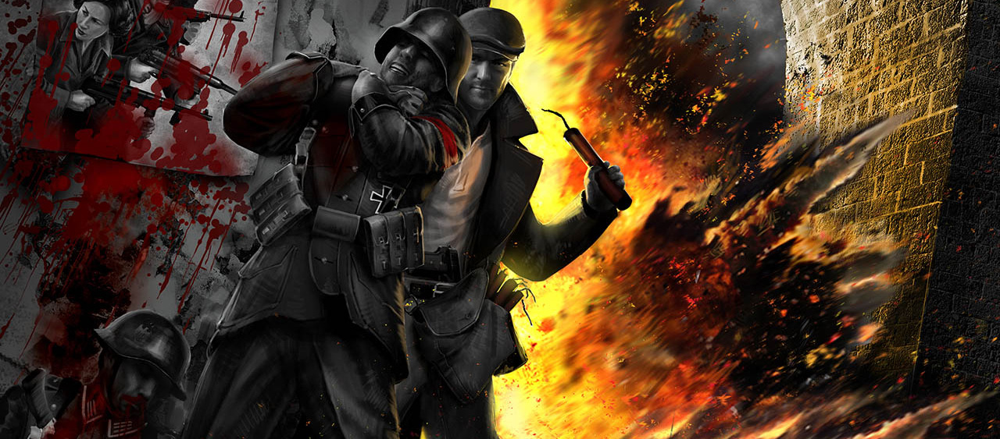

> _Retrospectiva săptămânii_ este rubrica duminicală în care trecem în revistă evenimentele săptămânii de pe frontul de gaming: știri şi articole (scrise de alții, bineînțeles, că e mai ușor aşa), industrie, lansări, oferte de jocuri, toate numai de savurat la cafeaua de duminică dimineața. (Și la care oricine poate contribui. ^[Dacă ai citit vreun articol sau vreo știre interesantă și crezi că merită inclusă în retrospectiva săptămânii, te așteptăm cu recomandarea ta pe forum, pe unul din topicurile dedicate: [Știri](https://forum.candaparerevista.ro/viewtopic.php?f=4&t=46), [Articole](https://forum.candaparerevista.ro/viewtopic.php?f=4&t=206), [Gaming România](https://forum.candaparerevista.ro/viewtopic.php?f=4&t=1622), [Oferte jocuri](https://forum.candaparerevista.ro/viewtopic.php?f=62&t=25)] )

## Ştiri

### Telltale Games se închide
* Telltale Games se închide după un nou val de concedieri, după cel de la sfârşitul anului trecut. Jocurile aflate în lucru, atât **The Walking Dead The Final Series**, care tocmai urma să lanseze episodul 2 săptămâna viitoare, cât și viitoarele **The Wolf Among Us 2** şi **Stranger Things**, au fost anulate. Va mai fi păstrată doar o mică echipă care să termine **Minecraft: Story Mode**. (thx @Triggerix) ([Twitter Telltale Games](https://twitter.com/telltalegames/status/1043252010999410689), [USgamer](https://www.usgamer.net/articles/report-telltale-games-shutting-down-the-wolf-among-us-2-and-stranger-things-canceled), [The Verge](https://www.theverge.com/2018/9/21/17888162/telltale-games-layoffs-the-walking-dead), [Ars Technica](https://arstechnica.com/gaming/2018/09/telltale-games-begins-wave-of-layoffs-cancels-stranger-things-game/), [Variety](https://variety.com/2018/gaming/news/walking-dead-game-developer-hit-staff-layoffs-1202952915/), [ComicBook.com](https://comicbook.com/gaming/2018/09/21/the-walking-dead-the-final-season-cancelled-telltale-closing/), [PCGamesN](https://www.pcgamesn.com/telltale-games-shut-down-official-netflix), [RPS](https://www.rockpapershotgun.com/2018/09/22/telltale-games-confirm-huge-layoffs-and-majority-studio-closure/))
* Fostul CEO al Telltale, Kevin Bruner, care a fost concediat în 2017 şi se află în prezent într-un litigiu cu studioul, a comentat situaţia într-un comunicat [publicat pe site-ul său](https://www.brunerhouse.com/blog/2018/9/21/telltale-closure) şi preluat de [VentureBeat](https://venturebeat.com/2018/09/21/ousted-telltale-ceo-kevin-bruner-comments-on-studios-fate/).
* Pentru mai multe detalii, citiţi şi aceste articole mai vechi:
  * [Exclusive: How a Culture of Crunch Brought Telltale From Critical Darling to Layoffs](https://www.usgamer.net/articles/exclusive-how-a-culture-of-crunch-brought-telltale-from-critical-darlings-to-layoffs) (USgamer)
  * [Toxic management cost an award-winning game studio its best developers](https://www.theverge.com/2018/3/20/17130056/telltale-games-developer-layoffs-toxic-video-game-industry) (The Verge)

### Tokyo Game Show 2018
În perioada 20-23 septembrie are loc [Tokyo Game Show 2018](https://expo.nikkeibp.co.jp/tgs/2018/exhibition/english/). Câteva materiale:

* [The Biggest Games At Tokyo Game Show 2018](https://www.gamespot.com/gallery/the-biggest-games-at-tokyo-game-show-2018/2900-2271/) (Gamespot)
* [The Exciting Sights From The TGS 2018 Show Floor](https://www.gameinformer.com/tgs-2018/2018/09/21/the-exciting-sights-from-the-tgs-2018-show-floor) (Games Informer)
* [The 8 best indie games from Tokyo Game Show 2018](https://www.polygon.com/2018/9/21/17885856/best-indie-games-tgs-2018-switch-steam-ps4) (Polygon)
* [The Games That Drew Big Crowds At The Tokyo Game Show](https://kotaku.com/the-games-that-drew-big-crowds-at-the-tokyo-game-show-1829243678) (Kotaku)
* [The Coolest Stuff For Sale At Tokyo Game Show 2018](https://kotaku.com/the-coolest-stuff-for-sale-at-tokyo-game-show-2018-1829216082) (Kotaku)
* [The Sights Of The Tokyo Game Show](https://kotaku.com/the-sights-of-the-tokyo-game-show-1829190913) (Kotaku)

### Alte ştiri
* **Mini-retro-console**: după NES, SNES şi Neo Geo Mini, şi Sony intră pe această piaţă cu o relansare a PlayStation Classic. ([Ars Technica](https://arstechnica.com/gaming/2018/09/sony-joins-the-classic-console-fray-with-99-playstation-classic-on-dec-3/)). SEGA amână lansarea Mega Drive Mini până în 2019. ([Gematsu](https://gematsu.com/2018/09/sega-mega-drive-mini-delayed-to-2019), [GamesIndustry.biz](https://www.gamesindustry.biz/articles/2018-09-19-sega-pushes-mega-drive-mini-to-2019)). Şi, dacă zvonurile se confirmă, se prefigurează şi un Nintendo 64 mini. ([Games Informer](https://www.gameinformer.com/2018/09/20/trademark-suggests-a-nintendo-64-classic-is-on-the-way))
* Eforturile de reglementare a tot ceea ce înseamnă _loot boxes / gambling_ în jocuri încep să se coaguleze la nivel internaţional. La începutul săptămânii a fost dată publicităţii o declaraţie semnată de reprezentaţi ai unor agenţii şi ministere cu atribuţii în domeniul jocurilor de noroc din 15 ţări şi teritorii europene precum Cehia, Spania, Irlanda, Gibraltar, Marea Britanie etc., plus statul Washington din SUA, prin care se pun bazele colaborării pentru analiza acestui fenomen şi informarea publicului, precum şi participarea la eventuale măsuri legislative. ([Ars Technica](https://arstechnica.com/gaming/2018/09/multinational-regulators-join-together-to-fight-gambling-in-video-games/), [Eurogamer](https://www.eurogamer.net/articles/2018-09-17-15-european-gambling-regulators-unite-to-tackle-loot-box-threat), [GamesIndustry.biz](https://www.gamesindustry.biz/articles/2018-09-17-international-gambling-regulators-unite-on-skins-gambling-loot-boxes))
* THQ Nordic achiziţionează drepturile pentru **Alone In The Dark** şi **Act of War**. ([Eurogamer](https://www.eurogamer.net/articles/2018-09-19-thq-nordic-has-now-acquired-survival-horror-classic-alone-in-the-dark), [GamesIndustry.biz](https://www.gamesindustry.biz/articles/2018-09-19-thq-nordic-acquires-alone-in-the-dark-and-act-of-war))
* Brian Fargo vrea să cumpere Interplay **dacă** vânzările pentru The Bard’s Tale IV depăşesc 2 milioane de unităţi în următoarele 18 luni. ([GamesIndustry.biz](https://www.gamesindustry.biz/articles/2018-09-18-brian-fargo-wants-to-buy-back-interplay), [Gamasutra](http://www.gamasutra.com/view/news/326743/Interplay_cofounder_Brian_Fargo_wants_to_buy_back_the_studio.php))
* Steam introduce echipe de moderatori pentru a verifica discuţiile de pe paginile jocurilor (_community hubs_), care în mod obişnuit erau moderate de fiecare developer în parte. Aceştia au însă opţiunea să renunţe la acest serviciu dacă nu vor ca Valve să se implice pe paginile lor. ([Steam Community](https://steamcommunity.com/groups/steamworks/announcements/detail/1696058394205125837), [Eurogamer](https://www.eurogamer.net/articles/2018-09-20-steam-to-moderate-game-discussions), [GamesIndustry.biz](https://www.gamesindustry.biz/articles/2018-09-20-valve-will-start-moderating-steam-comments-next-week))
* Twitch e blocat în China, fără un motiv oficial. ([GamesIndustry.biz](https://www.gamesindustry.biz/articles/2018-09-20-twitch-has-been-blocked-in-china), [Gamasutra](http://www.gamasutra.com/view/news/327020/Twitch_abruptly_blocked_in_China_amp__delisted_from_local_iOS_App_Store.php))
* Marile companii mai fac și fapte bune: Bethesda și Nintendo le-au permis unor fani, bolnavi de cancer în faze terminale, să joace **Fallout 76**, respectiv **Super Smash Bros. Ultimate**, înainte de lansare. ([Eurogamer](https://www.eurogamer.net/articles/2018-09-22-bethesda-helps-12-year-old-boy-with-rare-cancer-fulfil-his-wish-of-playing-fallout-76), [The Verge](https://www.theverge.com/2018/9/21/17888326/nintendo-super-smash-bros-ultimate-terminal-cancer-patient))
* **Amnesia: The Dark Descent** primeşte un Hard Mode. ([Eurogamer](https://www.eurogamer.net/articles/2018-09-21-horror-classic-amnesia-the-dark-descent-is-getting-an-official-hard-mode-next-week), [RPS](https://www.rockpapershotgun.com/2018/09/21/amnesia-the-dark-descent-adding-hard-mode/))
* Paramount realizează două filme bazate pe romanele lui Tom Clancy, unul dintre acestea fiind Rainbow Six, ambele avându-l pe actorul Michael B. Jordan în rolul principal. ([Variety](https://variety.com/2018/film/news/michael-b-jordan-john-clark-tom-clancy-movies-1202896241/))
* E foarte posibil să avem şi un serial animat Diablo. ([PCGamesN](https://www.pcgamesn.com/diablo-netflix-cartoon), [Gamasutra](http://www.gamasutra.com/view/news/327078/Blizzards_Diablo_series_tapped_for_possible_Netflix_show.php), [Wccf tech](https://wccftech.com/diablo-netflix/))

## Articole (critică, dev, design)
* Capsule Crit, care publică periodic o colecţie de eseuri despre jocuri, au publicat [ediţia cu numărul 3](https://www.capsulecrit.com/intro03/), în care puteţi citi materiale, printre altele, despre **Grand Theft Auto V**, **Minecraft** sau **God of War**.
* [Gamer Mom: D&amp;D, My Daughters, and Me](http://sidequest.zone/2018/09/20/gamer-mom-dd-my-daughters-and-me/) (Sidequest)
* [The Endless Stream of New Game Releases Is Exciting, but Also Exhausting](https://waypoint.vice.com/en_us/article/8x7x93/the-endless-stream-of-new-game-releases-is-exciting-but-also-exhausting) (Waypoint)
* [Suspended, Mid-air](https://unwinnable.com/2018/09/21/suspended-mid-air/) (Unwinnable)
* [Playing today's games in a thousand years](https://www.eurogamer.net/articles/2018-09-22-playing-todays-games-in-a-thousand-years) (Eurogamer)
* [The Order/Chaos Spectrum](http://gamasutra.com/blogs/JohnNelsonRose/20180920/326849/The_OrderChaos_Spectrum.php) (Gamasutra)
* [An Examination of the Debate Behind Loot Boxes](https://gamasutra.com/blogs/JoshBycer/20180921/327040/An_Examination_of_the_Debate_Behind_Loot_Boxes.php) (Gamasutra)
* [As Streaming Games Goes Big Money, Debt Collection Comes Along](http://www.kotaku.co.uk/2018/09/19/as-streaming-games-goes-big-money-debt-collection-comes-along) (Kotaku)

### _Not-a-review_
* (The Walking Dead) [Remembering the only choice that mattered in Telltale’s The Walking Dead](https://www.polygon.com/2018/9/20/17881800/walking-dead-telltale-clementine) (spoiler pentru primul sezon din TWD) (Polygon)
* (Exapunks) [How  Exapunks  dev Zachtronics finds the fun in hacking](http://www.gamasutra.com/view/news/326554/How_Exapunks_dev_Zachtronics_finds_the_fun_in_hacking.php) (Gamasutra)
* (Tomb Raider) [What Lara Croft's origin trilogy got right and wrong](https://www.pcgamer.com/what-lara-crofts-origin-trilogy-got-right-and-wrong/) (PC Gamer)
* (Tomb Raider) [I miss getting stuck in Tomb Raider games](https://www.eurogamer.net/articles/2018-09-21-i-miss-getting-stuck-in-tomb-raider-games) (Eurogamer)
* (OFF) [Ten years later, OFF lives ON](https://www.rockpapershotgun.com/2018/09/21/ten-years-later-off-lives-on/) (RPS)
* (Subserial Network) [A Cyberpunk Detective Game About Finding Rogue Androids](https://kotaku.com/a-cyberpunk-detective-game-about-finding-rogue-androids-1829171126) (Kotaku)

### Vocea industriei
* Mei Erikawa, Ruby Party: [How the Creators of the Otome Genre Bring Romance to Modern Audiences](https://waypoint.vice.com/en_us/article/ev7z4m/otome-genre-vita-dating-sim) (Waypoint)
* Kyle Gabler şi Kyle Gray, Tomorrow Corporation: [&quot;We've never made a game with a jump button, and we don't plan to start now&quot;](https://www.gamesindustry.biz/articles/2018-09-18-weve-never-made-a-game-with-a-jump-button-and-we-dont-plan-to-start-now) (GamesIndustry.biz)
* Aaron Linde, ArenaNet: [Writing the video games of the future](https://www.gamesindustry.biz/articles/2018-09-15-writing-the-video-games-of-the-future) (GamesIndustry.biz)
* Debbie Bestwick, Team17: [&quot;Be careful what you wish for&quot; when after a publisher, says Team17 CEO](https://www.gamesindustry.biz/articles/2018-09-20-team17-ceo-gives-advice-on-finding-a-publisher-be-careful-what-you-wish-for) (GamesIndustry.biz)
* Edmund McMillen: [Life after death: Edmund McMillen on the success of The Binding of Isaac and his future](https://www.destructoid.com/life-after-death-edmund-mcmillen-on-the-success-of-the-binding-of-isaac-and-his-future-523209.phtml) (Destructoid)
* Tim Hartman și Greg Caldwell, Retrotainment Games: [Retrotainment's cartridge revival](https://www.gamesindustry.biz/articles/2018-09-21-retrotainment-interview) (GamesIndustry.biz)

### Istorie
* [Seeing farther: the advert that changed the games industry](https://www.eurogamer.net/articles/2018-09-16-seeing-farther-the-advert-that-changed-the-games-industry) (Eurogamer)
* [The Convoluted History Of Call Of Duty’s Bloody Zombies Mode](https://www.gameinformer.com/feature/the-convoluted-history-of-call-of-dutys-bloody-zombies-mode) (Games Informer)
* [GTA V, Five Years Later](https://kotaku.com/gta-v-five-years-later-1829120653) (Kotaku)
* [How Vampire: The Masquerade Revolutionised Gaming](http://www.kotaku.co.uk/2018/09/20/how-vampire-the-masquerade-revolutionised-gaming) (Kotaku)

### Dev, making of
* [Witch-craft: How  Dicey Dungeons  balances chance and predictability](http://www.gamasutra.com/view/news/325888/Witchcraft_How_Dicey_Dungeons_balances_chance_and_predictability.php) (Gamasutra)
* [How great game explosions are made](https://www.pcgamer.com/how-great-game-explosions-are-made/) (PC Gamer)
* [No More Tutorials! How to Convey Information Through Design](https://remptongames.com/2018/09/22/no-more-tutorials-how-to-convey-information-through-design/) (Rempton Games)
* [What Works And Why: Story structure in Unavowed](https://www.rockpapershotgun.com/2018/09/20/what-works-and-why-story-structure-in-unavowed/) (RPS)

### Design, world-building
* [Building Hyrule](https://www.slowrun.me/2018/09/building-hyrule.html) (SlowRun)
* [The Computer and the Orient | Assassin&#039;s Creed: Revelations](http://www.heterotopiaszine.com/2018/09/20/computer-orient-assassins-creed-revelations/) (Heterotopias)
* (Poze frumoase) [Start Your Engines](https://kotaku.com/start-your-engines-1829100976) (Kotaku)

## Made în România

* Jocul **Blink:Rogues**, un _schmup arena fighting game_ produs Fox Dive Studio are acum [pagină de Steam](https://store.steampowered.com/app/739100/BlinkRogues/) şi se pregăteşte de lansarea în Early Access pe 28 septembrie. Mai multe detalii pe [website-ul studioului](https://foxdivestudio.com/) sau pe [pagina de Facebook](https://www.facebook.com/foxdivedevs).
* **Move or Die** al celor de la Those Awesome Guys participă la Tokyo Game Show 2018. ([Facebook](https://www.facebook.com/moveordiegame/photos/a.713876118677814/1990037104395036/?type=3&__xts__%5B0%5D=68.ARB2SN0gI66qZffDHk3Ise5dcTvN0kagtLIFRXj_e52v2JO0SnNgjdpe7O3zocg-biO4t69oJqGdhoKwX5EmgDeQw-eCQy6vsJgOiNmGa876quFuZ-GPwmpaKJ6bEok6aixY89E6qQjiBkqmWwryqFhovh_IkefVcAEdegVEMs8Yj3nW221SqA&__tn__=-R))

## Anunţuri şi lansări de jocuri
#### Anunţate
* **Encased** (Kickstarter), un RPG izometric turn-based post-apocaliptic ([PCGamesN](https://www.pcgamesn.com/encased/encased-kickstarter))
* **Parkasaurus**, un nou _theme-park_ cu dinozauri ([PCGamesN](https://www.pcgamesn.com/parkasaurus/new-games-parkasaurus))
* **Darkside Detective Season 2** (Kickstarter) ([PC Gamer](https://www.pcgamer.com/funny-adventure-game-darkside-detective-has-a-kickstarter-for-a-sequel/))
* **Lineage 2 Classic**, o relansare a vechiului MMO - apare pe 3 octombrie ([PC Gamer](https://www.pcgamer.com/lineage-2-classic-brings-back-old-time-mmoing-in-october/))
* **Resonance of Fate** e remasterizat în HD şi apare şi pe PC pe 18 octombrie ([Gematsu](https://gematsu.com/2018/09/resonance-of-fate-4k-hd-edition-announced-for-ps4-pc))
* **Away: The Survival Series** ([Destructoid](https://www.destructoid.com/someone-s-making-a-sugar-glider-game-523323.phtml))
* Trilogia **Phoenix Wright: Ace Attorney** vine şi pe PC (thx @cg1700) ([Gematsu](https://gematsu.com/2018/09/phoenix-wright-ace-attorney-trilogy-coming-to-ps4-xbox-one-switch-and-pc-in-early-2019), [DualShockers](https://www.dualshockers.com/ace-attorney-123-modern-platforms-trailer/))

### Acum cu dată de lansare
* **INSOMNIA: The Ark**: 27 septembrie ([Wccf tech](https://wccftech.com/dieselpunk-rpg-insomnia-the-ark-launch/))
* **Gwent: The Witcher Card Game** şi **Thronebreaker: The Witcher Tales**: 23 octombrie; niciunul nu va fi pe Steam, ci doar pe gog.com ([Eurogamer](https://www.eurogamer.net/articles/2018-09-18-cd-projekt-red-dates-full-gwent-the-witcher-card-game-release-and-standalone-thronebreaker-adventure), [PCGamesInsider.biz](https://www.pcgamesinsider.biz/news/67809/cd-projekt-red-ditches-steam-for-new-witcher-games-gwent-and-thronebreaker/))
* **Tetris Effect**: 9 noiembrie (dar numai pentru PlayStation 4) ([Eurogamer](https://www.eurogamer.net/articles/2018-09-17-rez-creator-tetsuya-mizuguchis-tetris-effect-gets-a-november-release-date))
* **Let It Die**: 26 septembrie ([RPS](https://www.rockpapershotgun.com/2018/09/14/let-it-die-pc-release-september-26th/))
* **Depth Of Extinction**: 27 septembrie ([RPS](https://www.rockpapershotgun.com/2018/09/19/tactical-seafaring-roguelike-rpg-depth-of-extinction-rises-from-the-depths-soon/))
* **The Hex** ([RPS](https://www.rockpapershotgun.com/2018/09/18/pony-island-creator-releasing-the-hex-in-october/))
* **Achtung! Cthulhu Tactics**: 4 octombrie ([RPS](https://www.rockpapershotgun.com/2018/09/20/achtung-cthulhu-tactics-october-4th/))
* **Sunless Skies**: 31 ianuarie 2019 ([Eurogamer](https://www.eurogamer.net/articles/2018-09-22-sunless-skies-has-a-release-date-and-a-pen-and-paper-rpg))

### Lansate
* 18 septembrie: **60 Parsecs!** ([Steam](https://store.steampowered.com/app/646270/60_Parsecs/))
* 20 septembrie: **The Gardens Between** ([Steam](https://store.steampowered.com/app/600990/The_Gardens_Between/), [Humble](https://www.humblebundle.com/store/the-gardens-between))
* 20 septembrie: **Star Control: Origins** ([Steam](https://store.steampowered.com/app/271260/Star_Control_Origins/), [gog.com](https://www.gog.com/game/star_control_origins), [Humble Store](https://www.humblebundle.com/store/star-control-origins))
* 20 septembrie: **Hyperspace Delivery Service** (Early Access) ([RPS](https://www.rockpapershotgun.com/2018/09/21/hyperspace-delivery-service-launch/), [Steam](https://store.steampowered.com/app/876320/Hyperspace_Delivery_Service/))
* 21 septembrie: **My Brother Rabbit** ([gog.com](https://www.gog.com/game/my_brother_rabbit))

## Oferte jocuri

### Humble Bundle
* [Humble One Special Day Bundle](https://www.humblebundle.com/games/one-special-day-bundle):
  * Minim 1$: **Streets of Rage**, **Crazy Taxi**, **Binary Domain**, **OlliOlli2: Welcome to Olliwood**
  * Pragul „beat the average”: **Surgeon Simulator: Anniversary Edition**, **GRID 2**, **Alpha Protocol**, **Operation Flashpoint: Red River**
  * Peste 9$: **Stronghold Crusader 2**, **Guardians of the Galaxy: The Telltale Series**
* Alte reduceri: [No Man's Sky](https://www.humblebundle.com/store/no-mans-sky) (23,99€)

### Steam
* [Focus weekend](https://store.steampowered.com/sale/focus_weekend/): [Masters of Anima](https://store.steampowered.com/app/606890/Masters_of_Anima/) (9,99€), [Contrast](https://store.steampowered.com/app/224460/Contrast/) (2,99€), [seria Wargame](https://store.steampowered.com/sub/45320/), [Bound By Flame](https://store.steampowered.com/app/243930/Bound_By_Flame/) (3,99€), [seria Divinity](https://store.steampowered.com/sub/17798/)
* Reducerile săptămânale: [Euro Truck Simulator 2](https://store.steampowered.com/app/227300/Euro_Truck_Simulator_2/) (4,99€)  şi [American Truck Simulator](https://store.steampowered.com/app/270880/American_Truck_Simulator/) (4,99€), seria [seria Rusty Lake](https://store.steampowered.com/bundle/3669/Rusty_Lake_Bundle/), [Rise to Ruins](https://store.steampowered.com/app/328080/Rise_to_Ruins/) (4,99€), [Warhammer: End Times - Vermintide](https://store.steampowered.com/app/235540/Warhammer_End_Times__Vermintide/) (6,99€), [Conquest of Elysium 4](https://store.steampowered.com/app/403950/Conquest_of_Elysium_4/) (5,74€), [The Caribbean Sail](https://store.steampowered.com/app/657690/The_Caribbean_Sail/) (4,99€), [Nelly Cootalot: The Fowl Fleet](https://store.steampowered.com/app/317320/Nelly_Cootalot_The_Fowl_Fleet/) (9,99€), [Avadon: The Black Fortress](https://store.steampowered.com/app/112100/Avadon_The_Black_Fortress/) (2,99€), [Heroes of a Broken Land](https://store.steampowered.com/app/314470/Heroes_of_a_Broken_Land/) (3,74€), [Codename: Panzers, Phase One](https://store.steampowered.com/app/411310/Codename_Panzers_Phase_One/) (3,74€)  (sau [toată seria](https://store.steampowered.com/sub/92888/) la 5,99€), [Darkstar One](https://store.steampowered.com/app/12330/Darkstar_One/) (1,99€), [The Forest of Doom](https://store.steampowered.com/app/270490/The_Forest_of_Doom/) (3,49€), [Super Trench Attack!](https://store.steampowered.com/app/311870/Super_Trench_Attack/) (0,49€), [Kim](https://store.steampowered.com/app/433400/Kim/) (4,94€), [Hostile Waters: Antaeus Rising](https://store.steampowered.com/app/267980/Hostile_Waters_Antaeus_Rising/) (1,01€)
* Alte reduceri: [D4: Dark Dreams Don’t Die Season One](https://store.steampowered.com/app/358090/D4_Dark_Dreams_Dont_Die_Season_One/) (4,49€), [NieR:Automata](https://store.steampowered.com/app/524220/NieRAutomata/) (29,99€), [Rising Dusk](https://store.steampowered.com/app/848930/Rising_Dusk/) (3,75€), [Lode Runner Legacy](https://store.steampowered.com/app/628660/Lode_Runner_Legacy/) (7,19€)
* Free weekend pentru [Dead by Daylight](https://store.steampowered.com/app/381210/Dead_by_Daylight/)

### gog.com
* [Reduceri săptămânale](https://www.gog.com/promo/20180917_weekly_sale) - multe adventure-uri, majoritatea de la Wadjet Eye, dar nu numai: seria **Blackwell**, **Gemini Rue**, **Primordia**, **Shardlight**, **Technobabylon**, **The Last Door**, etc.
* Jocurile din seria Divinity (cu excepţia ultimului Original Sin) [sunt la promoţie](https://www.gog.com/promo/20180917_divinity_birthday) pentru bani puţini
* O mega-promoţie cu [jocuri Electronic Arts](https://www.gog.com/promo/20180921_ea_weekend) - foarte multe jocuri clasice la preţuri de câte o bere: seriile **Magic Carpet**, **Populous**, **Lands of Lore**, **SimCity**, **Ultima**, **Kyrandia**, **Wing Commander**, **Syndicate**, sau jocuri precum **Spore**, **Nox**, **Jade Empire**, **The Saboteur** şi altele

### Fanatical
* [Multe bundles](https://www.fanatical.com/en/bundle). Câteva recomandări: [Slayer Bundle](https://www.fanatical.com/en/bundle/slayer-bundle) (conţine câteva titluri decente împărţite pe 3 tiers; fanii jocurilor adventure vor găsi aici **The Lion’s Song**), [Infinity Bundle](https://www.fanatical.com/en/bundle/infinity-bundle) (fără tiers, costă 3,65€ pentru care primiţi Fran Bow, Dex, Deponia The Complete Journey şi Epistory, plus alte câteva), [The FaceRig Bundle](https://www.fanatical.com/en/bundle/the-facerig-bundle) (e făcut de nişte români, apropo), [Anomaly Complete Bundle](https://www.fanatical.com/en/bundle/dollar-anomaly-complete-bundle), [Anthology Awesome Bundle](https://www.fanatical.com/en/bundle/fanatical-anthology-awesome-bundle) (Skulls of the Shogun e un TBS excelent, iar bundle-ul mai conţine, printre altele, Crimsonland, One Finger Death Punch, War of the Human Tanks şi System Shock 2, pentru doar 3,09€)
* Alte reduceri: [Kerbal Space Program](https://www.fanatical.com/en/game/kerbal-space-program) (17,99€)

### Altele
* Groupees: [Remute XX RETURN](https://groupees.com/remutexx2), cu două tiers de preţ la 1,86$ şi 3,86$, pentru care primiţi **Tony Tough and the Night of Roasted Moths**, **Wizardry 6-7 și 8**, **The 7th Guest**, **Bad Mojo Redux** sau **Shadow Man** - toate pentru Steam
* [chrono.gg](https://www.chrono.gg/) are o promoţie la jocuri cu maşini până pe 24 septembrie
* [Green Man Gaming](https://www.greenmangaming.com/scandimania/) are o promoţie la jocuri scandinave; aveţi o reducere suplimentară de 15% cu codul `NORDIC15`
* Reduceri şi în [magazinul Paradox](https://www.paradoxplaza.com/on-sale/)

## Recomandarea săptămânii: _The Saboteur_

În 2009, colecția jocurilor de acțiune derivate din seria Grand Theft Auto a căpătat un reprezentant de seamă, ce avea să sfârșească tragic de sub-apreciat de către mulți jucători.

Poate cel mai acaparant sandbox de acțiune, în The Saboteur duci pe drumul răzbunării un mecanic irlandez, pe vremea Parisului ocupat de naziști. Pandemic Studios (îngropați între timp de prietenii noștri de la EA) au reușit să inoveze formula specifică genului cu un stil vizual ce se împletește organic cu gameplay-ul și o serie de misiuni distractive, mai ales prin prisma vehiculelor de epocă pe care le poți controla.

Un sandbox cu un caracter foarte personal, așa cum a fost și mai recentul Sleeping Dogs. Gameplay-ul e dinamic, personajul principal se asociază cu mișcarea de rezistență în speranța de a-și duce misiunea la bun sfârșit, iar fiecare zonă eliberată își recapătă (la propriu) culoarea, devenind mai ușor de traversat după.

Recomandat pentru fanii genului, dar la fel de recomandat și pentru cei care pot aprecia surprinzătorul cântec de lebădă al studioului, sub forma unui joc atmosferic, pe alocuri inovator, care suferă ocazional de stângăcii mai mult sau mai puțin adorabile. Toți acești factori contribuind la o experiență mai mult decât memorabilă. (**TG**)

* Cumpărați-l de pe [GOG](https://www.gog.com/game/saboteur), că e ieftin şi DRM-free, dar se găseşte şi pe [Origin](https://www.origin.com/irl/en-us/store/saboteur/the-saboteur/), de cumpărat sau jucat prin Origin Access.
* Lectură suplimentară:
  * [Review-ul LEVEL](http://arhivarevistevechi.mythweb.ro/arhiva/articole.php?editie-id=149&articol=6237) (nr. 148, ianuarie 2010)
  * [Love It Or Hate It : The Saboteur](https://venturebeat.com/2011/02/10/love-it-or-hate-it-the-saboteur/) (VentureBeat)
  * Artworks ale unor foşti artişti de la Pandemic: [Andrew Krelle](https://www.artstation.com/artwork/8mOmE) şi [Imran Sheikh](https://www.artstation.com/artwork/lVPmk) (ArtStation)