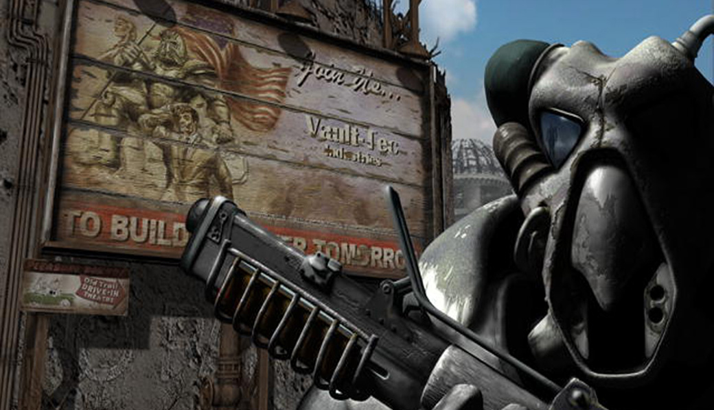

> _Retrospectiva săptămânii_ este rubrica duminicală în care trecem în revistă evenimentele săptămânii de pe frontul de gaming: știri şi articole (scrise de alții, bineînțeles, că e mai ușor aşa), industrie, lansări, oferte de jocuri, toate numai de savurat la cafeaua de duminică dimineața. (Și la care oricine poate contribui. ^[Dacă ai citit vreun articol sau vreo știre interesantă și crezi că merită inclusă în retrospectiva săptămânii, te așteptăm cu recomandarea ta pe forum, pe unul din topicurile dedicate: [Știri](https://forum.candaparerevista.ro/viewtopic.php?f=4&t=46), [Articole](https://forum.candaparerevista.ro/viewtopic.php?f=4&t=206), [Gaming România](https://forum.candaparerevista.ro/viewtopic.php?f=4&t=1622), [Oferte jocuri](https://forum.candaparerevista.ro/viewtopic.php?f=62&t=25)] )

## Ştiri

### Telltale Games se închide
* Alte concedieri la Telltale: compania renunţă la o parte din ultimii angajați pe care-i păstrase după valul masiv de concedieri de acum două săptămâni. ([GamesIndustry.biz](https://www.gamesindustry.biz/articles/2018-10-04-remaining-telltale-staffers-laid-off-report), [Gamasutra](http://www.gamasutra.com/view/news/327978/Report_Telltale_Games_lays_off_remaining_skeleton_crew.php), [Engadget](https://www.engadget.com/2018/10/04/telltale-lays-off-rest-of-staff/))
* Totodată, compania caută să încheie un acord cu o companie externă pentru a angaja o parte dintre foștii dezvoltatori de la Telltale și să termine ultimul sezon din **The Walking Dead**. ([Kotaku](https://kotaku.com/telltale-is-looking-for-another-company-to-hire-its-sta-1829503254))
* The Verge publică o cronică a sfârșitului companiei, povestită chiar de oamenii care și-au pierdut slujbele. ([The Verge](https://www.theverge.com/2018/10/4/17934166/telltale-games-studio-closed-layoffs-end-the-walking-dead))
* Alte reacții: [Opinion: Will Telltale's fate be a catalyst for industry reform?](http://www.gamasutra.com/view/news/327967/Opinion_Will_Telltales_fate_be_a_catalyst_for_industry_reform.php) (Gamasutra)

### Alte știri
* Andrzej Sapkowski, autorul romanelor Witcher, e nemulţumit de contractul pe care l-a încheiat pentru jocurile video şi încearcă să obţină mai mulţi bani (mai precis 16,1 milioane de dolari) de la CD Projekt Red, care însă l-au refuzat.  ([Eurogamer](https://www.eurogamer.net/articles/2018-10-02-witcher-author-andrzej-sapkowski-unsuccessfully-demands-more-money-from-cd-projekt), [GamesIndustry.biz](https://www.gamesindustry.biz/articles/2018-10-02-cd-project-red-rejects-witcher-authors-request-for-usd16-1m-for-additional-royalties), [Gamasutra](http://www.gamasutra.com/view/news/327758/The_Witcher_author_wants_16_million_in_royalties_from_CD_Projekt_Red.php))
* Mike Morhaime se retrage din poziţia de preşedinte al Blizzard Entertainment. Morhaime a fost unul dintre co-fondatorii companiei în 1991 şi i-a fost preşedinte în ultimii 14 ani. ([Eurogamer](https://www.eurogamer.net/articles/2018-10-04-blizzard-entertainment-president-mike-morhaime-steps-down), [GamesIndustry.biz](https://www.gamesindustry.biz/articles/2018-10-03-j-allen-brack-succeeds-mike-morhaime-as-president-of-blizzard-entertainment))
* Dezvoltatorul jocului **Limit Theory** anunţă că opreşte lucrul la joc, la 6 ani după ce a strâns fonduri prin Kickstarter, timp în care nu a reuşit să-l finalizeze. ([Kickstarter](https://www.kickstarter.com/projects/joshparnell/limit-theory-an-infinite-procedural-space-game/posts/2270873), [PC Gamer](https://www.pcgamer.com/after-6-years-space-sim-limit-theory-ceases-development/), [Eurogamer](https://www.eurogamer.net/articles/2018-10-01-in-a-sobering-blog-post-an-indie-developer-has-announced-he-cant-finish-his-ambitious-space-sim-after-six-years-of-work))
* Google a dezvăluit că lucrează la Project Stream, o tehnologie ce va permite streamingul de jocuri video în browser, începând cu Assassin’s Creed Odyssey. ([Blog Google](https://www.blog.google/technology/developers/pushing-limits-streaming-technology/), [Ars Technica](https://arstechnica.com/gadgets/2018/10/google-announces-project-stream-a-test-of-game-streaming-in-chrome/), [Eurogamer](https://www.eurogamer.net/articles/2018-10-01-googles-new-streaming-initiative-lets-you-play-assassins-creed-odyssey-in-your-browser), [Games Informer](https://www.gameinformer.com/2018/10/01/google-shows-off-new-streaming-tech-using-assassins-creed-odyssey))
* Nintendo scoate o versiune nouă de Switch în 2019, dar nu se cunosc momentan alte detalii ([The Wall Street Journal](https://www.wsj.com/articles/nintendo-plans-new-version-of-switch-next-year-1538629322), [Ars Technica](https://arstechnica.com/gaming/2018/10/report-a-new-nintendo-switch-model-will-arrive-in-2019/), [GamesIndustry.biz](https://www.gamesindustry.biz/articles/2018-10-04-nintendo-planning-new-switch-for-2019-report)). Totodată, a depus și o cerere pentru a obține un brevet pentru o carcasă de telefon mobil care să transforme dispozitivul într-un Game Boy, cu tot cu butoane. ([Engadget](https://www.engadget.com/2018/10/05/nintendo-game-boy-smartphone-case-patent/), [Games Informer](https://www.gameinformer.com/2018/10/05/nintendo-files-patent-for-playable-smartphone-case-resembling-a-game-boy))
* Bluehole, producătorii lui Playerunknown's Battlegrounds, au „banat” peste 13 milioane de conturi începând din iunie anul trecut. ([Eurogamer](https://www.eurogamer.net/articles/2018-10-02-13-million-pubg-cheaters-have-been-banned-so-far))
* După ce a introdus verificări după numele real pentru a cunoaște vârsta jucătorilor, compania chineză Tencent testează acum un sistem de recunoaștere facială pentru a limita timpul petrecut în joc de jucătorii lui **Honor of Kings**. ([SCMP](https://www.scmp.com/tech/big-tech/article/2166447/tencent-employs-facial-recognition-detect-minors-top-grossing-mobile), [BBC](https://www.bbc.com/news/technology-45707469))
* Randy Pitchford, CEO-ul Gearbox, a fost fraudat cu aproape 3 milioane de dolari de asistentul său personal. ([USgamer](https://www.usgamer.net/articles/gearbox-ceo-randy-pitchford-was-recently-scammed-out-of-nearly-3-million))
* Capcom anunță un film Mega Man. ([Site Capcom](http://www.capcom.co.jp/ir/english/news/html/e181004.html), [Eurogamer](https://www.eurogamer.net/articles/2018-10-04-mega-mans-getting-a-live-action-hollywood-adaptation-which-nobody-asked-for), [Games Informer](https://www.gameinformer.com/2018/10/04/mega-man-getting-his-own-live-action-film-directed-by-catfish-creators))
* Primele secvențe din MMO-ul produs de Amazon, **New World**, s-au „scurs” pe internet. Interesant e că prima dată au apărut pe... PornHub. ([Eurogamer](https://www.eurogamer.net/articles/2018-10-06-big-gameplay-leak-of-amazons-new-mmo-pops-up-on-pornhub), [PC Gamer](https://www.pcgamer.com/footage-of-amazons-mmo-new-world-leaks-online/))

## Articole (critică, dev, design)
* [On Ambition and Labour in Games](https://historianon.wordpress.com/2018/10/02/on-ambition-and-labour-in-games/) (Historian On)
* [Video games and the change of autumn](https://www.eurogamer.net/articles/2018-10-05-video-games-and-the-change-of-autumn) (Eurogamer)
* [Visit Tokyo&#39;s Best Arcades](https://kotaku.com/visit-tokyos-best-arcades-1829104277) (Kotaku)

### _Not-a-review_
* (Mad Max) [Man and Machine](https://www.slowrun.me/2018/10/man-and-machine.html) (SlowRun)
* (My Brother Rabbit) [My Brother Rabbit Tackles Seriousness with Surrealism](https://unwinnable.com/2018/10/03/my-brother-rabbit-tackles-seriousness-with-surrealism/) (Unwinnable)
* (Overcooked) [Couples Fighting](https://unwinnable.com/2018/10/05/couples-fighting/) (Unwinnable)
* (Assassin’s Creed Odyssey) [Why I Like Being Hunted by Mercenaries in the Latest Assassin&#39;s Creed](https://waypoint.vice.com/en_us/article/yw9xmb/assassins-creed-odyssey-mercenaries) (Waypoint)
* (Spider-Man) [Spider-Man: The mediocre and the magnificent](https://ineeddiversegames.org/2018/09/30/spider-man-the-mediocre-and-the-magnificent/) (I Need Diverse Games)

### Vocea industriei
* Serge Hascoet, Ubisoft: [Ubisoft&#039;s Creative Head Talks The Future Of Assassin&#039;s Creed And Splinter Cell](https://www.gameinformer.com/2018/10/01/ubisofts-creative-head-talks-the-future-of-assassins-creed-and-splinter-cell) (Games Informer)
* Siobhan Reddy, Media Molecule: [&quot;We aren't curing cancer. There's a human cost to making games&quot;](https://www.gamesindustry.biz/articles/2018-10-05-siobhan-reddy-we-arent-curing-cancer-we-need-to-understand-the-human-cost-of-making-games) (GamesIndustry.biz)
* John Warner, Over the Moon Games (_The Fall_): [It's time we stopped encouraging indies](https://www.gamesindustry.biz/articles/2018-10-02-its-time-we-stopped-encouraging-indies) și răspunsurile pe care le primește [de la alți dezvoltatori indie](https://www.gamesindustry.biz/articles/2018-10-03-developers-weigh-in-on-indie-discouragement) (GamesIndustry.biz)

### Istorie
* [Assassin’s Creed: An oral history](https://www.polygon.com/features/2018/10/3/17924770/assassins-creed-an-oral-history-patrice-desilets) (Polygon)
* [Beneath a Starless Sky: Pillars of Eternity and the Infinity Engine Era of RPGs](https://www.shacknews.com/article/103473/beneath-a-starless-sky-pillars-of-eternity-and-the-infinity-engine-era-of-rpgs) (Shacknews)
* [How BioWare revolutionised the RPG](https://www.eurogamer.net/articles/2018-09-30-how-bioware-revolutionised-the-rpg) (Eurogamer)
* [Patented Heroes](https://thehistoryofhowweplay.wordpress.com/2018/10/05/patented-heroes/) (The History of How We Play)
* [History of Metal Gear: Kojima's Farewell (Ground Zeroes & Phantom Pain)](http://www.vgchartz.com/article/392859/history-of-metal-gear-kojimas-farewell-ground-zeroes-amp-phantom-pain/) (VGChartz)
* (Video) Clipul e vechi de un an, dar cum Fallout 2 tocmai a împlinit 20 de ani, merită vizionat: [Remembering Fallout 2 as it turns 20](https://www.eurogamer.net/articles/2018-10-01-remembering-fallout-2-as-it-turns-20) (Eurogamer)
* (Video) Un documentar despre istoria Larian: [Divinity: Original Sin Documentary | Gameumentary](https://www.youtube.com/watch?v=YZF_cP_oLH4) (YouTube)
* (Video) [War Stories: Serious Sam almost didn’t happen—until crates saved the day](https://arstechnica.com/gaming/2018/10/war-stories-serious-sam-almost-didnt-happen-until-crates-saved-the-day/) (Ars Technica)
* (Video) [10 Years of GOG.com](https://www.gog.com/10years?pp=44a1b665cceda52001aa6fa3bb69d2cfefc0a91c)

### Dev, making of
* [Die, die, die: Boss battle design in  Death's Gambit ](http://www.gamasutra.com/view/news/328036/Die_die_die_Boss_battle_design_in_Deaths_Gambit.php) (Gamasutra)
* [How Metro Exodus uses Nvidia ray tracing to stunning effect](https://www.eurogamer.net/articles/digitalfoundry-2018-metro-exodus-is-an-nvidia-rtx-showcase) (Eurogamer)
* [Spooky Doorway's revisiting Darkside Detective Season One design choices in light of nearly fully funded Season Two on Kickstarter](https://www.gamasutra.com/blogs/PaulConway/20181001/327583/Spooky_Doorways_revisiting_Darkside_Detective_Season_One_design_choices_in_light_of_nearly_fully_funded_Season_Two_on_Kickstarter.php) (Gamasutra)

### Design, world-building
* [Behind the Creation and Evolution of Fallout&#039;s Iconic Pip-Boy](https://www.usgamer.net/articles/history-evolution-fallout-pip-boy-obsidian-interplay-bethesda) (USgamer)

## Made în România

În perioada 4-5 octombrie s-a desfășurat [Dev.Play 2018](https://dev-play.ro/) conferința anuală organizată de RGDA dedicată industriei jocurilor video:

* Printre [vorbitori](https://dev-play.ro/speakers/) s-au numărat invitați de la Blizzard, EA, Valve, precum și Rami Ismail (Vlambeer).
* [Secțiunea Indie Expo](https://dev-play.ro/indie-expo/) a expus creațiile, în lucru sau deja lansate, ale producătorilor români, printre care și **Interrogation** (studioul Critique Gaming), care a câștigat [premiul pentru cel mai bun joc al expoziției](https://www.facebook.com/critiquegaming/posts/1131880863646329?__xts__[0]=68.ARBxHmeY6Ghv7_6V-oRcvWWAGg_cahEcuzVTY1ZzkdfH6NdBH-9PSTHD4M1seG0G7YpptruRjTiMPkOsBmkUtWw1hQvQ8y5xFjcXNWVU726MI6DC8x-Q0HTiKxm1WBi-CB3EnRDaj0lNg7Mu0HY82pKi7dxAabi5lMkVhB9wjaY4IANFr-iqMA&__tn__=-R) - aveți [aici lista jocurilor câștigătoare](https://www.facebook.com/dev.play.conference/posts/570682886700150?__xts__[0]=68.ARDoM_BdT3RQAveNrpWhUppHHwWBSAsgXtMnpD3y6k3IFeYXannbpjlDIiAtAeq6CDS1GrN1bJBTX9FWwb9fNNKRMACVa8iqIShF2fGjvgaGfkaZMNHlXI0D_4P_pAs-V5DfUDPa27IaAULAaMnmD6Oyi8RAIRA5LjgqReib4z85pj-pMVbQ&__tn__=-R) la diferitele categorii
* S-a desfășurat o etapă din cadrul [Nordic Game Discovery Contest](https://dev-play.ro/ngdc/), care a fost câștigată de **Bossgard** (Sand Sailor Studios)
* La conferință a fost prezent și Ministrul Comunicațiilor, care a anunțat un [program de finanțare](https://startupcafe.ro/finantari/firme-it-ajutor-stat-sua-credite.htm ) de 94 milioane de euro pentru IMM-uri din IT. GameIndustry.biz [discută](https://www.gamesindustry.biz/articles/2018-10-04-romanian-government-boosts-games-industry-with-94-million-tech-fund) cu Cătălin Butnariu, președintele RGDA, despre cum acest program va ajuta industria de gaming din România.

## Anunţuri şi lansări de jocuri
### Anunţate
* **Minecraft: Dungeons** ([Eurogamer](https://www.eurogamer.net/articles/2018-09-30-mojang-unveils-minecraft-dungeons-a-new-dungeon-crawler-set-in-the-minecraft-universe), [USgamer](https://www.usgamer.net/articles/minecraft-dungeons-is-a-brand-new-game-coming-from-mojang-in-2019))
* **Cattle Call: Hollywood Talent Manager** ([PCGamesN](https://www.pcgamesn.com/cattle-call/new-games-cattle-call-announcement-trailer))
* **X4: Foundations**, un nou titlu din seria de space-sims **X** ([RPS](https://www.rockpapershotgun.com/2018/10/01/x4-foundations-release-date-announced/), [PC Gamer](https://www.pcgamer.com/x4-foundations-launches-later-this-year/))
* **Project Gustav** (nume temporar), un nou RPG de la Larian ([Destructoid](https://www.destructoid.com/larian-studios-next-game-is-codenamed-project-gustav-525246.phtml))
* **Weedcraft Inc**, un tycoon în care trebuie să dezvolți o afacere cu ... știți voi ([Destructoid](https://www.destructoid.com/looks-like-we-re-getting-a-proper-weed-tycoon-game-525230.phtml))
* **Baldur’s Gate 3** - nu a fost anunțat oficial, ci doar confirmat indirect de Brian Fargo ([PC Gamer](https://www.pcgamer.com/baldurs-gate-3-is-in-the-works-apparently/), [USgamer](https://www.usgamer.net/articles/baldurs-gate-3-is-reportedly-in-development-by-an-unknown-studio-rpg-news-brian-fargo), [PCGamesN](https://www.pcgamesn.com/baldurs-gate-3-larian-studios))

### Acum cu dată de lansare
* **The Missing**: 10 octombrie ([ResetEra](https://www.resetera.com/threads/swery-65s-the-missing-releasing-october-11th-limbo-x-neverdead-multiplat.68155/))
* **The Quiet Man**, hibridul CG-FMV de la Square Enix, apare pe 1 noiembrie ([Variety](https://variety.com/2018/gaming/news/square-enix-the-quiet-man-november-1202967135/), [RPS](https://www.rockpapershotgun.com/2018/10/03/the-quiet-man-release-date-announced/))

### Amânate
* **Kursk**: 7 noiembrie, în loc de 11 octombrie ([PC Gamer](https://www.pcgamer.com/kursk-the-first-person-adventure-about-russian-sub-disaster-pushed-into-november/))
* **The Occupation**: 5 februarie 2019 în loc de 9 octombrie 2018 ([RPS](https://www.rockpapershotgun.com/2018/10/04/the-occupation-delayed-until-february-2019/))

### Lansate
* 2 octombrie: **Forza Horizon 4** ([Microsoft Store](https://www.microsoft.com/en-US/p/forza-horizon-4-standard-edition/9pnjxvcvwd4k))
* 2 octombrie: **Mega Man 11** ([Steam](https://store.steampowered.com/app/742300/Mega_Man_11__11/))
* 3 octombrie: **Vigilantes** ([Steam](https://store.steampowered.com/app/545600/Vigilantes/))
* 4 octombrie: **Achtung! Cthulhu Tactics** ([Steam](https://store.steampowered.com/app/874460/Achtung_Cthulhu_Tactics/))
* 4 octombrie: **American Truck Simulator - Oregon** (expansion) ([Steam](https://store.steampowered.com/app/800370/American_Truck_Simulator__Oregon/))
* 5 octombrie: **Assassin's Creed Odyssey** ([Steam](https://store.steampowered.com/app/812140/Assassins_Creed_Odyssey/), [Ubi Store](https://store.ubi.com/us/assassins-creed-odyssey/5afda5f788a7e34d25b5012f.html))
* [Indiana Jones and the Infernal Machine](https://www.gog.com/news/release_indiana_jones_and_the_infernal_machine) și seria [Soldier of Fortune](https://www.gog.com/news/release_soldier_of_fortune_series) au fost relansate pe gog.com.

## Oferte jocuri
### Humble Bundle
* [Humble Monthly-ul](https://www.humblebundle.com/monthly) care se va debloca la începutul lunii noiembrie are 3 early unlocks: **Hitman Season One**, **Hollow Knight**, **7 Days to Die**.
* [Humble Overwhelmingly Positive 2](https://www.humblebundle.com/games/overwhelmingly-positive-2-bundle):

  * Pragul de 1$: **Wuppo**, **SIMULACRA**, **Subsurface Circular**
  * Pragul „beat the average”: **Nuclear Throne**, **Momodora: Reverie Under The Moonlight**, **LISA**, **SOMA**
  * Pragul de 15$: **Opus Magnum**
* [Female Protagonist Sale](https://www.humblebundle.com/store/promo/female-protagonist-sale/): [SteamWorld Dig 2](https://www.humblebundle.com/store/steamworld-dig-2) (13,99€), [Bayonetta](https://www.humblebundle.com/store/bayonetta) (6,79€), [SteamWorld Heist](https://www.humblebundle.com/store/steamworld-heist) (4,94€), [Fran Bow](https://www.humblebundle.com/store/fran-bow) (4,04€), [Life Is Strange: Before The Storm](https://www.humblebundle.com/store/life-is-strange-before-the-storm) (8,49€), [Nelly Cootalot: The Fowl Fleet](https://www.humblebundle.com/store/nelly-cootalot-the-fowl-fleet) (9,99€)
* Promoții [Paradox](https://www.humblebundle.com/store/promo/paradox-interactive-weekend/) ([Steel Division: Normandy 44](https://www.humblebundle.com/store/steel-division-normandy-44) e 13,59€), [Daedalic](https://www.humblebundle.com/store/promo/daedalic-publisher-sale/), [Square Enix](https://www.humblebundle.com/store/promo/square-enix-week/)

### Steam
* [Stardock sale](https://store.steampowered.com/sale/stardock) și [Total War: Warhammer sale](https://store.steampowered.com/sale/total_war_warhammer_franchise/)
* Alte reduceri: [Little Nightmares](https://store.steampowered.com/app/424840/Little_Nightmares/) (5,99€) , [Gorogoa](https://store.steampowered.com/app/557600/Gorogoa/) (8,24€) , [Gremlins, Inc.](https://store.steampowered.com/app/369990/Gremlins_Inc/) (3,74€) , [Oxenfree](https://store.steampowered.com/app/388880/Oxenfree/) (4,99€) , [Salt and Sanctuary](https://store.steampowered.com/app/283640/Salt_and_Sanctuary/) (12,05€) , [Hard Reset Redux](https://store.steampowered.com/app/407810/Hard_Reset_Redux/) (1,99€) , [Hard West](https://store.steampowered.com/app/307670/Hard_West/) (3,74€) , [The Night of the Rabbit](https://store.steampowered.com/app/230820/The_Night_of_the_Rabbit/) (4,79€) , [Pathologic Classic HD](https://store.steampowered.com/app/384110/Pathologic_Classic_HD/) (1,29€) , [Breach &amp; Clear](https://store.steampowered.com/app/266130/Breach__Clear/) (1,49€) , [Edna &amp; Harvey: The Breakout](https://store.steampowered.com/app/255320/Edna__Harvey_The_Breakout/) (1,49€) , [Diluvion: Resubmerged](https://store.steampowered.com/app/446790/Diluvion_Resubmerged/) (4,99€) , [Hero-U: Rogue to Redemption](https://store.steampowered.com/app/375440/HeroU_Rogue_to_Redemption/) (19,49€) , [Caravan](https://store.steampowered.com/app/352890/Caravan/) (1,99€) , [Ghost 1.0](https://store.steampowered.com/app/463270/Ghost_10/) (5,19€) , [Minit](https://store.steampowered.com/app/609490/Minit/) (7,49€) , [Worms Reloaded](https://store.steampowered.com/app/22600/Worms_Reloaded/) (4,99€) , [Dead Synchronicity: Tomorrow Comes Today](https://store.steampowered.com/app/339190/Dead_Synchronicity_Tomorrow_Comes_Today/) (2,49€) , [Knights of Honor](https://store.steampowered.com/app/25830/Knights_of_Honor/) (2,49€) , [Botanicula](https://store.steampowered.com/app/207690/Botanicula/) (3,99€) ,
[Beat The Game](https://store.steampowered.com/app/543100/Beat_The_Game/) (4,99€) , [Unity of Command Bundle](https://store.steampowered.com/sub/39258/) (6,99€), [Where the Water Tastes Like Wine](https://store.steampowered.com/app/447120/Where_the_Water_Tastes_Like_Wine/) (14,99€) , [Quarantine Circular](https://store.steampowered.com/app/853500/Quarantine_Circular/) (4,79€) , [Echo of the Wilds](https://store.steampowered.com/app/305780/Echo_of_the_Wilds/) (4,94€) , [Crush Your Enemies](https://store.steampowered.com/app/406850/Crush_Your_Enemies/) (0,99€)

### gog.com
Multe reduceri cu ocazia [aniversării de 10 ani a gog.com](https://www.gog.com/):

* Câteva recomandări: [Vampire: The Masquerade - Redemption](https://www.gog.com/game/vampire_the_masquerade_redemption) (1,29€) , [Vampire: The Masquerade - Bloodlines](https://www.gog.com/game/vampire_the_masquerade_bloodlines) (4,39€) , [Return to Castle Wolfenstein](https://www.gog.com/game/return_to_castle_wolfenstein) (1,29€) , [The Temple of Elemental Evil](https://www.gog.com/game/the_temple_of_elemental_evil) (2,09€) , [Planescape: Torment: Enhanced Edition](https://www.gog.com/game/planescape_torment_enhanced_edition) (4,39€) , [Fallout 2](https://www.gog.com/game/fallout_2) (2,19€) , [Fallout Tactics](https://www.gog.com/game/fallout_tactics) (2,19€) , [Icewind Dale: Enhanced Edition](https://www.gog.com/game/icewind_dale_enhanced_edition) (4,39€), [Firewatch](https://www.gog.com/game/firewatch) (4,39€) , [Stardew Valley](https://www.gog.com/game/stardew_valley) (10,39€) , [DOOM](https://www.gog.com/game/the_ultimate_doom) (1,79€) , [DOOM II](https://www.gog.com/game/doom_ii_final_doom) (2,99€) , [Quake](https://www.gog.com/game/quake_the_offering) (2,99€) , [Quake II](https://www.gog.com/game/quake_ii_quad_damage) (2,99€)  și multe altele
* Colecții de jocuri la prețuri reduse:
  * [The Timeless Essentials](https://www.gog.com/game/collection_i): **Theme Hospital**, **Dungeon Keeper 2**, **Another World**, **System Shock 2**: 4,39€
  * [The Art of Aging Gracefully](https://www.gog.com/game/collection_ii): **Dragon Age: Origins**, **Owlboy**, **Homeworld**: 8,69€
  * [The Modern Classics](https://www.gog.com/game/collection_iii): **Kingdom Come: Deliverance** + **Battle Chasers: Nightwar** + **Shadows Tactics: Blades of the Shogun**: 21,59€

### Altele
* Groupees: [Build your own bundle](https://groupees.com/itchio) cu jocuri de pe itch.io la alegere dintr-un set de 12 (minim 3 jocuri, respectiv 0,99$) - **Age of Conquest 3**, **Scrap Garden** și altele
* Green Man Gaming: [No Man's Sky](https://www.greenmangaming.com/games/no-mans-sky) (aprox. 18€), [Empyrion - Galactic Survival](https://www.greenmangaming.com/games/empyrion-galactic-survival-pc/) (aprox. 6,8€), [Californium](https://www.greenmangaming.com/games/californium/) (aprox. 2€)
* Indie Gala: [Little Nightmares](https://www.indiegala.com/little-nightmares-crackerjack-on-sale) (aprox. 4,7€)

## Recomandarea săptămânii: _Fallout 2_

Pe 30 septembrie 1998 se lansa Fallout 2, proaspăt ieșit din mâinile celor de la Black Isle Studios. Jocul a făcut istorie, inclusiv prin părțile noastre, și e inclus constant în orice top cu cele mai bune jocuri din toate timpurile. Deja nu mai are nevoie de nicio prezentare, s-a scris cam tot ce se putea scrie despre el până în momentul ăsta.

Cum săptămâna aceasta s-au împlinit 20 de ani de Fallout 2 (Chris Avellone [i-a urat deja „la mulți ani”](https://twitter.com/ChrisAvellone/status/1046457684541599745)), vă propunem să-l mai luați la o tură de joc, chiar dacă probabil l-ați jucat și răsjucat de mai multe ori.

Dacă vreți să intrați mai bine în atmosferă, puteți începe prin a viziona [documentarul publicat anul trecut de Eurogamer](https://www.youtube.com/watch?v=vbCxcq4Q3ws), în care Feargus Urquhart, Leonard Boyarsky și Tim Cain vorbesc despre Black Isle și primele 2 jocuri Fallout, sau să citiți [capitolul 6](https://www.shacknews.com/article/103473/beneath-a-starless-sky-pillars-of-eternity-and-the-infinity-engine-era-of-rpgs?page=7) din [uriașul articol de pe ShackNews](https://www.shacknews.com/article/103473/beneath-a-starless-sky-pillars-of-eternity-and-the-infinity-engine-era-of-rpgs), care prezintă istoria jocurilor Fallout 1 și 2 povestită chiar de oamenii care au lucrat la ele și o așează în contextul mai larg al RPG-urilor Interplay/Black Isle.

(Dacă nu-l aveți deja - mai e cineva? - [cumpărați-l de pe gog.com](https://www.gog.com/game/fallout_2). E DRM-free, cum ar trebui să fie, și e și ieftin.)

**_Alternativă_**: _dacă totuși l-ați jucat de prea multe ori, sau l-ați rejucat recent, puteți încerca spin-off-ul **Fallout Tactics**_. _Trecut în general cu vederea pentru că n-ar fi un membru adevărat al seriei, jocul este totuși unul foarte bun._ _Chiar dacă pune mai puțin accent pe partea de role-playing și open-world, jocul păstrează aceeași atmosferă și e un joc de tactică cât se poate de solid._ [Cumpărați-l tot de pe gog.com](https://www.gog.com/game/fallout_tactics).