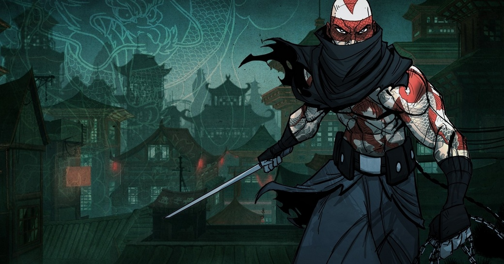

> _Retrospectiva săptămânii_ este rubrica duminicală în care trecem în revistă evenimentele săptămânii de pe frontul de gaming: știri şi articole (scrise de alții, bineînțeles, că e mai ușor aşa), industrie, lansări, oferte de jocuri, toate numai de savurat la cafeaua de duminică dimineața. (Și la care oricine poate contribui. ^[Dacă ai citit vreun articol sau vreo știre interesantă și crezi că merită inclusă în retrospectiva săptămânii, te așteptăm cu recomandarea ta pe forum, pe unul din topicurile dedicate: [Știri](https://forum.candaparerevista.ro/viewtopic.php?f=4&t=46), [Articole](https://forum.candaparerevista.ro/viewtopic.php?f=4&t=206), [Gaming România](https://forum.candaparerevista.ro/viewtopic.php?f=4&t=1622)] )

## Ştiri
* Pe 11 octombrie a murit Greg Stafford, creatorul lumii fantasy Glorantha și unul dintre designerii lui **King of Dragon Pass**, care se petrece în Glorantha. ([Site Chaosium](https://www.chaosium.com/blogvale-greg-stafford-1948-2018))
* Telltale Games au ajuns la o înțelegere cu Skybound Games pentru a termina ultimele episoade din **The Walking Dead: The Final Season**, foarte probabil folosind foști angajați de la Telltale. Skybound Games este compania lui Robert Kirkman, unul dintre co-creatorii benzilor desenate The Walking Dead, care a și [discutat despre subiect](https://variety.com/2018/gaming/news/skybound-telltale-the-walking-dead-2-1202973863/) cu Variety. (thx @joonior_bmf) ([Variety](https://variety.com/2018/gaming/news/skybound-telltale-the-walking-dead-1202971245/), [VentureBeat](https://venturebeat.com/2018/10/06/robert-kirkman-confirms-skybound-will-finish-telltales-the-walking-dead-the-final-season/))
* Se pare (aflăm _pe surse_) că Microsoft cumpără Obsidian Entertainment. ([Kotaku](https://kotaku.com/sources-microsoft-is-close-to-buying-obsidian-1829614135), [GamesIndustry.biz](https://www.gamesindustry.biz/articles/2018-10-09-microsoft-in-talks-to-buy-obsidian-report), [Games Informer](https://www.gameinformer.com/report/2018/10/09/report-microsoft-could-buy-pillars-of-eternity-creators-obsidian))
* Tot Microsoft anunță propriul proiect de cloud gaming, denumit Project xCloud, testele urmând a începe anul viitor. ([VentureBeat](https://venturebeat.com/2018/10/08/microsofts-project-xcloud/), [PCGamesInsider.biz](https://www.pcgamesinsider.biz/news/67904/microsoft-announces-cloud-gaming-initative-project-xcloud/), [Games Informer](https://www.gameinformer.com/2018/10/08/microsoft-announces-project-xcloud-game-streaming-initiative))
* Sony permite în sfârșit schimbarea username-urilor de pe PlayStation Network. ([GamesIndustry.biz](https://www.gamesindustry.biz/articles/2018-10-10-sony-confirms-psn-name-change-feature))
* Mojang publică o parte din codul sursă (câteva librării) pentru Minecraft. ([Minecraft.net](https://minecraft.net/en-us/article/programmers-play-minecrafts-inner-workings), [Gamasutra](http://www.gamasutra.com/view/news/328366/Mojang_is_making_some_Minecraft_libraries_open_source.php))
* Epic achiziționează Kamu, compania din spatele serviciului Easy Anti-cheat, sperând să îmbunătățească astfel experiența din **Fortnite**. ([Gamespot](https://www.gamespot.com/articles/fortnite-dev-purchases-anti-cheat-company/1100-6462364/))
* Agenția europeană EACEA (Education, Audiovisual and Culture Executive Agency) a publicat o listă de 30 de studiouri cărora le va oferi finanțare în 2019 pentru dezvoltarea de jocuri noi. Printre acestea se numără și **Trine 4**. ([Eurogamer](https://www.eurogamer.net/articles/2018-10-10-eu-funding-document-reveals-30-unannounced-games-from-high-profile-indie-devs))
* EA se pregătește de un remaster pentru vechile jocuri Command & Conquer și cere părerea fanilor. ([Games Informer](https://www.gameinformer.com/2018/10/11/ea-looking-for-feedback-on-command-conquer-remaster-and-the-series-future-on-pc), [PCGamesN](https://www.pcgamesn.com/command-and-conquer-remastered), [Destructoid](https://www.destructoid.com/ea-s-planning-to-remaster-some-classic-command-conquer-games-on-pc-526719.phtml))

## Articole (critică, dev, design)
* [Kick the cover box](https://www.blog.radiator.debacle.us/2018/10/kick-cover-box.html) (Radiator Blog)
* [History in Color](https://unwinnable.com/2018/10/11/history-in-color/) (Unwinnable)
* [The Nukes of &#39;Fallout 76&#39; Are Where Power Fantasies Hit a Breaking Point](https://waypoint.vice.com/en_us/article/7x3qjz/fallout-76-nukes-bad-nuclear-weapons) (Waypoint)
* [Taking A Realistic View On Porting Games To Nintendo's Switch](https://www.forbes.com/sites/kevinmurnane/2018/03/14/taking-a-realistic-view-on-porting-games-to-nintendos-switch) (Forbes)
* [Games aren&#8217;t power fantasies. They&#8217;re reality repairers](https://venturebeat.com/2018/10/10/games-arent-power-fantasies-theyre-reality-repairers/) (VentureBeat)
* [Traps, treasure and ancient tomb raiders](https://www.eurogamer.net/articles/2018-10-13-traps-treasure-and-ancient-tomb-raiders) (Eurogamer)

### _Not-a-review_
* (Grand Theft Auto) [Grand Theft Auto IV Remains The Most Important GTA](https://www.gameinformer.com/the-virtual-life/2018/10/10/grand-theft-auto-iv-remains-the-most-important-gta) (Games Informer)
* (Worms: Armageddon) [Appreciating annelid annihilation in Worms: Armageddon](https://www.gamesindustry.biz/articles/2018-10-09-an-appreciation-of-annelid-annihilation) (GamesIndustry.biz)
* (Resident Evil 2) [How one retooled enemy highlights everything the Resident Evil 2 remake is doing right](https://www.eurogamer.net/articles/2018-10-08-how-one-retooled-enemy-highlights-everything-the-resident-evil-2-remake-is-doing-right) (Eurogamer)
* (Assassin's Creed) [Ubisoft Shouldn&#039;t Forget Traditional Assassin&#039;s Creed Fans](https://www.usgamer.net/articles/ubisoft-shouldnt-forget-traditional-assassins-creed-fans) (USgamer)
* (Assassin’s Creed) [Don&#8217;t forget about Bayek when you&#8217;re kissing Kassandra&#8217;s feet](https://www.rockpapershotgun.com/2018/10/12/dont-forget-about-bayek-when-youre-kissing-kassandras-feet/) (RPS)
* (Dead Space) [Dead Space proved that in horror games, bigger isn’t always better](https://www.polygon.com/2018/10/13/17959976/dead-space-10-years-later-franchise-sequels) (Polygon)

### Industrie
* [G2A: No longer the most hated company in games? ](https://www.pcgamesinsider.biz/interviews-and-opinion/67902/g2a-no-longer-the-most-hated-company-in-games/) (PCGamesInsider.biz)
* [In 2018, VR stopped &#8220;having potential&#8221; and started being real](https://venturebeat.com/2018/10/09/in-2018-vr-stopped-having-potential-and-started-being-real/) (VentureBeat)
* [What's up with Sega's retro strategy?](https://www.gamesindustry.biz/articles/2018-10-08-whats-up-with-segas-retro-strategy) (GamesIndustry.biz)
* [Project xCloud: can Microsoft make a streaming platform that works?](https://www.eurogamer.net/articles/digitalfoundry-2018-project-xcloud-can-microsoft-make-a-streaming-platform-that-works) plus [Google and Xbox just started the next platform war](https://www.eurogamer.net/articles/2018-10-11-google-and-xbox-just-started-the-next-platform-war) (Eurogamer)

### Istorie
* [The Lost Files of Sherlock Holmes](https://www.filfre.net/2018/10/the-lost-files-of-sherlock-holmes/) (The Digital Antiquarian)
* [20 years of Level-5](https://www.eurogamer.net/articles/2018-10-07-20-years-of-level-5) (Eurogamer)
* [The Game Archaeologist: The Death of City of Heroes](https://massivelyop.com/2018/10/13/the-game-archaeologist-the-death-of-city-of-heroes/) (Massively OP)

### Dev, making of
* [Making cars and writing code:  Production Line 's refreshing dev approach](http://www.gamasutra.com/view/news/327880/Making_cars_and_writing_code_Production_Lines_refreshing_dev_approach.php) (Gamasutra)
* [Making Insomniac's  Spider-Man  do what a spider can](http://www.gamasutra.com/view/news/327708/Making_Insomniacs_SpiderMan_do_what_a_spider_can.php) (Gamasutra)
* [The pain of designing Path of Exile’s exquisite balance of restriction and reward](https://www.rockpapershotgun.com/2018/10/10/the-pain-of-designing-path-of-exiles-exquisite-balance-of-restriction-and-reward/) (RPS)

### Design, world-building
* [A Brutal Interior | Fugue in Void](http://www.heterotopiaszine.com/2018/10/11/brutal-interior-fugue-void/) (Heterotopias)
* [The best places to live in video games](https://www.eurogamer.net/articles/2018-10-12-the-best-places-to-live-in-video-games) (Eurogamer)
* [Let&#8217;s Place: The Forest With No Trees](http://www.haywiremag.com/columns/lets-place-the-forest-with-no-trees/) (Haywire Magazine)
* (Poze frumoase) [The Art Of The Banner Saga 3](https://kotaku.com/the-art-of-the-banner-saga-3-1829668727) (Kotaku)

## Made în România
* [Românul care salvează calculatoarele de la uitare și le face piese de muzeu](https://playtech.ro/2018/roman-muzeu-calculatoare-retroit/) (Playtech)
* Liviu Boar de la studioul Stuck In Attic (**Gibbous - A Cthulhu Adventure**) scrie câteva impresii despre Dev.Play 2018 ([Facebook RGDA](https://www.facebook.com/groups/THERGDA/permalink/1249616248510248/))

## Anunţuri şi lansări de jocuri
### Anunţate
* **EverQuest II: Chaos Descending**, al 15-lea expansion al bătrânului MMO lansat în 2004 ([VentureBeat](https://venturebeat.com/2018/10/09/everquest-iis-chaos-descending-expansion-launches-november-13/))
* **Observation**, un sci-fi thriller de la creatorii lui **Stories Untold** ([Games Informer](https://www.gameinformer.com/2018/10/09/stories-untold-developer-reveals-new-game-observation))
* **Project Warlock** un retro-FPS în stilul lui Duke Nukem 3D ([PCGamesN](https://www.pcgamesn.com/project-warlock/project-warlock-release-date), [gog.com](https://www.gog.com/news/coming_soon_project_warlock))
* **Creaks**, următorul adventure al celor de la Amanita ([PCGamesN](https://www.pcgamesn.com/creaks/creaks-amanita-designs-trailer), [Eurogamer](https://www.eurogamer.net/articles/2018-10-09-samorost-and-chuchel-developers-next-game-is-a-surreal-platform-adventure-creaks))

### Acum cu dată de lansare
* **RimWorld** iese din Early Access pe 17 octombrie ([site oficial](https://ludeon.com/blog/2018/10/rimworld-1-0-will-be-released-october-17/), [PCGamesN](https://www.pcgamesn.com/rimworld/rimworld-leaves-early-access-announcement), [Eurogamer](https://www.eurogamer.net/articles/2018-10-08-rimworld-full-release-date-announced))
* **Return Of The Obra Dinn**: 18 octombrie ([Games Informer](https://www.gameinformer.com/2018/10/10/return-of-the-obra-dinn-gets-release-date))
* **Crusader Kings 2: Holy Fury**: 13 noiembrie ([YouTube Paradox](https://www.youtube.com/watch?v=5WPTuvrUnEI))
* **Steel Rats**: 7 noiembrie ([VG247](https://www.vg247.com/2018/10/05/steel-rats-november-release-date-pc-ps4-xbox-one/))

### Lansate
* 9 octombrie: **Mark of the Ninja Remastered** ([Steam](https://store.steampowered.com/app/860950/Mark_of_the_Ninja_Remastered/))
* 9 octombrie: **Space Hulks: Tactics** ([Steam](https://store.steampowered.com/app/492230/Space_Hulk_Tactics/))
* 9 octombrie: **My Memory of Us** ([Steam](https://store.steampowered.com/app/651500/My_Memory_of_Us/), [gog.com](https://www.gog.com/game/my_memory_of_us))
* 10 octombrie: **MapleStory 2** ([Steam](https://store.steampowered.com/app/560380/MapleStory_2/))
* 10 octombrie: **Capcom Beat 'Em Up Bundle** ([Steam](https://store.steampowered.com/app/885150/Capcom_Beat_Em_Up_Bundle/))
* 11 octombrie: **The MISSING: J.J. Macfield and the Island of Memories** ([Steam](https://store.steampowered.com/app/842910/The_MISSING_JJ_Macfield_and_the_Island_of_Memories/))
* 12 octombrie: **Call of Duty: Black Ops 4** ([Humble Store](https://www.humblebundle.com/store/call-of-duty-black-ops-4), [Battle.net](https://eu.shop.battle.net/en-us/product/call-of-duty-black-ops-4))

## Oferte jocuri
* [Weekend PC Download Deals for 10 / 12: GOG.com Disney Week and more](https://www.shacknews.com/article/107879/weekend-pc-download-deals-for-10-12-gogcom-disney-week-and-more) (ShackNews)
* **Metal Gear Solid 2** și **3** sunt acum disponibile pe Xbox One Backward Compatibility ([Blog "Major Nelson"](https://majornelson.com/blog/xbox-one-backward-compatibility/))
* **Burnout Paradise Remastered** [e disponibil prin Origin Access](https://www.usgamer.net/articles/burnout-paradise-remastered-is-available-now-on-ea-access-origin) (USgamer)

## Recomandarea săptămânii: _Mark of the Ninja_

Cu ocazia portării pe Nintendo Switch, cei de la Klei au scos și o versiune revizuită a acestui indie gem, versiune care se laudă cu suport pentru 4K și o grafică mai șlefuită. Pentru cei care nu au auzit de el până acum, **Mark of the Ninja** este un action side scroller care integrează cu măiestrie mecanici aparținând genului stealth. Cei care au deja jocul original pot obține upgrade-ul la noua versiune pentru 3,99 euro.

Deocamdată versiunea remastered se poate obține doar pe [Steam](https://store.steampowered.com/app/860950/Mark_of_the_Ninja_Remastered/) și pe [Nintendo Store](https://www.nintendo.com/games/detail/mark-of-the-ninja-remastered-switch), în timp ce [pe GOG se găsește varianta veche](https://www.gog.com/game/mark_of_the_ninja_special_edition).
