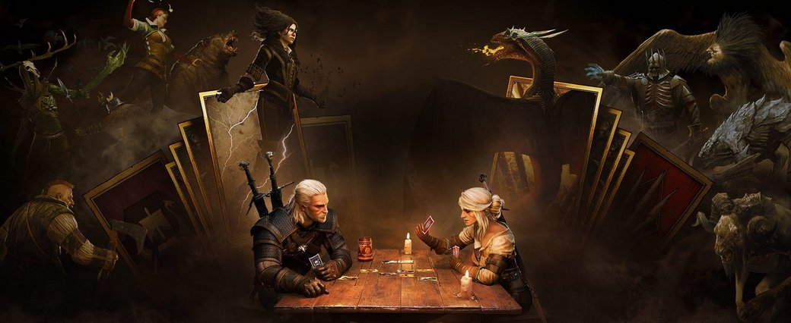

> _Retrospectiva săptămânii_ este rubrica duminicală în care trecem în revistă evenimentele săptămânii de pe frontul de gaming: știri şi articole (scrise de alții, bineînțeles, că e mai ușor aşa), industrie, lansări, oferte de jocuri, toate numai de savurat la cafeaua de duminică dimineața. (Și la care oricine poate contribui. ^[Dacă ai citit vreun articol sau vreo știre interesantă, sau ai o recomandare de joc, și crezi că merită incluse în retrospectiva săptămânii, te așteptăm pe forum pe unul dintre topicurile dedicate: [Știri](https://forum.candaparerevista.ro/viewtopic.php?f=4&t=46), [Articole](https://forum.candaparerevista.ro/viewtopic.php?f=4&t=206), [Gaming România](https://forum.candaparerevista.ro/viewtopic.php?f=4&t=1622), [Recomandarea Săptămânii](https://forum.candaparerevista.ro/viewtopic.php?f=84&t=1957)])

## Ştiri
* Intellivision lucrează la o nouă consolă, orientată spre segmentul casual/family (și mai puțin spre gamerii hardcore). ([Games Informer](https://www.gameinformer.com/2018/10/22/intellivision-is-making-a-new-family-friendly-console), [GamesIndustry.biz](https://www.gamesindustry.biz/articles/2018-10-23-intellivision-joins-the-retro-console-arms-race), [Gamereactor](https://www.gamereactor.eu/news/702923/))
* GOG publică un nou tweet încercând să facă o glumă, niște oameni s-au supărat, s-a născut o controversă, GOG și-a cerut scuze și a șters tweet-ul ([Eurogamer](https://www.eurogamer.net/articles/2018-10-23-gog-facing-twitter-backlash-again-after-insensitive-wontbeerased-tweet), [USgamer](https://www.usgamer.net/articles/gog-says-it-will-focus-only-on-games-after-another-social-media-faux-pas)). „Clasic” GOG, dar apar și consecințe. ([Eurogamer](https://www.eurogamer.net/articles/2018-10-24-journeyquest-maker-cancels-contract-with-gog-over-transphobic-tweets), [Lulz.com](https://lulz.com/cyberpunk-2077-doxed-harassed-hashtag-wontbeerased-1513/)) 
* Dacă exista vreun dubiu, aflați că Epic Games o duce bine de tot. O nouă rundă de finanțare a adus companiei o infuzie de capital de 1,25 miliarde de dolari, proces în care compania a fost reevaluată la aproape 50 de miliarde de dolari. ([Shacknews](https://www.shacknews.com/article/108157/fortnite-and-ue4-creator-epic-games-valued-at-close-to-15-billion), [Gamasutra](http://www.gamasutra.com/view/news/329467/Epic_Games_secures_125_billion_from_multiple_investors.php))
* Steam a depășit cifra de 90 de milioane de utilizatori activi lunar, cu 23 de milioane mai mult decât acum un an. ([PCGamesN](https://www.pcgamesn.com/steam-player-count), [GamesIndustry.biz](https://www.gamesindustry.biz/articles/2018-10-24-steam-reaches-90m-monthly-active-users))
* Și încă o știre despre Steam: după ce China a oprit și ultimele căi de a obține licențe pentru lansarea de jocuri noi, Steam a rămas singura modalitate de a publica jocuri noi în China, aflându-se într-o zonă încă neacoperită legislativ.  ([PCGamesInsider.biz](https://www.pcgamesinsider.biz/news/68007/chinese-developers-are-increasingly-turning-to-steam-to-bypass-restrictions/), [VentureBeat](https://venturebeat.com/2018/10/24/china-steam-gray-market/))
* Jade Raymond pleacă de la Electronic Arts. ([Gamasutra](http://www.gamasutra.com/view/news/329114/EA_Motive_founder_Jade_Raymond_departs_EA.php), [Destructoid](https://www.destructoid.com/jade-raymond-exits-ea-and-motive-upcoming-projects-continue-unchanged--528068.phtml))
* Trion Worlds, studioul care a dezvoltat Rift, Defiance, ArcheAge sau Trove, a fost cumpărat de Gamigo, ocazie cu care a concediat majoritatea angajaților, aproape 200. ([PC Gamer](https://www.pcgamer.com/trion-worlds-lays-off-staff-following-buyout/), [Gamasutra](http://www.gamasutra.com/view/news/329284/Gamigo_confirms_acquisition_of_Trion_Worlds.php), [GamesIndustry.biz](https://www.gamesindustry.biz/articles/2018-10-22-trion-worlds-lays-off-staff-report))
* **Shadow of the Tomb Raider** a fost lovit de un val de review-uri negative pe Steam pentru simplul motiv că primit o promoție cu o reducere substanțială la scurt timp de la lansare.  ([Games Informer](https://www.gameinformer.com/2018/10/21/shadow-of-the-tomb-raider-bombed-with-negative-reviews-for-sale-price), [PC Gamer](https://www.pcgamer.com/shadow-of-the-tomb-raider-review-bombed-because-of-34-discount/), [Shacknews](https://www.shacknews.com/article/108066/steam-users-review-bombed-shadow-of-the-tomb-raider-because-of-recent-sale))

## Articole (critică, dev, design)
* [The Case for Videogames as Powerful Tools for Learning](http://gamasutra.com/blogs/AntonioTorres/20181022/329008/The_Case_for_Videogames_as_Powerful_Tools_for_Learning.php) (Gamasutra)
* [How GIFs Have Changed Gaming](https://www.usgamer.net/articles/how-gifs-have-changed-gaming-rain-world-what-the-golf-consume-me-indie) (USgamer)
* [Early Access Means Nothing Anymore](https://kotaku.com/early-access-means-nothing-anymore-1830026799/) (Kotaku)
* [Playing videogames: a rambling essay about hating what you love](http://www.gamasutra.com/blogs/KeithBurgun/20181025/329292/Playing_videogames_a_rambling_essay_about_hating_what_you_love.php) (Gamasutra)
* [Sequelitis: Continuing Endings](https://gamasutra.com/blogs/GregoryPellechi/20181026/329430/Sequelitis_Continuing_Endings.php) (Gamasutra)
* [From Piracy to Billions — How Poland Became a Video Games Nation](http://www.kotaku.co.uk/2018/10/26/from-piracy-to-billions-how-poland-became-a-video-games-nation) (Kotaku)

### Despre Rockstar și crunch
* [Red Dead Redemption 2 devs say you should speak out on crunch, but don&#8217;t boycott the game](https://www.pcgamesn.com/red-dead-redemption-2/red-dead-redemption-2-boycott) (PCGamesN)
* [Inside Rockstar Games&#39; Culture Of Crunch](https://kotaku.com/inside-rockstar-games-culture-of-crunch-1829936466/) (Kotaku) - TL;DR pe [USgamer](https://www.usgamer.net/articles/massive-new-report-on-rockstar-games-details-red-dead-redemption-2-crunch-culture-of-fear)
* [How can we be gamers in an industry that is hurting its developers?](https://www.pcgamesn.com/rockstar-crunch) (PCGamesN)
* [Some Red Dead devs feel that crunch is mandatory, but Rockstar disagrees](https://venturebeat.com/2018/10/25/rockstar-red-dead-redemption-crunch/) (VentureBeat)
* [The human cost of Red Dead Redemption 2](https://www.eurogamer.net/articles/2018-10-25-the-human-cost-of-red-dead-redemption-2) (Eurogamer)
* [Red Dead Redemption 2’s labor controversy, explained](https://www.polygon.com/2018/10/27/18029154/red-dead-redemption-2-working-conditions-rockstar-games-overtime-labor) (Polygon)
* [Game Developers Give Advice On How To Make Their Industry a Better Place](https://waypoint.vice.com/en_us/article/kzjvm9/game-developers-give-advice-on-how-to-make-their-industry-a-better-place) (Waypoint)

### _Not-a-review_
* (Forza Horizon 4) [Driving the uncanny valley: Forza Horizon 4 is befuddlingly British](https://www.rockpapershotgun.com/2018/10/23/forza-horizon-4-british) (RPS)
* (Red Dead Redemption 2) [Red Dead Redemption 2&#039;s Gruesome Hunting Isn&#039;t for Those With Weak Stomachs](https://www.usgamer.net/articles/red-dead-redemption-2s-gruesome-hunting-isnt-for-those-with-weak-stomachs) (USgamer)
* (Warframe) [How a struggling artist escaped poverty by designing a Warframe scarf](https://www.pcgamer.com/how-a-struggling-artist-escaped-poverty-by-designing-a-warframe-scarf/) (PC Gamer)
* (Return of the Obra Dinn) [Return of the Obra Dinn&#039;s Mysteries Are So Deep That You Need an Actual Pen and Paper to Solve Them](https://www.usgamer.net/articles/return-of-the-obra-dinn-lucas-pope-ghost-ship-mystery-pen-paper) (USgamer)
* (Rain World) [The Myth of Difficulty](https://unwinnable.com/2018/10/25/the-myth-of-difficulty/) (Unwinnable)

### Industrie
* [Crunch, work-life balance, and  Assassin's Creed Odyssey : A view from the top](http://gamasutra.com/view/news/329130/Crunch_worklife_balance_and_Assassins_Creed_Odyssey_A_view_from_the_top.php) (Gamasutra)
* [The legal status of loot boxes around the world, and what's next in the debate](https://www.pcgamer.com/the-legal-status-of-loot-boxes-around-the-world-and-whats-next/) (PC Gamer)
* [&quot;It Was Easier To Do It Than To Not&quot; — Making The Most of The Stanley Parable's Legacy](http://www.kotaku.co.uk/2018/10/24/it-was-easier-to-do-it-than-to-not-making-the-most-of-the-stanley-parables-legacy) (Kotaku)
* [&quot;Don't give into fear and keep adding more features&quot; - How not to overwork your employees](https://www.gamesindustry.biz/articles/2018-10-23-dont-give-into-fear-and-keep-adding-more-features-how-not-to-overwork-your-employees) (GamesIndustry.biz)

### Istorie, retrospectivă
* Far Cry 2 aniversează 10 ani:
  * [Far Cry 2's daring open world design is still paying off 10 years later](https://www.pcgamer.com/far-cry-2s-daring-open-world-design-is-still-paying-off-10-years-later/) (PC Gamer)
  * [Far Cry 2 was way ahead of its time](https://www.polygon.com/2018/10/21/17989842/far-cry-2-survival-open-world-npc-permadeath) (Polygon)
* [Atari Asteroids: Creating a Vector Arcade Classic](https://arcadeblogger.com/2018/10/24/atari-asteroids-creating-a-vector-arcade-classic/) (Arcade Blogger)
* [Remembering the Excellence of Ghostbusters 2009](https://www.gamasutra.com/blogs/JoshBycer/20181026/329407/Remembering_the_Excellence_of_Ghostbusters_2009.php) (Gamasutra)
* [Quest for Glory III and IV](https://www.filfre.net/2018/10/quest-for-glory-iii-and-iv/) (The Digital Antiquarian)
* [Why Red Dead Redemption is the greatest Western ever made](https://www.polygon.com/red-dead-redemption/2018/10/23/17986758/red-dead-redemption-best-western-game) și alte articole dedicate [primului Red Dead Redemption](https://www.polygon.com/2018/10/22/18008360/red-dead-redemption-2-release-western-issue-history-timeline-rockstar)
 (Polygon)
* [Unofficial Slogans for Famous Game Publishers](https://thehistoryofhowweplay.wordpress.com/2018/10/22/unofficial-slogans-for-famous-game-publishers/) (The History of How We Play)

### Dev, making of
* Despre **Red Dead Redemption 2**
  * [Red Dead Redemption 2: The inside story of the most lifelike video game ever"](https://www.gq-magazine.co.uk/article/red-dead-redemption-2-interview) (GQ Magazine)
  * [Red Dead Redemption 2 analysis: a once-in-a-generation technological achievement](https://www.eurogamer.net/articles/digitalfoundry-2018-red-dead-redemption-2-tech-analysis) (Eurogamer)
  * [Red Dead Redemption 2 - how advanced AI and physics create the most believable open world yet - VG247](https://www.vg247.com/2018/10/23/red-dead-redemption-2-physics-ai-euphoria-phil-hooker-interview/) (VG247)
  * [Get real! Behind the scenes of Red Dead Redemption 2 – the most realistic video game ever made](https://www.theguardian.com/games/2018/oct/24/get-real-behind-the-scenes-of-red-dead-redemption-2-the-most-realistic-video-game-ever-made) (The Guardian)
* [A Different Approach to Difficulty](http://www.gamasutra.com/blogs/AlexVu/20181023/329199/A_Different_Approach_to_Difficulty.php) (Gamasutra)
* [Level With Me, Thief 1 complete!](https://www.blog.radiator.debacle.us/2018/10/level-with-me-thief-1-complete.html) (Radiator Blog)

### Design, world-building
* [Those painted sculptures in Assassin’s Creed: Odyssey are true to history](https://arstechnica.com/gaming/2018/10/those-painted-sculptures-in-assassins-creed-odyssey-are-true-to-history/) (Ars Technica)
* [How brutalism has shaped games](https://www.eurogamer.net/articles/2018-10-23-how-brutalism-has-shaped-games) (Eurogamer)
* (Poze frumoase) [The Vermin Tide](https://kotaku.com/the-vermin-tide-1829955727/) (Kotaku)
* (Poze frumoase) [An Apple A Day...](https://kotaku.com/an-apple-a-day-1829986744/) (Kotaku)
* (Poze frumoase) [The Art Of Assassin&#39;s Creed Odyssey](https://kotaku.com/the-art-of-assassins-creed-odyssey-1829922386/) (Kotaku)

## Made în România
* Nicolae Berbece, fondatorul studioului Those Awesome Guys, vorbește cu GamesIndustry.biz despre **Move or Die**. ([GamesIndustry.biz](https://www.gamesindustry.biz/articles/2018-10-22-designing-with-marketing-in-mind-in-move-or-die))
* KillHouse Games sunt gazda ediției a 6-a a meetup-urilor din seria [DevKnights Connect](https://www.facebook.com/DevKnightsRO/), care va avea loc pe 1 noiembrie în București, și unde puteți juca și îi puteți întâlni pe oamenii din spatele unor jocuri precum **Door Kickers**, **Blink: Rogues**, **Ironbound**, **Eternium** sau **Grid Punk**. ([Facebook](https://www.facebook.com/events/1590385041106964))

## Anunţuri şi lansări de jocuri
### Anunţate
* **Hellgate: London** se relansează ([Eurogamer](https://www.eurogamer.net/articles/2018-10-24-hellgate-london-returns-to-steam))
* **Trine 4**: deși se știa că o să apară grație unui program de finanțare al UE, acum este anunțat oficial chiar de producătorii Frozenbyte ([Destructoid](https://www.destructoid.com/trine-4-announced-for-multiple-platforms-including-switch-528302.phtml), [Games Informer](https://www.gameinformer.com/2018/10/24/frozenbyte-confirms-trine-4-for-pc-and-consoles), [PC Gamer](https://www.pcgamer.com/trine-4-the-nightmare-prince-is-coming-next-year/))
* **Swords and Soldiers II: Shawarmageddon** ([Destructoid](https://www.destructoid.com/swords-and-soldiers-2-shawarmageddon-is-out-next-month-on-pc-ps4-switch-coming-later--528298.phtml), [PC Gamer](https://www.pcgamer.com/amp/swords-and-soldiers-2-shawarmageddon-multiplayer-beta-is-live-and-open-to-everyone/))
* **Layers of Fear 2** ([PC Gamer](https://www.pcgamer.com/layers-of-fear-2-revealed-set-to-come-out-next-year/), [Eurogamer](https://www.eurogamer.net/articles/2018-10-25-bloober-team-unveils-its-silver-screen-themed-layers-of-fear-2))
* **Ancient Enemy** ([PC Gamer](https://www.pcgamer.com/shadowhand-dev-unveils-turn-based-card-battler-ancient-enemy/))
* **Sky Tracers** ([PC Gamer](https://www.pcgamer.com/sky-tracers-is-a-multiplayer-successor-to-parkour-platformer-super-cloudbuilt/))
* **Ode to a Moon** un survival horror cu estetică inspirată din casetele VHS ([PCGamesN](https://www.pcgamesn.com/ode-to-a-moon/new-games-ode-to-a-moon-announcement-trailer))

### Acum cu dată de lansare
* **Jump Force**: 15 februarie 2019 ([VentureBeat](https://venturebeat.com/2018/10/25/jump-force-unleashes-its-manga-fighting-action-on-february-15/))

### Amânate
* **Team Sonic Racing**: 21 mai 2019, în loc de iarna 2018 ([USgamer](https://www.usgamer.net/articles/team-sonic-racing-delayed-to-2019), [Eurogamer](https://www.eurogamer.net/articles/2018-10-25-team-sonic-racing-has-been-delayed-to-may-next-year))
* **Wargroove** prima parte a anului 2019 în loc de 2018 ([PCGamesN](https://www.pcgamesn.com/wargroove/wargroove-release-date-delayed))

### Lansate
* 19 octombrie: **World War 3** (Early Access) ([Steam](https://store.steampowered.com/app/674020/World_War_3/))
* 22 octombrie: **Exapunks** (iese din Early Access) ([Steam](https://store.steampowered.com/app/716490/EXAPUNKS/))
* 23 octombrie: **Thronebreaker: The Witcher Tales** ([gog.com](https://www.gog.com/game/thronebreaker_the_witcher_tales))
* 23 octombrie: **Gwent** a ieșit din open beta ([gog.com](https://www.gog.com/game/gwent_the_witcher_card_game))
* 23 octombrie: **Spintires: MudRunner - American Wilds Expansion** ([Steam](https://store.steampowered.com/app/891810/Spintires_MudRunner__American_Wilds_Expansion/))
* 24 octombrie: **The Bard's Tale II**  - al doilea episod din trilogia remasterizată **The Bard's Tale Trilogy** a fost [lansat ca update](https://steamcommunity.com/games/843260/announcements/detail/1699439264749269718) pentru cei ce au cumpărat trilogia ([Steam](https://store.steampowered.com/app/843260/The_Bards_Tale_Trilogy/))
* 24 octombrie: **Do Not Feed the Monkeys** ([Steam](https://store.steampowered.com/app/658850/Do_Not_Feed_the_Monkeys/))
* 24 octombrie: **Lethal League Blaze** ([Steam](https://store.steampowered.com/app/553310/Lethal_League_Blaze/))
* 25 octombrie: **Party Hard 2** ([Steam](https://store.steampowered.com/app/572430/Party_Hard_2/))
* 26 octombrie: **Red Dead Redemption 2** ([PlayStation Store](https://store.playstation.com/en-ro/product/EP1004-CUSA08519_00-RDR2PREORDBUND02), [Xbox Store](https://www.xbox.com/en-US/games/red-dead-redemption-2))
* 26 octombrie: **Pit Of Doom** (Early Access) ([Steam](https://store.steampowered.com/app/577410/Pit_of_Doom/))

## Prăvălii de jocuri
### Știri
* Microsoft va extinde Game Pass și pentru PC. Game Pass este un abonament de 10 euro pe lună care oferă deținătorilor de Xbox acces la peste 200 de jocuri. Încă nu știm sub ce formă va fi adaptat pentru PC. ([Game Informer](https://www.gameinformer.com/2018/10/24/microsoft-announces-plans-to-expand-game-pass-to-pc), [PCGamesN](https://www.pcgamesn.com/pc-game-pass), [PC Gamer](https://www.pcgamer.com/xbox-game-pass-pc/))

### Jocuri noi în catalog
* **Alan Wake** este din nou disponibil la vânzare, după ce fusese anterior retras din magazinele online din cauza problemelor de licențiere a muzicii ([PC Gamer](https://www.pcgamer.com/alan-wake-is-back-on-steam-and-its-on-sale-too/), [TechRaptor](https://techraptor.net/content/alan-wake-back-on-sale), [Steam](https://store.steampowered.com/app/108710/Alan_Wake/), [gog.com](https://www.gog.com/game/alan_wake))
* [Nitro Game Additions](https://blog.discordapp.com/nitro-game-additions-10-25-18-1e3a47dda4a8) (Discord Blog)
* [Check Out Origin Access New and Upcoming Games in the Vault](https://www.ea.com/origin-access-latest-updates) (Site EA)

### Reduceri și promoții
* [The best deals in Fanatical's Scream Sale ](https://www.pcgamer.com/the-best-deals-in-fanaticals-scream-sale/) (PC Gamer)
* [Origin's Halloween Sale has Battlefield 1 and the season pass for $5](https://www.pcgamer.com/origins-halloween-sale-has-battlefield-1-and-the-season-pass-for-dollar5/) (PC Gamer)
* [Weekend PC Download Deals for 10 / 26: Steam celebrates Japan](https://www.shacknews.com/article/108158/weekend-pc-download-deals-for-10-26-steam-celebrates-japan) (Shacknews)

## Recomandarea săptămânii: _Gwent_

**Gwent** este un joc de cărți cu mecanici foarte simple în aparență. Tot ce ai de făcut ca să câștigi e să ai pe masă la sfârșitul rundei cărți de valoare totală mai mare decât cele ale adversarului. Cei care au jucat **Witcher 3** știu deja asta și mai știu că lucrurile nu sunt chiar atât de simple. Ce s-ar putea să nu știe e că, până la capătul unui open beta de aproape doi ani, varianta stand alone a lui **Gwent** a trecut printr-o serie de schimbări radicale, oferind o experiență mult diferită și mai complexă decât minigame-ul din **Witcher 3**. Joaca de-a _introdusul de mecanici noi și rebalansarea celor vechi_ a ajuns atât de departe încât cei de la CD Projekt au tras buretele peste tot și au anunțat **Homecoming**, varianta finală ieșită din beta.

Atât amatorii de Gwent din **Witcher 3** cât și veteranii din open beta vor găsi în acest **Gwent: Homecoming** un joc nou, care trebuie învățat aproape de la zero. E probabil momentul cel mai interesant al unui joc de cărți online, când toată lumea se află relativ pe picior de egalitate și se experimentează din greu cu diferitele combinații de cărți. Ca participant în open beta m-am ales cu un număr suplimentar de resurse cu care mi-am putut crafta instant deckul dorit. Pe de altă parte, am remarcat ușurința cu care poți obține noi cărți și resurse - deci nou veniții nu ar trebui să dispere. În plus, jocul dispune încă din open beta de un sistem de matchmaking surprinzător de eficace. Foarte rar m-am găsit pus față în față cu o înfrângere zdrobitoare.

**Gwent** este disponibil gratuit, exclusiv pe GOG. Există și posibilitatea achiziționării unui starter pack sau a unor mici boostere și resurse, dar după cum spuneam, jocul în sine oferă resurse cu generozitate și nu există presiunea de a scoate bani din buzunar pentru a progresa.

Cei care preferă mai multă substanță unor meciuri cu străini online, pot opta să își cumpere în schimb **Thronebreaker: The Witcher Tales**, o campanie singleplayer bogată în poveste și roleplaying. (**Mahdi**)

* [**Gwent** pe GOG](https://www.gog.com/game/gwent_the_witcher_card_game)
* [**Thronebreaker: The Witcher Tales** pe GOG](https://www.gog.com/game/thronebreaker_the_witcher_tales)
* [Discuții pe forum](https://forum.candaparerevista.ro/viewtopic.php?f=47&t=1300)
