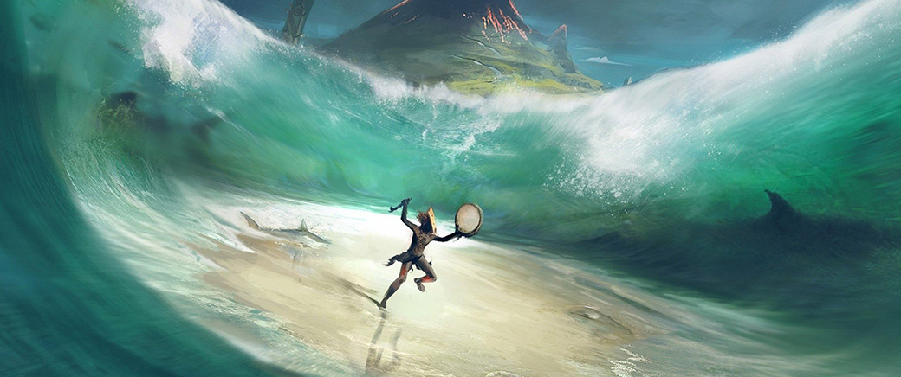

> _Retrospectiva săptămânii_ este rubrica duminicală în care trecem în revistă evenimentele săptămânii de pe frontul de gaming: știri şi articole (scrise de alții, bineînțeles, că e mai ușor aşa), industrie, lansări, oferte de jocuri, toate numai de savurat la cafeaua de duminică dimineața. (Și la care oricine poate contribui. ^[Dacă ai citit vreun articol sau vreo știre interesantă, sau ai o recomandare de joc, și crezi că merită incluse în retrospectiva săptămânii, te așteptăm pe forum pe unul dintre topicurile dedicate: [Știri](https://forum.candaparerevista.ro/viewtopic.php?f=4&t=46), [Articole](https://forum.candaparerevista.ro/viewtopic.php?f=4&t=206), [Gaming România](https://forum.candaparerevista.ro/viewtopic.php?f=4&t=1622), [Recomandarea Săptămânii](https://forum.candaparerevista.ro/viewtopic.php?f=84&t=1957)])

## Ştiri

* **Red Dead Redemption 2** a adus în primele 3 zile încasări de peste 725 de milioane de dolari. Asta îl plasează pe locul doi în topul lansărilor entertainment din toate timpurile, după **GTA V**. ([Eurogamer](https://www.eurogamer.net/articles/2018-10-30-rockstar-trumpets-USD725m-red-dead-redemption-2-sales), [USgamer](https://www.usgamer.net/articles/red-dead-redemption-2-second-highest-grossing-entertainment-launch-of-all-time-behind-gta-5))
* EA anunță Project Atlas, o platformă care integrează soluții de gamedev, engines, AI și servicii în cloud. Nu am înțeles nimic, dar EA pare să ia foarte în serios acest proiect, peste 1000 de angajați fiind implicați în dezvoltarea lui în acest moment. ([USgamer](https://www.usgamer.net/articles/ea-announces-new-cloud-gaming-service-that-is-as-confusing-as-it-is-exciting), [PC Gamer](https://www.pcgamer.com/ea-reveals-project-atlas-a-game-platform-built-on-ai-and-cloud-computing/), [Gamasutra](http://www.gamasutra.com/view/news/329595/EA_reveals_Project_Atlas_a_new_game_dev_platform_in_the_cloud.php))
* Ubisoft vrea să facă un serial TV după **Child of Light** și un film după **Werewolves Within**. ([Games Informer](https://www.gameinformer.com/2018/10/30/ubisoft-adapting-child-of-light-and-werewolves-within-for-tv-and-film), [Variety](https://variety.com/2018/gaming/news/child-of-light-werewolves-within-adaptations-1203015197/))
* Microsoft ne arată un concept de gamepad pentru mobile. ([Destructoid](https://www.destructoid.com/images-of-prototype-mobile-xbox-controllers-surface-528963.phtml), [Eurogamer](https://www.eurogamer.net/articles/2018-10-29-here-are-microsofts-concepts-for-a-smartphone-controller))
* S-a lansat în open beta [Kartridge](https://www.kartridge.com/), magazinul digital al celor de la Kongregate.  ([PC Gamer](https://www.pcgamer.com/kongregates-digital-storefront-kartridge-is-now-open-for-everyone/), [Gamasutra](http://www.gamasutra.com/view/news/329836/Kartridge_Kongregates_game_platform_with_generous_rev_share_launches_in_open_beta.php))
* Site-ul Trusted Reviews a pierdut 1 milion de lire sterline în urma unei înțelegeri cu Rockstar, după ce a dat publicității la începutul anului date confidențiale despre **Red Dead Redemption 2**. Suma a fost plătită unei organizații de caritate aleasă de Rockstar. ([Eurogamer](https://www.eurogamer.net/articles/2018-11-01-website-pulls-red-dead-redemption-2-leak-story-gives-1m-settlement-fee-to-charity), [Kotaku](https://kotaku.com/british-website-forced-to-pay-1-3-million-over-red-dea-1830154729/), [Kotaku](https://kotaku.com/why-reporting-a-red-dead-redemption-2-leak-cost-a-briti-1830181110/))
* Ubisoft cenzurează conținutul din **Rainbow 6 Siege** înainte de lansarea pe piețele asiatice. ([Eurogamer](https://www.eurogamer.net/articles/2018-11-02-ubisoft-is-removing-blood-gambling-and-sex-references-from-rainbow-6-siege-and-fans-arent-happy), [Kotaku](https://kotaku.com/rainbow-6-siege-will-remove-sex-and-gambling-references-1830200085), [Polygon](https://www.polygon.com/2018/11/3/18058884/rainbow-six-siege-censored-china-pc-ps4-xbox-one-ubisoft))
* Vineri și sâmbătă s-a desfășurat BlizzCon 2019. Printre noutățile anunțate se numără o versiune remasterizată a **Warcraft III** și un nou titlu **Diablo**, dar pentru mobile ([Polygon](https://www.polygon.com/2018/11/2/18057054/blizzcon-2018-opening-ceremony-trailers-announcements), [Ars Technica](https://arstechnica.com/gaming/2018/11/diablo-immortal-on-phones-warcraft-3-reforged-top-blizzcons-announcements/), [Destructoid](https://www.destructoid.com/everything-that-happened-at-the-blizzcon-2018-opening-ceremony-keynote-529680.phtml)). Acest din urmă anunț, prezentat la sfârșitul ceremoniei de deschidere și perceput drept principalul punct de atracție, a atras însă numeroase reacții negative din partea fanilor ([Eurogamer] (https://www.eurogamer.net/articles/2018-11-03-blizzard-faces-backlash-after-blizzcon-diablo-mobile-announcement), [PC Gamer](https://www.pcgamer.com/blizzard-faces-huge-backlash-for-diablo-mobile-game-fans-call-it-a-slap-in-the-face/), [Tech Raptor](https://techraptor.net/content/diablo-immortal-dontinquire)), cărora Blizzard le răspunde că n-au de ce să-și facă griji ([Polygon](https://www.polygon.com/blizzcon/2018/11/3/18059222/diablo-immortal-blizzard-response-blizzcon)).

## Articole (critică, dev, design)

* [Why Zombies Work As Effective Enemies](https://techraptor.net/content/zombies-effective-enemies-gaming) (TechRaptor)
* [Red Dead Redemption 2 was created by an industry in dire need of reform](https://www.theguardian.com/games/2018/nov/01/red-dead-redemption-2-games-developers-welfare) (The Guardian)
* [The Power of Personality in Games](https://www.gamasutra.com/blogs/CalebCompton/20181029/329538/The_Power_of_Personality_in_Games.php) (Gamasutra)
* [The dark, ironic, surreal games of Central and Eastern Europe](https://www.gamesindustry.biz/articles/2018-10-29-dark-ironic-surreal-game-aesthetics-of-the-post-ussr-block) (GamesIndustry.biz)
* [Back from the dead: The people keeping old MMOs alive](https://www.gamesindustry.biz/articles/2018-11-02-the-people-keeping-old-mmos-alive) (GamesIndustry.biz)
* [Poker Night At The Inventory Is An Awkward Time Capsule](https://kotaku.com/poker-night-at-the-inventory-is-an-awkward-time-capsule-1830191319) (Kotaku)
* O serie de articole de la autori diverși despre viitorul jocurilor: [The future of gaming: How video game data, diversity, collaboration, and culture will evolve](https://qz.com/is/what-happens-next-2/1438720/future-of-gaming/) (Quartz)
* * Capsule Crit, care publică periodic o colecţie de eseuri despre jocuri, au publicat [ediţia cu numărul 4](https://www.capsulecrit.com/intro04), în care puteţi citi materiale, printre altele, despre **Red Dead Redemption 2** sau **Stardew Valley**.

### _Not-a-review_
* (Red Dead Redemption 2)
  * [Why is Red Dead Redemption 2 Still Using Rockstar&#039;s Ancient Control Scheme?](https://www.usgamer.net/articles/red-dead-redemption-2-controls-bad-good-horrible-or-immersive) (USgamer)
  * [Red Dead Redemption 2 Defiantly Bucks Open-World Trends](https://kotaku.com/red-dead-redemption-2-defiantly-bucks-open-world-trends-1830101610/) (Kotaku)
  * [&#x27;Red Dead Redemption 2&#x27; Reaches for Magic on the Shoulders of Indie Games](https://www.wired.com/story/red-dead-redemption-2-review/) (Wired)
* (Thief) [Dark Narrative: Thief's Special Kind of Horror](https://techraptor.net/content/dark-narrative-thiefs-special-kind-of-horror) (TechRaptor)
* (Spore) [I still wish Spore was good, but a decade later it's a slog](https://www.pcgamer.com/i-still-wish-spore-was-good-but-a-decade-later-its-a-slog/) (PC Gamer)
* (Tetris) [Study: Tetris is a great distraction for easing an anxious mind](https://arstechnica.com/science/2018/11/study-tetris-is-a-great-distraction-for-easing-an-anxious-mind/) (Ars Technica)
* (Assassin’s Creed Odyssey) [I Can&#39;t Stop Kicking People To Death In Assassin&#39;s Creed Odyssey](https://kotaku.com/i-cant-stop-kicking-people-to-death-in-assassins-creed-1830184182) (Kotaku)
* (Europa Universalis IV) [Dracula’s Revenge: conquering Europa Universalis IV as Romania](https://www.rockpapershotgun.com/2018/10/30/draculas-revenge-conquering-europa-universalis-iv-as-romania/) (RPS)
* (Call of Duty) [Gun Game is the Purest Form of Call of Duty](https://waypoint.vice.com/en_us/article/gy7xg9/gun-game-call-of-duty-back-ops-4) (Waypoint)
* (Carmen Sandiego) [Opened World: Finding Her](http://www.haywiremag.com/columns/opened-world-finding-her/) (Haywire Magazine)

### Industrie
* [How to thrive as an indie in the shadow of a giant like CD Projekt Red](https://venturebeat.com/2018/10/29/how-to-thrive-as-an-indie-in-the-shadow-of-a-giant-like-cd-projekt-red/) (VentureBeat)
* [Devolver Digital co-founder talks about how crunch affects indie studios](https://www.pcgamer.com/devolver-digital-co-founder-talks-about-how-crunch-affects-indie-studios/) (PC Gamer)
* [The challenges of making indie games according to Tequila Works, the minds behind Rime](https://www.pcgamer.com/the-challenges-of-indie-games-according-to-tequila-works-the-minds-behind-rime/) (PC Gamer)
* [Roblox's international transformation](https://www.gamesindustry.biz/articles/2018-10-31-robloxs-international-transformation) (GamesIndustry.biz)
* [Interview with Developers of Kartridge, A New Indie Distribution Platform Launching Today](https://techraptor.net/content/interview-with-developers-of-kartridge-a-new-indie-distribution-platform-launching-today) (TechRaptor)
* [&#147;Companies don't care about your games. People care about your games&#148;](https://www.gamesindustry.biz/articles/2018-11-02-companies-dont-care-about-your-games-people-care-about-your-games) (GamesIndustry.biz)
* [THQ Nordic Bought My Teenage Years – So What Are They Going to Do With Them?](https://www.ign.com/articles/2018/10/29/thq-nordic-bought-my-teenage-years-a-so-what-are-they-going-to-do-with-them) (IGN)

### Istorie, retrospectivă
* [The Story Behind Square Enix&#39;s Failed Latin America Video Game Division](https://kotaku.com/the-story-behind-square-enixs-failed-latin-america-vide-1830085992/) (Kotaku)
* [The story of NEMO, Hasbro’s console that never was](https://www.polygon.com/features/2018/10/31/17997106/nemo-hasbro-vhs-console-mark-turmell) (Polygon)

### Dev, making of
* [This is not another postmortem](http://www.gamasutra.com/blogs/JonathanPrat/20181029/329509/This_is_not_another_postmortem.php) (Gamasutra)
* [Behind the colorful music wheel of  Wandersong ](http://www.gamasutra.com/view/news/328555/Behind_the_colorful_music_wheel_of_Wandersong.php) (Gamasutra)
* [Don't mean a thing if you ain't got that swing...in  Spider-Man ](http://www.gamasutra.com/view/news/328257/Dont_mean_a_thing_if_you_aint_got_that_swingin_SpiderMan.php) (Gamasutra)
* [How to Make a Roguelike](http://www.gamasutra.com/blogs/JoshGe/20181029/329512/How_to_Make_a_Roguelike.php) (Gamasutra)
* [Making Destiny 2’s Barons &#8211; a “reverse magnificent eight”](https://www.pcgamesn.com/destiny-2/destiny-2-barons) (PCGamesN)
* (Video) [Video: How Tom Francis dealt with scope change while making  Heat Signature ](http://www.gamasutra.com/view/news/329840/Video_How_Tom_Francis_dealt_with_scope_change_while_making_Heat_Signature.php) (Gamasutra)

### Design, world-building
* [Video games and visions of death](https://www.eurogamer.net/articles/2018-10-31-visions-of-death) (Eurogamer)
* [Assassin&#8217;s Creed Odyssey travelogue](https://www.rockpapershotgun.com/2018/11/01/assassins-creed-odyssey-travelogue/) (RPS)
* [The eeriest places in games are the ones where the environment is the monster](https://www.rockpapershotgun.com/2018/11/01/the-eeriest-places-in-games-are-the-ones-where-the-environment-is-the-monster) (RPS)
* (Poze frumoase) [Oh No](https://kotaku.com/oh-no-1830146615/) (Kotaku)
* [Game Box Art Critique November: Fallout 76, Hitman 2, Darksiders 3](https://www.videogamer.com/features/game-box-art-critique-november-fallout-76-hitman-2-darksiders-3) (VideoGamer)

## Made în România

* Liviu Boar, unul dintre creatorii jocului **Gibbous - A Cthulhu adventure**, a fost invitatul săptămânii la [podcastul lui Ovidiu Eftimie și Dorin Lazăr](https://icrpodcast.podbean.com/e/icr-podcast-261-cu-liviu-boar-despre-cum-e-sa-fii-creator-de-jocuri-in-romania/), unde a discutat despre, evident, **Gibbous**, dar și despre e să fii dezvoltator de jocuri indie în România. Tot cam pe același subiect puteți urmări și [prezentarea](http://gibbousgame.com/blog/liviu-on-why-he-chose-to-make-an-adventure-game-dev-play-2018-talk/) pe care a făcut-o Liviu la Dev.Play 2018.
* Constantin Băcioiu, de la Bearded Giant Games (**Ebony Spire**), a dat un [interviu pentru Games Freezer](http://www.gamesfreezer.co.uk/2018/10/interview-bearded-giant-games-dark-blue.html).

## Anunţuri şi lansări de jocuri
### Anunţate
* **The Maid of Sker** ([Eurogamer](https://www.eurogamer.net/articles/2018-10-29-the-maid-of-sker-is-a-new-very-british-survival-horror-game))
* **Re-Legion** ([TechRaptor](https://techraptor.net/content/cyberpunk-crusade-re-legion-early-2019))
* **MediEvil** remake pentru PS4 ([YouTube](https://www.youtube.com/watch?v=19Dj520a3Og))
* **Omno**, un puzzle platformer 3D care caută finanțare prin Kickstarter ([Hardcore Gamer](https://www.hardcoregamer.com/2018/11/01/adventure-puzzle-game-omno-announced-for-kickstarter-gets-debut-trailer/316421/), [RPS](https://www.rockpapershotgun.com/2018/11/01/omno-platform-adventure-kickstarter/))
* **Warcraft III Reforged**, o versiune remasterizată a vechiului RTS al Blizzard ([VG247](https://www.vg247.com/2018/11/02/warcraft-3-reforged-out-2019/))

### Acum cu dată de lansare
* **God Eater 3**: februarie 2019 ([PC Gamer](https://www.pcgamer.com/god-eater-3-release-date-announced/))
* **One Finger Death Punch 2**: aprilie 2019  ([PC Gamer](https://www.pcgamer.com/one-finger-death-punch-2-due-april-will-contain-secret-cancelled-project/))
* **Dusk**: 10 decembrie ([Games Informer](https://www.gameinformer.com/2018/10/31/gore-filled-retro-shooter-dusk-receives-a-release-date))
* **Little Dragons Cafe**: 15 noiembrie ([Destructoid](https://www.destructoid.com/little-dragons-cafe-is-winging-onto-pc-later-this-month-529397.phtml))
* **Just Cause 4**: 4 decembrie ([PCGamesN](https://www.pcgamesn.com/just-cause-4/just-cause-4-release-date-multiplayer-cheats-setting-gameplay))

### Lansate
* 29 octombrie: **Corpse Party: Book of Shadows** ([Steam](https://store.steampowered.com/app/778390/Corpse_Party_Book_of_Shadows/), [gog.com](https://www.gog.com/game/corpse_party_book_of_shadows))
* 30 octombrie: **Project Hospital** ([Steam](https://store.steampowered.com/app/868360/Project_Hospital/))
* 30 octombrie: **Call of Cthulhu** ([Steam](https://store.steampowered.com/app/399810/Call_of_Cthulhu/))
* 30 octombrie: **The Blackout Club** (Early Access - [VentureBeat](https://venturebeat.com/2018/10/30/ex-bioshock-2-creators-launch-the-blackout-club-co-op-horror-game-on-steam-early-access/), [PC Gamer](https://www.pcgamer.com/the-blackout-club-awakens-suddenly-into-early-access/))
([Steam](https://store.steampowered.com/app/599080/The_Blackout_Club/))
* 1 noiembrie: **Football Manager 2019** ([Steam](https://store.steampowered.com/app/872790/Football_Manager_2019/))
* 1 noiembrie: **The Quiet Man** ([Steam](https://store.steampowered.com/app/790540/THE_QUIET_MAN/))
* **Jill of the Jungle: The Complete Trilogy** a fost relansată în format digital (și gratuit) pe GOG ([gog.com](https://www.gog.com/game/jill_of_the_jungle_the_complete_trilogy))

## Prăvălii de jocuri

### Știri
* [The Discord Store appears to include online-only DRM](http://www.pcgamesinsider.biz/news/68024/the-discord-store-appears-to-include-online-only-drm/) (PCGamesInsider.biz)

### Jocuri noi în catalog
* [Dante's Inferno highlights November's otherwise meh Games with Gold selection](https://www.destructoid.com/dante-s-inferno-highlights-november-s-otherwise-meh-games-with-gold-selection-529103.phtml) (Destructoid) , [Battlefield 1 Headlines Xbox Games With Gold November as Battlefield 5 Release Date Approaches](https://www.usgamer.net/articles/battlefield-1-headlines-xbox-games-with-gold-november-as-battlefield-5-release-date-approaches) (USgamer)
* [Twitch's November Free Games with Prime lineup highlighted by Overcooked and Overload](https://www.shacknews.com/article/108266/twitchs-november-free-games-with-prime-lineup-highlighted-by-overcooked-and-overload) (Shacknews)
* [Sony Officially Announces Main PlayStation Plus Free Games for November](https://www.hardcoregamer.com/2018/10/31/sony-officially-announces-main-playstation-plus-free-games-for-november/316700/) (Hardcore Gamer)

### Reduceri și promoții
* [Metal Gear Solid 5 and Cities: Skylines included in December’s Humble Bundle](https://www.polygon.com/deals/2018/11/2/18053884/humble-bundle-monthly-december-metal-gear-solid-5-cities-skylines-pc-games) (Polygon)
* [Best PC gaming deals of the week](https://www.rockpapershotgun.com/2018/11/02/best-pc-gaming-deals-of-the-week-2nd-november-2018/) (RPS)
* [Destiny 2 PC Free to Keep on Battle.net If You Grab It Before November 18th](https://wccftech.com/destiny-2-pc-free-to-keep-battle-net/) (Wccf tech)

## Recomandarea săptămânii: _From Dust_

Nu vă mai aduceți aminte bine, dar **From Dust** e un simulator de natură. Nu este un _god game_ cum poate credeați, nu e un succesor al lui Populous, nu „tragi cu magii”, nimic de genul ăsta. Nu, pur și simplu este o cutiuță cu „natură”, în care te joci cu elementele primordiale.

Pentru cine nu știe nimic despre acest joc, **From Dust** este, în esență, un _puzzle game_ lansat în 2011 de Ubisoft, cu niveluri din ce în ce mai provocatoare, în care trebuie să te folosești de elementele naturii pentru a ghida un trib de omuleți într-o lume sălbatică, primordială, și a-i feri de stihiile naturii. Ai la dispoziție doar un cursor cu care poți muta puțin pământ, puțină lavă sau puțină apă, pentru a remodela terenul și a-ți ține omuleții în siguranță atunci când vine apa mare sau lava mare. Peste toate acestea se mai adaugă și un strat subțire de _joc_, respectiv o fărâmă de poveste și câteva elemente care să adauge varietate și provocare, cum ar fi niște totemuri care oferă diferite protecții tribului, sau niște arbuști pe care-i poți folosi pentru a provoca, sau, dimpotrivă, pentru a stinge incendii.

Marele punct de atracție al jocului este felul realist în care sunt modelate toate aceste elemente. **From Dust** este creația lui Éric Chahi, cel care crease, cu câțiva ani înainte, Another World. În pauza (lungă de câțiva ani buni) dintre aceste două jocuri, Eric a călătorit și s-a ocupat de alte pasiuni de-ale sale, printre care se număra geologia și fotografiatul vulcanilor. Astfel s-a născut ideea pentru următorul joc, iar Chahi s-a întors motivat și i-a convins pe cei de la Ubisoft să-i dea o echipă cu care să realizeze **From Dust**.

Pasiunea pentru natură și experiența în programare a lui Chahi s-au împletit foarte bine și asta se poate vedea și în calitatea simulării din produsul final. Jocul este o minunăție tehnologică, în care totul se mișcă foarte fluid și interacționează natural, exact așa cum te-ai aștepta. Apele curg în direcția pantei și creează râuri dacă au loc, sau dimpotrivă, lacuri, dacă ajung într-un bazin închis (în anumite condiții, mai târziu, apa se poate și evapora). Pământul poate astupa un izvor sau poate devia un curs de apă, dar poate fi și erodat dacă apa are debit mare, iar aluviunile se vor depune acolo unde panta este mică și viteza apei scade. Lava iese într-un mod realist din vulcani, prin explozie sau doar scurgere, se întărește în contact cu apa și dă naștere stâncilor, sau poate provoca incendii de vegetație dacă scapă de sub control. Apropo de vegetație, aceasta urmează, natural, firul apei - acolo unde curge apa prin deșert vor înverzi și plantele, iar într-un final vor apărea și animalele.

Deși recepția a fost în general pozitivă la lansare și jocul a fost considerat un succes, au existat destule voci care au criticat jocul pentru ceea ce **nu** era, adică un god game. Dar marea provocare a jocului stă în principal în felul în care reușești să folosești și să controlezi interacțiunea dintre elemente, pe măsură ce sunt adăugate noi și noi obstacole și provocări. Dificultatea nu e chiar atât de mare, nici AI-ul chiar atât de slab pe cât criticau unele review-uri de la acea vreme. Este adevărat că jocul este limitat ca anvergură, atât ca întindere a nivelurilor, cât și în ce privește elementele naturii (nu există alt fel de eroziune decât cea a apelor, nu există vânt, nori, temperatură, zăpadă, etc.), și chiar și Chahi a recunoscut că n-au reușit să introducă în joc tot ce-și propuseseră, dar, pentru ceea ce este, este într-adevăr unic. Jocul încă arată superb la 7 ani de la lansare și în continuare nu există alt joc care să facă ceea ce veți găsi în **From Dust**. (**Cristan**)

[Cumpărați-l de pe Uplay](https://store.ubi.com/us/from-dust/575ffd9aa3be1633568b4d80.html), este cel mai ieftin în momentul de față (în jur de 3 euro). Există și pe Steam, dar tot va trebui să-l activați și pe Uplay.
