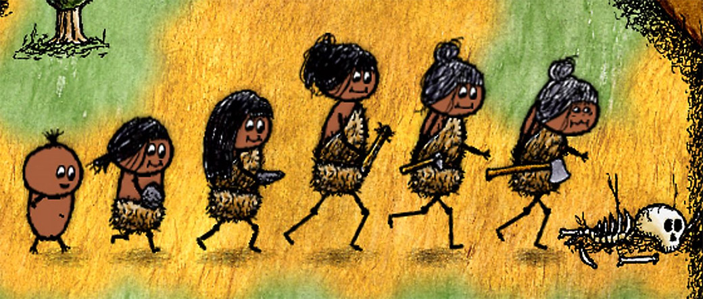

> _Retrospectiva săptămânii_ este rubrica duminicală în care trecem în revistă evenimentele săptămânii de pe frontul de gaming: știri şi articole (scrise de alții, bineînțeles, că e mai ușor aşa), industrie, lansări, oferte de jocuri, toate numai de savurat la cafeaua de duminică dimineața. (Și la care oricine poate contribui. ^[Dacă ai citit vreun articol sau vreo știre interesantă, sau ai o recomandare de joc, și crezi că merită incluse în retrospectiva săptămânii, te așteptăm pe forum pe unul dintre topicurile dedicate: [Știri](https://forum.candaparerevista.ro/viewtopic.php?f=4&t=46), [Articole](https://forum.candaparerevista.ro/viewtopic.php?f=4&t=206), [Gaming România](https://forum.candaparerevista.ro/viewtopic.php?f=4&t=1622), [Recomandarea Săptămânii](https://forum.candaparerevista.ro/viewtopic.php?f=84&t=1957)])

## Știri
* Microsoft a organizat X018, conferința anuală dedicată ecosistemului Xbox. Printre noutățile anunțate se numără confirmarea achiziției Obsidian, dar și achiziția surpriză a încă unui studio: inXile. ([Destructoid](https://www.destructoid.com/everything-that-happened-at-microsoft-s-x018-event-530780.phtml), [USgamer](https://www.usgamer.net/articles/microsoft-x018-conference-trailers), [Polygon](https://www.polygon.com/xbox-one/2018/11/10/18082516/x018-news-announcements-trailers-xbox-one-crackdown-3-pubg-obisidan-inxile-kingdom-hearts-3), [TechRaptor](https://techraptor.net/content/xbox-xo18-special-conference-recap), [Eurogamer](https://www.eurogamer.net/articles/2018-11-09-microsoft-studios-obsidian-inxile-entertainment-acquisition), [GamesIndustry.biz](https://www.gamesindustry.biz/articles/2018-11-10-microsoft-to-acquire-rpg-specialists-obsidian-entertainment-and-inxile))
* Ediția din 2018 a campionatului mondial de **Starcraft 2** a fost câștigată de un jucător din Finlanda. Este prima dată în istoria jocului când câștigătorul nu este din Coreea de Sud. ([PC Gamer](https://www.pcgamer.com/serral-becomes-first-non-korean-to-win-starcraft-2s-biggest-tournament/))
* Acțiunile Activision-Blizzard au scăzut cu 7% după anunțul de la BlizzCon despre Diablo Immortal. ([PCGamesN](https://www.pcgamesn.com/diablo-immortal-stock-crash), [TechRaptor](https://techraptor.net/content/diablo-immortal-controversy-causes-activision-blizzard-stock-to-drop-over-7), [GamesIndustry.biz](https://www.gamesindustry.biz/articles/2018-11-06-activision-blizzard-stocks-tumble-amid-fan-backlash-over-diablo-immortal))
* Riot Games au fost dați în judecată pe motivul discriminării de gen. ([Kotaku](https://kotaku.com/current-and-former-employees-sue-riot-games-for-gender-1830262786), [Polygon](https://www.polygon.com/2018/11/7/18070340/riot-games-gender-discrimination-lawsuit-class-action), [VentureBeat](https://venturebeat.com/2018/11/06/riot-games-gets-hit-with-gender-discrimination-lawsuit/), [GamesIndustry.biz](https://www.gamesindustry.biz/articles/2018-11-06-riot-games-faces-class-action-suit-for-discrimination-harassment))
* Părinții acuză Ubisoft că arată copiilor lor mesaje de abonare atunci când joacă **Just Dance 2019** în modul „Kids”, care oferă o experiență simplificată și, teoretic, lipsită de aspectele comerciale. ([Eurogamer](https://www.eurogamer.net/articles/2018-11-05-ubisoft-says-sorry-after-parent-complains-just-dance-2019-spammed-their-six-year-old-with-subscription-messages), [Kotaku](https://kotaku.com/parent-wants-just-dance-to-stop-asking-their-kid-to-sub-1830239105/), [GamesIndustry.biz](https://www.gamesindustry.biz/articles/2018-11-06-ubisoft-reworking-just-dance-kids-mode-after-parents-complaints-over-subscription-ads))
* **Hearthstone** a depășit pragul de 100 milioane de jucători, din care 30 milioane doar în ultimul an. ([Destructoid](https://www.destructoid.com/blizzard-s-hearthstone-passes-100-million-player-mark-530134.phtml), [Gamasutra](http://www.gamasutra.com/view/news/329997/Blizzards_Hearthstone_reaches_100_million_registered_players_.php), [PCGamesInsider.biz](https://www.pcgamesinsider.biz/news/68057/hearthstone-has-attracted-30m-new-players-in-the-last-year/))
* Denuvo 5.2, cea mai recentă versiune a sistemului de protecție anti-piratare, [a fost „spart” în doar 4 zile](https://www.pcgamesn.com/denuvo-52) (PCGamesN). Asta în timp ce compania care deține Denuvo este de părere că un astfel de sistem de protecție merită folosit chiar dacă va fi spart, dând exemplul unui „joc de sport AAA” care ar fi pierdut mai bine de 20 milioane de dolari în primele zile de la lansare pentru că nu a folosit Denuvo. ([PCGamesN](https://www.pcgamesn.com/denuvo-anti-piracy-statement-21-million), [GameReactor](https://www.gamereactor.eu/news/710023))
* Un cercetător ucrainean a descoperit o vulnerabilitate în sistemul de generare a CD-key-urilor pentru Steam care ar fi permis generarea nelimitată de key-uri valide. După ce a raportat eroarea, a fost recompensat de Valve cu 20.000 de dolari. ([TechRaptor](https://techraptor.net/content/20000-bounty-steam-cd-key-bug))

## Articole (critică, dev, design)

* [Meet the devs building the great detective games of tomorrow](https://www.pcgamer.com/meet-the-devs-building-the-great-detective-games-of-tomorrow/) (PC Gamer)
* [The first person shooter is a dad in mid-life crisis](https://www.blog.radiator.debacle.us/2018/11/the-first-person-shooter-is-dad-in-mid.html) (Radiator Blog)
* [The Video Games About Nothing](http://www.kotaku.co.uk/2018/11/07/the-video-games-about-nothing) (Kotaku)
* [The Untapped Potential Of Our Favorite Open Worlds](https://www.gameinformer.com/opinion/2018/11/06/the-untapped-potential-of-our-favorite-open-worlds) (Games Informer)

### Actualitate
* [Don't panic, Diablo is probably going to be fine](https://www.pcgamer.com/dont-panic-diablo-is-probably-going-to-be-fine/) (PC Gamer)
* [A dust-up over Diablo: Immortal has far-reaching implications](https://venturebeat.com/2018/11/09/the-deanbeat-a-dust-up-over-diablo-immortal-has-far-reaching-implications/) (VentureBeat)
* [Blizzard acknowledges the mobile reality](https://www.gamesindustry.biz/articles/2018-11-09-blizzard-acknowledges-the-mobile-reality) (GamesIndustry.biz)
* [Diablo Immortal backlash shows once again triple-A publishers are afraid of their audiences](https://www.pocketgamer.biz/comment-and-opinion/69399/triple-a-publishers-are-afraid-of-their-audiences/) (Pocket Gamer)

### _Not-a-review_
* [Why I love Opus Magnum's alchemical gifs](https://www.pcgamer.com/why-i-love-opus-magnums-alchemical-gifs/) (PC Gamer)
* [After 15 years, Max Payne 2's ridiculous physics still make it a must-play](https://www.pcgamer.com/after-15-years-max-payne-2-is-still-worth-playing-for-its-ridiculous-physics/) (PC Gamer)
* [We Ask Real Cowboys What They Think of Red Dead Redemption 2](https://www.usgamer.net/articles/real-cowboys-red-dead-redemption-2-review) (USgamer)
* [Rockstar's history of America](https://www.eurogamer.net/articles/2018-11-05-rockstars-history-of-america) (Eurogamer)
* [Return of the Obra Dinn is a work of art](http://www.gamasutra.com/view/news/330300/Opinion_Return_of_the_Obra_Dinn_is_a_work_of_art.php) (Gamasutra)
* [How Return of the Obra Dinn Pushes Environmental Storytelling Forward](http://outsideyourheaven.blogspot.com/2018/11/how-return-of-obra-dinn-pushes.html) (Outside Your Heaven)
* [The terror and triumph in Rainbow Six Siege](https://www.destructoid.com/the-terror-and-triumph-in-rainbow-six-siege-524623.phtml) (Destructoid)
* [The Therapy and Anxiety I Recognized in Celeste](http://www.firstpersonscholar.com/the-therapy-and-anxiety-i-recognized-in-celeste/) (First Person Scholar)
* [Social Commentaries in Forgotton Anne](http://www.nymgamer.com/?p=17860) (NYMG)
* [We need to talk about Kassandra's biceps](https://www.eurogamer.net/articles/2018-11-09-we-need-to-talk-about-kassandra-s-biceps) (Eurogamer)

### Industrie
* [We Asked Eight Studios From Across The World How They Deal with Crunch](https://waypoint.vice.com/en_us/article/nepw5d/game-development-crunch-japan-europe) (Waypoint)
* [How to design for coziness... and kindness](https://www.gamesindustry.biz/articles/2018-11-05-how-to-design-for-coziness-and-kindness) (GamesIndustry.biz)
* [Western gamers aren&#039;t going to be as much of a focus for triple-A publishers moving forwards ](https://www.pcgamesinsider.biz/interviews-and-opinion/68063/insight-western-gamers-arent-going-to-be-as-much-of-a-focus-for-triple-a-publishers-moving-forwards/) (PCGamesInsider.biz)
* [Players who buy Battlefield 5 have to wait the longest to play it](https://www.polygon.com/2018/11/9/18079060/battlefield-5-ea-subscribers-early-release-date) (Polygon)
* [The many merchandising methods of Activision](https://www.gamesindustry.biz/articles/2018-11-08-the-many-merchandising-methods-of-activision) (GamesIndustry.biz)
* [How Spirit is using AI to change the games industry forever](https://www.pcgamesinsider.biz/interviews-and-opinion/68085/how-spirit-is-using-ai-to-change-the-games-industry-forever/) (PCGamesInsider.biz)
* [The full Obsidian interview &#8211; building worlds and Pillars of Eternity&#8217;s future](https://www.pcgamesn.com/pillars-of-eternity-2/obsidian-interview) (PCGamesN)
* [The full Chris Avellone interview: Baldur&#8217;s Gate 3, Fallout: Van Buren, and the failings of Pillars of Eternity](https://www.pcgamesn.com/chris-avellone-interview) (PCGamesN)
* [Our Full BlizzCon Interview With Blizzard Co-Founder Allen Adham](https://www.gameinformer.com/blizzcon2018/2018/11/08/our-full-blizzcon-interview-with-blizzard-co-founder-allen-adham) (Games Informer)

### Istorie, retrospectivă
* [Ron Gilbert's forgotten edutainment games](https://www.eurogamer.net/articles/2018-11-09-ron-gilberts-forgotten-edutainment-games) (Eurogamer)
* [A handful of fans have kept Aliens Versus Predator 2 multiplayer alive for a decade](https://www.rockpapershotgun.com/2018/11/09/you-can-still-play-alien-versus-predator-2-multiplayer/) (RPS)
* [How bad crediting hurts the game industry and muddles history](http://www.gamasutra.com/view/news/329003/How_bad_crediting_hurts_the_game_industry_and_muddles_history.php) (Gamasutra)
* [The chaotic tale behind video games' best Lovecraft adaptation](https://www.eurogamer.net/articles/2018-11-04-the-chaotic-tale-behind-video-games-best-lovecraft-adaptation) (Eurogamer)
* [The Case Of The Disappearing Nancy Drew Video Games ](https://kotaku.com/the-case-of-the-disappearing-nancy-drew-video-games-1830256040/) (Kotaku)
* [The not-quite-making of Baldur&#8217;s Gate 3](https://www.pcgamesn.com/baldurs-gate-3/baldurs-gate-3-development) (PCGamesN)
* [10 years on, here&#8217;s how Dead Space went from horror to action horror in three games](https://www.rockpapershotgun.com/2018/11/07/10-years-on-heres-how-dead-space-went-from-horror-to-action-horror-in-three-games/) (RPS)
* [The Game Archeologist: Halo Universe](https://massivelyop.com/2018/11/10/the-game-archeologist-halo-universe/) (Massively OP)

### Dev, making of
* [How a book binds the Return of the Obra Dinn](https://www.rockpapershotgun.com/2018/11/07/how-a-book-binds-the-return-of-the-obra-dinn/) (RPS)
* [The Psycho Tricks of the Game Designer  ](https://gamasutra.com/blogs/ThomasJohnson/20181107/330116/The_Psycho_Tricks_of_the_Game_Designer.php) (Gamasutra)
* [The Tiers we Cry: Why Tiers Exist in Competitive Games](https://remptongames.com/2018/11/10/the-tiers-we-cry-why-tiers-exist-in-competitive-games/) (Rempton Games)
* (Video) [Watch Lucas Pope discuss the making of  Return of the Obra Dinn ](http://www.gamasutra.com/view/news/330410/Watch_Lucas_Pope_discuss_the_making_of_Return_of_the_Obra_Dinn.php) (Gamasutra)

### Design, world-building
* [The art of war: Defining the look of 11-11 Memories Retold](https://www.gamesindustry.biz/articles/2018-11-07-the-art-of-war-defining-the-look-of-11-11-memories-retold) (GamesIndustry.biz)
* [How Worldbuilding Elevates Video Games and Fandom](http://www.gamasutra.com/blogs/JoshBycer/20181107/330000/How_Worldbuilding_Elevates_Video_Games_and_Fandom.php) (Gamasutra)
* [The Art Behind League Of Legends&#39; K-Pop Video ](https://kotaku.com/the-art-behind-league-of-legends-k-pop-video-1830269318) (Kotaku)
* (Poze frumoase) [Tense Times](https://kotaku.com/tense-times-1830215041) (Kotaku)
* (Poze frumoase) [All Hail The King Of Space](https://kotaku.com/all-hail-the-king-of-space-1830302303) (Kotaku)

## Made în România
* Dev.Play au publicat prezentarea susținută de Liviu Berbece, de la studioul Those Awesome Guys, la Dev.Play 2018, despre jocul lor **Move or Die** ([YouTube Dev.Play](https://www.youtube.com/watch?v=T6eZbp093vY))
* Alien Pixel Studios, creatorii jocului **Unbound: Worlds Apart**, se numără printre câștigătorii burselor Unreal Dev Grant, oferite de Epic Games creatorilor independenți de jocuri care folosesc motorul Unreal Engine. ([Facebook Unbound: Worlds Apart](https://www.facebook.com/UnboundGame/posts/1987426564889782), [Site UnrealEngine.com](https://www.unrealengine.com/en-US/blog/epic-games-announces-over-800k-in-unreal-dev-grants))

## Anunţuri şi lansări de jocuri
### Anunţate
* **Pagan Online**, un ARPG online de la Wargaming ([Games Informer](https://www.gameinformer.com/2018/11/08/wargaming-announces-hack-and-slash-action-rpg-pagan-online))
* **Cloudpunk** ([Kotaku](https://kotaku.com/cloudpunk-a-cyberpunk-game-where-youre-a-delivery-guy-1830321417))
* **SkateBIRD** ([Shacknews](https://www.shacknews.com/article/108361/skatebird-shreds-with-hawk-like-skill-in-announcement-trailer))
* **Paranoid**, un joc nou de la producătorii lui Agony ([TechRaptor](https://techraptor.net/content/agony-devs-reveal-new-survival-horror-game-paranoid))
* **Void Bastards**, un shooter SF de la un studio condus de unul dintre foștii fondatori ai Irrational Games ([Games Informer](https://www.gameinformer.com/xo18/2018/11/10/bioshock-inspired-strategy-shooter-void-bastards-announced), [Variety](https://variety.com/2018/gaming/news/void-bastards-pc-xbox-one-2019-1203024467/))

### Acum cu dată de lansare
* **Gris**: 13 decembrie ([Destructoid](https://www.destructoid.com/devolver-s-gris-gets-a-beautiful-new-trailer-and-release-date-530325.phtml))
* **Tannenberg** iese din Early Access pe 13 februarie ([PC Gamer](https://www.pcgamer.com/wwi-shooter-tannenberg-goes-into-full-release-in-february/))

### Amânate
* Episodul 3 din **The Long Dark** nu mai apare în decembrie 2018 ([Eurogamer](https://www.eurogamer.net/articles/2018-11-08-the-long-darks-third-story-episode-has-been-delayed-until-next-year))

### Lansate
* 5 noiembrie: **Cheap Golf** ([Steam](https://store.steampowered.com/app/616520/Cheap_Golf/))
* 6 noiembrie: **The Shapeshifting Detective** ([Steam](https://store.steampowered.com/app/898650/The_Shapeshifting_Detective/), [Humble Store](https://www.humblebundle.com/store/the-shapeshifting-detective))
* 6 noiembrie: **Overkill’s The Walking Dead**, dar ar fi bine să vă [informați mai mult înainte să-l cumpărați](https://www.gameinformer.com/2018/11/07/dont-buy-overkills-the-walking-dead-yet) ([Steam](https://store.steampowered.com/app/717690/OVERKILLs_The_Walking_Dead/))
* 6 noiembrie: **Swords and Soldiers 2 Shawarmageddon** ([Steam](https://store.steampowered.com/app/703880/Swords_and_Soldiers_2_Shawarmageddon/))
* 6 noiembrie: **GRIP: Combat Racing** ([Steam](https://store.steampowered.com/app/396900/GRIP_Combat_Racing/))
* 7 noiembrie: **Fluffy Horde** ([Steam](https://store.steampowered.com/app/777880/Fluffy_Horde/))
* 7 noiembrie: **TSIOQUE** ([Steam](https://store.steampowered.com/app/393190/TSIOQUE/), [gog.com](https://www.gog.com/game/tsioque))
* 7 noiembrie: **Leisure Suit Larry – Wet Dreams Don't Dry** ([Steam](https://store.steampowered.com/app/765870/Leisure_Suit_Larry__Wet_Dreams_Dont_Dry/), [gog.com](https://www.gog.com/game/leisure_suit_larry_wet_dreams_dont_dry))
* 7 noiembrie: **Steel Rats** ([Steam](https://store.steampowered.com/app/619700/Steel_Rats/), [gog.com](https://www.gog.com/game/steel_rats))
* 8 noiembrie: **Kynseed** (Early Access) ([Steam](https://store.steampowered.com/app/758870/Kynseed/), [gog.com](https://www.gog.com/game/kynseed))
* 9 noiembrie: **Thief Simulator** ([Steam](https://store.steampowered.com/app/704850/Thief_Simulator/))
* 9 noiembrie: **Tetris Effect** (PS4) ([PlayStation Store](https://www.playstation.com/en-us/games/tetris-effect-ps4/))
* 9 noiembrie: **11-11 Memories Retold** ([Steam](https://store.steampowered.com/app/735580/1111_Memories_Retold/), [Humble Store](https://www.humblebundle.com/store/1111-memories-retold))

## Prăvălii de jocuri

### Știri
* [Wish List feature finally available for all on the Microsoft Store](https://www.eurogamer.net/articles/2018-11-07-wish-list-feature-finally-available-for-all-on-the-microsoft-store) (Eurogamer)

### Jocuri noi în catalog
* **Thronebreaker: The Witcher Tales** este acum disponibil și pe Steam, deși se lansase inițial exclusiv pe GOG ([Steam](https://store.steampowered.com/app/973760/Thronebreaker_The_Witcher_Tales/))
* **One Hour One Life** al lui Jason Rohrer, care a fost disponibil la lansare doar pe site-ul propriu, s-a lansat și pe Steam ([Steam](https://store.steampowered.com/app/595690/One_Hour_One_Life/))
* [Xbox Game Pass gets 16 new games, including PUBG](https://venturebeat.com/2018/11/10/xbox-game-pass-gets-16-new-games-including-pubg/) (VentureBeat)

### Reduceri și promoții
* [Get up to 90% off Warhammer games with Humble this week](https://www.eurogamer.net/articles/2018-11-06-get-up-to-90-percent-off-warhammer-games-with-humble-this-week) (Eurogamer)
* [GOG 'Made in Poland' sale discounts Frostpunk and The Witcher series](https://www.pcgamer.com/gog-made-in-poland-sale-discounts-frostpunk-and-the-witcher-series/) (PC Gamer)
* [Prison Architect, Talos Principle and more are raising money for War Child's Armistice 2018](https://www.pcgamer.com/prison-architect-talos-principle-and-more-are-raising-money-for-war-childs-armistice-2018/) (PC Gamer)
* [Weekend PC Download Deals for Nov. 9: Klei Publisher Sale on Steam](https://www.shacknews.com/article/108427/weekend-pc-download-deals-for-nov-9-klei-publisher-sale-on-steam) (Shacknews)

## Recomandarea săptămânii: _One Hour One Life_

**One Hour One Life** este un joc multiplayer online cu o idee unică. În el te vei naște în familia unui alt jucător și îți vei trăi viața într-o singură oră, în decursul căreia vei avea la rândul tău copii (alți jucători, firește) și vei încerca pe cât posibil să lași o lume mai bună generațiilor viitoare. Pe cât este de greu să ajuți omenirea să progreseze în acest joc, pe atât de ușor este să pierzi moștenirea lăsată ție de ceilalți jucători. În momentul de față s-au trăit în joc aproape 3 milioane de vieți în decursul unui total de 450.000 de ore jucate. Cel mai lung fir genealogic de până acum numără 288 de generații.

Jocul este produs în întregime de Jason Rohrer, care încă lucrează non-stop la îmbunătățirea lui, aducându-i update-uri săptămânale de la lansarea lui din februarie. Pentru cei care nu au auzit încă de el, Rohrer este un developer indie renumit pentru jocurile sale cu idei nătrușnice, pe care adeseori le lansează în domeniul public. Câteva dintre titlurile sale mai cunoscute sunt **Diamond Trust of London**, un joc de strategie pentru Nintendo DS finanțat prin Kickstarter, **The Castle Doctrine**, un joc MMO în care dai spargeri la casele altor jucători (și respectiv îți aperi casa de alți spărgători), **Sleep is Death**, un joc jucat în doi, în care unul dintre jucători trăiește povestea pregătită și controlată de către celălalt. Jason Rohrer a devenit în 2016 primul producător de jocuri care a avut parte de o retrospectivă dedicată lui într-un muzeu de artă.

Jocul se poate achiziționa fie DRM free, [direct de la Jason](http://onehouronelife.com/), fie de pe [Steam](https://store.steampowered.com/app/595690/One_Hour_One_Life/), unde a fost lansat săptămâna trecută.