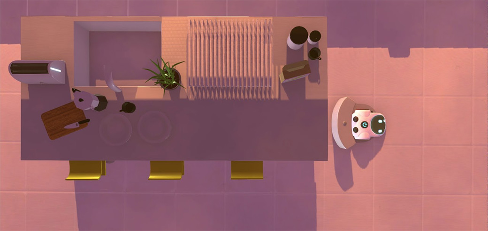

> _Retrospectiva săptămânii_ este rubrica duminicală în care trecem în revistă evenimentele săptămânii de pe frontul de gaming: știri şi articole (scrise de alții, bineînțeles, că e mai ușor aşa), industrie, lansări, oferte de jocuri, toate numai de savurat la cafeaua de duminică dimineața. (Și la care oricine poate contribui. ^[Dacă ai citit vreun articol sau vreo știre interesantă, sau ai o recomandare de joc, și crezi că merită incluse în retrospectiva săptămânii, te așteptăm pe forum pe unul dintre topicurile dedicate: [Știri](https://forum.candaparerevista.ro/viewtopic.php?f=4&t=46), [Articole](https://forum.candaparerevista.ro/viewtopic.php?f=4&t=206), [Gaming România](https://forum.candaparerevista.ro/viewtopic.php?f=4&t=1622), [Recomandarea Săptămânii](https://forum.candaparerevista.ro/viewtopic.php?f=84&t=1957)])

## Știri
* Skybound au început să lucreze la sezonul final din **The Walking Dead**.  ([Eurogamer](https://www.eurogamer.net/articles/2018-11-19-work-has-resumed-on-telltales-final-season-of-the-walking-dead), [Games Informer](https://www.gameinformer.com/2018/11/19/the-walking-dead-the-final-season-has-restarted-development-at-skybound-games), [The Verge](https://www.theverge.com/2018/11/19/18103547/telltale-games-the-walking-dead-skybound-games-original-developers-final-season))
* Valve nu va mai produce Steam Link după ce stocurile actuale se vor epuiza. ([Eurogamer](https://www.eurogamer.net/articles/2018-11-20-valve-pulls-plug-on-steam-link-hardware), [Games Informer](https://www.gameinformer.com/2018/11/20/valve-unofficially-sunsetting-steam-link-with-most-supply-sold-out), [The Verge](https://www.theverge.com/circuitbreaker/2018/11/19/18103672/valve-discontinues-steam-link-streaming-set-top-box), [Ars Technica](https://arstechnica.com/gaming/2018/11/valve-quietly-discontinues-steam-link-hardware-production/))
* 20th Century Fox a înregistrat marca **Alien: Blackout** pentru jocuri video. ([Gematsu](https://gematsu.com/2018/11/20th-century-fox-trademarks-alien-blackout-for-use-with-video-games))
* Valve a lansat versiunea beta pentru **Artifact**, dar s-a lovit de criticile negative ale jucătorilor care reclamă o monetizare agresivă și costuri ascunse. ([PCGamesN](https://www.pcgamesn.com/artifact/valve-responds-artifact-monetization-backlash), [Variety](https://variety.com/2018/gaming/news/valve-artifact-monetization-backlash-1203032287/), [PC Gamer](https://www.pcgamer.com/artifact-community-slams-pay-for-everything-monetisation-model/))
* Ubisoft revine asupra [deciziei de a cenzura](/highlights/2018/2018.10.28/) imaginile „18+” din Rainbow Six Siege după ce s-a lovit de reacțiile fanilor. ([Eurogamer](https://www.eurogamer.net/articles/2018-11-20-ubisoft-backtracks-on-removing-rainbow-six-sieges-blood-sex-and-gambling-references), [PCGamesN](https://www.pcgamesn.com/rainbow-six-siege/rainbow-six-siege-aesthetic-changes), [PCGamesInsider.biz](http://www.pcgamesinsider.biz/news/68131/sex-violence-and-gambling-return-to-rainbow-six-siege-after-community-backlash/), [GameDaily.biz](https://gamedaily.biz/article/402/ubisoft-returns-risque-art-to-rainbow-six-siege-in-most-markets-after-fan-outcry))
* Fortnite apare iar în știri din pricina mișcărilor de dans pe care le folosește fără a-i compensa pe artiștii care le-au creat. ([RPS](https://www.rockpapershotgun.com/2018/11/19/fortnite-battle-royale-dances-stolen/), [Eurogamer](https://www.eurogamer.net/articles/2018-11-19-scrubs-star-salty-fortnite-used-his-dance), [GamesIndustry.biz](https://www.gamesindustry.biz/articles/2018-11-19-2-milly-scrubs-donald-faison-accuse-fortnite-of-stealing-dance-moves), [VG247](https://www.vg247.com/2018/11/20/scrubs-actor-is-pissed-that-fortnite-stole-his-dance-too/))

## Articole (critică, dev, design)

* [It Starts with a Flicker: How Games Can Bring Humanity Closer Together](https://variety.com/2018/gaming/opinion/humanity-of-games-1203034867/) (Variety)
* [Death of Dreams: What Happens When Game Studios Shut Down](https://variety.com/2018/gaming/columns/game-studio-shut-downs-1203035448/) (Variety)
* [Red Dead Redemption 2 Is True Art](https://www.nytimes.com/2018/11/23/opinion/sunday/red-dead-redemption-2-fallout-76-video-games.html) (New York Times)
* [Abstract Art](https://unwinnable.com/2018/11/20/abstract-art/) (Unwinnable)
* [The Ethics of the RPG Re-Roll](http://www.kotaku.co.uk/2018/11/22/the-ethics-of-the-rpg-re-roll) (Kotaku)

### Actualitate
* [No-one wins in the Black Friday race to the bottom ](https://www.pcgamesinsider.biz/interviews-and-opinion/68145/opinion-no-one-wins-in-the-black-friday-race-to-the-bottom/) (PCGamesInsider.biz)
* [On Ubisoft's pandering to unreasonable players](https://www.gamesindustry.biz/articles/2018-11-21-on-ubisofts-pandering-to-unreasonable-players) (GamesIndustry.biz)
* [No, Ubisoft Didn't 'Pander' To Entitled Gamers Over 'Rainbow Six Siege' Censorship](https://www.forbes.com/sites/erikkain/2018/11/23/no-ubisoft-didnt-pander-to-entitled-gamers-over-rainbow-six-siege/#34abccbb3c72) (Forbes)
* [When does an homage become a rip-off?](https://www.gamesindustry.biz/articles/2018-11-23-when-does-an-homage-become-a-rip-off) (GamesIndustry.biz)
* [Fortnite Creator Facing Potential Lawsuit Over 'Stolen' Dance Moves - A Legal Analysis](https://www.gamasutra.com/blogs/PeteLewin/20181120/331104/Fortnite_Creator_Facing_Potential_Lawsuit_Over_Stolen_Dance_Moves__A_Legal_Analysis.php) (Gamasutra)
* [Artifact&#8217;s Monetisation Is A Mess](https://timber-owls.com/2018/11/22/artifacts-monetisation-is-a-mess/) (Timber Owls)

### _Not-a-review_
* [With Gran Turismo, racing esports has come of age](https://www.eurogamer.net/articles/2018-11-19-with-gran-turismo-racing-esports-has-come-of-age) (Eurogamer)
* [Tetris Effect is perfect for people overwhelmed by modern video games](https://www.theverge.com/2018/11/18/18099272/tetris-effect-perfect-game-red-dead-redemption-2-modern-games-overwhelming) (The Verge)
* [Red Dead Redemption 2 is a confection of cowboy clichés](https://www.polygon.com/2018/11/22/18104964/red-dead-redemption-2-rdr2-story-western-dutch-gang) (Polygon)
* (Spoilers) [Red Dead Redemption II&#039;s Slow Burn Is Why It&#039;s Great](https://www.gameinformer.com/column/2018/11/23/red-dead-redemption-iis-slow-burn-is-why-its-great) (Games Informer)
* [Due Diligence: A Boilermaker and His Helper](http://www.haywiremag.com/columns/due-diligence-a-boilermaker-and-his-helper/) (Haywire Magazine)
* [How Players Used Shotguns to Tear Open the Fabric of Reality in &#39;Spelunky&#39;](https://waypoint.vice.com/en_us/article/9k4a88/how-players-used-shotguns-to-tear-open-the-fabric-of-reality-in-spelunky) (Waypoint)
* [It’s Great When A Series Of Assassin’s Creed Side Activities Comes Together Just Right](https://kotaku.com/it-s-great-when-a-series-of-assassin-s-creed-side-activ-1830603212/) (Kotaku)
* [Hitman&#8217;s humour evolved because of 47&#8217;s penchant for disguises](https://www.rockpapershotgun.com/2018/11/23/hitmans-humour-evolved-because-of-47s-penchant-for-disguises/) (RPS)
* (Spoilers) [The Beautiful Highs and Occasional Lows of Spider-Man on PS4](https://www.usgamer.net/articles/the-highs-and-lows-of-marvels-spider-man-2018-11-23) (USgamer)
* [A Battlefield for Everyone, But Rarely at the Same Time](https://waypoint.vice.com/en_us/article/vba7ex/a-battlefield-for-everyone-but-rarely-at-the-same-time) (Waypoint)

### Industrie
* [The Past, Present, And Future Of Diablo](https://kotaku.com/the-past-present-and-future-of-diablo-1830593195/) (Kotaku), (TL;DR pe [USgamer](https://www.usgamer.net/articles/diablo-4-everything-we-learned-about-its-development-from-todays-big-report), [GamesIndustry.biz](https://www.gamesindustry.biz/articles/2018-11-22-concern-about-activisions-influence-at-blizzard-report))
* [Is Hi-Rez living in Blizzard&#8217;s shadow?](https://www.rockpapershotgun.com/2018/11/23/is-hi-rez-living-in-blizzards-shadow/) (RPS)
* [Having a Vision with thatgamecompany Eric Koch](https://www.gamedevunchained.com/blog-1/2018/9/11/episode165) (Game Dev Unchained)

### Istorie, retrospectivă
* **Half-Life 2** a împlinit 20 de ani:
  * [20 years on, Half-Life's opening tram ride is still an audacious bit of theatre](https://www.eurogamer.net/articles/2018-11-20-20-years-on-half-lifes-opening-tram-ride-is-still-an-audacious-bit-of-theatre) (Eurogamer)
  * [Half-Life is 20: why everything you liked about Valve's classic was a secret train](https://www.pcgamer.com/half-life-is-20-why-everything-you-liked-about-valves-classic-was-a-secret-train/) (PC Gamer)
  * [Whatever happened to Half-Life 3? The complete saga so far](https://www.pcgamesn.com/half-life-3/half-life-3-release-date-story-gameplay-art) (PCGamesN)
  * [Half-Life turns 20 today, and it feels more original than ever](https://www.theverge.com/2018/11/19/18102541/half-life-20th-anniversary-retrospective-first-person-shooter-design) (The Verge)
  * [Half-Life is 20! Happy Birthday! We are all old!](https://www.rockpapershotgun.com/2018/11/19/half-life-is-20-happy-birthday-we-are-all-old/) (RPS)
  * [Half-Life at 20: why it is the most important shooter ever made](https://www.theguardian.com/games/2018/nov/21/half-life-at-20-valve-shooter-sci-fi-horror) (The Guardian)

* Și **Legend of Zelda: Ocarina of Time** împlinește 20 de ani:
  * [What Makes Ocarina Of Time Great, 20 Years Later ](https://kotaku.com/what-makes-ocarina-of-time-great-20-years-later-1830596483/) (Kotaku)
  * [Zelda: Ocarina of Time’s Hyrule Field changed how we think about game worlds](https://www.polygon.com/2018/11/21/18107024/zelda-ocarina-of-time-anniversary-hyrule-field) (Polygon)
  * [The Complex Legacy of Legend of Zelda: Ocarina of Time on its 20th Anniversary](https://www.usgamer.net/articles/the-complex-legacy-of-legend-of-zelda-ocarina-of-time-on-its-20th-anniversary) (USgamer)
  * [The Water Temple isn't as difficult as we remember](https://www.eurogamer.net/articles/2018-11-23-the-water-temple-isnt-as-difficult-as-we-remember) (Eurogamer)

* **Left 4 Dead** face 10 ani:
  * [10 years later, Left 4 Dead lives on as its own genre](https://www.polygon.com/2018/11/22/18097804/left-4-dead-10th-anniversary-legacy) (Polygon)
  * [Ten Years of Being Left 4 Dead](http://www.kotaku.co.uk/2018/11/19/ten-years-of-being-left-4-dead) (Kotaku)
  * [Mike Booth, the Architect of Left 4 Dead's AI Director, Explains Why It's So Bloody Good](http://www.kotaku.co.uk/2018/11/19/mike-booth-the-architect-of-left-4-deads-ai-director-explains-why-its-so-bloody-good) (Kotaku)

* Iar Xbox One doar 5 ani:
  * [Xbox One re-review, five years in](https://www.polygon.com/reviews/2018/11/22/18103673/xbox-one-review-anniversary-five-years) (Polygon)
  * [Xbox One's 5th Anniversary - A Bumpy Journey, A Bright Future](https://techraptor.net/content/xbox-ones-5th-anniversary-a-bumpy-journey-a-bright-future) (TechRaptor)

Plus:

  * [Thief: The Dark Project is 20 years old, and you should play it today](https://www.eurogamer.net/articles/2018-11-18-thief-the-dark-project-is-20-years-old-and-you-should-play-it-today) (Eurogamer)
  * [The Strange History Of Grasshopper Manufacture](https://www.gameinformer.com/2018/11/22/the-strange-history-of-grasshopper-manufacture) (Games Informer)
  * [The Sad Sorry Tale of Mr. Card Game](http://www.kotaku.co.uk/2018/11/21/the-sad-sorry-tale-of-mr-card-game) (Kotaku)
  * (Video) [Video: How an 11th-hour decision made Aliens versus Predator a classic](https://arstechnica.com/gaming/2018/11/video-how-an-11th-hour-decision-made-aliens-versus-predator-a-classic/) (Ars Technica)

### Dev, making of
* [How multiplayer fell into Human: Fall Flat](https://www.rockpapershotgun.com/2018/11/21/how-multiplayer-fell-into-human-fall-flat/) (RPS)
* [Zen and the art of development: Designing games for meditation](https://www.gamesindustry.biz/articles/2018-11-21-zen-and-the-art-of-game-development-designing-games-for-meditation) (GamesIndustry.biz)
* [All the pretty horses: how Red Dead Redemption 2’s majestic steeds were made](https://www.theguardian.com/games/2018/nov/22/how-rockstar-red-dead-redemption-2-horses-made) (The Guardian)
* [We Happy Few, Early Access, and the danger of a good trailer](http://www.gamasutra.com/view/news/327876/We_Happy_Few_Early_Access_and_the_danger_of_a_good_trailer.php) (Gamasutra)
* [Developing the unique multi-genre murder-mystery The Hex ](http://www.gamasutra.com/view/news/330744/Developing_the_unique_multigenre_murdermystery_The_Hex.php) (Gamasutra)
* [Interview with ADOM Creator Dr.Thomas Biskup](http://www.gamasutra.com/blogs/JohnHarris/20181119/330721/Play_86_Interview_with_ADOM_Creator_DrThomas_Biskup.php) (Gamasutra)
* [Armchair VGUX: No Man’s Sky](https://medium.com/super-jump/armchair-vgux-no-mans-sky-9d91bb257e16) (Super Jump Magazine)

### Design, world-building
* [What you Give is What you Get: Environmental Storytelling in Games](https://remptongames.com/2018/11/24/what-you-give-is-what-you-get-environmental-storytelling-in-games/) (Rempton Games)
* (Poze frumoase) [The Art Of Shadow Of The Tomb Raider](https://kotaku.com/the-art-of-shadow-of-the-tomb-raider-1829156249/) (Kotaku)
* (Poze frumoase) [The Art Of Battlefield V](https://kotaku.com/the-art-of-battlefield-v-1830603477/) (Kotaku)

## Anunţuri şi lansări de jocuri
### Anunţate
* **Civilization VI: Gathering Storm**, un nou expansion pentru Civ ([Destructoid](https://www.destructoid.com/civilization-vi-gathering-storm-brings-natural-diasters-into-the-mix-532015.phtml), [Eurogamer](https://www.eurogamer.net/articles/2018-11-20-firaxis-just-announced-civilization-6-gathering-storm-heres-everything-we-know))
* **Warborn** ([RPS](https://www.rockpapershotgun.com/2018/11/23/warborn-anime-mech-strategy-announced/))

### Acum cu dată de lansare
* **Rapture Rejects**, un joc battle royale inspirat de Cyanide and Happiness, se lansează în early access: 29 noiembrie ([PC Gamer](https://www.pcgamer.com/cyanide-and-happiness-based-battle-royale-rapture-rejects-hits-early-access-next-week/))
* **Checkmate**, ultimul episod din **The Council**, apare pe 4 decembrie ([Gamereactor](https://www.gamereactor.eu/news/713263/))
* **Kenshi** iese din early access după 12 ani de dezvoltare: 6 decembrie ([PC Gamer](https://www.pcgamer.com/kenshi-is-a-post-apocalyptic-mount-and-blade-that-leaves-early-access-soon/))
* **Forgotten Sanctum**, al 3-lea DLC pentru **Pillars of Eternity 2: Deadfire**: 13 decembrie ([Eurogamer](https://www.eurogamer.net/articles/2018-11-20-third-and-final-paid-expansion-for-pillars-of-eternity-2-gets-a-release-date))
* **Miscreated**, un joc survival online făcut în CryEngine: 18 decembrie ([DSOGaming ](https://www.dsogaming.com/news/cryengine-powered-online-hardcore-survival-game-miscreated-fully-releases-on-december-18th/))
* **Black Mesa: Xen** se va lansa în al doilea trimestru din 2019  ([Eurogamer](https://www.eurogamer.net/articles/2018-11-19-as-half-life-turns-20-black-mesa-unveils-a-reimagined-xen), [DSOGaming](https://www.dsogaming.com/news/black-mesa-xen-will-release-in-q2-2019/))

### Lansate
* 20 noiembrie: **Battlefield V** ([EA Store](https://www.ea.com/en-gb/games/battlefield/battlefield-5/buy))
* 20 noiembrie: **Element: Space**, un tactical TBS (vezi [RPS](https://www.rockpapershotgun.com/2018/11/20/element-space-rpg-early-access-launch/) sau [RPG Codex](https://rpgcodex.net/forums/threads/124863)) s-a lansat în early access ([Steam](https://store.steampowered.com/app/887370/Element_Space/))
* 20 noiembrie: **Farming Simulator 19** ([Steam](https://store.steampowered.com/app/787860/Farming_Simulator_19/))
* 20 noiembrie: **Marvel’s Spider-Man: Turf Wars** ([PlayStation Store](https://store.playstation.com/en-ro/product/EP9000-CUSA11993_00-000000000000DLC2))
* 22 noiembrie: **The Haunted Island, A Frog Detective Game** ([RPS](https://www.rockpapershotgun.com/2018/11/22/the-haunted-island-a-frog-detective-gam/), [Steam](https://store.steampowered.com/app/963000/The_Haunted_Island_a_Frog_Detective_Game/))

## Prăvălii de jocuri
### Știri
* [Three Total War Games Get &quot;Definitive Editions&quot;, Free To Base Game Owners](https://techraptor.net/content/three-total-war-games-get-definitive-editions-free-to-base-game-owners) (TechRaptor)
* Dar și [Total War: Arena is shutting down early next year](https://www.pcgamer.com/total-war-arena-is-shutting-down-early-next-year/) (PC Gamer)

### Jocuri noi în catalog
* [Discord Nitro adds handful of Adult Swim Games](https://www.shacknews.com/article/108633/discord-nitro-adds-handful-of-adult-swim-games) (Shacknews)

### Reduceri și promoții
Săptămâna asta sunt reduceri de Black Friday pe mai toate magazinele de jocuri: Steam, GOG, Humble, Origin, Uplay, Fanatical, Green Man Gaming, Chrono.gg, Battle.net, etc.

* [Forget Black Friday, the Steam Autumn Sale is live now](https://www.destructoid.com/forget-black-friday-the-steam-autumn-sale-is-live-now-532176.phtml) (Destructoid)
* [Best deals of Steam Fall Sale 2018](https://www.shacknews.com/article/108663/best-deals-of-steam-fall-sale-2018) (Shacknews)
* [Humble Jumbo Bundle 12 Now Live - DiRT 4, Project Highrise And More](https://techraptor.net/content/humble-jumbo-bundle-12-now-live-dirt-4-project-highrise-and-more) (TechRaptor)
* [Green Man Gaming Black Friday Deals - Up to 75% XCOM 2, Civilization VI, ARK: Survival Evolved, and More](https://www.usgamer.net/articles/green-man-gaming-black-friday-deals-up-to-75-xcom-2-civilization-vi-ark-survival-evolved-and-more) (USgamer)
* [GOG's Black Friday Sale is live even though it's only Wednesday](https://www.pcgamer.com/gogs-black-friday-sale-is-live-even-though-its-only-wednesday/) (PC Gamer)
* [Blizzard’s Black Friday 2018 deals include big discounts on Overwatch, Diablo and more](https://www.polygon.com/2018/11/21/18107204/black-friday-deals-2018-cyber-monday-blizzard-activision-overwatch-call-of-duty) (Polygon)
* [Weekend Console Download Deals: Black Friday 2018 sales for PlayStation, Xbox, and Nintendo](https://www.shacknews.com/article/108658/weekend-console-download-deals-black-friday-2018-sales-for-playstation-xbox-and-nintendo) (Shacknews)
* [Weekend PC Download Deals: Steam Autumn Sale and other Black Friday 2018 deals](https://www.shacknews.com/article/108661/weekend-pc-download-deals-steam-autumn-sale-and-other-black-friday-2018-deals) (Shacknews)
* [Nutaku Black Friday Sale Has F2P Events &amp; Great Adult Game Deals](https://techraptor.net/content/nutaku-black-friday-sale) (TechRaptor)
* [The Best Black Friday 2018 PC Gaming Deals](https://techraptor.net/content/the-best-black-friday-2018-pc-gaming-deals) (TechRaptor)
* [Star Citizen free trial week blasts off](https://www.rockpapershotgun.com/2018/11/24/star-citizen-free-trial-week/) (RPS)
* [Green Man Gaming Black Friday sale discounts Monster Hunter World, Assassin&#039;s Creed Odyssey, Far Cry 5 and more](https://www.vg247.com/2018/11/21/green-man-gaming-black-friday-sale-discounts-monster-hunter-world-black-ops-4-assassins-creed-odyssey/) (VG247)

## Recomandarea săptămânii: _Rumu_

**Rumu** se încadrează perfect într-o categorie de jocuri tot mai prezentă în ultimii ani, cea a așa numitelor *comfort games*. Este un joc lipsit de dificultate, cu o atmosferă fermecătoare, bun de jucat seara după o zi de lucru.

În el joci rolul lui Rumu, un aspirator dotat cu inteligență artificială. AI-ul central al casei unde „locuiești” îți coordonează sarcinile zilnice, iar pe măsură ce le îndeplinești vei descoperi indicii despre familia care locuiește aici. Puzzle-urile sunt foarte simple, dar povestea e suficient de captivantă - un amestec de **Portal 2** cu **Gone Home** despre implicațiile morale ale AI și relațiile disfuncționale pe care le avem cu familiile noastre.



**Rumu** se poate lua de pe [Steam](https://store.steampowered.com/app/723270/Rumu/) cu 8,19€.
