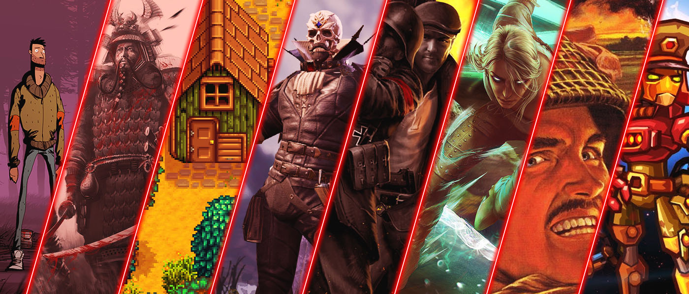

Începând de anul acesta tragem cortina peste secțiunea de recomandări din Retrospectiva Săptămânii și, ca să marcăm momentul (și pentru că tot e sezonul trecerilor în revistă) am făcut mai jos o listă cu toate recomandările pe care le-am făcut în anul care a trecut. Sperăm că ați jucat măcar o parte dintre ele. Recomandările și mini-review-urile voastre [vor avea în continuare un loc pe site](/categories/recomandare/), doar că vor avea un caracter mai puțin periodic, iar articolele vor fi publicate separat.

### Mai
* [Unforeseen Incidents]()
* [Overload]()

### Iunie
* [Shadow Tactics]()
* [Everything]()
* [Xenonauts]()
* [I Have No Mouth And I Must Scream]()

### Iulie
* [Red Faction Guerrilla Re-Mars-tered]()
* [Desperados: Wanted Dead Or Alive]()
* [American Truck Simulator]()
* [Return of the Tentacle]()
* [Stardew Valley]()

### August
* [Unavowed]()
* [The Bard’s Tale Trilogy]()
* [Hollow Knight]()
* [Divinity - Original Sin 2]()

### Septembrie
* [Impossible Creatures]()
* [Lamplight City]()
* [The Saboteur]()
* _[The Telltale Game]()_
* [Fallout 2]()

### Octombrie
* [Mark of the Ninja]()
* [Throne of Darkness]()
* [Gwent]()
* [From Dust]()

### Noiembrie
* [One Hour One Life]()
* [Superflight]()
* [Rumu]()
* [Close Combat II: A Bridge Too Far]()

### Decembrie
* [Stronghold Crusader]()
* [The Norwood Suite]()
* [Patrician III]()
* [SteamWorld Heist]()