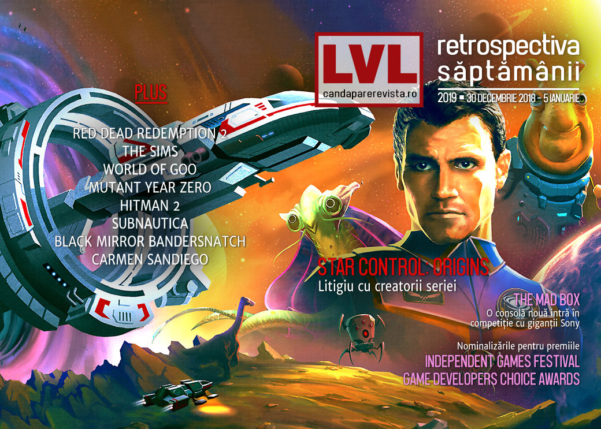

Jocul Star Control: Origins e retras de la vânzare din cauza unui litigiu pe drepturile de autor, se anunță o nouă consolă cu suport pentru VR, continuăm retrospectivele anului care tocmai s-a încheiat și privim spre ce va urma anul ăsta. Și începând de anul acesta [nu mai avem Recomandarea Săptămânii](), dar avem copertă.

## Ştiri
* Scenaristul Erik Wolpaw se întoarce la Valve ca colaborator part-time. El a lucrat la cele două episoade Half-Life 2 și la Portal 2 și părăsise compania în 2017. ([PC Gamer](https://www.pcgamer.com/portal-2-writer-erik-wolpaw-seems-to-have-returned-to-valve/), [Games Informer](https://www.gameinformer.com/2019/01/04/valve-writer-erik-wolpaw-back-at-the-company), [Polygon](https://www.polygon.com/2019/1/4/18168383/valve-erik-wolpaw-portal-half-life), [Gamasutra](http://www.gamasutra.com/view/news/333775/HalfLife_2_and_Portal_writer_Erik_Wolpaw_has_rejoined_Valve_.php))
* Steam și GOG au retras jocul **Star Control: Origins** de la vânzare în urma unei cereri DMCA (blocarea conținutului pe motiv de copyright) primită de la creatorii originali ai seriei, Fred Ford și Paul Reiche III, aflați într-un litigiu cu compania Stardock, cea care deține în prezent drepturile pentru Star Control ([Ars Technica](https://arstechnica.com/information-technology/2019/01/original-star-control-creators-deploy-nuclear-option-against-stardock/), [Destructoid](https://www.destructoid.com/star-control-origins-gets-delisted-amid-legal-battle-537555.phtml), [DSOGaming ](https://www.dsogaming.com/news/star-control-origins-has-been-removed-from-steam-due-to-a-dmca-notice/)). Ford și Reiche explică, într-o [postare pe site-ul lor](https://www.dogarandkazon.com/), motivele pentru care au trimis cererea ([Polygon](https://www.polygon.com/2019/1/3/18167140/star-control-origins-creators-dmca-stardock), [Gamasutra](http://www.gamasutra.com/view/news/333773/Star_Control_makers_defend_DMCA_takedown_against_Star_Control_Origins.php)).
* Japonia interzice revânzarea de chei digitale pentru jocuri fără permisiunea autorilor. ([Destructoid](https://www.destructoid.com/japan-bans-graymarket-key-reselling-537697.phtml), [Shacknews](https://www.shacknews.com/article/109205/japan-now-requires-creators-permission-to-resell-digital-game-keys), [PCGamesN](https://www.pcgamesn.com/japan-save-mods-game-keys))
* Slightly Mad, studioul din spatele seriei **Project CARS 2**, anunță că vrea să dezvolte o consolă… pardon, _„cea mai puternică consolă construită vreodată”_, denumită „Mad Box”, cu suport pentru VR.  ([Ars Technica](https://arstechnica.com/gaming/2019/01/project-cars-studio-announces-its-next-project-a-next-gen-wireless-vr-console/), [PCGamesInsider.biz](https://www.pcgamesinsider.biz/news/68301/project-cars-studio-slightly-mad-is-making-a-games-console/), [Variety](https://variety.com/2019/gaming/news/ian-bell-mad-box-1203097617/), [GamesIndustry.biz](https://www.gamesindustry.biz/articles/2019-01-02-slightly-mad-developing-standalone-vr-supportive-console), [Wccf tech](https://wccftech.com/slightly-mad-mad-box-criticism-nvidia-amd/))
* Jocul de browser **Town of Salem** a fost victima unei scurgeri de informații care a expus datele a 7,6 milioane de utilizatori. ([USgamer](https://www.usgamer.net/articles/browser-game-town-of-salem-left-76-million-users-personal-data-exposed), [TechRaptor](https://techraptor.net/content/town-of-salem-players-accounts-have-been-compromised))
* Carmen Sandiego devine serial animat produs de Netflix. ([Polygon](https://www.polygon.com/2019/1/4/18168810/carmen-sandiego-animated-series-netflix-release-date))
* Au fost anunțate nominalizările la premiile Game Developers Choice Awards ([USgamer](https://www.usgamer.net/articles/gdc-awards-red-dead-redemption-2-god-of-war-spider-man), [Destructoid](https://www.destructoid.com/game-developers-choice-awards-nominees-announced-ahead-of-march-conference-537828.phtml)) și Independent Games Festival ([Games Informer](https://www.gameinformer.com/2019/01/03/independent-games-festival-2019-nominations-released-with-return-of-obra-dinn-leading), [PC Gamer](https://www.pcgamer.com/return-of-the-obra-dinn-leads-the-2019-independent-games-festival-nominations/)), ambele evenimente având loc în cadrul GDC 2019 pe 20 martie.

## Articole (critică, dev, design)
* [Tales of an aging gamer: Why don’t I pick up a controller as often as I used to?](https://arstechnica.com/gaming/2019/01/tales-of-an-aging-gamer-why-dont-i-pick-up-a-controller-as-often-as-i-used-to/) (Ars Technica)
* [A bewildered, far-from-conclusive look at the state of public gaming in Tokyo](https://arstechnica.com/gaming/2019/01/a-bewildered-far-from-conclusive-look-at-the-state-of-public-gaming-in-tokyo/) (Ars Technica)
* [Soulmates - How The Souls-Like Genre Has Changed Combat In Gaming](https://techraptor.net/content/soulmates-how-the-souls-like-genre-has-changed-combat-in-gaming) (TechRaptor)
* [Gaming and Game Dev on Linux](https://gamasutra.com/blogs/DavidCDrake/20190102/333486/Gaming_and_Game_Dev_on_Linux.php) (Gamasutra)
* [Walt Disney&#039;s Public Domain Works](https://tedium.co/2019/01/03/public-domain-disney/) (Tedium)
* [The Importance of Preservation](https://unwinnable.com/2019/01/03/the-importance-of-preservation/) (Unwinnable)
* [As Games Continue To Get Longer, They Need To Better Accommodate Lapsed Players](http://fingerguns.net/features/2019/01/03/op-ed-as-games-continue-to-get-longer-they-need-to-better-accommodate-lapsed-players/) (Finger Guns)
* [Game Design and Bandersnatch](https://medium.com/super-jump/game-design-and-bandersnatch-4610f17fc5eb) (Super Jump Magazine – Medium)

### _Not-a-review_
* [The Sims Is Teaching Me To Appreciate Architecture](https://kotaku.com/the-sims-is-teaching-me-to-appreciate-architecture-1831460591) (Kotaku)
* [World of Goo is still magnificent 10 years on](https://www.pcgamer.com/world-of-goo-is-still-magnificent-10-years-on/) (PC Gamer)
* [Woah There: Embracing Slow Travel In Red Dead Redemption II](https://www.gameinformer.com/2019/01/01/woah-there-embracing-slow-travel-in-red-dead-redemption-ii) (Games Informer)
* [Professional Bird Watcher Gives a Fascinating Review of Red Dead Redemption 2&#039;s Wildlife](https://www.usgamer.net/articles/professional-bird-watcher-gives-a-fascinating-review-of-red-dead-redemption-2s-wildlife) (USgamer)
* [It&#39;s Surprising How Much of &#39;Red Dead Redemption 2&#39; Doesn&#39;t Actually Matter](https://waypoint.vice.com/en_us/article/mbyyey/its-surprising-how-much-of-red-dead-redemption-2-doesnt-actually-matter) (Waypoint)
* [Shacknews Best PC Game of 2018 - Subnautica](https://www.shacknews.com/article/109080/shacknews-best-pc-game-of-2018-subnautica) (Shacknews)
* [&quot;Richly Deserved,&quot; by Reid McCarter](http://www.bulletpointsmonthly.com/2019/01/02/richly-deserved/) (Bullet Points Monthly)

### Industrie
* [I&#39;m Richard Garriott, aka Lord British, and This Is How I Work](https://lifehacker.com/im-richard-garriott-aka-lord-british-and-this-is-how-1831177709) (Lifehacker)
* [The indie spirit behind the rebirth and growth of the Australian games industry](https://www.pocketgamer.biz/asia/feature/69706/the-indie-spirit-behind-the-rebirth-and-growth-of-the-australian-games-industry/) (Pocket Gamer)
* [A Conversation With Sega&#039;s Localization Team On Censorship, Consistency, And Comedy](https://www.gameinformer.com/2019/01/02/a-conversation-with-segas-localization-team-on-censorship-consistency-and-comedy) (Games Informer)
* [Talking To Yoko Taro, PlatinumGames&#039; Takahisa Taura, And Composer Keiichi Okabe About Life, Death, And Opportunity](https://www.gameinformer.com/2019/01/01/talking-to-yoko-taro-platinumgames-takahisa-taura-and-composer-keiichi-okabe-about-life) (Games Informer)
* [Moving platforms forward in an Epic Games world](https://www.gamesindustry.biz/articles/2019-01-04-moving-platforms-forward-in-an-epic-games-world) (GamesIndustry.biz)
* [Let people know what they're buying - A New Year's resolution for gaming](https://www.gamesindustry.biz/articles/2019-01-03-2019-let-people-know-what-theyre-buying) (GamesIndustry.biz)
* [Discord is ready to take over the gaming world](https://medium.com/@justtatertots/discord-is-ready-to-take-over-the-gaming-world-5f4b54240c73) (Medium)

### Istorie, retrospectivă
* [Life on the Grid](https://www.filfre.net/2019/01/life-on-the-grid/) (The Digital Antiquarian)
* [The Game Archaeologist: Project Copernicus](https://massivelyop.com/2019/01/05/the-game-archaeologist-project-copernicus/) (Massively OP)
* [Screamingly Good Fun: Bringing The Mystery of the Druids to Life](http://www.kotaku.co.uk/2019/01/02/screamingly-good-fun-bringing-the-mystery-of-the-druids-to-life) (Kotaku)

### Dev, making of
* [How developers create cinematics](https://www.pcgamer.com/how-developers-create-cinematics/) (PC Gamer)
* [Devs weigh in on the best ways to use (but not abuse) procedural generation](https://www.gamasutra.com/view/news/315400/Devs_weigh_in_on_the_best_ways_to_use_but_not_abuse_procedural_generation.php) (Gamasutra)
* (Video) [Ducking up the game design of  Mutant: Year Zero](http://www.gamasutra.com/view/news/333494/Ducking_up_the_game_design_of_Mutant_Year_Zero.php) (Gamasutra)

### Design, world-building
* [The best levels, maps, and locations 2018](https://www.pcgamer.com/the-best-levels-maps-and-locations-2018/) (PC Gamer)
* [Game Box Art Critique January: Resident Evil 2, Tropico 6, Kingdom Hearts 3](https://www.videogamer.com/features/game-box-art-critique-january-resident-evil-2-tropico-6-kingdom-hearts-3) (VideoGamer)

### Retrospectivă 2018
#### Jocuri
* [The Games We Missed and Recovered During 2018](https://intothespine.com/2018/12/31/games-we-missed-and-recovered-2018/) (Into The Spine)
* [The best PC games of 2018](https://www.pcgamesn.com/best-pc-games-2018) (PCGamesN)
* [Damn, 2018 had a lot of really great indie games](https://www.destructoid.com/damn-2018-had-a-lot-of-really-great-indie-games-537692.phtml) (Destructoid)
* [The 10 best game reissues of 2018](https://www.eurogamer.net/articles/2018-12-30-the-10-best-game-reissues-of-2018) (Eurogamer)
* [The weird and wonderful patch notes of 2018](https://www.pcgamer.com/the-weird-and-wonderful-patch-notes-of-2018/) (PC Gamer)
* [The best writing in games in 2018](https://www.pcgamer.com/the-best-writing-in-games-in-2018/) (PC Gamer)
* [Best PC games of 2018](https://www.rockpapershotgun.com/2019/01/02/best-pc-games-of-2018/) (RPS)
* [The 10 Best Games of 2018—and Yes, They&#x27;re Ranked](https://www.wired.com/story/best-games-2018/) (Wired)
* [The Best Games of 2018](https://unwinnable.com/2018/12/31/the-best-games-of-2018/) (Unwinnable)
* [10 Under Appreciated Video Games Of 2018](http://fingerguns.net/features/2019/01/03/10-under-appreciated-video-games-of-2018/) (Finger Guns)
* [The Best New Videogame Characters of 2018](https://www.pastemagazine.com/articles/2019/01/the-best-new-videogame-characters-of-2018.html) (Paste)

#### Industrie
* [Most Influential in Video Games 2018: Esports Stars, Union Leaders, Iconic Indies](https://variety.com/2018/gaming/features/video-game-influencers-2018-1203094002/) (Variety)
* [Best of 2018: Gamasutra's top games, devs, events and trends](http://www.gamasutra.com/view/news/333604/Best_of_2018_Gamasutras_top_games_devs_events_and_trends.php) (Gamasutra)

#### 2019
* [44 most anticipated games of 2019](https://www.shacknews.com/article/109204/44-most-anticipated-games-of-2019) (Shacknews)
* [Predicting the big stories of 2019](https://www.pcgamer.com/predicting-the-big-stories-of-2019/) (PC Gamer)
* [Ready player one: the most anticipated games of 2019](https://www.theguardian.com/games/2019/jan/01/most-anticipated-games-2019) (The Guardian)
* [The RPS hivemind presents: The most anticipated games of 2019](https://www.rockpapershotgun.com/2019/01/01/the-rps-hivemind-presents-the-most-anticipated-games-of-2019/1/) (RPS)
* [The 50 most anticipated games of 2019](https://www.polygon.com/gaming/2018/12/31/18156570/games-of-2019-most-anticipated) (Polygon)
* [Opinion: Here's what 2019 will be like for the game biz](http://gamasutra.com/view/news/333675/Opinion_Heres_what_2019_will_be_like_for_the_game_biz.php) (Gamasutra)
* [What lies ahead? Analysts make 2019 predictions](https://www.gamesindustry.biz/articles/2019-01-02-what-lies-ahead-analysts-make-2019-predictions) (GamesIndustry.biz)
* [The State of Sports Gaming in 2019](https://www.hardcoregamer.com/2019/01/04/the-state-of-sports-gaming-in-2019/321686/) (Hardcore Gamer)

## Anunţuri şi lansări de jocuri

* [Batalj beta extended to the end of January, keys are now available to everyone](https://www.pcgamer.com/batalj-beta-extended-to-the-end-of-january-keys-are-now-available-to-everyone/) (PC Gamer)
* [Part Live-Performance Art, Part Video Game, ‘Meditations’ Takes 365 Days to Experience](https://variety.com/2019/gaming/features/part-live-performance-art-part-video-game-meditations-takes-365-days-to-experience-1203098452/) (Variety)

### Anunţate
* Ediții remasterizate pentru Hitman 4 și Hitman Absolution, doar pentru PS și Xbox ([Variety](https://variety.com/2019/gaming/news/hitman-hd-enhanced-collection-1203099239/), [Games Informer](https://www.gameinformer.com/2019/01/04/hitman-blood-money-and-hitman-absolution-are-getting-enhanced-releases), [Eurogamer](https://www.eurogamer.net/articles/2019-01-04-hitman-absolution-and-blood-money-remastered-for-ps4-xbox-one))

### Acum cu dată de lansare
* **Bloody Spell**: 16 ianuarie ([DSOGaming ](https://www.dsogaming.com/news/action-based-rpg-bloody-spell-is-coming-to-steam-early-access-on-january-16th/))
* **Arc Savior**: 31 ianuarie ([DSOGaming ](https://www.dsogaming.com/news/space-shooter-arc-savior-releases-on-january-31st-gets-new-gameplay-video/))

### Anulate
* **Skytorn** ([Destructoid](https://www.destructoid.com/celeste-devs-cancel-procedural-game-skytorn-537162.phtml))

### Lansate
* 3 ianuarie: **Braveland Heroes** (early access) ([Steam](https://store.steampowered.com/app/931650/Braveland_Heroes/))
* 3 ianuarie: **Medieval Kingdom Wars** ([Steam](https://store.steampowered.com/app/499660/Medieval_Kingdom_Wars/))

## Prăvălii de jocuri

### Știri
* [Twitch Prime Gave Away More Than $3,000 Worth of Games in 2018](https://variety.com/2019/gaming/news/twitch-prime-2018-free-games-1203099302/) (Variety)
* [Lego Lord of the Rings games removed from Steam, Xbox and PS4 stores](https://www.eurogamer.net/articles/2019-01-03-lego-lord-of-the-rings-games-removed-from-steam-xbox-and-ps4-stores) (Eurogamer)
* [Steam Windows XP Support and Windows Vista Support Comes to an End](https://techraptor.net/content/steam-has-ended-support-for-windows-xp-and-windows-vista) (TechRaptor)

### Jocuri noi în catalog
* [Xbox Game Pass adds Life is Strange 2 to its lineup](https://www.destructoid.com/xbox-game-pass-adds-life-is-strange-2-to-its-lineup-537548.phtml) (Destructoid)
* [EA adds third-party games to Origin Access Premier, including Darksiders 3](https://www.pcgamer.com/ea-adds-third-party-games-to-origin-access-premier-including-darksiders-3/) (PC Gamer)
* [Hyper Light Drifter headlines January's free Twitch Prime games](https://www.shacknews.com/article/109166/hyper-light-drifter-headlines-januarys-free-twitch-prime-games) (Shacknews)
* [January Xbox Games with Gold includes Celeste for free](https://www.shacknews.com/article/109165/january-xbox-games-with-gold-includes-celeste-for-free) (Shacknews)

### Jocuri gratis și free weekends
* [What Remains of Edith Finch will be free on Epic Games' store next week](https://www.destructoid.com/what-remains-of-edith-finch-will-be-free-on-epic-games-store-next-week-537734.phtml) (Destructoid)

### Reduceri și promoții
* [Explore Fantastic Sci-Fi Games in the Humble Stardock Bundle 2019](https://techraptor.net/content/humble-stardock-bundle-2019) (TechRaptor)
* [The Division and Yakuza 0 head February Humble Monthly offerings](https://www.vg247.com/2019/01/04/the-division-yakuza-0-humble-monthly/) (VG247)

---

{}
**Retrospectiva săptămânii** este rubrica duminicală în care trecem în revistă evenimentele săptămânii de pe frontul de gaming: știri şi articole (scrise de alții, bineînțeles, că e mai ușor aşa), industrie, lansări, oferte de jocuri, toate numai de savurat la cafeaua de duminică dimineața.

De asemenea, rubrica e deschisă oricui vrea și poate contribui. Dacă ai citit vreun articol sau vreo știre interesantă, sau ai o recomandare de joc, și crezi că merită incluse în retrospectiva săptămânii, te așteptăm pe forum pe unul dintre topicurile dedicate: [Știri](https://forum.candaparerevista.ro/viewtopic.php?f=4&t=46), [Articole](https://forum.candaparerevista.ro/viewtopic.php?f=4&t=206), [Gaming România](https://forum.candaparerevista.ro/viewtopic.php?f=4&t=1622)].
{}
