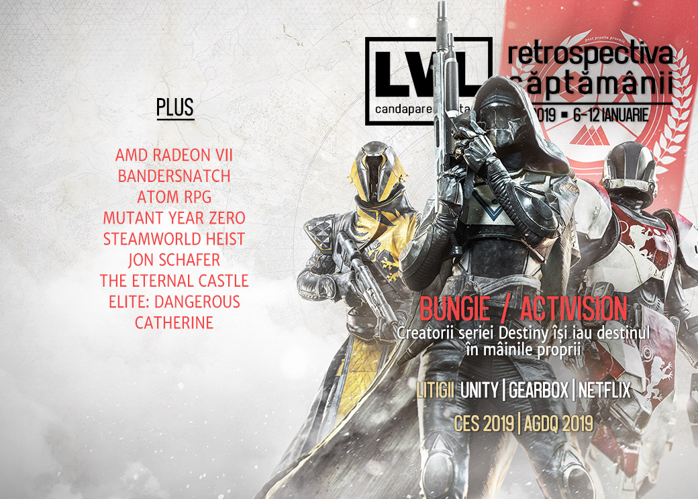

O săptămână dominată de scandaluri și dispute: Bungie se desparte de Activision, Unity se ceartă cu Improbable/SpatialOS, Netflix sunt dați în judecată pentru Bandersnatch, iar CEO-ul Gearbox, Randy Pitchford e implicat într-un scandal de proporții cu fostul avocat. Pe lângă acestea, s-au desfășurat CES 2019 și AGDQ, Amazon și Verizon lucrează la propriile platforme de game streaming, AMD anunță o nouă placă video, iar jocul Catherine ajunge și pe PC. Trebuie să citiți și povestea lui Jon Schafer, lead designer-ul lui Civilization V și creatorul jocului At the Gates. Mai avem un ultim Winter Sale pe Humble și nu uitați să luați What Remains of Edith Finch, care e gratis pe Epic Store.

## Ştiri

### Bungie se desparte de Activision
* Bungie se desparte de Activision și își recapătă drepturile de publicare pentru Destiny, cu doi ani mai devreme față de termenul de 10 ani al contractului. ([Kotaku](https://kotaku.com/bungie-splits-with-activision-1831651740), [Shacknews](https://www.shacknews.com/article/109317/bungie-acquires-publishing-rights-to-destiny-from-activision), [Eurogamer](https://www.eurogamer.net/articles/2019-01-10-bungie-announces-split-from-activision), [Destructoid](https://www.destructoid.com/bungie-set-to-self-publish-destiny-ending-relationship-with-activision-538514.phtml), [Ars Technica](https://arstechnica.com/gaming/2019/01/activision-will-cut-ties-with-bungie-give-up-publishing-control-of-destiny/))
* Reacția fanilor și în interiorul companiei a fost una pozitivă ([USgamer](https://www.usgamer.net/articles/bungie-activision-split-destiny-2-fans-reaction)), în schimb acțiunile Activision Blizzard au scăzut cu 12% în urma anunțului. ([Variety](https://variety.com/2019/gaming/news/activision-blizzard-stock-1203105444/), [Dot Esports](https://dotesports.com/business/news/activision-blizzard-stock-drops-following-split-with-bungie))

### Unity vs Improbable
* O dispută între compania Unity și Improbable, companie care a dezvoltat platforma de servicii online și cloud SpatialOS, bazată pe Unity, folosită la rândul ei de un număr de jocuri deja apărute sau în curs de dezvoltare (ex: **Lazarus** sau **Worlds Adrift**) a dat naștere unui scandal public, după ce Unity a modificat termenii și condițiile de folosire a motorului Unity și a revocat licențele acordate pentru SpatialOS, ceea ce a dus la o situație neclară pentru jocurile care o folosesc. ([Games Informer](https://www.gameinformer.com/2019/01/10/unity-and-improbable-have-public-argument-improbable-teams-up-with-epic-to-encourage), [Variety](https://variety.com/2019/gaming/news/unity-spatialos-terms-of-service-1203104720/), [PC Gamer](https://www.pcgamer.com/spatialos-games-on-unity-are-at-risk-because-of-a-licensing-change/))
* Până la clarificarea situației, Improbable a încheiat un acord cu Epic și au stabilit un fond de 25 de milioane de dolari pentru a ajuta jocurile afectate de dispută să facă tranziția către „alte motoare, servicii și ecosisteme mai deschise”. ([PC Gamer](https://www.pcgamer.com/after-spat-with-unity-improbable-teams-up-with-epic-games-for-dollar25m-transition-fund/), [VentureBeat](https://venturebeat.com/2019/01/10/epic-improbable-create-25-million-fund-to-transition-devs-away-from-unity/), [Shacknews](https://www.shacknews.com/article/109323/epic-and-improbable-set-up-25-million-fund-for-unity-devs), [Variety](https://variety.com/2019/gaming/news/epic-improbable-fund-unity-1203105357/))

### Litigii
* În această săptămână a luat amploare un scandal care-l are în prim-plan pe Randy Pitchford, CEO-ul Gearbox, care e angajat în mai multe procese cu fostul său avocat, deschise de către ambele părți, un scandal presărat cu tot felul de acuzații și detalii picante, printre care acuzații care-l privesc pe Pitchford în legătură cu pornografie infantilă pe un USB stick uitat într-un restaurant și bonusuri secrete de 12 milioane de dolari. ([Kotaku](https://kotaku.com/former-gearbox-lawyer-accuses-ceo-randy-pitchford-of-ta-1831679539), [USgamer](https://www.usgamer.net/articles/gearbox-lawsuit-randy-pitchford-borderlands), [Ars Technica](https://arstechnica.com/gaming/2019/01/gearbox-ceo-allegedly-kept-underage-porn-on-usb-stick-new-lawsuit-alleges/), [PCGamesN](https://www.pcgamesn.com/randy-pitchford-lawsuit-wade-callender), [Games Informer](https://www.gameinformer.com/2019/01/11/former-gearbox-lawyer-accuses-studio-and-randy-pitchford-of-financial-malfeasance-and))
* Netflix au fost dați în judecată de creatorii seriei de cărți „Choose Your Own Adventure” pentru filmul Bandersnatch. ([Variety](https://variety.com/2019/biz/news/bandersnatch-lawsuit-choose-your-own-adventure-netflix-1203105544/), [TechRaptor](https://techraptor.net/content/creators-of-choose-your-own-adventure-books-sue-netflix-over-bandersnatch), [Games Informer](https://www.gameinformer.com/2019/01/11/netflixs-bandersnatch-being-sued-by-choose-your-own-adventure-book-publisher), [Polygon](https://www.polygon.com/2019/1/11/18178615/netflix-black-mirror-lawsuit-choose-your-own-adventure-bandersnatch-chooseco))

### Alte știri
* În perioada 8-11 ianuarie s-a desfășurat CES 2019 (Consumer Electronics Show) în Las Vegas. ([Tech Radar](https://www.techradar.com/news/ces-2019), [The Guardian](https://www.theguardian.com/technology/2019/jan/11/ces-2019-consumer-electronics-show-10-most-memorable-new-gadgets), [The Verge](https://www.theverge.com/2019/1/12/18168612/google-assistant-amazon-alexa-smart-home-companies-ces-2019), [Wired](https://www.wired.com/story/the-best-of-ces-2019/), [Engadget](https://www.engadget.com/2019/01/12/ces-2019-in-pictures/), [Shacknews](https://www.shacknews.com/article/109331/shacknews-best-products-and-innovation-of-ces-2019))
* Averea lui Tim Sweeney, fondatorul și CEO-ul Epic Games, e estimată de Bloomberg la 7 miliarde de dolari, cu 3 mai mult decât cea a lui Gabe Newell. ([PC Gamer](https://www.pcgamer.com/epic-boss-tim-sweeney-is-worth-nearly-dollar3-billion-more-than-gabe-newell-according-to-bloomberg/), [PCGamesN](https://www.pcgamesn.com/fortnite/fortnite-tim-sweeney-net-worth), [PCGamesInsider.biz](http://www.pcgamesinsider.biz/news/68330/boss-of-fortnite-firm-epic-tim-sweeney-enters-bloomberg-billionaire-index-worth-716bn/))
* Numărul jucătorilor _banați_ prin intermediul VAC de către Valve în luna decembrie a atins un număr record de 600.000, motivul cel mai probabil fiind Counter-Strike, care a devenit free-to-play. ([Eurogamer](https://www.eurogamer.net/articles/2019-01-07-valve-brings-ban-hammer-down-on-record-number-of-players), [PC Gamer](https://www.pcgamer.com/valve-doled-out-nearly-six-months-worth-of-bans-after-csgo-went-free-to-play/), [PCGamesInsider.biz](https://www.pcgamesinsider.biz/news/68322/valves-anti-cheat-system-booted-600k-players-in-december-mostly-from-csgo/))
* Se pare că și Amazon lucrează la o platformă de _game streaming_. ([Variety](https://variety.com/2019/gaming/news/amazon-game-streaming-platform-1203104967/), [The Verge](https://www.theverge.com/2019/1/10/18177253/amazon-cloud-gaming-service-rumor-job-posting), [PC Gamer](https://www.pcgamer.com/reports-suggest-amazon-is-developing-a-game-streaming-service/), [GamesIndustry.biz](https://www.gamesindustry.biz/articles/2019-01-10-amazon-reportedly-developing-its-own-game-streaming-service))
* La fel și operatorul de telefonie mobilă Verizon. ([The Verge](https://www.theverge.com/2019/1/11/18179048/verizon-gaming-video-game-streaming-service-vzg-nvidia-shield-android), [GamesIndustry.biz](https://www.gamesindustry.biz/articles/2019-01-12-verizon-reportedly-also-testing-cloud-game-streaming-service))
* Compozitorul Jeremy Soule (cred că îl știți) a scos un album pe care l-a distribuit apoi pentru folosire liberă în jocuri și mod-uri, fie ele gratis sau comerciale ([PCGamesN](https://www.pcgamesn.com/jeremy-soule-mods-northerner)). (În altă ordine de idei, Soule a confirmat că nu va compune muzică și pentru The Elder Scrolls VI. ([VG247](https://www.vg247.com/2019/01/07/elder-scrolls-6-jeremy-soule/)))
* În perioada 6 - 13 ianuarie se desfășoară AGDQ (Awesome Games Done Quick) ediția 2019. ([Games Done Quick](https://gamesdonequick.com/schedule), [PC Gamer](https://www.pcgamer.com/the-best-pc-speedruns-from-agdq-2019-so-far/))
* Mike Morhaime, fostul președinte al Blizzard, care a renunțat la poziție la [începutul lunii octombrie](), păstrând doar un rol de consilier, va părăsi compania definitiv în luna aprilie. ([Games Informer](https://www.gameinformer.com/2019/01/10/former-blizzard-president-mike-morhaime-to-leave-company-in-april), [PC Gamer](https://www.pcgamer.com/mike-morhaime-is-leaving-blizzard-for-good-in-april/))
* AMD anunță Radeon VII, un nou GPU pe arhitectură de 7nm ce se va lansa în februarie. ([DSOGaming ](https://www.dsogaming.com/news/amd-officially-announces-its-next-generation-high-performance-gaming-gpus-radeon-vii/), [VentureBeat](https://venturebeat.com/2019/01/09/amd-ceo-lisa-su-unveils-7-nanometer-radeon-vii-gpu/), [Eurogamer](https://www.eurogamer.net/articles/digitalfoundry-2019-01-09-amd-announces-radeon-7-graphics-card-7031))
* A murit „vocea” din Civilization V. Actorul care a jucat rolul naratorului, William Morgan Sheppard, a murit la vârsta de 86 de ani. ([Eurogamer](https://www.eurogamer.net/articles/2019-01-08-civilization-5-narrator-william-morgan-sheppard-dies-aged-86), [Kotaku](https://kotaku.com/civilization-vs-narrator-has-died-1831588933))

## Articole (critică, dev, design)

* [How games can help to explore the many colours of grief](https://www.eurogamer.net/articles/2019-01-09-how-games-can-help-to-explore-the-many-colours-of-grief) (Eurogamer)
* [Hardware Digital Body](https://unwinnable.com/2019/01/09/hardware-digital-body-museum-of-moving-image/) (Unwinnable)
* [The Millennial Burnout Conversation Also Applies to Gamers](https://waypoint.vice.com/en_us/article/mby89y/millennial-burnout-gamers) (Waypoint)
* [Gaming’s Hidden Toxicity](http://www.firstpersonscholar.com/gamings-hidden-toxicity/) (First Person Scholar)
* [Video games are better with choo choo trains in them, that’s just facts](https://www.vg247.com/2019/01/09/video-game-train-levels/) (VG247)
* [Afterlife](https://problemmachine.wordpress.com/2019/01/12/afterlife/) (The Problem Machine)

### Actualitate
#### Activision - Bungie
* [What the Activision Split Could Mean for Bungie and Destiny](https://www.usgamer.net/articles/what-the-activision-split-could-mean-for-bungie-and-destiny) (USgamer)
* [Life after Activision: where can Bungie take Destiny now?](https://www.pcgamesn.com/destiny-2/activision-bungie-destiny-split) (PCGamesN)
* [Activision Bungie: Industry analysts talk about the future of both companies, Destiny](https://gamedaily.biz/article/508/activision-bungie-industry-analysts-talk-about-the-future-of-both-companies-destiny) (GameDaily.biz)
* [Bungie-Activision divorce analysis: Royalties, underperformance, and Destiny 3](https://venturebeat.com/2019/01/11/bungie-activision-divorce-analysis-royalties-underperformance-and-destiny-3/) (VentureBeat)
* [Divorcing Activision won't stop Bungie making mistakes, but will change Destiny for the better](https://www.pcgamer.com/divorcing-activision-wont-stop-bungie-making-mistakes-but-will-change-destiny-for-the-better/) (PC Gamer)

#### Black Mirror Bandersnatch
* [Bandersnatch: a tipping point for games in 2019?](https://www.theguardian.com/games/2019/jan/06/bandersnatch-black-mirror-review-best-games-of-2019) (The Guardian)
* [Charlie Brooker on &#8216;Bandersnatch&#8217;s&#8217; Hidden Paths and Testing Netflix&#8217;s Limits](https://variety.com/2019/tv/news/bandersnatch-black-mirror-netflix-secret-paths-1203105403/) (Variety)
* [Netflix&#39;s Bandersnatch UX: Cinema weds Gaming, how to make the marriage last!](https://www.linkedin.com/pulse/netflixs-bandersnatch-ux-cinema-meets-gaming-how-make-om-tandon/) (Om Tandon, Pavitra S Tandon)

#### CES
* [Why Video Games Should Continue to Ignore CES](https://variety.com/2019/gaming/columns/video-games-ignoring-ces-1203101172/) (Variety)
* [I Love the Ugly Gamer Laptops of CES](https://motherboard.vice.com/en_us/article/59vvvx/i-love-the-ugly-gamer-laptops-of-ces) (Motherboard)

### _Not-a-review_
* [Alien: Isolation Deserves Better Than A Mobile Sequel](https://www.gameinformer.com/opinion/2019/01/07/alien-isolation-deserves-better-than-a-mobile-sequel) (Games Informer), [What I want from Alien: Isolation 2 (if they ever make it)](https://www.pcgamer.com/what-i-want-from-alien-isolation-2-if-they-ever-make-it/) (PC Gamer)
* [Ashen’s unreliable friends are my favourite NPCs in a long while](https://www.rockpapershotgun.com/2019/01/08/ashen-companions/) (RPS)
* [The Eternal Castle: Remastered is a remake of a game that never existed](https://www.polygon.com/2019/1/9/18173739/eternal-castle-remastered-fake-history) (Polygon), [The Eternal Castle is a Game That Plays With Nostalgia for a Fake 1987 DOS Game](https://www.usgamer.net/articles/the-eternal-castle-indie-game-nostalgia-fake-1987-dos-game) (USgamer)
* [Assassin’s Creed Odyssey proves Ubisoft is right to embrace absurdity](https://www.pcgamesn.com/assassins-creed-odyssey/assassins-creed-odyssey-absurdity) (PCGamesN)
* [Atom Feels Like Old-School Fallout Set In Post-Apocalyptic Russia](https://kotaku.com/atom-feels-like-old-school-fallout-set-in-post-apocalyp-1831646281) (Kotaku)
* [&#39;Mutant Year Zero&#39; Is the Rare Tactics Game Where Scouting Is Actually Fun](https://waypoint.vice.com/en_us/article/j5zw8b/mutant-year-zero-is-the-rare-tactics-game-where-scouting-is-actually-fun) (Waypoint)
* [Slay the Spire finally taught me how to build a deck](https://www.polygon.com/2019/1/11/18167460/slay-the-spire-impressions-deck-building-strategy) (Polygon)
* [The joy of lining up the perfect shot in SteamWorld Heist](https://www.rockpapershotgun.com/2019/01/11/the-joy-of-lining-up-the-perfect-shot-in-steamworld-heist/) (RPS)
* [The Last of Us](https://www.critical-distance.com/2019/01/09/the-last-of-us/) (Critical-Distance)

#### Elite: Dangerous - Distant Worlds 2
10.000 de jucători din Elite: Dangerous pleacă într-o expediție ce a necesitat luni de pregătire ([Kotaku](https://kotaku.com/10-000-elite-dangerous-players-start-an-18-week-journey-1831702968), [PC Gamer](https://www.pcgamer.com/over-8000-elite-dangerous-pilots-are-embarking-on-an-incredible-18-week-journey/)). Un jurnalist de la Polygon documentează întregul eveniment:

* [Elite’s Distant Worlds 2 expedition: Inside the elaborate role-play with a cast of hundreds](https://www.polygon.com/2019/1/11/18178494/elite-dangerous-distant-worlds-2-role-play-edrpg-wishblend) (Polygon)
* [Elite’s Distant Worlds 2 expedition: How do you keep 8,000 players safe in a PvP MMO?](https://www.polygon.com/2019/1/9/18174345/elite-distant-worlds-2-expedition-griefers-fleet-security) (Polygon)

### Industrie
* [Crowdfunding 2.0: How Fig Is Changing The Self-Publishing Landscape](https://gamedaily.biz/article/498/crowdfunding-20-how-fig-is-changing-the-self-publishing-landscape) (GameDaily.biz)
* [From Uncharted to Obra Dinn: Lucas Pope dishes on his illustrious game-dev career](https://arstechnica.com/gaming/2019/01/from-uncharted-to-obra-dinn-lucas-pope-dishes-on-his-illustrious-game-dev-career/) (Ars Technica)
* [With 91.6M PS4s sold, Sony continues dominating console generation](https://www.polygon.com/2019/1/8/18173711/ps4-hardware-sales-ces-2019) (Polygon)
* [The Gaming Subscription Bubble Just Keeps Growing. How Long Until It Bursts?](https://www.usgamer.net/articles/the-gaming-subscription-bubble-just-keeps-growing-how-long-until-it-bursts) (USgamer)
* [State of PC 2019 - Crysis?](https://www.gamepressure.com/e.asp?ID=2021) (Gamepressure.com)
* [Google's 'Project Stream' is the best attempt at streaming games yet](https://www.destructoid.com/google-s-project-stream-is-the-best-attempt-at-streaming-games-yet-538409.phtml) (Destructoid)

### Istorie, retrospectivă
* [How the innovation of the Infinity Engine brought Baldur's Gate to life](https://www.pcgamer.com/how-the-innovation-of-the-infinity-engine-brought-baldurs-gate-to-life/) (PC Gamer)
* [The Slightly Sketchy 1990s &#39;Computer Fairs,&#39; A Major Part Of My Gaming History](https://kotaku.com/the-slightly-sketchy-1990s-computer-fairs-a-major-part-1831620639) (Kotaku)
* [Metal Gear 2 Retrospective: The World Spins Without Snake](https://kotaku.com/metal-gear-2-retrospective-the-world-spins-without-sna-1831544759) (Kotaku)
* [The evolution of video games as a storytelling medium, and the role of narrative in modern games](https://www.gamasutra.com/blogs/ChrisStone/20190107/333798/The_evolution_of_video_games_as_a_storytelling_medium_and_the_role_of_narrative_in_modern_games.php) (Gamasutra)
* [Resident Evil’s human tragedies are what give the series life](https://www.pcgamesn.com/resident-evil-lisa-trevor) (PCGamesN)
* [With Catherine Releasing on PC, We Look Back on One of the First Major Games to Take Adulthood Seriously](https://www.usgamer.net/articles/catherine-classic-pc-one-first-major-games-to-take-adulthood-seriously) (USgamer)
* (Video) [Video: Dead Space’s scariest moment almost dragged down the entire project](https://arstechnica.com/gaming/2019/01/video-dead-spaces-scariest-moment-almost-dragged-down-the-entire-project/) (Ars Technica)

### Dev, making of
* [How At the Gates took 7 years of my life &#8211; and nearly the rest](https://jonshaferondesign.com/2019/01/09/how-at-the-gates-took-7-years-of-my-life-and-nearly-the-rest/) (Blog Jon Schafer)
* [How to write a video game story](https://www.polygon.com/features/2019/1/10/18165611/how-to-write-a-video-game-story-narrative-building-tips) (Polygon)
* [Spatiality in Game Design](http://www.gamasutra.com/blogs/FabianFischer/20190107/330138/Spatiality_in_Game_Design.php) (Gamasutra)

### Design, world-building, artă
* [Virtual Cities: A Look At Rubacava](http://www.gamasutra.com/blogs/KonstantinosDimopoulos/20190109/333997/Virtual_Cities_A_Look_At_Rubacava.php) (Gamasutra)
* [The Irishness of The Witcher 3's Skellige](https://www.eurogamer.net/articles/2019-01-11-the-irishness-of-the-witcher-3s-skellige) (Eurogamer)
* [God of War art director redesigns the Smash Bros. Ultimate roster](https://www.polygon.com/2019/1/7/18172228/smash-ultimate-fan-art-raf-grassetti-sonic-samus) (Polygon)
* [Ladies And Gentlemen, Start Your Engines](https://kotaku.com/ladies-and-gentlemen-start-your-engines-1831532267) (Kotaku)
* [Just Witcher Stuff](https://kotaku.com/just-witcher-stuff-1831594187) (Kotaku)

### Retrospectivă 2018
* [2018: The Year of the Metroidvania](http://www.vgchartz.com/article/393802/2018-the-year-of-the-metroidvania/) (VGChartz)

#### 2019
* [What lies ahead for video games in 2019?](https://www.theguardian.com/games/2019/jan/08/video-games-2019-preview-harry-potter-last-of-us-kingdom-hearts-streaming) (The Guardian)
* [Top 10 Most Anticipated Games of 2019 - Hardcore Gamer](https://www.hardcoregamer.com/2019/01/08/top-10-most-anticipated-games-of-2019/321713/) (Hardcore Gamer)
* [My body is ready for the weird sim games of 2019](https://www.pcgamer.com/2019-sim-games/) (PC Gamer)
* [The 2019 RPGs we're looking forward to](https://www.pcgamer.com/the-2019-rpgs-were-looking-forward-to/) (PC Gamer)
* [50 game releases to look forward to in 2019](https://www.eurogamer.net/articles/2019-01-07-video-games-preview-2019) (Eurogamer)
* [20 most anticipated indie games of 2019](https://www.shacknews.com/article/109215/20-most-anticipated-indie-games-of-2019) (Shacknews)

## Made în România

* Turneul de Dota 2 „The Bucharest Minor” organizat de PGL are loc în perioada 9-13 ianuarie. ([PGL](http://dota2.pglesports.com/))
* Reportaj Cavaleria.ro despre **Gray Dawn**. ([Cavaleria.ro](https://cavaleria.ro/gaming/video-cum-se-fac-jocurile-video-in-romania-ep-3-interactive-stone/))

## Anunţuri şi lansări de jocuri
* [Sonic Mania Developers Release Unused Darkwing Duck Game Pitch](https://www.gameinformer.com/2019/01/07/sonic-mania-developers-release-unused-darkwing-duck-game-pitch) (Games Informer)
* [Orcs Must Die! Unchained, Hero Academy 1 and 2 are closing in April](https://www.pcgamer.com/orcs-must-die-unchained-hero-academy-1-and-2-are-closing-in-april/) (PC Gamer)
* [Paradox Interactive acquires Prison Architect from Introversion Games](https://venturebeat.com/2019/01/08/paradox-interactive-acquires-prison-architect-from-introversion-games/) (VentureBeat)
* [THQ Nordic adds Outcast to its IP war chest](https://www.shacknews.com/article/109305/thq-nordic-adds-outcast-to-its-ip-war-chest) (Shacknews)

### Anunţate
* **Alien: Blackout**, un joc mobil ce face parte dintr-o nouă „experiență” hibrid Alien dezvoltată de 20th Century Fox, respectiv joc - film - carte ( "read, watch, play") ([Ars Technica](https://arstechnica.com/gaming/2019/01/the-next-alien-project-will-be-a-mixed-media-experience-in-2019/), [Games Informer](https://www.gameinformer.com/2019/01/07/alien-isolation-is-getting-a-mobile-sequel))
* **Project Winter** (multiplayer co-op survival) ([PC Gamer](https://www.pcgamer.com/project-winter-is-a-multiplayer-co-op-survival-game-with-secret-murderers/))
* **Catherine** al celor de la Atlus a fost lansat și pe PC ([TechRaptor](https://techraptor.net/content/atlus-catherine-classic-comes-to-steam))
* **Klaus** vine pe PC ([PC Gamer](https://www.pcgamer.com/klaus-is-a-platformer-about-an-existential-crisis-at-the-office/))

### Acum cu dată de lansare
* **My Time at Portia** iese din Early Access: 15 ianuarie  ([Eurogamer](https://www.eurogamer.net/articles/2019-01-07-island-life-sim-my-time-at-portia-leaves-steam-early-access-next-week))
* **Breach** (Early Access): 17 ianuarie ([RPS](https://www.rockpapershotgun.com/2019/01/09/breach-busts-into-early-access-on-january-17th/))
* **Pikuniku**: 24 ianuarie ([RPS](https://www.rockpapershotgun.com/2019/01/10/platform-puzzler-pikuniku-launches-on-january-24th/))
* **Hyper Jam**: 12 februarie ([Hardcore Gamer](https://www.hardcoregamer.com/2019/01/07/hyper-jam-gets-release-date-alongside-new-trailer/321865/))
* **Eastshade**: 13 februarie ([RPS](https://www.rockpapershotgun.com/2019/01/08/open-world-art-adventure-eastshade-soon/), [USgamer](https://www.usgamer.net/articles/eastshade-painter-open-world-adventure-pc-steam-indie))
* **Yoshi’s Crafted World**: 29 martie ([YouTube Nintendo](https://www.youtube.com/watch?v=dcndZNVUxFM))

### Amânate
* **Tropico 6**: 29 martie ([Games Informer](https://www.gameinformer.com/2019/01/08/tropico-6-delayed-into-march))

### Lansate
* 10 ianuarie: **Bury Me, My Love**  ([Polygon](https://www.polygon.com/reviews/2019/1/9/18174460/bury-me-my-love-review-nintendo-switch-pc), [Steam](https://store.steampowered.com/app/808090/Bury_Me_My_Love/))
* 10 ianuarie: **Catherine Classic** ([Steam](https://store.steampowered.com/app/893180/Catherine_Classic/))
* 11 ianuarie: **New Super Mario Bros. U Deluxe** (Nintendo Switch) ([Nintendo Store](https://www.nintendo.com/games/detail/new-super-mario-bros-u-deluxe-switch))
* 11 ianuarie: **Tales of Vesperia Definitive Edition** ([Steam](https://store.steampowered.com/app/738540/Tales_of_Vesperia_Definitive_Edition/))

## Prăvălii de jocuri
### Știri
* [Humble Bundle now sells Nintendo Switch and 3DS games](https://www.shacknews.com/article/109240/humble-bundle-now-sells-nintendo-switch-and-3ds-games) (Shacknews)
* [Ubisoft goes Steam-less, embraces Epic Games Store for The Division 2](https://arstechnica.com/gaming/2019/01/ubisoft-snubs-steam-brings-the-division-2-to-epics-games-store/) (Ars Technica)
* [Steam may have flagged Wandersong and others as &#8216;fake&#8217; for months](https://www.rockpapershotgun.com/2019/01/09/steam-flagged-wandersong-and-more-as-potentially-fake/) (RPS), [Steam believed Wandersong was too good to be true for five months](http://www.pcgamesinsider.biz/news/68334/steam-believed-wandersong-was-too-good-to-be-true-for-five-months/) (PCGamesInsider.biz)
* [Epic Games customer service gets F from Better Business Bureau](https://www.shacknews.com/article/109304/epic-games-customer-service-gets-f-from-better-business-bureau) (Shacknews)
* [Steam’s new DLC pages aim to make browsing Train Simulator content a breeze](https://www.pcgamesn.com/steam-dlc-page) (PCGamesN)
* [Epic Games Store now has a refund policy matching Steam’s](https://www.polygon.com/2019/1/11/18179100/epic-games-store-refund-policy-steam-pc) (Polygon)

### Jocuri noi în catalog
* [PlayStation Now Adds Prey, Project Cars 2 and More in January](http://www.vgchartz.com/article/435238/playstation-now-adds-prey-project-cars-2-and-more-in-january/) (VGChartz)

### Jocuri gratis și free weekend
* [Epic Games Store’s latest free game is What Remains of Edith Finch](https://www.polygon.com/2019/1/10/18177082/what-remains-of-edith-finch-epic-games-store-free-giveaways) (Polygon)
* [Blast Zone! Tournament is basically Bomberman and free for keepsies on Steam](https://www.rockpapershotgun.com/2019/01/10/blast-zone-tournament-is-basically-bomberman-and-free-today/) (RPS)
* [A Story About My Uncle is free in the Humble Store Winter Sale](https://www.pcgamer.com/a-story-about-my-uncle-is-free-in-the-humble-store-winter-sale/) (PC Gamer)

### Reduceri și promoții
* [Huge Leisure Suit Larry Bundle Hits Fanatical](https://www.hardcoregamer.com/2019/01/08/huge-leisure-suit-larry-bundle-hits-fanatical/321933/) (Hardcore Gamer)
* [The Messenger, Thumper, and Cosmic Star Heroine Highlight Steam&#039;s Weeklong Deals](https://www.hardcoregamer.com/2019/01/07/the-messenger-thumper-and-cosmic-star-heroine-highlight-steams-weeklong-deals/321870/) (Hardcore Gamer)
* [Get six months of Xbox Live Gold for £15](https://www.eurogamer.net/articles/2019-01-09-6-months-of-xbox-live-gold-for-15-half-price-saving) (Eurogamer)
* [The best of the Humble Bundle Winter sale](https://www.eurogamer.net/articles/2019-01-11-best-of-the-humble-bundle-winter-sale) (Eurogamer)
* [Humble Winter Sale discounts Monster Hunter: World and more](https://www.shacknews.com/article/109332/humble-winter-sale-discounts-monster-hunter-world-and-more) (Shacknews)

---

{}
**Retrospectiva săptămânii** este rubrica duminicală în care trecem în revistă evenimentele săptămânii de pe frontul de gaming: știri şi articole (scrise de alții, bineînțeles, că e mai ușor aşa), industrie, lansări, oferte de jocuri, toate numai de savurat la cafeaua de duminică dimineața.

De asemenea, rubrica e deschisă oricui vrea și poate contribui. Dacă ai citit vreun articol sau vreo știre interesantă și crezi că merită incluse în retrospectiva săptămânii, te așteptăm pe forum pe unul dintre topicurile dedicate: [Știri](https://forum.candaparerevista.ro/viewtopic.php?f=4&t=46), [Articole](https://forum.candaparerevista.ro/viewtopic.php?f=4&t=206), [Gaming România](https://forum.candaparerevista.ro/viewtopic.php?f=4&t=1622)].
{}
