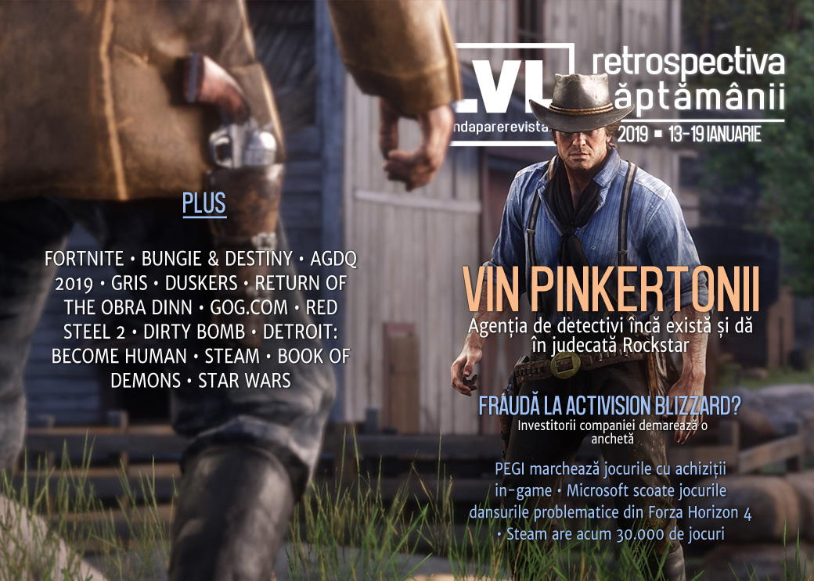

Aflăm săptămâna aceasta că agenția Pinkerton încă există și dau în judecată Rockstar pentru că le-au folosit „imaginea” în Red Dead Redemption II. Investitorii Activision-Blizzard încearcă să afle dacă despărțirea de Bungie a fost rezultatul unei fraude, Unity revine la sentimente mai bune față de Improbable, iar clasificarea PEGI va include și avertismente privind cumpărăturile pe bani reali. Avem și un rezumat al _speedrun_-urilor de la AGDQ 2019, un sumar detaliat al schimbărilor care au venit și urmează să vină la Steam și o retrospectivă a ce înseamnă GOG.com astăzi.

## Ştiri
* Pe Steam sunt acum disponibile peste 30.000 de jocuri. ([PC Gamer](https://www.pcgamer.com/steam-now-has-30000-games/))

* Disputa dintre Unity și Improbable, care a luat amploare [săptămâna trecută](), se încheie, iar Unity își actualizează din nou termenii și condițiile. ([RPS](https://www.rockpapershotgun.com/2019/01/16/unity-relax-their-terms-of-service-after-improbable-dispute/), [PC Gamer](https://www.pcgamer.com/unity-changes-terms-of-service-again-says-improbable-is-no-longer-in-violation/), [Ars Technica](https://arstechnica.com/gaming/2019/01/unity-lets-spatialos-back-in-as-unsupported-third-party-service/), [GameDaily.biz](https://gamedaily.biz/article/517/unity-walks-back-terms-of-service-changes-that-triggered-public-feud-with-improbable), [Shacknews](https://www.shacknews.com/article/109440/improbable-issues-statement-on-long-term-spatialos-support-of-unity), [Gamasutra](http://www.gamasutra.com/view/news/334628/After_a_long_back_and_forth_Improbable_confirms_future_Unity_support_for_SpatialOS.php), [GamesIndustry.biz](https://www.gamesindustry.biz/articles/2019-01-16-unity-updates-tos-following-improbable-debacle))
* Microsoft elimină dansurile „Carlton” și „Floss” din Forza Horizon 4 ([Ars Technica](https://arstechnica.com/gaming/2019/01/microsoft-removes-forza-dances-amid-fortnite-lawsuits/), [Kotaku](https://kotaku.com/microsoft-removes-carlton-floss-dances-from-forza-hori-1831780515), [PC Gamer](https://www.pcgamer.com/forza-horizon-4-drops-the-carlton-and-floss-emotes/), [Shacknews](https://www.shacknews.com/article/109390/forza-horizon-4-ditches-carlton-and-floss-emotes), [The Verge](https://www.theverge.com/2019/1/15/18184168/forza-horizon-4-dance-emotes-fortnite-lawsuits-removal), [PCGamesInsider.biz](https://www.pcgamesinsider.biz/news/68395/forza-horizon-4-puts-its-floss-and-carlton-dances-in-the-pit-lane/), [The Guardian](https://www.theguardian.com/games/2019/jan/17/fortnite-dances-removed-forza-horizon-4))
* Epic repară o breșă de securitate care ar fi expus conturile tuturor celor circa 200 de milioane de jucători de Fortnite. ([Gamasutra](http://www.gamasutra.com/view/news/334524/Epic_fixes_Fortnite_security_flaw_which_left_all_200M_players_vulnerable.php), [Variety](https://variety.com/2019/gaming/news/massive-fortnite-security-hole-allowed-hackers-to-take-over-accounts-eavesdrop-on-calls-1203109556/), [RPS](https://www.rockpapershotgun.com/2019/01/17/fortnite-account-security-hole-fixed/), [GameDaily.biz](https://gamedaily.biz/article/525/epic-patches-security-hack-that-may-have-exposed-more-than-200-million-players-data), [Gamasutra](http://www.gamasutra.com/view/news/334524/Epic_fixes_Fortnite_security_flaw_which_left_all_200M_players_vulnerable.php))
* Investitorii Activision-Blizzard au angajat o firmă de avocatură pentru a demara o investigație privind o posibilă fraudă legată de despărțirea de Bungie, în urma căreia acțiunile companiei au scăzut semnificativ. ([Variety](https://variety.com/2019/gaming/news/activision-blizzard-fraud-bungie-1203108107/), [GameDaily.biz](https://gamedaily.biz/article/511/law-firm-investigates-security-fraud-claims-against-activision-blizzard), [GamesIndustry.biz](https://www.gamesindustry.biz/articles/2019-01-15-law-firm-investigating-activision-blizzard-on-behalf-of-investors))
* Încă mai există și în secolul XXI faimoșii Pinkertons și se pare că i-au dat în judecată pe Rockstar pentru reprezentarea lor în **Red Dead Redemption II**. ([Games Informer](https://www.gameinformer.com/2019/01/14/the-pinkertons-and-rockstar-games-are-fighting-over-red-dead-redemption-ii), [Kotaku](https://kotaku.com/the-pinkertons-are-still-around-suing-over-red-dead-re-1831750643), [Variety](https://variety.com/2019/gaming/news/red-dead-redemption-2-rockstar-pinkerton-lawsuit-1203108019/), [GamesIndustry.biz](https://www.gamesindustry.biz/articles/2019-01-15-rockstar-threatened-with-legal-action-over-red-dead-redemption-2s-pinkerton-agents))
* Sistemul european de clasificare a jocurilor video PEGI va include un nou descriptor de conținut pentru a marca jocurile ce conțin achiziiții in-game, care va începe să apară afișat pe jocurile comercializate până la sfârșitul acestui an. ([GamesIndustry.biz](https://www.gamesindustry.biz/articles/2019-01-16-new-pegi-content-descriptor-for-in-game-purchases))
* ModDB lansează [Modularity](https://modularity.games/), o divizie ce se va ocupa de publicarea jocurilor bazate pe (sau născute din) _modding_. ([Site ModDB](https://www.moddb.com/news/introducing-modularity-our-take-on-games-publishing-with-a-mod-focus), [GamesIndustry.biz](https://www.gamesindustry.biz/articles/2019-01-17-indiedb-moddb-founder-launches-mod-focused-publishing-arm), [PCGamesN](https://www.pcgamesn.com/meeple-station/moddb-indie-publisher-modularity)

## Articole (critică, dev, design)

* [Video games can turn university graduates into better employees](https://www.theguardian.com/education/2019/jan/16/video-games-can-turn-university-graduates-into-better-employees) (The Guardian)
* [The best email I've ever had](https://www.eurogamer.net/articles/2019-01-18-the-best-email-ive-ever-had) (Eurogamer)
* [Video games want us to be enemies. But developers underestimate our humanity](https://www.theguardian.com/commentisfree/2019/jan/14/video-games-want-us-to-be-enemies-but-developers-underestimate-our-humanity) (The Guardian)
* [Resident Evil 2 and why game demos are important](https://www.videogamer.com/features/resident-evil-2-and-why-game-demos-are-important) (VideoGamer)
* [Tale of a 44-year-old Magic: The Gathering virgin](https://venturebeat.com/2019/01/18/tale-of-a-44-year-old-magic-the-gathering-virgin/) (VentureBeat)

### Actualitate
* [The best PCs, gadgets, and future tech of CES 2019](https://arstechnica.com/gadgets/2019/01/the-best-pcs-gadgets-and-future-tech-of-ces-2019/) (Ars Technica)
* [Dark Web Creating &#8216;Thriving Criminal Eco-System&#8217; Around Game](https://variety.com/2019/gaming/news/fortnite-money-laundering-1203108363/) (Variety)

#### Activision - Bungie
* [Bungie Activision Split: The Good And The Bad](https://www.pcinvasion.com/bungie-activision-destiny-predictions/) (PC Invasion)
* [Changing industry economics let Bungie forge a new destiny](https://www.gamesindustry.biz/articles/2019-01-18-changing-industry-economics-let-bungie-forge-a-new-destiny) (GamesIndustry.biz)

#### AGDQ 2019
Recomandări de speedruns:

* [AGDQ 2019’s 10 best speedruns from a record-setting week](https://www.polygon.com/2019/1/13/18180935/agdq-2019-best-speedruns-video-on-demand-money-raised) (Polygon)
* [The Best Speedruns From AGDQ 2019](https://kotaku.com/the-best-speedruns-from-agdq-2019-1831746877) (Kotaku)
* [Check Out The Best Awesome Games Done Quick Runs You Missed](https://www.gameinformer.com/2019/01/14/check-out-the-best-awesome-games-done-quick-runs-you-missed) (Games Informer)
* [Highlights: Awesome Games Done Quick 2019](http://sidequest.zone/2019/01/17/highlights-awesome-games-done-quick-2019/) (Sidequest)

### _Not-a-review_
* [Gris Is The Best Modern Game About Overcoming Trauma](https://www.gameinformer.com/the-virtual-life/2019/01/16/gris-is-the-best-modern-game-about-overcoming-trauma) (Games Informer)
* [How Blood Bowl PC fanatics are taking player-run leagues to the extreme](https://www.eurogamer.net/articles/2019-01-17-the-blood-bowl-fanatics-keeping-a-three-year-old-pc-game-alive) (Eurogamer)
* [Elite’s Distant Worlds 2 travelogue: a week filled with wonder and wreckage](https://www.polygon.com/features/2019/1/18/18187303/elite-dangerous-distant-worlds-2-the-view-dw2) (Polygon)
* [Playing Red Dead Online as a black character means enduring racist garbage](https://www.theverge.com/2019/1/15/18183843/red-dead-online-black-character-racism) (The Verge)
* [GRIS: Her Journey](https://unwinnable.com/2019/01/16/gris-her-journey/) (Unwinnable)
* [Gris and the problem of symbolic hurt](https://unwinnable.com/2019/01/14/gris-and-the-problem-of-symbolic-hurt/) (Unwinnable)
* [Surviving a Dead Galaxy in Duskers](https://unwinnable.com/2019/01/15/surviving-a-dead-galaxy-in-duskers/) (Unwinnable)
* [What a Failed Puzzle Says About the Future of Destiny](https://waypoint.vice.com/en_us/article/gy74a7/what-a-failed-puzzle-says-about-the-future-of-destiny) (Waypoint)
* [The Return](https://problemmachine.wordpress.com/2019/01/19/the-return/) (Problem Machine)

### Industrie
* [Tabletop games dominated Kickstarter in 2018, while video games declined](https://www.polygon.com/2019/1/15/18184108/kickstarter-2018-stats-tabletop-video-games) (Polygon), plus [Ico Partners: Video games see fewer crowdfunded projects, steady amount funded in 2018](https://www.gamesindustry.biz/articles/2019-01-15-video-games-see-fewer-crowdfunded-projects-steady-funding-in-2018) (GamesIndustry.biz)
* [For AR/VR 2.0 to live, AR/VR 1.0 must die](https://gamedaily.biz/article/518/for-ar-vr-20-to-live-ar-vr-10-must-die) (GameDaily.biz)
* [What sort of impact will the new storefronts from Epic, Discord and Kongregate have on the PC retail landscape?](https://www.pcgamesinsider.biz/feature/68400/the-pc-pulse-what-sort-of-impact-will-the-new-storefronts-from-epic-discord-and-kongregate-have-on-the-pc-retail-landscape/) (PCGamesInsider.biz)
* ['Netflix of Gaming' Battle Sees New Entrant With Cloud Firm Antstream](https://gamedaily.biz/article/522/netflix-of-gaming-battle-sees-new-entrant-with-cloud-firm-antstream) (GameDaily.biz)
* [How &#39;Slime Rancher&#39; Made a Ton of Money And Stuck to 40-Hour Workweeks](https://waypoint.vice.com/en_us/article/d3ba3m/how-slime-rancher-made-a-ton-of-money-and-stuck-to-40-hour-workweeks) (Waypoint)
* [The Rise of The Influencer — And Why Epics New Store Approach Is Huge](https://medium.com/@merryh/the-rise-of-the-influencer-and-why-epics-new-store-approach-is-huge-e57d1bccb2c7) (Medium)
* [Franchises are the endgame](https://www.gamesindustry.biz/articles/2019-01-14-franchises-are-the-endgame-opinion) (GamesIndustry.biz)

### Istorie, retrospectivă
* [GOG's 10 year journey to bring old games back to life](https://www.pcgamer.com/gogs-10-year-journey-to-bring-old-games-back-to-life/) (PC Gamer)
* [Meditations: How 365 Microgames became a digital gaming art installation](https://gamedaily.biz/article/509/meditations-how-365-microgames-became-a-digital-gaming-art-installation) (GameDaily.biz)
* [LucasArts Made Far More Star Wars Games Than EA in the 2000s, And That&#039;s What Ultimately Killed It](https://www.usgamer.net/articles/lucasarts-made-far-more-star-wars-games-than-ea-in-the-2000s) (USgamer)
* [EA’s Troubled Decade Of Star Wars Games](https://kotaku.com/ea-s-troubled-decade-of-star-wars-games-1831807493) (Kotaku)
* [11 Years On, Mirror&#39;s Edge Is Still A Masterpiece](https://kotaku.com/11-years-on-mirrors-edge-is-still-a-masterpiece-1831661814) (Kotaku)
* [The characters of Baldur's Gate are the cornerstone of the series](https://www.pcgamer.com/the-characters-of-baldurs-gate-are-the-cornerstone-of-the-series/) (PC Gamer)
* [The Blend of East and West in Red Steel 2](https://medium.com/mammon-machine-zeal/the-blend-of-east-and-west-in-red-steel-2-243f06c694ec) (ZEAL – Medium)
* [Life Off the Grid, Part 1: Making Ultima Underworld The Digital Antiquarian](https://www.filfre.net/2019/01/life-off-the-grid-part-1-making-ultima-underworld/) (The Digital Antiquarian)

### Dev, making of
* [How 40K: Mechanicus reinvented tactics for Warhammer&#8217;s cyber-monks](https://www.rockpapershotgun.com/2019/01/16/how-40k-mechanicus-reinvented-tactics-for-warhammers-cyber-monks/) (RPS)
* [The Design of Dirty Bomb](https://www.splashdamage.com/news/the-design-of-dirty-bomb/) (Site Splash Damage) (TL;DR pe [RPS)](https://www.rockpapershotgun.com/2019/01/18/splash-damage-release-dirty-bomb-design-document-free/)
* [A closer look at the deck-building hack-and-slash success,  Book of Demons ](http://www.gamasutra.com/view/news/334320/A_closer_look_at_the_deckbuilding_hackandslash_success_Book_of_Demons.php) (Gamasutra)
* [A Morale Victory Part 2: Making Choices Matter](https://remptongames.com/2019/01/19/a-morale-victory-part-2-making-choices-matter/) (Rempton Games)
* [How Video Games Do Feedback Well (and Poorly)](http://www.psychologyofgames.com/2019/01/how-video-games-do-feedback-well-and-poorly/) (The Psychology of Video Games)
* [In The Games Of Madness: Thoughts on Detroit: Become Human](https://frictionalgames.blogspot.com/2019/01/thoughts-on-detroit-become-human.html) (Frictional Games)
* [Balancing beauty and meaning in Gris](https://www.gamesindustry.biz/articles/2019-01-15-the-beauty-and-meaning-of-gris) (GamesIndustry.biz)
* (Video) [Video: The highs and lows of  Hitman's  episodic release](http://www.gamasutra.com/view/news/334723/Video_The_highs_and_lows_of_Hitmans_episodic_release.php) (Gamasutra)

### Design, world-building, artă
* [Through the Dragon Age: Inquisition tarot cards I found art](https://www.eurogamer.net/articles/2019-01-12-through-the-dragon-age-inquisition-tarot-cards-i-found-art) (Eurogamer)
* [Artists Are Making Awesome &quot;Paintings&quot; In Source Filmmaker](https://kotaku.com/artists-are-making-awesome-paintings-in-source-filmma-1831626905) (Kotaku)
* [Bike Girl](https://kotaku.com/bike-girl-1831724695) (Kotaku)
* [Last Drinks](https://kotaku.com/last-drinks-1831791371) (Kotaku)

## Anunţuri şi lansări de jocuri
### Anunţate
* **Elsweyr**, un nou expansion pentru **The Elder Scrolls Online** ([Games Informer](https://www.gameinformer.com/2019/01/15/the-elder-scrolls-online-announces-newest-expansion-elsweyr))
* **Retribution**, un nou expansion pentru **Galactic Civilizations 3** ([PC Gamer](https://www.pcgamer.com/galactic-civilizations-3-story-will-conclude-in-the-new-retribution-expansion/))
* **Power Rangers Battle for the Grid** ([DSOGaming ](https://www.dsogaming.com/news/power-rangers-battle-for-the-grid-is-a-new-fighting-game-first-gameplay-trailer-leaked/))
* **Creeper World 4** ([PC Gamer](https://www.pcgamer.com/overcoming-alien-goo-in-full-3d-looks-great-in-creeper-world-4-trailer/))
* **Sea Salt** ([RPS](https://www.rockpapershotgun.com/2019/01/17/lovecraftian-action-strategy-game-sea-salt-launches-spring/))
* **Dysmantle** ([Destructoid](https://www.destructoid.com/dysmantle-hopes-to-survive-the-apocalypse-by-breaking-everything-539157.phtml))

### Acum cu dată de lansare
* **The Hong Kong Massacre**: 22 ianuarie ([PC Gamer](https://www.pcgamer.com/a-wild-hong-kong-massacre-trailer-reveals-the-long-awaited-launch-date/))
* **Spinnortality**: 1 februarie ([Shacknews](https://www.shacknews.com/article/109354/cyberpunk-management-sim-spinnortality-launches-next-month))
* **Rainswept**: 1 februarie ([PC Gamer](https://www.pcgamer.com/small-town-murder-mystery-adventure-rainswept-gets-a-release-date-and-a-new-trailer/))
* **Devotion**: 19 februarie ([Games Informer](https://www.gameinformer.com/2019/01/13/psychological-horror-game-devotion-comes-to-steam-next-month))
* **Outward**: 26 martie ([DSOGaming ](https://www.dsogaming.com/news/open-world-survival-rpg-outward-will-release-on-march-26th/))

### Anulate
*  [EA Cancels Open-World Star Wars Game](https://kotaku.com/ea-cancels-open-world-star-wars-game-1831786371) (Kotaku)

### Lansate
* 15 ianuarie: episodul 3 din **The Walking Dead: The Final Season** ([Steam](https://store.steampowered.com/app/866800/The_Walking_Dead_The_Final_Season/))
* 15 ianuarie: **Vane** ([PlayStation Store](https://store.playstation.com/en-ro/product/EP1590-CUSA13379_00-00FFABVANEEFIGSJ))
* 15 ianuarie: **My Time At Portia** (iese din early access) ([Steam](https://store.steampowered.com/app/666140/My_Time_At_Portia/), [gog.com](https://www.gog.com/game/my_time_at_portia))
* 15 ianuarie: **Onimusha: Warlords** ([Steam](https://store.steampowered.com/app/761600/Onimusha_Warlords/))
* 17 ianuarie: **while True: learn()** ([Steam](https://store.steampowered.com/app/619150/while_True_learn/))
* 17 ianuarie: **Breach** (early access) ([RPS](https://www.rockpapershotgun.com/2019/01/17/asymmetric-action-rpg-breach-enters-paid-early-access/), [Steam](https://store.steampowered.com/app/421650/Breach/))
* 17 ianuarie: **YIIK: A Postmodern RPG** ([Steam](https://store.steampowered.com/app/459080/YIIK_A_Postmodern_RPG/), [gog.com](https://www.gog.com/news/release_yiik_a_postmodern_rpg))
* 17 ianuarie: **Feudal Alloy** ([Steam](https://store.steampowered.com/app/699670/Feudal_Alloy/), [gog.com](https://www.gog.com/game/feudal_alloy))
* 17 ianuarie: **Archeo: Shinar** (early access) ([gog.com](https://www.gog.com/game/archeo_shinar))
* 18 ianuarie: **Travis Strikes Again: No More Heroes** ([Nintendo Store](https://www.nintendo.com/games/detail/travis-strikes-again-no-more-heroes-switch))

## Prăvălii de jocuri
### Știri
* Steam publică un blog post detaliat în care face retrospectiva anului 2018 și anunță câteva din planurile pentru 2019 ([Steam Community](https://steamcommunity.com/groups/steamworks/announcements/detail/1697194621363928453)). TL;DR:
  * [Steam in review for 2018 and Valve&#8217;s plans for 2019](https://www.rockpapershotgun.com/2019/01/14/valves-plans-for-steam-in-2019-and-beyond/) (RPS)
  * [Valve Outlines Its Plans For Steam In 2019](https://kotaku.com/valve-outlines-its-plans-for-steam-in-2019-1831753064) (Kotaku)
  * [Steam delivered 15 billion gigabytes of data in 2018](https://www.pcgamer.com/steam-delivered-15-billion-gigabytes-of-data-in-2018/) (PC Gamer)
  * [Steam now has 90 million monthly users](https://www.pcgamer.com/steam-now-has-90-million-monthly-users/) (PC Gamer)
  * [Valve announces 8 changes coming to Steam in 2019](https://www.pcgamer.com/valve-announces-8-changes-coming-to-steam-in-2019/) (PC Gamer)
  * [Half of all games on Steam came out since 2017](https://www.rockpapershotgun.com/2019/01/15/how-many-games-are-on-steam/) (RPS)
  * [Valve wants to overhaul discoverability on Steam with machine learning this year](http://www.gamasutra.com/view/news/334332/Valve_wants_to_overhaul_discoverability_on_Steam_with_machine_learning_this_year.php) (Gamasutra)
* [Influencers are one of the main 'discovery engines' on the Epic Games Store](https://www.pcgamer.com/influencers-are-one-of-the-main-discovery-engines-on-the-epic-games-store/) (PC Gamer)
* [How the Epic Games Store compares to Steam right now](https://www.pcgamer.com/how-the-epic-games-store-compares-to-steam-right-now/) (PC Gamer)

### Jocuri noi în catalog
* [Star Control: Origins Lands Back On Steam](https://www.pcinvasion.com/star-control-origins-back-on-steam/) (PC Invasion)
* [We Happy Few, Shadow of Mordor among next Xbox Game Pass additions](https://www.eurogamer.net/articles/2019-01-16-we-happy-few-shadow-of-mordor-among-next-xbox-game-pass-additions) (Eurogamer)

### Jocuri gratis și free weekend
* [Call of Duty Black Ops 4&#8217;s battle royale mode, Blackout, is free to play now until January 24th](https://www.dsogaming.com/news/call-of-duty-black-ops-4s-battle-royale-mode-blackout-is-free-to-play-now-until-january-24th/) (DSOGaming )
* [Dirty Bomb is officially free to play](https://www.shacknews.com/article/109451/dirty-bomb-is-officially-free-to-play) (Shacknews)

### Reduceri și promoții
* [The new Humble Bundle features Gang Beasts, Everything, Gnog, and more](https://www.pcgamer.com/the-new-humble-bundle-features-gang-beasts-everything-gnog-and-more/) (PC Gamer)
* [Humble’s Winter Sale has some cool deals for a snowy weekend](https://www.pcgamesn.com/humble/winter-sale-2019) (PCGamesN)

---

{}
**Retrospectiva săptămânii** este rubrica duminicală în care trecem în revistă evenimentele săptămânii de pe frontul de gaming: știri şi articole (scrise de alții, bineînțeles, că e mai ușor aşa), industrie, lansări, oferte de jocuri, toate numai de savurat la cafeaua de duminică dimineața.

De asemenea, rubrica e deschisă oricui vrea și poate contribui. Dacă ai citit vreun articol sau vreo știre interesantă și crezi că merită incluse în retrospectiva săptămânii, te așteptăm pe forum pe unul dintre topicurile dedicate: [Știri](https://forum.candaparerevista.ro/viewtopic.php?f=4&t=46), [Articole](https://forum.candaparerevista.ro/viewtopic.php?f=4&t=206), [Gaming România](https://forum.candaparerevista.ro/viewtopic.php?f=4&t=1622)].
{}
