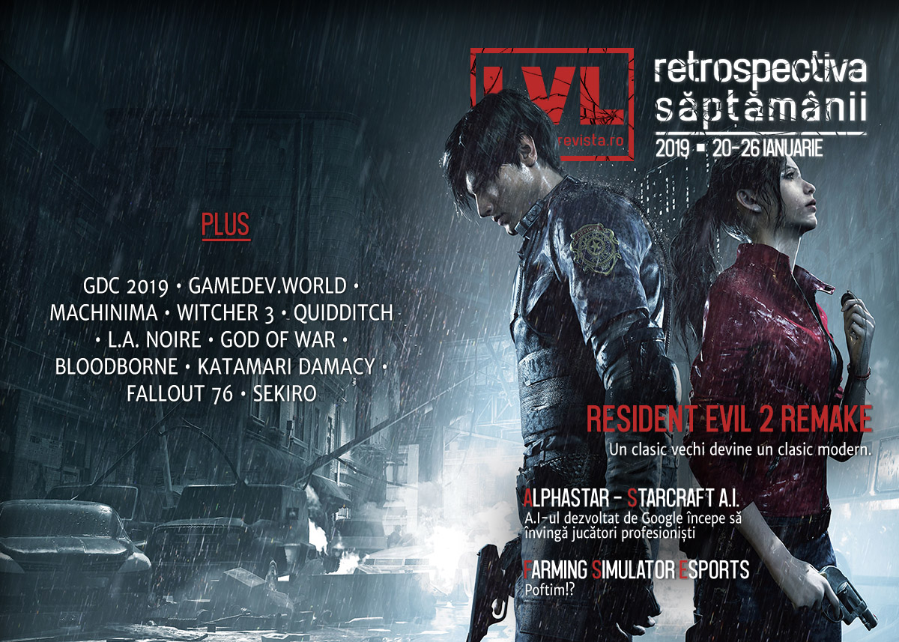

O săptămână cu evenimente mai puține, dar însemnate. Chestionarul GDC ia pulsul dezvoltatorilor de jocuri, A.I.-ul dezvoltat de Google să joace StarCraft II e acum suficient de capabil încât să învingă jucători profesioniști, vom avea competiții cu premii pentru Farming Simulator și, desigur, Capcom lansează remake-ul pentru Resident Evil 2 care e foarte bine primit.

## Ştiri
* Netflix continuă șirul adaptărilor după jocuri video cu o producție bazată pe seria Resident Evil. ([Ars Technica](https://arstechnica.com/gaming/2019/01/netflix-is-linked-to-a-resident-evil-live-action-tv-series/), [Games Informer](https://www.gameinformer.com/gamer-culture/2019/01/24/report-resident-evil-series-coming-to-netflix), [Shacknews](https://www.shacknews.com/article/109534/netflix-reportedly-working-on-a-resident-evil-series))
* Rami Ismael (of Vlambeer fame) anunță o conferință dedicată jocurilor, un proiect la care lucrează de 4 ani. **gamedev.world** va avea loc în iunie și va avea un profil global, toate prezentările fiind traduse în mai multe limbi. ([Ars Technica](https://arstechnica.com/gaming/2019/01/in-response-to-visa-woes-indie-game-devs-create-their-own-virtual-gaming-expo/), [Shacknews](https://www.shacknews.com/article/109538/gamedevworld-will-bring-the-gaming-world-together-this-june), [Variety](https://variety.com/2019/gaming/news/rami-ismail-gamedevworld-conference-1203117939/))
* Proiectul de inteligență artificală AlphaStar dezvoltat de Google DeepMind pentru a juca StarCraft II a ajuns la performanța de a învinge jucători profesioniști. ([Vox](https://www.vox.com/future-perfect/2019/1/24/18196177/ai-artificial-intelligence-google-deepmind-starcraft-game), [Kotaku](https://kotaku.com/googles-deepmind-ai-just-beat-two-pros-at-starcraft-ii-1832034863), [PC Gamer](https://www.pcgamer.com/deepminds-alphastar-ai-is-one-of-the-worlds-best-starcraft-2-protoss-players/), [The Verge](https://www.theverge.com/2019/1/24/18196135/google-deepmind-ai-starcraft-2-victory), [Gamasutra](http://www.gamasutra.com/view/news/335138/DeepMind_AI_faces_off_against_and_defeats_StarCraft_II_pro_players.php))
* Ammobox Studios, producătorii jocului **Eximius: Seize the Frontline**, un hibrid FPS / RTS, au folosit o cerere DMCA pentru a bloca vânzarea propriului joc, după ce compania care se ocupa de publicarea acestuia nu le-a plătit nimic din încasările jocului în cele 6 luni de la lansare. ([PC Gamer](https://www.pcgamer.com/the-studio-behind-this-fps-rts-hybrid-has-successfully-dmcaed-its-own-game/), [GameDaily.biz](https://gamedaily.biz/article/534/indie-developer-invokes-dmca-against-its-own-game-eximius), [GamesIndustry.biz](https://www.gamesindustry.biz/articles/2019-01-21-developer-uses-dmca-to-reclaim-steam-page))
* Studioul Giants Software a anunțat că va punele bazele unei competiții esport profesioniste pentru jocurile din seria... **Farming Simulator**. ([Kotaku](https://kotaku.com/competitive-virtual-farming-is-getting-its-own-esports-1831991345), [Shacknews](https://www.shacknews.com/article/109528/giants-software-debuts-farming-simulator-league), [The Verge](https://www.theverge.com/2019/1/23/18194259/farming-simulator-league-esports-prizes-giants-software))
* Piața jocurilor video din Statele Unite a atins suma record de 43,4 miliarde de dolari în 2018. ([Shacknews](https://www.shacknews.com/article/109484/us-video-game-sales-hit-434-billion-in-2018-a-new-record), [Variety](https://variety.com/2019/gaming/news/americans-spent-more-than-43-billion-on-video-games-in-2018-1203114642/))
* GDC a dat publicității rezultatele chestionarului pe care îl propun anual dezvoltatorilor de jocuri. Anul acesta au primit aproape 4.000 de răspunsuri, din care se conturează câteva aspecte: ([GDC](https://www.gdconf.com/news/nearly-50-devs-support-unionization-new-gdc-state-industry-report), [Variety](https://variety.com/2019/gaming/news/gdc-2019-survey-1203115568/), [TechSpot](https://www.techspot.com/news/78435-gdc-2019-survey-reveals-many-game-devs-want.html))
  * ...comisionul de 30% perceput de Steam nu este justificat ([PCGamesInsider.biz](https://www.pcgamesinsider.biz/news/68417/developers-dont-think-valves-30-per-cent-rev-share-is-justified-but-steam-is-still-the-most-popular-pc-storefront/), [GamesIndustry.biz](https://www.gamesindustry.biz/articles/2019-01-24-just-6-percent-of-devs-say-steam-earns-its-30-percent-cut-survey), [Polygon](https://www.polygon.com/2019/1/24/18196154/steam-developers-revenue-epic-games-store))
  * ...majoritatea dezvoltatorilor sunt de acord cu ideea unui sindicat al lucrătorilor din domeniu ([The Verge](https://www.theverge.com/2019/1/24/18194322/gdc-survey-unions-game-developers), [GamesIndustry.biz](https://www.gamesindustry.biz/articles/2019-01-24-only-16-percent-of-devs-anti-union-survey), [TechRaptor](https://techraptor.net/content/game-developers-want-to-unionize-according-to-gdc-year-in-review-2019))
  * ...un procent semnificativ de dezvoltatori (18%) lucrează la jocuri next-gen pentru platforme încă neanunțate, iar PC-ul rămâne platforma preferată ([Games Informer](https://www.gameinformer.com/2019/01/24/gdc-survey-reveals-18-percent-of-developers-working-on-next-gen-games), [DSOGaming ](https://www.dsogaming.com/news/pc-remains-the-best-platform-as-more-developers-are-interested-making-games-for-it/))

## Articole (critică, dev, design)
* [Games Played A Big Role In Polar Exploration](https://kotaku.com/games-played-a-big-role-in-polar-exploration-1831911470) (Kotaku)
* [The promise of a game world you can touch](https://www.eurogamer.net/articles/2019-01-23-the-promise-of-a-game-world-you-can-touch) (Eurogamer)
* [Can video games save motorsport?](https://www.eurogamer.net/articles/2019-01-25-can-video-games-save-motorsport) (Eurogamer)
* [&#39;Battlefield V&#39; Players Are Using Shitty Graphics for a Competitive Edge](https://motherboard.vice.com/en_us/article/43zdnb/battlefield-v-players-are-using-shitty-graphics-for-a-competitive-edge) (Motherboard)
* [Resident Evil 2 and The Case for the Short Blockbuster](https://www.usgamer.net/articles/resident-evil-2-and-the-case-for-the-short-blockbuster) (USgamer)
* [Analyzing Fictional Games: Quidditch](https://remptongames.com/2019/01/26/analyzing-fictional-games-quidditch/) (Rempton Games)
* [In the Future, Video Games Will Care About You](https://medium.com/s/story/in-the-future-video-games-will-care-about-you-2bc852357d0b) (Medium)
* [Meet the designers who make a living building tiny houses on The Sims](https://www.fastcompany.com/90295855/meet-the-designers-who-make-a-living-building-tiny-houses-on-the-sims) (Fast Company)

### Actualitate
* [Machinima is a good reminder of just how disposable the internet is](https://www.pcgamer.com/machinima-is-a-good-reminder-of-just-how-disposable-the-internet-is/) (PC Gamer)
* [How a 57-hour Donkey Kong game struck a blow against online toxicity](https://www.theguardian.com/games/2019/jan/22/how-a-57-hour-donkey-kong-twitch-stream-struck-a-blow-against-gamergate) (The Guardian)
* [Introducing Gamedev.world, the first global game developer conference](https://www.gamesindustry.biz/articles/2019-01-24-introducing-gamedev-world-the-first-global-game-developer-conference) (GamesIndustry.biz)
* [A closer look at the Google AI that&#8217;s mastering StarCraft II](https://www.pcgamesn.com/starcraft-2/starcraft-2-deepmind-report) (PCGamesN)

### _Not-a-review_
* [Bloodborne Has Clicked For Me (And It Only Took Four Years)](https://kotaku.com/bloodborne-has-clicked-for-me-and-it-only-took-four-ye-1831951256) (Kotaku)
* [The Big Daddies Are The Best Part Of BioShock](https://kotaku.com/the-big-daddies-are-the-best-part-of-bioshock-1831910726) (Kotaku)
* [The Wildest Ride in &#39;Parkitect&#39; is Predatory Lending](https://waypoint.vice.com/en_us/article/eved9p/parkitect-loan-predatory-lending) (Waypoint)
* [God of War (2018)](https://www.critical-distance.com/2019/01/23/god-of-war-2018/) (Critical-Distance)
* [What Keeps Fallout 76&#039;s Superfans Coming Back After All the Negativity](https://www.usgamer.net/articles/fallout-76-superfans-community-loot-and-mystery) (USgamer)
* [The Witcher 3 and Geralt of Rivia - finding humanity in the White Wolf](https://www.vg247.com/2019/01/21/the-witcher-3-and-geralt-of-rivia-finding-humanity-in-the-white-wolf/) (VG247)
* [L.A. Noire and Authenticity for Authenticity’s Sake](https://medium.com/@joethehub/l-a-noire-and-authenticity-for-authenticitys-sake-75ac9a7a10ff) (Medium)

#### Resident Evil 2
* [Resident Evil 2&rsquo;s darkness is weirdly comforting](https://www.videogamer.com/features/resident-evil-2s-darkness-is-weirdly-comforting) (VideoGamer)
* [The many selves of Resident Evil 2's police station](https://www.eurogamer.net/articles/2019-01-22-how-resident-evil-2s-map-uses-familiarity-against-you) (Eurogamer)
* [&quot;Uncanny, Real,&quot; by Reid McCarter](http://www.bulletpointsmonthly.com/2019/01/25/uncanny-real/) (Bullet Points Monthly)
* [How realistic is Resident Evil 2? We asked a cop and a paramedic](https://www.pcgamesn.com/resident-evil-2/resident-evil-2-remake-realism) (PCGamesN)
* [Resident Evil 2 remake's Tyrant is wonderfully terrifying - and he can do one](https://www.eurogamer.net/articles/2019-01-26-resident-evil-2-remakes-tyrant-is-wonderfully-terrifying-and-he-can-do-one) (Eurogamer)

### Industrie
* [An Uncertain Destiny: Bungie's Future Post-Activision Breakup](https://techraptor.net/content/an-uncertain-destiny-bungies-future-post-activision-breakup) (TechRaptor)
* [Analysts Weigh In On The Year Ahead For Sony And The Future Of PlayStation](https://gamedaily.biz/article/544/analysts-weigh-in-on-the-year-ahead-for-sony-and-the-future-of-playstation) (GameDaily.biz)
* [Resident Evil 2 sums up Capcom's gameplan: Giving you more of the same (but better)](https://gamedaily.biz/article/546/resident-evil-2-sums-up-capcoms-gameplan-giving-you-more-of-the-same-but-better) (GameDaily.biz)
* [Our Full Hidetaka Miyazaki Sekiro: Shadows Die Twice Interview](https://www.gameinformer.com/2019/01/25/our-full-hidetaka-miyazaki-sekiro-shadows-die-twice-interview) (Games Informer)

### Istorie, retrospectivă
* [How Resident Evil 2 fell apart, then became one of Capcom’s biggest hits](https://www.polygon.com/2019/1/21/18187446/resident-evil-2-history-capcom-hideki-kamiya) (Polygon)
* [The Master Chief Collection Is What Happens When A Studio Doesn’t Give Up On A Game](https://kotaku.com/the-master-chief-collection-is-what-happens-when-a-stud-1831925439) (Kotaku)
* [Medal of Honor: Airborne, and its many innovations, were buried by Call of Duty](https://www.polygon.com/2019/1/25/18196278/medal-of-honor-airborne-call-of-duty-modern-warfare) (Polygon)
* [Remembering Katamari Damacy](http://www.firstpersonscholar.com/remembering-katamari-damacy/) (First Person Scholar)

### Dev, making of
* [Lucas Pope on the challenge of creating Obra Dinn's 1-bit aesthetic](https://www.pcgamer.com/lucas-pope-on-the-challenge-of-creating-obra-dinns-1-bit-aesthetic/) (PC Gamer)
* [How the  Distraint  series stands out in the crowded horror genre](http://www.gamasutra.com/view/news/334519/How_the_Distraint_series_stands_out_in_the_crowded_horror_genre.php) (Gamasutra)
* [The Conflicting Design of the Zelda-Rogue](http://www.gamasutra.com/blogs/JoshBycer/20190118/334458/The_Conflicting_Design_of_the_ZeldaRogue.php) (Gamasutra)
* [MelodyVR is rebuilding its VR concert app for a future Oculus device](https://venturebeat.com/2019/01/26/melodyvr-is-rebuilding-its-vr-concert-app-for-a-future-oculus-device/) (VentureBeat)

### Design, world-building, artă
* [City 17, Dunwall, and now Project C: Viktor Antonov&#8217;s &#8220;savage land&#8221;](https://www.pcgamesn.com/project-c/project-c-viktor-antonov-city-17-dunwall) (PCGamesN)
* [Arise, Lukas Skywalking](https://kotaku.com/arise-lukas-skywalking-1831966992) (Kotaku)

## Anunţuri şi lansări de jocuri

* Crytek și Improbable lucrează la un joc multiplayer AAA ce va folosi CryEngine și SpatialOS. ([Variety](https://variety.com/2019/gaming/news/crytek-improbable-new-aaa-game-1203115577/), [Shacknews](https://www.shacknews.com/article/109507/crytek-and-improbable-announce-spatialos-partnership-new-aaa-game), [GamesIndustry.biz](https://www.gamesindustry.biz/articles/2019-01-23-crytek-and-improbable-bringing-spatialos-to-cryengine), [DSOGaming ](https://www.dsogaming.com/news/crytek-and-improbable-are-working-on-a-triple-a-multiplayer-game-using-cryengine-and-spatialos/), [PCGamesInsider.biz](https://www.pcgamesinsider.biz/news/68416/cryengine-spatialos-game-development-kit-in-the-works/))

### Anunţate
* **SteamWorld Quest** ([Gamer Matters](https://gamermatters.com/steamworld-quest-announced-a-new-rpg-card-game-coming-to-nintendo-switch-first/))
* **Last Oasis** ([RPS](https://www.rockpapershotgun.com/2019/01/23/last-oasis-is-an-mmo-about-nomadic-tribes-in-wooden-mechs/))

### Acum cu dată de lansare
* **Subnautica: Below Zero** (early access): 30 ianuarie ([Destructoid](https://www.destructoid.com/subnautica-below-zero-is-about-to-begin-its-early-access-voyage-540252.phtml))
* **Wargroove**: 1 februarie ([PC Gamer](https://www.pcgamer.com/wargroove-gets-a-release-date-and-its-next-week/))
* **Yakuza Kiwami**: 19 februarie ([Destructoid](https://www.destructoid.com/yakuza-kiwami-pc-reveals-its-february-release-date-in-a-fun-way-539727.phtml))
* **Bannermen**: 21 februarie ([TechRaptor](https://techraptor.net/content/bannermen-releasing-this-february))
* **Generation Zero**: 26 martie ([PC Gamer](https://www.pcgamer.com/generation-zero-the-retro-swedish-killer-robot-open-world-shooter-is-coming-in-march/))
* **A Plague Tale**: 14 mai ([Eurogamer](https://www.eurogamer.net/articles/2019-01-24-bleak-14th-century-single-player-co-op-adventure-a-plague-tale-is-out-in-may))

### Amânate
* Producția lui **Metroid Prime 4** va fi reluată de la zero de către un alt studio. ([IGN](https://www.ign.com/articles/2019/01/25/metroid-prime-4-development-restarting-from-the-beginning))
* **Anno 1800**: 16 aprilie în loc de 26 februarie ([PC Gamer](https://www.pcgamer.com/anno-1800-release-date/))
* **PlanetSide Arena**: 26 martie în loc de 29 ianuarie ([PC Gamer](https://www.pcgamer.com/planetside-arena-delayed-until-march-closed-beta-launches-next-week/))

### Lansate
* 22 ianuarie: **AT SUNDOWN: Shots in the Dark** ([Steam](https://store.steampowered.com/app/419700/AT_SUNDOWN_Shots_in_the_Dark/))
* 23 ianuarie: **CHAOS;CHILD** ([Steam](https://store.steampowered.com/app/970570/CHAOSCHILD/))
* 23 ianuarie: **Slay the Spire** a ieșit din early access ([Steam](https://store.steampowered.com/app/646570/Slay_the_Spire/))
* 23 ianuarie: **Jon Shafer's At the Gates** ([Steam](https://store.steampowered.com/app/241000/Jon_Shafers_At_the_Gates/))
* 24 ianuarie: **Pikuniku** ([Steam](https://store.steampowered.com/app/572890/Pikuniku/), [gog.com](https://www.gog.com/game/pikuniku))
* 24 ianuarie: **Battlefleet Gothic: Armada 2** ([Steam](https://store.steampowered.com/app/573100/Battlefleet_Gothic_Armada_2/))
* 25 ianuarie: **Resident Evil 2 / Biohazard RE:2** ([Steam](https://store.steampowered.com/app/883710/RESIDENT_EVIL_2__BIOHAZARD_RE2/))

## Prăvălii de jocuri
* [So You Want To Compete With Steam: Epic, Discord, Kartridge, etc](https://www.fortressofdoors.com/so-you-want-to-compete-with-steam-2/) (Fortress of Doors)
* [Switch? Steam? Indie Devs Pick the Best Online Store](https://www.usgamer.net/articles/switch-steam-indie-devs-pick-the-best-online-store) (USgamer)

### Știri
* [PlayStation Now service to start rolling out across further European countries](https://www.destructoid.com/playstation-now-service-to-start-rolling-out-across-further-european-countries-540031.phtml) (Destructoid)
* [Leaked dates say Steam Lunar New Year Sale will run February 4 to 11](https://www.pcgamer.com/the-steam-lunar-new-year-sale-is-returning-in-early-february/) (PC Gamer)

### Jocuri noi în catalog
* [Pikuniku and other Devolver Digital games are free with Twitch Prime](https://www.destructoid.com/pikuniku-and-other-devolver-digital-games-are-free-with-twitch-prime-539838.phtml) (Destructoid)

### free weekenduri
* [The Jackbox Party Pack 1 is free on Epic Games Store](https://www.shacknews.com/article/109517/the-jackbox-party-pack-1-is-free-on-epic-games-store) (Shacknews)
* [Endless Space 2 is free for the weekend, the original is free to keep](https://www.pcgamer.com/endless-space-2-is-free-for-the-weekend-the-original-is-free-to-keep/) (PC Gamer)

### Reduceri și promoții
* [There's a host of Steam key sales on Fanatical right now](https://www.pcgamer.com/theres-a-host-of-steam-key-sales-on-fanatical-right-now/) (PC Gamer)
* [Get Tyranny, Shadow Tactics, Pillars of the Earth, and more in the new Humble Bundle](https://www.pcgamer.com/get-tyranny-shadow-tactics-pillars-of-the-earth-and-more-in-the-new-humble-bundle/) (PC Gamer)
* [GOG is offering a free PC game and 70 percent off The Witcher 3 in a new ‘Hot Sale’](https://www.polygon.com/deals/2019/1/23/18194404/gog-sale-free-game-distraint-the-witcher-3-pc) (Polygon)
* [Highlights of the GOG and Green Man Gaming sales](https://www.eurogamer.net/articles/2019-01-25-januarys-best-pc-games-deals-so-far) (Eurogamer)
* [Fanatical Reaper Bundle Includes Homeworld: Remastered Collection For $4.99](https://techraptor.net/content/fanatical-reaper-bundle-includes-homeworld-remastered-collection-for-4-99) (TechRaptor)
* [Nutaku 4th Birthday Celebration Has Gold Discounts and Great Game Deals](https://techraptor.net/content/nutaku-4th-birthday-celebration) (TechRaptor)

---

{}
**Retrospectiva săptămânii** este rubrica duminicală în care trecem în revistă evenimentele săptămânii de pe frontul de gaming: știri şi articole (scrise de alții, bineînțeles, că e mai ușor aşa), industrie, lansări, oferte de jocuri, toate numai de savurat la cafeaua de duminică dimineața.

De asemenea, rubrica e deschisă oricui vrea și poate contribui. Dacă ai citit vreun articol sau vreo știre interesantă și crezi că merită incluse în retrospectiva săptămânii, te așteptăm pe forum pe unul dintre topicurile dedicate: [Știri](https://forum.candaparerevista.ro/viewtopic.php?f=4&t=46), [Articole](https://forum.candaparerevista.ro/viewtopic.php?f=4&t=206), [Gaming România](https://forum.candaparerevista.ro/viewtopic.php?f=4&t=1622)].
{}
