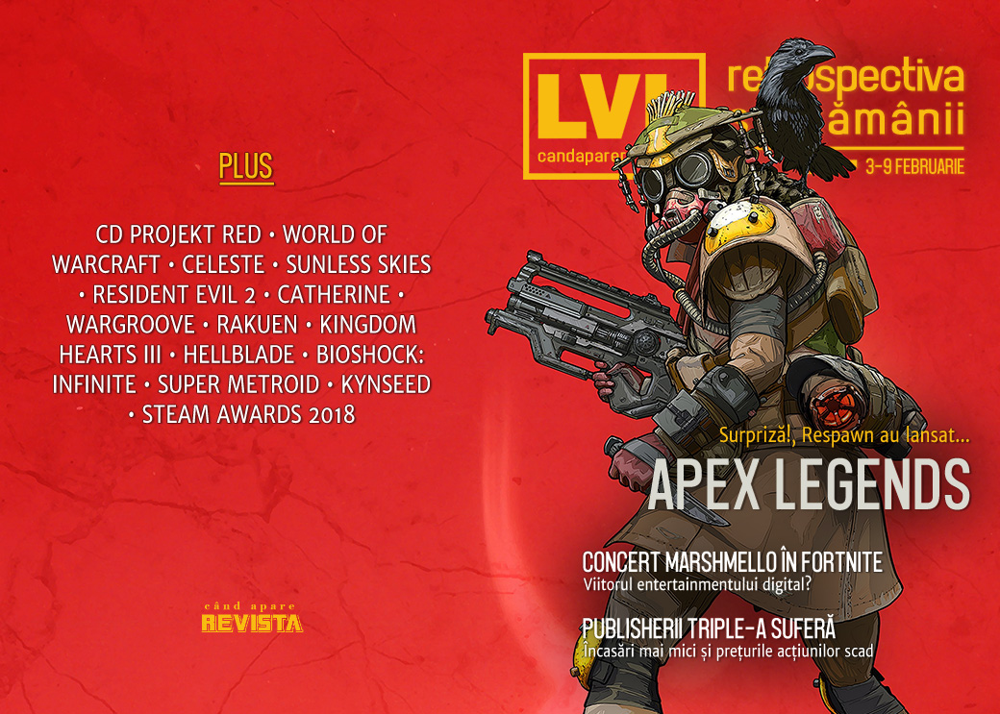

Respawn lansează pe neașteptate un joc care e și nu e Titanfall, ba mai mult, e battle royale care se ia la trântă cu Fortnite. Între timp, Fortnite a organizat un concert virtual la care au luat parte 10 milioane de jucători, OpenCritic va avertiza în privința loot box-urilor din jocuri, marii publisheri AAA raportează cifre și măsuri dureroase, iar Steam anunță câștigătorii Steam Awards 2018 și au (încă) un sale.

Linkuri rapide:

* [Știri](#ştiri)
* [Articole (critică, dev, design)](#articole-critică-dev-design)
* [Anunţuri şi lansări de jocuri](#anunţuri-şi-lansări-de-jocuri)
* [Prăvălii de jocuri](#prăvălii-de-jocuri)

## Ştiri

### Apex Legends

* EA și Respawn au anunțat **Apex Legends**, un _battle royale_ plasat în universul Titanfall, doar că fără mechs și parkour. Și care a fost apoi lansat imediat după ce a fost anunțat... ([Games Informer](https://www.gameinformer.com/2019/02/04/respawn-reveals-and-releases-apex-legends-a-battle-royale-game-set-in-titanfalls))
* ...și care a ajuns la 3 milioane de jucători în prima zi după lansare... ([Destructoid](https://www.destructoid.com/-update-apex-legends-hits-one-million-players-in-less-than-a-day-541697.phtml), [PCGamesInsider.biz](http://www.pcgamesinsider.biz/news/68460/updated-apex-legends-had-close-to-3m-unique-users-in-first-24-hours/))
* ...și la 10 milioane de jucători în 3 zile. ([The Verge](https://www.theverge.com/2019/2/7/18216061/apex-legends-10-million-players), [Variety](https://variety.com/2019/gaming/news/apex-legends-respawn-stats-1203131982/), [PCGamesInsider.biz](https://www.pcgamesinsider.biz/news/68485/titanfall-battle-royale-game-apex-legends-attracted-10m-people-in-first-three-days/), [Shacknews](https://www.shacknews.com/article/109803/apex-legends-tops-10-million-players-one-million-concurrent))
* Succesul rapid și neașteptat a revigorat prețul acțiunilor EA (detalii mai jos). ([GamesIndustry.biz](https://www.gamesindustry.biz/articles/2019-02-08-ea-stock-bounces-back-in-wake-of-apex-legends-success))

### Alte știri
* Epic și DJ-ul american Marshmello au organizat un concert in-game de 10 minute în Fortnite la care au luat parte 10 milioane de jucători-spectatori. ([Destructoid](https://www.destructoid.com/10-million-players-show-up-for-in-game-fortnite-concert-541540.phtml), [Eurogamer](https://www.eurogamer.net/articles/2019-02-04-10m-players-attended-fortnites-marshmello-concert), [The Guardian](https://www.theguardian.com/games/2019/feb/03/marshmello-fortnite-in-game-concert-edm-producer), [Pocket Gamer](https://www.pocketgamer.biz/news/69942/dj-marshmellos-fortnite-concert-makes-history-with-10-million-concurrents/))
* CD Projekt Red au ajuns la o înțelegere cu Andrzej Sapkowski în litigiul deschis privind plata drepturilor sale de autor asupra seriei Witcher, compania urmând a-i plăti acestuia o sumă (necunoscută) de bani pentru a stinge litigiul și pentru a „rămâne în relații bune” cu autorul. ([Games Informer](https://www.gameinformer.com/2019/02/04/cd-projekt-red-offers-more-compensation-to-witcher-creator-andrzej-sapkowski), [Wccf tech](https://wccftech.com/the-witcher-compensation-cd-projekt-red/), [PC Gamer](https://www.pcgamer.com/cd-projekt-will-reportedly-offer-additional-royalties-to-the-witcher-author/), [Shacknews](https://www.shacknews.com/article/109735/cd-projekt-red-to-pay-the-witcher-author-additional-royalties))
* Creatorul unui program de trișat în Grand Theft Auto Online, care fusese dat în judecată de Take Two Interactive, a fost condamnat de un tribunal american la plata unor despăgubiri de 150.000 de dolari. ([PCGamesInsider.biz](https://www.pcgamesinsider.biz/news/68480/florida-man-owes-take-two-over-150000-after-cheating-in-grand-theft-auto-online/), [RPS](https://www.rockpapershotgun.com/2019/02/07/gta-online-cheat-creator-ordered-to-pay-150000/), [Ars Technica](https://arstechnica.com/gaming/2019/02/gta-online-cheat-tool-maker-ordered-to-pay-150000/), [Gamasutra](http://www.gamasutra.com/view/news/336300/Federal_court_orders_Grand_Theft_Auto_V_cheat_creator_to_pay_150000_.php))
* Agregatorul de review-uri OpenCritic a anunțat că va include o notificare suplimentară pe pagina jocurilor care conțin mecanici de tipul „loot boxes”. ([Kotaku](https://kotaku.com/review-site-opencritic-says-itll-start-keeping-track-of-1832363680), [Variety](https://variety.com/2019/gaming/news/opencritic-flags-loot-boxes-1203129315/), [TechRaptor](https://techraptor.net/content/opencritic-flagging-games-which-contain-loot-boxes), [Open Critic](https://opencritic.com/articles/677/opencritic-now-flags-loot-box-mechanics))
* Microsoft Studios, divizia Microsoft ce reunește mai multe studiouri de gaming, inclusiv recent achiziționatele inXile sau Obsidian, își schimbă numele în Xbox Game Studios. ([Destructoid](https://www.destructoid.com/microsoft-studios-rebrands-as-xbox-game-studios-541621.phtml), [Shacknews](https://www.shacknews.com/article/109717/microsoft-studios-changes-name-to-xbox-game-studios))
* EA raportează încasări scăzute în raport pentru trimestrul 3 din anul fiscal 2018, principala cauză identificată fiind vânzările sub așteptări ale Battlefield V, care a vândut „doar” 7,3 milioane de unități, în loc de 8,3 milioane, cum fusese preconizat. ([Ars Technica](https://arstechnica.com/gaming/2019/02/ea-turns-in-bummer-fiscal-report-were-disappointed-in-our-underperformance/), [DSOGaming ](https://www.dsogaming.com/news/despite-selling-7-3-million-copies-battlefield-5-did-not-meet-eas-expectations/), [GamesIndustry.biz](https://www.gamesindustry.biz/articles/2019-02-06-battlefield-v-sold-7-3m-but-missed-eas-forecast)) De fapt, mai toți marii publisheri au anunțat diminuarea încasărilor și o scădere a prețurilor acțiunilor. ([GamesIndustry.biz](https://www.gamesindustry.biz/articles/2019-02-07-shares-slump-for-big-four-publishers-after-latest-financials))
* Angajații Activision-Blizzard se pregătesc de concedieri masive ca urmare a unor restructurări ce urmează a fi anunțate săptămâna viitoare, potrivit unui raport Bloomberg. ([Destructoid](https://www.destructoid.com/bloomberg-activision-blizzard-set-to-eliminate-hundreds-of-jobs-next-week-542134.phtml), [Wccf tech](https://wccftech.com/activision-blizzard-to-reportedly-cut-200-jobs/), [PC Gamer](https://www.pcgamer.com/report-activision-will-be-hit-with-substantial-layoffs-next-week/), [Kotaku](https://kotaku.com/activision-blizzard-employees-brace-for-massive-layoffs-1832488999), [Bloomberg](https://www.bloomberg.com/news/articles/2019-02-08/activision-is-said-to-plan-job-cuts-as-sales-of-key-games-stall))

## Articole (critică, dev, design)
* [What It Means When We Dream About Video Games](https://kotaku.com/what-it-means-when-we-dream-about-video-games-1832365386) (Kotaku)
* [I Played All 17 Angry Birds Games And I Have Some Thoughts](https://kotaku.com/i-played-all-17-angry-birds-games-and-i-have-some-thoug-1832298023) (Kotaku)
* [January has Slowly Become a Prominent Month for Big Releases](https://www.hardcoregamer.com/2019/02/04/january-has-slowly-become-a-prominent-month-for-big-releases/324049/) (Hardcore Gamer)
* [Why Nostalgia For Video Games Is Uniquely Powerful](https://kotaku.com/why-nostalgia-for-video-games-is-uniquely-powerful-1832434707) (Kotaku)
* [What it takes to be World of Warcraft's best raiders](https://www.pcgamer.com/what-it-takes-to-be-world-of-warcrafts-best-raiders/) (PC Gamer)
* [Numbers Game](https://reallifemag.com/numbers-game/) (Real Life Magazine)
* [DeepMind&#39;s &#39;StarCraft&#39; Victory Was as Worrying as It Was Impressive](https://waypoint.vice.com/en_us/article/wjmj84/deepminds-starcraft-victory-was-as-worrying-as-it-was-impressive) (Waypoint)

---

### Actualitate
* [Fallout from Metro Exodus Epic Games store exclusivity gets messy](https://www.eurogamer.net/articles/2019-02-04-fallout-from-metro-exodus-ditching-steam-for-epic-games-store-gets-messy) (Eurogamer)

#### Concert Marshmello în Fortnite
* [Marshmello&#8217;s Fortnite Battle Royale concert was a blast, but highlights Epic&#8217;s crediting inconsistencies](https://www.rockpapershotgun.com/2019/02/03/marshmellos-fortnite-battle-royale-concert-was-a-blast-but-highlights-epics-crediting-inconsistencies/) (RPS)
* [&#x27;Fortnite&#x27; Held a Marshmello Concert—and It&#x27;s the Future of the Metaverse](https://www.wired.com/story/fortnite-marshmello-concert-vr-ar-multiverse/) (Wired)

#### Probleme pentru publisherii AAA
* [Fortnite alone can't explain tumbling game stocks](https://www.gamesindustry.biz/articles/2019-02-08-already-in-decline-game-stocks-tumble-again) (GamesIndustry.biz)
* [The Flops Are Piling Up for Video-Game Titans](https://www.bloomberg.com/news/articles/2019-02-07/video-game-titans-suffer-deepening-slump-as-flops-pile-up) (Bloomberg)

#### Apex Legends
* [Apex Legends is AAA's first steps into battle royale as a genre](https://gamedaily.biz/article/570/apex-legends-is-aaas-first-steps-into-battle-royale-as-a-genre) (GameDaily.biz)
* [EA didn't pre-announce Apex Legends because it was scared to](https://www.gamesindustry.biz/articles/2019-02-05-ea-didnt-pre-announce-apex-legends-because-it-was-scared-to) (GamesIndustry.biz)
* [&quot;The world thinks we're making Titanfall 3 and we're not - this is what we're making.&quot;](https://www.eurogamer.net/articles/2019-02-04-respawn-explains-apex-legends-surprise-release-and-why-there-are-no-titans) (Eurogamer)
* [Apex Legends is great, but will its first kill be Titanfall 3?](https://games.avclub.com/apex-legends-is-great-but-will-its-first-kill-be-titan-1832406574) (A.V. Club)

---

### _Not-a-review_
* [When level design goes awry](https://www.eurogamer.net/articles/2019-02-04-when-level-design-goes-awry) (Eurogamer)
* [In praise of Celeste](https://www.eurogamer.net/articles/2019-02-03-in-praise-of-celeste) (Eurogamer)
* [Sunless Skies&#8217; wonderful-horrible Officers make a murderous void feel like home](https://www.rockpapershotgun.com/2019/02/05/sunless-skies-officers/) (RPS)
* [The Influence of Pixar, Power of Lighting in &#8216;Resident Evil 2&#8217;](https://variety.com/2019/gaming/opinion/the-influence-of-pixar-power-of-lighting-in-resident-evil-2-1203130016/) (Variety)
* [Parks and Remediation](https://unwinnable.com/2019/02/05/parks-and-remediation/) (Unwinnable)
* [Into The Spine of: Catherine](https://intothespine.com/2019/02/04/into-the-spine-of-catherine/) (Into The Spine)
* [Wargroove uses a little-known Steam feature to great effect](https://www.pcgamer.com/wargroove-uses-a-little-known-steam-feature-to-great-effect/) (PC Gamer)
* [It may not be possible to save Fallout 76](https://www.polygon.com/2019/2/7/18214008/fallout-76-updates-patch-fix-future) (Polygon)
* [‘Kingdom Hearts III’ Is a Lot of Fun—Even If You Don’t Know What the Heck Is Happening](https://www.theringer.com/2019/2/4/18209794/kingdom-hearts-iii-review) (The Ringer)
* [The Serenity Prayer and Rakuen](https://medium.com/mammon-machine-zeal/the-serenity-prayer-and-rakuen-21eb22ecb816) (ZEAL)
* [Thoughts on Resident Evil 2 Remake](https://ineeddiversegames.org/2019/02/03/thoughts-on-resident-evil-2-remake/) (I Need Diverse Games)
* [Hellblade as a Transformational Game](https://medium.com/@gfruity/hellblade-as-a-transformational-game-b145b67c184b) (Juliann Fields / Medium)
* [Bioshock: Infinite](https://www.critical-distance.com/2019/02/06/bioshock-infinite/) (Critical Distance)

#### Apex Legends
* [5 Things Apex Legends Does Better Than Any Other Battle Royale Game](http://fingerguns.net/games/2019/02/05/5-things-apex-legends-does-better-than-any-other-battle-royale-game/) (Finger Guns)
* [Apex Legends isn't Titanfall 3, but it's the most fun I've had in an FPS since Titanfall 2](https://www.eurogamer.net/articles/2019-02-05-apex-legends-isnt-titanfall-3-but-its-the-most-fun-ive-had-in-an-fps-since-titanfall-2) (Eurogamer)
* [&#39;Apex Legends&#39; Is Not &#39;Titanfall 3,&#39; But It&#39;s Still Great](https://motherboard.vice.com/en_us/article/mbzgmq/apex-legends-is-not-titanfall-3-but-its-still-great) (Motherboard)
* [Apex Legends is the break from Fortnite I desperately needed](https://www.pcgamer.com/apex-legends-vs-fortnite/) (PC Gamer)
* [Apex Legends and the Jumpmaster madness](https://www.videogamer.com/features/apex-legends-and-the-jumpmaster-madness) (VideoGamer)

---

### Industrie
* [How NES launch negotiations, Tetris, and Lode Runner inspired boutique game publisher Tozai](https://www.polygon.com/features/2019/2/4/18201436/tozai-games-history-r-type-lode-runner-spelunker) (Polygon)
* [Former Telltale Devs Form AdHoc Studio, Continue Adventure Game Legacy](https://variety.com/2019/gaming/news/adhoc-studio-telltale-ubisoft-1203128704/) (Variety)
* [Why selling the Prison Architect IP is Introversion&#039;s road to future success ](https://www.pcgamesinsider.biz/interviews-and-opinion/68484/why-selling-the-prison-architect-ip-is-introversions-road-to-future-success/) (PCGamesInsider.biz)
* [Tearing down the lone developer myth](https://www.gamesindustry.biz/articles/2019-02-08-tearing-down-the-lone-developer-myth) (GamesIndustry.biz)
* [The DeanBeat: Wall Street hates game companies again. How dumb!](https://venturebeat.com/2019/02/08/the-deanbeat-wall-street-hates-game-companies-again-how-dumb/) (VentureBeat)
* [Breaking Down the Idea of a Netflix for Video Games](https://medium.com/@shelkford/breaking-down-the-idea-of-a-netflix-for-video-games-cbc1ab0ebe26) (Roman Luzgin / Medium)

---

### Istorie, retrospectivă
* [The story of the first esports champion, undefeated since 1972](https://www.pcgamer.com/the-story-of-the-first-esports-champion-undefeated-since-1972/) (PC Gamer)
* [Retro-Tinged Game Controllers: BX Foundry’s Handmade Joysticks](https://tedium.co/2019/02/07/bx-foundry-video-game-controllers/) (Tedium)
* [25 Years On, Super Metroid’s Opening Act Remains Unmatched - Hardcore Gamer](https://www.hardcoregamer.com/2019/02/06/25-years-on-super-metroids-opening-act-remains-unmatched/324130/) (Hardcore Gamer)
* [From Basic Training To Plastic Combat | Journeying Through 3DO’s Army Men, Part I](https://medium.com/sarge-is-dead/army-men-journey-part-uno-3b526a1b2b8a) (Medium)

---

### Dev, making of, mecanici
* [Apex Legends' ping system is a tiny miracle for FPS teamwork and communication](https://www.pcgamer.com/apex-legends-ping-system-is-a-tiny-miracle-for-fps-teamwork-and-communication/) (PC Gamer)
* [Don't miss these illuminating interviews with the IGF 2019 finalists](http://www.gamasutra.com/view/news/336225/Dont_miss_these_illuminating_interviews_with_the_IGF_2019_finalists.php) (Gamasutra)
* [Road to the IGF: Free Lives Genital Jousting](http://www.gamasutra.com/view/news/335810/Road_to_the_IGF_Free_Lives_Genital_Jousting.php) (Gamasutra)
* [Keeping the spirit of Lionhead alive in the gorgeous 2D world of Kynseed](http://www.gamasutra.com/view/news/335550/Keeping_the_spirit_of_Lionhead_alive_in_the_gorgeous_2D_world_of_Kynseed.php) (Gamasutra)
* (Video) [Watch Jon Shafer discuss the highs and lows of making At The Gates](http://www.gamasutra.com/view/news/336115/Watch_Jon_Shafer_discuss_the_highs_and_lows_of_making_At_The_Gates.php) (Gamasutra)

---

### Design, world-building, artă
* [GAME ART: Hannah Piper Burns's Interior Stroll (2016)](https://www.gamescenes.org/2019/02/game-art-hannah-piper-burnss-interior-stroll-2016.html) (GAMESCENES)
* [Game Box Art Critique February: Crackdown 3, Anthem, Jump Force](https://www.videogamer.com/features/game-box-art-critique-february-crackdown-3-anthem-jump-force) (VideoGamer)
* [Judging a Game By Its Cover, Among Other Things](https://medium.com/@ajbasinski/judging-a-game-by-its-cover-among-other-things-fbfddeca19cf) (Alex Basinski / Medium)
* [Cleared To Land](https://kotaku.com/cleared-to-land-1832309396) (Kotaku)
* [They Are The Eggmen](https://kotaku.com/they-are-the-eggmen-1832212449) (Kotaku)
* [Arise, Sir Skullface Of Skellingtown](https://kotaku.com/arise-sir-skullface-of-skellingtown-1832378021) (Kotaku)

## Anunţuri şi lansări de jocuri
* [EA’s not done with Need for Speed, Plants vs. Zombies — new games on the way](https://www.polygon.com/2019/2/5/18212618/ea-need-for-speed-plants-vs-zombies-games) (Polygon)
* [‘Star Wars Jedi: Fallen Order’ and New ‘Titanfall’ Coming This Fall](https://variety.com/2019/gaming/news/star-wars-jedi-fallen-order-titanfall-fall-release-1203129479/) (Variety)
* [Baldur's Gate, Icewind Dale, and Neverwinter Nights are heading to consoles this year](https://www.destructoid.com/baldur-s-gate-icewind-dale-and-neverwinter-nights-are-heading-to-consoles-this-year-541971.phtml) (Destructoid)
* [Frontier Developments' next game, based on a new IP, is coming out this year](https://www.pcgamer.com/frontier-developments-next-game-based-on-a-new-ip-is-coming-out-this-year/) (PC Gamer)

---

### Anunţate
* **Chernobylite** ([DSOGaming ](https://www.dsogaming.com/news/chernobylite-is-a-new-science-fiction-survival-horror-game-from-the-creators-of-the-farm-51/))

### Acum cu dată de lansare
* **Enderal: Forgotten Stories**: 14 februarie ([RPS](https://www.rockpapershotgun.com/2019/02/07/enderal-forgotten-stories-for-skyrim-out-on-february-14th/))
* **Galactic Civilizations 3: Retribution**: 21 februarie ([PC Gamer](https://www.pcgamer.com/galactic-civilizations-3-retribution-comes-out-on-february-21/))
* **The Walking Dead: The Final Season (ultimul episod)**: 26 martie
* **Assassin’s Creed III Remastered**: 29 martie ([Kotaku](https://kotaku.com/the-remastered-version-of-assassin-s-creed-iii-will-be-1832396087))
* **Imperator: Rome**: 25 aprilie ([RPS](https://www.rockpapershotgun.com/2019/02/05/imperator-rome-launches-on-april-25th/))

### Amânate
* **Phoenix Point**: septembrie în loc de iunie 2019 ([PC Gamer](https://www.pcgamer.com/phoenix-point-julian-gollops-spiritual-successor-to-x-com-has-been-delayed/))

### Lansate
* 4 februarie: **Apex Legends** ([Origin](https://www.origin.com/irl/en-us/store/apex/apex))
* 6 februarie: **Fear The Wolves** ([Steam](https://store.steampowered.com/app/819500/Fear_The_Wolves/))
* 6 februarie: **ASTRONEER** (iese din early access) ([Steam](https://store.steampowered.com/app/361420/ASTRONEER/))
* 5 februarie: **Band of Bastards**, DLC pentru **Kingdom Come: Deliverance** ([Steam](https://store.steampowered.com/app/977420/Kingdom_Come_Deliverance__Band_of_Bastards/))
* 7 februarie: **The Stillness of the Wind** ([Steam](https://store.steampowered.com/app/828900/The_Stillness_of_the_Wind/))
* 8 februarie: **GOD EATER 3** ([Steam](https://store.steampowered.com/app/899440/GOD_EATER_3/))
* 8 februarie: **AWAY: Journey to the Unexpected** ([gog.com](https://www.gog.com/game//away_journey_to_the_unexpected), [Steam](https://store.steampowered.com/app/573110/AWAY_Journey_to_the_Unexpected/))

## Prăvălii de jocuri

* [Why Are Gamers Mad About a Real Competitor to Steam?](https://motherboard.vice.com/en_us/article/nexeyx/why-are-gamers-mad-about-a-real-competitor-to-steam) (Motherboard)

### Știri
* [Epic&#8217;s Support-A-Creator Program Expanding to All Titles on Its Store](https://variety.com/2019/gaming/news/epic-games-support-a-creator-program-expanding-expands-1203129403/) (Variety)
* [Epic Games Store achievements, reviews, support tickets will be opt-in features](https://gamedaily.biz/article/574/epic-games-store-achievements-reviews-support-tickets-will-be-opt-in-features) (GameDaily.biz)
* [The Steam Awards 2018 winners announced](https://www.shacknews.com/article/109823/the-steam-awards-2018-winners-announced) (Shacknews)

### Jocuri noi în catalog
* [Shadow of the Tomb Raider is the latest triple-A game to come to Xbox Game Pass](https://www.destructoid.com/shadow-of-the-tomb-raider-is-the-latest-triple-a-game-to-come-to-xbox-game-pass-541718.phtml) (Destructoid)

### Jocuri gratis și free weekends
* [Crackdown is free, so you should really play Crackdown](https://www.destructoid.com/crackdown-is-free-so-you-should-really-play-crackdown-541867.phtml) (Destructoid)
* [Axiom Verge is available for free on Epic&#8217;s store until February 21st](https://www.dsogaming.com/news/axiom-verge-is-available-for-free-on-epics-store-until-february-21st/) (DSOGaming )
* [You can play Tetris Effect for free this weekend on PS4, starting tomorrow](https://www.eurogamer.net/articles/2019-02-07-tetris-effect-is-having-a-free-demo-weekend-on-ps4-starting-tomorrow) (Eurogamer)

### Reduceri și promoții
* [Steam is holding a Lunar New Year Sale, includes a one-time $5 off coupon](https://www.destructoid.com/steam-is-holding-a-lunar-new-year-sale-includes-a-one-time-5-off-coupon-541518.phtml) (Destructoid)
* [A new &quot;Undercover Bundle&quot; collects 10 of Steam’s best murder mystery games for $3](https://www.polygon.com/deals/2019/2/6/18214195/murder-mystery-pc-game-bundle-sexy-brutale-invisible-hours-fanatical-steam) (Polygon)
* [Rule the World With The Humble Paradox Bundle 2019!](https://techraptor.net/content/rule-the-world-with-the-humble-paradox-bundle-2019) (TechRaptor)
* [Tetris Effect is all this PlayStation Flash Sale is good for](https://www.destructoid.com/tetris-effect-is-all-this-playstation-flash-sale-is-good-for-542110.phtml) (Destructoid)
* [Weekend PC Download Deals for Feb. 8: Lunar New Year Steam Sale](https://www.shacknews.com/article/109820/weekend-pc-download-deals-for-feb-8-lunar-new-year-steam-sale) (Shacknews)
* [Weekend Console Download Deals for Feb. 8: Free Tetris Effect demo](https://www.shacknews.com/article/109818/weekend-console-download-deals-for-feb-8-free-tetris-effect-demo) (Shacknews)
* [Best PC gaming deals of the week &#8211; 8th February 2019](https://www.rockpapershotgun.com/2019/02/08/best-pc-gaming-deals-of-the-week-8th-february-2019/) (RPS)

---

{}
**Retrospectiva săptămânii** este rubrica duminicală în care trecem în revistă evenimentele săptămânii de pe frontul de gaming: știri şi articole (scrise de alții, bineînțeles, că e mai ușor aşa), industrie, lansări, oferte de jocuri, toate numai de savurat la cafeaua de duminică dimineața.

De asemenea, rubrica e deschisă oricui vrea și poate contribui. Dacă ai citit vreun articol sau vreo știre interesantă și crezi că merită incluse în retrospectiva săptămânii, te așteptăm pe forum pe unul dintre topicurile dedicate: [Știri](https://forum.candaparerevista.ro/viewtopic.php?f=4&t=46), [Articole](https://forum.candaparerevista.ro/viewtopic.php?f=4&t=206), [Gaming România](https://forum.candaparerevista.ro/viewtopic.php?f=4&t=1622)].
{}
