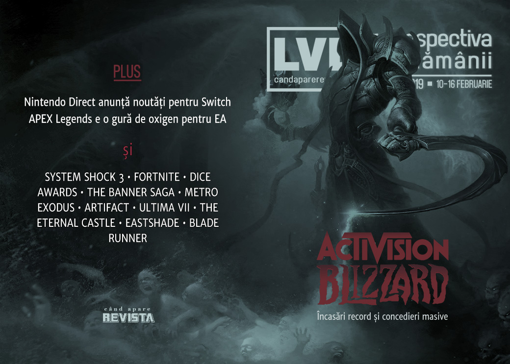

Activision-Blizzard anunță încasări record pentru 2018, dar în același timp concediază 8% din angajați. De partea cealaltă, Apex Legends revigorează perspectivele EA, System Shock 3 rămâne fără publisher, iar Nintendo anunță noutăți pentru fanii Switch. A fost în același timp și o săptămână cu lansări importante: Civilization VI: Gathering Storm, Far Cry New Dawn, Metro Exodus, Enderal, iar Flower ajunge în sfârșit și pe PC.

Linkuri rapide:

* [Știri](#ştiri)
* [Articole (critică, dev, design)](#articole-critică-dev-design)
* [Anunţuri şi lansări de jocuri](#anunţuri-şi-lansări-de-jocuri)
* [Prăvălii de jocuri](#prăvălii-de-jocuri)

## Ştiri
### Concedieri la Activision-Blizzard
* Activision-Blizzard și-au prezentat raportul către investitori privind anul 2018, anunțând încasări record de 7,5 miliarde de dolari, și, printre altele, demararea unor măsuri de restructurare începând cu concedierea a aproape 800 de angajați. ([Engadget](https://www.engadget.com/2019/02/12/activision-blizzard-layoffs-800-employees-record-2018/), [Ars Technica](https://arstechnica.com/gaming/2019/02/activision-blizzard-lays-off-775-people-after-record-results-in-2018/), [GameDaily.biz](https://gamedaily.biz/article/592/activision-blizzard-lays-off-800-despite-record-performance), [Games Informer](https://www.gameinformer.com/2019/02/12/activision-blizzard-informs-employees-of-layoffs-despite-overall-financial-success), [Variety](https://variety.com/2019/gaming/news/activision-blizzard-layoffs-1203136982/), [Kotaku](https://kotaku.com/activision-blizzard-begins-massive-layoffs-1832571288), [GamesIndustry.biz](https://www.gamesindustry.biz/articles/2019-02-12-activision-blizzard-sees-record-year-plans-to-decrease-net-headcount-by-8-percent), [USgamer](https://www.usgamer.net/articles/activision-blizzard-layoffs-call-of-duty-overwatch-king))
* Măsuri în urma cărora compania King, deși nu e singura afectată, închide două studiouri. ([Gamasutra](http://www.gamasutra.com/view/news/336589/Kings_San_Francisco_studio_closed_in_wake_of_Activision_Blizzard_layoffs.php), [Gamasutra](http://www.gamasutra.com/view/news/336501/Following_Activision_Blizzard_layoffs_King_shuts_down_mobile_studio_Z2Live.php), [VentureBeat](https://venturebeat.com/2019/02/12/king-shuts-down-former-z2live-mobile-game-studio-in-seattle-cuts-78-jobs/))
* Organizația Game Workers Unite, ce militează pentru drepturile angajaților din industria jocurilor, a solicitat investitorilor concedierea CEO-ului Bobby Kotick. ([PCGamesInsider.biz](http://www.pcgamesinsider.biz/news/68521/game-workers-unite-calls-for-activision-blizzard-ceo-koticks-removal-after-mass-redundancies/), [Variety](https://variety.com/2019/gaming/news/game-workers-unite-fire-bobby-kotick-1203139767/), [GamesIndustry.biz](https://www.gamesindustry.biz/articles/2019-02-14-game-workers-unite-sparks-calls-to-firebobbykotick-following-activision-blizzard-layoffs))
* Iar AFL-CIO, cea mai mare uniune sindicală din SUA, au publicat o scrisoare deschisă făcând un apel pentru unirea angajaților din industrie pentru a-și putea apăra mai bine drepturile. ([Kotaku](https://kotaku.com/an-open-letter-to-game-developers-from-americas-largest-1832652654), [Variety](https://variety.com/2019/gaming/news/liz-schuler-game-developers-unionize-1203141471/), [GamesIndustry.biz](https://www.gamesindustry.biz/articles/2019-02-15-afl-cio-urges-games-industry-to-unionize), [Shacknews](https://www.shacknews.com/article/109981/afl-cio-pens-open-letter-to-game-developers-about-unions))

### Alte știri
* THQ Nordic achiziționează Warhorse, studioul care a dezvoltat **Kingdom Come: Deliverance**. ([Destructoid](https://www.destructoid.com/thq-nordic-buys-kingdom-come-deliverance-developer-warhorse-studios-542638.phtml), [GameDaily.biz](https://gamedaily.biz/article/593/thq-nordic-acquires-kingdom-come-deliverance-studio-warhorse-studios), [TechSpot](https://www.techspot.com/news/78741-thq-nordic-acquires-warhorse-studios-team-behind-medieval.html))
* Apex Legends a avut un succes atât de mare - 25 de milioane de jucători în prima săptămână după lansare ([Destructoid](https://www.destructoid.com/apex-legends-hits-25-million-players-by-the-end-of-its-first-week-542440.phtml), [DSOGaming ](https://www.dsogaming.com/news/apex-legends-surpasses-25-million-players-over-2-million-concurrent-players-peak/), [GamesIndustry.biz](https://www.gamesindustry.biz/articles/2019-02-12-apex-legends-reaches-25m-players-2m-concurrent)), încât a revigorat nu doar acțiunile EA ([PCGamesInsider.biz](https://www.pcgamesinsider.biz/news/68495/ea-stock-hits-2019-high-following-dip-and-apex-legends-is-likely-the-reason/)), dar și baza de jucători a lui **Titanfall 2**. ([PCGamesInsider.biz](https://www.pcgamesinsider.biz/news/68504/titanfall-2-pc-playerbase-increases-almost-sixfold-following-apex-legends-launch/), [VG247](https://www.vg247.com/2019/02/12/apex-legends-success-boosting-titanfall-2-player-numbers/))
* Starbreeze întrerupe contractul de publishing și vinde înapoi către OtherSide Entertainment drepturile pentru **System Shock 3**. ([Games Informer](https://www.gameinformer.com/2019/02/11/starbreeze-sells-back-system-shock-3-publishing-rights), [Gamasutra](http://www.gamasutra.com/view/news/336398/Starbreeze_sells_back_publishing_rights_to_System_Shock_3.php), [PCGamesInsider.biz](http://www.pcgamesinsider.biz/news/68507/troubled-starbreeze-sells-system-shock-3-publishing-rights-back-to-developer-otherside/), [GameDaily.biz](https://gamedaily.biz/article/590/starbreeze-sells-publishing-rights-to-system-shock-3-back-to-otherside-entertainment), [GamesIndustry.biz](https://www.gamesindustry.biz/articles/2019-02-12-starbreeze-sells-system-shock-3-publishing-rights))
* S-a desfășurat a 22-a ediție a premiilor DICE, decernate anual de Academia de Arte și Științe Interactive din SUA în cadrul DICE Summit. Marele câștigător: God of War. ([Polygon](https://www.polygon.com/2019/2/14/18224190/dice-awards-2019-winners-god-of-war-ps4), [Variety](https://variety.com/2019/gaming/news/dice-awards-2018-god-of-war-1203139475/), [GameDaily.biz](https://gamedaily.biz/article/596/dice-awards-2019-god-of-war-receives-nine-accolades-bonnie-ross-honored), [GamesIndustry.biz](https://www.gamesindustry.biz/articles/2019-02-14-god-of-war-sweeps-2019-dice-awards))
* Universitatea Oxford publică rezultate unui studiu care a analizat legătura dintre jocurile violente și comportamentul agresiv al adolescenților și… nu au găsit o astfel de legătură. ([GamesIndustry.biz](https://www.gamesindustry.biz/articles/2019-02-14-no-link-between-violent-video-games-and-increased-aggression-in-teens-new-research-finds), [TechRaptor](https://techraptor.net/content/violent-video-game-study-finds-no-link-to-increased-aggression), [Gamasutra](http://www.gamasutra.com/view/news/336824/Oxford_study_finds_no_link_between_violent_video_games_and_teen_aggression.php))
* Nintendo a organizat o prezentare Nintendo Direct, în cadrul căreia au fost anunțate... jocuri. ([Destructoid](https://www.destructoid.com/today-s-nintendo-direct-was-a-real-banger-542721.phtml), [Games Informer](https://www.gameinformer.com/nintendo-direct/2019/02/13/heres-everything-from-todays-nintendo-direct), [Polygon](https://www.polygon.com/2019/2/13/18223994/nintendo-direct-february-2019-nintendo-switch-games-trailers), [Kotaku](https://kotaku.com/everything-that-happened-in-todays-nintendo-direct-1832603323), [The Verge](https://www.theverge.com/2019/2/13/18223786/nintendo-direct-announcements-fire-emblem-mario-maker-smash-bros-zelda))

## Articole (critică, dev, design)

* [Fortnite&#39;s Appropriation Issue Isn&#39;t About Copyright Law, It&#39;s About Ethics](https://waypoint.vice.com/en_us/article/a3bkgj/fortnite-fortnight-black-appropriation-dance-emote) (Waypoint)
* [Videogame Preservation Is, And Will Always Be, A &#039;Now&#039; Problem](https://unwinnable.com/2019/02/14/videogame-preservation-is-and-will-always-be-a-now-problem/) (Unwinnable)
* [The 5 biggest trends in video games are colliding on the same day](https://www.polygon.com/2019/2/15/18226310/anthem-metro-exodus-crackdown-3-far-cry-new-dawn-release-dates) (Polygon)
* [Explorers](https://problemmachine.wordpress.com/2019/02/16/explorers/) (The Problem Machine)
* [Extra Lives](https://unwinnable.com/2019/02/11/extra-lives/) (Unwinnable)
* [A Love Letter to Video Games](https://variety.com/2019/gaming/columns/digital-rituals-love-1203139133/) (Variety)

---

### Actualitate
* [Apex Legends hits 25 million players, boosts EA stock, renews Titanfall 2](https://gamedaily.biz/article/587/apex-legends-hits-25-million-players-boosts-ea-stock-renews-titanfall-2) (GameDaily.biz)
* [What does Apex Legends’ success mean for Anthem?](https://www.polygon.com/2019/2/10/18212707/apex-legends-anthem-battlefield-5-battle-royale-ea) (Polygon)
* [DICE Summit shows the inspirational highs and depressing lows of gaming](https://venturebeat.com/2019/02/15/the-deanbeat-dice-summit-shows-the-inspirational-highs-and-depressing-lows-of-gaming/) (VentureBeat)

#### Concedieri la Activision-Blizzard
* [The Fallout Of Activision Blizzard’s Massive Layoffs](https://kotaku.com/the-fallout-of-activision-blizzard-s-massive-layoffs-1832597892) (Kotaku)
* [Activision Blizzard Reports Record Revenue as They Fuck Over 800 Employees](https://waypoint.vice.com/en_us/article/yw83kg/activision-blizzard-reports-record-revenue-as-they-fuck-over-800-employees) (Waypoint)
* [Rewarding profit and nothing else](https://www.gamesindustry.biz/articles/2019-02-14-rewarding-profit-and-nothing-else-opinion) (GamesIndustry.biz)
* [What the hell happened at Activision Blizzard?](https://www.polygon.com/2019/2/16/18226581/activision-blizzard-layoffs-executive-pay-unions) (Polygon)
* [How Much Profit is Enough Profit for Activision Blizzard?](https://www.gamereactor.eu/articles/733523/How+Much+Profit+is+Enough+Profit+for+Activision+Blizzard/) (Gamereactor)

---

### _Not-a-review_
* [They Killed the Mechs so that the Pilots Might Live](https://unwinnable.com/2019/02/14/they-killed-the-mechs-so-that-the-pilots-might-live/) (Unwinnable)
* [Apex Legends Works Because Everyone Can Contribute](https://kotaku.com/apex-legends-works-because-everyone-can-contribute-1832627125) (Kotaku)
* [The Weird Desire To Play Resident Evil 2 Even After Quitting Out Of Fear](https://kotaku.com/the-weird-desire-to-play-resident-evil-2-even-after-qui-1832494575) (Kotaku)
* [Overthinking Games: The Banner Saga&#8217;s banner represents unity rather than division](https://www.rockpapershotgun.com/2019/02/11/overthinking-games-the-banner-sagas-banner-represents-unity-rather-than-division/) (RPS)
* [How a five-year game of Civilization 5 became a meaningful part of my personal history](https://www.eurogamer.net/articles/2019-02-12-how-a-five-year-game-of-civilization-5-traced-personal-history) (Eurogamer)
* [Video game history is the future in The Eternal Castle](https://www.eurogamer.net/articles/2019-02-13-video-game-history-is-the-future-in-the-eternal-castle) (Eurogamer)
* [The secret stories of Metro](https://www.eurogamer.net/articles/2019-02-15-the-secret-stories-of-metro) (Eurogamer)
* [Why did Artifact fail, and what can Valve do to save it?](https://www.pcgamer.com/why-did-artifact-fail-and-what-can-valve-do-to-save-it/) (PC Gamer)

---

### Industrie
* [EA stock hits 2019 high following dip and Apex Legends is likely the reason](https://www.pcgamesinsider.biz/news/68495/ea-stock-hits-2019-high-following-dip-and-apex-legends-is-likely-the-reason/) (PCGamesInsider.biz)
* [The state of BioWare](https://www.polygon.com/2019/2/11/18214604/bioware-anthem-dragon-age-ea) (Polygon)
* [Gaming disorder diagnosis puts industry at risk - ESA](https://www.gamesindustry.biz/articles/2019-02-12-gaming-disorder-diagnosis-puts-industry-at-risk-esa) (GamesIndustry.biz)
* [Amy Hennig sees a social future for storytelling games](http://www.gamasutra.com/view/news/336496/Amy_Hennig_sees_a_social_future_for_storytelling_games.php) (Gamasutra)
* [An epilogue for the staff of Telltale](https://www.eurogamer.net/articles/2019-02-14-an-epilogue-for-the-staff-of-telltale) (Eurogamer)
* [From pages to polygons: The storytelling of Metro Exodus](https://www.gamesindustry.biz/articles/2019-02-14-from-pages-to-polygons-the-storytelling-of-metro-exodus) (GamesIndustry.biz)
* [Nintendo's greatest strength this generation is self-acceptance](https://www.gamesindustry.biz/articles/2019-02-14-nintendos-greatest-strength-this-generation-is-self-acceptance-opinion) (GamesIndustry.biz)
* [Major games publishers are feeling the impact of peaking attention](https://www.gamesindustry.biz/articles/2019-02-15-major-games-publishers-are-feeling-the-impact-of-peaking-attention) (GamesIndustry.biz)

---

### Istorie, retrospectivă
* [Ultima VII](https://www.filfre.net/2019/02/ultima-vii/) (The Digital Antiquarian)
* [The haunted origins of Pokémon](https://www.eurogamer.net/articles/2019-02-11-the-haunted-origins-of-pok-mon) (Eurogamer)
* [Back when Atari made art](https://www.eurogamer.net/articles/2019-02-10-back-when-atari-made-art) (Eurogamer)
* [How Euro Truck Simulator 2 became an unlikely cult hit on PC](https://www.pcgamer.com/how-euro-truck-simulator-2-became-an-unlikely-cult-hit-on-pc/) (PC Gamer)
* [Memories Shaping Identities](http://www.firstpersonscholar.com/memories-shaping-identities/) (First Person Scholar)
* [The Most Important Fighting Games Forgotten with Time](https://landofobscusion.blogspot.com/2019/02/obscusion-b-list-most-important.html) (The Land of Obscusion)
* [The Secret History of Wu-Tang Clan's Bizarre Hip-Hop Fighting Game](https://variety.com/2019/gaming/features/wu-tang-shaolin-style-thrill-kill-1203140669/) (Variety)
* [The Game Archaeologist: Terra, SubSpace, and Sovereign](https://massivelyop.com/2019/02/16/the-game-archaeologist-terra-subspace-and-sovereign/) (Massively OP)
* [How seven Mount and Blade modders formed a games studio](https://www.pcgamer.com/how-seven-mount-and-blade-modders-formed-a-games-studio/) (PC Gamer)

---

### Dev, making of, mecanici
* [Road to the IGF: Wadjet Eye Games' Unavowed](http://www.gamasutra.com/view/news/336323/Road_to_the_IGF_Wadjet_Eye_Games_Unavowed.php) (Gamasutra)
* [Turning painting into a game mechanic in the gorgeous Eastshade ](http://www.gamasutra.com/view/news/336400/Turning_painting_into_a_game_mechanic_in_the_gorgeous_Eastshade.php) (Gamasutra)
* [Without Map, Compass, or Destination - MRY on RPG Writing](https://rpgcodex.net/content.php?id=11097) (RPG Codex)
* [Metro Exodus: a vision for the future of graphics technology](https://www.eurogamer.net/articles/digitalfoundry-2019-metro-exodus-tech-analysis) (Eurogamer)
* [Voxelart Styles in Video Games](https://www.gamasutra.com/blogs/ZachSoares/20190215/336661/Voxelart_Styles_in_Video_Games.php) (Gamasutra)
* [Video: The production behind Shadow Tactics](http://www.gamasutra.com/view/news/336394/Video_The_production_behind_Shadow_Tactics_.php) (Gamasutra)
* [Video: To make 1997’s Blade Runner, Westwood first had to create the universe](https://arstechnica.com/gaming/2019/02/video-to-make-1997s-blade-runner-westwood-first-had-to-create-the-universe/) (Ars Technica)
* [Watch System Era's Brendan Wilson break down the making of Astroneer ](http://www.gamasutra.com/view/news/336834/Watch_System_Eras_Brendan_Wilson_break_down_the_making_of_Astroneer.php) (Gamasutra)

---

### Design, world-building, artă
* [Let's explore the art of these five gorgeous games](https://www.pcgamer.com/lets-explore-the-art-of-these-five-gorgeous-games/) (PC Gamer)
* [The impossible architecture of video games](https://www.eurogamer.net/articles/2019-02-12-the-impossible-architecture-of-video-games) (Eurogamer)
* [The low-poly architecture of &#8217;90s shooters like Quake is back to terrify us all](https://www.pcgamesn.com/dusk/dusk-paratopic-architecture) (PCGamesN)
* [The bleak post-apocalypse of Metro Exodus in beautiful screenshots](https://www.pcgamer.com/the-bleak-post-apocalypse-of-metro-exodus-in-beautiful-screenshots/) (PC Gamer)
* [Lights, Camera, Action Figures!](https://kotaku.com/lights-camera-action-figures-1832248226) (Kotaku)

## Anunţuri şi lansări de jocuri
### Anunţate
* **Hollow Knight: Silksong** ([Eurogamer](https://www.eurogamer.net/articles/2019-02-14-hollow-knight-gets-surprise-sequel-for-switch-and-pc))
* **Axis & Allies Online** ([Wargamer](https://www.wargamer.com/articles/axis-and-allies-online/))
* **Ostranauts** ([RPS](https://www.rockpapershotgun.com/2019/02/13/ostranauts-is-a-neo-noir-space-sim-from-neo-scavengers-dev/), [TechRaptor](https://techraptor.net/content/neo-scavenger-developer-announces-noir-spaceship-life-sim-ostranauts))
* **Oninaki** ([Eurogamer](https://www.eurogamer.net/articles/2019-02-14-oninaki-is-a-new-action-rpg-from-the-studio-behind-i-am-setsuna))

### Acum cu dată de lansare
* **Ethereal**: 7 martie ([PC Gamer](https://www.pcgamer.com/igf-finalist-puzzler-ethereal-gets-march-release-date/))
* **Dance of Death: Du Lac & Fey**: 5 aprilie ([Eurogamer](https://www.eurogamer.net/articles/2019-02-14-victorian-era-talking-dog-detective-mystery-du-lac-and-fey-gets-an-april-release-date-on-pc))
* **Dangerous Driving**: 9 aprilie ([Games Informer](https://www.gameinformer.com/2019/02/13/buckle-up-for-dangerous-drivings-new-trailer-release-date))
* **World War Z**: 16 aprilie ([DSOGaming ](https://www.dsogaming.com/news/release-date-and-official-pc-system-requirements-announced-for-world-war-z/))
* **Warhammer: Chaosbane**: 4 iunie ([Polygon](https://www.polygon.com/2019/2/9/18218621/warhammer-chaosbane-release-date-pc-ps4-xbox-one-beta-date))

### Amânate
* **Total War: Three Kingdoms**: 23 mai în loc de 7 martie ([Eurogamer](https://www.eurogamer.net/articles/2019-02-11-total-war-three-kingdoms-delayed-to-may))
* **PlanetSide Arena** apare la vară ([PC Gamer](https://www.pcgamer.com/planetside-arena-delayed-again-pre-orders-refunded/), [Polygon](https://www.polygon.com/2019/2/16/18227412/planetside-arena-delayed-refunds-pc-ps4-beta-date))

### Lansate
* 12 februarie: **Globesweeper** ([Steam](https://store.steampowered.com/app/982220/Globesweeper/))
* 12 februarie: **Evolution : The Video Game** ([Steam](https://store.steampowered.com/app/469800/Evolution__The_Video_Game/))
* 12 februarie: **RIOT: Civil Unrest** ([Steam](https://store.steampowered.com/app/342310/RIOT_Civil_Unrest/), [gog.com](https://www.gog.com/game/riot_civil_unrest))
* 13 februarie: **Eastshade** ([Steam](https://store.steampowered.com/app/715560/Eastshade/))
* 13 februarie: **Tannenberg** (iese din Early Access) ([Steam](https://store.steampowered.com/app/633460/Tannenberg/))
* 14 februarie: **Enderal: Forgotten Stories** (total conversion pentru Skyrim) ([Steam](https://store.steampowered.com/app/933480/Enderal_Forgotten_Stories/))
* 14 februarie: **Element Space** (iese din Early Access) ([Steam](https://store.steampowered.com/app/887370/Element_Space/))
* 14 februarie: **Degrees of Separation** ([Steam](https://store.steampowered.com/app/809880/Degrees_of_Separation/))
* 14 februarie: **The Textorcist: The Story of Ray Bibbia** ([Steam](https://store.steampowered.com/app/940680/The_Textorcist_The_Story_of_Ray_Bibbia/), [gog.com](https://www.gog.com/game/the_textorcist_the_story_of_ray_bibbia))
* 14 februarie: **Sid Meier's Civilization VI: Gathering Storm** ([Steam](https://store.steampowered.com/app/947510/Sid_Meiers_Civilization_VI_Gathering_Storm/))
* 14 februarie: **Flower** ([Steam](https://store.steampowered.com/app/966330/Flower/), [Epic Store](https://www.epicgames.com/store/en-US/product/flower), [gog.com](https://www.gog.com/game/flower))
* 15 februarie: **Crackdown 3** ([Microsoft Store](https://www.microsoft.com/en-us/p/crackdown-3/9nxr6469dm2p))
* 15 februarie: **JUMP FORCE** ([Steam](https://store.steampowered.com/app/816020/JUMP_FORCE/))
* 15 februarie: **Far Cry New Dawn** ([Steam](https://store.steampowered.com/app/939960/Far_Cry_New_Dawn/), [Ubi Store](https://store.ubi.com/us/far-cry-new-dawn/5bf319696b54a4ddc91e8843.html))
* 15 februarie: **Metro Exodus** ([Epic Store](https://www.epicgames.com/store/en-US/product/metro-exodus/home))

## Prăvălii de jocuri
### Știri
* [The Epic Store has an offline mode now, development roadmap coming soon](https://www.pcgamer.com/the-epic-store-has-an-offline-mode-now/) (PC Gamer)
* [Razer shutting its digital game store this month, less than a year after it opened](https://www.pcgamer.com/razer-is-shutting-its-digital-game-store-this-month-less-than-a-year-after-it-opened/) (PC Gamer)

### Jocuri gratis și free weekends
* [Arma 3 is free to play this weekend, and 66% off](https://www.pcgamer.com/arma-3-is-free-to-play-this-weekend-and-66-off/) (PC Gamer)
* [Free Weekend &amp; New Editions Precede Year Four Of Rainbow Six Siege](https://www.gameinformer.com/psa/2019/02/12/free-weekend-new-editions-precede-year-four-of-rainbow-six-siege) (Games Informer)
* [The Division 2 is free to try in open beta on March 1st](https://www.rockpapershotgun.com/2019/02/12/the-division-2-goes-into-free-open-beta-on-march-1st/) (RPS)

### Reduceri și promoții
* [Romance pigeons and joust with genitals in Humble's Valentine's Day Sale](https://www.pcgamer.com/romance-pigeons-and-joust-with-genitals-in-humbles-valentines-day-sale/) (PC Gamer)
* [Best PC gaming deals of the week &#8211; 15th February 2019](https://www.rockpapershotgun.com/2019/02/15/best-pc-gaming-deals-of-the-week-15th-february-2019/) (RPS)
* [Weekend Console Download Deals for Feb. 15: Free Rainbow Six Siege weekend](https://www.shacknews.com/article/109971/weekend-console-download-deals-for-feb-15-free-rainbow-six-siege-weekend) (Shacknews)
* [Weekend PC Download Deals for Feb. 15: Free ArmA 3 Steam weekend](https://www.shacknews.com/article/109976/weekend-pc-download-deals-for-feb-15-free-arma-3-steam-weekend) (Shacknews)
* [Best February Games Deals](https://www.eurogamer.net/articles/2019-02-15-best-games-deals-playstation-4-and-xbox-one) (Eurogamer)
* [Alone With You, Cook, Serve, Delicious! 2!! and More in Newest Humble Bundle](https://techraptor.net/content/alone-with-you-cook-serve-delicious-2-and-more-in-newest-humble-bundle) (TechRaptor)

---

{}
**Retrospectiva săptămânii** este rubrica duminicală în care trecem în revistă evenimentele săptămânii de pe frontul de gaming: știri şi articole (scrise de alții, bineînțeles, că e mai ușor aşa), industrie, lansări, oferte de jocuri, toate numai de savurat la cafeaua de duminică dimineața.

De asemenea, rubrica e deschisă oricui vrea și poate contribui. Dacă ai citit vreun articol sau vreo știre interesantă și crezi că merită incluse în retrospectiva săptămânii, te așteptăm pe forum pe unul dintre topicurile dedicate: [Știri](https://forum.candaparerevista.ro/viewtopic.php?f=4&t=46), [Articole](https://forum.candaparerevista.ro/viewtopic.php?f=4&t=206), [Gaming România](https://forum.candaparerevista.ro/viewtopic.php?f=4&t=1622)].
{}
