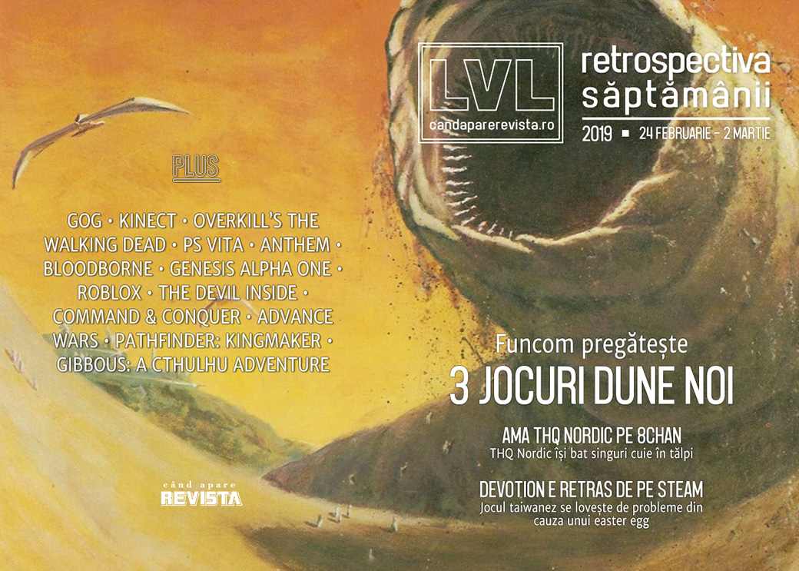

THQ Nordic își pun singuri piedică organizând un AMA pe 8chan, Funcom anunță că ne pregătesc (cel puțin) 3 jocuri noi în universul Dune, Devotion e retras de pe Steam din cauza unui easter egg, GOG anunță niște restructurări și continuă discuțiile în jurul BioWare și Anthem.

Linkuri rapide:

* [Știri](#ştiri)
* [Articole (critică, dev, design)](#articole-critică-dev-design)
* [Made în România](#made-în-românia)
* [Anunţuri şi lansări de jocuri](#anunţuri-şi-lansări-de-jocuri)
* [Prăvălii de jocuri](#prăvălii-de-jocuri)

## Ştiri
* THQ Nordic au avut nefericita inspirație să organizeze o sesiune AMA (ask me anything) pe forumul 8chan, faimos pentru... chestiile nasoale care se întâmplă pe acolo, cu are în mod normal nicio companie nu ar vrea să se asocieze. Și bineînțeles că toată treaba a reculat puternic și au ajuns la scuze publice și un șuvoi de reacții negative în doar câteva ore. ([Ars Technica](https://arstechnica.com/gaming/2019/02/game-publishers-8chan-stunt-ends-with-apology-about-child-porn-white-supremacy/), [RPS](https://www.rockpapershotgun.com/2019/02/26/thq-nordic-held-a-qa-with-8chan-a-website-de-listed-from-google-for-child-porn/), [Gamasutra](http://www.gamasutra.com/view/news/337513/THQ_Nordic_inexplicably_hosts_AMA_in_a_notorious_internet_cesspool.php), [Eurogamer](https://www.eurogamer.net/articles/2019-02-27-thq-nordic-exec-still-in-job-after-8chan-stunt), [GameDaily.biz](https://gamedaily.biz/article/631/thq-nordic-facing-serious-backlash-after-8chan-ama))
* Kinect primește o a doua șansă la viață sub forma unui mic dispozitiv pentru dezvoltatori și cercetători, cu tehnologie împrumutată de la HoloLens. ([PCGamesInsider.biz](https://www.pcgamesinsider.biz/news/68589/the-kinect-is-now-a-400-small-form-pc-peripheral/))
* GOG renunță la programul „fair price package” (prin care compensau din buzunarul propriu diferențele de prețuri pentru regiunile cu altă monedă decât dolarul) pentru a putea acorda mai mulți bani dezvoltatorilor (probabil efectul Epic) ([PC Gamer](https://www.pcgamer.com/gog-is-ending-its-fair-price-package-so-it-can-give-devs-a-larger-cut/), [GamesIndustry.biz](https://www.gamesindustry.biz/articles/2019-02-27-gog-ends-fair-pricing-program-for-consumers-to-give-devs-large-cut), [PCGamesInsider.biz](https://www.pcgamesinsider.biz/news/68603/gog-is-finishing-its-fair-price-package-regional-pricing-initiative-to-help-it-compete-with-epics-rev-share/), [Gamasutra](http://www.gamasutra.com/view/news/337608/GOG_drops_Fair_Price_Package_program_blames_rising_dev_revenue_shares.php)) și, totodată, concediază și niște oameni. ([Games Informer](https://www.gameinformer.com/2019/02/26/digital-storefront-gog-hit-with-layoffs), [Kotaku](https://kotaku.com/facing-financial-pressures-gog-quietly-lays-off-at-lea-1832879826), [PC Gamer](https://www.pcgamer.com/gog-lays-off-around-a-dozen-employees-amid-report-of-financial-struggles/), [GameDaily.biz](https://gamedaily.biz/article/628/gog-lays-off-at-least-a-dozen-employees-after-financial-struggle), [GamesIndustry.biz](https://www.gamesindustry.biz/articles/2019-02-25-gog-lays-off-around-a-dozen-reportedly-due-to-financial-trouble), [Gamasutra](http://www.gamasutra.com/view/news/337426/GOG_lays_off_a_dozen_employees_over_reported_financial_strain.php))
* Într-un raport pentru investitori, Activision-Blizzard ia în calcul posibile efecte negative ale recent anunțatelor concedieri a 800 de angajați. ([PCGamesInsider.biz](https://www.pcgamesinsider.biz/job-news/68624/activision-blizzard-says-job-cuts-could-have-possible-negative-impact-on-financial-performance/), [GamesIndustry.biz](https://www.gamesindustry.biz/articles/2019-03-01-activision-blizzard-800-job-cuts-could-negatively-impact-our-business))
* Compania norvegiană Funcom (Age of Conan, Secret World, Conan Exiles) anunță că au încheiat un acord de licențiere pe șase ani care le va permite să creeze cel puțin trei jocuri noi bazate pe universul Dune. Primul dintre acestea va începe producția anul acesta și va fi… n-o să vă vină să credeți, un joc _multiplayer open world_. ([Games Informer](https://www.gameinformer.com/2019/02/26/new-dune-games-coming-from-funcom), [PC Gamer](https://www.pcgamer.com/funcom-is-making-an-open-world-multiplayer-dune-game/), [Eurogamer](https://www.eurogamer.net/articles/2019-02-26-conan-exiles-developer-funcom-lands-deal-to-make-dune-games), [Shacknews](https://www.shacknews.com/article/110176/conan-exiles-dev-funcom-strikes-deal-to-create-new-dune-games), [RPS](https://www.rockpapershotgun.com/2019/02/27/funcom-announce-dune-games/))
* Un _easter egg_ din jocul taiwanez **Devotion**, care făcea referire la gluma de pe internet care-l aseamănă pe președintele chinez cu ursulețul Winnie the Pooh,  a provocat reacții atât de mari în rândul publicului chinez, încât a fost țintit de un val de review-uri negative iar în cele din urmă jocul a fost retras de pe Steam pentru „îmbunătățiri și modificări”. ([Games Informer](https://www.gameinformer.com/2019/02/25/taiwanese-horror-game-devotion-delisted-from-steam-after-winnie-the-pooh-meme-sparks), [Kotaku](https://kotaku.com/popular-horror-game-removed-from-steam-after-chinese-pl-1832881001), [PC Gamer](https://www.pcgamer.com/taiwanese-horror-game-devotion-has-been-removed-from-steam/), [Polygon](https://www.polygon.com/2019/2/25/18240318/devotion-steam-pulled-review-bombing-winnie-the-pooh-taiwan), [Eurogamer](https://www.eurogamer.net/articles/2019-02-25-devotion-developer-calls-for-calm-as-fallout-from-xi-jinping-winnie-the-pooh-china-meme-reference-goes-from-bad-to-worse), [The Guardian](https://www.theguardian.com/games/2019/feb/27/taiwanese-game-removed-from-sale-after-anti-china-messages-discovered))
* Skybound întrerupe contractul cu Starbreeze și anulează toate versiunile viitoare ale jocului Overkill's The Walking Dead, iar versiunea lansată pe Steam a fost retrasă de la vânzare. ([Variety](https://variety.com/2019/gaming/news/the-walking-dead-creators-kill-overkills-the-walking-dead-game-1203150365/), [Eurogamer](https://www.eurogamer.net/articles/2019-02-27-skybound-cancels-all-versions-of-troubled-overkills-the-walking-dead), [GamesIndustry.biz](https://www.gamesindustry.biz/articles/2019-02-27-overkills-the-walking-dead-officially-canceled), [GameDaily.biz](https://gamedaily.biz/article/630/skybound-ends-contract-with-starbreeze-as-overkills-walking-dead-pulled-from-steam), [TechSpot](https://www.techspot.com/news/78947-overkill-walking-dead-no-longer-coming-consoles-pc.html))
* PlayStation Vita a ajuns la capătul drumului. Sony a încetat oficial producția consolei. ([The Verge](https://www.theverge.com/2019/3/2/18247864/sony-playstation-vita-officially-stopped-producing-rip), [Polygon](https://www.polygon.com/2019/3/2/18246372/playstation-vita-canceled-discontinued-production-ended-ps-vita-sony))

## Articole (critică, dev, design)
* [Point and shoot: what's next for photography in video games?](https://www.theguardian.com/games/2019/feb/25/point-and-shoot-whats-next-for-photography-in-video-games) (The Guardian)
* [The Interactivity of Reading](http://www.gamasutra.com/blogs/NikhilMurthy/20190225/337245/The_Interactivity_of_Reading.php) (Gamasutra)
* [Fortnite dance lawsuits are bad for copyright and bad for culture](https://www.theverge.com/2019/2/27/18242899/fortnite-dance-move-copyright-lawsuit-carlton-milly-rock-epic-games) (The Verge)
* ['Geek philanthropy': the gamers raising millions through marathon live streams](https://www.theguardian.com/games/2019/feb/28/geek-philanthropy-the-gamers-raising-millions-through-marathon-live-streams) (The Guardian)
* [Duplication or innovation? How games become genres](https://www.gamesindustry.biz/articles/2019-02-28-duplication-or-innovation-how-games-become-genres) (GamesIndustry.biz)
* [Tetris 99 and Apex Legends evolve battle royale past a fad](https://www.polygon.com/2019/3/1/18243372/battle-royale-trend-apex-legends-tetris-99) (Polygon)
* [The Battle for Loot Boxes: Are they Gambling?](https://remptongames.com/2019/03/02/the-battle-for-loot-boxes-are-they-gambling/) (Rempton Games)
* [Meet Macaulay Culkin, retro video game nerd](https://www.engadget.com/2019/02/27/macaulay-culkin-toejam-earl-launch-interview/) (Engadget)
* [How the author of The Elder Scrolls Cookbook brought Tamriel’s cuisine to life](https://www.polygon.com/deals/2019/2/28/18232034/elder-scrolls-cookbook-release-date) (Polygon)

---

### Actualitate
* [Reports point to GOG being in poor financial health - but why would CD Projekt&#039;s storefront be in trouble?](https://www.pcgamesinsider.biz/news/68593/reports-point-to-gog-being-in-poor-financial-health-but-why-would-cd-projekts-storefront-be-in-trouble/) (PCGamesInsider.biz)
* [Reggie Will Be Missed](https://www.hardcoregamer.com/2019/02/25/reggie-will-be-missed/325585/) (Hardcore Gamer)
* [The Industry Refuses To Hold Itself Accountable And THQ Nordic Proves It](https://www.gameinformer.com/opinion/2019/03/01/the-industry-refuses-to-hold-itself-accountable-and-thq-nordic-proves-it) (Games Informer)

#### THQ Nordic
* [THQ Nordic delivered a masterclass in blowing up your brand](https://www.polygon.com/2019/3/2/18246867/thq-nordic-8chan-controversy-apology) (Polygon)
* [Six times games companies did very silly things](https://www.videogamer.com/features/six-times-games-companies-did-very-silly-things) (VideoGamer)

#### Devotion
* [&#x27;Devotion&#x27; Is a Brilliant Videogame—Too Bad You Can&#x27;t Play It](https://www.wired.com/story/devotion-controversy-review/) (Wired)
* [&quot;Xi Jinping Winnie the Pooh&quot; In Devotion - The Taiwanese Perspective, The Chinese Perspective &amp; The Neutral Ground](https://www.spieltimes.com/original/xi-jinping-winnie-the-pooh-in-devotion-the-taiwanese-perspective-the-chinese-perspective-the-neutral-ground/) (Spiel Times)

#### Bioware - Anthem
* [Anthem and the importance of experimentation](https://www.videogamer.com/features/anthem-and-the-importance-of-experimentation) (VideoGamer)
* [Old BioWare has become a distant memory](https://www.pcgamer.com/old-bioware-has-become-a-distant-memory/) (PC Gamer)
* [Anthem's No-Win Situation - Rising Expectations, Unsustainable Business Models](https://techraptor.net/content/anthems-no-win-situation-rising-expectations-unsustainable-business-models) (TechRaptor)

---

### _Not-a-review_
* [Bloodborne Is Ruining Other Games For Me](https://kotaku.com/bloodborne-is-ruining-other-games-for-me-1832899513) (Kotaku)
* [Eastshade Has So Much Personality That You Forget You&#39;re Just Painting and Talking](https://kotaku.com/eastshade-has-so-much-personality-that-you-forget-youre-1832884138) (Kotaku)
* [&#39;Devotion&#39; Mines Genuine Emotional Terror From a Familiar Source: Home](https://waypoint.vice.com/en_us/article/panqv9/devotion-review-horror-red-candle-games) (Waypoint)
* [How Hades brings Greek mythology into the modern day](https://www.eurogamer.net/articles/2019-02-27-how-hades-brings-greek-mythology-into-the-modern-day) (Eurogamer)
* [Apex Legends Accessibility And Ping System May Set New Industry Standard](https://gamedaily.biz/article/641/apex-legends-accessibility-and-ping-system-may-set-new-industry-standard) (GameDaily.biz)
* [Why Genesis Alpha One is the Alien Game I Always Wanted](http://www.kotaku.co.uk/2019/02/26/why-genesis-alpha-one-is-the-alien-game-i-always-wanted) (Kotaku)

---

### Industrie
* [Insomniac's Ted Price On Why The Game Industry Must Continue To Confront Difficult Topics](https://gamedaily.biz/article/627/insomniacs-ted-price-on-why-the-game-industry-must-continue-to-confront-difficult-topics) (GameDaily.biz)
* [Phil Spencer talks Microsoft's new studios and its commitment to PC gaming in 2019](https://www.pcgamer.com/phil-spencer-talks-microsofts-new-studios-and-its-commitment-to-pc-gaming-in-2019/) (PC Gamer)
* [Here's what each Microsoft game studio is working on](https://www.pcgamer.com/microsoft-game-studios-games/) (PC Gamer)
* [How Roblox is moving ahead with its digital civility initiative](https://venturebeat.com/2019/03/02/roblox-has-a-long-journey-ahead-with-its-digital-civility-initiative/) (VentureBeat)
* [Psychonauts and surviving the publisher shuffle](https://www.gamesindustry.biz/articles/2019-02-25-psychonauts-and-surviving-the-publisher-shuffle) (GamesIndustry.biz)

---

### Istorie, retrospectivă
* [The Konami Famicom treasures westerners missed out on](https://www.destructoid.com/the-konami-famicom-treasures-westerners-missed-out-on-543599.phtml) (Destructoid)
* [The Devil Inside](https://obscuritory.com/shooter/devil-inside/) (The Obscuritory)
* [Remembering Advance Wars](https://www.gamasutra.com/blogs/JoshBycer/20190226/337442/Remembering_Advance_Wars.php) (Gamasutra)
* [Member Grand Theft Auto III?](https://www.hardcoregamer.com/2019/02/28/member-grand-theft-auto-iii/325832/) (Hardcore Gamer)
* [Ninja Gaiden is as good now as it was 15 years ago](https://www.videogamer.com/features/ninja-gaiden-is-as-good-now-as-it-was-15-years-ago) (VideoGamer)
* [Video: How Command &amp; Conquer: Tiberian Sun punished the computers of the day](https://arstechnica.com/gaming/2019/02/video-to-make-tiberian-sun-westwood-had-to-find-the-right-pathfinding-system/) (Ars Technica)
* [The Origins Of Command &amp; Conquer With Louis Castle](https://www.gameinformer.com/video-interview/2019/03/02/the-origins-of-command-conquer-with-louis-castle) (Games Informer)

---

### Dev, making of, mecanici
* [Pathfinder: Kingmaker — a Story Behind the Game](https://medium.com/expload/pathfinder-kingmaker-a-story-behind-the-game-6fc11e05e8fd) (Expload / Medium)

---

### Design, world-building, artă
* [How FromSoftware Embeds the Story of Dark Souls, Bloodborne, and Sekiro in Its World Design](https://www.usgamer.net/articles/fromsoftware-rpgs-architecture-dark-souls-bloodborne-sekiro-world-design) (USgamer)
* [Far Cry: New Dawn&#8217;s hummingbirds are photo mode magic](https://www.rockpapershotgun.com/2019/02/24/far-cry-new-dawns-hummingbirds-are-photo-mode-magic/) (RPS)
* [Demystifying the creation of games through Japanese woodblock prints](https://www.gamesindustry.biz/articles/2019-02-27-demystifying-the-creation-of-games-with-japanese-woodblock-prints) (GamesIndustry.biz)
* [The Art Of Metro Exodus](https://kotaku.com/the-art-of-metro-exodus-1832884074) (Kotaku)

## Made în România
* Digi24 au făcut un reportaj despre Amber Studios. ([Digi24.ro](https://www.digi24.ro/special/campanii-digi24/romania-fast-forward/cand-dependenta-de-jocuri-a-unor-tineri-se-transforma-in-profit-povestea-amber-studio-partenerul-roman-al-disney-interactive-1085708))
* Site-ul Adventure Gamers publică un interviu cu Liviu Boar despre **Gibbous: A Cthulhu Adventure**. ([Adventure Gamers](https://adventuregamers.com/articles/view/37129))

## Anunţuri şi lansări de jocuri
* [Call of Duty: Modern Warfare 2 Campaign Remastered has been rated by PEGI](https://www.dsogaming.com/news/call-of-duty-modern-warfare-2-campaign-remastered-has-been-rated-by-pegi/) (DSOGaming )

### Anunţate
* **Outlaws of the Old West** [Games Informer](https://www.gameinformer.com/preview/2019/02/25/how-the-west-was-won)
* **Barotrauma** [PC Gamer](https://www.pcgamer.com/barotrauma-is-part-subnautica-part-ftl-and-all-gong-show/)

### Acum cu dată de lansare
* **Phoenix Wright: Ace Attorney Trilogy**: 9 aprilie ([Eurogamer](https://www.eurogamer.net/articles/2019-02-27-capcoms-phoenix-wright-ace-attorney-trilogy-is-out-in-april))
* **World War Z**: 16 aprilie ([Games Informer](https://www.gameinformer.com/2019/02/26/world-war-z-co-op-shooter-gets-a-release-date))

### Amânate
* **The Sinking City** apare acum în „2019” în loc de 21 martie ([Games Informer](https://www.gameinformer.com/2019/02/26/lovecraftian-adventure-the-sinking-city-looks-like-its-been-delayed))

### Lansate
* 25 februarie: **Swarm Simulator: Evolution** ([Steam](https://store.steampowered.com/app/914320/Swarm_Simulator_Evolution/))
* 26 februarie: **Trials Rising** ([Steam](https://store.steampowered.com/app/641080/Trials_Rising/))
* 26 februarie: **DiRT Rally 2.0** ([Steam](https://store.steampowered.com/app/690790/DiRT_Rally_20/))
* 26 februarie: **The Bard’s Tale III: Thief of Fate** ([Steam Community](https://steamcommunity.com/games/843260/announcements/detail/1762501075635926015), [gog.com](https://www.gog.com/game/the_bards_tale_trilogy))
* 27 februarie: **Beacon** (early access) ([Steam](https://store.steampowered.com/app/856610/Beacon/))
* 28 februarie: **Ape Out** ([Steam](https://store.steampowered.com/app/447150/APE_OUT/), [gog.com](https://www.gog.com/game/ape_out))
* 28 februarie: **Space Engineers** (iese din early access) ([Steam](https://store.steampowered.com/app/244850/Space_Engineers/))
* 1 martie: **ToeJam & Earl: Back in the Groove!** ([Steam](https://store.steampowered.com/app/516110/ToeJam__Earl_Back_in_the_Groove/))
* 1 martie: **Objects in Space** (iese din early access) ([Steam](https://store.steampowered.com/app/824070/Objects_in_Space/), [gog.com](https://www.gog.com/game/objects_in_space))
* 1 martie: **DEAD OR ALIVE 6** ([Steam](https://store.steampowered.com/app/838380/DEAD_OR_ALIVE_6/))
* 1 martie: **Dawn of Man** ([Steam](https://store.steampowered.com/app/858810/Dawn_of_Man/), [gog.com](https://www.gog.com/game/dawn_of_man))
* 2 martie: **Intruder** (early access) ([Steam](https://store.steampowered.com/app/518150/Intruder/))

## Prăvălii de jocuri
* [The Neverending Expansion of Digital Distribution Clients](https://techraptor.net/content/expansion-digital-distribution-clients) (TechRaptor)

### Jocuri noi în catalog
* [Modern Warfare And The Witness Are The Only PlayStation Plus Games For March](https://kotaku.com/modern-warfare-and-the-witness-are-the-only-playstation-1832932039) (Kotaku)
* [Xbox Games With Gold for March led by Metal Gear Rising: Revengeance](https://www.polygon.com/2019/2/27/18243104/xbox-games-with-gold-free-games-march-2019) (Polygon)

### Jocuri gratis și free weekends
* [Hitman 2&#039;s Entire First Misson Is Now Free To Download](https://www.gameinformer.com/2019/02/26/hitman-2s-entire-first-misson-is-now-free-to-download) (Games Informer)
* [Offworld Trading Company&#8217;s free multiplayer client is open for business](https://www.rockpapershotgun.com/2019/02/28/offworld-trading-company-free-demo/) (RPS)
* [Co-op dwarf shooter Deep Rock Galactic is free to play until Sunday](https://www.pcgamer.com/co-op-dwarf-shooter-deep-rock-galactic-is-free-to-play-until-monday/) (PC Gamer)
* [Space Engineers leaves Early Access and is free to play for the next three days](https://www.pcgamer.com/space-engineers-leaves-early-access-and-is-free-to-play-for-the-next-three-days/) (PC Gamer)

### Reduceri și promoții
* [April’s Humble Bundle will include Mutant Year Zero: Road to Eden, Northgard, and Absolver](https://www.polygon.com/deals/2019/3/1/18246070/humble-monthly-bundle-april-northgard-mutant-year-zero-absolver) (Polygon)
* [Weekend PC Download Deals for Mar. 1: Space Engineers free weekend](https://www.shacknews.com/article/110247/weekend-pc-download-deals-for-mar-1-space-engineers-free-weekend) (Shacknews)
* [Weekend Console Download Deals for Mar. 1: Free UFC 3 weekend on Xbox One](https://www.shacknews.com/article/110244/weekend-console-download-deals-for-mar-1-free-ufc-3-weekend-on-xbox-one) (Shacknews)

---

{}
**Retrospectiva săptămânii** este rubrica duminicală în care trecem în revistă evenimentele săptămânii de pe frontul de gaming: știri şi articole (scrise de alții, bineînțeles, că e mai ușor aşa), industrie, lansări, oferte de jocuri, toate numai de savurat la cafeaua de duminică dimineața.

De asemenea, rubrica e deschisă oricui vrea și poate contribui. Dacă ai citit vreun articol sau vreo știre interesantă și crezi că merită incluse în retrospectiva săptămânii, te așteptăm pe forum pe unul dintre topicurile dedicate: [Știri](https://forum.candaparerevista.ro/viewtopic.php?f=4&t=46), [Articole](https://forum.candaparerevista.ro/viewtopic.php?f=4&t=206), [Gaming România](https://forum.candaparerevista.ro/viewtopic.php?f=4&t=1622)].
{}
