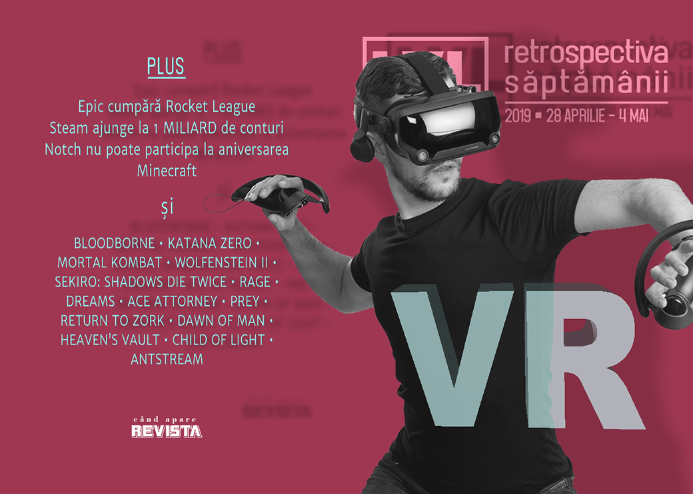

Valve își prezintă headset-ul VR, Epic Games cumpără Rocket League, Steam ajunge la 1 miliard de conturi, Notch nu a fost invitat la aniversarea de 10 ani a Minecraft, se vorbește în continuare și de crunch-ul de la NetherRealm, Ubisoft încearcă să elimine reseller-ii de jocuri, apare un serviciu de streaming pentru jocuri retro și apare și un nou joc Earthworm Jim, exclusiv pe viitoarea retro-consolă Intellivision.

Linkuri rapide:

* [Știri](#ştiri)
* [Articole (critică, dev, design)](#articole-critică-dev-design)
* [Made în România](#made-în-românia)
* [Anunţuri şi lansări de jocuri](#anunţuri-şi-lansări-de-jocuri)
* [Prăvălii de jocuri](#prăvălii-de-jocuri)

## Ştiri
* Valve și-a prezentat headset-ul de realitate virtuală: Valve Index. ([Destructoid](https://www.destructoid.com/valve-s-new-expensive-vr-hardware-index-is-designed-for-better-visuals-and-comfort-will-still-be-tethered-551955.phtml), [Eurogamer](https://www.eurogamer.net/articles/2019-04-30-valve-formally-unveils-index-its-new-gbp919-high-end-virtual-reality-pc-hardware), [PC Gamer](https://www.pcgamer.com/valve-index-specs-price-pre-order/), [RPS](https://www.rockpapershotgun.com/2019/04/30/valve-index-vr-headset-priced-dated-and-specced/))
  * Și ne „amenință” cu un _flagship VR game_. ([PC Gamer](https://www.pcgamer.com/valve-vr-game/), [Shacknews](https://www.shacknews.com/article/111489/valve-to-release-flagship-vr-game-later-this-year-on-steamvr), [Gamasutra](http://www.gamasutra.com/view/news/341800/Valve_has_a_flagship_game_headed_to_SteamVR_headsets.php))
  * Primele impresii sunt favorabile dar scot în evidență prețul mare și lipsa de inovații reale. ([Ars Technica](https://arstechnica.com/gaming/2019/04/valve-index-reveal-the-best-of-vrs-first-generation-but-is-it-worth-999/), [Polygon](https://www.polygon.com/virtual-reality/2019/4/30/18521856/valve-index-vr-specs-impressions-price-release-date), [GameDaily.biz](https://gamedaily.biz/article/822/how-valves-index-vr-headset-stacks-up-against-the-competition))
  * Dar deja precomenzile au epuizat stocul pentru kitul de lansare. ([PC Gamer](https://www.pcgamer.com/the-valve-index-vr-kit-sold-out-in-under-30-minutes-in-the-us/), [TechSpot](https://www.techspot.com/news/79916-valve-999-index-vr-kit-sold-out-less.html))

* Steam a ajuns la 1 miliard de conturi și 90 milioane de utilizatori activi în fiecare lună. ([PCGamesN](https://www.pcgamesn.com/steam-active-users), [PC Gamer](https://www.pcgamer.com/steam-has-over-one-billion-accounts/), [Variety](https://variety.com/2019/gaming/news/steam-one-billion-accounts-1203201159/), [PCGamesInsider.biz](https://www.pcgamesinsider.biz/news/68931/there-are-one-billion-accounts-on-steam-now/))
* Solitaire și Mortal Kombat au fost incluse în World Video Game Hall of Fame. ([Variety](https://variety.com/2019/gaming/news/mortal-kombat-world-video-game-hall-of-fame-1203203807/), [Gizmodo](https://gizmodo.com/microsofts-solitaire-is-finally-getting-honored-in-the-1834477609), [Ars Technica](https://arstechnica.com/gaming/2019/05/windows-solitaire-inducted-into-the-world-video-game-hall-of-fame/), [PC Gamer](https://www.pcgamer.com/microsoft-solitaire-bounces-into-the-world-video-game-hall-of-fame/), [GamesIndustry.biz](https://www.gamesindustry.biz/articles/2019-05-02-microsoft-solitaire-three-others-join-world-video-game-hall-of-fame))
* Epic Games cumpără Psyonix, studioul care a dezvoltat **Rocket League**, iar anunțul dă de înțeles că la un moment dat jocul se va vinde exclusiv pe Epic Store ([Destructoid](https://www.destructoid.com/epic-games-is-buying-rocket-league-maker-psyonix-552121.phtml), [GameSpace](https://www.gamespace.com/all-articles/news/epic-games-acquires-rocket-league-developer-psyonix/), [Eurogamer](https://www.eurogamer.net/articles/2019-05-01-epic-acquires-psyonix-will-remove-rocket-league-from-sale-on-steam-later-this-year), [Ars Technica](https://arstechnica.com/gaming/2019/05/epic-acquires-rocket-league-studio-bringing-game-to-epics-store-this-year/)). Ceea ce, bineînțeles, a atras „obligatoriul” _review bombing_ pe Steam. ([VideoGamesChronicle](https://www.videogameschronicle.com/news/valve-tackles-rocket-league-review-bombing/))
* Apare și un film Saints Row, care va fi regizat de F. Gary Gray (a regizat, printre altele, ultimul film Fast and Furious). ([Deadline](https://deadline.com/2019/04/saints-row-f-gary-gray-straight-outta-compton-directing-videogame-movie-adaptation-1202604753/), [Variety](https://variety.com/2019/gaming/news/saints-row-movie-1203202262/))
* Marcus „Notch” Persson, creatorul **Minecraft**, nu va fi invitat de Microsoft la aniversarea de 10 ani a jocului din cauza opiniilor controversate pe care le-a exprimat public în ultima perioadă. ([Ars Technica](https://arstechnica.com/gaming/2019/04/online-conduct-leaves-markus-notch-persson-out-of-minecraft-10th-anniversary/), [Variety](https://variety.com/2019/gaming/news/minecraft-creator-excluded-from-anniversary-due-to-comments-and-opinions-exclusive-1203200050/), [Destructoid](https://www.destructoid.com/minecraft-creator-not-invited-to-10-year-anniversary-bash-551823.phtml), [Destructoid](https://www.destructoid.com/minecraft-creator-not-invited-to-10-year-anniversary-bash-551823.phtml))
* Un raport GlobalData estimează că industria de jocuri ar putea atinge valoarea de 300 miliarde de dolari până în 2025. ([Variety](https://variety.com/2019/gaming/news/video-games-300-billion-industry-2025-report-1203202672/))

## Articole (critică, dev, design)

* [Games Have a Grind Problem](https://www.hardcoregamer.com/2019/04/27/games-have-a-grind-problem/329886/) (Hardcore Gamer)
* [The People Who Make Brutal Video Game Porn](https://kotaku.com/the-people-who-make-brutal-video-game-porn-1690892332) (Kotaku)
* [The pets immortalised in videogames by their developer owners](https://www.rockpapershotgun.com/2019/05/02/the-pets-immortalised-in-videogames-by-their-developer-owners/) (RPS)
* [Why I love notebooks in video games](https://www.theguardian.com/games/2019/apr/29/why-i-love-notebooks-in-video-games-red-dead-redemption-2-discworld-noir) (The Guardian)
* [The Trap of Modern Retro Game Design](https://medium.com/@GWBycer/the-trap-of-modern-retro-game-design-d27b9c72c0c3) (Medium)
* [The Saga Of 'Star Citizen,' A Video Game That Raised $300 Million—But May Never Be Ready To Play](https://www.forbes.com/sites/mattperez/2019/05/01/exclusive-the-saga-of-star-citizen-a-video-game-that-raised-300-millionbut-may-never-be-ready-to-play) (Forbes)

---

### Actualitate
* [Exactly What Constitutes A Microtransaction, Anyway?](https://www.pastemagazine.com/articles/2019/05/exactly-what-constitutes-a-microtransaction-anyway.html) (Paste)
* [Epic buys Rocket League dev Psyonix - could a subscription model follow?](https://gamedaily.biz/article/825/epic-buys-rocket-league-dev-psyonix-could-a-subscription-model-follow) (GameDaily.biz)
* [Epic’s Rocket League acquisition made a messy situation even messier](https://www.theverge.com/2019/5/2/18527171/epic-games-rocket-league-psyonix-acquisition-exclusivity-deal-valve-steam) (The Verge)

#### Crunch
* [OPINION: The Numbing Tragedy Of Abusive Crunch](https://www.gamespace.com/featured/opinion-the-numbing-tragedy-of-abusive-crunch/) (GameSpace)
* [NetherRealm's self-sustaining culture of crunch](https://www.gamesindustry.biz/articles/2019-05-03-netherrealms-self-sustaining-culture-of-crunch) (GamesIndustry.biz)
* [&quot;This Is How They Get Away With It:&quot; Former NetherRealm Studios Contract Devs Reveal a Troubling Studio Culture](https://www.usgamer.net/articles/netherrealm-studios-crunch-mortal-kombat-injustice-2-contract) (USgamer)

#### VR
* [Not quite film, or games … is interactive mixed reality the future of storytelling?](https://www.theguardian.com/games/2019/may/02/vr-mixed-reality-storytelling-sundance-festival-new-frontier-narratives) (The Guardian)
* ['Valve Index' details revealed, raises questions about Vive and Steam](https://gamedaily.biz/article/820/valve-index-details-revealed-raises-questions-about-vive-and-steam) (GameDaily.biz)
* [Oculus&#039; Jason Rubin On Rift&#039;s Future And Sunsetting External Sensors](https://www.gameinformer.com/interview/2019/04/30/oculus-jason-rubin-on-rifts-future-and-sunsetting-external-sensors) (Games Informer)

---

### _Not-a-review_
* [&#39;Dreams&#39; Is A Powerful Tool to Create Anything and Own Nothing](https://waypoint.vice.com/en_us/article/ywyvvv/dreams-is-powerful-tool-to-create-anything-and-own-nothing) (Waypoint)
* [&#8216;Katana Zero&#8217; Soaks in Era of Unfettered Capitalism, Naked Warmongering](https://variety.com/2019/gaming/columns/katana-zero-column-1203200387/) (Variety)
* [My Favorite Katana Zero Character Is This Hapless Goon I Killed Near The Start Of The Game](https://kotaku.com/my-favorite-katana-zero-character-is-this-hapless-goon-1834424280) (Kotaku)
* [Yuppie Psycho makes a unique brand of illustrated horror playable](https://www.polygon.com/2019/5/2/18526943/yuppie-psycho-steam-impressions) (Polygon)
* [Side quests — and why Prey is a reminder of what makes video games so special](https://medium.com/sequencebreak/side-quests-and-why-prey-is-a-reminder-of-what-makes-video-games-so-special-f9ac92936fb0) (Medium)
* [Mortal Kombat&#8217;s fighters are growing up, even as time collapses around them](https://www.rockpapershotgun.com/2019/05/03/mortal-kombats-fighters-are-growing-up-even-as-time-collapses-around-them/) (RPS)
* [FAMILIAR VISCERA](http://deep-hell.com/familiar-viscera/) (DEEP HELL)
* [&quot;The Failure of Caricature in Wolfenstein II,&quot; by Alex Dalbey](http://www.bulletpointsmonthly.com/2019/05/01/the-failure-of-caricature-in-wolfenstein-ii/) (Bullet Points Monthly)
* [Sekiro's Genichiro Ashina boss fight is a miraculous teaching moment](https://www.pcgamer.com/sekiros-genichiro-ashina-boss-fight-is-a-miraculous-teaching-moment/) (PC Gamer)
* [How Sekiro Reinvents the Myth of the Lone Swordsman](https://www.kotaku.co.uk/2019/05/03/how-sekiro-reinvents-the-myth-of-the-lone-swordsman) (Kotaku)
* [Why Father Gascgoine is the brutal embodiment of Bloodborne](https://medium.com/sequencebreak/why-father-gascgoine-is-the-brutal-embodiment-of-bloodborne-578b5cf31f5f) (Medium)

---

### Industrie
* [How Denuvo is tackling cheaters who think outside the box](https://www.gamesindustry.biz/articles/2019-05-03-how-denuvo-is-tackling-cheaters-who-think-outside-the-box) (GamesIndustry.biz)
* [Publishers looking for commitment from Google on Stadia](https://gamedaily.biz/article/819/publishers-looking-for-commitment-from-google-on-stadia) (GameDaily.biz)
* [Remedy: &quot;Single-player games are stronger than they have ever been&quot;](https://www.gamesindustry.biz/articles/2019-05-02-remedy-single-player-games-are-stronger-now-than-they-have-ever-been) (GamesIndustry.biz)
* [A chat with the lead artist on Warframe: The Jovian Concord](https://www.rockpapershotgun.com/2019/05/03/a-chat-with-the-lead-artist-on-warframe-the-jovian-accord/) (RPS)
* [Why Epic Games called an open platform truce with Microsoft](https://venturebeat.com/2019/05/02/why-epic-games-called-a-truce-with-microsoft-on-open-platforms/) (VentureBeat)
* [AntStream: The streaming service that wants to save the retro gaming biz from piracy](https://arstechnica.com/gaming/2019/05/the-streaming-service-that-wants-to-save-the-retro-gaming-biz-from-piracy/) (Ars Technica)

---

### Istorie, retrospectivă
* [X-COM creator Julian Gollop discusses his most important games](https://www.pcgamer.com/collected-works-julian-gollop/) (PC Gamer)
* [Remembering Rage, a flawed but technical marvel](https://www.pcgamer.com/remembering-rage-a-flawed-but-technical-marvel/) (PC Gamer)
* [Child of Light: Creators look back on Ubisoft&#8217;s surprising RPG](https://www.videogameschronicle.com/features/child-of-light-making-of/) (VideoGamesChronicle)
* [Eighteen Years in, Ace Attorney Is Stuck in Its Past](https://www.fanbyte.com/features/eighteen-years-in-ace-attorney-is-stuck-in-its-past/) (Fanbyte)
* [Return to Zork](https://www.filfre.net/2019/05/return-to-zork/) (The Digital Antiquarian)
* [Red Dead Revolver: when Rockstar became cowboys](https://www.videogamer.com/features/red-dead-revolver-when-rockstar-became-cowboys) (VideoGamer)
* [It's the 10th anniversary of Plants vs. Zombies: We talked to the creator about the past, present, and future of the series](https://www.destructoid.com/it-s-the-10th-anniversary-of-plants-vs-zombies-we-talked-to-the-creator-about-the-past-present-and-future-of-the-series-552073.phtml) (Destructoid)

---

### Dev, making of, mecanici
* [Game Design Deep Dive: Creating an adaptive tech tree in  Dawn of Man](http://www.gamasutra.com/view/news/341477/Game_Design_Deep_Dive_Creating_an_adaptive_tech_tree_in_Dawn_of_Man.php) (Gamasutra)
* [Knockin' on  Heaven's Vault : How Inkle designed its first 3D game](http://www.gamasutra.com/view/news/341692/Knockin_on_Heavens_Vault_How_Inkle_designed_its_first_3D_game.php) (Gamasutra)
* [Dig Dog Is A Cute Roguelike About Digging For Bones. It Was Also Developed Without Hands](https://www.usgamer.net/articles/dig-dog-switch-rusty-moyher-interview-feature-accessibility) (USgamer)

---

### Design, world-building, artă
* [Let&#39;s Take a Second to Admire Sci-Fi User Interfaces](https://io9.gizmodo.com/lets-take-a-second-to-admire-sci-fi-user-interfaces-1834354325) (Gizmodo)
* [These Etsy artists are creating clocks and tiny robots out of computer parts](https://www.pcgamer.com/these-etsy-artists-are-creating-clocks-and-tiny-robots-out-of-computer-parts/) (PC Gamer)
* [If Kojima&#39;s Policenauts Was In HD](https://kotaku.com/if-kojimas-policenauts-was-in-hd-1834369167) (Kotaku)
* [A Different Age](https://kotaku.com/a-different-age-1834402001) (Kotaku)
* [No, Pig, I Am Not Putting A Second Bathroom Downstairs](https://kotaku.com/no-pig-i-am-not-putting-a-second-bathroom-downstairs-1834461990) (Kotaku)

## Made în România

* Două jocuri românești se numără printre cele 15 finaliste de la Nordic Game Discovery Contest: **Bossgard** și **Interrogation**. Plus **Pendula Swing**, un joc produs de o companie suedeză la care lucrează și Laura Bularca, pe care o știți din Level. ([GamesIndustry.biz](https://www.gamesindustry.biz/articles/2019-05-03-nordic-game-discovery-contest-reveals-15-finalists-for-2019))

### Anunţate
* **Automachef** ([Destructoid](https://www.destructoid.com/robo-kitchen-simulator-automachef-has-my-full-attention-551957.phtml))
* **Overpass** ([Shacknews](https://www.shacknews.com/article/111578/all-terrain-racing-game-overpass-speeding-to-consoles-and-pc))
* **Earthworm Jim 3**, ce va fi creat de echipa originală, dar va fi exclusiv pentru viitoarea consolă Intellivision Amico. ([Variety](https://variety.com/2019/gaming/news/earthworm-jim-3-details-1203202256/), [Eurogamer](https://www.eurogamer.net/articles/2019-05-01-theres-a-new-earthworm-jim-game-from-his-original-creators), [Destructoid](https://www.destructoid.com/intellivision-s-new-console-will-feature-a-brand-new-earthworm-jim-title-552089.phtml))

### Acum cu dată de lansare
* **Dark Future**: 16 mai ([PC Gamer](https://www.pcgamer.com/car-combat-game-dark-future-has-a-release-date-and-trailer/))
* **Bloodstained Ritual Of The Night**: 18 iunie ([Games Informer](https://www.gameinformer.com/2019/05/02/bloodstained-ritual-of-the-night-gets-release-dates))

### Lansate
* 29 aprilie: **Mordhau** ([Steam](https://store.steampowered.com/app/629760/MORDHAU/))
* 30 aprilie: **Fade To Silence** (early access) ([Steam](https://store.steampowered.com/app/706020/Fade_to_Silence/), [gog.com](http://www.gog.com/news/release_fade_to_silence))
* 30 aprilie: **Fell Seal: Arbiter's Mark** (iese din early access) ([Steam](https://store.steampowered.com/app/699170/Fell_Seal_Arbiters_Mark/), [gog.com](http://www.gog.com/news/release_fell_seal_arbiters_mark))
* 30 aprilie: **Last Epoch** (early access) ([Steam](https://store.steampowered.com/app/899770/Last_Epoch/))
* 1 mai: **Close To The Sun**  ([Epic Store](https://www.epicgames.com/store/en-US/product/close-to-the-sun/))
* 1 mai: **Epitasis** ([Steam](https://store.steampowered.com/app/662240/Epitasis/))
* 2 mai: **Rise Of Industry** (iese din early access) ([Steam](https://store.steampowered.com/app/671440/Rise_of_Industry/), [gog.com](https://www.gog.com/game/rise_of_industry))
* 2 mai: **Star Wars Battlefront** - cel din 2004 - este relansat în format digital ([Steam](https://store.steampowered.com/app/1058020/STAR_WARS_Battlefront_Classic_2004/), [gog.com](https://www.gog.com/game/star_wars_battlefront))
* 2 mai: **Pandemic Express - Zombie Escape** ([Steam](https://store.steampowered.com/app/939510))
* 3 mai: **Planet Nomads** ([Steam](http://store.steampowered.com/app/504050/), [gog.com](https://www.gog.com/game/planet_nomads))
* Plus: World of Goo primește o remasterizare ([Destructoid](https://www.destructoid.com/icky-puzzle-game-world-of-goo-gets-a-free-remaster-on-pc-551947.phtml))

## Prăvălii de jocuri

### Știri
* Ubisoft testează o modalitate nouă de a vinde jocuri prin intermediul magazinelor online fără a mai oferi chei de activare, ci prin așa-numita metodă „Silent Key Activation” - jocul e activat direct în contul de Uplay al utilizatorului, ceea ce, speră Ubisoft, ar eluda „piața gri” care se ocupă cu revânzarea cheilor obținute prin diferite metode. ([GamesIndustry.biz](https://www.gamesindustry.biz/articles/2019-05-02-ubisoft-and-genba-to-kill-the-grey-market-with-silent-key-activation), [PC Gamer](https://www.pcgamer.com/ubisoft-is-trying-to-wipe-out-key-reselling-with-silent-key-activation/), [GameDaily.biz](https://gamedaily.biz/article/828/ubisoft-teams-up-with-genba-digital-for-keyless-game-distribution-solution), [PCGamesInsider.biz](https://www.pcgamesinsider.biz/news/68952/ubisoft-and-genba-team-up-to-tackle-grey-market-keys/), [VentureBeat](https://venturebeat.com/2019/05/02/ubisoft-and-genba-digital-partner-on-new-way-to-secure-digital-game-transactions/))
* Humble Store vinde de acum și jocuri pentru Epic Store. ([RPS](https://www.rockpapershotgun.com/2019/05/02/humble-store-starts-selling-keys-for-epic-games-store/), [VG247](https://www.vg247.com/2019/05/02/metro-exodus-humble-store-epic-games/))

### Jocuri noi în catalog
* [Xbox Games with Gold adds Marooners, The Golf Club 2019 to May lineup](https://www.polygon.com/xbox-one/2019/4/29/18522981/xbox-games-with-gold-may-2019-free) (Polygon)
* [Wargroove will make a great addition to Xbox Game Pass alongside of Wolfenstein II](https://www.destructoid.com/wargroove-will-make-a-great-addition-to-xbox-game-pass-alongside-of-wolfenstein-ii-551936.phtml) (Destructoid)
* [May's PlayStation Plus selection serves up some decent dishes](https://www.destructoid.com/may-s-playstation-plus-selection-serves-up-some-decent-dishes-552108.phtml) (Destructoid)
* [Discord Nitro adds LucasArts classics, including seven Star Wars games](https://www.pcgamer.com/discord-nitro-adds-lucasarts-classics-including-seven-star-wars-games/) (PC Gamer)

### Jocuri gratis și free weekends
* [Himno is a free, relaxing platformer in which you can't die](https://www.pcgamer.com/himno-is-a-free-relaxing-platformer-in-which-you-cant-die/) (PC Gamer)
* [Final Fantasy 14: Heavensward is free to keep if you own the base game](https://www.pcgamer.com/final-fantasy-14-heavensward-is-free-to-keep-if-you-own-the-base-game/) (PC Gamer)
* [World of Goo is now free on Epic Games Store until May 16th, Stories Untold will be the next freebie game](https://www.dsogaming.com/news/world-of-goo-is-now-free-on-epic-games-store-until-may-16th-stories-untold-will-be-the-next-freebie-game/) (DSOGaming )
* [Ghost Recon Wildlands gets new story missions & free weekend](https://www.shacknews.com/article/111558/ghost-recon-wildlands-gets-new-story-missions-free-weekend) (Shacknews)
* [World Of Goo free on Epic Games Store right now](https://www.rockpapershotgun.com/2019/05/02/world-of-goo-free-on-epic-games-store/) (RPS)

### Reduceri și promoții
* [Steam discounts all things Japanese for Golden Week](https://www.rockpapershotgun.com/2019/04/29/japanese-deals-abound-in-steams-golden-week-sale/) (RPS)
* [Star Wars Battlefront arrives on Steam and GOG, as May the 4th sales begin](https://www.pcgamer.com/star-wars-battlefront-arrives-on-steam-and-gog-as-may-the-4th-sale-begins/) (PC Gamer)
* [Classic Star Wars games discounted at Humble this weekend](https://www.eurogamer.net/articles/2019-05-03-discounts-on-star-wars-games-at-humble) (Eurogamer)
* [Best PC gaming deals of the week &#8211; 3rd May 2019](https://www.rockpapershotgun.com/2019/05/03/best-pc-gaming-deals-of-the-week-3rd-may-2019/) (RPS)

---

{}
**Retrospectiva săptămânii** este rubrica duminicală în care trecem în revistă evenimentele săptămânii de pe frontul de gaming: știri şi articole (scrise de alții, bineînțeles, că e mai ușor aşa), industrie, lansări, oferte de jocuri, toate numai de savurat la cafeaua de duminică dimineața.

De asemenea, rubrica e deschisă oricui vrea și poate contribui. Dacă ai citit vreun articol sau vreo știre interesantă și crezi că merită incluse în retrospectiva săptămânii, te așteptăm pe forum pe unul dintre topicurile dedicate: [Știri](https://forum.candaparerevista.ro/viewtopic.php?f=4&t=46), [Articole](https://forum.candaparerevista.ro/viewtopic.php?f=4&t=206), [Gaming România](https://forum.candaparerevista.ro/viewtopic.php?f=4&t=1622)].
{}
