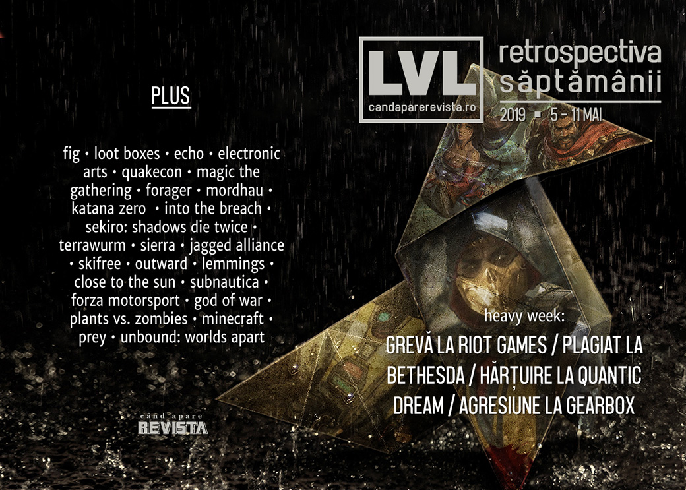

O săptămână plină de evenimente: angajații Riot Games întrerup lucrul în semn de protest, un senator american vrea să interzică loot boxes pentru minori, scandal la Gearbox între CEO-ul Randy Pitchford și fostul actor al lui Claptrap, acuzații de plagiat la Bethesda, investigații de hărțuire sexuală la QuanticDream, studiouri închise și altele. Iar în știri mai pozitive, Sony lansează documentarul making-of despre God of War, vechiul Minecraft e acum gratis, Euro Truck Simulator 2 își plasează noul expansion în România, Titan Quest lansează un nou expansion surpriză, iar Unbound: Worlds Apart dă drumul la Kickstarter.

Linkuri rapide:

* [Știri](#ştiri)
* [Articole (critică, dev, design)](#articole-critică-dev-design)
* [Made în România](#made-în-românia)
* [Anunţuri şi lansări de jocuri](#anunţuri-şi-lansări-de-jocuri)
* [Prăvălii de jocuri](#prăvălii-de-jocuri)

## Ştiri
* Peste 150 de angajați Riot Games au întrerupt lucrul și au protestat în fața sediului companiei față de politica de a impune contractual rezolvarea conflictelor interne prin arbitraj, cu scopul de a evita procese publice și costisitoare din punct de vedere al imaginii. ([Kotaku](https://kotaku.com/over-150-riot-employees-walk-out-to-protest-forced-arbi-1834566198), [Variety](https://variety.com/2019/gaming/news/riot-games-walkout-1203206306/), [The Verge](https://www.theverge.com/2019/5/7/18534477/riot-employees-walkout-forced-arbitration-workplace-culture), [The Guardian](https://www.theguardian.com/games/2019/may/07/riot-games-employees-walk-out-over-workplace-harassment-lawsuits), [Eurogamer](https://www.eurogamer.net/articles/2019-05-07-riot-employees-protest-sexism-and-forced-arbitration-with-mass-walkout), [GamesIndustry.biz](https://www.gamesindustry.biz/articles/2019-05-06-riot-games-employees-hold-walkout-over-forced-arbitration), [Gamasutra](https://www.gamasutra.com/view/news/342217/Riot_Games_walkout_sees_150_developers_protest_forced_arbitration.php))
* Platforma de crowdfunding Fig testează opțiuni de finanțare cu perioadă nelimitată, similare lansărilor de tip „early access”. ([Polygon](https://www.polygon.com/2019/5/8/18536775/vagrus-the-riven-realms-fig-open-access-beta), [GameDaily.biz](https://gamedaily.biz/article/846/fig-announces-new-open-ended-funding-option-for-indie-game-developers), [GamesIndustry.biz](https://www.gamesindustry.biz/articles/2019-05-09-fig-announces-open-ended-crowdfunding-program-open-access), [Gamasutra](https://www.gamasutra.com/view/news/342396/Fig_Open_Access_offers_devs_an_openended_crowdfunding_option.php))
* Un senator american anunță un proiect de lege care să interzică loot boxes și microtranzacțiile pay-2-win în jocurile vândute minorilor. ([Kotaku](https://kotaku.com/u-s-senator-introduces-bill-to-ban-loot-boxes-and-pay-1834612226), [The Verge](https://www.theverge.com/2019/5/8/18536806/game-studios-banned-loot-boxes-minors-bill-hawley-josh-blizzard-ea), [PC Gamer](https://www.pcgamer.com/us-senator-introducing-legislation-banning-loot-boxes-in-games-aimed-at-minors/), [Variety](https://variety.com/2019/gaming/news/missouri-senator-loot-box-ban-bill-1203208889/), [Ars Technica](https://arstechnica.com/gaming/2019/05/senator-hawley-announces-bill-banning-loot-boxes-pay-to-win-mechanics/), [Eurogamer](https://www.eurogamer.net/articles/2019-05-08-us-senator-proposes-legislation-to-ban-loot-boxes-pay-to-win-mechanics-and-other-manipulative-design), [GamesIndustry.biz](https://www.gamesindustry.biz/articles/2019-05-08-us-legislator-proposes-loot-box-ban), [Gamasutra](https://www.gamasutra.com/view/news/342286/Proposed_legislation_aims_to_ban_loot_boxes_in_the_United_States.php))
* Studioul Ultra Ultra, creatorii jocului **Echo**, se închide, fără a fi prezentat vreun motiv. Jocul rămâne însă la vânzare, iar filmul bazat pe joc rămâne în continuare în producție. ([VideoGamesChronicle](https://www.videogameschronicle.com/news/developer-of-nordic-game-of-the-year-echo-shuts-down/), [Eurogamer](https://www.eurogamer.net/articles/2019-05-08-echo-developer-ultra-ultra-has-shut-down), [GameSpace](https://www.gamespace.com/all-articles/news/ultra-ultra-closes-down), [GamesIndustry.biz](https://www.gamesindustry.biz/articles/2019-05-08-echo-developer-ultra-ultra-has-closed-down))
* Starbreeze are mari probleme cu lichiditățile și, dacă nu găsește finanțare urgentă, s-ar putea închide chiar de luna viitoare. ([VideoGamesChronicle](https://www.videogameschronicle.com/news/starbreeze-seeking-new-funding-to-stay-afloat/), [Destructoid](https://www.destructoid.com/starbreeze-is-teetering-on-the-brink-of-collapse-552809.phtml), [PCGamesInsider.biz](https://www.pcgamesinsider.biz/news/68984/starbreeze-on-the-hunt-for-funding-but-swedish-firm-could-close-by-as-early-as-next-month/), [GamesIndustry.biz](https://www.gamesindustry.biz/articles/2019-05-07-starbreeze-seeks-funding-to-avoid-imminent-liquidity-shortfall), [Games Informer](https://www.gameinformer.com/2019/05/10/starbreeze-unlikely-to-last-another-12-months))
* NetherRealm a început să investigheze condițiile care au dus la apariția rapoartelor despre crunch afirmând că dorește eliminarea cauzelor. ([VideoGamesChronicle](https://www.videogameschronicle.com/news/mortal-kombat-studio-responds-to-crunch-allegations/), [Eurogamer](https://www.eurogamer.net/articles/2019-05-07-mortal-kombat-developer-netherrealm-responds-to-accusations-of-workplace-toxicity-and-crunch-culture), [Variety](https://variety.com/2019/gaming/features/netherrealm-studio-warner-bros-games-toxic-1203204728/), [Variety](https://variety.com/2019/gaming/news/netherrealm-update-1203210372/), [GamesIndustry.biz](https://www.gamesindustry.biz/articles/2019-05-10-netherrealm-reportedly-responding-to-crunch-concerns-with-meeting-survey))
* Quantic Dream, studioul francez din spatele unor jocuri ca **Heavy Rain** sau **Detroit Become Human**, se confruntă (din nou) cu acuzații de hărțuire sexuală și asalt sexual ([Variety](https://variety.com/2019/gaming/news/game-workers-unite-quantic-dream-1203207491/), [Games Informer](https://www.gameinformer.com/2019/05/07/game-workers-union-calls-for-testimonies-from-quantic-dream-employees-about-harassment), [GamesIndustry.biz](https://www.gamesindustry.biz/articles/2019-05-07-gwu-joins-solidaires-informatique-in-call-for-testimonies-against-sexual-predators-at-quantic-dream), [VideoGamesChronicle](https://www.videogameschronicle.com/news/quantic-dream-responds-to-sexual-assault-claims/))
* O nouă controversă în care este implicat CEO-ul Gearbox, Randy Pitchford: fostul actor care i-a dat voce lui Claptrap în primele două jocuri **Borderlands** (și care a fost și vicepreședinte al unuia dintre departamentele companiei) afirmă că n-ar fi fost plătit pentru rolurile anterioare și îl acuză pe Pitchford de agresiune fizică, după ce l-ar fi împins în timpul unei întâlniri. ([Ars Technica](https://arstechnica.com/gaming/2019/05/claptrap-voice-actor-accuses-gearbox-ceo-of-assault-underpayment/), [PC Gamer](https://www.pcgamer.com/latest-borderlands-3-controversy-involves-an-alleged-physical-assault-against-former-claptrap-voice-actor/), [Eurogamer](https://www.eurogamer.net/articles/2019-05-07-tensions-between-claptrap-voice-actor-and-borderlands-studio-reach-fever-pitch), [GamesIndustry.biz](https://www.gamesindustry.biz/articles/2019-05-07-claptrap-voice-actor-accuses-randy-pitchford-amid-pay-dispute), [Newsweek](https://www.newsweek.com/borderlands-3-claptrap-voice-actor-david-eddings-randy-pitchford-1422396))
* Într-o prezentare pentru investitori, Electronic Arts anunță că au peste 500 milioane de conturi de jucători. ([PCGamesInsider.biz](https://www.pcgamesinsider.biz/news/68974/there-are-over-half-a-billion-active-ea-player-accounts-35m-people-subscribe-to-access-and-origin/))
* Bethesda a fost acuzată de plagiat după ce RPG-ul tabletop Elsweyr (plasat în universul Elder Scrolls), lansat gratuit, ar fi copiat pasaje întregi dintr-un RPG Dungeons & Dragons lansat de Wizards of the Coast cu câțiva ani înainte. Bethesda a retras jocul până la clarificarea situației. ([Ars Technica](https://arstechnica.com/gaming/2019/05/bethesdas-latest-elder-scrolls-adventure-taken-down-amid-cries-of-plagiarism/), [Polygon](https://www.polygon.com/2019/5/8/18537481/elder-scrolls-plagiarism-elsweyr-dungeons-and-dragons), [Variety](https://variety.com/2019/gaming/news/eso-elsweyr-plagiarism-1203209230/), [Eurogamer](https://www.eurogamer.net/articles/2019-05-09-bethesda-pulls-elder-scrolls-online-tabletop-rpg-following-plagiarism-allegations))
* SEGA cumpără Two Point Studios, studioul înființat de foști developeri Lionhead care au lansat jocul Two Point Hospital. ([Shacknews](https://www.shacknews.com/article/111649/sega-acquires-uk-based-two-point-studios), [Destructoid](https://www.destructoid.com/sega-acquire-uk-indie-developer-two-point-studios-552990.phtml), [Eurogamer](https://www.eurogamer.net/articles/2019-05-09-sega-acquires-two-point-hospital-developer-two-point-studio), [GamesIndustry.biz](https://www.gamesindustry.biz/articles/2019-05-09-sega-acquires-two-point-studios))
* Începând de anul acesta, Bethesda va organiza un QuakeCon și în Europa. Evenimentul va avea loc în luna iulie la Londra. ([Destructoid](https://www.destructoid.com/quakecon-will-expand-into-europe-this-summer-552869.phtml), [GameSpace](https://www.gamespace.com/all-articles/news/quakecon-is-coming-for-eu-and-its-bringing-doom-eternal/))

## Articole (critică, dev, design)

* ['I'd Have These Extremely Graphic Dreams': What It's Like To Work On Ultra-Violent Games Like Mortal Kombat 11](https://kotaku.com/id-have-these-extremely-graphic-dreams-what-its-like-t-1834611691) (Kotaku)
* [How Epic &amp; ILM&#8217;s John Knoll Tried to Recreate the Moon Landing for Microsoft&#8217;s Build 2019 Keynote](https://variety.com/2019/digital/features/microsoft-build-moon-landing-epic-john-knoll-1203205694/) (Variety)
* [Analogue’s console clones are a way to preserve gaming’s past](https://www.theverge.com/2019/5/6/18513025/analogue-console-clones-gaming-history-preservation-code-hardware) (The Verge)
* [How YouTube let&#8217;s plays are preserving video game history](https://www.rockpapershotgun.com/2019/05/06/how-youtube-lets-plays-are-preserving-video-game-history/) (RPS)
* [The Quiet Importance of Idle Animations](https://www.kotaku.co.uk/2019/05/06/the-quiet-importance-of-idle-animations) (Kotaku)
* [Rumors of the Death of Physical Video Games Have Been Greatly Exaggerated](https://variety.com/2019/gaming/features/physical-video-games-death-disc-digital-1203207513/) (Variety)
* [Magic: The Gathering Is So Complex It Could Stump A Computer](https://kotaku.com/magic-the-gathering-is-so-complex-it-could-stump-a-com-1834623872) (Kotaku)
* [The dangers of in-game data collection](https://www.polygon.com/features/2019/5/9/18522937/video-game-privacy-player-data-collection) (Polygon)
* [VCF East 2019: Vintage Computing, Modern Mindset](https://tedium.co/2019/05/07/vcf-east-2019-highlights/) (Tedium)
* [How it feels to die in a permadeath game after five years](https://www.pcgamer.com/how-it-feels-to-die-in-a-permadeath-game-after-five-years/) (PC Gamer)
* [Why are people modding Thomas the Tank Engine into video](https://theface.com/culture/why-are-people-modding-thomas-the-tank-engine-into-video-games) (The Face)
* [How the Videogame Aesthetic Flows Into All of Culture](https://www.wired.com/story/how-the-videogame-aesthetic-flows-into-all-of-culture/) (Wired)
* [Are there Games Computers Can’t Play?](https://remptongames.com/2019/05/11/are-there-games-computers-cant-play/) (Rempton Games)

---

### Actualitate
* [United devs stand, divided they crunch](https://www.gamesindustry.biz/articles/2019-05-08-united-devs-stand-divided-they-crunch-opinion) (GamesIndustry.biz)
* [The pressure to constantly update games is pushing the industry to a breaking point](https://www.pcgamer.com/the-pressure-to-constantly-update-games-is-pushing-the-industry-to-a-breaking-point) (PC Gamer)
* [Valve Index asks for innovation without incentive](https://www.gamesindustry.biz/articles/2019-05-09-the-valve-index-is-too-good-for-good-enough-opinion) (GamesIndustry.biz)
* [LudoNarraCon: The First Video Game Convention Hosted Entirely On Steam](https://kotaku.com/the-first-video-game-convention-hosted-entirely-on-stea-1834678339) (Kotaku)
* [ESA: Inside the Disarray Facing the Video Game Organization Behind E3](https://variety.com/2019/gaming/features/entertainment-software-association-mike-gallagher-e3-1203211280/) (Variety) (TL;DR pe [GamesIndustry.biz](https://www.gamesindustry.biz/articles/2019-05-11-esa-reportedly-troubled-by-eroding-trust-challenging-management-styles))

---

### _Not-a-review_
* [In Forager the real enemy is your own ennui](https://www.pcgamer.com/in-forager-the-real-enemy-is-your-own-ennui/) (PC Gamer)
* [What it’s like to map a galaxy in Elite: Dangerous](https://www.polygon.com/features/2019/5/6/18525941/elite-dangerous-distant-worlds-2-exploration-galactic-mapping-project) (Polygon)
* [Mordhau might be the best medieval combat game I’ve ever played](https://www.polygon.com/2019/5/9/18539881/mordhau-steam-melee-combat-physics-review) (Polygon)
* [The time I transcribed every line of Bastion&#8217;s dialogue (twice) and found another, better story hiding underneath it](https://www.rockpapershotgun.com/2019/05/09/the-time-i-transcribed-every-line-of-bastions-dialogue-twice-and-found-another-better-story-hiding-underneath-it/) (RPS)
* [Katana ZERO Offers Only Excuses](https://unwinnable.com/2019/05/08/katana-zero-offers-only-excuses/) (Unwinnable)
* [Into The Breach Helped Me Accept Imperfection](https://intothespine.com/2019/05/06/into-the-breach-and-imperfection/) (Into The Spine)
* [The folklore roots of Sekiro's anus-ball snatching enemies](https://www.eurogamer.net/articles/2019-05-10-the-folklore-roots-of-sekiros-anus-ball-snatching-enemies) (Eurogamer)
* [The Silent Rot of Sekiro](https://unwinnable.com/2019/05/09/the-silent-rot-of-sekiro/) (Unwinnable)
* [Charting Our Emotional Landscapes through Sekiro: Shadows Die Twice’s Hanbei](https://www.pastemagazine.com/articles/2019/05/charting-our-emotional-landscapes-through-sekiro-s.html) (Paste)
* [“Sekiro: Shadows Die Twice”: Heart and Soul amidst Blood and Chaos](https://medium.com/@michaellattimer94/sekiro-shadows-die-twice-heart-and-soul-amidst-blood-and-chaos-5ffd2910c42) (Medium)

---

### Industrie
* [Blizzard wants to cut out World of Warcraft crunch, &quot;not there 100% yet&quot;](https://www.eurogamer.net/articles/2019-05-07-blizzard-aiming-to-develop-world-of-warcraft-with-no-crunch) (Eurogamer)
* [Platinum fights for its future](https://www.videogameschronicle.com/features/interviews/platinum-games/) (VideoGamesChronicle)
* [The Terrawurm experiment: Can indies work together on multiple games?](https://www.gamesindustry.biz/articles/2019-05-07-the-terrawurm-experiment-can-indies-work-together-on-multiple-games) (GamesIndustry.biz)
* [What responsibility do leaders have to their developers?](https://www.gamesindustry.biz/articles/2019-05-07-what-responsibility-do-leaders-have-to-their-developers) (GamesIndustry.biz)
* [EA and Activision need to show us something new](https://www.gamesindustry.biz/articles/2019-05-10-ea-and-activision-need-to-show-us-something-new-opinion) (GamesIndustry.biz)
* [&quot;The industry is becoming less competitive&quot;; Geoff Keighley talks Google Stadia, VR and The Game Awards](https://www.spieltimes.com/featured/geoff-keighley-stadia-vr-the-game-awards/) (Spiel Times)

---

### Istorie, retrospectivă
* [In 1998, &#39;Jagged Alliance&#39; Developers Threatened a Walkout—And It Worked](https://www.vice.com/en_us/article/wjvjex/in-1998-jagged-alliance-developers-threatened-a-walkoutand-it-worked) (Vice)
* [The History Of Lightsabers In Video Games](https://kotaku.com/the-history-of-lightsabers-in-video-games-1834510170) (Kotaku)
* [The Golden Age Of Sierra On-Line&#39;s &#39;Big Box&#39; PC Games](https://kotaku.com/the-golden-age-of-sierra-on-lines-big-box-pc-games-1834597516) (Kotaku)
* [Fortnite’s island is a virtual world layered with history](https://www.theverge.com/2019/5/10/18537469/fortnite-map-island-history-neo-tilted-volcano) (The Verge)
* [Reevaluating the success of Nintendo 3DS](https://www.gamesindustry.biz/articles/2019-05-09-reevaluating-the-success-of-nintendo-3ds) (GamesIndustry.biz)
* [How George Fan created the wacky Plants vs. Zombies a decade ago](https://venturebeat.com/2019/05/10/how-george-fan-created-the-wacky-plants-vs-zombies-a-decade-ago/) (VentureBeat)
* [The Abominable Snow Monster from SkiFree](https://unwinnable.com/2019/05/10/abominable-snow-monster-skifree/) (Unwinnable)
* [From &#39;Putt Putt&#39; to &#39;Freddi Fish&#39;—How Humongous Entertainment Made Edutainment Fun](https://www.vice.com/en_us/article/xwnwya/from-putt-putt-to-freddi-fishhow-humongous-entertainment-made-edutainment-fun) (Vice)
* [How Edutainment Became “Chocolate-Covered Broccoli”](https://tedium.co/2019/05/09/edutainment-math-blaster-chocolate-covered-broccoli/) (Tedium)

---

### Dev, making of, mecanici
* [The secrets behind the exquisite handling of Forza Motorsport](https://www.pcgamer.com/the-secrets-behind-the-exquisite-handling-of-forza-motorsport/) (PC Gamer)
* [Designing  SteamWorld Quest 's card-based battle system](http://www.gamasutra.com/view/news/342028/Designing_SteamWorld_Quests_cardbased_battle_system.php) (Gamasutra)
* [How virtual reality positional tracking works](https://venturebeat.com/2019/05/05/how-virtual-reality-positional-tracking-works/) (VentureBeat)
* [Big game, small team, no crunch: Behind the success of open world RPG  Outward](https://www.gamasutra.com/view/news/342394/Big_game_small_team_no_crunch_Behind_the_success_of_open_world_RPG_Outward.php) (Gamasutra)
* [Video: The  Lemmings  Classic Game Postmortem](https://www.gamasutra.com/view/news/342395/Video_The_Lemmings_Classic_Game_Postmortem.php) (Gamasutra)
* [Watch  Close To The Sun's  developers talk launching on the Epic Game Store](https://www.gamasutra.com/view/news/342287/Watch_Close_To_The_Suns_developers_talk_launching_on_the_Epic_Game_Store.php) (Gamasutra)
* [Designing  Baba is You 's delightfully innovative rule-writing system](https://www.gamasutra.com/view/news/342113/Designing_Baba_is_Yous_delightfully_innovative_rulewriting_system.php) (Gamasutra)
* [Not a Mimic](http://www.firstpersonscholar.com/not-a-mimic/) (First Person Scholar)
* [Video: A behind-the-scenes look at how  Subnautica  was made](https://www.gamasutra.com/view/news/342462/Video_A_behindthescenes_look_at_how_Subnautica_was_made.php) (Gamasutra)
* Sony au lansat documentarul [Raising Kratos](https://www.youtube.com/watch?v=lJZWKBDXXFY) despre realizarea jocului **God of War**. (YouTube) (TL;DW pe [Kotaku](https://kotaku.com/the-parental-struggles-in-2018-s-god-of-war-echoed-thos-1834681575))

---

### Design, world-building, artă
* [How the Devs Behind &#39;Sable&#39; Found Inspiration in the Enigmatic](https://www.vice.com/en_us/article/neazk8/how-the-devs-behind-sable-found-inspiration-in-the-enigmatic) (Vice)
* [Game Box Art Critique May: Rage 2, Team Sonic Racing, A Plague Tale: Innocence](https://www.videogamer.com/features/game-box-art-critique-may-rage-2-team-sonic-racing-a-plague-tale-innocence) (VideoGamer)
* [Meet the Minecraft artist whose beautiful sculptures skyrocket to the top of Reddit](https://www.pcgamer.com/minecraft-art-sculptures/) (PC Gamer)
* [The Witcher 3&#39;s Creators Have Imagined Geralt As A Samurai](https://kotaku.com/the-witcher-3s-creators-have-imagined-geralt-as-a-samur-1834570265) (Kotaku)

## Made în România
* Studioul Bearded Giant a anunțat un joc nou: Space Mercs. ([Site oficial Bearded Giant](https://beardedgiant.games/announcement-space-mercs-launches-in-june/), [ZonaIT](https://zonait.ro/un-nou-joc-romanesc-space-mercs/), [GamingOnLinux](https://www.gamingonlinux.com/articles/bearded-giant-games-have-announced-the-3d-dogfighting-game-space-mercs.14071))
* Alien Pixel Studios au dat startul la campania Kickstarter pentru **Unbound: Worlds Apart**, ocazie cu care oferă și un demo. ([PC Gamer](https://www.pcgamer.com/unbound-worlds-apart-is-a-pretty-puzzle-platformer-and-you-can-try-a-demo-today/), [Go4Games](https://jocuri.go4it.ro/stiri-si-articole/diverse/jocul-romanesc-unbound-worlds-apart-primeste-prima-versiune-demo-si-campanie-de-finantare-prin-kickstarter-18119507))
* Bucharest Gaming Week 2019 are loc la începutul lunii noiembrie, iar evenimentul principal se desfășoară la Palatul Parlamentului. ([Go4Games](http://jocuri.go4it.ro/stiri-si-articole/diverse/bucharest-gaming-week-2019-se-va-desfasura-la-palatul-parlamentului-18121696), [WASD.ro](https://wasd.ro/news/bgw-2019-gamerii-iau-cu-asalt-palatul-parlamentului/))

## Anunţuri şi lansări de jocuri
* [First game from ex-Blizzard devs Bonfire Studios will be “PC focused” for a “core audience”](https://www.pcgamesn.com/bonfire-studios-first-game-pc-focused) (PCGamesN)

### Anunţate
* **Spleen** ([PC Gamer](https://www.pcgamer.com/spleen-is-a-watercolour-rpg-about-childhood-nostalgia-now-on-kickstarter/))
* **Koral**, un nou joc „subacvatic” ([Destructoid](https://www.Destructoid.com/koral-is-a-love-letter-to-the-ocean-in-video-game-form-552813.phtml))
* **Eve Online Invasion** (expansion nou) ([VentureBeat](https://venturebeat.com/2019/05/04/eve-online-gets-a-new-adversary-with-invasion-expansion/))
* **Ghost Recon Breakpoint** ([PC Gamer](https://www.pcgamer.com/ghost-recon-breakpoint-release-date/), [Kotaku](https://kotaku.com/ubisoft-announces-ghost-recon-breakpoint-a-sequel-to-1834647973), [VideoGamesChronicle](https://www.videogameschronicle.com/news/ghost-recon-breakpoint-has-a-lot-more-for-solo-players/))
* **John Wick Hex**, un joc de… tactică pe ture (serios!) de la creatorul jocului Thomas Was Alone ([VideoGamesChronicle](https://www.videogameschronicle.com/news/mike-bithell-working-on-john-wick-game/), [RPS](https://www.rockpapershotgun.com/2019/05/08/john-wick-hex-lets-you-choose-keanus-every-move/), [Shacknews](https://www.shacknews.com/article/111639/john-wick-hex-strategy-game-to-release-on-epic-games-store))
* **Road to the Black Sea**, un nou expansion pentru **Euro Truck Simulator 2** care aduce șosele din România, Bulgaria și Turcia ([RPS](https://www.rockpapershotgun.com/2019/05/10/euro-truck-simulator-2-stopping-in-bulgaria-and-greece-soon/))
* Câteva exclusivități PS4 anunțate la prezentarea Sony State of Play de săptămâna aceasta:
  * **Away: Survival Series** ([Games Informer](https://www.gameinformer.com/2019/05/09/be-a-sugar-glider-in-away-survival-series))
  * **Predator: Hunting Grounds** ([VideoGamesChronicle](https://www.videogameschronicle.com/news/sony-reveals-predator-hunting-grounds-with-trailer/))

### Acum cu dată de lansare
* **Bubsy: Paws on Fire**: 16 mai ([Destructoid](https://www.destructoid.com/bubsy-paws-on-fire-will-ignite-ps4-and-pc-next-week-switch-port-delayed-552998.phtml))
* **Railroad Corporation** (early access): 27 mai ([PC Gamer](https://www.pcgamer.com/railroad-corporation-steams-into-early-access-this-month/))
* **Barotrauma** (early access): 5 iunie ([Steam Community](https://steamcommunity.com/games/602960/announcements/detail/1598126663002403981))

### Amânate
* **The Black Masses**: _vara 2019_ ([DSOGaming ](https://www.dsogaming.com/news/the-black-masses-has-been-delayed-until-summer-2019-free-demo-coming-soon/))

### Lansate
* 7 mai: **Descenders** (iese din early access) ([Steam](https://store.steampowered.com/app/681280/Descenders/))
* 7 mai: **Brief Battles** ([Steam](https://store.steampowered.com/app/819980/Brief_Battles/))
* 7 mai: **Shakedown: Hawaii** ([Epic Store](https://www.epicgames.com/store/en-US/product/shakedown-hawaii/))
* 7 mai: **Puyo Puyo Champions** ([Steam](https://store.steampowered.com/app/971620/Puyo_Puyo_Champions___e/))
* 7 mai: **Trials of Fire** ([Steam](https://store.steampowered.com/app/1038370/Trials_of_Fire/))
* 8 mai: **Infected Shelter** ([Steam](https://store.steampowered.com/app/926390/Infected_Shelter/))
* 9 mai: **Ferret Scoundrels** (early access) ([Steam](https://store.steampowered.com/app/1064320/Ferret_Scoundrels/))
* 9 mai: **Swag and Sorcery** ([Steam](https://store.steampowered.com/app/929010/Swag_and_Sorcery/))
* 9 mai: **Yakuza Kiwami 2** ([Steam](https://store.steampowered.com/app/927380/Yakuza_Kiwami_2/))
* 9 mai: **Astrologaster** ([Steam](https://store.steampowered.com/app/742520/Astrologaster/))
* 9 mai: **Blood: Fresh Supply** - vechiul **Blood** se relansează pentru sisteme moderne  ([gog.com](https://www.gog.com/game/blood_fresh_supply), [Steam](https://store.steampowered.com/app/1010750/Blood_Fresh_Supply/), [Humble Store](https://www.humblebundle.com/store/blood-fresh-supply), [Discord](https://discordapp.com/store))
* 9 mai: **Titan Quest: Atlantis** (un nou expansion) ([Steam](https://store.steampowered.com/app/1071200/Titan_Quest_Atlantis/))
* 9 mai: **Life Is Strange 2 - Episode 3** ([Steam](https://store.steampowered.com/app/895491/Life_is_Strange_2__Episode_3/))
* 9 mai: **SiNKR 2** ([Steam](https://store.steampowered.com/app/973220/SiNKR_2/))
* 10 mai: **TwinCop** ([Steam](https://store.steampowered.com/app/676930/TwinCop/))
* 10 mai: **Snakeybus** ([Steam](https://store.steampowered.com/app/1012560/Snakeybus/))

## Prăvălii de jocuri

* [Free Games Give Developers and New Storefronts a Boost](https://gamedaily.biz/article/850/how-free-game-initiatives-are-giving-titles-extended-runways) (GameDaily.biz)
* [Emily Greer: &quot;New stores are changing the expectation that only Steam matters&quot;](https://www.gamesindustry.biz/articles/2019-05-09-emily-greer-new-stores-are-changing-the-expectation-that-only-steam-matters) (GamesIndustry.biz)
* [Hostile Takeover: What Will Come of Epic Games vs. Steam?](https://www.pcinvasion.com/hostile-takeover-epic-games-vs-steam/) (PC Invasion)

### Știri
* [Tim Sweeney addresses review bombing of Epic Games partners](https://www.shacknews.com/article/111591/tim-sweeney-addresses-review-bombing-of-epic-games-partners) (Shacknews)
* [GOG rejected Heaven's Vault, but is now having second thoughts](https://www.pcgamer.com/gog-rejected-heavens-vault-but-is-now-having-second-thoughts) (PC Gamer)
* [CD Projekt Red opens official merchandise store](https://www.shacknews.com/article/111628/cd-projekt-red-opens-official-merchandise-store) (Shacknews)

### Jocuri noi în catalog
* [EA adds 12 Star Wars games to Origin Access, including original Battlefront 2](https://www.pcgamer.com/ea-adds-12-star-wars-games-to-origin-access-including-original-battlefront-2/) (PC Gamer)
* [EA Access coming to PlayStation 4 in July; leadership discusses why it took so long](https://gamedaily.biz/article/839/ea-access-coming-to-playstation-4-in-july-leadership-discusses-why-it-took-so-long) (GameDaily.biz)
* [New to the Nintendo eShop this week: Saints’ Row the Third and Sniper Elite V2](https://www.polygon.com/nintendo-switch/2019/5/9/18563527/nintendo-switch-saints-row-the-third-sniper-elite-v2) (Polygon)

### Jocuri gratis și free weekends
* [Minecraft Classic brings the original 2009 version to web browsers, for free](https://www.pcgamer.com/minecraft-classic-brings-the-original-2009-version-to-web-browsers-for-free/) (PC Gamer)
* [Divide By Sheep is free to keep on Steam this weekend](https://www.pcgamer.com/divide-by-sheep-is-free-to-keep-on-steam-this-weekend/) (PC Gamer)
* [Funcom announces Steam Free Weekend for Conan Exiles, starts later today](https://www.dsogaming.com/news/funcom-announces-steam-free-weekend-for-conan-exiles-starts-later-today/) (DSOGaming )
* [Sci-fi strategy game Stellaris is free to play this weekend on Steam](https://www.eurogamer.net/articles/2019-05-09-sci-fi-strategy-game-stellaris-is-free-to-play-this-weekend-on-steam) (Eurogamer)
* [File://maniac hides a serial killer on your hard drive for free](https://www.rockpapershotgun.com/2019/05/10/free-adventure-file-maniac-hides-murders-on-your-pc/) (RPS)

### Reduceri și promoții
* [Black Ops 4 Battle Edition is just $12 in the latest Humble Monthly Bundle](https://www.pcgamer.com/black-ops-4-battle-edition-is-just-dollar12-in-the-latest-humble-monthly-bundle/) (PC Gamer)
* [Catch up on PS4 games with this latest PlayStation Store flash sale](https://www.Destructoid.com/catch-up-on-ps4-games-with-this-latest-playstation-store-flash-sale-553197.phtml) (Destructoid)
* [Best PC gaming deals of the week &#8211; 10th May 2019](https://www.rockpapershotgun.com/2019/05/10/best-pc-gaming-deals-of-the-week-10th-may-2019/) (RPS)
* [Humble Store Spring 2019 Sale Now Live](https://www.pcinvasion.com/humble-store-spring-2019-sale-now-live/) (PC Invasion)

---

{}
**Retrospectiva săptămânii** este rubrica duminicală în care trecem în revistă evenimentele săptămânii de pe frontul de gaming: știri şi articole (scrise de alții, bineînțeles, că e mai ușor aşa), industrie, lansări, oferte de jocuri, toate numai de savurat la cafeaua de duminică dimineața.

De asemenea, rubrica e deschisă oricui vrea și poate contribui. Dacă ai citit vreun articol sau vreo știre interesantă și crezi că merită incluse în retrospectiva săptămânii, te așteptăm pe forum pe unul dintre topicurile dedicate: [Știri](https://forum.candaparerevista.ro/viewtopic.php?f=4&t=46), [Articole](https://forum.candaparerevista.ro/viewtopic.php?f=4&t=206), [Gaming România](https://forum.candaparerevista.ro/viewtopic.php?f=4&t=1622)].
{}
