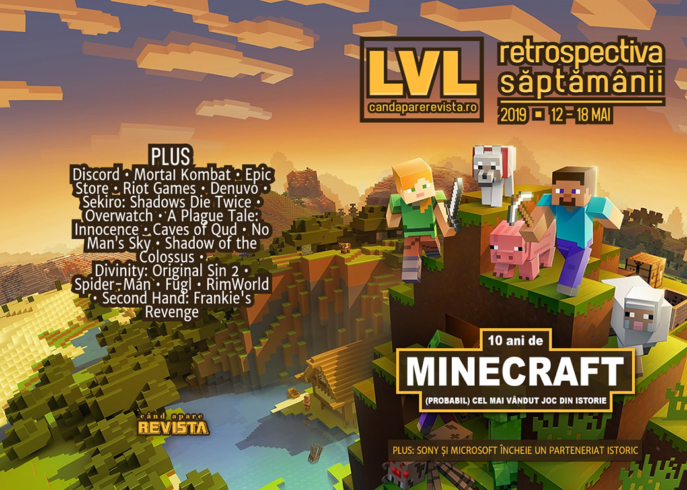

Minecraft aniversează 10 ani de existență și devine (aproape) cel mai vândut joc din istorie, vom primi un film Mortal Kombat nou, Sony și Microsoft anunță un parteneriat istoric, RAGE 2 se lansează și este spart din prima zi, iar Epic anunță prima sa mare perioadă de reduceri.

Linkuri rapide:

* [Știri](#ştiri)
* [Articole (critică, dev, design)](#articole-critică-dev-design)
* [Made în România](#made-în-românia)
* [Anunţuri şi lansări de jocuri](#anunţuri-şi-lansări-de-jocuri)
* [Prăvălii de jocuri](#prăvălii-de-jocuri)

## Știri
* **Minecraft** a aniversat 10 ani de existență și a anunțat că totalul unităților vândute a depășit 176 de milioane, plus un joc AR pentru mobile. ([VideoGamesChronicle](https://www.videogameschronicle.com/news/minecraft-sales-top-176-million/), [GamesIndustry.biz](https://www.gamesindustry.biz/articles/2019-05-17-minecraft-has-sold-176-million-copies-worldwide), [VentureBeat](https://venturebeat.com/2019/05/17/at-10-minecraft-hits-176-million-sales-and-announces-ar-game-for-ios-and-android/))
* Discord ajunge la 250 de milioane de utilizatori, din care 50 de milioane doar în primele trei luni din 2019. ([GamesIndustry.biz](https://www.gamesindustry.biz/articles/2019-05-13-discord-reaches-250m-users-after-just-four-years), [VentureBeat](https://venturebeat.com/2019/05/13/discord-crosses-250-million-users-as-it-hits-4-year-anniversary/), [Gamasutra](https://www.gamasutra.com/view/news/342526/Discord_surpasses_250_million_registered_users_in_four_years.php), [GameSpace](https://www.gamespace.com/all-articles/news/discord-anniversary-250-million/), [PCGamesInsider.biz](http://www.pcgamesinsider.biz/news/69011/discord-attracted-50m-new-users-in-first-three-months-of-2019/), [TechSpot](https://www.techspot.com/news/80064-discord-has-surpassed-250-million-registered-users.html))
* Vom avea un film Mortal Kombat nou. ([Eurogamer](https://www.eurogamer.net/articles/2019-05-14-it-looks-like-the-mortal-kombat-movie-reboot-is-actually-happening), [DSOGaming ](https://www.dsogaming.com/news/new-mortal-kombat-movie-has-been-officially-announced/), [Destructoid](https://www.destructoid.com/new-mortal-kombat-movie-finally-enters-pre-production-553556.phtml), [USgamer](https://www.usgamer.net/articles/mortal-kombat-movie-reboot-pre-production-resident-evil-screenwriter-warner-bros))
* **Grand Theft Auto V** a ajuns la 110 milioane de unități vândute. ([PC Gamer](https://www.pcgamer.com/gta-5-has-sold-nearly-110-million-copies/), [Gamasutra](https://www.gamasutra.com/view/news/342624/GTA_V_is_nearing_110_million_sales_worldwide.php))
* Epic Games va primi un premiu BAFTA special pentru „inovațiile aduse industriei”. ([BAFTA](http://www.bafta.org/media-centre/press-releases/bafta-to-honour-epic-games-with-special-award), [Eurogamer](https://www.eurogamer.net/articles/2019-05-14-tim-sweeney-to-collect-special-bafta-award-for-epic-games), [Shacknews](https://www.shacknews.com/article/111721/bafta-to-honor-epic-games-with-special-award-at-e3-2019), [VideoGamesChronicle](https://www.videogameschronicle.com/news/epic-games-to-receive-bafta-special-award/))
* Riot Games nu renunță la arbitrajul impus, în ciuda protestelor de [săptămâna trecută](). ([Eurogamer](https://www.eurogamer.net/articles/2019-05-17-riot-games-refuses-to-budge-on-arbitration-for-ongoing-employee-lawsuits-despite-mass-walkout), [Kotaku](https://kotaku.com/as-deadline-passes-riot-games-doesn-t-budge-on-key-wal-1834842904), [Variety](https://variety.com/2019/gaming/news/riot-protest-aribration-1203218517/), [GamesIndustry.biz](https://www.gamesindustry.biz/articles/2019-05-17-riot-games-stands-firm-against-walkout-employees-demands), [PC Gamer](https://www.pcgamer.com/walkout-organizers-disappointed-by-riots-refusal-to-change-forced-arbitration-policy/))
* Sony și Microsoft anunță un parteneriat pentru a dezvolta tehnologii noi pentru cloud gaming și AI. Da, ați citit bine, Sony și Microsoft. ([Microsoft Store](https://news.microsoft.com/2019/05/16/sony-and-microsoft-to-explore-strategic-partnership/), [Eurogamer](https://www.eurogamer.net/articles/2019-05-16-microsoft-and-sony-collaborating-on-cloud-based-solutions-for-gaming-experiences-and-content-streaming), [Polygon](https://www.polygon.com/2019/5/16/18628245/sony-microsoft-collaboration-google-stadia-cloud-gaming), [VideoGamesChronicle](https://www.videogameschronicle.com/news/microsoft-and-sony-partner-for-cloud-gaming/), [PC Gamer](https://www.pcgamer.com/sony-and-microsoft-team-up-to-develop-new-gaming-technology/), [GamesIndustry.biz](https://www.gamesindustry.biz/articles/2019-05-16-sony-and-microsoft-partner-for-cloud-ai-innovations))
* **RAGE 2** s-a lansat săptămâna aceasta, iar sistemul de protecție Denuvo a fost spart din prima zi. Dar „spart” e impropriu spus, deoarece versiunea jocului care se vindea pe Bethesda Store nu era protejată deloc, ceea ce a ușurat munca crackerilor. ([DSOGaming ](https://www.dsogaming.com/news/rage-2s-bethesda-store-version-does-not-use-the-denuvo-anti-tamper-tech-has-been-cracked/), [TechSpot](https://www.techspot.com/news/80084-denuvo-protected-games-cracked-faster-than-ever.html)). Drept urmare, Bethesda a lansat un patch care scoate sistemul de protecție și din versiunea de Steam, de acum inutil. ([PC Gamer](https://www.pcgamer.com/rage-2-patch-removes-denuvo-but-performance-is-worse/), [Kotaku](https://kotaku.com/rage-2-drops-denuvo-drm-in-record-time-1834854493), [TechSpot](https://www.techspot.com/news/80130-bethesda-removes-denuvo-rage-2-following-day-one.html))

## Articole (critică, dev, design)

* [Are there any good movies based on video games?](https://www.theguardian.com/film/2019/may/10/detective-pikachu-movies-based-on-video-games) (The Guardian)
* [What becomes of the unplayable games?](https://www.videogameschronicle.com/features/what-becomes-of-the-unplayable-games/) (VideoGamesChronicle)
* [The Fight To Make Games Accessible For Everyone](https://www.gameinformer.com/2019/05/15/the-fight-to-make-games-accessible-for-everyone) (Games Informer)
* [How Video-Game Engines Help Create Visual Effects on Movie Sets in Real Time](https://variety.com/2019/biz/features/video-game-engines-visual-effects-real-time-1203214992/) (Variety)
* [Great Britain as a Video Game Setting](https://www.kotaku.co.uk/2019/05/14/great-britain-as-a-video-game-setting) (Kotaku)

---

### Actualitate
* [Denuvo DRM cracks seem to be happening faster and faster](https://www.pcgamer.com/denuvo-cracks-2019/) (PC Gamer)
* [Apple ruling opens a can of worms for digital storefronts](https://www.gamesindustry.biz/articles/2019-05-17-apple-ruling-is-a-bag-of-worms-for-digital-storefronts) (GamesIndustry.biz)
* [What yesterday's EU court ruling means for the games industry](https://www.gamesindustry.biz/articles/2019-05-15-what-yesterdays-eu-court-ruling-means-for-the-games-industry) (GamesIndustry.biz)

#### Loot boxes
* [&#8216;Zero&#8217; chance it passes: Game analysts break down senator&#8217;s anti-loot box bill](https://venturebeat.com/2019/05/13/zero-chance-it-passes-game-analysts-break-down-senators-anti-loot-box-bill/) (VentureBeat)
* [Who is responsible for loot boxes?](https://www.gamesindustry.biz/articles/2019-05-16-who-is-responsible-for-loot-boxes) (GamesIndustry.biz)
* [Why we're headed toward loot box legislation](https://www.gamesindustry.biz/articles/2019-05-16-why-were-headed-toward-loot-box-legislation-opinion) (GamesIndustry.biz)

#### Sony+Microsoft
* [What Microsoft and Sony’s streaming partnership means for gaming’s future](https://arstechnica.com/gaming/2019/05/what-microsoft-and-sonys-streaming-partnership-means-for-gamings-future/) (Ars Technica)
* [What does Microsoft and Sony's &lsquo;strategic partnership&rsquo; even mean?](https://www.pcgamer.com/what-does-microsoft-and-sonys-and-strategic-partnership-even-mean/) (PC Gamer)

---

### _Not-a-review_
* [The Overwatch Workshop is already a hit, and it could be the future of the game](https://www.theverge.com/2019/5/14/18617638/overwatch-workshop-future-blizzard-interview) (The Verge)
* [The secret sci-fi greatness of Call of Duty: Infinite Warfare](https://www.pcgamer.com/the-secret-sci-fi-greatness-of-call-of-duty-infinite-warfare/) (PC Gamer)
* [&#39;Totally Accurate Battle Simulator&#39; Captures the Goofy Mayhem of Mass Violence](https://www.vice.com/en_us/article/pajkaz/totally-accurate-battle-simulator-captures-the-goofy-mayhem-of-mass-violence) (Vice)
* [A Sekiro Journey: Isshin, the Sword Saint](https://unwinnable.com/2019/05/15/a-sekiro-journey-isshin-the-sword-saint/) (Unwinnable)
* [Panacea](https://problemmachine.wordpress.com/2019/05/18/sekiro-intimacy-and-immortality/p) (The Problem Machine)
* [Memory Trading](http://www.firstpersonscholar.com/memory-trading/) (First Person Scholar)
* [Death Gets Heavy in A Plague Tale: Innocence](https://www.pastemagazine.com/articles/2019/05/a-plague-tale-innocence-makes-death-matter.html) (Paste)

---

### Industrie
* [Assassin's Creed should partner with Stranger Things: Lessons from Changing Channels](https://www.gamesindustry.biz/articles/2019-05-13-tv-still-doesnt-trust-games-and-other-things-we-learned-at-changing-channels) (GamesIndustry.biz)
* [Why Codemasters wants to be the Disney Channel of racing](https://www.pcgamesinsider.biz/interviews-and-opinion/69015/why-codemasters-wants-to-be-the-disney-channel-of-racing/) (PCGamesInsider.biz)
* [Take-Two: Investors are re-rating the games business](https://www.gamesindustry.biz/articles/2019-05-15-take-two-investors-are-re-rating-the-games-business) (GamesIndustry.biz)
* [Bigben Interactive aims to be &quot;the middleweight champion&quot; of games publishing](https://www.gamesindustry.biz/articles/2019-05-14-bigben-interactive-aims-to-be-the-middleweight-champion-of-games-publishing) (GamesIndustry.biz)
* [Nvidia talks ray tracing, PC versus console gaming, and $1 billion drop in revenue](https://www.pcgamer.com/nvidia-talks-ray-tracing-pc-versus-console-gaming-and-dollar1-billion-drop-in-revenue/) (PC Gamer)

---

### Istorie, retrospectivă
* [How Monster Hunter World Became Capcom&#39;s Greatest Success](https://kotaku.com/how-monster-hunter-world-became-capcoms-greatest-succes-1834759462) (Kotaku)
* [Graveyard: Scarface - The World is Yours](https://www.hardcoregamer.com/2019/05/14/graveyard-scarface-the-world-is-yours/330807/) (Hardcore Gamer)
* [The timeless magic of Shadow of the Colossus](https://www.gamesindustry.biz/articles/2019-05-14-the-timeless-magic-of-shadow-of-the-colossus) (GamesIndustry.biz)
* [How The Walking Dead: The Final Season&#039;s Creative Director Kept His Vision Alive During Telltale&#039;s Demise](https://www.usgamer.net/articles/the-walking-dead-final-season-kent-mudle-creative-director-telltale-interview-feature-pax-east-2019) (USgamer)
* [You can explore Minecraft's 10-year history in a massive new interactive in-game museum](https://www.eurogamer.net/articles/2019-05-13-you-can-explore-minecrafts-10-year-history-in-a-massive-new-interactive-in-game-museum) (Eurogamer)
* [Minecraft: A Complete History](https://www.gamereactor.eu/articles/763753/Minecraft+A+Complete+History/) (Gamereactor)

---

### Dev, making of, mecanici
* [Video: Insomniac's technical postmortem of  Marvel's Spider-Man](https://www.gamasutra.com/view/news/342546/Video_Insomniacs_technical_postmortem_of_Marvels_SpiderMan.php) (Gamasutra)
* [Art Design Deep Dive: The gorgeous voxel creatures of  Fugl](https://www.gamasutra.com/view/news/342524/Art_Design_Deep_Dive_The_gorgeous_voxel_creatures_of_Fugl.php) (Gamasutra)
* [Video: The making of Larian Studios'  Divinity: Original Sin 2](https://www.gamasutra.com/view/news/342645/Video_The_making_of_Larian_Studios_Divinity_Original_Sin_2.php) (Gamasutra)
* [Video: How  RimWorld  found success through ridiculous, contrarian design](https://www.gamasutra.com/view/news/342844/Video_How_RimWorld_found_success_through_ridiculous_contrarian_design.php) (Gamasutra)
* [Video: Lessons learned in making  This War of Mine  and  Frostpunk](https://www.gamasutra.com/view/news/342725/Video_Lessons_learned_in_making_This_War_of_Mine_and_Frostpunk.php) (Gamasutra)
* [Checking the Score: The Sounds of Cyberpunk in VA-11 Hall-A](https://www.hardcoregamer.com/2019/05/18/checking-the-score-the-sounds-of-cyberpunk-in-va-11-hall-a/331165/) (Hardcore Gamer)
* [Divinity: Original Sin&#8217;s team “love it&#8221; when players break the game](https://www.pcgamesn.com/divinity-original-sin-2/divinity-original-sin-2-classes) (PCGamesN)

---

### Design, world-building, artă
* [The genius of No Man’s Sky’s imaginative architects](https://www.polygon.com/2019/5/16/18628032/no-mans-sky-planets-art-sculpture-agt-fever-cloud) (Polygon)
* [Samwise Didier discusses the history of Warcraft's art](https://www.shacknews.com/article/111727/samwise-didier-discusses-the-history-of-warcrafts-art) (Shacknews)

## Made în România
* Rikodu anunță că **Second Hand: Frankie's Revenge** se lansează în early access pe 28 mai. ([Twitter Rikodu](https://twitter.com/secondhandgame/status/1128658147600752640), [GameSpace](https://www.gamespace.com/all-articles/news/second-hand-frankies-revenge-launches-28-may/), [Steam](https://store.steampowered.com/app/727930/Second_Hand_Frankies_Revenge/))
* Interviu pe Indie Games Plus cu Nicolae Berbece de la Those Awesome Guys, care au dezvoltat jocul **Move or Die**, dar s-au apucat și de publishing, cu recentul **Monster Prom**. ([Indie Games Plus](https://indiegamesplus.com/2019/05/publisher-profile-those-awesome-guys))

## Anunţuri şi lansări de jocuri
* [Untitled &#8216;Vampire: The Masquerade&#8217; RPG in Works](https://variety.com/2019/gaming/news/vampire-the-masquerade-rpg-1203214981/) (Variety)
* [Ubisoft has three unannounced games that will release before April 2020](https://www.dsogaming.com/news/ubisoft-has-three-unannounced-games-that-will-release-before-april-2020/) (DSOGaming )
* [Ghostbusters Remaster Seemingly Leaked by Asian Rating Boards, May be an Epic Exclusive](https://wccftech.com/ghostbusters-remaster-leak-epic-exclusive/) (Wccf tech)

### Anunţate
* **The Executioner** (Lesser Evil Games) ([TechRaptor](https://techraptor.net/content/the-executioner-july-2019-release-date))
* **Blood Bowl 3** (Cyanide Studios) ([PC Gamer](https://www.pcgamer.com/blood-bowl-3-is-coming-next-year/))
* **Tools Up** (The Knights of Unity) ([Destructoid](https://www.destructoid.com/tools-up-is-kinda-like-overcooked-but-instead-of-cooking-you-renovate-553753.phtml))
* **Mable and the Wood** (Triplevision Games) ([PC Gamer](https://www.pcgamer.com/kill-monsters-and-steal-their-powers-in-this-shapeshifting-metroidvania/))
* **The Two Colonels** și **Sam's Story**, 2 DLC-uri pentru **Metro Exodus** (4A Games) ([Eurogamer](https://www.eurogamer.net/articles/2019-05-16-metro-exodus-is-getting-two-dlc-expansions-starting-this-summer))
* **Toki Remake** (Microids) ([DSOGaming ](https://www.dsogaming.com/news/toki-remake-is-coming-to-the-pc-on-june-6th/))
* **Rocket Arena** (Final Strike Games) ([DSOGaming ](https://www.dsogaming.com/news/rocket-arena-is-a-new-3-on-3-cross-platform-first-person-multiplayer-shooter-closed-beta-begins-on-may-23/))
* **Minecraft Earth AR** (Microsoft) ([VideoGamesChronicle](https://www.videogameschronicle.com/news/minecraft-earth-ar-game-announced/))

### Acum cu dată de lansare
* **Dauntless**: 21 mai ([Shacknews](https://www.shacknews.com/article/111691/dauntless-gets-a-pc-and-console-release-date))
* **Battalion 1944** iese din early access pe 23 mai ([GameSpace](https://www.gamespace.com/all-articles/news/battalion-1944-leaving-early-access-on-may-23/))
* **Conglomerate 451**: 23 mai (early access) ([RPS](https://www.rockpapershotgun.com/2019/05/18/conglomerate-451-brings-cyberpunk-dungeon-crawling-to-early-access-next-week/))
* **Frankie's Revenge** (early access): 28 mai ([Twitter Rikodu](https://twitter.com/secondhandgame/status/1128658147600752640))
* **Void Bastards**: 29 mai ([RPS](https://www.rockpapershotgun.com/2019/05/14/void-bastards-launches-may-29th-on-steam-and-humble/))
* **SteamWorld Quest** vine și pe PC pe 31 mai ([Eurogamer](https://www.eurogamer.net/articles/2019-05-14-acclaimed-rpg-card-battler-steamworld-quest-is-heading-to-pc-later-this-month))
* **Necrobarista**: 8 august ([Destructoid](https://www.destructoid.com/death-centric-visual-novel-necrobarista-coming-to-pc-this-august-before-ps4-and-switch-next-year-553768.phtml))
* **World of Warcraft Classic**: 27 august ([Ars Technica](https://arstechnica.com/gaming/2019/05/wow-classic-announces-testing-schedule-full-launch-on-august-27/))
* Jocurile de la Quantic Dreams: ([VideoGamesChronicle](https://www.videogameschronicle.com/news/quantic-dream-games-get-pc-release-dates/))
  * **Heavy Rain**: 24 iunie (demo pe 24 mai)
  * **Beyond: Two Souls**: 22 iulie (demo pe 27 iunie)
  * **Detroit: Become Human**: _toamnă_ (demo la _vară_)

### Amânate
* **Skull & Bones** a fost amânat din nou, până la anul (sau chiar 2021) ([VideoGamesChronicle](https://www.videogameschronicle.com/news/ubisoft-delays-skull-bones-for-second-consecutive-year/))

### Lansate
* 13 mai: **Thea 2: The Shattering** ([Steam](https://store.steampowered.com/app/606230/Thea_2_The_Shattering/), [gog.com](https://www.gog.com/game/thea_2_the_shattering))
* 14 mai: **A Plague Tale: Innocence** ([Steam](https://store.steampowered.com/app/752590/A_Plague_Tale_Innocence/))
* 14 mai: **RAGE 2** ([Steam](https://store.steampowered.com/app/548570/RAGE_2/))
* 14 mai: **Sniper Elite V2 Remastered** ([Steam](https://store.steampowered.com/app/728740/Sniper_Elite_V2_Remastered/), [gog.com](https://www.gog.com/game/sniper_elite_v2_remastered))
* 14 mai: **Sumatra: Fate of Yandi** ([Steam](https://store.steampowered.com/app/610900/Sumatra_Fate_of_Yandi/))
* 15 mai: **Druidstone: The Secret of Menhir Forest** ([Steam](https://store.steampowered.com/app/954650/Druidstone_The_Secret_of_the_Menhir_Forest/), [gog.com](https://www.gog.com/game/druidstone_the_secret_of_the_menhir_forest))
* 15 mai: **Don't Starve: Hamlet** (iese din early access) ([Steam](https://store.steampowered.com/app/712640/Dont_Starve_Hamlet/))
* 15 mai: **Red And The Deadly Sins** (early access) ([Steam](https://store.steampowered.com/app/910380/Red_and_the_Deadly_Sins/))
* 15 mai: **Undead Horde** ([Steam](https://store.steampowered.com/app/790850/Undead_Horde/), [gog.com](https://www.gog.com/game/undead_horde))
* 16 mai: **Irony Curtain: From Matryoshka with Love** ([gog.com](https://www.gog.com/game/irony_curtain_from_matryoshka_with_love), [Steam](https://store.steampowered.com/app/866190/Irony_Curtain_From_Matryoshka_with_Love/))
* 16 mai: **Surviving Mars: Green Planet** ([Steam](https://store.steampowered.com/app/952890/Surviving_Mars_Green_Planet/), [gog.com](https://www.gog.com/game/surviving_mars_green_planet))
* 16 mai: **Spark The Electric Jester 2** ([Steam](https://store.steampowered.com/app/1079210/Spark_the_Electric_Jester_2/))
* 16 mai: **Dark Future: Blood Red States** ([Steam](https://store.steampowered.com/app/370870/Dark_Future_Blood_Red_States/))
* 16 mai: **Alt-Frequencies** ([Steam](https://store.steampowered.com/app/1035050/AltFrequencies/))
* 16 mai: **Talisman: Origins** ([Steam](https://store.steampowered.com/app/1033170/Talisman_Origins/))
* 16 mai: **Castlevania Anniversary Collection** ([Steam](https://store.steampowered.com/app/1018010/Castlevania_Anniversary_Collection/))
* 16 mai: **Alt Frequencies** ([Steam](https://store.steampowered.com/app/1035050/AltFrequencies/))
* 17 mai: **Eden Rising** (iese din early access) ([Steam](https://store.steampowered.com/app/345330/Eden_Rising/))

## Prăvălii de jocuri
* [Epic’s store continues to absorb PC gaming exclusives large and small](https://arstechnica.com/gaming/2019/05/epics-store-continues-to-absorb-pc-gaming-exclusives-large-and-small/) (Ars Technica)
* [China is the next battleground for Epic and Steam, but why haven't they been banned?](https://www.pcgamer.com/china-is-the-next-battleground-for-epic-and-steam-but-why-havent-they-been-banned/) (PC Gamer)

### Știri
* [Epic is sponsoring the E3 PC Gaming Show](https://www.destructoid.com/epic-is-sponsoring-the-e3-pc-gaming-show-553628.phtml) (Destructoid)
* [With zero fanfare, the Epic Games store has released in China](https://www.pcgamesn.com/epic-games-store-china) (PCGamesN)
* [Steam Summer Sale starts June 25th, leaks claim](https://www.rockpapershotgun.com/2019/05/15/steam-summer-sale-starts-june-25th-say-steam-database-sources/) (RPS)
* [Steam Link comes to iOS without Steam Store functionality [Updated]](https://arstechnica.com/gaming/2019/05/apple-reversal-allows-valves-steam-link-streaming-app-on-ios-tvos/) (Ars Technica)
* Epic organizează prima promoție cu jocuri la reducere ([Ars Technica](https://arstechnica.com/gaming/2019/05/epic-plans-more-exclusive-games-store-announcements-store-wide-mega-sale/)), dar organizarea nu e perfectă și comunicarea cu producătorii jocurilor este deficitară, ceea ce duce la fluctuații de prețuri și unele jocuri retrase de la vânzare pe perioada promoției, printre care Bloodlines 2, Borderlands 3 și jocurile Ubisoft.
  * [Publishers Pull Their Games From Epic&#39;s Store During Its Big Sale](https://kotaku.com/publishers-pull-their-games-from-epics-store-during-its-1834828248) (Kotaku)
  * [Epic's first big sale is having teething problems](https://www.eurogamer.net/articles/2019-05-17-epics-first-big-sale-is-having-teething-problems) (Eurogamer)
  * [Bloodlines 2, Oxygen Not Included removed from Epic Store as sale price confusion rises](https://www.pcgamer.com/bloodlines-2-oxygen-not-included-removed-from-epic-store-as-sale-price-confusion-rises/) (PC Gamer)
  * [Multiple games removed from Epic Games Store as sale confusion erupts](https://www.pcinvasion.com/multiple-games-remove-epic-games-store-sale-confusion/) (PC Invasion)
  * [Borderlands 3 has also been removed from the Epic Games Store Mega Sale](https://www.dsogaming.com/news/borderlands-3-has-also-been-removed-from-the-epic-games-store-mega-sale/) (DSOGaming )

### Jocuri gratis și free weekends
* [GOG is giving away the first Witcher game, if you don't mind downloading Gwent](https://www.eurogamer.net/articles/2019-05-15-gog-is-giving-away-the-first-witcher-game-if-you-dont-mind-downloading-gwent) (Eurogamer)
* [Steep is free on PC right now](https://www.destructoid.com/steep-is-free-on-pc-right-now-553926.phtml) (Destructoid)
* [Guacamelee is currently on the house for PC players](https://www.destructoid.com/guacamelee-is-currently-on-the-house-for-pc-players-553898.phtml) (Destructoid)
* [Surviving Mars și Project Winter sunt gratis pe Steam](https://zonait.ro/surviving-mars-si-project-winter-sunt-gratis-pe-steam/) (ZonaIT.ro)

### Reduceri și promoții
* [Amazing games at Humble right now for under £10](https://www.eurogamer.net/articles/2019-05-13-amazing-deals-at-humble-right-now-starting-from-48p) (Eurogamer)
* [Fanatical May Madness Sale Has Killer Discounts on Games and Bundles](https://techraptor.net/content/fanatical-may-madness-sale-2019) (TechRaptor)
* [Minecraft Sale has Great Discounts on the Game and Merch](https://techraptor.net/content/minecraft-sale-game-merch-2019) (TechRaptor)
* [PlayStation's Totally Digital sale starts today, grab Superhot VR](https://www.destructoid.com/playstation-s-totally-digital-sale-starts-today-grab-superhot-vr-553590.phtml) (Destructoid)
* [Online store Voidu has up to 25% off PC games right now](https://www.pcgamer.com/online-store-voidu-has-up-to-25-off-pc-games-right-now/) (PC Gamer)
* [‘Epic Mega Sale’ on Epic Games Store offers deep discounts and free games each week](https://www.polygon.com/deals/2019/5/16/18627761/epic-games-store-summer-sale-free-games) (Polygon)
* [News - Post-Apocalyptic Weekend up to 75% off](https://store.steampowered.com/news/50940/) (Steam)
* [Warhammer games Steam sale begins to mark Skulls for the Skull Throne event](https://www.pcgamer.com/warhammer-games-steam-sale-begins-to-mark-skulls-for-the-skull-throne-event/) (PC Gamer)
* [Best PC gaming deals of the week &#8211; 17th May 2019](https://www.rockpapershotgun.com/2019/05/17/best-pc-gaming-deals-of-the-week-17th-may-2019/) (RPS)
* [Weekend PC Download Deals for May 17: Epic Mega Sale](https://www.shacknews.com/article/111788/weekend-pc-download-deals-for-may-17-epic-mega-sale) (Shacknews)
* [Weekend Console Download Deals for May 17: Minecraft 10th anniversary](https://www.shacknews.com/article/111784/weekend-console-download-deals-for-may-17-minecraft-10th-anniversary) (Shacknews)
* [Shadow of the Tomb Raider, Kingdom Come: Deliverance at lowest-ever prices in GMG sale](https://www.pcgamer.com/grab-shadow-of-the-tomb-raider-kingdom-come-deliverance-for-lowest-ever-prices-in-gmg-sale/) (PC Gamer)
* [GOG Adds a Pair of Disney Classics to its Lineup During Disney Sale](https://www.hardcoregamer.com/2019/05/17/gog-adds-a-pair-of-disney-classics-to-its-lineup-during-disney-sale/331365/) (Hardcore Gamer)
* [GOG Cyberpunk Weekend Sale 2019 Features Red Strings Club at 50% off](https://techraptor.net/content/gog-cyberpunk-weekend-sale-2019) (TechRaptor)

---

{}
**Retrospectiva săptămânii** este rubrica duminicală în care trecem în revistă evenimentele săptămânii de pe frontul de gaming: știri şi articole (scrise de alții, bineînțeles, că e mai ușor aşa), industrie, lansări, oferte de jocuri, toate numai de savurat la cafeaua de duminică dimineața.

De asemenea, rubrica e deschisă oricui vrea și poate contribui. Dacă ai citit vreun articol sau vreo știre interesantă și crezi că merită incluse în retrospectiva săptămânii, te așteptăm pe forum pe unul dintre topicurile dedicate: [Știri](https://forum.candaparerevista.ro/viewtopic.php?f=4&t=46), [Articole](https://forum.candaparerevista.ro/viewtopic.php?f=4&t=206), [Gaming România](https://forum.candaparerevista.ro/viewtopic.php?f=4&t=1622)].
{}
