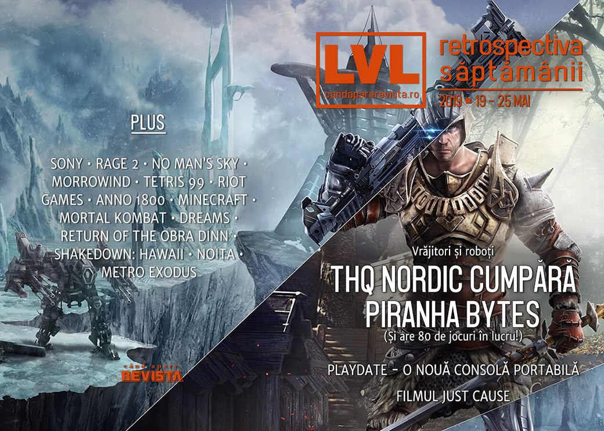

SUMAR ... 

Linkuri rapide:

* [Știri](#ştiri)
* [Articole (critică, dev, design)](#articole-critică-dev-design)
* [Made în România](#made-în-românia)
* [Anunţuri şi lansări de jocuri](#anunţuri-şi-lansări-de-jocuri)
* [Prăvălii de jocuri](#prăvălii-de-jocuri)

## Ştiri
* Sony își face un studio dedicat - PlayStation Productions - pentru a ecraniza jocuri video pentru TV și cinema. ([Destructoid](https://www.destructoid.com/sony-announces-playstation-productions-which-will-adapt-games-to-tv-and-film-in-house-554293.phtml), [VideoGamesChronicle](https://www.videogameschronicle.com/news/playstation-productions-to-adapt-games-for-film-and-tv/), [Games Informer](https://www.gameinformer.com/2019/05/20/playstation-productions-to-bring-sony-interactive-video-game-properties-to-film-tv))
* Anunțul de săptămâna trecută privind parteneriatul dintre Sony și Microsoft i-a luat prin surprindere pe cei din echipa PlayStation. ([Bloomberg](https://www.bloomberg.com/news/articles/2019-05-19/sony-s-deal-with-microsoft-blindsided-its-own-playstation-team), [Ars Technica](https://arstechnica.com/gaming/2019/05/report-sony-employees-caught-off-guard-by-microsoft-cloud-partnership/), [PCGamesInsider.biz](http://www.pcgamesinsider.biz/news/69033/report-playstation-team-didnt-know-about-sony-microsoft-cloud-tech-deal-until-announcement/), [VideoGamesChronicle](https://www.videogameschronicle.com/news/playstation-had-to-calm-workers-over-microsoft-cloud-deal/))
* Apare un film Just Cause. O casă de producție din Germania a achiziționat drepturile de ecranizare și l-a angat pe scenaristul filmelor John Wick pentru a scrie un scenariu. Filmul va apărea în 2021. ([Variety](https://variety.com/2019/film/news/just-cause-movie-video-game-adaptation-1203221927/), [VideoGamesChronicle](https://www.videogameschronicle.com/news/john-wick-creator-writing-just-cause-movie/), [Games Informer](https://www.gameinformer.com/gamer-culture/2019/05/22/john-wick-creator-heading-up-a-just-cause-film-adaptation))
* ([Destructoid](https://www.destructoid.com/the-oculus-quest-and-oculus-rift-s-are-out-today-554383.phtml))
* THQ Nordic cumpără celebra companie Piranha Bytes. ([PC Gamer](https://www.pcgamer.com/thq-nordic-acquires-gothic-and-risen-developer/), [DSOGaming ](https://www.dsogaming.com/news/thq-nordic-has-48-unannounced-games-under-development-4a-games-working-on-a-new-triple-a-game/), [Eurogamer](https://www.eurogamer.net/articles/2019-05-22-thq-nordic-acquires-gothic-creator-piranha-bytes), [RPS](https://www.rockpapershotgun.com/2019/05/22/thq-nordic-buy-piranha-bytes/)). În altă ordine de idei, THQ Nordic a anunțat că are 80 de jocuri în curs de dezvoltare, din care 48 încă nu au fost dezvăluite. ([Games Informer](https://www.gameinformer.com/2019/05/22/thq-nordic-currently-has-80-games-in-development), [PC Gamer](https://www.pcgamer.com/thq-nordic-has-nearly-50-unannounced-games-in-development/), [Shacknews](https://www.shacknews.com/article/111882/thq-nordic-has-80-games-in-active-development-right-now))
* O companie anunță o nouă consolă mobilă ce evocă vechile GameBoy. Compania se numește Panic și sunt cei care se ocupă de publishing pentru jocurile **Firewatch** și **Untitled Goose Game**. Iar dispozitivul mobil se numește Playdate și are și o manivelă. Și e galbenă. :) ([Eurogamer](https://www.eurogamer.net/articles/2019-05-23-playdate-is-a-quirky-new-handheld-with-some-great-indie-designers-onboard-and-it-has-a-crank), [Destructoid](https://www.destructoid.com/playdate-is-a-funky-mini-gaming-handheld-slated-for-2020-554531.phtml), [Kotaku](https://kotaku.com/the-people-who-published-firewatch-are-now-making-a-gam-1834958316), [Shacknews](https://www.shacknews.com/article/111870/what-is-the-panic-playdate-handheld-gaming-system), [The Verge](https://www.theverge.com/circuitbreaker/2019/5/22/18628360/playdate-panic-teenage-engineering-qwop-katamari), [Variety](https://variety.com/2019/gaming/news/playdate-announce-1203224422/))

## Articole (critică, dev, design)

* [The state of singleplayer games in 2019 so far](https://www.pcgamer.com/the-state-of-singleplayer-games-in-2019-so-far/) (PC Gamer)
* [Fortnite is basically a giant, endless advertisement now](https://www.polygon.com/2019/5/23/18635920/fortnite-jumpman-john-wick-marvel-brand-advertisement) (Polygon)

---

### Actualitate
* [Microsoft and Sony are teaming up for the future of gaming](https://www.theverge.com/2019/5/20/18632374/microsoft-sony-cloud-gaming-partnership-amazon-google) (The Verge)
* [Report: Sony leads a cloud gaming market that will hit $2.5B by 2023](https://gamedaily.biz/article/882/report-sony-leads-a-cloud-gaming-market-that-will-hit-25b-by-2023-ihs-markit) (GameDaily.biz)
* [Why the quirky Playdate portable could succeed where Ouya failed](https://arstechnica.com/gaming/2019/05/why-the-quirky-playdate-portable-could-succeed-where-ouya-failed/) (Ars Technica)
* [Video Games Should Be Weirder](https://kotaku.com/video-games-should-be-weirder-1834991545) (Kotaku)

---

### _Not-a-review_
* [Rage 2 is Too Big for Its Own Good](https://www.hardcoregamer.com/2019/05/20/rage-2-is-too-big-for-its-own-good/331404/) (Hardcore Gamer)
* [Clever No Man’s Sky Players Are Trying To Add Cities To The Game](https://kotaku.com/clever-no-man-s-sky-players-are-trying-to-add-cities-to-1834929189) (Kotaku)
* [The brilliant weirdness of Morrowind's in-game books](https://www.eurogamer.net/articles/2019-05-23-the-brilliant-weirdness-of-morrowinds-in-game-literature) (Eurogamer)
* [Total War: Three Kingdoms finally gets diplomacy right](https://www.pcgamer.com/total-war-three-kingdoms-finally-gets-diplomacy-right/) (PC Gamer)
* [Dreams becomes reality: the game that can make an artist out of anyone](https://www.theguardian.com/games/2019/may/23/dreams-becomes-reality-the-game-that-can-make-an-artist-out-of-anyone) (The Guardian)
* [&#8216;Tetris 99&#8217; Is a Maelstrom of Industry Trends](https://variety.com/2019/gaming/columns/tetris-99-is-a-maelstrom-of-industry-trends-1203224469/) (Variety)
* [Shakedown: Hawaii Shows Why Capitalism Sucks](https://unwinnable.com/2019/05/22/shakedown-hawaii-shows-why-capitalism-sucks/) (Unwinnable)

---

### Industrie
* [Censorship, Steam, and the explosive rise of PC gaming in China](https://www.pcgamer.com/its-time-to-pay-attention-to-china-inside-the-worlds-largest-pc-games-industry/) (PC Gamer)
* [At Riot, the walkout was just the beginning](https://www.theverge.com/2019/5/23/18629481/riot-walkout-company-policy-protests-forced-arbitration-employee-petition-directors) (The Verge)
* [Xbox chief Phil Spencer outlines plans for fighting toxicity in gaming](https://www.theverge.com/2019/5/20/18629892/microsoft-xbox-phil-spencer-video-games-industry-effort-toxicity-abuse-harassment) (The Verge) + [Video games: A unifying force for the world](https://blogs.microsoft.com/blog/2019/05/20/video-games-a-unifying-force-for-the-world/) (Microsoft Blog)
* [World War Z's Saber Interactive On Surviving Growth And Partnering With Epic Games](https://gamedaily.biz/article/881/exclusive-world-war-zs-saber-interactive-on-surviving-growth-and-partnering-with-epic-games) (GameDaily.biz)
* [U.S. Senator Says His Anti-Loot Box Bill Has The Video Game Industry Worried](https://kotaku.com/u-s-senator-says-his-anti-loot-box-bill-has-the-video-1834905639) (Kotaku)
* [Why Anno 1800 became the fastest-selling entry in the 21-year-old franchise](https://www.pcgamesinsider.biz/success-story/69049/why-anno-1800-became-the-fastest-selling-entry-in-the-21-year-old-franchise/) (PCGamesInsider.biz)
* [The accidental authenticity of Devolver Digital](https://www.gamesindustry.biz/articles/2019-05-21-the-accidental-authenticity-of-devolver-digital) (GamesIndustry.biz)
* [Inside Station F: The grander ambitions of Ubisoft](https://www.gamesindustry.biz/articles/2019-05-21-inside-station-f-the-grander-ambitions-of-ubisoft) (GamesIndustry.biz)

---

### Istorie, retrospectivă
* [Minecraft Players Are Celebrating 10 Years With Cakes, Artwork And More](https://kotaku.com/minecraft-players-are-celebrating-10-years-with-cakes-1834863850) (Kotaku)
* [Minecraft at 10: a decade of building things and changing lives](https://www.theguardian.com/games/2019/may/18/minecraft-at-10-building-things-and-changing-lives) (The Guardian)
* [War Stories: Lucas Pope and what almost sank Return of the Obra Dinn](https://arstechnica.com/gaming/2019/05/war-stories-lucas-pope-and-what-almost-sunk-return-of-the-obra-dinn/) (Ars Technica)
* [After Nearly 40 Years, Video Games Still Don&#39;t Do Lord Of The Rings Justice](https://kotaku.com/after-nearly-40-years-video-games-still-dont-do-lord-o-1834901260) (Kotaku)
* [Mortal Kombat began something special: the idea of fighting games with lore](https://www.polygon.com/2019/5/23/18634304/mortal-kombat-lore-story-history-arcafe-comics) (Polygon)

---

### Dev, making of, mecanici
* [The Noita devs on how to make a fun game when everything is falling](https://www.rockpapershotgun.com/2019/05/23/the-noita-devs-on-how-to-make-a-fun-game-when-everything-is-falling/) (RPS)
* [Game Design Deep Dive: Re-imagining the double-jump in  The Messenger](https://www.gamasutra.com/view/news/343113/Game_Design_Deep_Dive_Reimagining_the_doublejump_in_The_Messenger.php) (Gamasutra)
* [Game Design Deep Dive: Environmental storytelling in  Generation Zero](https://www.gamasutra.com/view/news/342811/Game_Design_Deep_Dive_Environmental_storytelling_in_Generation_Zero_.php) (Gamasutra)

---

### Design, world-building, artă
* [Broken Landscapes](https://www.slowrun.me/2019/05/broken-landscapes.html) (SlowRun)
* [An Unfair Fight](https://kotaku.com/an-unfair-fight-1834739245) (Kotaku)

## Made în România

* Știre despre Nordic Conf.

## Anunţuri şi lansări de jocuri
* [Human Head's Viking RPG Rune renamed again, will be an Epic exclusive at launch](https://www.pcgamer.com/human-heads-viking-rpg-rune-renamed-again-will-be-an-epic-exclusive-at-launch/) (PC Gamer)

### Anunţate
* **Grid**, un reboot al seriei ([Destructoid](https://www.destructoid.com/codemasters-announces-a-grid-reboot-set-for-september-release-554394.phtml))
* **Dota Auto-Chess** ([Games Informer](https://www.gameinformer.com/2019/05/21/dota-getting-standalone-auto-chess-from-valve), [Destructoid](https://www.destructoid.com/dota-2-s-popular-auto-chess-mod-is-getting-its-own-game-554464.phtml))
* **Tiny Metal: Full Metal Rumble** ([RPS](https://www.rockpapershotgun.com/2019/05/22/tiny-metal-full-metal-rumble-deploys-on-pc-later-this-year/))
* **Baldo** ([Destructoid](https://www.destructoid.com/where-s-baldo-he-s-in-a-new-game-that-looks-like-zelda-and-ni-no-kuni-554459.phtml))
* **Art of Rally** ([PC Gamer](https://www.pcgamer.com/art-of-rally-is-a-stylized-racing-game-from-the-maker-of-absolute-drift/))

### Acum cu dată de lansare
* **Outer Wilds**: 30 mai ([GameSpace](https://www.gamespace.com/all-articles/news/outer-wilds-coming-to-xbox-one-and-pc-via-epic-games-store-on-may-30/))
* **Gato Roboto**: 30 mai ([Destructoid](https://www.destructoid.com/mech-kitty-spectacular-gato-roboto-launching-next-week-554607.phtml))
* **RAD**: 20 august ([VideoGamesChronicle](https://www.videogameschronicle.com/news/double-fine-confirms-date-for-rogue-like-rad/))
* **Ancestors: The Humankind Odyssey**: 27 august ([PC Gamer](https://www.pcgamer.com/ancestors-the-humankind-odyssey-is-coming-in-august/))
* **Man of Medan**: 30 august ([PC Gamer](https://www.pcgamer.com/man-of-medan-part-of-a-horror-anthology-from-the-creators-of-until-dawn-is-out-in-august/))

### Lansate
* 20 mai: **Hell is Other Demons** ([Steam](https://store.steampowered.com/app/595790/Hell_is_Other_Demons/))
* 20 mai **The Elder Scrolls Online: Elsweyr** ([Steam](https://store.steampowered.com/app/306130/The_Elder_Scrolls_Online/))
* 21 mai: **Team Sonic Racing** ([Steam](https://store.steampowered.com/app/785260/Team_Sonic_Racing/))
* 21 mai: **Beat Saber** (iese din early access) ([Steam](https://store.steampowered.com/app/620980/Beat_Saber/))
* 21 mai: **American Fugitive** ([Steam](https://store.steampowered.com/app/934780/American_Fugitive/))
* 21 mai: **Dauntless** ([Shacknews](https://www.shacknews.com/article/111691/dauntless-gets-a-pc-and-console-release-date))
* 21 mai: **Observation** ([Epic Store](https://www.epicgames.com/store/en-US/product/observation/))
* 22 mai: **Gladiabots** (iese din early access) ([Steam](https://store.steampowered.com/app/871930/Gladiabots/))
* 23 mai: **Battalion 1944** (iese din early access) ([Steam](https://store.steampowered.com/app/489940/BATTALION_1944/))
* 23 mai: **Total War: Three Kingdoms** ([Steam](https://store.steampowered.com/app/779340/Total_War_THREE_KINGDOMS/))
* 23 mai: **Conglomerate 451** (early access) ([Steam](https://store.steampowered.com/app/1022710/Conglomerate_451/))
* 23 mai: **Pathologic 2** ([Steam](https://store.steampowered.com/app/505230/Pathologic_2/), [gog.com](https://www.gog.com/game/pathologic_2))
* 24 mai: **XERA: Survival** (early access) ([Steam](https://store.steampowered.com/app/625340/XERA_Survival/))

## Prăvălii de jocuri

* [Valve Was Not Sure What To Do About Positive Review Bombing](https://www.gameinformer.com/2019/05/21/valve-was-not-sure-what-to-do-about-positive-review-bombing) (Games Informer)
* [Assassin's Creed: Unity positive review bomb leaves Valve confused](https://www.eurogamer.net/articles/2019-05-22-valve-seems-very-confused-by-positive-review-bombing) (Eurogamer)

### Știri
* [Buying games too fast on the Epic Games Store can lock your account](https://www.pcgamer.com/buying-games-too-fast-on-the-epic-games-store-can-lock-your-account/) (PC Gamer)
* [The Ouya&#039;s Store Closes Next Month](https://www.gameinformer.com/2019/05/22/the-ouyas-store-closes-next-month) (Games Informer)
* [GOG Galaxy 2.0 aims to bring games from all PC and console platforms under one roof](https://www.pcgamer.com/gog-galaxy-20-aims-to-bring-games-from-all-pc-and-console-platforms-under-one-roof/) (PC Gamer), [GOG's new client aims to integrate all your games and friends across PC and consoles](https://www.eurogamer.net/articles/2019-05-22-gogs-new-client-aims-to-integrate-all-your-games-and-friends-across-pc-platforms-and-consoles) (Eurogamer)

### Jocuri noi în catalog
* [Into the Breach and FTL are now on Origin Access Basic, Tropico 6 on Premier](https://www.pcgamer.com/into-the-breach-and-ftl-are-now-on-origin-access-basic-tropico-6-on-premier/) (PC Gamer)
* [Superhot, Dead By Daylight, The Banner Saga, And More Coming To Xbox Game Pass](https://www.gameinformer.com/psa/2019/05/22/superhot-dead-by-daylight-the-banner-saga-and-more-coming-to-xbox-game-pass) (Games Informer)

### Jocuri retrase
* [All remaining Telltale Games series will be gone from GOG next week](https://www.eurogamer.net/articles/2019-05-23-all-remaining-telltale-games-will-be-gone-from-gog-next-week) (Eurogamer)

### Jocuri gratis și free weekends
* [The Sims 4 is currently free on PC](https://www.eurogamer.net/articles/2019-05-21-the-sims-4-is-currently-free-on-pc) (Eurogamer)
* [City of Brass is the next Epic Games Store freebie](https://www.pcgamer.com/city-of-brass-is-the-next-epic-games-store-freebie/) (PC Gamer)

### Reduceri și promoții
* [Classic Xbox games discounted at Microsoft in a huge Backward Compatible Sale](https://www.polygon.com/deals/2019/5/21/18634472/xbox-backward-compatible-sale-best-deals-one-360-red-dead-redemption) (Polygon)

---

{}
**Retrospectiva săptămânii** este rubrica duminicală în care trecem în revistă evenimentele săptămânii de pe frontul de gaming: știri şi articole (scrise de alții, bineînțeles, că e mai ușor aşa), industrie, lansări, oferte de jocuri, toate numai de savurat la cafeaua de duminică dimineața.

De asemenea, rubrica e deschisă oricui vrea și poate contribui. Dacă ai citit vreun articol sau vreo știre interesantă și crezi că merită incluse în retrospectiva săptămânii, te așteptăm pe forum pe unul dintre topicurile dedicate: [Știri](https://forum.candaparerevista.ro/viewtopic.php?f=4&t=46), [Articole](https://forum.candaparerevista.ro/viewtopic.php?f=4&t=206), [Gaming România](https://forum.candaparerevista.ro/viewtopic.php?f=4&t=1622)].
{}
