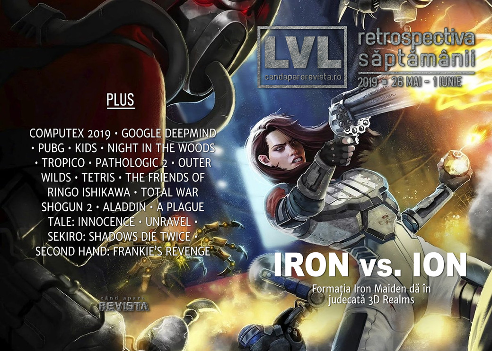

Formația Iron Maiden dă în judecată jocul Ion Maiden, AMD și Intel anunță noutăți hardware, în special procesoare, DeepMind AI devine bun și la Quake III, Activision anunță un reboot pentru Call of Duty Modern Warfare, Hideo Kojima de spune data de lansare pentru Death Stranding, GOG dă drumul la summer sale și avem câteva lansări interesante, printre care Outer Wilds, Void Bastards, Kids, Gato Roboto și românescul Second Hand: Frankie’s Revenge.

Linkuri rapide:

* [Știri](#ştiri)
* [Articole (critică, dev, design)](#articole-critică-dev-design)
* [Made în România](#made-în-românia)
* [Anunţuri şi lansări de jocuri](#anunţuri-şi-lansări-de-jocuri)
* [Prăvălii de jocuri](#prăvălii-de-jocuri)

## Ştiri
* A avut loc ediția 2019 a Computex: AMD anunță Radeon RX 5700, primul GPU pe arhitectură Navi și o generație nouă de procesoare Ryzen ([DSOGaming ](https://www.dsogaming.com/news/amd-radeon-rx-5700-is-the-first-mainstream-navi-gpu-for-pc-gamers-releases-in-july/), [RPS](https://www.rockpapershotgun.com/2019/05/27/amd-navi-gpu-rx-5700-release-date-specs-price-2), [DSOGaming ](https://www.dsogaming.com/news/amd-3rd-generation-ryzen-7nm-cpus-officially-release-on-july-7th-prices-and-specs-unveiled/), [Eurogamer](https://www.eurogamer.net/articles/digitalfoundry-2019-05-27-amd-ryzen-3000-rx-5700-navi-announced)), iar Intel anunță Ice Lake, noua serie de procesoare pe arhitectură de 10nm. ([Eurogamer](https://www.eurogamer.net/articles/digitalfoundry-2019-05-28-intel-10th-gen-processors-10nm-iris-plus-graphics), [PC Gamer](https://www.pcgamer.com/intel-is-finally-coming-out-with-10nm-processors-starting-with-laptops/), [Shacknews](https://www.shacknews.com/article/111923/intel-reveals-10nm-processors-will-start-on-laptops), [DSOGaming ](https://www.dsogaming.com/news/intel-announces-10th-generation-core-processors-first-5ghz-cpu-on-all-cores/)). Plus:
   * [AMD Ryzen 3000: Everything you need to know about AMD&#8217;s 3rd Gen CPUs](https://www.rockpapershotgun.com/2019/05/28/amd-ryzen-3000-release-date-price-specs/) (RPS)
   * [Intel’s 10th Gen, 10nm Ice Lake CPUs: everything you need to know](https://www.theverge.com/2019/5/28/18639317/intel-10nm-10th-gen-core-ice-lake-cpu-processor-laptop-launch-thunderbolt-3-sunny-cove) (The Verge)

* Iron Maiden dă în judecată 3D Realms din cauza numelui pentru jocul **Ion Maiden**. ([Hardcore Gamer](https://www.hardcoregamer.com/2019/05/29/iron-maiden-sues-3d-realms-for-trademark-infringement/347751/), [Kotaku](https://kotaku.com/iron-maiden-is-suing-the-game-ion-maiden-1835110947), [PC Gamer](https://www.pcgamer.com/iron-maiden-the-band-has-filed-a-trademark-lawsuit-against-ion-maiden-the-game/), [Eurogamer](https://www.eurogamer.net/articles/2019-05-30-iron-maiden-suing-ion-maiden-for-usd2m), [Polygon](https://www.polygon.com/2019/5/30/18645765/iron-maiden-lawsuit-3d-realms-ion-maiden-logo-pc), [The Guardian](https://www.theguardian.com/music/2019/may/30/iron-maiden-sue-video-game-developers-for-2m-over-ion-maiden-game))
* În mod surprinzător, industria de jocuri nu e mulțumită de includerea dependenței de jocuri în rândul bolilor recunoscute de OMS. ([Variety](https://variety.com/2019/gaming/news/games-industry-asks-who-to-reverse-decision-1203226785/), [GamesIndustry.biz](https://www.gamesindustry.biz/articles/2019-05-27-trade-groups-decry-gaming-disorder-classification))
* Epic Games anunță premiile Unreal E3 Awards 2019. ([Shacknews](https://www.shacknews.com/article/112003/epic-games-debuts-unreal-e3-awards-2019))
* Sistemul de inteligență artificială de la Google, DeepMind, a început să bată și jucătorii de Quake III.  ([Kotaku](https://kotaku.com/googles-deepmind-ai-takes-down-human-players-in-quake-i-1835156243), [Gamasutra](https://www.gamasutra.com/view/news/343787/Researchers_pit_DeepMind_AI_against_human_Quake_III_players.php))

## Articole (critică, dev, design)
* [From Bubsy to System Shock, how indie devs bring old videogames back to life](https://www.pcgamer.com/from-bubsy-to-system-shock-how-indie-devs-bring-old-videogames-back-to-life/) (PC Gamer)
* [In praise of ultra-short games](https://arstechnica.com/gaming/2019/05/in-praise-of-ultra-short-games/) (Ars Technica)
* [Augmented reality changes how people interact and communicate, study finds](https://arstechnica.com/science/2019/05/augmented-reality-changes-how-people-interact-and-communicate-study-finds/) (Ars Technica)
* [I may have found the cure for spoilers](https://www.destructoid.com/i-may-have-found-the-cure-for-spoilers-546739.phtml) (Destructoid)
* [Opinion: Accessibility Is Becoming The New Standard](https://www.gameinformer.com/opinion/2019/05/31/opinion-accessibility-is-becoming-the-new-standard) (Games Informer)
* [Gaming for Good](https://www.gamereactor.eu/gaming-for-good/) (Gamereactor)
* [Can stories be apolitical? We asked some video game writers and narrative designers](https://www.vg247.com/2019/05/31/can-stories-apolitical-asked-video-game-writers-narrative-designers/) (VG247)

---

### Actualitate
* [Pokémon is a masterclass in brand management](https://www.gamesindustry.biz/articles/2019-05-29-pok-mon-is-a-masterclass-in-brand-management) (GamesIndustry.biz)
* [Call of Duty games may need to stop pretending they can be ‘complex’](https://www.polygon.com/2019/5/30/18646015/call-of-duty-modern-warfare-2019-politics) (Polygon)
* [Time to take responsibility over gaming disorder](https://www.gamesindustry.biz/articles/2019-05-31-time-to-take-responsibility-over-gaming-disorder-opinion) (GamesIndustry.biz)
* [Play fights: the joys and the dangers of video games](https://www.newstatesman.com/culture/books/2019/05/lost-in-a-good-game-pete-etchells-review) (New Statesman)

#### Computex
* [OPINION: Will Navi Be Enough?](https://www.gamespace.com/featured/opinion-will-navi-be-enough/) (GameSpace)
* [The 10 coolest, and downright weirdest things we saw at Computex 2019](https://www.pcgamer.com/the-10-coolest-and-downright-weirdest-things-we-saw-at-computex-2019/) (PC Gamer)
* [The Coolest Stuff We Saw at Computex 2019](https://www.tomshardware.com/news/coolest-stuff-from-computex-2019,39552.html) (Tom's Hardware)

---

### _Not-a-review_
* [Despite losing the spotlight to Fortnite, PUBG is still thriving in 2019](https://www.pcgamer.com/despite-losing-the-spotlight-to-fortnite-pubg-is-still-thriving-in-2019/) (PC Gamer)
* [The strange and surreal Kids is part game, part short film](https://www.theverge.com/2019/5/28/18642356/kids-game-android-iphone-steam-double-fine-interview) (The Verge)
* [Two Years Later, Night in the Woods is Still Relatable](https://sidequest.zone/2019/05/28/two-years-later-night-in-the-woods-is-still-relatable/) (Sidequest)
* [Life After an El Presidente](http://www.firstpersonscholar.com/life-after-an-el-presidente/) (First Person Scholar)
* [The Friends of Ringo Ishikawa](http://deep-hell.com/the-friends-of-ringo-ishikawa/) (DEEP HELL)
* [Is Assassin&#8217;s Creed Unity a better game now Notre-Dame is in ruins?](https://www.rockpapershotgun.com/2019/06/01/is-assassins-creed-unity-a-better-game-now-notre-dame-is-in-ruins/) (RPS)
* [Outer Wilds and Inner Depth: Making Something New Out of the Old](https://www.pastemagazine.com/articles/2019/05/outer-wilds-and-inner-depth-making-something-new-o.html) (Paste)
* [Is Pathologic 2 Too Hard For Its Own Good?](https://www.pastemagazine.com/articles/2019/05/is-pathologic-2-too-hard-for-its-own-good.html) (Paste)

---

### Industrie
* [Without loot boxes, what does the future of mobile gaming look like?](https://www.destructoid.com/without-loot-boxes-what-does-the-future-of-mobile-gaming-look-like--554869.phtml) (Destructoid)
* [Casual Connect: 'It was considered the most cardinal sin to make a sequel,' says Molyneux](https://gamedaily.biz/article/899/casual-connect-it-was-considered-the-most-cardinal-sin-to-make-a-sequel-says-molyneux) (GameDaily.biz)
* [An Interview With Blizzard President J. Allen Brack](https://www.gameinformer.com/2019/05/28/an-interview-with-blizzard-president-j-allen-brack) (Games Informer)
* [How everything has fallen into place for Tetris](https://www.gamesindustry.biz/articles/2019-05-28-the-rise-of-tetris) (GamesIndustry.biz)
* [Sony: Next PlayStation's success will depend on backwards compatibility and streaming](https://www.gamesindustry.biz/articles/2019-05-28-sony-next-playstations-success-will-depend-on-backwards-compatibility-and-streaming) (GamesIndustry.biz)
* [In Theory: Could the Sony/Microsoft cloud partnership end the console war?](https://www.eurogamer.net/articles/digitalfoundry-2019-in-theory-could-the-sony-microsoft-cloud-deal-end-the-console-war) (Eurogamer)
* [How Superhot sold over two million copies and where its developer goes from here](https://www.pcgamesinsider.biz/success-story/69088/how-superhot-sold-over-two-million-copies-and-where-its-developer-goes-from-here/) (PCGamesInsider.biz)
* [Casual Connect: Indie development is 'stagnant' says Braid creator, Jonathan Blow](https://gamedaily.biz/article/910/casual-connect-indie-development-is-stagnant-says-braid-creator-jonathan-blow) (GameDaily.biz)

---

### Istorie, retrospectivă
* [Total War: Shogun 2 is still beautiful and ambitious in 2019](https://www.pcgamer.com/total-war-shogun-2-is-still-beautiful-and-ambitious-in-2019/) (PC Gamer)
* [40 years on, celebrating the Mattel Intellivision](https://www.eurogamer.net/articles/2019-05-26-40-years-on-celebrating-the-mattel-intellivision) (Eurogamer)
* [Hunting down the true origins of the battle royale craze](https://www.polygon.com/2019/5/26/18636556/battle-royale-games-movie-book-koushun-takami-inspiration) (Polygon)
* [How Blizzard’s Canceled Adventure Game Shaped The Future Of Warcraft](https://www.gameinformer.com/2019/05/27/how-blizzards-canceled-adventure-game-shaped-the-future-of-warcraft) (Games Informer)
* [The making of Counter-Strike: How a Half-Life mod went from hobby project to the big leagues](https://www.pcgamesinsider.biz/industry-icon/69066/the-making-of-counter-strike-how-a-half-life-mod-went-from-hobby-project-to-the-big-leagues/) (PCGamesInsider.biz)
* [Returning To The World... Of Warcraft](https://www.gameinformer.com/feature/2019/05/27/returning-to-the-world-of-warcraft) (Games Informer)
* [GameCube chainsaw, Sonic Screwdriver and other strange game controllers](https://www.videogameschronicle.com/features/history-lesson-strange-game-controllers/) (VideoGamesChronicle)
* [Bubsy History: The Story of the World’s Greatest Video Game Mascot](https://tedium.co/2019/05/30/bubsy-history-video-games/) (Tedium)
* [The RetroBeat: Aladdin is a Genesis masterpiece](https://venturebeat.com/2019/05/31/the-retrobeat-aladdin-is-a-genesis-masterpiece/) (VentureBeat)
* [The Fall of Rise of the Robots](https://www.kotaku.co.uk/2019/05/31/the-fall-of-rise-of-the-robots) (Kotaku)
* [History of Game Design: The Suprisingly Ancient Origins of Pinball](https://remptongames.com/2019/06/01/history-of-game-design-the-suprisingly-ancient-origins-of-pinball/) (Rempton Games)

---

### Dev, making of, mecanici
* [The Incredible Real-Life Story Behind The Friends of Ringo Ishikawa](https://www.kotaku.co.uk/2019/05/30/the-incredible-real-life-story-behind-the-friends-of-ringo-ishikawa) (Kotaku)
* [A Plague Tale: Innocence - a fascinating game powered by stunning tech](https://www.eurogamer.net/articles/digitalfoundry-2019-a-plague-tale-innocence-tech-analysis) (Eurogamer)
* [War Stories: How This War of Mine manipulates your emotions](https://arstechnica.com/gaming/2019/05/war-stories-how-this-war-of-mine-manipulates-your-emotions/) (Ars Technica)
* [Video: Using empathy as a game mechanic in  Unravel](https://www.gamasutra.com/view/news/343702/Video_Using_empathy_as_a_game_mechanic_in_Unravel.php) (Gamasutra)

---

### Design, world-building, artă
* [The Japanese myths and woodblock art behind Sekiro’s creatures](https://www.rockpapershotgun.com/2019/05/31/the-japanese-myths-and-woodblock-art-behind-sekiros-creatures/) (RPS)
* [Oh Pinchy](https://kotaku.com/oh-pinchy-1835053380) (Kotaku)
* [Some Of The Art Behind Game Of Thrones: The Final Season](https://kotaku.com/some-of-the-art-behind-game-of-thrones-the-final-seaso-1835107052) (Kotaku)

## Made în România
* Cavaleria.ro publică un video interviu cu cei de la Rikodu despre **Second Hand: Frankie’s Revenge**. ([Cavaleria.ro](https://cavaleria.ro/gaming/video-cum-se-fac-jocurile-video-in-romania-ep-4/))
* Rikodu lansează **Second Hand: Frankie’s Revenge** în early access. ([Steam](https://store.steampowered.com/app/727930/Second_Hand_Frankies_Revenge/))
* **Planet Alpha** câștigă premiul pentru cel mai b un debut la Nordic Game Awards. ([Site Nordic Game](https://nordicgame.com/2019-nordic-game-awards-winners/))

## Anunţuri şi lansări de jocuri
### Anunţate
* **Quake 2 RTX** (da, ăla vechi) ([DSOGaming ](https://www.dsogaming.com/news/quake-2-rtx-will-be-available-on-june-6th-gets-an-official-trailer-key-features-detailed/), [Shacknews](https://www.shacknews.com/article/111926/quake-2-rtx-gets-june-release-date-for-pc-and-linux))
* **Starbase**, MMO în spațiu de la producătorii lui Trine ([RPS](https://www.rockpapershotgun.com/2019/05/28/frozenbyte-announce-starbase/))
* **Overcrowd** ([PC Gamer](https://www.pcgamer.com/overcrowd-turns-commuting-into-a-cute-management-game/))
* **Travis Strikes Again: No More Heroes** vine pe PC ([RPS](https://www.rockpapershotgun.com/2019/05/28/travis-strikes-again-no-more-heroes-pc-release-announced/))
* **Pathfinder: Kingmaker Enhanced Edition** ([PC Gamer](https://www.pcgamer.com/pathfinder-kingmaker-is-getting-an-enhanced-edition-in-june/))
* 4 jocuri **Pokémon** noi ([Eurogamer](https://www.eurogamer.net/articles/2019-05-29-four-new-pokemon-games-and-apps-announced), [Kotaku](https://kotaku.com/new-pokemon-games-hardware-services-announced-1835079940))
* **Book of Hours** ([Eurogamer](https://www.eurogamer.net/articles/2019-05-30-cultist-simulator-dev-reveals-elegant-melancholy-occult-library-follow-up-book-of-hours))
* **Ghostbusters: The Video Game Remastered** ([Eurogamer](https://www.eurogamer.net/articles/2019-05-30-ghostbusters-the-video-game-remastered-announced))
* **Brigador Killers**, o continuare a Brigador-ului din 2016 ([RPS](https://www.rockpapershotgun.com/2019/05/29/brigador-killers-unleashes-amoral-mech-war-on-a-new-planet/))
* **Monstrum 2**, un multiplayer asimetric ([PC Gamer](https://www.pcgamer.com/monstrum-2-is-a-4v1-game-of-hide-and-seek-at-sea/))
* **Call of Duty: Modern Warfare** ([Ars Technica](https://arstechnica.com/gaming/2019/05/call-of-duty-modern-warfare-reveal-old-name-new-campaign-new-brutality/), [Eurogamer](https://www.eurogamer.net/articles/digitalfoundry-2019-cod-modern-warfare-delivers-series-most-advanced-visuals-yet))

### Acum cu dată de lansare
* **Journey**: 6 iunie ([PC Gamer](https://www.pcgamer.com/journey-will-arrive-on-pc-next-week/))
* **Sea Of Solitude**: 5 iulie ([Games Informer](https://www.gameinformer.com/2019/05/28/sea-of-solitude-gets-july-release-date))
* **Death Stranding** (PS4): 8 noiembrie ([Kotaku](https://kotaku.com/death-stranding-will-be-out-in-november-1835094172))

### Amânate
* **Sable** apare în 2020 ([Shacknews](https://www.shacknews.com/article/111947/sable-release-date-for-pc-and-consoles-delayed-to-2020))

### Anulate
* **Worlds Adrift** ([PC Gamer](https://www.pcgamer.com/early-access-mmo-worlds-adrift-is-shutting-down-soon))

### Lansate
* 27 mai: **Constructor Plus** ([Steam](https://store.steampowered.com/app/898800/Constructor_Plus/))
* 27 mai: **Railroad Corporation** (early access) ([Steam](https://store.steampowered.com/app/797400/Railroad_Corporation/))
* 27 mai: **Deep Diving Simulator** ([Steam](https://store.steampowered.com/app/990030/Deep_Diving_Simulator/), [gog.com](https://www.gog.com/game/deep_diving_simulator))
* 28 mai: **KIDS** ([Steam](https://store.steampowered.com/app/793370/KIDS/))
* 28 mai: **SpellForce 3: Soul Harvest** ([Steam](https://store.steampowered.com/app/817540/SpellForce_3_Soul_Harvest/))
* 28 mai: **Vambrace: Cold Soul** ([Steam](https://store.steampowered.com/app/904380/Vambrace_Cold_Soul/), [gog.com](https://www.gog.com/game/vambrace_cold_soul))
* 28 mai: **Rescue HQ - The Tycoon** ([Steam](https://store.steampowered.com/app/809720/Rescue_HQ__The_Tycoon/), [gog.com](https://www.gog.com/game/rescue_hq_the_tycoon))
* 28 mai: **Draugen** ([Steam](https://store.steampowered.com/app/770390/Draugen/), [gog.com](https://www.gog.com/game/draugen))
* 29 mai: **Layers of Fear 2** ([Steam](https://store.steampowered.com/app/1029890/Layers_of_Fear_2/))
* 29 mai: **Blood will be Spilled** ([Steam](https://store.steampowered.com/app/880300/Blood_will_be_Spilled/))
* 29 mai: **Conan Unconquered** ([Steam](https://store.steampowered.com/app/989690/Conan_Unconquered/))
* 29 mai: **It Lurks Below** (iese din early access) ([Steam](https://store.steampowered.com/app/697550/It_Lurks_Below/))
* 29 mai: **Assetto Corsa Competizione** ([Steam](https://store.steampowered.com/app/805550/Assetto_Corsa_Competizione/))
* 29 mai: **Void Bastards** ([Steam](https://store.steampowered.com/app/857980/Void_Bastards/))
* 30 mai: **Outer Wilds** ([Epic Store](https://www.epicgames.com/store/en-US/product/outerwilds/))
* 30 mai: **Super Cane Magic ZERO** ([Steam](https://store.steampowered.com/app/336440/Super_Cane_Magic_ZERO/))
* 31 mai: **SteamWorld Quest: Hand of Gilgamech** (PC) ([Steam](https://store.steampowered.com/app/804010/SteamWorld_Quest_Hand_of_Gilgamech/))
* 30 mai: **Gato Roboto** ([Steam](https://store.steampowered.com/app/916730/Gato_Roboto/))
* 31 mai: **PixARK** ([Steam](https://store.steampowered.com/app/593600/PixARK/))
* 31 mai: (John Romero’s) **SIGIL** ([Romero Games](https://www.romerogames.ie/si6il))
* 31 mai: **Second Hand: Frankie's Revenge** (early access) ([Steam](https://store.steampowered.com/app/727930/Second_Hand_Frankies_Revenge/))
* 1 iunie: **Mowin’ & Throwin’** ([Steam](https://store.steampowered.com/app/762030/Mowin__Throwin/))

## Prăvălii de jocuri
* [Casual Connect: 'We shouldn't be seeing Steam as the default' - Kongregate](https://gamedaily.biz/article/904/casual-connect-we-shouldnt-be-seeing-steam-as-the-default-kongregate) (GameDaily.biz)

### Știri
* Xbox Game Pass va fi disponibil și pentru PC (Windows 10). ([Ars Technica](https://arstechnica.com/gaming/2019/05/xbox-game-pass-is-coming-to-windows-10-but-many-questions-remain/), [Eurogamer](https://www.eurogamer.net/articles/2019-05-30-microsoft-announces-xbox-game-pass-on-pc), [Kotaku](https://kotaku.com/microsoft-has-hinted-at-this-for-a-while-but-now-it-s-1835118618), [Shacknews](https://www.shacknews.com/article/111988/gears-5-highlights-xbox-game-pass-100-pc-game-library), [VideoGamesChronicle](https://www.videogameschronicle.com/news/xbox-game-pass-coming-to-pc/))

* Și, în plus, Microsoft aduce mai multe jocuri, până acum exclusive Windows Store, și pe Steam. Printre titluri se numără **Gears of War 5** și edițiile definitive ale **Age of Empires I, II & III**. ([Polygon](https://www.polygon.com/2019/5/30/18645591/microsoft-pc-games-steam-win32-support-windows-10), [PC Gamer](https://www.pcgamer.com/microsoft-games-on-steam-announced/), [The Verge](https://www.theverge.com/2019/5/30/18645250/microsoft-xbox-game-studios-publishing-valve-steam-32-bit-windows))

### Jocuri noi în catalog
* [Sonic Mania, Borderlands: The Handsome Collection go free on PlayStation Plus in June](https://www.polygon.com/2019/5/29/18644271/playstation-plus-free-games-june-2019-ps4) (Polygon)
* [June is a solid if unspectacular month for Xbox Games with Gold](https://www.eurogamer.net/articles/2019-05-30-june-is-a-solid-if-unspectacular-month-for-xbox-games-with-gold) (Eurogamer)

### Jocuri gratis și free weekends
* [Get Modern-Day Myst Successor &#39;Obduction&#39; for Free Now](https://lifehacker.com/get-modern-day-myst-successor-obduction-for-free-now-1835125513) (Lifehacker)
* [City of Brass is free right now on the Epic Games Store](https://www.destructoid.com/city-of-brass-is-free-right-now-on-the-epic-games-store-555449.phtml) (Destructoid)

### Reduceri și promoții
* [Best PC gaming deals of the week &#8211; 31st May 2019](https://www.rockpapershotgun.com/2019/05/31/best-pc-gaming-deals-of-the-week-31st-may-2019/) (RPS)
* [GOG Summer Sale has been launched, Obduction available for free until July 1st](https://www.dsogaming.com/news/gog-summer-sale-has-been-launched-obduction-available-for-free-until-july-1st/) (DSOGaming )

---

{}
**Retrospectiva săptămânii** este rubrica duminicală în care trecem în revistă evenimentele săptămânii de pe frontul de gaming: știri şi articole (scrise de alții, bineînțeles, că e mai ușor aşa), industrie, lansări, oferte de jocuri, toate numai de savurat la cafeaua de duminică dimineața.

De asemenea, rubrica e deschisă oricui vrea și poate contribui. Dacă ai citit vreun articol sau vreo știre interesantă și crezi că merită incluse în retrospectiva săptămânii, te așteptăm pe forum pe unul dintre topicurile dedicate: [Știri](https://forum.candaparerevista.ro/viewtopic.php?f=4&t=46), [Articole](https://forum.candaparerevista.ro/viewtopic.php?f=4&t=206), [Gaming România](https://forum.candaparerevista.ro/viewtopic.php?f=4&t=1622)].
{}
