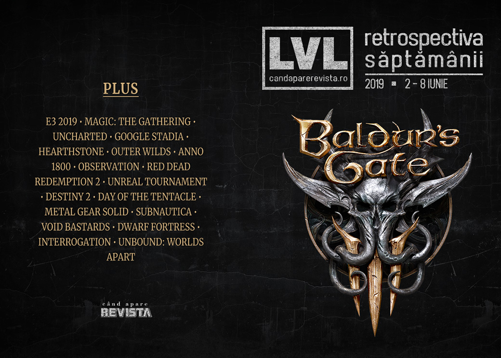

Cât ne pregătim de E3, aflăm detalii despre Google Stadia, regizorii filmelor Avengers vor ecraniza jocul de cărţi Magic: The Gathering, avem câteva retrospective interesante (de citit în primul rând pe cea despre Day of the Tentacle), Octopath Traveler şi Journey ajung pe PC, a fost anunţat încă un joc Vampire: the Masquerade şi… parcă mai era ceva… a, da - BALDUR’S GATE III.

Linkuri rapide:

* [Știri](#ştiri)
* [Articole (critică, dev, design)](#articole-critică-dev-design)
* [Made în România](#made-în-românia)
* [Anunţuri şi lansări de jocuri](#anunţuri-şi-lansări-de-jocuri)
* [Prăvălii de jocuri](#prăvălii-de-jocuri)

## Ştiri
* Frații Russo, regizorii ultimelor două filme Avengers, se vor ocupa de ecranizarea jocului Magic: The Gathering într-un serial animat pentru Netflix. ([Ars Technica](https://arstechnica.com/gaming/2019/06/post-end-game-russo-brothers-to-adapt-magic-the-gathering-for-netflix/), [PC Gamer](https://www.pcgamer.com/magic-the-gathering-animated-series-netflix/), [Games Informer](https://www.gameinformer.com/gamer-culture/2019/06/03/avengers-endgame-directors-creating-magic-the-gathering-animated-series), [Eurogamer](https://www.eurogamer.net/articles/2019-06-03-netflix-has-an-animated-magic-the-gathering-series-on-the-way), [GamesIndustry.biz](https://www.gamesindustry.biz/articles/2019-06-04-netflix-and-avengers-endgame-directors-working-on-a-magic-the-gathering-tv-show))
* Starbreeze concediază 80 de angajați în cadrul eforturilor de redresare. ([Eurogamer](https://www.eurogamer.net/articles/2019-06-04-big-layoffs-at-embattled-payday-studio-starbreeze), [PC Gamer](https://www.pcgamer.com/starbreeze-lays-off-25-of-its-workforce/), [GamesIndustry.biz](https://www.gamesindustry.biz/articles/2019-06-04-starbreeze-lays-off-a-quarter-of-its-staff-in-further-efforts-to-cut-costs))
* Filmul Uncharted, cu Tom Holland în rolul lui Nathan Drake, se lansează în decembrie 2020. ([Eurogamer](https://www.eurogamer.net/articles/2019-06-07-sony-announces-dec-2020-release-date-for-the-uncharted-movie), [Games Informer](https://www.gameinformer.com/2019/06/06/tom-holland-will-play-nathan-drake-in-uncharted-movie), [VideoGamesChronicle](https://www.videogameschronicle.com/news/uncharted-movie-release-date/))
* Epic Games duce Unreal Engine în industria auto. ([PC Gamer](https://www.pcgamer.com/epic-games-plans-to-take-unreal-engine-to-the-automotive-industry/))
* Google anunță primele detalii concrete despre Stadia: va avea o versiune iniţială plătită pe bază de abonament, cu controller şi un Chromecast potent şi a anunţat şi cerinţele tehnice şi lista iniţială de jocuri disponibile. ([Ars Technica](https://arstechnica.com/gaming/2019/06/google-stadia-requires-130-upfront-10-per-month-at-november-launch/), [DSOGaming ](https://www.dsogaming.com/news/google-stadia-pro-launches-this-november-will-have-31-games-at-launch-free-model-coming-in-2020/), [Shacknews](https://www.shacknews.com/article/112122/google-stadia-details-game-lineup-and-price-revealed), [Pocket Gamer](https://www.pocketgamer.biz/news/70898/google-stadia-games-release-date-subscription-cost-revealed/), [Games Informer](https://www.gameinformer.com/e3-2019/2019/06/06/everything-you-need-to-know-about-the-google-stadia-launch), [The Verge](https://www.theverge.com/2019/6/6/18654632/google-stadia-price-release-date-games-bethesda-ea-doom-ubisoft-e3-2019)). Jocurile anunțate momentan includ, printre altele, Assassin's Creed Odyssey, Doom Eternal, Baldur's Gate 3, Borderlands 3, Metro Exodus sau Wolfenstein Youngblood. ([Games Informer](https://www.gameinformer.com/e3-2019/2019/06/06/every-game-currently-announced-for-stadias-launch), [PCGamesInsider.biz](https://www.pcgamesinsider.biz/news/69120/here-are-the-games-coming-to-googles-stadia/), [VideoGamesChronicle](https://www.videogameschronicle.com/news/google-stadia-launch-games-announced/), [PC Gamer](https://www.pcgamer.com/google-stadia-games-list/)). Alte detalii:
  * [Google’s Stadia Launches in November, More Store Than Netflix](https://variety.com/2019/gaming/news/googles-stadia-pricing-release-date-details-1203234750/)
  * [Here’s what you’ll need to play Google Stadia at launch](https://www.polygon.com/2019/6/6/18655108/google-stadia-price-founders-edition-pre-order-stadia-pro-vs-base)
  * [Google’s Stadia game service is officially coming November: Everything you need to know](https://www.theverge.com/2019/6/6/18654632/google-stadia-price-release-date-games-bethesda-ea-doom-ubisoft-e3-2019)
  * [Do you really need Google's Stadia Founder's Edition? Who is it for? All your Stadia questions answered](https://www.rockpapershotgun.com/2019/06/07/do-you-really-need-google-stadia-founders-edition/)

## Articole (critică, dev, design)

* [The Wizardry Series’ Return To America Has Hit Another Snag](https://kotaku.com/the-wizardry-series-return-to-america-has-hit-another-1835245618) (Kotaku)
* [Dogs of War](https://unwinnable.com/2019/06/05/dogs-of-war/) (Unwinnable)
* [Inside the Hearthstone community creating its own cards](https://www.eurogamer.net/articles/2019-06-08-inside-the-hearthstone-community-creating-its-own-cards) (Eurogamer)
* [Preservationists Are Racing to Save Ouya&#39;s Games Before They Disappear](https://www.vice.com/en_us/article/qv7x4p/ouya-is-shutting-down-and-fans-are-preserving-games-before-they-disappear) (Vice)
* [Blizzard’s reveal of schoolgirl D.Va kicked off an Overwatch porn race](https://www.polygon.com/2019/6/4/18639379/overwatch-academy-dva-skin-schoolgirl-outfit-rule-34-porn) (Polygon)
* [Witness Jonathan Blow](http://deep-hell.com/witness-jonathan-blow/) (DEEP HELL)

---

### Actualitate
#### Google Stadia
* [Is Stadia Already Screwed?](https://gizmodo.com/is-stadia-already-screwed-1835300732) (Gizmodo)
* [Despite “revolutionary” promises, Stadia’s biz model is pure establishment](https://arstechnica.com/gaming/2019/06/despite-revolutionary-promises-stadias-biz-model-is-pure-establishment/) (Ars Technica)
* [Google Stadia solves some problems, but creates just as many](https://www.pcgamer.com/google-stadia-solves-some-problems-but-creates-just-as-many/) (PC Gamer)

#### Pre-E3 2019
* [E3 2019 Dates: Your complete diary](https://www.videogameschronicle.com/features/e3-2019-schedule/) (VideoGamesChronicle)
* [E3 2019: A complete guide to the press conferences](https://www.gamesindustry.biz/articles/2019-06-06-e3-2019-a-complete-guide-to-the-press-conferences) (GamesIndustry.biz)
* [Read GamesIndustry.biz Magazine Issue 3 right now](https://www.gamesindustry.biz/articles/2019-06-06-read-gamesindustry-biz-magazine-issue-3-right-now) (GamesIndustry.biz)
* [E3 2019: dates, conference schedule, games – everything you need](https://www.vg247.com/2019/06/07/e3-2019-dates-schedule-uk-us-conferences-games/) (VG247)
* [E3 2019 press conference livestreams, trailers, and news](https://www.polygon.com/e3/2019/6/8/18656485/e3-2019-live-streams-trailers-news-announcements) (Polygon)
* [What to expect from E3 2019](https://www.theverge.com/2019/6/7/18652521/e3-2019-announcements-nintendo-ps4-xbox-netflix-pc-games-google-stadia-cyberpunk-fortnite) (The Verge)
* [What to expect at the PC Gaming Show](https://www.pcgamer.com/what-to-expect-at-the-pc-gaming-show/) (PC Gamer)
* [All games confirmed to appear at E3 2019](https://www.shacknews.com/article/112158/all-games-confirmed-to-appear-at-e3-2019) (Shacknews)
* [E3 2019: The PRE-3 Trailer Collection](http://fingerguns.net/games/2019/06/07/e3-2018-the-pre-3-trailer-collection/) (Finger Guns)

* Istorie E3:
  * [Who really won E3 2018?](https://www.gamesindustry.biz/articles/2019-06-05-who-really-won-e3-2018) (GamesIndustry.biz)
  * [Games that won past E3 awards, and how they turned out at launch](https://www.pcgamer.com/games-that-won-past-e3-awards-and-how-they-turned-out-at-launch/) (PC Gamer)

---

### _Not-a-review_
* [What Anno 1800 gets wrong, and right, about colonialism and the Industrial Revolution](https://www.pcgamer.com/what-anno-1800-gets-wrong-and-right-about-colonialism-and-the-industrial-revolution/) (PC Gamer)
* [A Sparse Game About Pushing People Into Holes](https://kotaku.com/a-sparse-game-about-pushing-people-into-holes-1835328723) (Kotaku)
* [Kids Is an Experimental Look into Group Dynamics and Power](https://www.pastemagazine.com/articles/2019/06/kids-is-an-experimental-look-into-group-dynamics-a.html) (Paste)
* [Opinion:  Observation 's AI is a brilliant narrative device](https://www.gamasutra.com/view/news/344237/Opinion_Observations_AI_is_a_brilliant_narrative_device.php) (Gamasutra)
* [Life Is Strange Has the Most Awkward, Relatable Sex Scene in a Video Game](https://www.vice.com/en_us/article/evym8n/life-is-strange-has-the-most-awkward-relatable-sex-scene-in-a-video-game) (Vice)

#### Outer Wilds
* [Outer Wilds' Time Loop Is Beautiful](https://kotaku.com/outer-wilds-time-loop-is-beautiful-1835238063) (Kotaku)
* [Outer Wilds absolutely nails this one thing about exploration](https://www.eurogamer.net/articles/2019-06-05-outer-wilds-absolutely-nails-this-one-thing-about-exploration) (Eurogamer)
* [Outer Wilds makes an art form out of “Oh fuck, I’m going to die in space”](https://games.avclub.com/outer-wilds-makes-an-art-form-out-of-oh-fuck-i-m-goin-1835290390) (A.V. Club)

---

### Industrie
* [(Religious Game) Developer or Religious (Game Developer)?](https://www.gamesindustry.biz/articles/2019-06-04-religious-game-developer-or-religious-game-developer) (GamesIndustry.biz)
* [Bethesda Shouldn&#039;t Be Comfortable with Fallout 76-Style Launches](https://www.hardcoregamer.com/2019/06/05/bethesda-shouldnt-be-comfortable-with-fallout-76-style-launches/348143/) (Hardcore Gamer)
* [BlueStacks Inside turns mobile games into &#8216;native PC&#8217; games on Steam](https://venturebeat.com/2019/06/04/bluestacks-inside-turns-mobile-games-into-native-pc-games-on-steam/) (VentureBeat)
* [Why gaming’s most influential indie label has stayed small for a decade](https://www.theverge.com/2019/6/5/18652878/devolver-digital-anniversary-hotline-miami-serious-sam-indie-gaming) (The Verge)
* [Betting is esports&#8217; biggest and most underappreciated opportunity](https://venturebeat.com/2019/06/03/betting-is-esports-biggest-and-most-underappreciated-opportunity/) (VentureBeat)
* [Game Designer Spotlight: Hideo Kojima](https://remptongames.com/2019/06/08/game-designer-spotlight-hideo-kojima/) (Rempton Games)

---

### Istorie, retrospectivă
* [The story of the first E3](https://www.polygon.com/features/2019/6/7/18653968/e3-history-1995-sega-saturn-nintendo-64-playstation-launch) (Polygon)
* [The making of Call of Cthulhu: Dark Corners of the Earth](https://www.pcgamer.com/the-making-of-call-of-cthulhu-dark-corners-of-the-earth/) (PC Gamer)
* [How Bungie, bright colors, and four-player co-op shaped Gears of War 3](https://www.polygon.com/2019/6/3/18646978/gears-of-war-3-history-epic-cliff-bleszinski) (Polygon)
* [The First Driving Game for a Home Console Required a Hell of a Lot of Imagination and Some Math](https://jalopnik.com/the-first-driving-game-for-a-home-console-required-a-he-1835233661) (Jalopnik)
* [Kapow! The history of fighting games](https://www.theguardian.com/games/2019/jun/01/kapow-the-history-of-fighting-games) (The Guardian)
* ["Duke Nukem Forever and Ever"](http://www.bulletpointsmonthly.com/2019/06/05/duke-nukem-forever-and-ever/) (Bullet Points Monthly)
* [The Game Archaeologist: 1998&#8217;s Mankind](https://massivelyop.com/2019/06/01/the-game-archaeologist-1998s-mankind/) (Massively OP)
* [EverQuest’s long, strange 20-year trip still has no end in sight](https://arstechnica.com/gaming/2019/06/everquests-long-strange-20-year-trip-still-has-no-end-in-sight/) (Ars Technica)
* [Red Dead Redemption 2: six months later](https://www.polygon.com/2019/4/22/18298277/red-dead-redemption-2-review-rdr2-story-design-criticism) (Polygon)
* [The story of Unreal Tournament, the ambitious project left drifting in space](https://www.rockpapershotgun.com/2019/06/07/the-story-of-unreal-tournament-the-ambitious-project-left-drifting-in-space/) (RPS)
* [Day of the Tentacle](https://www.filfre.net/2019/06/day-of-the-tentacle/) (The Digital Antiquarian)
* [Metal Gear Solid Retrospective: 'You Enjoy All The Killing, That's Why'](https://www.kotaku.co.uk/2019/06/06/metal-gear-solid-retrospective-you-enjoy-all-the-killing-thats-why) (Kotaku)

---

### Dev, making of, mecanici
* [War Stories: How Subnautica made players love being hunted by sea creatures](https://arstechnica.com/features/2019/06/war-stories-how-subnautica-made-players-love-being-hunted-by-sea-creatures/) (Ars Technica)
* [Extended Fiction in Game Design: Metal Gear Solid and Emily Is Away](https://gamasutra.com/blogs/AustinAnderson/20190603/343692/Extended_Fiction_in_Game_Design_Metal_Gear_Solid_and_Emily_Is_Away.php) (Gamasutra)
* [Extended Fiction in Game Design: Life is Strange and Hellblade: Senua's Sacrifice](https://gamasutra.com/blogs/AustinAnderson/20190604/343695/Extended_Fiction_in_Game_Design_Life_is_Strange_and_Hellblade_Senuas_Sacrifice.php) (Gamasutra)
* [Extended Fiction in Game Deisgn: Hotline Miami, Spec Ops: The Line, and Bioshock](https://www.gamasutra.com/blogs/AustinAnderson/20190605/343696/Exteneded_Fiction_in_Game_Deisgn_Hotline_Miami_Spec_Ops_The_Line_and_Bioshock.php) (Gamasutra)
* [Watch  Void Bastards'  co-designer break down its punchy, randomized design](https://www.gamasutra.com/view/news/344217/Watch_Void_Bastards_codesigner_break_down_its_punchy_randomized_design.php) (Gamasutra)
* [Q&A: Dissecting the development of  Dwarf Fortress  with creator Tarn Adams](https://www.gamasutra.com/view/news/343859/QA_Dissecting_the_development_of_Dwarf_Fortress_with_creator_Tarn_Adams.php) (Gamasutra)
* [Flipping the Script: The Making of Observation](https://www.gamereactor.eu/flipping-the-script-the-making-of-observation/) (Gamereactor)

---

### Design, world-building, artă
* [The balance between fact and fantasy when building game worlds](https://www.gamesindustry.biz/articles/2019-06-03-the-balance-between-fact-and-fantasy-when-building-game-worlds) (GamesIndustry.biz)
* [Video: Building interactive worlds the Walt Disney Imagineering way](https://www.gamasutra.com/view/news/343892/Video_Building_interactive_worlds_the_Walt_Disney_Imagineering_way.php) (Gamasutra)
* [The Best Video Game Art Of 2019*](https://kotaku.com/the-best-video-game-art-of-2019-1835140843) (Kotaku)
* [New Beyond Good and Evil 2 art released](https://www.videogameschronicle.com/news/new-beyond-good-and-evil-2-art-released/) (VideoGamesChronicle)
* [Game Box Art Critique June: Judgment, Crash Team Racing Nitro-Fueled, Super Mario Maker 2](https://www.videogamer.com/features/game-box-art-critique-june-judgment-crash-team-racing-nitro-fueled-super-mario-maker-2) (VideoGamer)

## Made în România
* Studioul Critique Gaming primește finanțare de la un grup de investitori români pentru a-și termina jocul Interrogation. ([StartupCafe.ro](https://www.startupcafe.ro/idei-si-antreprenori/startup-romanesc-jocuri-video-investitii.htm))
* Interviu pe Overheat.ro cu Sergiu Crăițoiu despre **Unbound: Worlds Apart**, a cărui campanie de Kickstarter s-a încheiat săptămâna aceasta. ([Overheat.ro](https://www.overheat.ro/2019/06/05/interviu-unbound-worlds-apart/))

## Anunţuri şi lansări de jocuri
* [Larian Studios Shares Its Vision for Baldur&#039;s Gate 3: &quot;We Got the Keys to the Toy Box&quot;](https://www.usgamer.net/articles/larian-studios-shares-its-vision-for-baldurs-gate-3-interview) (USgamer)

### Anunţate
* **Baldur’s Gate III**, continuarea unei serii RPG obscure din anii ‘90 ([Ars Technica](https://arstechnica.com/gaming/2019/06/baldurs-gate-iii-is-finally-official-coming-to-pc-and-stadia/), [VideoGamesChronicle](https://www.videogameschronicle.com/news/baldurs-gate-iii-revealed-for-stadia-with-trailer/), [Eurogamer](https://www.eurogamer.net/articles/2019-06-05-its-true-divinity-studio-larian-is-making-baldurs-gate-3))
* **Transient** ([DSOGaming ](https://www.dsogaming.com/news/transient-is-a-new-lovecraftian-sci-fi-game-that-is-coming-to-the-pc-in-2020/))
* **Blasphemous** ([PC Gamer](https://www.pcgamer.com/blasphemous-is-a-gory-metroidvania-with-some-weird-bosses/))
* **Vampire: the Masquerade – Coteries** ([GameSpace](https://www.gamespace.com/all-articles/news/vampire-the-masquerade-coteries-of-new-york-announced/))
* **JUMANJI: The Video Game** ([Destructoid](https://www.destructoid.com/the-rock-led-lucrative-jumanji-reboot-is-getting-its-own-game-555897.phtml))
* **Project Genesis** ([DSOGaming ](https://www.dsogaming.com/news/project-genesis-is-a-new-mash-up-of-the-fps-and-space-combat-genres-that-is-coming-to-the-pc/))
* **Gylt**, un joc horror de la dezvoltatorii lui Rime, exclusiv pentru Google Stadia ([VideoGamesChronicle](https://www.videogameschronicle.com/news/tequila-works-gylt-is-a-stadia-exclusive-horror-game/))
* **Darksiders: Genesis**, un spinoff action-RPG al seriei ([Games Informer](https://www.gameinformer.com/e3-2019/2019/06/06/darksiders-genesis-announcement-trailer-reveals-strife))
* **Immortal Realms: Vampire Wars** ([TechRaptor](https://techraptor.net/content/vampire-strategy-game-immortal-realms-vampire-wars-announced))
* **Yooka-Laylee and the Impossible Lair** ([PC Gamer](https://www.pcgamer.com/yooka-laylee-and-the-impossible-lair-revealed/))
* **Destroy All Humans!** primește un remake ([Polygon](https://www.polygon.com/2019/6/7/18656398/destroy-all-humans-remake-trailer-release-date-platforms-thq-nordic))
* **Destiny 2** devine free-to-play și se lansează și pe Steam în septembrie ([Ars Technica](https://arstechnica.com/gaming/2019/06/destiny-2-will-become-free-to-play-later-this-year-fully-cross-platform/), [Games Informer](https://www.gameinformer.com/2019/06/06/destiny-2-adding-cross-save-moving-from-battlenet-to-steam-and-stadia-on-pc), [GamesIndustry.biz](https://www.gamesindustry.biz/articles/2019-06-07-bungie-to-launch-free-to-play-destiny-2-in-september))

### Acum cu dată de lansare
* **Monster Boy and the Cursed Kingdom**: 25 iulie ([Eurogamer](https://www.eurogamer.net/articles/2019-06-03-superb-platformer-monster-boy-and-the-cursed-kingdom-heading-to-pc-in-july))
* **The Surge 2**: 24 septembrie ([DSOGaming ](https://www.dsogaming.com/news/the-surge-2-releases-on-september-24th-according-to-microsoft-store-pre-order-listing/))
* **My Friend Pedro**: 20 iunie ([Games Informer](https://www.gameinformer.com/2019/06/06/ballet-like-shooter-my-friend-pedro-releasing-in-two-weeks))
* **They Are Billions** iese din early access cu o campanie single-player pe 18 iunie ([GameSpace](https://www.gamespace.com/all-articles/news/they-are-billions-the-new-empire-campaign-will-be-available-on-june-18th/))

### Amânate
* **Shenmue III**: 19 noiembrie în loc de 27 august ([Destructoid](https://www.destructoid.com/shenmue-iii-delayed-three-months-to-late-2019-555769.phtml))

### Lansate
* 5 iunie: **Barotrauma** (early access) ([Steam](https://store.steampowered.com/app/602960/Barotrauma/))
* 5 iunie: **Hyperspace Delivery Service** ([Steam](https://store.steampowered.com/app/876320/Hyperspace_Delivery_Service/))
* 6 iunie: **Quake II RTX** ([Steam](https://store.steampowered.com/app/1089130/Quake_II_RTX/))
* 6 iunie: **Overcrowd: A Commute 'Em Up** ([Steam](https://store.steampowered.com/app/726110/Overcrowd_A_Commute_Em_Up/))
* 6 iunie: **Hell Let Loose** (early access) ([Steam](https://store.steampowered.com/app/686810/Hell_Let_Loose/))
* 6 iunie: **MotoGP19** ([Steam](https://store.steampowered.com/app/984780/MotoGP19/))
* 7 iunie: **Journey** ([Epic Store](https://www.epicgames.com/store/en-US/product/journey))
* 7 iunie: **Octopath Traveler** ([Steam](https://store.steampowered.com/app/921570/OCTOPATH_TRAVELER/))

## Prăvălii de jocuri

* [Microsoft's support of Steam is exactly what Valve needs right now](https://www.pcgamer.com/microsofts-support-of-steam-is-exactly-what-valve-needs-right-now/) (PC Gamer)

### Știri
* [Minecraft: Story Mode is being pulled from stores on June 25th](https://www.theverge.com/2019/6/2/18649550/minecraft-story-mode-telltale-games-mojang-june-25th-pulled-from-sale) (The Verge)

### Jocuri noi în catalog
* [Battlefield 5 is now on Origin Access Basic](https://www.eurogamer.net/articles/2019-06-07-battlefield-5-is-now-on-origin-access-basic) (Eurogamer)

### Jocuri gratis și free weekends
* [Kingdom: New Lands is the free game of the week on the Epic Store](https://www.dsogaming.com/news/kingdom-new-lands-is-the-free-game-of-the-week-on-the-epic-store/) (DSOGaming)

### Reduceri și promoții
* [Massive Square Enix sale begins at Fanatical](https://www.eurogamer.net/articles/2019-06-03-massive-square-enix-sale-begins-at-fanatical) (Eurogamer)
* [Borderlands: The Handsome Collection for PC is two-hundred bucks off](https://www.destructoid.com/borderlands-the-handsome-collection-for-pc-is-two-hundred-bucks-off-556103.phtml) (Destructoid)
* [Fanatical Very Positive Pick and Mix Bundle Offers Massive Savings](https://www.hardcoregamer.com/2019/06/05/fanatical-very-positive-pick-and-mix-bundle-offers-massive-savings/348238/) (Hardcore Gamer)
* [Weekend PC Download Deals for June 7: E3 2019 hype train](https://www.shacknews.com/article/112152/weekend-pc-download-deals-for-june-7-e3-2019-hype-train) (Shacknews)
* [All PlayStation Days of Play prices and deals](https://www.shacknews.com/article/112154/all-playstation-days-of-play-prices-and-deals) (Shacknews)
* [Weekend Console Download Deals for June 7: E3 2019 sales begin](https://www.shacknews.com/article/112150/weekend-console-download-deals-for-june-7-e3-2019-sales-begin) (Shacknews)
* [Best PC gaming deals of the week &#8211; 7th June 2019](https://www.rockpapershotgun.com/2019/06/07/best-pc-gaming-deals-of-the-week-7th-june-2019/) (RPS)
* [Ubisoft Store E3 Sale Begins](https://www.hardcoregamer.com/2019/06/05/ubisoft-store-e3-sale-begins/348258/) (Hardcore Gamer)
* [Humble Store Sale Lets You Build Your Own 2K Bundle - Borderlands And More](https://techraptor.net/content/humble-store-sale-lets-you-build-your-own-2k-bundle-borderlands-and-more) (TechRaptor)
* [Grab Hellblade: Senua's Sacrifice and Moonlighter From July's Humble Month Early Unlock](https://techraptor.net/content/grab-hellblade-senuas-sacrifice-and-moonlighter-from-julys-humble-month-early-unlock) (TechRaptor)

---

{}
**Retrospectiva săptămânii** este rubrica duminicală în care trecem în revistă evenimentele săptămânii de pe frontul de gaming: știri şi articole (scrise de alții, bineînțeles, că e mai ușor aşa), industrie, lansări, oferte de jocuri, toate numai de savurat la cafeaua de duminică dimineața.

De asemenea, rubrica e deschisă oricui vrea și poate contribui. Dacă ai citit vreun articol sau vreo știre interesantă și crezi că merită incluse în retrospectiva săptămânii, te așteptăm pe forum pe unul dintre topicurile dedicate: [Știri](https://forum.candaparerevista.ro/viewtopic.php?f=4&t=46), [Articole](https://forum.candaparerevista.ro/viewtopic.php?f=4&t=206), [Gaming România](https://forum.candaparerevista.ro/viewtopic.php?f=4&t=1622)].
{}
