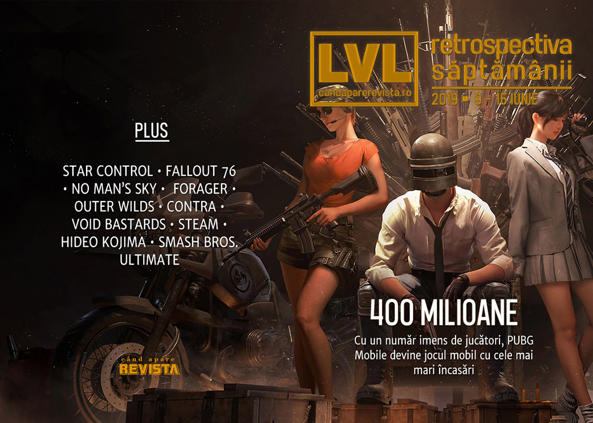

Principala știre e că săptămâna asta s-a desfășurat **E3 2019**, care a monopolizat aproape toate știrile (și [pe care le-am strâns într-un articol separat]()), așa că ne-au mai rămas doar câteva firimituri. Plus faptul că București e cel mai tare oraș din lume pentru gaming.

Linkuri rapide:

* [Știri](#ştiri)
* [Articole (critică, dev, design)](#articole-critică-dev-design)
* [Made în România](#made-în-românia)
* [Anunţuri şi lansări de jocuri](#anunţuri-şi-lansări-de-jocuri)
* [Prăvălii de jocuri](#prăvălii-de-jocuri)

## Ştiri

* Stardock și creatorii seriei Star Control anunță o înțelegere care pune capăt litigiului pe tema drepturilor de autor asupra seriei. ([Ars Technica](https://arstechnica.com/gaming/2019/06/stardock-and-star-control-creators-settle-lawsuits-with-mead-and-honey/), [GameDaily.biz](https://gamedaily.biz/article/938/stardock-and-star-control-creators-have-reached-a-settlement), [PC Gamer](https://www.pcgamer.com/star-control-lawsuit-settled-both-sides-will-cooperate-on-current-and-future-games/), [GamesIndustry.biz](https://www.gamesindustry.biz/articles/2019-06-11-star-control-creators-settle-legal-battle-with-stardock))
* PUBG Mobile, varianta pentru mobile a celebrului joc _battle royale_, a depășit 400 de milioane de descărcări și a devenit jocul mobil cu cele mai mari încasări, adunând 146 milioane de dolari luna trecută. ([VideoGamesChronicle](https://www.videogameschronicle.com/news/pubg-mobile-tops-400-million-downloads/))
* Fanii jocului No Man's Sky au inițiat o campanie de finanțare pentru a cumpăra un panou publicitar pentru a le transmite un mesaj de mulțumire producătorilor jocului pentru modul în care au tratat și îmbunătățit jocul după lansare. ([PC Gamer](https://www.pcgamer.com/no-mans-sky-fans-are-buying-a-billboard-to-say-thank-you-to-hello-games/), [Games Informer](https://www.gameinformer.com/gamer-culture/2019/06/14/no-mans-sky-fans-thank-hello-games-by-purchasing-ad-space-on-billboard), [TechSpot](https://www.techspot.com/news/80517-no-man-sky-fans-buying-billboard-thank-developer.html))
* Bethesda trimitie în sfârșit gențile din material textil promise cumpărătorilor ediției de colecție a Fallout 76, la 7 luni după scandalul genților de nylon. ([Eurogamer](https://www.eurogamer.net/articles/2019-06-15-7-months-later-bethesda-has-finally-delivered-the-fallout-76-canvas-bags), [USgamer](https://www.usgamer.net/articles/after-six-months-fallout-76-players-are-finally-getting-a-canvas-bag))
* Amazon Game Studios face reorganizări: anulează unele jocuri încă neanunțate și concediază câteva zeci de dezvoltatori. ([Kotaku](https://kotaku.com/amazon-lays-off-dozens-of-game-developers-during-e3-1835523460), [GameDaily.biz](https://gamedaily.biz/article/954/amazon-game-studios-lays-off-staff-cancels-games-during-e3-2019), [RPS](https://www.rockpapershotgun.com/2019/06/15/amazon-game-studios-lay-off-developers-reportedly-cancel-unannounced-projects/), [Gamasutra](https://www.gamasutra.com/view/news/344790/Amazon_Game_Studios_lays_off_dozens_of_staff.php))

## Articole (critică, dev, design)
* [Can You Trust Game Reviews?](https://www.gamespace.com/all-articles/news/can-you-trust-game-reviews) (GameSpace)
* [The Museum of Soviet Arcade Games](https://arcadeblogger.com/2019/06/15/the-museum-of-soviet-arcade-games/) (The Arcade Blogger)

---

### _Not-a-review_
* [Getting flung into space is Outer Wilds at its best](https://www.rockpapershotgun.com/2019/06/09/getting-flung-into-space-is-outer-wilds-at-its-best/) (RPS)
* [How &#8216;Forager&#8217; Managed to Hook a Survival Skeptic](https://variety.com/2019/gaming/columns/how-forager-managed-to-hook-a-survival-skeptic-1203236992/) (Variety)

---

### Istorie, retrospectivă
* [Smoggy Pasts: Strategy Games and Ecology](http://www.playthepast.org/?p=6498) (Play The Past)
* [How Is The Original Contra Still So Got Damn Good](https://kotaku.com/how-is-the-original-contra-still-so-got-damn-good-1835498138) (Kotaku)

---

### Dev, making of, mecanici
* [Game Designer Spotlight: Hideo Kojima](https://www.gamasutra.com/blogs/CalebCompton/20190610/344429/Game_Designer_Spotlight_Hideo_Kojima.php) (Gamasutra)
* [Three interesting insights from the making of  Void Bastards](https://www.gamasutra.com/view/news/344488/Three_interesting_insights_from_the_making_of_Void_Bastards.php) (Gamasutra)

---

### Design, world-building, artă
* [Very Cool Portraits Of Every Single Smash Bros. Ultimate Character](https://kotaku.com/very-cool-portraits-of-every-single-smash-bros-ultimat-1835285057) (Kotaku)

## Made în România
* O analiză făcută de site-ul speedtest.net a pus Bucureștiul pe primul loc într-un top al orașelor cu cea mai bună conexiune de internet pentru gaming, datorită vitezei mari și ping-lui foarte scăzut. ([Speedtest Stories &amp; Analysis: Data-driven articles on internet speeds](https://www.speedtest.net/insights/blog/gaming-cities-lowest-latency-2019/), [Romania Insider](https://www.romania-insider.com/bucharest-gaming-capital-speedtest))

## Anunţuri şi lansări de jocuri
* [Nicalis teases an all-new 1001 Spikes game](https://www.destructoid.com/nicalis-teases-an-all-new-1001-spikes-game-556538.phtml) (Destructoid)

### Anunţate
* **WarTide Worlds** – un MMO combinație de RTS și FPS ([GameSpace](https://www.gamespace.com/all-articles/news/wartide-worlds-mmo-combining-rts-and-fps-on-kickstarter/))
* **Lovely Planet 2: April Skies** ([PC Gamer](https://www.pcgamer.com/lovely-planet-2-release-date/))
* **Underlords**, varianta de Dota Auto Chess ce va fi produsă de Valve ([The Verge](https://www.theverge.com/2019/6/13/18678187/valve-underlords-auto-chess-standalone-steam-android-ios), [PC Gamer](https://www.pcgamer.com/dota-underlords-is-valves-version-of-auto-chess-and-you-can-play-it-right-now/))

### Lansate
* 10 iunie: **Devolver Bootleg** ([Steam](https://store.steampowered.com/app/1066260/Devolver_Bootleg/))
* 11 iunie: **Looking for Heals** (early access) ([Steam](https://store.steampowered.com/app/1037750/Looking_for_Heals/))
* 11 iunie: **American Truck Simulator - Washington** ([Steam](https://store.steampowered.com/app/1015160/American_Truck_Simulator__Washington/))
* 13 iunie: **Seeds of Resilience** (iese din early access) ([Steam](https://store.steampowered.com/app/877080/Seeds_of_Resilience/))
* 13 iunie: **Naval Action** ([Steam](https://store.steampowered.com/app/311310/Naval_Action/))
* 14 iunie: **Chippy** ([Steam](https://store.steampowered.com/app/602700/Chippy/))
* 14 iunie: **Blaster Master Zero** ([Steam](https://store.steampowered.com/app/1034900/Blaster_Master_Zero/))

## Prăvălii de jocuri
* [Steam unveils its upcoming, very familiar-looking library redesign](https://www.rockpapershotgun.com/2019/06/12/steams-upcoming-library-revamp-looks-like-every-other-shop/) (RPS)

### Jocuri noi în catalog
* [Microsoft announces final backward-compatible games coming to Xbox One](https://www.polygon.com/e3/2019/6/10/18660402/microsoft-xbox-one-backwards-compatibility-project-scarlett-e3-2019) (Polygon)

### Jocuri gratis și free weekends
* [Enter the Gungeon is the latest Epic free game](https://www.pcgamer.com/enter-the-gungeon-is-the-latest-epic-free-game/) (PC Gamer)
* [Toonstruck, starring Christopher Lloyd, is free on GOG](https://www.rockpapershotgun.com/2019/06/14/toonstruck-free-on-gog/) (RPS)
* [Hunt: Showdown is free on Steam for the weekend](https://www.pcgamer.com/hunt-showdown-is-free-on-steam-for-the-weekend/) (PC Gamer)

### Reduceri și promoții
* [Best PC gaming deals of the week &#8211; 14th June 2019](https://www.rockpapershotgun.com/2019/06/14/best-pc-gaming-deals-of-the-week-14th-june-2019/) (RPS)
* [Weekend Console Download Deals for June 14: Post-E3 2019 sales](https://www.shacknews.com/article/112452/weekend-console-download-deals-for-june-14-post-e3-2019-sales) (Shacknews)
* [Weekend PC Download Deals for June 14: RIP E3 2019](https://www.shacknews.com/article/112453/weekend-pc-download-deals-for-june-14-rip-e3-2019) (Shacknews)

---

{}
**Retrospectiva săptămânii** este rubrica duminicală în care trecem în revistă evenimentele săptămânii de pe frontul de gaming: știri şi articole (scrise de alții, bineînțeles, că e mai ușor aşa), industrie, lansări, oferte de jocuri, toate numai de savurat la cafeaua de duminică dimineața.

De asemenea, rubrica e deschisă oricui vrea și poate contribui. Dacă ai citit vreun articol sau vreo știre interesantă și crezi că merită incluse în retrospectiva săptămânii, te așteptăm pe forum pe unul dintre topicurile dedicate: [Știri](https://forum.candaparerevista.ro/viewtopic.php?f=4&t=46), [Articole](https://forum.candaparerevista.ro/viewtopic.php?f=4&t=206), [Gaming România](https://forum.candaparerevista.ro/viewtopic.php?f=4&t=1622)].
{}
