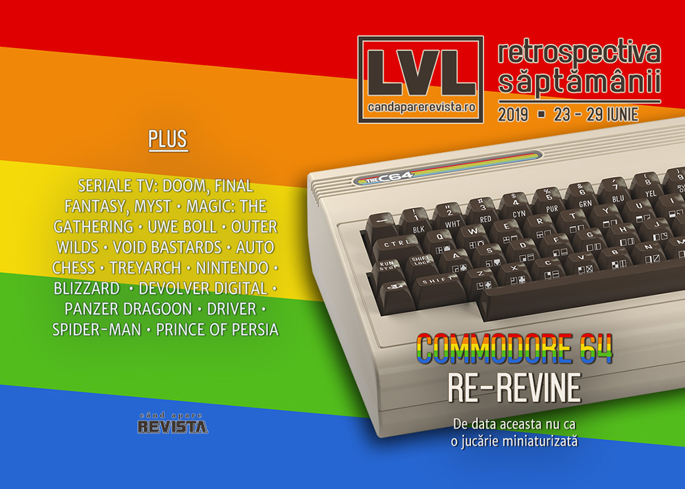

Continuă valul de ecranizări după jocuri video - Doom, Myst și Final Fantasy vor ajunge la televizor, politica interfereazaă cu lumea jocurilor, vom putea cumpăra din nou un computer Commodore 64, și „auto chess” pare să devină noul _battle royale_, Jordan Mechner aniversează 30 de ani de Prince of Persia, iar Heavy Rain ajunge în sfârșit și pe PC. De citit reportajul despre Treyarch și Black Ops 4 și scurta istorie a jocurilor adventure în mod text.

Linkuri rapide:

* [Știri](#ştiri)
* [Articole (critică, dev, design)](#articole-critică-dev-design)
* [Made în România](#made-în-românia)
* [Anunţuri şi lansări de jocuri](#anunţuri-şi-lansări-de-jocuri)
* [Prăvălii de jocuri](#prăvălii-de-jocuri)

## Știri

* Sony, Microsoft și Nintendo au trimis o scrisoare comună administrației condusă de Donald Trump pentru a solicita o excepție pentru consolele de jocuri din gama produselor vizate de plănuita creștere cu 25% a taxelor vamale asupra produselor de import din China. ([Ars Technica](https://arstechnica.com/gaming/2019/06/console-makers-warn-trumps-trade-war-could-increase-hardware-prices-25/), [Kotaku](https://kotaku.com/sony-microsoft-and-nintendo-come-out-against-trump-s-1835878667), [VideoGamesChronicle](https://www.videogameschronicle.com/news/console-makers-25-tariffs-would-harm-entire-video-game-ecosystem/), [Games Informer](https://www.gameinformer.com/2019/06/26/sony-nintendo-and-microsoft-issue-joint-letter-discouraging-trump-administration-from), [Vice](https://www.vice.com/en_us/article/zmp5ka/nintendo-microsoft-and-sony-say-trumps-tariffs-will-make-consoles-cost-more), [GamesIndustry.biz](https://www.gamesindustry.biz/articles/2019-06-26-microsoft-sony-and-nintendo-25-percent-tariff-on-consoles-would-cause-disproportionate-harm))
* S-ar putea să avem un serial TV care să spună povestea lui John Carmack și John Romero. O rețea de televiziune din SUA a comandat un episod pilot bazat pe cartea „Masters of Doom” ce va fi produs de frații James și Dave Franco. ([Variety](https://variety.com/2019/tv/news/masters-of-doom-series-james-franco-dave-franco-usa-network-1203254181/), [Polygon](https://www.polygon.com/2019/6/27/18761318/masters-of-doom-id-software-tv-series-usa-network-john-carmack-romero), [Ars Technica](https://arstechnica.com/gaming/2019/06/id-softwares-origin-story-set-to-become-usa-network-tv-series/))
* Se face și un serial bazat pe jocul Final Fantasy 14, ce va fi produs de noul studio înființat de Sony și compania care se ocupă de serialul Witcher. ([PC Gamer](https://www.pcgamer.com/final-fantasy-14-is-getting-a-live-action-tv-series/), [VideoGamesChronicle](https://www.videogameschronicle.com/news/sony-partners-with-square-enix-for-final-fantasy-tv-series/), [The Verge](https://www.theverge.com/2019/6/27/18761339/final-fantasy-14-live-action-tv-series-sony-pictures-hivemind))
* Ba chiar și Myst va apărea în film și la TV: compania Village Roadshow a achiziționat drepturile de ecranizare pentru franciza Myst. ([Polygon](https://www.polygon.com/2019/6/26/18759897/myst-movie-tv-series-village-roadshow), [Games Informer](https://www.gameinformer.com/2019/06/26/myst-movie-and-tv-show-universe-being-developed), [The Verge](https://www.theverge.com/2019/6/26/18760000/myst-game-tv-series-film-village-roadshow), [Gamasutra](https://www.gamasutra.com/view/news/345671/Village_Roadshow_has_acquired_the_television_and_film_rights_to_Myst.php))
* Commodore 64 se relansează… din nou, dar de data aceasta într-o versiune funcțional identică cu originalul, plus conectivitate modernă și jocuri incluse. Avem detalii noi și o dată de lansare: 5 decembrie anul acesta. ([Destructoid](https://www.destructoid.com/the-classic-commodore-64-is-getting-a-full-sized-re-release-this-december-558718.phtml), [GamesIndustry.biz](https://www.gamesindustry.biz/articles/2019-06-25-commodore-64-gets-retro-re-release), [VG247](https://www.vg247.com/2019/06/25/c64-commodore-64-full-sized-dec-release-date/), [TechSpot](https://www.techspot.com/news/80678-full-size-recreation-commodore-64-arrives-year.html))
* League of Legends a fost blocat în Iran și Siria din cauza sancțiunilor impuse de guvernul american. ([PCGamesInsider.biz](http://www.pcgamesinsider.biz/news/69250/us-trade-sanctions-against-iran-and-syria-hit-league-of-legends/), [Eurogamer](https://www.eurogamer.net/articles/2019-06-23-us-government-blocks-league-of-legends-for-players-in-iran-and-syria), [GameDaily.biz](https://gamedaily.biz/article/985/league-of-legends-blocked-in-iran-and-syria-because-of-the-us-government))

## Articole (critică, dev, design)

* [It’s possible to build a Turing machine within Magic: The Gathering](https://arstechnica.com/science/2019/06/its-possible-to-build-a-turing-machine-within-magic-the-gathering/) (Ars Technica)
* [Single-player games might be safer bets than live games in 2019](https://www.polygon.com/2019/6/24/18683652/single-player-games-as-service-fortnite-anthem-apex) (Polygon)
* [The battle royale gold rush is over](https://www.pcgamer.com/the-battle-royale-gold-rush-is-over/) (PC Gamer)
* [When Fandom Is the Problem](https://io9.gizmodo.com/when-fandom-is-the-problem-1835695031) (Gizmodo)
* [What is Cyberpunk? A Discussion on Intent and Context](https://techraptor.net/content/what-is-cyberpunk) (TechRaptor)
* [New Uwe Boll Documentary Shows How Gaming&#39;s Worst Filmmaker Improbably Succeeded](https://www.vice.com/en_us/article/3k3wqk/new-uwe-boll-documentary-shows-how-gamings-worst-filmmaker-improbably-succeeded) (Vice)
* [Underwater Video Games Ignore the Perilous State of Our Collapsing Oceans](https://www.vice.com/en_us/article/wjvydx/underwater-video-games-ignore-the-perilous-state-of-our-collapsing-oceans) (Vice)
* [Sci-fi Tech VS. Real Tech. FIGHT!](https://outsideyourheaven.blogspot.com/2019/06/sci-fi-tech-vs-real-tech-fight.html) (Outside Your Heaven)
* [Stop making me kill animals](https://ineeddiversegames.org/2019/06/27/stop-making-me-kill-animals/) (I Need Diverse Games)
* [The Changing Face Of Arcade Games In 2019](https://www.gamespot.com/articles/the-changing-face-of-arcade-games-in-2019/1100-6468074/) (Gamespot)
* [Preservationists Are Saving Video Game History, One Upload at a Time](https://onezero.medium.com/preservationists-are-saving-video-game-history-one-upload-at-a-time-cc5b8bb512a2) (Medium)
* [Auto Chess is the Latest Gaming Industry Gold Rush, Like MOBA and Battle Royale Before It](https://www.usgamer.net/articles/auto-chess-is-the-latest-gaming-industry-gold-rush) (USgamer)

---

### _Not-a-review_
* [Outer Wilds Is One Of The Best Games I&#39;ve Ever Played](https://kotaku.com/outer-wilds-is-one-of-the-best-games-ive-ever-played-1835801654) (Kotaku)
* [Turning Despair Into Laughs With Void Bastards](https://www.gameinformer.com/the-virtual-life/2019/06/26/turning-despair-into-laughs-with-void-bastards) (Games Informer)

---

### Reportaj
* [The Human Cost Of Call of Duty: Black Ops 4](https://kotaku.com/the-human-cost-of-call-of-duty-black-ops-4-1835859016) (Kotaku) (TL;DR pe [GamesIndustry.biz](https://www.gamesindustry.biz/articles/2019-06-26-stories-of-crunch-contempt-for-qa-at-treyarch))

---

### Industrie
* [Which gaming hardware manufacturers may have funded human rights abuses in 2018?](https://www.gamesindustry.biz/articles/2019-06-27-which-gaming-hardware-manufacturers-may-have-funded-armed-conflict-in-2018) (GamesIndustry.biz)
* [Nintendo&#39;s Lawyers Need To Chill](https://kotaku.com/nintendos-lawyers-need-to-chill-1835858130) (Kotaku)
* [Cory Barlog: &quot;We're now able to give actors meaty performances, as opposed to just doing voice&quot;](https://www.gamesindustry.biz/articles/2019-06-26-cory-barlog-were-now-able-to-give-actors-meaty-performances) (GamesIndustry.biz)
* [Ex-Blizzard boss Mike Morhaime on why the studio bins 50% of its projects](https://www.eurogamer.net/articles/2019-06-26-ex-blizzard-boss-mike-morhaime-on-why-the-studio-bins-50-percent-of-the-projects-it-starts) (Eurogamer)
* [Is crunch being solved or just outsourced?](https://www.gamesindustry.biz/articles/2019-06-28-is-crunch-being-solved-or-just-outsourced-opinion) (GamesIndustry.biz)
* [Square Enix: "We always look out for new IP"](https://www.gamesindustry.biz/articles/2019-06-27-square-enix-we-always-look-out-for-new-ip) (GamesIndustry.biz)
* [Sean Murray on No Man's Sky: &quot;I thought we were making a niche game&quot;](https://www.gamesindustry.biz/articles/2019-06-25-sean-murray-on-no-mans-sky-i-thought-we-were-making-a-niche-game) (GamesIndustry.biz)
* [How Devolver Digital pursues the indie fringe and brings it to mainstream gamers](https://venturebeat.com/2019/06/28/how-devolver-digital-pursues-the-indie-fringe-and-brings-it-to-mainstream-gamers/) (VentureBeat)

---

### Istorie, retrospectivă
* [Prince of Persia 30th Anniversary](https://www.jordanmechner.com/prince-of-persia-30th-anniversary/) (Blog Jordan Mechner)
* [Interactive Fiction History: Adventures Without Graphics](https://tedium.co/2019/06/27/adventure-games-interactive-fiction-history/) (Tedium)
* [How id built Wolfenstein 3D using Commander Keen tech](https://www.gamasutra.com/view/news/344672/How_id_built_Wolfenstein_3D_using_Commander_Keen_tech.php) (Gamasutra)
* [Driver is as stylish now as it was 20 years ago](https://www.videogamer.com/features/driver-is-as-stylish-now-as-it-was-20-years-ago) (VideoGamer)
* [The Big Panzer Dragoon Interview: &quot;It Really Makes Me Think Again About How Incredible Sega Was at the Time&quot;](https://www.usgamer.net/articles/panzer-dragoon-interview-sega-yukio-futatsugi-kentaro-yoshida) (USgamer)
* [An Incomprehensible Run Down of Video Game Lawsuits](https://thehistoryofhowweplay.wordpress.com/2019/06/25/an-incomprehensible-run-down-of-video-game-lawsuits/) (The History of How We Play)

---

### Dev, making of, mecanici
* [How Insomniac stole the heart of Spider-Man](https://www.eurogamer.net/articles/2019-06-27-how-insomniac-stole-the-heart-of-spiderman) (Eurogamer)
* [David Cage interview: Researching Detroit: Become Human&#8217;s back story of rogue AI](https://venturebeat.com/2019/06/29/david-cage-interview-researching-detroit-become-humans-back-story-of-rogue-ai/) (VentureBeat)
* [Run, Jump and Climb: Designing Fun Movement in Games](https://remptongames.com/2019/06/29/run-jump-and-climb-designing-fun-movement-in-games/) (Rempton Games)

## Made în România
* **Gibbous - A Cthulhu Adventure** are acum și pagină pe GOG.com. ([gog.com](https://www.gog.com/game/gibbous_a_cthulhu_adventure))

## Anunţuri şi lansări de jocuri
* [Narrative-based PUBG game announced, from new team led by Dead Space creator](https://www.eurogamer.net/articles/2019-06-26-narrative-based-pubg-game-announced-from-new-team-led-by-dead-space-creator) (Eurogamer)

### Anunţate
* **SolSeraph** ([DSOGaming ](https://www.dsogaming.com/news/solseraph-is-a-spiritual-successor-to-actraiser-that-is-coming-to-the-pc-on-july-10th/))
* **Blue Protocol** de la Bandai Namco ([Kotaku](https://kotaku.com/bandai-namco-announces-new-action-rpg-called-blue-proto-1835933909))
* **TaleSpire** ([PC Gamer](https://www.pcgamer.com/talespire-wants-to-be-the-digital-tabletop-roleplaying-system-of-your-dreams/))
* **Alder's Blood** ([RPS](https://www.rockpapershotgun.com/2019/06/26/alders-blood-is-a-dark-victorian-western-tactical-rpg/))
* **Solasta: Crown of the Magister** ([PC Gamer](https://www.pcgamer.com/solasta-crown-of-the-magister-promises-a-deep-dandd-style-tactical-rpg/))
* **One Punch Man: A Hero Nobody Knows** ([DSOGaming ](https://www.dsogaming.com/news/one-punch-man-a-hero-nobody-knows-has-been-officially-announced-for-the-pc/))

### Acum cu dată de lansare
* **Blazing Chrome**: 11 iulie ([DSOGaming ](https://www.dsogaming.com/news/contra-metal-slug-inspired-platformer-blazing-chrome-releases-on-july-11th/))
* **Tiny Metal: Full Metal Rumble**: 11 iulie ([Destructoid](https://www.destructoid.com/advance-wars-esque-tiny-metal-sequel-is-out-on-switch-on-july-11-558810.phtml))
* **Streets of Rogue** iese din early access pe 12 iulie ([Steam Community](https://steamcommunity.com/games/512900/announcements/detail/1608263564945727917))
* **Killsquad** intră în early access pe 16 iulie ([PC Gamer](https://www.pcgamer.com/indie-sci-fi-arpg-killsquad-heads-into-early-access-in-july/))
* **The Blackout Club** iese din early acess pe 30 iulie ([PC Gamer](https://www.pcgamer.com/co-op-horror-game-the-blackout-club-emerges-from-early-access-in-july/))
* **Silver Chains**: 6 august ([Steam Community](https://steamcommunity.com/games/975470/announcements/detail/1619522564025304146))

### Lansate
* 24 iunie: **Ring of Elysium** (iese din early access) ([Steam](https://store.steampowered.com/app/755790/Ring_of_Elysium/))
* 24 iunie: **And All Would Cry Beware** ([Steam](https://store.steampowered.com/app/1071510/And_All_Would_Cry_Beware/))
* 25 iunie: **Monster Jam Steel Titans** ([Steam](https://store.steampowered.com/app/824280/Monster_Jam_Steel_Titans/))
* 25 iunie: **Heavy Rain** a ajuns pe PC ([Epic Store](https://www.epicgames.com/store/en-US/product/heavy-rain))
* 25 iunie: **Monster Jam Steel Titans** ([Steam](https://store.steampowered.com/app/824280/Monster_Jam_Steel_Titans/), [gog.com](https://www.gog.com/game/Monster_Jam_Steel_Titans))
* 26 iunie: **Black Squad** ([Steam](https://store.steampowered.com/app/550650/Black_Squad/))
* 26 iunie: **Teamfight Tactics**, versiunea de Auto Chess pentru League of Legends ([League of Legends](https://na.leagueoflegends.com/en/featured/events/teamfight-tactics))
* 27 iunie: **The Sinking City** ([Epic Store](https://www.epicgames.com/store/en-US/product/the-sinking-city/))
* 27 iunie: **F1 2019 Anniversary Edition** ([Steam](https://store.steampowered.com/app/928600/F1_2019_Anniversary_Edition/))
* 28 iunie: **Super Mario Maker 2** (Switch) ([Nintendo Store](https://www.nintendo.com/games/detail/super-mario-maker-2-switch/))

## Prăvălii de jocuri

### Știri
* [Steam and Ubuntu clash over 32-bit libs](https://arstechnica.com/gaming/2019/06/steam-and-ubuntu-clash-over-32-bit-libs/) (Ars Technica)
* [Epic&#39;s Founder Explains Why The Company Is Going So Hard On Exclusives](https://kotaku.com/epics-founder-explains-why-the-company-is-going-so-hard-1835859676) (Kotaku) și [Epic Games Store exclusives 'do work' and Steam's revenue split is 'disastrous,' says Tim Sweeney](https://gamedaily.biz/article/991/epic-games-store-exclusives-do-work-and-steams-revenue-split-is-disastrous-says-tim-sweeney) (GameDaily.biz)
* [Indie developers suggest Steam Summer Sale confusion is hurting their games [Updated]](https://arstechnica.com/gaming/2019/06/indie-developers-suggest-steam-summer-sale-confusion-is-hurting-their-games/) (Ars Technica)
* [Valve Changes Steam Sale After Widespread Complaints From Developers And Players](https://kotaku.com/valve-changes-steam-sale-after-widespread-complaints-fr-1835917510) (Kotaku)

### Articole
* [The gamification of gaming has reached new levels of meta weirdness](https://www.pcgamer.com/the-gamification-of-gaming-has-reached-new-levels-of-meta-weirdness/) (PC Gamer)

### Jocuri noi în catalog
* [11 more indie games confirmed for Xbox Game Pass](https://www.videogameschronicle.com/news/11-more-indie-games-confirmed-for-xbox-game-pass/) (VideoGamesChronicle)
* [July’s PlayStation Plus free games include Pro Evolution Soccer 2019](https://www.polygon.com/2019/6/26/18759777/playstation-plus-free-games-july-2019-ps4) (Polygon)
* [Inside headlines July’s Xbox Live Games with Gold](https://www.videogameschronicle.com/news/inside-headlines-julys-xbox-live-games-with-gold/) (VideoGamesChronicle)

### Jocuri gratis și free weekends
* [Last Day of June is free on the Epic Games Store, and Overcooked is next](https://www.pcgamer.com/last-day-of-june-is-free-on-the-epic-games-store-and-overcooked-is-next/) (PC Gamer)
* [Seek your memories in gorgeous free puzzler When The Past Was Around](https://www.pcgamer.com/seek-your-memories-in-gorgeous-free-puzzler-when-the-past-was-around/) (PC Gamer)

### Reduceri și promoții
* [Steam Grand Prix Summer Sale 2019 has been launched, more than 30.000 games on sale](https://www.dsogaming.com/news/steam-grand-prix-summer-sale-2019-has-been-launched/) (DSOGaming )
* [Mega Discounts Kick Off On PlayStation Store](https://www.gamespace.com/all-articles/news/mega-discounts-kick-off-on-playstation-store) (GameSpace)
* [Best PC gaming deals of the week &#8211; 28th June 2019](https://www.rockpapershotgun.com/2019/06/28/best-pc-gaming-deals-of-the-week-28th-june-2019/) (RPS)
* [Weekend Console Download Deals for June 28: Go hunt monsters](https://www.shacknews.com/article/112670/weekend-console-download-deals-for-june-28-go-hunt-monsters) (Shacknews)
* [Weekend PC Download Deals for June 28: Steam Summer Sale](https://www.shacknews.com/article/112668/weekend-pc-download-deals-for-june-28-steam-summer-sale) (Shacknews)
* [Latest Humble RPG Book Bundle offers up almost $400 worth of D&amp;D 5th Edition manuals](https://www.vg247.com/2019/06/27/latest-humble-rpg-book-bundle-offers-almost-400-worth-dd-5th-edition-manuals/) (VG247)

---

{}
**Retrospectiva săptămânii** este rubrica duminicală în care trecem în revistă evenimentele săptămânii de pe frontul de gaming: știri şi articole (scrise de alții, bineînțeles, că e mai ușor aşa), industrie, lansări, oferte de jocuri, toate numai de savurat la cafeaua de duminică dimineața.

De asemenea, rubrica e deschisă oricui vrea și poate contribui. Dacă ai citit vreun articol sau vreo știre interesantă și crezi că merită incluse în retrospectiva săptămânii, te așteptăm pe forum pe unul dintre topicurile dedicate: [Știri](https://forum.candaparerevista.ro/viewtopic.php?f=4&t=46), [Articole](https://forum.candaparerevista.ro/viewtopic.php?f=4&t=206), [Gaming România](https://forum.candaparerevista.ro/viewtopic.php?f=4&t=1622)].
{}
