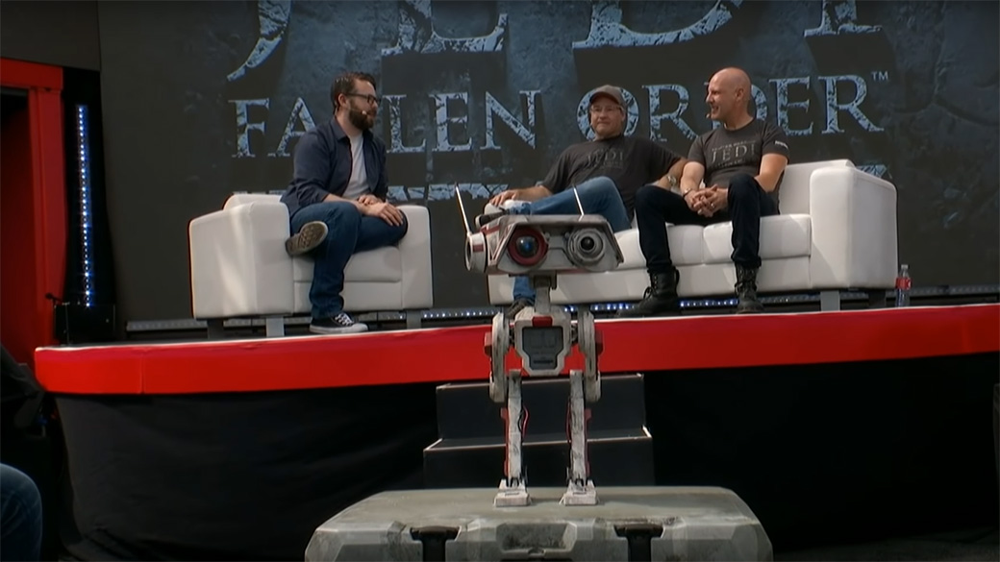
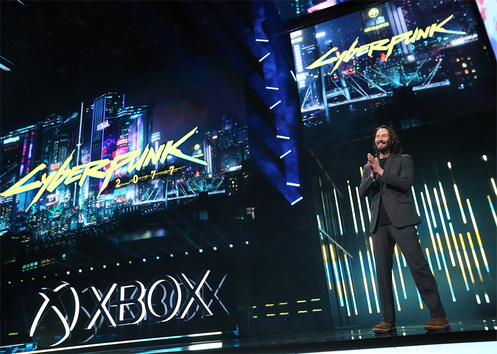
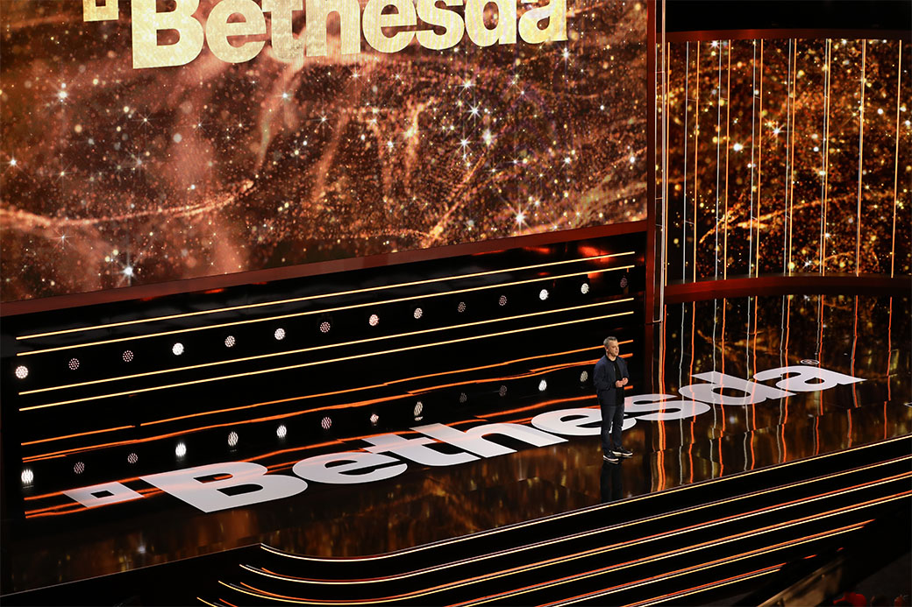
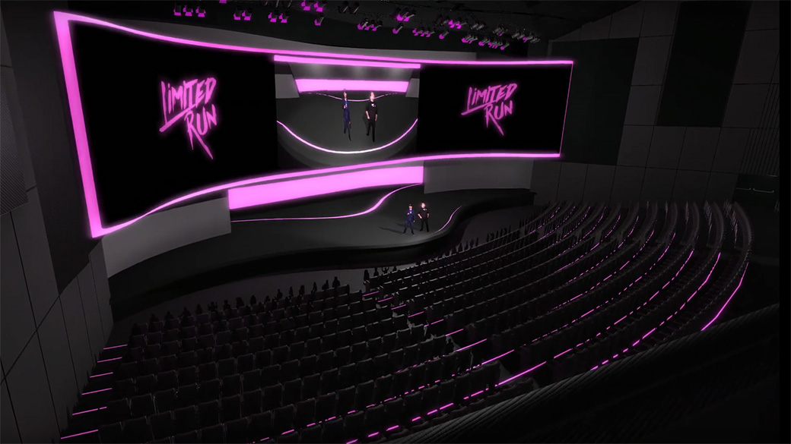
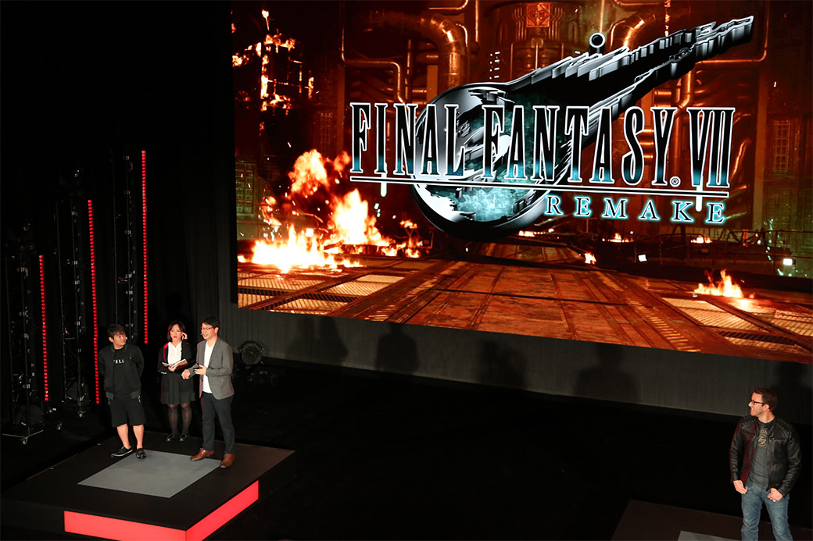

E3 2019 a venit și s-a dus și ne-a lăsat cu o mulțime de jocuri și noutăți de despachetat. E mult de citit, dacă n-ați urmărit nimic săptămâna asta, dar puteți sări peste Electronic Arts și să începeți direct cu Microsoft, apoi treceți la PC Gaming Show și Kinda Funny Showcase, și mai vedeți apoi ce vă atrage privirea. Și avem și [thread deschis pe forum, dacă vreți să discutăm](https://forum.candaparerevista.ro/viewtopic.php?f=4&t=2135).

Linkuri rapide:

* Sâmbătă, 8 iunie: [Electronic Arts](#electronic-arts)
* Duminică, 9 iunie: [Microsoft](#microsoft) | [Bethesda](#bethesda) | [Devolver Digital](#devolver-digital)
* Luni, 10 iunie: [UploadVR](#uploadvr) | [The PC Gaming Show](#the-pc-gaming-show) | [Limited Run](#limited-run) | [Ubisoft](#ubisoft) | [The Kinda Funny Showcase](#the-kinda-funny-showcase) | [Square Enix](#square-enix)
* Marți, 11 iunie: [Nintendo](#nintendo)
* [E3, 11-13 iunie](#e3-11-13-iunie)

## Electronic Arts

* Gameplay trailer pentru **Star Wars Jedi: Fallen Order** ([PC Gamer](https://www.pcgamer.com/star-wars-jedi-fallen-order-gets-a-gameplay-trailer-at-e3-2019/), [Eurogamer](https://www.eurogamer.net/articles/2019-06-08-heres-our-first-look-at-star-wars-jedi-fallen-order-gameplay), [Shacknews](https://www.shacknews.com/article/112161/star-wars-jedi-fallen-order-gets-extended-gameplay-trailer))
* Alte noutăţi despre jocurile proprii, printre care:
  * … FIFA 20 ([PC Gamer](https://www.pcgamer.com/fifa-20-is-out-in-september-with-a-focus-on-micro-skill/), [Gamereactor](https://www.gamereactor.eu/news/772583/))
  * … Sims 4 ([Games Informer](https://www.gameinformer.com/e3-2019/2019/06/08/the-sims-4-ea-conference-announcements-include-mermaids-and-magic), [Polygon](https://www.polygon.com/e3/2019/6/8/18657965/sims-4-island-living-release-date))
  * … Battlefield V, care duce războiul în Pacific. ([Shacknews](https://www.shacknews.com/article/112168/battlefield-5-hits-the-pacific-theater-this-fall-ea-play-2019), [Eurogamer](https://www.eurogamer.net/articles/2019-06-08-battlefield-5-hits-the-pacific-later-in-2019), [Gamereactor](https://www.gamereactor.eu/news/772573))
* Jocuri indie noi, publicate de EA, de la studiouri consacrate: Lost in Random, RustHeart și încă unul fără titlu deocamdată. ([Eurogamer](https://www.eurogamer.net/articles/2019-06-08-ea-expands-indie-publishing-with-new-games-rustheart-lost-in-random-more), [Games Informer](https://www.gameinformer.com/2019/06/08/ea-originals-announces-three-more-titles-including-another-from-a-way-out-developer), [Kotaku](https://kotaku.com/ea-announces-three-new-games-from-smaller-studios-1835350265), [The Verge](https://www.theverge.com/2019/6/8/18656728/ea-originals-rustheart-lost-in-random-indie-games-e3-2019))

#### Sumar
* [EA Play at E3 2019: trailers, news and announcements](https://www.polygon.com/e3/2019/6/8/18656475/ea-play-e3-2019-trailers-news-announcements) (Polygon)
* [Everything that happened at the very, very...very low key E3 2019 EA Play event](https://www.destructoid.com/everything-that-happened-at-the-very-very-very-low-key-e3-2019-ea-play-event-556457.phtml) (Destructoid)
* [EA at E3 2019: The 4 best announcements](https://www.polygon.com/e3/2019/6/8/18657838/ea-play-e3-2019-best-announcements-game-trailers) (Polygon)
* [Everything from EA Play at E3 2019](https://venturebeat.com/2019/06/08/everything-from-ea-play-at-e3-2019/) (VentureBeat)
* [EA Play 2019 recap, gameplay trailers, and announcements](https://www.shacknews.com/article/112189/ea-play-2019-recap-gameplay-trailers-and-announcements) (Shacknews)

#### Altele
* [Everything we spotted in the extended Star Wars Jedi: Fallen Order gameplay demo you didn't get to see](https://www.eurogamer.net/articles/2019-06-08-heres-what-you-didnt-see-in-the-star-wars-jedi-fallen-order-extended-gameplay-demo) (Eurogamer)
* [At E3 2019, AAA is EA's today; EA Originals and EA Partners is its tomorrow](https://gamedaily.biz/article/931/at-e3-2019-aaa-is-eas-today-ea-originals-and-ea-partners-is-its-tomorrow) (GameDaily.biz)

## Microsoft

* Xbox Game Pass s-a lansat pentru PC. ([PC Gamer](https://www.pcgamer.com/xbox-game-pass-is-now-available-on-pc-in-open-beta-halo-reach-included/), [USgamer](https://www.usgamer.net/articles/xbox-game-pass-ultimate-bundles-xbox-live-gold-and-game-pass-for-console-and-pc-for-15), [VentureBeat](https://venturebeat.com/2019/06/09/xbox-game-pass-ultimate-launches-with-pc-and-console-games/))
* … cu multe jocuri noi ([TechRaptor](https://techraptor.net/content/xbox-e3-2019-new-xbox-game-pass-games), [RPS](https://www.rockpapershotgun.com/2019/06/10/xbox-game-pass-for-pc-launched/), [PC Gamer](https://www.pcgamer.com/xbox-game-pass-pc-game-list/))
* … printre care și Metro: Exodus ([PC Gamer](https://www.pcgamer.com/metro-exodus-is-on-the-xbox-game-pass-for-pc/), [Eurogamer](https://www.eurogamer.net/articles/2019-06-09-epic-games-store-exclusive-metro-exodus-pc-is-available-to-buy-on-the-microsoft-store), [DSOGaming ](https://www.dsogaming.com/news/metro-exodus-is-now-available-for-purchase-on-windows-store-and-xbox-game-pass-pc/))
* Serviciul de streaming xCloud se lansează în octombrie. ([VideoGamesChronicle](https://www.videogameschronicle.com/news/xcloud-game-streaming-begins-in-october/), [The Verge](https://www.theverge.com/2019/6/9/18656694/microsoft-project-xcloud-game-streaming-price-e3-2019), [Gamasutra](https://www.gamasutra.com/view/news/344357/Microsoft_xCloud_console_streaming_service_goes_live_in_October.php))
* A fost anunțată următoarea consolă Xbox - Project Scarlett, ce promite „o experiență transformativă”: procesor custom, 120 fps, 8K, SSD, ray-tracing. ([VG247](https://www.vg247.com/2019/06/09/xbox-scarlett-120fps-8k-halo-infinite/), [Kotaku](https://kotaku.com/microsoft-announces-project-scarlett-the-next-gen-xbox-1835359683), [VideoGamesChronicle](https://www.videogameschronicle.com/news/xbox-project-scarlet-launches-holiday-2020-with-halo-infinite/), [TechRaptor](https://techraptor.net/content/xbox-e3-2019-next-generation-xbox-console-revealed-at-e3-project-scarlet), [USgamer](https://www.usgamer.net/articles/project-scarlett-xboxs-next-gen-console-will-support-8k-resolution-120fps-and-launch-with-halo-in-2020), [Polygon](https://www.polygon.com/e3/2019/6/9/18657985/microsoft-xbox-e3-2019-console-details-project-scarlett), [Ars Technica](https://arstechnica.com/gaming/2019/06/microsoft-reveals-first-details-on-project-scarlett-game-console-for-2020/))
* Xbox Studios au cumpărat Double Fine Productions ([VG247](https://www.vg247.com/2019/06/09/psychonauts-developer-double-fine-latest-join-microsoft-studios/), [VideoGamesChronicle](https://www.videogameschronicle.com/news/microsoft-acquires-double-fine-productions/), [Ars Technica](https://arstechnica.com/gaming/2019/06/double-fine-productions-is-microsofts-latest-xbox-acquisition/)), plus drepturile de publicare pentru Psychonauts 2 de la Starbreeze. ([PCGamesInsider.biz](https://www.pcgamesinsider.biz/news/69139/e3-2019-starbreeze-sells-psychonauts-2-publishing-rights-to-microsoft-for-132m/), [Gamasutra](https://www.gamasutra.com/view/news/344370/Microsoft_picks_up_Psychonauts_2_publishing_rights_from_Starbreeze.php))

#### Jocuri anunțate
* Microsoft Flight Simulator ([VG247](https://www.vg247.com/2019/06/09/microsoft-flight-simulator-announced-xbox-one-pc/), [Kotaku](https://kotaku.com/new-microsoft-flight-simulator-looks-uncannily-like-rea-1835359010), [PC Gamer](https://www.pcgamer.com/see-the-shiny-new-trailer-for-microsoft-flight-simulator-coming-in-2020/))
* Elden Ring, colaborare între FromSoftware și George R.R. Martin ([PC Gamer](https://www.pcgamer.com/heres-our-first-look-at-elden-ring-the-from-software-and-george-rr-martin-collab/), [Kotaku](https://kotaku.com/its-official-elden-ring-is-a-crossover-between-george-1835359590), [VideoGamesChronicle](https://www.videogameschronicle.com/news/fromsofts-elden-ring-is-the-studios-largest-game-to-date/), [Eurogamer](https://www.eurogamer.net/articles/2019-06-09-from-softwares-george-r-r-martin-collaboration-elden-ring-gets-first-trailer))
* Bleeding Edge, următorul joc de la Ninja Theory ([TechRaptor](https://techraptor.net/content/xbox-e3-2019-bleeding-edge), [VentureBeat](https://venturebeat.com/2019/06/09/ninja-theory-unveils-bleeding-edge-co-op-game/), [Polygon](https://www.polygon.com/e3/2019/6/9/18658794/bleeding-edge-e3-2019-trailer-release-date-xbox-one-pc-ninja-theory))
* Blair Witch ([Kotaku](https://kotaku.com/theres-going-to-be-a-blair-witch-video-game-1835358771), [VideoGamesChronicle](https://www.videogameschronicle.com/news/xbox-gets-blair-witch-horror-game/))
* Age of Empires II: Definitive Edition ([PC Gamer](https://www.pcgamer.com/age-of-empires-2-definitive-edition-confirmed-at-e3-coming-this-fall/))
* Phantasy Star Online 2 ([Eurogamer](https://www.eurogamer.net/articles/2019-06-09-phantasy-star-online-2-is-finally-finally-coming-to-the-west), [PC Gamer](https://www.pcgamer.com/holy-crap-phantasy-star-online-2-is-finally-coming-to-the-west-in-spring-2020/))
* Lego Star Wars: The Skywalker Saga, ce acoperă toate cele 9 filme ([VideoGamesChronicle](https://www.videogameschronicle.com/uncategorised/new-lego-star-wars-game-will-cover-events-from-all-9-movies/), [PC Gamer](https://www.pcgamer.com/the-new-lego-star-wars-game-covers-all-nine-films/))
* Spiritfarer ([VGChartz](http://www.vgchartz.com/article/438687/thunder-lotus-announces-spiritfarer-a-game-about-saying-goodbye/), [VideoGamesChronicle](https://www.videogameschronicle.com/news/get-ready-to-say-goodbye-in-spiritfarer/))
* Commander Lilith & the Fight for Sanctuary, un DLC nou pentru Borderlands 2 (da, doi) care e gratis până pe 9 iulie ([PC Gamer](https://www.pcgamer.com/commander-lilith-and-the-fight-for-sanctuary-is-a-new-borderlands-2-dlc-and-you-can-get-it-free/), [VG247](https://www.vg247.com/2019/06/09/borderlands-2-free-dlc-commander-lilith-fight-sanctuary-free/))
* Tales of Arise ([TechRaptor](https://techraptor.net/content/xbox-e3-2019-tales-of-arise-announced-at-xbox-e3))
* The Legend of Wright ([Variety](https://variety.com/2019/gaming/games/the-legend-of-wright-release-1203237208/))

#### Trailers/dată de lansare
* Trailer nou și dată de lansare pentru **Cyberpunk 2077**, plus surpriza: Keanu Reeves are un rol în joc. ([Ars Technica](https://arstechnica.com/gaming/2019/06/keanu-reeves-confirms-cyberpunk-2077s-release-date-april-16-2020/), [Kotaku](https://kotaku.com/keanu-reeves-is-in-cyberpunk-2077-1835358305))
* Psychonauts 2 ([Kotaku](https://kotaku.com/microsoft-buys-psychonauts-2-developer-double-fine-prod-1835359067), [PC Gamer](https://www.pcgamer.com/raz-and-his-friends-are-back-in-the-new-psychonauts-2-trailer/), [RPS](https://www.rockpapershotgun.com/2019/06/09/cyberpunk-2077-release-date-announced/))
* Battletoads ([Kotaku](https://kotaku.com/the-new-battletoads-is-going-to-have-plenty-of-side-scr-1835358947), [PC Gamer](https://www.pcgamer.com/battletoads-are-back-along-with-those-damn-hoverbikes/))
* Halo Infinite ([PC Gamer](https://www.pcgamer.com/halo-infinite-reveal/), [VG247](https://www.vg247.com/2019/06/09/halo-infinite-e3-2019-trailer-pc-scarlett-2020/))
* Minecraft Dungeons ([PC Gamer](https://www.pcgamer.com/minecraft-dungeons-trailer-showcases-four-player-co-op-dungeon-running/))
* Way To The Woods ([PC Gamer](https://www.pcgamer.com/surreal-but-cute-deer-simulator-a-way-to-the-woods-shows-new-trailer-at-e3/), [Polygon](https://www.polygon.com/e3/2019/6/9/18658937/way-to-the-woods-trailer-release-date-2020-xbox-e3-2019))
* Gears 5 ([Eurogamer](https://www.eurogamer.net/articles/2019-06-09-gears-of-war-5-comes-out-this-september), [Kotaku](https://kotaku.com/gears-of-war-5-coming-out-on-september-10-1835359218), [PC Gamer](https://www.pcgamer.com/gears-5-release-date/))
* Wasteland 3 ([VentureBeat](https://venturebeat.com/2019/06/09/wasteland-3-shows-off-more-of-inxiles-colorado-wastes/), [PC Gamer](https://www.pcgamer.com/wasteland-3-trailer-features-a-clown-making-good-use-of-a-meat-grinder/), [VG247](https://www.vg247.com/2019/06/09/new-trailer-wasteland-3-e3-2019/))
* Star Wars Jedi: Fallen Order ([VG247](https://www.vg247.com/2019/06/09/feel-force-new-jedi-fallen-order-trailer/), [PC Gamer](https://www.pcgamer.com/star-wars-jedi-fallen-order-e3-trailer-shows-cal-taking-on-an-at-at/))
* 12 Minutes ([Eurogamer](https://www.eurogamer.net/articles/2019-06-09-12-minutes-is-a-game-about-a-man-trapped-in-a-time-loop), [TechRaptor](https://techraptor.net/content/xbox-e3-2019-every-choice-matters-in-interactive-thriller-12-minutes), [VideoGamesChronicle](https://www.videogameschronicle.com/news/twelve-minutes-is-a-thriller-with-a-real-time-12-minute-loop/))
* Ori and the Will of the Wisps ([PC Gamer](https://www.pcgamer.com/ori-and-the-will-of-the-wisps-gets-a-spooky-e3-trailer-2020-release-date/), [Polygon](https://www.polygon.com/2019/6/9/18658698/ori-will-of-the-wisps-e3-2019-trailer-release-date-microsoft-xbox))
* Outer Worlds ([PC Gamer](https://www.pcgamer.com/outer-worlds-e3-trailer-asks-if-you-want-to-be-a-herovillain-or-a-psychopath/), [VG247](https://www.vg247.com/2019/06/09/outer-worlds-makes-planetfall-october-25/), [Hardcore Gamer](https://www.hardcoregamer.com/2019/06/13/e3-2019-the-outer-worlds-is-a-detailed-space-western/349570/))
* Dragon Ball Z: Kakarot ([PC Gamer](https://www.pcgamer.com/dragon-ball-z-kakarot-gets-an-explosive-e3-trailer/))
* Dying Light 2 ([Eurogamer](https://www.eurogamer.net/articles/2019-06-09-dying-light-2-out-spring-2020))
* Scavengers ([Games Informer](https://www.gameinformer.com/e3-2019/2019/06/09/get-your-first-look-at-scavengers-gameplay-in-new-trailer), [DSOGaming ](https://www.dsogaming.com/videotrailer-news/first-gameplay-trailer-released-for-class-based-co-op-survival-game-scavengers/))

#### Sumar
* [Everything Microsoft Announced At E3 2019](https://kotaku.com/everything-microsoft-announced-at-e3-2019-1835358411) (Kotaku)
* [Xbox E3 2019 Press Conference Recap: The Next-Generation Xbox is Revealed (Sort Of), But Keanu Reeves Steals the Show](https://www.usgamer.net/articles/xbox-e3-2019-press-conference-recap) (USgamer)
* [Everything Microsoft showed at E3 2019](https://venturebeat.com/2019/06/09/everything-microsoft-showed-at-e3-2019/) (VentureBeat)
* [Xbox at E3 2019: the biggest announcements, trailers, and games](https://www.polygon.com/e3/2019/6/9/18658670/microsoft-xbox-e3-2019-best-announcements-games-trailers) (Polygon)
* [Watch every Microsoft Xbox trailer from E3 2019](https://www.polygon.com/xbox/2019/6/9/18658858/microsoft-xbox-e3-2019-game-trailers-cyberpunk-2077-borderlands-3-halo-infinite) (Polygon)
* [Everything that happened at Microsoft's game-filled E3 2019 press conference](https://www.destructoid.com/everything-that-happened-at-microsoft-s-game-filled-e3-2019-press-conference-556614.phtml) (Destructoid)
* [The 14 biggest announcements for Microsoft Xbox at E3 2019](https://www.theverge.com/2019/6/9/18658541/e3-2019-biggest-announcements-trailers-microsoft-xbox-scarlet-halo-gears-keanu) (The Verge)
* [Here Are All the Trailers From Microsoft&#39;s E3 Press Conference](https://www.vice.com/en_us/article/7xgdve/here-are-all-the-trailers-from-microsofts-e3-press-conference) (Vice)
* [Xbox at E3: Halo Infinite leads massive first-party deluge of Xbox, PC games](https://arstechnica.com/gaming/2019/06/halo-infinite-confirmed-for-holiday-2020-at-crowded-xbox-e3-event/) (Ars Technica)
* [The 14 biggest announcements for Microsoft Xbox at E3 2019](https://www.theverge.com/2019/6/9/18658541/e3-2019-biggest-announcements-trailers-microsoft-xbox-scarlett-halo-gears-keanu) (The Verge)

#### Altele
* [The Internet Reacts To Keanu Reeves In Cyberpunk 2077](https://kotaku.com/the-internet-reacts-to-keanu-reeves-in-cyberpunk-2077-1835361767) (Kotaku)
* [Keanu Reeves has already stolen E3, and we’re fine with it](https://www.polygon.com/e3/2019/6/9/18659047/keanu-reeves-e3-2019-cyberpunk-perfection) (Polygon)
* [Tim Schafer explains why Microsoft now owns Double Fine Productions](https://www.pcgamer.com/tim-schafer-explains-why-microsoft-now-owns-double-fine-productions/) (PC Gamer)
* [Psychonauts 2 Reminds Us Why Double Fine is the Boss of Comedy Games](https://www.usgamer.net/articles/psychonauts-2-hands-off-demo-gameplay-preview-impressions-e3-2019) (USgamer)
* [Yes, Elden Ring will be difficult - and it&#039;ll be an open world game with a focus on RPG elements](https://www.vg247.com/2019/06/10/elden-ring-open-world-rpg/) (VG247)
* [E3 2019: Microsoft looks poised to dominate the next console generation](https://www.videogameschronicle.com/features/e3-2019-microsoft-looks-poised-to-dominate-the-next-console-generation/) (VideoGamesChronicle)
* [OPINION: Microsoft Wasted Their E3 Opportunity](https://www.gamespace.com/featured/opinion-microsoft-wasted-their-e3-opportunity) (GameSpace)
* [The big Xbox interview - Project Scarlett, cross-gen Halo Infinite and the lack of Fable](https://www.eurogamer.net/articles/2019-06-10-the-big-xbox-interview-scarlett-cross-gen-halo-infinite-and-the-lack-of-fable) (Eurogamer)
* [Microsoft&#039;s Dud of an E3 2019 Press Conference Makes Sony Look Smart for Skipping the Show](https://www.usgamer.net/articles/microsoft-e3-2019-press-conference-pc) (USgamer)
* [Microsoft working to get “every single Xbox One game” working on Scarlett](https://arstechnica.com/gaming/2019/06/microsoft-working-to-get-every-single-xbox-one-game-working-on-scarlett/) (Ars Technica)
* [How Microsoft showed up at E3, locked and loaded for games, a new console, and the cloud](https://venturebeat.com/2019/06/12/how-microsoft-showed-up-at-e3-locked-and-loaded-for-games-a-new-console-and-the-cloud/) (VentureBeat)

## Bethesda

* A fost anunțată Orion, o nouă tehnologie menită să îmbunătățească streamingul de jocuri ([Ars Technica](https://arstechnica.com/gaming/2019/06/bethesda-says-its-orion-tech-can-make-all-cloud-gaming-better-faster/), [VG247](https://www.vg247.com/2019/06/10/bethesdas-streaming-tech-orion/), [Variety](https://variety.com/2019/gaming/news/orion-announce-1203237457/), [PC Gamer](https://www.pcgamer.com/bethesda-says-its-orion-technology-improves-game-streaming/))
* Fallout 76 adaugă NPC-uri și un mod battle royale ([VG247](https://www.vg247.com/2019/06/10/fallout-76-wastelanders-features-human-npcs-dialogue/), [Variety](https://variety.com/2019/gaming/news/fallout-76-wastelanders-expansion-trailer-1203237486/), [Ars Technica](https://arstechnica.com/gaming/2019/06/fallout-76-update-promise-turnaround-after-well-deserved-criticism/))
* Elder Scrolls: Blades vine pe Switch ([VG247](https://www.vg247.com/2019/06/10/elder-scrolls-blades-coming-switch/))

#### Jocuri anunțate
* Ghostwire: Tokyo ([VG247](https://www.vg247.com/2019/06/10/ghostwire-tokyo-announced-new-game-shinji-mikamis-tango-gameworks-paranormal-adventure/), [VideoGamesChronicle](https://www.videogameschronicle.com/news/ghostwire-tokyo-is-tango-gameworks-next-game/))
* Deathloop, următorul joc de la Arkane ([VideoGamesChronicle](https://www.videogameschronicle.com/news/dishonored-studio-unevils-deathloop/), [VG247](https://www.vg247.com/2019/06/10/arkane-lyon-working-deathloop-new-first-person-action-game/), [Kotaku](https://kotaku.com/arkanes-next-game-is-deathloop-1835362903))
* Commander Keen, un joc de MOBIL ([Kotaku](https://kotaku.com/what-have-they-done-to-commander-keen-1835365140), [Ars Technica](https://arstechnica.com/gaming/2019/06/bethesda-revives-80s-pc-series-commander-keen-as-a-free-to-play-mobile-game/))
* Rise of the Ghosts, expansion pentru Rage 2 ([VG247](https://www.vg247.com/2019/06/10/rage-2-rise-ghosts-expansion-shown-new-trailer-promises-weekly-updates/))
* Dragonhold, expansion pentru The Elder Scrolls Online ([Variety](https://variety.com/2019/gaming/news/elder-scrolls-online-e3-update-dragonhold-trailer-1203237480/))

#### Trailers/dată de lansare
* Doom Eternal ([VG247](https://www.vg247.com/2019/06/10/doom-eternal-gets-new-trailer-release-date-new-multiplayer-mode-detailed-e3/))
* Wolfenstein: Youngblood ([VG247](https://www.vg247.com/2019/06/10/wolfenstein-youngblood-e3-trailer-action-packed-co-op/))

#### Sumar
* [Everything Bethesda Announced At E3 2019](https://kotaku.com/everything-bethesda-announced-at-e3-2019-1835362095) (Kotaku)
* [Everything that happened at Bethesda's annual okay E3 2019 press conference](https://www.destructoid.com/everything-that-happened-at-bethesda-s-annual-okay-e3-2019-press-conference-556683.phtml) (Destructoid)
* [Bethesda at E3 2019: the biggest announcements, trailers, and games](https://www.polygon.com/2019/6/9/18659229/bethesda-e3-2019-announcements-trailers-release-dates-pc-ps4-xbox-one-nintendo-switch) (Polygon)
* [Watch every Bethesda trailer from E3 2019](https://www.polygon.com/e3/2019/6/9/18659145/bethesda-e3-2019-game-trailers-roundup-doom-eternal-fallout-76-wolfenstein) (Polygon)
* [The 9 biggest announcements from Bethesda’s E3 2019 keynote](https://www.theverge.com/2019/6/9/18659060/bethesda-biggest-announcements-trailers-fallout-doom-deathloop-orion-e3-2019) (The Verge)
* [Bethesda E3 2019 review: A good mix of new IP and existing franchises](https://www.videogameschronicle.com/features/bethesda-e3-2019-review-a-good-mix-of-new-ip-and-existing-franchises/) (VideoGamesChronicle)

#### Altele
* [The internet is ready to die for Ikumi Nakamura, the most genuine person at E3](https://www.polygon.com/e3/2019/6/9/18659141/ikumi-nakamura-bethesda-e3-2019-ghostwire-tokyo-presenter) (Polygon)
* [Ikumi Nakamura Deserved Her E3 Moment](https://kotaku.com/ikumi-nakamura-deserved-her-e3-moment-1835383313) (Kotaku)
* [Hands-on with Bethesda’s game streaming tech, Orion](https://www.polygon.com/e3/2019/6/10/18658799/orion-game-streaming-bethesda-id-software-doom) (Polygon)

## Devolver Digital

#### Jocuri anunțate
* Devolver Bootleg, o colecție de „clone” ale propriilor jocuri ([PC Gamer](https://www.pcgamer.com/devolver-releases-a-bunch-of-bootlegs-of-its-own-games-including-hotline-milwaukee/), [VideoGamesChronicle](https://www.videogameschronicle.com/news/devolver-bootleg-offers-fake-nes-versions-of-8-devolver-games/), [Kotaku](https://kotaku.com/devolvers-collection-of-knock-off-devolver-games-is-wei-1835376429), [The Verge](https://www.theverge.com/2019/6/9/18659237/devolver-digital-bootleg-enter-the-gungeon-ape-out-absolver-downwell-e3))
* Fall Guys: Ultimate Knockout ([Destructoid](https://www.destructoid.com/devolver-announces-fall-guys-ultimate-knockout-for-pc-and-ps4-556691.phtml), [Polygon](https://www.polygon.com/e3/2019/6/9/18658835/devolver-digital-e3-trailer-fall-guys-ultimate-knockout))

#### Trailers/dată de lansare
* Carrion ([Shacknews](https://www.shacknews.com/article/112253/carrion-gameplay-trailer-revealed-at-e3-2019), [Polygon](https://www.polygon.com/e3/2019/6/9/18659163/carrion-devolver-digital-e3-2019-pc-ps4-xbox-one))

#### Sumar
* [Devolver Digital E3 2019 Recap - Completely Insane...](https://techraptor.net/content/devolver-digital-e3-2019-recap-completely-insane) (TechRaptor)
* [Devolver Digital&#039;s Big Fancy Press Conference: all the updates, new games, and an arcade cabinet announcement](https://www.vg247.com/2019/06/10/devolver-digitals-big-fancy-press-conference-updates-new-games-arcade-cabinet-announcement/) (VG247)
* [Devolver's E3 conference was bloody and weird, as usual](https://www.pcgamer.com/devolvers-e3-conference-was-bloody-and-weird-as-usual/) (PC Gamer)
* [Devolver Digital Big Fancy Press Conference 2019 – NSFW Once Again](https://www.gamespace.com/all-articles/news/devolver-digital-big-fancy-press-conference-2019-nsfw-once-again/) (GameSpace)

## UploadVR

* [A roundup of all the games shown today during the 2019 E3VR showcase](https://www.destructoid.com/a-roundup-of-all-the-games-shown-today-during-the-2019-e3vr-showcase-556773.phtml) (Destructoid)
* [The 5 biggest announcements from UploadVR’s 2019 E3 VR showcase](https://www.theverge.com/2019/6/10/18656517/e3-uploadvr-vr-biggest-announcements-after-the-fall-budget-cuts-2-2019) (The Verge)
* [Upload VR E3 2019 Recap - Too Much Immersion](https://techraptor.net/content/upload-vr-e3-2019-recap-too-much-immersion) (TechRaptor)
* [Everything UploadVR&#8217;s E3 Showcase announced](https://venturebeat.com/2019/06/15/everything-uploadvrs-e3-showcase-announced/) (VentureBeat)

## The PC Gaming Show

* Epic Games (sponsorul principal al prezentării) s-a ales cu câteva exclusivități, dintre care se remarcă Shenmue III și Untitled Goose Game ([VideoGamesChronicle](https://www.videogameschronicle.com/news/shemnue-3-is-epic-games-store-exclusive-on-pc-despite-steam-expectations/), [Eurogamer](https://www.eurogamer.net/articles/2019-06-10-untitled-goose-game-is-an-epic-store-timed-exclusive-on-pc))

#### Jocuri anunțate
* Evil Genius 2 ([Polygon](https://www.polygon.com/2019/6/10/18659635/evil-genius-2-rebellion-games-e3-pc-games-show), [Games Informer](https://www.gameinformer.com/e3-2019/2019/06/10/first-evil-genius-2-trailer-filled-with-retro-flair), [Polygon](https://www.polygon.com/2019/6/10/18659635/evil-genius-2-rebellion-games-e3-pc-games-show))
* Starmancer ([Destructoid](https://www.destructoid.com/the-chucklefish-published-starmancer-is-looking-good-556789.phtml), [Variety](https://variety.com/2019/gaming/news/starmancer-chucklefish-e3-1203238161/), [PC Gamer](https://www.pcgamer.com/starmancer-e3-trailer/))
* Chivalry II ([Destructoid](https://www.destructoid.com/protect-your-neck-on-the-bloody-battlefields-of-chivalry-ii-556790.phtml), [Variety](https://variety.com/2019/gaming/news/e3-2019-announcement-trailer-chivalry-2-1203238301/), [Polygon](https://www.polygon.com/2019/6/10/18659982/chivalry-2-trailer-e3-2019-pc-gaming-show))
* Midnight Ghost Hunt ([Destructoid](https://www.destructoid.com/midnight-ghost-hunt-takes-its-inspiration-directly-from-ghostbusters-556792.phtml), [Polygon](https://www.polygon.com/e3/2019/6/10/18659994/midnight-ghost-hunt-asymmetrical-multiplayer-e3-2019-pc-gaming-show))
* Unexplored 2: The Wayfarer’s Legacy ([Kotaku](https://kotaku.com/roguelike-dungeon-crawler-unexplored-is-getting-a-seque-1835378709), [Destructoid](https://www.destructoid.com/shape-your-own-destiny-in-adventure-sequel-unexplored-2-556793.phtml), [Eurogamer](https://www.eurogamer.net/articles/2019-06-10-unexplored-2-is-in-open-access-today), [RPS](https://www.rockpapershotgun.com/2019/06/10/unexplored-2-brings-the-excellent-roguelike-to-the-surface/))
* Mosaic ([Variety](https://variety.com/2019/gaming/news/e3-2019-trailer-mosaic-krillbite-1203238260/), [PC Gamer](https://www.pcgamer.com/mysterious-adventure-game-mosaic-gets-a-new-trailer-at-the-pc-gaming-show/))
* Conan Chop Chop ([Kotaku](https://kotaku.com/funcoms-april-fools-conan-game-is-real-now-1835379240), [Destructoid](https://www.destructoid.com/funcom-s-conan-chop-chop-is-a-real-game-not-an-april-fools-joke-556794.phtml), [PC Gamer](https://www.pcgamer.com/conan-chop-chop-is-a-real-game/))
* Songs of Conquest, de la Coffee Stain ([Destructoid](https://www.destructoid.com/songs-of-conquest-is-a-lovely-looking-heroes-of-might-and-magic-successor-556807.phtml), [PC Gamer](https://www.pcgamer.com/songs-of-conquest-is-a-mix-of-heroes-of-might-and-magic-and-total-war/))
* Journey’s End, expansion nou pentru Terraria ([PC Gamer](https://www.pcgamer.com/terraria-unveils-the-huge-journeys-end-update/), [Destructoid](https://www.destructoid.com/terraria-is-still-chugging-along-will-get-its-fourth-big-update-journey-s-end-this-year-556826.phtml), [Shacknews](https://www.shacknews.com/article/112287/terraria-journeys-end-expansion-revealed-at-e3-2019), [PCGamesN](https://www.pcgamesn.com/terraria/journeys-end))
* Empyrean, expansion nou pentru Warframe ([Destructoid](https://www.destructoid.com/empyream-is-the-new-expansion-for-warframe-coming-july-6-556827.phtml))
* Genesis Noir ([Destructoid](https://www.destructoid.com/genesis-noir-is-a-game-where-the-title-really-says-it-all-556828.phtml), [PC Gamer](https://www.pcgamer.com/surreal-cosmic-adventure-genesis-noir-reveals-a-new-trailer-at-the-pc-gaming-show/), [VideoGamer](https://www.videogamer.com/news/genesis-noir-is-about-jazz-music-and-the-big-bang))
* Cris Tales ([Kotaku](https://kotaku.com/cris-tales-is-jrpg-inspired-game-where-you-can-see-the-1835380249), [Destructoid](https://www.destructoid.com/glorious-animated-adventure-cristales-coming-to-pc-in-2020-556818.phtml), [PC Gamer](https://www.pcgamer.com/cris-tales-is-a-gorgeous-love-letter-to-classic-jrpgs/), [VentureBeat](https://venturebeat.com/2019/06/10/cristales-is-a-time-traveling-homage-to-japanese-role-playing-games/))
* Per Aspera ([Destructoid](https://www.destructoid.com/we-don-t-know-much-about-the-mars-centric-per-aspera-yet-but-it-looks-intriguing-556811.phtml), [PC Gamer](https://www.pcgamer.com/per-aspera-game-trailer/), [Shacknews](https://www.shacknews.com/article/112285/per-aspera-announced-at-pc-gaming-show-e3-2019))

#### Trailers/dată de lansare
* Vampire: The Masquerade — Bloodlines 2 ([Polygon](https://www.polygon.com/2019/6/10/18659958/pc-gaming-show-e3-vampire-the-masquerade-bloodlines-gameplay-trailer-release-date), [Eurogamer](https://www.eurogamer.net/articles/2019-06-10-vampire-the-masquerade-bloodlines-2-will-be-released-q1-2020), [PC Gamer](https://www.pcgamer.com/watch-the-vampire-the-masquerade-bloodlines-2-gameplay-reveal/), [Games Informer](https://www.gameinformer.com/e3-2019/2019/06/10/vampire-the-masquerade-bloodlines-2-gets-a-new-trailer))
* The Last Oasis ([Destructoid](https://www.destructoid.com/the-sun-will-kill-us-all-in-new-mmo-last-oasis-556796.phtml), [PC Gamer](https://www.pcgamer.com/last-oasis-is-a-nomadic-mmo-coming-to-early-access-this-summer/), [Polygon](https://www.polygon.com/e3/2019/6/10/18660024/pc-gaming-show-e3-2019-the-last-oasis-trailer-release-date))
* Age of Wonders Planetfall ([Destructoid](https://www.destructoid.com/paradox-gives-us-another-look-at-age-of-wonders-planetfall-due-in-august-556798.phtml), [VGChartz](http://www.vgchartz.com/article/438750/age-of-wonders-planetfall-e3-2019-trailer-released/))
* Zombie Army 4 ([PC Gamer](https://www.pcgamer.com/zombie-army-4-dead-war-is-a-co-op-battle-against-zombie-hitlers-hordes/))
* Remnant: From The Ashes ([Destructoid](https://www.destructoid.com/remnant-from-the-ashes-a-hellish-co-op-shooter-centered-around-all-legendary-loot--556803.phtml), [PC Gamer](https://www.pcgamer.com/remnant-from-the-ashes-trailer-pc-gaming-show/), [VG247](https://www.vg247.com/2019/06/10/remnant-from-the-ashes-gameplay-trailer-e3-2019/))
* Griftlands, de la Klei ([Kotaku](https://kotaku.com/klei-s-next-game-griftlands-is-coming-to-early-access-1835379525), [PC Gamer](https://www.pcgamer.com/griftlands-alpha-trailer/), [Polygon](https://www.polygon.com/e3/2019/6/10/18660003/kleis-griftlands-card-rpg-alpha-pc-gaming-show-e3-2019))
* Planet Zoo ([PC Gamer](https://www.pcgamer.com/planet-zoo-release-date-and-gameplay-revealed-at-the-pc-gaming-show/), [Destructoid](https://www.destructoid.com/planet-zoo-is-still-so-dang-wholesome-out-in-november-556805.phtml), [Polygon](https://www.polygon.com/e3/2019/6/10/18660044/pc-gaming-show-e3-2019-planet-zoo-habitat-coaster-conservation))
* Shenmue III ([Destructoid](https://www.destructoid.com/the-wait-is-nearly-over-for-yu-suzuki-s-shenmue-iii-556806.phtml), [PC Gamer](https://www.pcgamer.com/shenmue-3-is-coming-to-the-epic-games-store-gets-a-new-trailer/), [DSOGaming ](https://www.dsogaming.com/news/shenmue-3-may-be-timed-exclusive-to-epic-games-store-according-to-its-latest-e3-2019-trailer/), [Eurogamer](https://www.eurogamer.net/articles/2019-06-10-shenmue-3-is-now-an-epic-game-store-exclusive-on-pc))
* Vermintide II primește un mod PvP ([Destructoid](https://www.destructoid.com/warhammer-verminitide-2-is-getting-a-new-pvp-mode-soon-556809.phtml), [Polygon](https://www.polygon.com/e3/2019/6/10/18660065/warhammer-vermintide-2-versus-mode-pc-gaming-show-e3-2019), [Eurogamer](https://www.eurogamer.net/articles/2019-06-10-warhammer-vermintide-2-is-getting-a-pvp-versus-mode))
* Auto Chess, jocul bazat pe celebrul MOD de Dota 2, vine pe Epic Store și va concura cu Dota Underlords, varianta de Auto Chess dezvoltată de Valve ([Destructoid](https://www.destructoid.com/that-extremely-popular-dota-auto-chess-game-is-exclusive-to-the-epic-games-store-on-pc-556815.phtml), [PC Gamer](https://www.pcgamer.com/the-dota-auto-chess-modders-are-making-a-version-exclusive-to-the-epic-games-store/))
* Valfaris ([PC Gamer](https://www.pcgamer.com/action-platformer-valfaris-gets-a-heavy-metal-trailer-at-the-pc-gaming-show/), [Destructoid](https://www.destructoid.com/retro-tinted-platformer-valfaris-looks-rad-as-hell-556820.phtml), [VGChartz](http://www.vgchartz.com/article/438758/2d-action-platformer-valfaris-gets-e3-2019-trailer/))
* Maneater ([PC Gamer](https://www.pcgamer.com/maneater-shark-gameplay-pc-gaming-show/), [Shacknews](https://www.shacknews.com/article/112286/maneater-is-the-best-shark-rpg-at-e3-2019))
* Telling Lies ([PC Gamer](https://www.pcgamer.com/telling-lies-e3-trailer/), [Destructoid](https://www.destructoid.com/her-story-s-sam-barlow-returns-with-another-mystery-in-telling-lies-556824.phtml))
* El Hijo ([PC Gamer](https://www.pcgamer.com/el-hijos-new-trailer-sneaks-onto-the-pc-gaming-show/), [Destructoid](https://www.destructoid.com/help-a-kid-with-a-quest-in-upcoming-cosmic-stealth-adventure-el-hijo-556832.phtml), [VGChartz](http://www.vgchartz.com/article/438759/el-hijo-gets-pc-gaming-show-2019-trailer/))

#### Sumar
* [All E3 2019 trailers from PC Gaming Show &#8211; Evil Genius 2, Chivalry 2, Baldur&#8217;s Gate 3, Mosaic &#038; more](https://www.dsogaming.com/videotrailer-news/e3-2019-trailers-from-pc-gaming-show-evil-genius-2-chivalry-2-midnight-ghosthunt-mosaic-more/) (DSOGaming )
* [PC Gaming Show at E3 2019: trailers, news and announcements](https://www.polygon.com/e3/2019/6/10/18657075/pc-gaming-show-e3-2019-trailers-news-announcements) (Polygon)
* [Everything that happened at PC Gaming Show's smoothest event yet at E3 2019](https://www.destructoid.com/everything-that-happened-at-pc-gaming-show-s-smoothest-event-yet-at-e3-2019-556835.phtml) (Destructoid)
* [Everything from the PC Gaming Show at E3 2019](https://venturebeat.com/2019/06/10/everything-from-the-pc-gaming-show-showed-at-e3-2019/) (VentureBeat)
* [PC Gaming Show E3 2019 - Recap](https://techraptor.net/content/pc-gaming-show-e3-2019-recap) (TechRaptor)

#### Altele
* [Epic Games Store is adding more than a dozen games &#8212; including Cyberpunk 2077](https://venturebeat.com/2019/06/10/epic-games-store-is-adding-more-than-a-dozen-games-including-cyberpunk-2077/) (VentureBeat)
* [The PC Gaming Show Is the Best E3 Press Conference](https://www.vice.com/en_us/article/a3xykb/the-pc-gaming-show-is-the-best-e3-press-conference) (Vice)

## Limited Run

* [Limited Run Announces Lucasfilm Partnership To Re-release Definitive Collector&#039;s Editions Of Classic Star Wars Games](https://www.gameinformer.com/e3-2019/2019/06/10/limited-run-announces-lucasfilm-partnership-to-re-release-definitive-collectors) (Games Informer)
* [Star Wars, Monkey Island, and other LucasArts classics getting collector’s editions](https://www.polygon.com/e3/2019/6/10/18660262/star-wars-lucasarts-collectors-editions-limited-run-games-e3-2019) (Polygon)
* [Transistor, Turok, Rogue Legacy, Star Wars Bounty Hunter lead a string of hits getting physical releases from Limited Run Games](https://www.destructoid.com/transistor-turok-rogue-legacy-star-wars-bounty-hunter-lead-a-string-of-hits-getting-physical-releases-from-limited-run-games-556840.phtml) (Destructoid)
* [Limited Run Games has an exclusive Shenmue III collector's edition](https://www.destructoid.com/limited-run-games-has-an-exclusive-shenmue-iii-collector-s-edition-556844.phtml) (Destructoid)

## Ubisoft

* Assassin’s Creed Odyssey va primi un mod Discovery Tour și un mod Story Creator. ([Kotaku](https://kotaku.com/assassin-s-creed-odyssey-s-story-creator-mode-is-live-t-1835384229), [Destructoid](https://www.destructoid.com/assasin-s-creed-odyssey-is-getting-both-a-story-creation-mode-and-the-long-awaited-greece-tour-556856.phtml), [Eurogamer](https://www.eurogamer.net/articles/2019-06-10-assassins-creed-odyssey-gets-a-mission-creation-mode-today), [The Verge](https://www.theverge.com/2019/6/10/18660269/assassins-creed-odyssey-story-creator-mode-playstation-xbox-pc), [RPS](https://www.rockpapershotgun.com/2019/06/10/assassins-creed-odyssey-lets-you-write-your-own-story-now/))
* Mythic Quest: Raven’s Banquet, serial TV pentru Apple TV ([Shacknews](https://www.shacknews.com/article/112296/e3-2019-rob-mcelhenney-stars-in-new-mythic-quest-apple-tv-show), [Polygon](https://www.polygon.com/tv/2019/6/10/18660313/always-sunnys-rob-mcelhenney-ubisoft-e3-2019-mythic-quest-trailer-apple-tv))
* Film The Division, în colaborare cu Netflix, cu Jessica Chastain și Jake Gyllenhaal în rolurile principale ([Variety](https://variety.com/2019/film/news/jessica-chastain-jake-gyllenhaal-the-division-movie-netflix-1203238700/), [Shacknews](https://www.shacknews.com/article/112308/the-division-movie-starring-jake-gyllenhaal-coming-to-netflix))
* UPlay+, un serviciu de abonament pentru jocurile Ubisoft, disponibil și prin Stadia ([Ars Technica](https://arstechnica.com/gaming/2019/06/uplay-subscription-lets-you-play-every-ubisoft-game-on-pc-and-stadia/), [The Verge](https://www.theverge.com/2019/6/10/18660371/ubisoft-uplay-plus-game-streaming-service-google-stadia-price-release-date-e3-2019), [Eurogamer](https://www.eurogamer.net/articles/2019-06-10-ubisoft-announces-pc-game-subscription-service-uplay), [VG247](https://www.vg247.com/2019/06/10/uplay-plus-subscription-service-announced-14-99-month/), [PC Gamer](https://www.pcgamer.com/ubisoft-is-launching-an-origin-access-style-subscription-service-in-september/))
* Personajele din Adventure Time ajung în Brawlhalla. ([VideoGamesChronicle](https://www.videogameschronicle.com/news/adventure-time-characters-are-coming-to-brawlhalla/), [PC Gamer](https://www.pcgamer.com/the-adventure-time-gang-invades-brawlhalla/))

#### Jocuri anunțate
* Watch Dogs Legion ([VideoGamesChronicle](https://www.videogameschronicle.com/news/watch-dogs-legion-lets-you-play-as-anyone-in-march-2020/), [Polygon](https://www.polygon.com/e3/2019/6/10/18659620/watch-dogs-legion-trailer-release-date-ubisoft-e3-2019-london), [Destructoid](https://www.destructoid.com/watch-dogs-legion-lets-you-play-as-a-stealth-grandma-and-a-whole-lot-more--556859.phtml), [Kotaku](https://kotaku.com/watch-dogs-legion-looks-wild-and-ambitious-will-be-out-1835385284))
* Rainbow Six Quarantine ([DSOGaming ](https://www.dsogaming.com/news/ubisoft-officially-announces-new-rainbow-six-quarantine-coming-out-in-early-2020/), [Destructoid](https://www.destructoid.com/rainbow-six-quarantine-is-coming-in-2020-556870.phtml), [Kotaku](https://kotaku.com/rainbow-six-quarantine-announced-a-3-player-co-op-game-1835384053))
* Roller Champions ([The Verge](https://www.theverge.com/2019/6/10/18660374/roller-champions-ubisoft-free-to-play-roller-derby-announcement-trailer-release-date-e3-2019), [VGChartz](http://www.vgchartz.com/article/438781/free-to-play-sports-game-roller-champions-announced-for-pc/), [Hardcore Gamer](https://www.hardcoregamer.com/2019/06/10/e3-2019-roller-champions-announce-demo-available-now/349067/))
* Gods and Monsters ([Variety](https://variety.com/2019/gaming/news/gods-monsters-coming-from-the-assassins-creed-odyssey-team-in-2020-1203238803/), [Eurogamer](https://www.eurogamer.net/articles/2019-06-10-ubisoft-unveils-beautiful-greek-hero-rpg-gods-and-monsters), [Polygon](https://www.polygon.com/e3/2019/6/10/18660386/ubisoft-e3-2019-gods-monsters-trailer), [DSOGaming ](https://www.dsogaming.com/news/gods-monsters-is-a-new-storybook-adventure-revolving-around-greek-mythology-releases-in-february-2020/))
* Tom Clancy's Elite Squad, un RPG pentru mobile ([Shacknews](https://www.shacknews.com/article/112298/tom-clancys-elite-squad-mobile-rpg-revealed-at-e3-2019), [Destructoid](https://www.destructoid.com/splinter-cell-ghost-recon-division-rainbow-six-and-more-are-coming-to-an-all-stars-ubisoft-mobile-game-556867.phtml), [VideoGamesChronicle](https://www.videogameschronicle.com/news/sam-fisher-is-back-but-probably-not-as-you-expected/))

#### Trailers/dată de lansare
* Ghost Recon Breakpoint ([PC Gamer](https://www.pcgamer.com/ghost-recon-breakpoint-beta-is-coming-on-september-5/), [Shacknews](https://www.shacknews.com/article/112300/new-ghost-recon-breakpoint-details-revealed-at-ubisoft-e3))
* (care a fost prezentat de Jon Bernthal și câinele lui ([Variety](https://variety.com/2019/gaming/news/ubisoft-jon-bernthal-dog-1203238696/), [PCGamesN](https://www.pcgamesn.com/e3-keanu-reeves-jon-bernthal)))
* Noutăți despre Rainbow Six Siege, For Honor, The Division 2 și alte câteva.

#### Sumar
* [Watch every Ubisoft trailer from E3 2019](https://www.polygon.com/e3/2019/6/10/18660292/ubisoft-e3-2019-game-trailers-watch-dogs-legion-rainbow-six-quarantine-division-2-roller-champions) (Polygon)
* [Everything Ubisoft Announced At E3 2019](https://kotaku.com/everything-ubisoft-announced-at-e3-2019-1835383676) (Kotaku)
* [Everything Ubisoft showed at E3 2019](https://venturebeat.com/2019/06/10/everything-ubisoft-showed-at-e3-2019/) (VentureBeat)
* [The 9 biggest announcements from Ubisoft’s E3 2019 press conference](https://www.theverge.com/2019/6/10/18660233/ubisoft-e3-games-trailers-announcements-recap-watch-dogs-e3-2019) (The Verge)
* [Ubisoft E3 2019 Press Conference Recap: Gods and Monsters, Watch Dogs Legion, and a Very Good Dog](https://www.usgamer.net/articles/ubisoft-e3-2019-press-conference-recap) (USgamer)
* [Ubisoft E3 2019 review: The House of Guillemot is on top form in LA](https://www.videogameschronicle.com/features/ubisoft-e3-2019-review-the-house-of-guillemot-is-on-top-form-in-la/) (VideoGamesChronicle)
* [Ubisoft at E3 2019: The 7 biggest announcements](https://www.polygon.com/e3/2019/6/10/18656378/ubisoft-e3-2019-best-announcements-game-trailers) (Polygon)

#### Altele
* [Watch Dogs Legion gameplay premiere: Taking the “N” out of “NPC”](https://arstechnica.com/gaming/2019/06/watch-dogs-legion-gameplay-premiere-taking-the-n-out-of-npc/) (Ars Technica)

## The Kinda Funny Showcase

* [CastleStorm 2 and Stronghold: Warlords headline seven new indies in the Kinda Funny E3 Showcase](https://www.pcgamer.com/castlestorm-2-stronghold-warlords-were-among-the-new-indie-announcements-in-the-kinda-funny-e3-showcase/) (PC Gamer)
* [Kinda Funny Games Showcase E3 Highlights](https://www.gamespace.com/all-articles/news/kinda-funny-games-showcase-e3-highlights) (GameSpace)
* [KFG Showcase E3 2019 Press Conference Recap](https://techraptor.net/content/kfg-showcase-e3-2019-recap) (TechRaptor)

## Square Enix

#### Jocuri anunțate
* Marvel’s Avengers ([Games Informer](https://www.gameinformer.com/2019/06/10/square-enix-assembles-the-avengers-at-e3-2019), [VideoGamesChronicle](https://www.videogameschronicle.com/news/marvels-avengers-game-promises-years-of-content/), [Polygon](https://www.polygon.com/e3/2019/6/10/18659591/marvel-avengers-trailer-square-enix-e3-2019-crystal-dynamics-release-date), [Eurogamer](https://www.eurogamer.net/articles/2019-06-11-square-enix-finally-reveals-marvels-avengers))
* Outriders, de la People Can Fly ([VideoGamesChronicle](https://www.videogameschronicle.com/news/bulletstorm-studio-unveils-its-next-sci-fi-co-op-shooter-outriders/), [Eurogamer](https://www.eurogamer.net/articles/2019-06-11-bulletstorm-developer-unveils-new-co-op-shooter-outriders), [PC Gamer](https://www.pcgamer.com/outriders-is-a-co-op-sci-fi-shooter-from-the-creators-of-bulletstorm/))
* Final Fantasy 8 Remastered ([Polygon](https://www.polygon.com/e3/2019/6/10/18658654/final-fantasy-8-remaster-square-enix-e3-2019-trailer-release-date-ps4-xbox-one-nintendo-switch-pc), [Eurogamer](https://www.eurogamer.net/articles/2019-06-11-final-fantasy-8-is-finally-being-ported), [Kotaku](https://kotaku.com/final-fantasy-viii-is-getting-a-remaster-1835394791), [PC Gamer](https://www.pcgamer.com/final-fantasy-8-pc/))
* The Last Remnant Remastered anunțat și lansat pentru Switch ([Eurogamer](https://www.eurogamer.net/articles/2019-06-11-the-last-remnant-remastered-is-coming-to-switch), [Games Informer](https://www.gameinformer.com/e3-2019/2019/06/10/the-last-remnant-remastered-heading-to-switch-tonight))
* Final Fantasy Crystal Chronicles vine și pe mobile ([Eurogamer](https://www.eurogamer.net/articles/2019-06-11-final-fantasy-crystal-chronicles-is-coming-to-smartphones))
* Romancing Saga 3 și Saga Scarlet Grace: Ambitions Head ajung și în Occident ([Games Informer](https://www.gameinformer.com/e3-2019/2019/06/10/romancing-saga-3-and-saga-scarlet-grace-ambitions-head-to-the-west), [PC Gamer](https://www.pcgamer.com/romancing-saga-3-and-saga-scarlet-grace-coming-soon-to-steam/))
* Circuit Superstars ([Eurogamer](https://www.eurogamer.net/articles/2019-06-11-circuit-superstars-is-a-wonderfully-dinky-motorsport-game-from-square-enix))

#### Trailers/dată de lansare
* Final Fantasy VII ([VideoGamesChronicle](https://www.videogameschronicle.com/news/square-enix-reiterates-episodic-final-fantasy-vii-remake-release/), [Eurogamer](https://www.eurogamer.net/articles/2019-06-11-square-enix-pulls-back-the-curtain-on-final-fantasy-7-remake-and-it-looks-stunning))
* Oninaki ([Polygon](https://www.polygon.com/e3/2019/6/10/18660641/square-enix-e3-2019-oninaki-trailer), [Games Informer](https://www.gameinformer.com/e3-2019/2019/06/10/squares-stylish-actionrpg-oninaki-releases-this-year))
* Shadowbringers, expansion nou pentru Final Fantasy 14 ([PC Gamer](https://www.pcgamer.com/final-fantasy-14-shadowbringers-launch-trailer-is-gorgeous-and-full-of-story-tidbits/), [Variety](https://variety.com/2019/gaming/news/final-fantasy-xiv-shadowbringers-launch-1203238853/))

#### Sumar
* [Square Enix at E3: the biggest announcements, trailers, and games](https://www.polygon.com/e3/2019/6/10/18659672/square-enix-e3-2019-trailer-avengers-final-fantasy) (Polygon)
* [Watch every Square Enix trailer from E3 2019](https://www.polygon.com/e3/2019/6/10/18660637/square-enix-e3-2019-game-trailer-roundup-final-fantasy-7-remake-avengers) (Polygon)
* [Everything Square Enix Announced At E3 2019](https://kotaku.com/everything-square-enix-announced-at-e3-2019-1835393070) (Kotaku)
* [Square Enix E3 Highlights](https://www.gamespace.com/all-articles/news/square-enix-e3-highlights) (GameSpace)
* [Square Enix E3 2019 Press Conference Recap](https://techraptor.net/content/square-enix-e3-2019-press-conference-recap) (TechRaptor)

## Nintendo

* Personaje din Banjo-Kazooie și Quest XI vor apărea în Super Smash Bros. Ultimate ([VideoGamesChronicle](https://www.videogameschronicle.com/news/banjo-kazooie-and-dragon-quest-xi-hero-coming-to-smash-bros-ultimate/))

#### Jocuri anunțate
* Sequel neintitulat pentru Legend of Zelda: Breath of the Wild ([VideoGamesChronicle](https://www.videogameschronicle.com/news/legend-of-zelda-breath-of-the-wild-sequel-in-development/), [Kotaku](https://kotaku.com/nintendo-teases-breath-of-the-wild-sequel-1835415971))
* Spyro Reignited Trilogy (și pe PC) ([VideoGamesChronicle](https://www.videogameschronicle.com/news/spyro-reignited-trilogy-headed-to-pc-and-switch-this-year/))
* Panzer Dragoon remake ([VideoGamesChronicle](https://www.videogameschronicle.com/news/panzer-dragoon-remake-coming-to-switch-this-winter/))
* Travis Strikes Again: No More Heroes 3 ([VideoGamesChronicle](https://www.videogameschronicle.com/news/travis-touchdown-returns-in-no-more-heroes-3/), [Polygon](https://www.polygon.com/e3/2019/6/11/18661195/no-more-heroes-3-e3-2019-trailer-nintendo-switch))
* The Witcher 3 vine și pe Switch ([VideoGamesChronicle](https://www.videogameschronicle.com/news/the-witcher-3-coming-to-switch-in-2019/))
* La fel și Resident Evil 5 și 6 ([VideoGamesChronicle](https://www.videogameschronicle.com/news/resident-evil-5-and-6-coming-to-nintendo-switch/), [Kotaku](https://kotaku.com/resident-evil-5-and-6-are-coming-to-the-nintendo-switch-1835415039))
* Empire of Sin ([DSOGaming ](https://www.dsogaming.com/news/empire-of-sin-is-a-new-character-driven-strategy-game-from-john-romero/), [VideoGamesChronicle](https://www.videogameschronicle.com/news/romeros-mobster-shooter-empire-of-sin-is-out-next-year/), [PC Gamer](https://www.pcgamer.com/romero-games-is-making-a-mafia-strategy-game-called-empire-of-sin/))

#### Trailers/dată de lansare
* Animal Crossing New Horizons ([VideoGamesChronicle](https://www.videogameschronicle.com/news/animal-crossing-new-horizons-pushed-back-to-2020/), [Kotaku](https://kotaku.com/animal-crossing-switch-delayed-to-march-2020-1835415657))
* Legend of Zelda: Link’s Awakening ([VideoGamesChronicle](https://www.videogameschronicle.com/news/legend-of-zelda-links-awakening-arrives-in-september/), [Kotaku](https://kotaku.com/links-awakening-remake-is-out-september-has-a-new-dung-1835414736))
* Luigi’s Mansion 3 ([VideoGamesChronicle](https://www.videogameschronicle.com/news/8-player-online-and-couch-co-op-coming-to-luigis-mansion-3/))

#### Sumar
* [Switch Zelda sequel, Animal Crossing headline Nintendo’s E3 event](https://arstechnica.com/gaming/2019/06/switch-zelda-sequel-animal-crossing-headline-nintendos-e3-event/) (Ars Technica)
* [E3 2019: Zelda: Breath of the Wild sequel headlines massive E3 Nintendo Direct](https://gamedaily.biz/article/940/zelda-breath-of-the-wild-sequel-headlines-massive-e3-nintendo-direct) (GameDaily.biz)
* [Nintendo E3 2019 review: Light on major reveals, but fans have a lot to look forward to](https://www.videogameschronicle.com/features/nintendo-e3-2019-review-light-on-major-reveals-but-fans-have-a-lot-to-look-forward-to/) (VideoGamesChronicle)
* [Everything Nintendo Announced At E3 2019](https://kotaku.com/everything-nintendo-announced-at-e3-2019-1835413325) (Kotaku)
* [All the trailers from Nintendo at E3 2019](https://www.polygon.com/e3/2019/6/11/18661542/nintendo-direct-e3-2019-trailers-zelda-animal-crossing) (Polygon)
* [Nintendo at E3 2019: The 11 biggest announcements](https://www.polygon.com/e3/2019/6/11/18659599/e3-2019-nintendo-biggest-announcements-zelda-animal-crossing-luigis-mansion-switch-mana-dark-crystal) (Polygon)
* [The 14 biggest announcements from Nintendo’s E3 2019 presentation](https://www.theverge.com/2019/6/11/18659855/nintendo-games-announcements-direct-switch-animal-crossing-smash-bros-zelda-e3-2019) (The Verge)
* [Nintendo Direct E3 2019 – Recap - These Are The Games You're Looking For](https://techraptor.net/content/nintendo-direct-e3-2019-recap-these-are-the-games-youre-looking-for) (TechRaptor)
* [Nintendo montage video shows off 39 upcoming games](https://www.videogameschronicle.com/news/nintendo-montage-video-shows-off-39-upcoming-games/) (VideoGamesChronicle)

#### Altele
* [Nintendo's off-kilter approach to the generation game just let it storm E3](https://www.eurogamer.net/articles/2019-06-12-nintendos-off-kilter-approach-to-the-generation-game-just-let-it-storm-e3) (Eurogamer)

## E3 expo



### Știri

* Google Stadia va avea și costuri suplimentare sub forma unor abonamente plătite către publisheri. ([RPS](https://www.rockpapershotgun.com/2019/06/09/google-stadia-publisher-subscriptions/), [VideoGamesChronicle](https://www.videogameschronicle.com/news/publisher-subscriptions-coming-to-google-stadia-too/), [Gamasutra](https://www.gamasutra.com/view/news/344436/Google_Stadia_will_let_publishers_offer_their_own_subscription_plans.php))
* Contribuitorii la campania Kickstarter pentru Shenmue III care sunt nemulțumiți de recenta exclusivitate Epic nu-și vor putea primi banii înapoi, anunță distribuitorul. ([PC Gamer](https://www.pcgamer.com/shenmue-3-is-a-1-year-epic-exclusive-publisher-looking-into-kickstarter-refunds/), [VideoGamesChronicle](https://www.videogameschronicle.com/news/no-refunds-for-shenmue-3-backers-unhappy-at-epic-game-store-exclusivity-deal/), [GameSpace](https://www.gamespace.com/all-articles/news/shenmue-3-denies-refunds-to-backers-over-egs-exclusivity/))
* Konami anunță TurboGrafx-16 Mini, o nouă consolă mini-retro. ([Ars Technica](https://arstechnica.com/gaming/2019/06/konami-announces-plug-and-play-turbografx-16-mini/), [GameSpace](https://www.gamespace.com/all-articles/news/konami-unveil-turbografx-16-mini-retro-console/), [Kotaku](https://kotaku.com/konami-announces-the-turbografx-16-mini-1835430762), [GamesIndustry.biz](https://www.gamesindustry.biz/articles/2019-06-12-konami-to-launch-turbografx-16-mini-console))
* Atari anunță _Atari VCS Console_, o consolă cu estetică retro, dar cu măruntaie moderne. ([PC Gamer](https://www.pcgamer.com/atari-vcs-powered-by-ryzen-can-run-windows-costs-dollar249/), [GameSpace](https://www.gamespace.com/all-articles/news/atari-vcs-console-retro-gaming-at-modern-prices/))
* Square Enix plănuiește să își facă întregul catalog de jocuri disponibil în format digital sub forma unui abonament, ([GamesIndustry.biz](https://www.gamesindustry.biz/articles/2019-06-13-square-enix-eyes-its-own-subscription-service), [Games Informer](https://www.gameinformer.com/e3-2019/2019/06/12/square-enix-committed-to-making-its-complete-library-available-digitally), [RPS](https://www.rockpapershotgun.com/2019/06/13/square-enix-digital-preservation-plans-slowed-by-lost-code/), [GameDaily.biz](https://gamedaily.biz/article/951/square-enix-wants-to-make-its-entire-library-available-digitally)) obstacolul principal fiind faptul că nu mai are codul sursă pentru unele dintre titluri. ([TechSpot](https://www.techspot.com/news/80522-square-enix-has-misplaced-code-older-games.html))
* Valoarea acțiunilor Nintendo a scăzut cu peste 1 miliard de dolari după prezentarea de la E3, un motiv important fiind amânarea lansării Animal Crossing. ([VideoGamesChronicle](https://www.videogameschronicle.com/news/nintendo-market-value-drops-1-billion-after-e3-showing/))

#### Prezentare AMD
Noutăți în materie de procesoare și plăci video pentru gameri:

* generația a 3-a de procesoare Ryzen ([PC Gamer](https://www.pcgamer.com/amd-ryzen-3000-release-date-price-specs/), [Eurogamer](https://www.eurogamer.net/articles/digitalfoundry-2019-amd-ryzen-3000-pitched-at-gamers))
* viitoarele GPU-uri pe arhitectură Navi, respectiv Radeon RX 5700 și 5700XT ([PC Gamer](https://www.pcgamer.com/amd-announces-radeon-rx-5700-xt-for-dollar449-and-rx-5700-for-dollar379/), [Polygon](https://www.polygon.com/e3/2019/6/10/18660471/amd-rx-5700-xt-release-date-price-specs-e3), [Eurogamer](https://www.eurogamer.net/articles/digitalfoundry-2019-amd-rx-5700-5700-xt-full-specs-revealed), [Shacknews](https://www.shacknews.com/article/112311/amd-makes-the-radeon-rx-5700-series-official-at-e3-2019))
* [E3 2019 AMD Keynote Surprises](https://www.gamespace.com/all-articles/news/e3-2019-amd-keynote-surprises) (GameSpace)

#### IndieCade Showcase
* [E3 2019: The best of the IndieCade Showcase](https://www.shacknews.com/article/112467/e3-2019-the-best-of-the-indiecade-showcase) (Shacknews)

#### Jocuri anunțate
* Killsquad + Road Rage Royale ([DSOGaming ](https://www.dsogaming.com/videotrailer-news/e3-2019-trailers-for-desperados-3-killsquad-and-road-rage-royale/))
* Corpse Killer: 25th Anniversary Edition ([VGChartz](http://www.vgchartz.com/article/438773/corpse-killer-25th-anniversary-edition-announced-for-ps4-and-pc/))
* PES 2020 ([VideoGamesChronicle](https://www.videogameschronicle.com/news/pes-2020-reveal-trailer-shows-new-legend-managers-feature/))
* Ni no Kuni: Wrath of the White Witch Remastered ([VideoGamesChronicle](https://www.videogameschronicle.com/news/ni-no-kuni-wrath-of-the-white-witch-remastered-reveal-trailer/))
* Contra: Rogue Corps ([PC Gamer](https://www.pcgamer.com/contra-rogue-corps-is-a-twin-stick-shooter-with-a-cyborg-panda/), [Polygon](https://www.polygon.com/e3/2019/6/11/18661425/contra-rogue-corps-nintendo-direct-e3-2019-announce-trailer-release-date))
* Trials of Mana remake ([PC Gamer](https://www.pcgamer.com/trials-of-mana-remake-is-headed-to-pc-next-year/))
* Commandos 2 HD și Praetorians HD ([PC Gamer](https://www.pcgamer.com/commandos-2-and-praetorians-hd-remasters-announced/), [DSOGaming ](https://www.dsogaming.com/news/commandos-2-hd-and-praetorians-hd-have-been-officially-announced/))
* The Dark Crystal: Age of Resistance Tactics ([PC Gamer](https://www.pcgamer.com/the-dark-crystal-age-of-resistance-tactics-is-coming-to-pc-later-this-year/), [Polygon](https://www.polygon.com/e3/2019/6/11/18661451/dark-crystal-age-of-resistance-tactics-switch-netflix-nintendo-direct-e3-2019))
* Neurodiver ([Destructoid](https://www.destructoid.com/neurodiver-the-sequel-to-2064-read-only-memories-is-coming-in-2020-557137.phtml))
* Falcon Age vine pe PC ([RPS](https://www.rockpapershotgun.com/2019/06/11/falcon-age-pc-release/))

#### Trailer/dată de lansare
* Final Fantasy VII Remake: martie 2020 ([Kotaku](https://kotaku.com/final-fantasy-vii-remake-is-coming-in-march-2020-1835363445), [VG247](https://www.vg247.com/2019/06/10/final-fantasy-7-remakes-release-date-confirmed/))
* Desperados III ([VGChartz](http://www.vgchartz.com/article/438736/desperados-iii-gets-e3-2019-trailer/), [PC Gamer](https://www.pcgamer.com/using-stealth-dynamite-and-magic-murder-bags-in-desperados-3/))
* Phoenix Point ([Eurogamer](https://www.eurogamer.net/articles/2019-06-11-julian-gollops-x-com-spiritual-successor-phoenix-point-gets-september-release-date))
* The Surge 2 ([Games Informer](https://www.gameinformer.com/preview/2019/06/10/techno-babel))
* Code Vein ([Games Informer](https://www.gameinformer.com/e3-2019/2019/06/10/code-vein-releases-this-september), [VideoGamesChronicle](https://www.videogameschronicle.com/news/code-vein-gets-september-release-date/))
* Lost Words: Beyond the Page ([Variety](https://variety.com/2019/gaming/news/lost-words-e3-1203237131/))
* RAD ([GameSpace](https://www.gamespace.com/all-articles/news/rad-ps4-xbox-one-pc-pre-orders-now-open/))
* Control ([DSOGaming ](https://www.dsogaming.com/videotrailer-news/new-e3-2019-trailer-for-remedys-control-showcases-ray-tracing-effects/))
* WRATH: Aeon of Ruin ([DSOGaming ](https://www.dsogaming.com/videotrailer-news/10-minutes-of-gameplay-footage-from-the-e3-2019-demo-of-the-quake-engine-powered-game-wrath-aeon-of-ruin/))
* Journey to the Savage Planet ([Hardcore Gamer](https://www.hardcoregamer.com/2019/06/14/e3-2019-journey-to-the-savage-planet-explores-humor-salutes-metroid/349716/))

---

### Sumar eveniment
* [E3 2019: Every story and announcement in one place](https://www.gamesindustry.biz/articles/2019-06-08-e3-all-the-announcements-in-one-place) (GamesIndustry.biz)
* [Every E3 2019 news story that matters on PC](https://www.rockpapershotgun.com/2019/06/10/every-e3-2019-news-story-that-matters-on-pc/) (RPS)
* [E3 2019 games &#8211; every game confirmed](https://www.rockpapershotgun.com/2019/06/10/e3-2019-games-every-game-confirmed-5/) (RPS)
* [Every PC game at E3 2019](https://www.pcgamer.com/every-pc-game-at-e3-2019/) (PC Gamer)
* [The biggest PC gaming stories from E3](https://www.pcgamer.com/e3-2019-news/) (PC Gamer)
* [All the big E3 conferences reviewed](https://www.pcgamer.com/all-the-big-e3-conferences-reviewed/) (PC Gamer)
* [Every game and release date announced at E3 2019](https://www.shacknews.com/article/112376/every-game-and-release-date-announced-at-e3-2019) (Shacknews)
* [The Best Indie Games Of E3 2019](https://www.gameinformer.com/e3-2019/2019/06/13/the-best-indie-games-of-e3-2019) (Games Informer)
* [The most awkward and wholesome moments of E3 2019](https://www.pcgamer.com/the-most-awkward-and-wholesome-moments-of-e3-2019/) (PC Gamer)
* [E3 2019: the most important stories from gaming’s biggest week](https://www.theverge.com/2019/6/14/18678266/e3-2019-biggest-news-google-zelda-xbox-nintendo-avengers-cyberpunk) (The Verge)
* [The best games, demos, and tech of E3 2019](https://arstechnica.com/gaming/2019/06/the-best-games-demos-and-tech-of-e3-2019/) (Ars Technica)
* [Keanu, comebacks and a new console: the 10 biggest stories of E3 2019](https://www.theguardian.com/games/2019/jun/14/10-biggest-stories-e3-2019-cyberpunk-2077-final-fantasy-vii-project-scarlett) (The Guardian)
* [E3 2019 Top 10 Hype Moments](https://www.gamespace.com/all-articles/opinions/e3-2019-top-10-hype-moments/) (GameSpace)
* [E3 2019 Coverage Hub](https://techraptor.net/content/e3-2019-coverage-hub) (TechRaptor)
* [The winners and losers of E3 2019](https://www.videogameschronicle.com/features/the-winners-and-losers-of-e3/) (VideoGamesChronicle)
* [The Actual Winners and Losers of E3 2019](https://www.usgamer.net/articles/the-actual-winners-and-losers-of-e3-2019) (USgamer)
* [PC Gamer's Best of E3 2019 Awards](https://www.pcgamer.com/e3-2019-awards/) (PC Gamer)
* [The biggest disappointments of E3](https://www.pcgamer.com/the-biggest-disappointments-of-e3/) (PC Gamer)
* [E3 2019's most mysterious game reveals](https://www.pcgamer.com/e3-2019-mysterious-games/) (PC Gamer)
* [The 16 best games of E3 2019](https://www.theguardian.com/games/2019/jun/19/the-16-best-games-of-e3-2019) (The Guardian)
* [The hidden gems of E3 2019](https://www.pcgamer.com/e3-hidden-gems-2019/) (PC Gamer)

#### Trailers
* [E3 2019: The Complete E3 Trailer Collection](http://fingerguns.net/games/2019/06/11/e3-2019-the-complete-e3-trailer-collection/) (Finger Guns)
* [E3 2019: 15 best trailers from the show](https://www.theverge.com/2019/6/11/18660695/e3-2019-trailers-nintendo-microsoft-square-enix-ubisoft-ea) (The Verge)
* [Developers don&#039;t want to show gameplay at E3 anymore, and who can blame them?](https://www.vg247.com/2019/06/13/e3-gameplay-trailers/) (VG247)

---

### Articole
* [The Strangest Sights Of E3 2019](https://www.gameinformer.com/e3-2019/2019/06/12/the-strangest-sights-of-e3-2019) (Games Informer)
* [Our E3 2019 photo gallery is full of superheroes, dragons, and smugglers frozen in carbonite](https://www.destructoid.com/our-e3-2019-photo-gallery-is-full-of-superheroes-dragons-and-smugglers-frozen-in-carbonite-557274.phtml) (Destructoid)
* [Why Keanu won E3 - and the Avengers didn't](https://www.eurogamer.net/articles/2019-06-11-why-keanu-won-e3-and-the-avengers-didnt) (Eurogamer)
* [Why is the video games industry in love with Keanu Reeves?](https://theface.com/culture/keanu-reeves-video-games-cyberpunk-2077) (The Face)
* [The missing games of E3 2019](https://www.polygon.com/e3/2019/6/11/18661902/e3-2019-missing-games-metroid-elder-scrolls-beyond-good-evil) (Polygon)
* [E3 2019: the future of video games is complicated](https://www.theguardian.com/games/2019/jun/13/e3-2019-the-future-of-video-games-is-complicated) (The Guardian)
* [E3 2019 killed CG reveal videos](https://venturebeat.com/2019/06/14/e3-2019-killed-cg-reveal-videos/) (VentureBeat)
* [Here&#039;s What Was Missing From E3 2019](https://www.gameinformer.com/e3-2019/2019/06/14/heres-what-was-missing-from-e3-2019) (Games Informer)
* [E3 2019 in photos: Gooigi, crazy arcade machines, and a DOOM museum](https://arstechnica.com/gaming/2019/06/e3-2019-in-photos-gooigi-crazy-arcade-machines-and-a-doom-museum/) (Ars Technica)
* [Don't let ego kill E3](https://www.gamesindustry.biz/articles/2019-06-17-dont-let-ego-kill-e3-opinion) (GamesIndustry.biz)

---

### Industrie
* [Opinion: Cloud gaming for both Microsoft and Google remains a horseless carriage](https://www.gamasutra.com/view/news/344723/Opinion_Cloud_gaming_for_both_Microsoft_and_Google_remains_a_horseless_carriage.php) (Gamasutra)
* [The Future of Video Game Streaming &ndash; Spiel Times](https://www.spieltimes.com/original/the-future-of-video-game-streaming/) (Spiel Times)
* [Game streaming has not arrived](https://www.gamesindustry.biz/articles/2019-06-12-game-streaming-has-not-arrived) (GamesIndustry.biz)
* [Xbox's Phil Spencer on Game Pass, Steam and the Epic Games Store](https://www.pcgamer.com/xboxs-phil-spencer-on-game-pass-steam-and-the-epic-games-store/) (PC Gamer)
* [An Interview With Tim Schafer](https://variety.com/2019/gaming/features/an-interview-with-tim-schafer-1203241973/) (Variety)
* [E3 proved that video game publishers want to become Netflix](https://www.theverge.com/2019/6/13/18677905/e3-2019-xbox-ubisoft-square-enix-google-stadia-phil-spencer) (The Verge)
* [Stop worrying about timed exclusives and worry more about games industry consolidation](https://www.rockpapershotgun.com/2019/06/11/stop-worrying-about-timed-exclusives-and-worry-more-about-games-industry-consolidation/) (RPS)

---

### Prăvalii
* [Epic Games Store – E3 2019 Announcements](https://www.gamespace.com/all-articles/news/epic-games-store-e3-2019-announcements) (GameSpace)
* [Epic Games store extends one free game per week offer](https://www.videogameschronicle.com/news/epic-games-store-extends-one-free-game-per-week-offer/) (VideoGamesChronicle)
* [Quite a few Epic Store 'exclusives' are surprisingly coming to the Microsoft Store](https://www.pcgamer.com/quite-a-few-epic-store-exclusives-are-surprisingly-coming-to-the-microsoft-store/) (PC Gamer)
* [GOG's quest to unite all game launchers just might work, and Microsoft is already on board](https://www.pcgamer.com/gogs-quest-to-unite-all-game-launchers-just-might-work-and-microsoft-is-already-on-board/) (PC Gamer)

---

{}
**Retrospectiva săptămânii** este rubrica duminicală în care trecem în revistă evenimentele săptămânii de pe frontul de gaming: știri şi articole (scrise de alții, bineînțeles, că e mai ușor aşa), industrie, lansări, oferte de jocuri, toate numai de savurat la cafeaua de duminică dimineața.

De asemenea, rubrica e deschisă oricui vrea și poate contribui. Dacă ai citit vreun articol sau vreo știre interesantă și crezi că merită incluse în retrospectiva săptămânii, te așteptăm pe forum pe unul dintre topicurile dedicate: [Știri](https://forum.candaparerevista.ro/viewtopic.php?f=4&t=46), [Articole](https://forum.candaparerevista.ro/viewtopic.php?f=4&t=206), [Gaming România](https://forum.candaparerevista.ro/viewtopic.php?f=4&t=1622)].
{}
