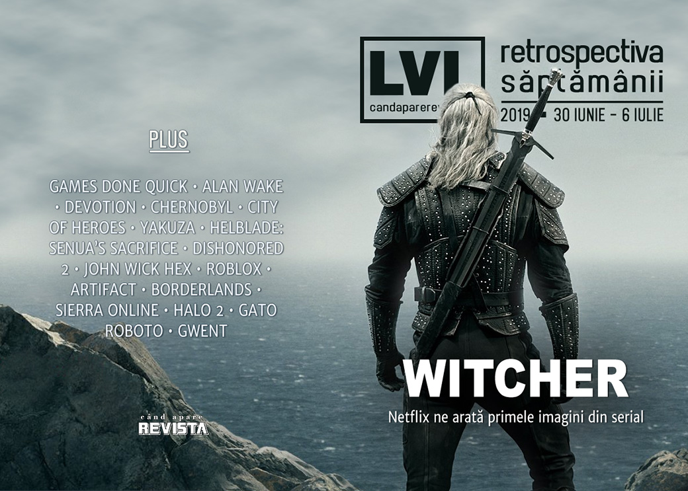

Primele imagini din Witcher ne arată un Geralt cu o singură sabie (ca toată lumea), Franța încearcă să ademenească devii din UK după Brexit, Nvidia lansează o nouă serie de plăci video pentru a putea concura cu AMD, City of Heroes prosperează după moarte, CEO-ul Paradox ne explică de 30% e un comision prea mare pentru Steam, iar Epic plusează la capitolul exclusivități oferindu-se să suporte restiturile de bani către clienții nemulțumiți.

Linkuri rapide:

* [Știri](#ştiri)
* [Articole (critică, dev, design)](#articole-critică-dev-design)
* [Anunţuri şi lansări de jocuri](#anunţuri-şi-lansări-de-jocuri)
* [Prăvălii de jocuri](#prăvălii-de-jocuri)

## Știri

* Ediția de vară a Games Done Quick s-a încheiat pe 30 iunie și a adunat o sumă record pentru cauze caritabile: 3 milioane de dolari. ([PC Gamer](https://www.pcgamer.com/summer-games-done-quick-2019-smashes-gdq-fundraising-record/), [Polygon](https://www.polygon.com/2019/6/30/20538871/summer-games-done-quick-2019-highlights-fundraising-total), [Eurogamer](https://www.eurogamer.net/articles/2019-07-01-summer-games-done-quick-raises-usd3m-for-doctors-without-borders), [GamesIndustry.biz](https://www.gamesindustry.biz/articles/2019-07-01-summer-games-done-quick-raises-usd3m-for-charity), [Gamasutra](https://www.gamasutra.com/view/news/345975/Summer_Games_Done_Quick_closes_2019_event_with_3_million_raised_for_MSF.php))
* Drepturile de distribuție pentru seria Alan Wake revin la Remedy de la Microsoft. ([VideoGamesChronicle](https://www.videogameschronicle.com/news/alan-wake-publishing-rights-revert-to-remedy/), [Eurogamer](https://www.eurogamer.net/articles/2019-07-01-alan-wake-developer-remedy-regains-publishing-rights), [GamesIndustry.biz](https://www.gamesindustry.biz/articles/2019-07-01-remedy-obtains-publishing-rights-to-alan-wake))
* Guvernul francez lansează o campanie pentru a atrage relocarea studiourilor de jocuri străine în Franța, al cărei scop nedeclarat este văzut de mulți a fi atragerea dezvoltatorilor din Marea Britanie care ar dori să rămână în UE după Brexit ([Kotaku](https://www.kotaku.co.uk/2019/07/04/dastardly-french-say-to-british-devs-voulez-vous-coucher-avec-moi), [The Guardian](https://www.theguardian.com/games/2019/jul/03/france-makes-a-post-brexit-grab-for-uks-game-developers), [PCGamesInsider.biz](http://www.pcgamesinsider.biz/news/69324/france-launches-join-the-game-push-to-attract-games-companies/), [PC Gamer](https://www.pcgamer.com/the-french-are-coming-for-the-uks-game-developers/), [GamesIndustry.biz](https://www.gamesindustry.biz/articles/2019-07-04-french-government), [Gamasutra](https://www.gamasutra.com/view/news/346090/French_government_launches_Join_the_Game_campaign_to_recruit_game_devs.php)). În replică, o asociație comercială din industria jocurilor din Marea Britanie cere guvernului britanic să ia măsuri pentru a stimula păstrarea studiourilor britanice. ([PC Gamer](https://www.pcgamer.com/uk-trade-association-asks-government-to-counter-frances-seduction-of-game-devs/))
* Publisher-ul chinez al jocului Devotion (care, dacă mai țineți minte, a fost retras de la vânzare [la începutul anului]() după o referință nepotrivită) s-a închis după ce autoritățile chineze le-au retras autorizația de funcționare citând „încălcarea unor legi”, fără să facă referire explicită la jocul respectiv. ([RPS](https://www.rockpapershotgun.com/2019/07/01/devotion-chinese-publisher-indievent-lose-business-license/), [PCGamesN](https://www.pcgamesn.com/devotion/china), [PC Gamer](https://www.pcgamer.com/the-chinese-publisher-of-horror-game-devotion-has-had-its-business-license-revoked/), [GamesIndustry.biz](https://www.gamesindustry.biz/articles/2019-07-01-chinese-government-reportedly-revokes-indievents-business-license))
* Nvidia anunță o linie „Super” a modelelor de plăci video RTX 2060 și 2070.  ([PC Gamer](https://www.pcgamer.com/nvidia-reveals-super-edition-of-its-geforce-rtx-graphics-cards-with-dates-and-prices/), [The Verge](https://www.theverge.com/2019/7/2/20677478/nvidia-rtx-super-geforce-graphics-cards-2060-2070-2080-ti-price-release-date-announce))
* Netflix publică primele imagini din serialul Witcher. ([PC Gamer](https://www.pcgamer.com/the-witcher-netflix-series-poster-official/), [VideoGamesChronicle](https://www.videogameschronicle.com/news/netflix-reveals-the-witcher-images-featuring-henry-cavill-as-geralt/), [Paste](https://www.pastemagazine.com/articles/2019/07/the-witcher-first-look-netflix.html))

## Articole (critică, dev, design)

* [How Chernobyl cast its shadow over video games](https://www.eurogamer.net/articles/2019-07-01-how-chernobyl-cast-its-shadow-over-video-games) (Eurogamer)
* [Video Game History Is More Than Just Software and Hardware](https://www.vice.com/en_us/article/neayq7/video-game-history-is-more-than-just-software-and-hardware-romchip) (Vice)
* [Stop Calling Games &#39;Metroidvania&#39;](https://kotaku.com/stop-calling-games-metroidvania-1836051152) (Kotaku)
* [When Amazon Gamifies Hell, Who&#039;s Gaming Who?](https://unwinnable.com/2019/07/03/when-amazon-gamifies-hell-whos-gaming-who/) (Unwinnable)
* [The Tangled Web of Video Game Addiction](https://www.gameinformer.com/feature/2019/07/04/the-tangled-web-of-video-game-addiction) (Games Informer)
* [After a secret server shocked the community, 100,000 fans are finally playing City of Heroes again](https://www.pcgamer.com/after-a-secret-server-shocked-the-community-100000-fans-are-finally-playing-city-of-heroes-again/) (PC Gamer)
* [The Curse Of The Yakuza Games](https://kotaku.com/the-curse-of-the-yakuza-games-1836067880) (Kotaku)
* [Video Game Characters Keep Popping Up In Porn Ads, And Publishers Might Not Be Able To Stop It](https://www.usgamer.net/articles/porn-sites-ads-copyrighted-video-game-characters-feature-interview) (USgamer)
* [Some of history&#039;s greatest pop albums are video games](https://theface.com/culture/some-of-historys-greatest-pop-albums-are-video-games) (The Face)

---

### Actualitate
* [Best Indie Games from BIG Festival 2019](https://www.shacknews.com/article/112715/best-indie-games-from-big-festival-2019) (Shacknews)
* [The Best Speedruns From SGDQ 2019](https://kotaku.com/the-best-speedruns-from-sgdq-2019-1836016398) (Kotaku)

---

### _Not-a-review_
* [Hellblade: Senua&#8217;s Sacrifice, Trauma, and the Power of Editing](https://graceinthemachine.wordpress.com/2019/07/04/hellblade-senuas-sacrifice-trauma-and-the-power-of-editing/) (Grace In The Machine)
* [Labor and Capital](https://unwinnable.com/2019/07/05/labor-and-capital/) (Unwinnable)

---

### Industrie
* [Paradox Interactive: 'The 70 / 30 revenue split is outrageous'](https://www.gamesindustry.biz/articles/2019-07-01-paradox-the-70-30-revenue-split-is-outrageous) (GamesIndustry.biz)
* [Game Streaming: Do We Truly Want This?](https://www.hardcoregamer.com/2019/07/01/game-streaming-do-we-truly-want-this/351275/) (Hardcore Gamer)
* [Why Lionsgate handed indie developer Bithell Games the John Wick IP](https://www.pcgamesinsider.biz/interviews-and-opinion/69312/why-lionsgate-handed-indie-developer-bithell-games-the-john-wick-ip/) (PCGamesInsider.biz) plus [Why John Wick Hex ended up a strategy game instead of a shooter](https://www.eurogamer.net/articles/2019-07-02-why-john-wick-hex-ended-up-a-strategy-game-instead-of-a-shooter) (Eurogamer)
* [‘Kids are not born toxic’ &#8211; How Roblox tries to keep 90 million children safe](https://www.rockpapershotgun.com/2019/07/03/kids-are-not-born-toxic-how-roblox-tries-to-keep-90-million-children-safe/) (RPS)
* [Cyberpunk’s Mike Pondsmith interview: ‘My wife guessed they had Keanu Reeves. They were heartbroken’](https://www.videogameschronicle.com/features/interviews/cyberpunks-mike-pondsmith-my-wife-guessed-they-had-keanu-reeves/) (VideoGamesChronicle)
* [Esports events are focusing on the offline side — here’s why](https://www.polygon.com/2019/7/4/18715720/esports-offline-events-tournaments-geolocation-meetups) (Polygon)
* [EA: &quot;I struggle with the perception that we're just a bunch of bad guys&quot;](https://www.gamesindustry.biz/articles/2019-07-02-ea-i-struggle-with-the-perception-that-were-just-a-bunch-of-bad-guys) (GamesIndustry.biz)
* [E3 2019: The cloud is gaming’s new frontier](https://www.gamasutra.com/blogs/RobDagwell/20190702/345886/E3_2019_The_cloud_is_gamings_new_frontier.php) (Gamasutra)
* [How Brendan Greene created the PUBG phenomenon and then moved on to something new](https://venturebeat.com/2019/07/06/brendan-greene-and-rami-ismail/) (VentureBeat)

---

### Istorie, retrospectivă
* [What Made CSGO the Biggest eSports FPS in the World?](https://www.gamespace.com/all-articles/news/what-made-csgo-the-biggest-esports-fps-in-the-world/) (GameSpace)
* [How Artifact became Valve's biggest failure](https://www.eurogamer.net/articles/2019-07-03-how-artifact-became-valves-biggest-failure) (Eurogamer)
* [The Legacy of the Borderlands Series and the Road Ahead to Borderlands 3](https://techraptor.net/content/borderlands-series-legacy-borderlands-3-future) (TechRaptor)
* [The Mortgaging of Sierra Online](https://www.filfre.net/2019/07/the-mortgaging-of-sierra-online/) (The Digital Antiquarian)

---

### Dev, making of, mecanici
* [How Zachtronics makes its games so GIFable](https://www.gamesindustry.biz/articles/2019-07-04-how-zachtronics-makes-its-games-so-gifable) (GamesIndustry.biz)
* [The time I tried to ruin Halo 2](https://www.polygon.com/features/2019/7/2/18651880/the-time-i-tried-to-ruin-halo-2-user-research) (Polygon)
* [Q&A: Exploring the design of cat-in-a-mech Metroidvania Gato Roboto](https://www.gamasutra.com/view/news/345985/Qamp_A_Exploring_the_design_of_catinamech_Metroidvania_Gato_Roboto.php) (Gamasutra)

---

### Design, world-building, artă
* [Meet the geographer who tells studios when they’re ignorant and offensive](https://www.rockpapershotgun.com/2019/07/05/kate-edwards-interview-geographer-who-warns-game-studios-theyre-offensive/) (RPS)
* [Cyberpunk 2077&#39;s Special Cover Art Is Very Nice](https://kotaku.com/cyberpunk-2077s-special-cover-art-is-very-nice-1835998487) (Kotaku)
* [Photographer Captures The Hidden Beauty Inside Stripped Down Gaming Consoles](https://kotaku.com/photographer-captures-the-hidden-beauty-inside-stripped-1836050263) (Kotaku)
* [Gwent Is Still The Best-Looking Card Game Out There](https://kotaku.com/gwent-is-still-the-best-looking-card-game-out-there-1836034111) (Kotaku)

## Anunțuri şi lansări de jocuri
* [Telltale's The Walking Dead gets new collection featuring every single episode](https://www.eurogamer.net/articles/2019-07-01-telltales-the-walking-dead-gets-new-collection-featuring-every-single-episode) (Eurogamer)

### Anunţate
* **BOUNDARY**, un shooter spațial physics-based ([Gematsu](https://gematsu.com/2019/06/project-boundary-officially-titled-boundary-launches-worldwide-in-2019))
* **Steel Circus** ([PC Gamer](https://www.pcgamer.com/steel-circus-is-a-free-to-play-future-sport-coming-to-early-access-in-august/))
* **River City Girls** ([Shacknews](https://www.shacknews.com/article/112742/river-city-girls-ready-to-throw-down-for-september-release))
* **Dinkum** ([GameSpace](https://www.gamespace.com/all-articles/news/dinkum-build-your-town-your-way/))
* **Builders of Egypt** ([PC Gamer](https://www.pcgamer.com/builders-of-egypt-looks-like-a-modern-pharaoh/))
* **Langrisser I** și **II** vin și pe PC ([RPS](https://www.rockpapershotgun.com/2019/07/04/mega-drive-srpg-classics-langrisser-i-ii-are-headed-to-pc/))

### Acum cu dată de lansare
* **Green Hell** (iese din early access): 5 august ([PC Gamer](https://www.pcgamer.com/green-hell-the-survival-sim-set-in-the-amazon-leaves-early-access-soon/))
* **Metal Wolf Chaos**: 6 august ([PC Gamer](https://www.pcgamer.com/metal-wolf-chaos-xd-will-release-in-august-according-to-microsoft-store-listing/))
* **Iratus: Lord Of The Dead** (early access): 24 iulie ([GameSpace](https://www.gamespace.com/all-articles/news/iratus-lord-of-the-dead-rises-on-steam-early-access-in-july/))

### Amânate
* **Grid**: 11 octombrie în loc de septembrie ([DSOGaming ](https://www.dsogaming.com/news/grid-2019-has-been-delayed-now-releasing-on-october-11th/))

### Lansate
* 1 iulie: **Fairytale Solitaire: Red Riding Hood** ([Steam](https://store.steampowered.com/app/1095840/Fairytale_Solitaire_Red_Riding_Hood/))
* 3 iulie: **Kubifaktorium** ([Steam](https://store.steampowered.com/app/898720/Kubifaktorium/))
* 5 iulie: **Sea of Solitude** ([Origin](https://www.origin.com/irl/en-us/store/sea-of-solitude/sea-of-solitude/))
* 4 iulie: **Stranger Things 3: The Game** ([Steam](https://store.steampowered.com/app/1097800/Stranger_Things_3_The_Game/))
* 5 iulie: **Attack on Titan 2: Final Battle** ([Steam](https://store.steampowered.com/app/601050/Attack_on_Titan_2__AOT2/))

## Prăvălii de jocuri

### Știri
* [Shenmue 3 dev offering Steam refunds if you don't want to wait a year for release](https://www.eurogamer.net/articles/2019-07-02-ys-net-will-be-offering-refunds-for-those-unhappy-about-shenmue-3s-pc-release) (Eurogamer)
* [Epic pledges to cover refunds on crowdfunded games that go EGS exclusive](https://www.pcgamer.com/epic-pledges-to-cover-refunds-on-crowdfunded-games-that-go-egs-exclusive/) (PC Gamer)
* [Developers call for players to pirate their games rather than buy from G2A](https://www.gamesindustry.biz/articles/2019-07-02-developers-call-for-players-to-pirate-their-games-rather-than-buy-from-g2a) (GamesIndustry.biz)
* [Repeatedly accused of fraud, G2A offering independent audits of its catalog](https://www.polygon.com/2019/7/5/20683026/g2a-controversy-audit-petition) (Polygon)

### Jocuri noi în catalog
* [PlayStation Plus Invites You To Look Through An Android&#039;s Eyes With Detroit: Become Human](https://www.gameinformer.com/2019/07/02/playstation-plus-invites-you-to-look-through-an-androids-eyes-with-detroit-become-human) (Games Informer)
* [Xbox Game Pass adding Middle-earth: Shadow of War, Undertale, and more in July](https://www.polygon.com/2019/7/3/20680988/xbox-game-pass-july-2019) (Polygon)

### Jocuri gratis și free weekends
* [Ninja murderfest Shadowlings is now free, mandatory](https://www.rockpapershotgun.com/2019/07/01/ninja-murderfest-shadowlings-is-now-free-mandatory/) (RPS)
* [Unavowed developer releases secret game jam experiment](https://www.pcgamer.com/unavowed-developer-releases-secret-game-jam-experiment/) (PC Gamer)
* [Overcooked is free on the Epic Games Store for a week](https://www.pcgamer.com/overcooked-is-free-on-the-epic-games-store-for-a-week/) (PC Gamer)

### Reduceri și promoții
* [Ubisoft's summer sale is live, including The Division 2 and Anno 1800](https://www.pcgamer.com/ubisofts-summer-sale-is-live-including-the-division-2-and-anno-1800/) (PC Gamer)
* [Cultist Simulator, Into the Breach and Shovel Knight are all reduced in the Humble DRM-Freedom sale](https://www.eurogamer.net/articles/2019-07-03-cultist-simulator-into-the-breach-and-shovel-knight-are-all-reduced-in-the-humble-drm-freedom-sale) (Eurogamer)
* [Best PC gaming deals of the week &#8211; 5th July 2019](https://www.rockpapershotgun.com/2019/07/05/best-pc-gaming-deals-of-the-week-5th-july-2019/) (RPS)
* [Weekend PC Download Deals for July 5: Steam Summer Sale redux](https://www.shacknews.com/article/112754/weekend-pc-download-deals-for-july-5-steam-summer-sale-redux) (Shacknews)
* [Weekend Console Download Deals for July 5: New monthly freebies](https://www.shacknews.com/article/112753/weekend-console-download-deals-for-july-5-new-monthly-freebies) (Shacknews)

---

{}
**Retrospectiva săptămânii** este rubrica duminicală în care trecem în revistă evenimentele săptămânii de pe frontul de gaming: știri şi articole (scrise de alții, bineînțeles, că e mai ușor aşa), industrie, lansări, oferte de jocuri, toate numai de savurat la cafeaua de duminică dimineața.

De asemenea, rubrica e deschisă oricui vrea și poate contribui. Dacă ai citit vreun articol sau vreo știre interesantă și crezi că merită incluse în retrospectiva săptămânii, te așteptăm pe forum pe unul dintre topicurile dedicate: [Știri](https://forum.candaparerevista.ro/viewtopic.php?f=4&t=46), [Articole](https://forum.candaparerevista.ro/viewtopic.php?f=4&t=206), [Gaming România](https://forum.candaparerevista.ro/viewtopic.php?f=4&t=1622)].
{}
