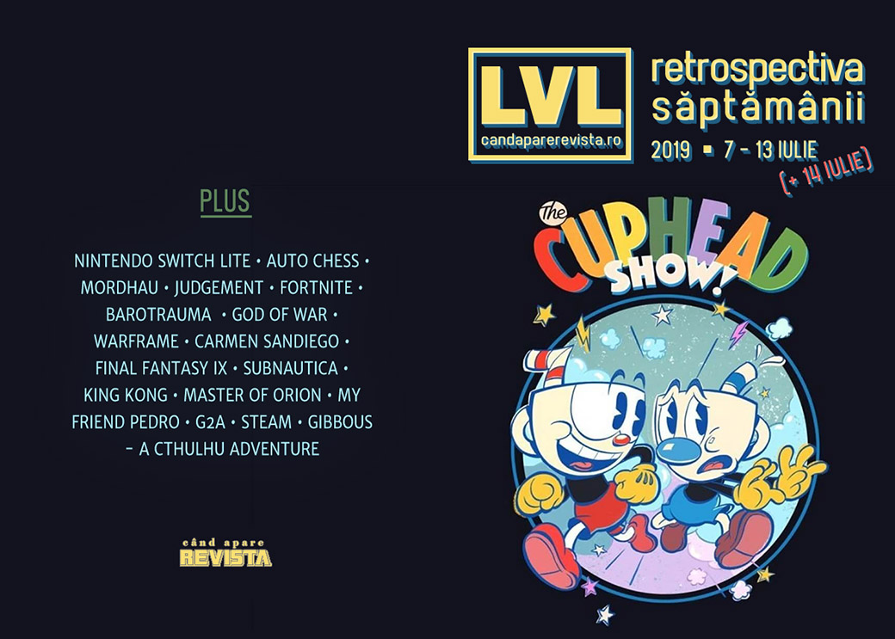

Cuphead devine un serial animat adevărat, Nintendo lansează o versiune și mai portabilă a Switch-ului și, într-o lovitură de teatru total așteptată, jocul Ion Maiden își schimbă numele, scandalul G2A are încă ecouri iar Gibbous - A Cthulhu Adventure are dată de lansare.

Linkuri rapide:

* [Știri](#știri)
* [Articole (critică, dev, design)](#articole-critică-dev-design)
* [Made în România](#made-în-românia)
* [Anunţuri şi lansări de jocuri](#anunțuri-și-lansări-de-jocuri)
* [Prăvălii de jocuri](#prăvălii-de-jocuri)

## Știri

* În ceea ce este probabil cea mai previzibilă tranziție cu putință, Cuphead devine un serial animat produs de Netflix. ([Ars Technica](https://arstechnica.com/gaming/2019/07/the-cartoon-like-video-game-cuphead-is-becoming-a-netflix-animated-series), [Eurogamer](https://www.eurogamer.net/articles/2019-07-09-netflix-announces-cuphead-cartoon-series))
* Nintendo anunță o nouă variantă de Switch, ce va putea fi folosit doar ca dispozitiv portabil - Switch Lite ([Eurogamer](https://www.eurogamer.net/articles/2019-07-10-nintendo-announces-portable-only-switch-lite-arriving-september), [Ars Technica](https://arstechnica.com/gaming/2019/07/nintendo-confirms-portable-only-200-switch-lite-for-september/), [Polygon](https://www.polygon.com/2019/7/10/18693262/nintendo-switch-lite-price-release-date-features), [VideoGamesChronicle](https://www.videogameschronicle.com/news/nintendo-switch-lite-revealed-is-handheld-only/), [IGN](https://www.ign.com/articles/2019/07/12/9-nintendo-switch-lite-questions-answered-by-nintendo)). Iar, dacă zvonurile sunt adevărate, ne pregătește și un upgrade pentru Switch-ul normal. ([Ars Technica](https://arstechnica.com/gaming/2019/07/evidence-points-to-another-switch-hardware-revision-on-the-horizon/), [VideoGamesChronicle](https://www.videogameschronicle.com/news/original-switch-in-line-for-updated-cpu-and-storage/))
* 3D Realms decide să încheie [procesul cu formația Iron Maiden]() și să-și redenumească jocul din Ion Maiden în Ion Fury. ([Destructoid](https://www.destructoid.com/iron-maiden-wins-as-3d-realms-renames-its-upcoming-shooter-ion-fury-560358.phtml), [PC Gamer](https://www.pcgamer.com/ion-maiden-is-now-ion-fury-launching-in-august/), [Shacknews](https://www.shacknews.com/article/112835/ion-maiden-now-called-ion-fury-releases-next-month), [Eurogamer](https://www.eurogamer.net/articles/2019-07-11-promising-build-engine-retro-fps-ion-maiden-changes-name-following-iron-maiden-lawsuit))

## Articole (critică, dev, design)

* [Auto Chess proves again that it's modders who know what we really want](https://www.eurogamer.net/articles/2019-07-05-auto-chess-is-the-next-gaming-phenomenon-and-thats-weird-but-also-great) (Eurogamer)
* [Game developers, it’s time to stop listening to the fans](https://www.vg247.com/2019/07/12/game-developers-time-stop-listening-fans/) (VG247)
* [&#39;Mordhau&#39; and the Fantasy of an All-White Middle Ages](https://www.vice.com/en_us/article/8xzpeg/mordhau-and-the-fantasy-of-an-all-white-middle-ages) (Vice)
* [WTF is a Classic Game?](https://gamasutra.com/blogs/JohnNelsonRose/20190709/346238/WTF_is_a_Classic_Game.php) (Gamasutra)
* [An unbeatable poker bot offers glimpses of video game AI’s future](https://www.polygon.com/2019/7/14/20693903/unbeatable-poker-bot-ai-pluribus-facebook-carnegie-mellon-journal-science) (Polygon)
* [Facebook AI Pluribus defeats top poker professionals in 6-player Texas Hold ’em](https://arstechnica.com/science/2019/07/facebook-ai-pluribus-defeats-top-poker-professionals-in-6-player-texas-holdem/) (Ars Technica)
* [It&#039;s Becoming Impossible To Keep Up With More Than A Couple &quot;Forever&quot; Games](https://www.usgamer.net/articles/starting-screen-forever-games-apex-legends-final-fantasy-14-shadowbringers) (USgamer)
* [How &#8216;climate crisis games&#8217; could better model our problems and our future](https://www.rockpapershotgun.com/2019/07/08/how-climate-crisis-games-could-better-model-our-problems-and-our-future/) (RPS)

---

### Actualitate
* [Nintendo Switch Lite is destined for success, but Switch Pro is the important one](https://www.gamesindustry.biz/articles/2019-07-11-opinion-nintendo-switch-lite-is-destined-for-success-but-switch-pro-is-the-important-one) (GamesIndustry.biz)

---

### _Not-a-review_
* [Real Justice](http://www.bulletpointsmonthly.com/2019/07/10/real-justice/) (Bullet Points Monthly)
* [Putting the &quot;U&quot; In Trauma](https://unwinnable.com/2019/07/12/putting-the-u-in-trauma/) (Unwinnable)
* [We Must Be Better](http://www.firstpersonscholar.com/we-must-be-better/) (First Person Scholar)

---

### Industrie
* [The industry is still &quot;developing games in a bubble&quot;](https://www.gamesindustry.biz/articles/2019-07-12-the-industry-is-still-developing-games-in-a-bubble) (GamesIndustry.biz)
* [Nintendo reaffirms its toy-maker identity](https://www.gamesindustry.biz/articles/2019-07-12-nintendo-reaffirms-its-toy-maker-identity-opinion) (GamesIndustry.biz)
* [Hello Games: Positive No Man's Sky stories &quot;don't do as well -- and that's a problem&quot;](https://www.gamesindustry.biz/articles/2019-07-09-hello-games-positive-no-mans-sky-stores-dont-do-as-well-and-thats-a-problem) (GamesIndustry.biz)
* [&quot;Xbox Game Pass is the first time subscription is fair for developers&quot;](https://www.gamesindustry.biz/articles/2019-07-08-xbox-game-pass-is-the-first-time-subscription-is-fair-for-developers) (GamesIndustry.biz)

---

### Istorie, retrospectivă
* [Worldwide Infamy: The Birth Of Carmen Sandiego](https://www.gameinformer.com/classic/2019/07/07/worldwide-infamy-the-birth-of-carmen-sandiego) (Games Informer)
* [15 years later, Warframe is finally close to realizing its original vision](https://www.pcgamer.com/15-years-later-warframe-is-finally-close-to-realizing-its-original-vision/) (PC Gamer)
* [Final Fantasy IX Retrospective: The Final Fantasy&#39;s Final Fantasy](https://kotaku.com/final-fantasy-ix-retrospective-the-final-fantasys-fina-1836310854) (Kotaku)
* [Peter Jackson’s King Kong was the most innovative game of its console generation](https://www.polygon.com/2019/7/8/20680953/king-kong-xbox-360-game-rayman-michel-ancel) (Polygon)
* [How a Zelda Clone Outshone Actual Zelda: The Case for a Forgotten PS One Gem](https://medium.com/mammon-machine-zeal/how-a-zelda-clone-outshone-actual-zelda-the-case-for-a-forgotten-ps-one-gem-3c49eaf04f8a) (Medium)
* [The Game Archaeologist: Ironman modes and elective permadeath](https://massivelyop.com/2019/07/06/the-game-archaeologist-ironman-modes-and-elective-permadeath/) (Massively OP)
* [Per Aspera Ad Astra](http://romchip.org/index.php/romchip-journal/article/view/58) (ROMchip)
* [The History of Games Could Be a History of What Play Felt Like](http://romchip.org/index.php/romchip-journal/article/view/78) (ROMchip)
* [History Lesson: 9 great game ideas that never took off](https://www.videogameschronicle.com/features/great-game-ideas-that-never-took-off/) (VideoGamesChronicle)
* [How N64's Turok: Dinosaur Hunter was years ahead of its time](https://www.eurogamer.net/articles/digitalfoundry-2019-retro-turok-dinosaur-hunter-n64-fps-ahead-of-its-time) (Eurogamer)

---

### Dev, making of, mecanici
* [How developers build the tutorials you skip](https://www.pcgamer.com/how-developers-build-the-tutorials-you-skip/) (PC Gamer)
* [The secret to Warframe's ship-to-ship space combat is that the ship doesn't actually move](https://www.pcgamer.com/the-secret-to-warframes-ship-to-ship-space-combat-is-that-the-ship-doesnt-actually-move/) (PC Gamer)
* [More Than Meets the Eye: The Secrets of Dynamic Difficulty Adjustment](https://remptongames.com/2019/07/13/more-than-meets-the-eye-the-secrets-of-dynamic-difficulty-adjustment/) (Rempton Games)
* [Behind the Curtain: Uncovering Secret Hidden Game Mechanics](https://remptongames.com/2019/07/06/behind-the-curtain-uncovering-secret-hidden-game-mechanics/) (Rempton Games)
* [Video: Inside the design of Subnautica](https://www.gamasutra.com/view/news/346387/Video_Inside_the_design_of_Subnautica.php) (Gamasutra)
* [The Psychology Of Fortnite&#8217;s Battle Pass](http://www.psychologyofgames.com/2019/07/the-psychology-of-fortnites-battle-pass/) (The Psychology of Video Games)
* [My Friend Pedro 's journey from Flash cult hit to indie success](https://www.gamasutra.com/view/news/346137/My_Friend_Pedros_journey_from_Flash_cult_hit_to_indie_success.php) (Gamasutra)

---

### Design, world-building, artă
* [Exploring the afterlife of historical sites in video games](https://www.eurogamer.net/articles/2019-07-07-exploring-the-afterlife-of-historical-sites-in-video-games) (Eurogamer)
* [Game Box Art Critique July: Marvel Ultimate Alliance 3: The Black Order, Fire Emblem: Three Houses, Wolfenstein: Youngblood](https://www.videogamer.com/features/game-box-art-critique-july-marvel-ultimate-alliance-3-the-black-order-fire-emblem-three-houses-wolfenstein-youngblood) (VideoGamer)

## Made în România

* **Gibbous - A Cthulhu Adventure** are acum dată de lansare (7 august) și primește atenție și într-o știre de la [PC Gamer](https://www.pcgamer.com/gibbous-is-a-lovecraft-horror-adventure-in-the-style-of-a-classic-disney-film/). ([Go4Games](https://jocuri.go4it.ro/stiri-si-articole/adventure-quest/jocul-romanesc-gibbous-a-cthulhu-adventure-are-data-de-lansare-18232959))

## Anunțuri și lansări de jocuri
* [A free-to-play Lord of the Rings MMO is being developed by Amazon](https://www.pcgamer.com/a-free-to-play-lord-of-the-rings-mmo-is-being-developed-by-amazon/) (PC Gamer)

### Anunţate
* **Turok: Escape from Lost Valley** ([PC Gamer](https://www.pcgamer.com/theres-a-new-turok-game-releasing-this-month-but-its-not-what-youre-expecting/))
* **Disintegration**, un shooter SF de la unul dintre creatorii lui Halo ([Eurogamer](https://www.eurogamer.net/articles/2019-07-11-halo-co-creator-announces-sci-fi-shooter-disintegration))
* **Vane** vine și pe PC ([Destructoid](https://www.destructoid.com/abstract-puzzler-vane-coming-to-pc-later-this-month-560266.phtml))

### Acum cu dată de lansare
* **Gloomhaven** (early access): 17 iulie  ([Eurogamer](https://www.eurogamer.net/articles/2019-07-09-acclaimed-board-game-dungeon-crawler-gloomhavens-digital-adaptation-enters-steam-early-access-next-week))
* **Biotope**: 23 iulie ([DSOGaming ](https://www.dsogaming.com/news/biotope-promises-to-be-the-most-realistic-aquarium-simulator-coming-to-steam-early-access-on-july-23rd/))
* **Morphies Law: Remorphed**: 30 iulie ([RPS](https://www.rockpapershotgun.com/2019/07/11/morphies-law-remorphed-expands-onto-pc-this-month/))
* **Stranded Sails**: 4 octombrie ([Eurogamer](https://www.eurogamer.net/articles/2019-07-11-adorable-tropical-island-survival-and-farming-adventure-stranded-sails-is-out-in-october))
* **Greedfall**: 10 octombrie ([PC Gamer](https://www.pcgamer.com/feast-your-eyes-on-the-greedfall-release-date-trailer/))

### Amânate
* **Psychonauts 2** apare în 2020 în loc de 2019 ([DSOGaming ](https://www.dsogaming.com/news/psychonauts-2-has-been-delayed-until-2020/))

### Lansate
* 10 iulie: **SolSeraph** ([Steam](https://store.steampowered.com/app/834800/SolSeraph/))
* 10 iulie: **Godhood** (early access) ([Steam](https://store.steampowered.com/app/917150/Godhood/))
* 10 iulie: **Goat of Duty** ([Steam](https://store.steampowered.com/app/555000/Goat_of_Duty/))
* 11 iulie: **Blazing Chrome** ([Steam](https://store.steampowered.com/app/609110/Blazing_Chrome/))
* 11 iulie: **Earth Defense Force 5** ([Steam](https://store.steampowered.com/app/1007040/EARTH_DEFENSE_FORCE_5/))
* 11 iulie: **Eagle Island** ([Steam](https://store.steampowered.com/app/681110/Eagle_Island/))
* 11 iulie: **Field of Glory: Empires** ([Steam](https://store.steampowered.com/app/1011390/Field_of_Glory_Empires/))
* 11 iulie: **Tiny Metal: Full Metal Rumble** ([Steam](https://store.steampowered.com/app/1102100/TINY_METAL_FULL_METAL_RUMBLE/))

## Prăvălii de jocuri

### Știri
* [Shady Market G2A Offers To Pay Journalists To Run Pre-Written Article Defending Them](https://kotaku.com/shady-market-g2a-offers-to-pay-journalists-to-run-pre-w-1836186979) (Kotaku)
* [Steam's new 'Interactive Recommender' uses machine learning, not tags or reviews, to tell you what to play](https://www.pcgamer.com/steams-new-interactive-recommender-uses-machine-learning-not-tags-or-reviews-to-tell-you-what-to-play/) (PC Gamer)
* [Steam&#39;s New Customizable AI Tool Scans Your Playtime And Tells You What To Buy Next](https://kotaku.com/steams-new-customizable-ai-tool-scans-your-playtime-and-1836284275) (Kotaku)

### Articole
* [This Year&#39;s Steam Summer Sale Was A Mess, Game Developers Say](https://kotaku.com/this-years-steam-summer-sale-was-a-mess-game-developer-1836215859) (Kotaku)
* [How does the games industry get rid of G2A? Eliminate game keys altogether](https://www.pcgamer.com/how-does-the-games-industry-get-rid-of-g2a-eliminate-game-keys-altogether/) (PC Gamer)
* [G2A's recent comments and business practices put itself at odds with developers, media](https://gamedaily.biz/article/1032/g2as-recent-comments-and-business-practices-put-itself-at-odds-with-developers-media) (GameDaily.biz)
* [Opinion: Epic Games is so aggressive because it wants the PC games market to itself](https://www.vg247.com/2019/07/09/epic-games-wants-pc-games-market-to-itself/) (VG247)
* [The Impact of Key Resellers on the Game Industry](https://www.gamasutra.com/blogs/JoshBycer/20190711/346419/The_Impact_of_Key_Resellers_on_the_Game_Industry.php) (Gamasutra)
* [We'd rather you pirate our games, say indies](https://www.bbc.com/news/technology-48908726) (BBC)

### Jocuri gratis și free weekends
* [Age of Wonders 3 is free on Steam, gets you 10 percent off Age of Wonders: Planetfall](https://www.pcgamer.com/age-of-wonders-3-is-free-on-steam-gets-you-10-percent-off-age-of-wonders-planetfall/) (PC Gamer)
* [Torchlight is free on the Epic Games Store, Limbo will be next](https://www.pcgamer.com/torchlight-is-free-on-the-epic-games-store-limbo-will-be-next/) (PC Gamer)

### Reduceri și promoții
* [Get up to 70% off in the July Savings sale on the PlayStation Store](https://www.eurogamer.net/articles/2019-07-10-get-up-to-70-percent-off-in-the-july-savings-sale-on-the-playstation-store) (Eurogamer)
* [GOG Baguette Days offers sweet deals on games made in France](https://www.shacknews.com/article/112772/gog-baguette-days-offers-sweet-deals-on-games-made-in-france) (Shacknews)
* [Weekend PC Download Deals for July 12: Free Age of Wonders 3](https://www.shacknews.com/article/112863/weekend-pc-download-deals-for-july-12-free-age-of-wonders-3) (Shacknews)
* [Weekend Console Download Deals for July 12: Retro madness](https://www.shacknews.com/article/112861/weekend-console-download-deals-for-july-12-retro-madness) (Shacknews)
* [Best PC gaming deals of the week &#8211; 12th July 2019](https://www.rockpapershotgun.com/2019/07/12/best-pc-gaming-deals-of-the-week-12th-july-2019/) (RPS)
* [Planet Coaster is on sale for just $11.24; more on Humble Store](https://www.pcinvasion.com/planet-coaster-is-on-sale-for-just-11-24-more-on-humble-store/) (PC Invasion)

---

{}
**Retrospectiva săptămânii** este rubrica duminicală în care trecem în revistă evenimentele săptămânii de pe frontul de gaming: știri şi articole (scrise de alții, bineînțeles, că e mai ușor aşa), industrie, lansări, oferte de jocuri, toate numai de savurat la cafeaua de duminică dimineața.

De asemenea, rubrica e deschisă oricui vrea și poate contribui. Dacă ai citit vreun articol sau vreo știre interesantă și crezi că merită incluse în retrospectiva săptămânii, te așteptăm pe forum pe unul dintre topicurile dedicate: [Știri](https://forum.candaparerevista.ro/viewtopic.php?f=4&t=46), [Articole](https://forum.candaparerevista.ro/viewtopic.php?f=4&t=206), [Gaming România](https://forum.candaparerevista.ro/viewtopic.php?f=4&t=1622)].
{}
