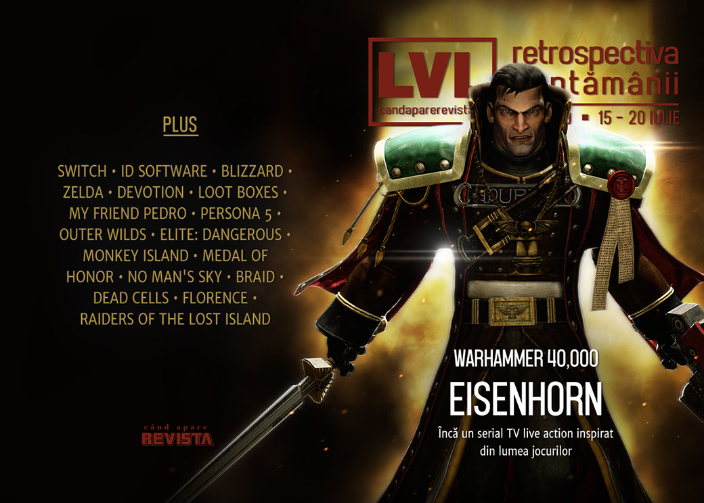

În săptămâna în care aniversăm 50 de ani de la primul pas pe Lună, primim un serial Warhammer 40,000, dar și plecări importante de la oameni cu vechime din industrie - Tim Willits de la id Software și Frank Pearce de la Blizzard. Mai avem și o listă lungă cu articole despre efectele benefice ale jocurilor, dar și pericolele lor, iar Raiders Of The Lost Island are dată de lansare (și e curând).

Linkuri rapide:

* [Știri](#știri)
* [Articole (critică, dev, design)](#articole-critică-dev-design)
* [Made în România](#made-în-românia)
* [Anunţuri şi lansări de jocuri](#anunțuri-și-lansări-de-jocuri)
* [Prăvălii de jocuri](#prăvălii-de-jocuri)

## Știri

* E rândul universului Warhammer 40K pentru o ecranizare - un serial TV _live action_ bazat pe personajul și seria de cărți Eisenhorn. ([Polygon](https://www.polygon.com/tv/2019/7/17/20698345/warhammer-40000-tv-show-live-action), [Gizmodo](https://io9.gizmodo.com/the-creator-of-man-in-the-high-castle-is-bring-warhamme-1836457904), [PC Gamer](https://www.pcgamer.com/a-warhammer-40000-live-action-television-series-is-in-the-works/), [GamesIndustry.biz](https://www.gamesindustry.biz/articles/2019-07-17-the-man-in-the-high-castle-creator-to-produce-tv-series-based-on-warhammer-40-000), [PCGamesN](https://www.pcgamesn.com/warhammer-40k-eisenhorn-tv-show))
* După ce a anunțat Switch Lite, Nintendo îmbunătățește bateria și la originalul Switch. ([Destructoid](https://www.destructoid.com/nintendo-officially-announces-improved-base-switch-model-561058.phtml), [Eurogamer](https://www.eurogamer.net/articles/2019-07-17-new-nintendo-switch-version-will-have-longer-battery-life), [Kotaku](https://kotaku.com/nintendo-releasing-new-switch-model-with-a-better-batte-1836444569))
* PC devine segmentul care generează cele mai mari venituri pentru Ubisoft, depășind PlayStation 4. ([PC Gamer](https://www.pcgamer.com/pc-passes-ps4-to-become-ubisofts-top-revenue-generator/), [DSOGaming ](https://www.dsogaming.com/news/pc-is-the-most-profitable-platform-for-ubisoft-the-division-2-is-industrys-biggest-hit-in-2019/), [PCGamesInsider.biz](http://www.pcgamesinsider.biz/news/69381/anno-1800-helped-drive-pc-to-be-ubisofts-biggest-cash-cow-for-last-quarter/), [Gamasutra](https://www.gamasutra.com/view/news/346887/PC_overtakes_PlayStation_4_as_Ubisofts_most_lucrative_platform_this_quarter.php))
* Tim Willits, directorul id Software, părăsește compania după 24 de ani. ([Eurogamer](https://www.eurogamer.net/articles/2019-07-18-tim-willits-will-leave-id-software-this-month-after-24-years-there), [PC Gamer](https://www.pcgamer.com/tim-willits-is-leaving-id-software/), [Shacknews](https://www.shacknews.com/article/112942/tim-willits-to-leave-id-software-after-24-years-at-the-company), [VideoGamesChronicle](https://www.videogameschronicle.com/news/ids-tim-willits-to-leave-after-24-years-at-doom-developer/), [RPS](https://www.rockpapershotgun.com/2019/07/18/original-quake-and-doom-developer-tim-wilitts-to-leave-id/), [PCGamesInsider.biz](http://www.pcgamesinsider.biz/job-news/69393/id-software-studio-boss-willits-to-leave-the-doom-developer/))
* O altă plecare importantă din industrie: Frank Pearce, unul dintre angajații-fondatori ai Blizzard, a părăsit compania săptămâna aceasta. ([Ars Technica](https://arstechnica.com/gaming/2019/07/blizzards-bad-news-year-continues-with-another-co-founders-departure/), [PC Gamer](https://www.pcgamer.com/blizzard-co-founder-frank-pearce-is-retiring/), [Polygon](https://www.polygon.com/2019/7/19/20701264/blizzard-frank-pearce-quits), [Games Informer](https://www.gameinformer.com/2019/07/19/blizzard-cofounder-frank-pearce-leaves-company))
* Filmul _Detective Pikachu_ ajunge adaptarea după un joc video cu cele mai mari încasări, depășind Warcraft. ([VideoGamesChronicle](https://www.videogameschronicle.com/news/detective-pikachu-now-the-highest-grossing-video-game-film/), [GamesIndustry.biz](https://www.gamesindustry.biz/articles/2019-07-16-detective-pikachu-becomes-the-highest-grossing-video-game-movie))

## Articole (critică, dev, design)

* [How the moon landing shaped early video games](https://www.theguardian.com/games/2019/jul/18/how-the-moon-landings-inspired-a-generation-of-game-designers) (The Guardian)
* [Why are so many old games coming back? We asked developers why they chase nostalgia](https://www.rockpapershotgun.com/2019/07/15/why-are-there-so-many-old-games-coming-back/) (RPS)
* ['My son spent £3,160 in one game'](https://www.bbc.com/news/technology-48925623) (BBC)
* [No more nerds: how Dungeons & Dragons finally became cool](https://www.theguardian.com/games/2019/jul/13/no-more-nerds-how-dungeons-dragons-became-cool-stranger-things-game-of-thrones) (The Guardian)
* [The psychological reasons certain games feel like coming home](https://www.polygon.com/2019/7/16/20694585/zelda-breath-of-the-wild-wind-waker-travel-nostalgia) (Polygon)
* [Gardening games are blossoming in turbulent times](https://www.theverge.com/2019/7/16/20696253/gardening-games-harvest-moon-animal-crossing-ooblets-cultivation) (The Verge)
* [China forced one horror game publisher to close, but the whole region felt it](https://www.rockpapershotgun.com/2019/07/16/china-forced-one-horror-game-publisher-to-close-but-the-whole-region-felt-it/) (RPS)
* [Losing yourself in virtual worlds can have good as well as negative effects](https://arstechnica.com/gaming/2019/07/beyond-the-moral-panic-video-games-can-help-us-deal-with-grief-depression/) (Ars Technica)
* [How Japanese RPGs Inspired A New Generation Of Fantasy Authors](https://kotaku.com/how-japanese-rpgs-inspired-a-new-generation-of-fantasy-1836426975) (Kotaku)
* [The Glorious, Profitable, Inescapable Art of Addiction](http://jeff-vogel.blogspot.com/2019/07/the-glorious-profitable-inescapable-art.html) (The Bottom Feeder)
* [Making Learning Fun: How Games Can be Used for Education](https://remptongames.com/2019/07/20/making-learning-fun-how-games-can-be-used-for-education/) (Rempton Games)
* [How One Modder Builds Handheld Custom Consoles Through the Magic of Community and Self-Teaching](https://www.usgamer.net/articles/how-one-modder-builds-handheld-custom-consoles-through-the-magic-of-community-and-self-teaching) (USgamer)
* [Gamification has the power to fight diseases &#8212; and exploit workers](https://venturebeat.com/2019/07/19/gamification-has-the-power-to-fight-diseases-and-exploit-workers/) (VentureBeat)
* [Designers Are Imagining Video Games Without Guns](https://onezero.medium.com/its-time-to-take-the-guns-out-of-video-games-10c7e01869e5) (Medium/OneZero)

---

### Actualitate
* [Warhammer 40K gets an Eisenhorn show, and it&#039;s about damn time!](https://www.pcinvasion.com/warhammer-40k-gets-an-eisenhorn-show-and-its-about-damn-time/) (PC Invasion)

---

### _Not-a-review_
* [Fuck-&#039;em-Up](https://unwinnable.com/2019/07/15/fuck-em-up/) (Unwinnable)
* [Life is Strange: Finding Hope in The Dark Room](https://intothespine.com/2019/07/15/life-is-strange-dark-room/) (Into the Spine)
* [Spiritual Heritage](http://www.firstpersonscholar.com/spiritual-heritage/) (First Person Scholar)
* [Dota Underlords&#39; Meta Is In An Awkward Spot](https://kotaku.com/dota-underlords-meta-is-in-an-awkward-spot-1836467713) (Kotaku)
* [At the end of a five-month Elite Dangerous expedition, I looked into the Abyss](https://www.rockpapershotgun.com/2019/07/18/elite-dangerous-expedition-diary-part-3/) (RPS)
* [A Joyous Insignificance Among the Stars](https://unwinnable.com/2019/07/18/a-joyous-insignificance-among-the-stars/) (Unwinnable)
* [A Plague Tale: Innocence Doesn't Live Up to the Potential of its Medieval Setting](https://www.kotaku.co.uk/2019/07/19/a-plague-tale-innocence-doesnt-live-up-to-the-potential-of-its-medieval-setting) (Kotaku)

---

### Istorie, retrospectivă
* [Why It&#039;s Time For A New Medal Of Honor](https://www.gameinformer.com/2019/07/16/why-its-time-for-a-new-medal-of-honor) (Games Informer)
* [Rediscovering the childhood delight of The Curse of Monkey Island](https://www.pcgamer.com/rediscovering-the-childhood-delight-of-the-curse-of-monkey-island/) (PC Gamer)
* [Looking At How Far No Man&#039;s Sky Has Come](https://www.gameinformer.com/2019/07/15/looking-at-how-far-no-mans-sky-has-come) (Games Informer)
* [Braid Behind the Scenes](http://gamedesignaspect.blogspot.com/2019/07/braid-behind-scenes.html) (Game Design Aspect)
* [Chief Gates Comes to Oakhurst: A Cop Drama](https://www.filfre.net/2019/07/chief-gates-comes-to-oakhurst-a-cop-drama/) (The Digital Antiquarian)
* [With ‘Sky,’ thatgamecompany’s Jenova Chen wants to fix what’s broken with games](https://www.latimes.com/entertainment/herocomplex/la-et-hc-sky-thatgamecompany-20190709-story.html) (Los Angeles Times)

---

### Dev, making of, mecanici
* [Designing experimental game Cultist Simulator  for commercial success](http://www.gamasutra.com/view/news/346722/Designing_experimental_game_Cultist_Simulator_for_commercial_success.php) (Gamasutra)
* [War Stories: Designing Dead Cells was a marriage of man and machine](https://arstechnica.com/gaming/2019/07/war-stories-designing-dead-cells-was-a-marriage-of-man-and-machine/) (Ars Technica)
* [Video: Letting Go - The  Florence  postmortem](https://www.gamasutra.com/view/news/346940/Video_Letting_Go__The_Florence_postmortem.php) (Gamasutra)

---

### Design, world-building, artă
* [Fashion in Games: Why It Matters](https://www.gamasutra.com/blogs/VictoriaTran/20190714/340906/Fashion_in_Games_Why_It_Matters.php) (Gamasutra)
* [The Tracks Lead Off In This Direction](https://kotaku.com/the-tracks-lead-off-in-this-direction-1836432543) (Kotaku)

## Made în România
* **Raiders Of The Lost Island** are acum dată de lansare în early access: 1 august. ([Steam Community](https://steamcommunity.com/games/867980/announcements/detail/1603762500078041530))

## Anunțuri și lansări de jocuri
### Anunţate
* **Tetris Effect** vine și pe PC ([Eurogamer](https://www.eurogamer.net/articles/2019-07-16-tetris-effect-headed-to-pc-next-week-via-epic-games-store))
* **Stone Story RPG** aduce o interpretare nouă graficii ASCII ([PC Gamer](https://www.pcgamer.com/stone-story-rpg-finds-a-new-way-to-craft-a-world-out-of-ascii-art/))
* **Super Monkey Ball: Banana Blitz** ([Polygon](https://www.polygon.com/2019/7/16/20696309/super-monkey-ball-pc-ps4-nintendo-switch-banana-blitz-remake-release-date))
* **Hundred Days**, un tycoon despre făcut vin ([Destructoid](https://www.destructoid.com/hundred-days-is-a-video-game-about-making-wine-560817.phtml))
* **Path of Titans**, un MMO cu dinozauri ([DSOGaming ](https://www.dsogaming.com/news/path-of-titans-is-a-new-mmo-dinosaur-survival-game-will-offer-modding-tools-will-support-up-to-200-players/))
* **Plants vs. Zombies 3** ([The Verge](https://www.theverge.com/2019/7/18/20699135/plants-vs-zombies-3-announced-alpha-android-google-play))

### Acum cu dată de lansare
* **Raiders Of The Lost Island** (early access): 1 august ([Steam Community](https://steamcommunity.com/games/867980/announcements/detail/1603762500078041530))
* **Rebel Galaxy Outlaw**: 13 august ([PC Gamer](https://www.pcgamer.com/rebel-galaxy-outlaw-comes-out-next-month-on-the-epic-games-store/))
* **Everreach: Project Eden**: septembrie ([Shacknews](https://www.shacknews.com/article/112878/indie-sci-fi-rpg-everreach-project-eden-set-for-september))
* **Trails Of Cold Steel III**: 29 octombrie ([GameSpace](https://www.gamespace.com/all-articles/news/trails-of-cold-steel-iii-takes-the-long-road-releases-october-2019/))

### Lansate
* 16 iulie: **Killsquad** (early access) ([Steam](https://store.steampowered.com/app/910490/Killsquad/))
* 16 iulie: **Summer Catchers** ([Steam](https://store.steampowered.com/app/908050/Summer_Catchers/))
* 16 iulie: **Lost Orbit: Terminal Velocity** ([Steam](https://store.steampowered.com/app/372320/LOST_ORBIT_Terminal_Velocity/))
* 16 iulie: **Nightmare Reaper** (early access) ([Steam](https://store.steampowered.com/app/1051690/Nightmare_Reaper/))
* 16 iulie: **DUSTNET** ([Steam](https://store.steampowered.com/app/987290/DUSTNET/))
* 17 iulie: **Night Call** ([Steam](https://store.steampowered.com/app/680380/Night_Call/), [gog.com](https://www.gog.com/game/night_call))
* 17 iulie: **Gloomhaven** (early access) ([Steam](https://store.steampowered.com/app/780290/Gloomhaven/))
* 18 iulie: **Etherborn** ([Steam](https://store.steampowered.com/app/812160/Etherborn/), [gog.com](https://www.gog.com/game/etherborn))
* 18 iulie: **Tidal Tribe** ([Steam](https://store.steampowered.com/app/1043430/Tidal_Tribe/))
* 18 iulie: **Fate Hunters** (early access) ([Steam](https://store.steampowered.com/app/920680/Fate_Hunters/))
* 18 iulie: **Warlocks 2: God Slayers** ([Steam](https://store.steampowered.com/app/628330/Warlocks_2_God_Slayers/), [gog.com](https://www.gog.com/news/release_warlocks_2_god_slayers))
* 19 iulie: **Nowhere Prophet** ([Steam](https://store.steampowered.com/app/681730/Nowhere_Prophet/), [gog.com](https://www.gog.com/game/nowhere_prophet))
* 19 iulie: **Marvel Ultimate Alliance 3** (Switch) ([Nintendo Store](https://www.nintendo.com/games/detail/marvel-ultimate-alliance-3-the-black-order-switch/))

## Prăvălii de jocuri

### Știri
* [Here’s every game coming to Ubisoft’s UPlay Plus, including Watch Dogs: Legion and every Assassin’s Creed](https://www.theverge.com/2019/7/16/20696078/ubisoft-uplay-game-list-watch-dogs-legion-assassins-creed-far-cry-tom-clancy-pc) (The Verge)

### Articole
* [There are over 100 games on the Epic Store and there's still no way to sort them](https://www.pcgamer.com/there-are-over-100-games-on-the-epic-store-and-theres-still-no-way-to-sort-them/) (PC Gamer)
* [A look at the current state of the Epic Games Store launcher](https://www.pcinvasion.com/a-look-at-the-current-state-of-the-epic-games-store-launcher/) (PC Invasion)
* [Shadow Offers More Than Just Game Streaming](https://www.hardcoregamer.com/2019/07/17/shadow-offers-more-than-just-game-streaming/352450/) (Hardcore Gamer)
* [Indies on Steam are betting on discoverability](https://www.gamesindustry.biz/articles/2019-07-19-steam-indies-and-betting-on-discoverability) (GamesIndustry.biz)

### Jocuri noi în catalog
* [Metal Gear Solid V: The Phantom Pain, Resident Evil 4, And More Coming To Xbox Game Pass In July](https://www.gameinformer.com/2019/07/16/metal-gear-solid-v-the-phantom-pain-resident-evil-4-and-more-coming-to-xbox-game-pass-in) (Games Informer)

### Jocuri gratis și free weekends
* [Okami meets Hyper Light Drifter in gorgeous free adventure Atma](https://www.pcgamer.com/okami-meets-hyper-light-drifter-in-gorgeous-free-adventure-atma/) (PC Gamer)
* [Limbo is free for keepsies on the Epic Games Store right now](https://www.rockpapershotgun.com/2019/07/18/limbo-free-on-epic-games-store/) (RPS)
* [Free game Sacrifights lets you summon demons so you can beat them up for offal](https://www.pcgamer.com/free-game-sacrifights-lets-you-summon-demons-so-you-can-beat-them-up-for-offal/) (PC Gamer)

### Reduceri și promoții
* [Prison Architect, Nex Machina and Shantae: Half-Genie Hero headline the Humble Very Positive Bundle 3](https://www.eurogamer.net/articles/2019-07-17-prison-architect-nex-machina-and-shantae-half-genie-hero-headline-the-humble-very-positive-bundle-3) (Eurogamer)
* [Xbox Super Games Sale includes Rage 2 & Forza Horizon 4](https://www.shacknews.com/article/112929/xbox-super-games-sale-includes-rage-2-forza-horizon-4) (Shacknews)
* [Merge Games celebrates 10th anniversary with $4 million 'warchest' for new games](https://gamedaily.biz/article/1048/merge-games-celebrates-10th-anniversary-with-4-million-warchest-for-new-games) (GameDaily.biz)
* [Green Man Gaming Summer Sale gets underway with 55% off Monster Hunter World](https://www.eurogamer.net/articles/2019-07-18-green-man-gaming-summer-sale-gets-underway-with-50-percent-off-monster-hunter-world) (Eurogamer)
* [Weekend Console Download Deals for July 19: Xbox Super Game Sale](https://www.shacknews.com/article/112965/weekend-console-download-deals-for-july-19-xbox-super-game-sale) (Shacknews)
* [Weekend PC Download Deals for July 19: Steam Space Exploration Sale](https://www.shacknews.com/article/112966/weekend-pc-download-deals-for-july-19-steam-space-exploration-sale) (Shacknews)

---

{}
**Retrospectiva săptămânii** este rubrica duminicală în care trecem în revistă evenimentele săptămânii de pe frontul de gaming: știri şi articole (scrise de alții, bineînțeles, că e mai ușor aşa), industrie, lansări, oferte de jocuri, toate numai de savurat la cafeaua de duminică dimineața.

De asemenea, rubrica e deschisă oricui vrea și poate contribui. Dacă ai citit vreun articol sau vreo știre interesantă și crezi că merită incluse în retrospectiva săptămânii, te așteptăm pe forum pe unul dintre topicurile dedicate: [Știri](https://forum.candaparerevista.ro/viewtopic.php?f=4&t=46), [Articole](https://forum.candaparerevista.ro/viewtopic.php?f=4&t=206), [Gaming România](https://forum.candaparerevista.ro/viewtopic.php?f=4&t=1622)].
{}
