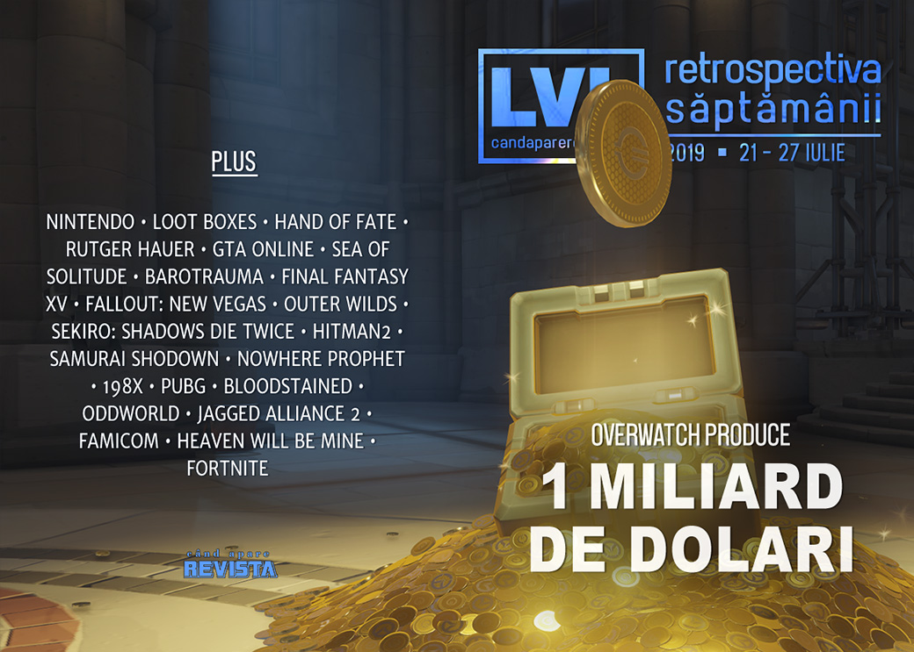

Overwatch produce o grămadă (mai multe grămezi, de fapt) de bani, joy-con-urile sensibile duc până la urmă la probleme legale pentru Nintendo, loot boxes nu sunt jocuri de noroc în Marea Britanie, iar actorul Rutger Hauer a murit. Avem și multe lansări, un nou joc exclusiv Epic Store și multe articole interesante.

Linkuri rapide:

* [Știri](#știri)
* [Articole (critică, dev, design)](#articole-critică-dev-design)
* [Anunţuri şi lansări de jocuri](#anunțuri-și-lansări-de-jocuri)
* [Prăvălii de jocuri](#prăvălii-de-jocuri)

## Știri

* Overwatch depășește frumușica sumă de 1 miliard de dolari în venituri generate de cumpărăturile _in-game_. Ca o paranteză, veniturile totale, care includ și vânzarea propriu-zisă a jocului, au depășit 1 miliard de dolari în urmă cu 2 ani, în mai 2017. ([DSOGaming ](https://www.dsogaming.com/news/overwatch-surpasses-1-billion-revenue-thanks-to-its-in-game-micro-transactions/), [PCGamesInsider.biz](https://www.pcgamesinsider.biz/news/69418/overwatch-clocks-up-1-billion-in-game-spending-milestone/), [PCGamesN](https://www.pcgamesn.com/overwatch/revenue))
* Nintendo a fost chemată în judecată de o firmă de avocatură din Statele Unite care a deschis un proces colectiv în numele mai multor clienți nemulțumiți de defecțiunilor la _joy-con_-urile consolei Switch ([Eurogamer](https://www.eurogamer.net/articles/2019-07-22-nintendo-faces-switch-joy-con-drift-class-action-lawsuit), [Polygon](https://www.polygon.com/2019/7/22/20704203/joy-con-drift-class-action-lawsuit-nintendo-switch), [GamesIndustry.biz](https://www.gamesindustry.biz/articles/2019-07-22-nintendo-faces-class-action-lawsuit-over-joy-con-drifting-defect), [VG247](https://www.vg247.com/2019/07/22/nintendo-facing-class-action-lawsuit-joy-con-design-issue/)). Ulterior, și fără legătură aparentă cu procesul, Nintendo a demarat un proces de înlocuire gratuită a _joy-con_-urilor cu probleme. ([Ars Technica](https://arstechnica.com/gaming/2019/07/report-nintendo-quietly-owns-up-to-joy-con-drift-will-repair-for-free/), [The Verge](https://www.theverge.com/2019/7/23/20707849/nintendo-will-reportedly-fix-joy-con-drift-for-free-even-out-of-warranty), [VideoGamesChronicle](https://www.videogameschronicle.com/news/nintendo-orders-refunds-and-free-repairs-for-drifting-switch-joy-cons/), [Eurogamer](https://www.eurogamer.net/articles/2019-07-24-nintendo-will-fix-joy-cons-experiencing-drift-for-free))
* Defiant Development, studioul care a dezvoltat seria Hand of Fate, se închide. ([PC Gamer](https://www.pcgamer.com/hand-of-fate-2-studio-defiant-is-ceasing-development/), [Eurogamer](https://www.eurogamer.net/articles/2019-07-24-the-studio-behind-hand-of-fate-is-closing-its-doors-after-nine-years), [PCGamesInsider.biz](http://www.pcgamesinsider.biz/news/69409/hand-of-fate-studio-defiant-development-to-close/))
* Comisia pentru jocuri de noroc a Guvernului Marii Britanii a concluzionat în fața parlamentarilor britanici că _loot boxes_ nu constituie „jocuri de noroc”, deoarece nu există o metodă oficială de a converti câștigurile digitale în bani reali. ([VideoGamesChronicle](https://www.videogameschronicle.com/news/uk-gambling-commission-says-loot-boxes-arent-gambling/), [Polygon](https://www.polygon.com/2019/7/25/8930207/loot-boxes-gambling-regulation-banned-uk-law-controversy), [Gamasutra](https://www.gamasutra.com/view/news/347244/FIFAs_loot_boxes_dont_count_as_gambling_says_UK_Gambling_Commission.php), [BBC](https://www.bbc.com/news/technology-49074003))
* A murit actorul Rutger Hauer, la vârsta de 75 de ani. ([Variety](https://variety.com/2019/film/news/rutger-hauer-dead-dies-blade-runner-co-star-1203278050/), [New York Times](https://www.nytimes.com/2019/07/24/movies/rutger-hauer-dead.html), [Gizmodo](https://io9.gizmodo.com/blade-runner-star-rutger-hauer-has-passed-away-1836667411), [A.V. Club](https://news.avclub.com/r-i-p-rutger-hauer-1836667731))

## Articole (critică, dev, design)

* [The Video Game Industry Can&#39;t Go On Like This](https://kotaku.com/the-video-game-industry-cant-go-on-like-this-1836606033) (Kotaku)
* [China's anti-addiction regulations put American game developers in an awkward moral situation](https://www.pcgamer.com/chinas-anti-addiction-regulations-put-american-game-developers-in-an-awkward-moral-situation/) (PC Gamer)
* [Video Game Characters Are Terrible At Archery](https://kotaku.com/video-game-characters-are-terrible-at-archery-1836615271) (Kotaku)
* [Study: Sexualization Of Women In Games Doesn&#39;t Impact Women&#39;s Body Image](https://kotaku.com/study-sexualization-of-women-in-games-doesnt-impact-wo-1836704647) (Kotaku)
* [Can Games Ever Truly Achieve Photorealistic Graphics?](https://gamingbolt.com/can-games-ever-truly-achieve-photorealistic-graphics) (GamingBolt)
* [Game Design in Real Life: The Benefits of Playing Games](https://remptongames.com/2019/07/27/game-design-in-real-life-the-benefits-of-playing-games/) (Rempton Games)
* [The video game industry is a black hole for cybersecurity](https://venturebeat.com/2019/07/24/the-video-game-industry-is-a-black-hole-for-cybersecurity/) (VentureBeat)
* [Death and the videogame](https://theface.com/culture/death-in-video-games-kong-orange) (The Face)
* [How Sea of Solitude and Gris Utilize Color to Discuss Mental Health](https://www.pastemagazine.com/articles/2019/07/sea-of-solitude-mental-health.html) (Paste)

---

### Actualitate
* [The Nintendo Switch’s Joy-Con drift problem, explained](https://www.theverge.com/2019/7/22/20706144/nintendo-switch-joy-con-drift-problem-explained) (The Verge)
* [GTA's casino isn't the worst of gambling in games - but it puts it in perspective](https://www.eurogamer.net/articles/2019-07-26-gtas-casino-isnt-the-worst-of-gambling-in-games-but-it-puts-it-in-perspective) (Eurogamer)
* [Goodbye Rutger Hauer, it's such a shame you were only in two games](https://www.eurogamer.net/articles/2019-07-25-goodbye-rutger-hauer-its-such-a-shame-you-were-only-in-two-games) (Eurogamer)
* [Remembering Rutger Hauer, Black-Armored Knight of the Genre](https://www.wired.com/story/remembering-rutger-hauer-king-of-the-genre/) (Wired)

---

### _Not-a-review_
* [The Joy Of being dead in Barotrauma](https://www.rockpapershotgun.com/2019/07/22/the-joy-of-being-dead-in-barotrauma/) (RPS)
* [Final Fantasy 15's AI is secretly a grand philosophy experiment](https://www.eurogamer.net/articles/2019-07-19-final-fantasy-xvs-ai-is-secretly-a-grand-philosophy-experiment) (Eurogamer)
* [Not a Hero, Just a Postman](http://www.haywiremag.com/features/not-a-hero-just-a-postman/) (Haywire Magazine)
* [Outer Wilds became a GOTY contender by trusting the player](https://www.polygon.com/interviews/2019/7/23/20706307/outer-wilds-game-of-the-year-interview) (Polygon)
* [Sekiro no Shibusa](https://www.slowrun.me/2019/07/sekiro-no-shibusa.html) (SlowRun)
* [Just one more thing: plotting the similarities between Columbo and Hitman](https://www.eurogamer.net/articles/2019-07-27-just-one-more-thing-plotting-the-similarities-between-columbo-and-hitman) (Eurogamer)
* [Agniq Suaŋŋaktuq and Kisima Inŋitchuŋa (Never Alone)](http://www.firstpersonscholar.com/agniq-suannaktuq-and-kisima-innitchuna-never-alone/) (First Person Scholar)
* [&#39;Samurai Shodown&#39; Could Be the Breakout Game at Evo. Here&#39;s Why.](https://www.vice.com/en_us/article/j5wyqd/samurai-shodown-could-be-the-breakout-game-at-evo-heres-why) (Vice)
* [Bullet Points: Nowhere Prophet's Indofuturism](https://techraptor.net/content/nowhere-prophet-indofuturism) (TechRaptor)
* [198X is a vomit-free version of Ready Player One](https://www.videogamer.com/features/198x-is-a-vomit-free-version-of-ready-player-one) (VideoGamer)

---

### Industrie
* [Brendan Greene: &quot;It's crazy, the hate I receive. I just have to ignore it&quot;](https://www.gamesindustry.biz/articles/2019-07-22-brendan-greene-its-crazy-the-hate-i-receive-i-just-have-to-ignore-it) (GamesIndustry.biz)
* [A  Bloodstained  Q&A with Koji 'Iga' Igarashi](https://www.gamasutra.com/view/news/347126/A_Bloodstained_QA_with_Koji_Iga_Igarashi.php) (Gamasutra)
* [From 50 Cent: Bulletproof to Oxenfree, indie Sean Krankel has wild stories from making licensed games](https://www.pcgamer.com/from-50-cent-bulletproof-to-oxenfree-indie-sean-krankel-has-wild-stories-from-making-licensed-games/) (PC Gamer)
* [Video game streaming: is it worth it?](https://www.theguardian.com/games/2019/jul/26/video-game-streaming-is-it-worth-it) (The Guardian)
* [Whoever wins the console wars of tomorrow, Microsoft will profit](https://www.gamesindustry.biz/articles/2019-07-26-whoever-wins-the-console-wars-of-tomorrow-microsoft-will-profit-opinion) (GamesIndustry.biz)
* [Can real-time CG be better than pre-rendered?](https://www.gamesindustry.biz/articles/2019-07-23-can-real-time-cg-be-better-than-pre-rendered) (GamesIndustry.biz), [The irony of Oddworld](https://www.gamesindustry.biz/articles/2019-07-25-the-irony-of-oddworld) (GamesIndustry.biz)
* [Game subscription services will force developers to make difficult decisions](https://venturebeat.com/2019/07/27/game-subscription-services-will-force-developers-to-make-difficult-decisions/) (VentureBeat)

---

### Istorie, retrospectivă
* [This infamous Counter-Strike team helped pave the way for women in e-sports](https://www.theverge.com/2019/7/24/20707166/les-seules-counter-strike-esports-women) (The Verge)
* [20 Years Later, ‘Jagged Alliance 2’ Remains an Irreplaceable Tactics Game](https://www.vice.com/en_us/article/mb88wa/20-years-later-jagged-alliance-2-remains-an-irreplaceable-tactics-game) (Vice)
* [Revisiting the Famicom Disk System: mass storage on console in 1986](https://www.eurogamer.net/articles/digitalfoundry-2019-retro-revisiting-famicom-disk-system) (Eurogamer)

---

### Dev, making of, mecanici
* [The writer of Heaven Will Be Mine on how she made 2018&#8217;s most interesting game](https://www.rockpapershotgun.com/2019/07/24/the-writer-of-heaven-will-be-mine-on-how-she-made-2018s-most-interesting-game/) (RPS)
* [Make Them Want. Delay. Fulfill. Repeat.](http://jeff-vogel.blogspot.com/2019/07/make-them-want-delay-fulfill-repeat.html) (The Bottom Feeder)
* [Watch a design breakdown of digital card game adventure  Nowhere Prophet](https://www.gamasutra.com/view/news/347343/Watch_a_design_breakdown_of_digital_card_game_adventure_Nowhere_Prophet.php) (Gamasutra)
* [Understanding the Success of Fortnite: A UX & Psychology Perspective](https://www.gamasutra.com/blogs/CeliaHodent/20190723/347166/Understanding_the_Success_of_Fortnite_A_UX__Psychology_Perspective.php) (Gamasutra)

---

### Design, world-building, artă
* [How The Hunter: Call of the Wild devs create the prettiest forests](https://www.pcgamer.com/how-the-hunter-call-of-the-wild-devs-create-the-prettiest-forests/) (PC Gamer)
* [Borderlands 3&#039;s Scrapped Cover Art Has Been Revealed](https://www.resetera.com/threads/borderlands-3s-scrapped-cover-art-has-been-revealed.130193/) (ResetEra)
* [Beware The Lord Of Bones](https://kotaku.com/beware-the-lord-of-bones-1836589576) (Kotaku)

## Anunțuri și lansări de jocuri
* [Sumo Digital working on new games with Borderlands publisher 2K](https://www.videogameschronicle.com/news/sumo-digital-working-on-new-games-with-borderlands-publisher-2k/) (VideoGamesChronicle)
* [Doom 64 has been rated by PEGI for PC and PS4](https://www.dsogaming.com/news/doom-64-has-been-rated-by-esrb-for-pc-and-ps4/) (DSOGaming )

### Anunţate
* **Savior**, un action platformer cu animații foarte fluide ([PC Gamer](https://www.pcgamer.com/youre-basically-arya-stark-in-this-open-world-action-platformer/))
* **Fit For A King** ([GameSpace](https://www.gamespace.com/all-articles/news/kitfox-announce-fit-for-a-king-a-different-type-of-throne-simulator/))
* **Reverse Collapse: Code Name Bakery** ([GameSpace](https://www.gamespace.com/all-articles/news/reverse-collapse-code-name-bakery-coming-to-pc-mobile-and-console/))
* **Autonauts** ([VideoGamesChronicle](https://www.videogameschronicle.com/news/gta-designers-colonisation-sim-autonauts-hits-pc-this-autumn/))

### Acum cu dată de lansare
* **Headspun**: 28 august ([Eurogamer](https://www.eurogamer.net/articles/2019-07-22-indie-fmv-game-headspun-has-a-release-date-for-console-and-pc))
* **Jupiter Hell** (early access): 1 august ([PC Gamer](https://www.pcgamer.com/jupiter-hell-the-spiritual-successor-to-a-doom-roguelike-comes-to-steam-early-access-next-week/))
* **The Church in the Darkness**: 2 august ([Games Informer](https://www.gameinformer.com/2019/07/23/new-trailer-and-release-date-for-the-church-in-the-darkness))
* **Legends of Aria** (early access): 6 august ([PC Gamer](https://www.pcgamer.com/legends-of-aria-the-mmo-formerly-known-as-shards-online-hits-early-access-in-august/))
* **Vicious Circle**: 13 august ([Destructoid](https://www.destructoid.com/uncooperative-shooter-vicious-circle-lands-on-steam-next-month-561679.phtml))
* **Dicey Dungeons**: 13 august ([Eurogamer](https://www.eurogamer.net/articles/2019-07-25-super-hexagon-devs-bonkers-deck-builder-dicey-dungeons-gets-an-august-release-date-on-pc))
* **Pagan Online** (iese din early access): 27 august ([PC Gamer](https://www.pcgamer.com/hack-and-slash-rpg-pagan-online-will-leave-early-access-with-massive-changes-in-august/))
* **Oxygen Not Included** (iese din early access): 30 august ([Eurogamer](https://www.eurogamer.net/articles/2019-07-24-kleis-space-colony-management-sim-oxygen-not-included-leaves-early-access-next-week))
* **Citadel: Forged with Fire**: 11 octombrie ([GameSpace](https://www.gamespace.com/all-articles/news/citadel-forged-with-fire-headed-to-consoles-this-fall/))

### Amânate
* **Necrobarista**: septembrie în loc de august ([PC Gamer](https://www.pcgamer.com/necrobarista-the-game-about-coffee-ghosts-and-australia-will-be-slightly-delayed/))
* **MechWarrior 5: Mercenaries**: 10 decembrie în loc de septembrie, și devine exclusiv Epic Store ([Polygon](https://www.polygon.com/2019/7/25/8930718/mechwarrior-5-mercenaries-delayed-december-epic-games-store-exclusive))

### Lansate
* 22 iulie: **Beyond: Two Souls** ([Epic Store](https://www.epicgames.com/store/en-US/product/beyond-two-souls/))
* 22 iulie: **UnderRail: Expedition** ([Steam](https://store.steampowered.com/app/694330/Underrail_Expedition/), [gog.com](https://www.gog.com/game/underrail_expedition))
* 22 iulie: **Swords & Souls: Neverseen** ([Steam](https://store.steampowered.com/app/679900/Swords__Souls_Neverseen/), [gog.com](https://www.gog.com/game/swords_souls_neverseen))
* 22 iulie: **Elsinore** ([Steam](https://store.steampowered.com/app/512890/Elsinore))
* 23 iulie: **Automachef** ([Steam](https://store.steampowered.com/app/984800/Automachef/), [gog.com](https://www.gog.com/game/automachef))
* 23 iulie: **Biotope** (early access) ([Steam](https://store.steampowered.com/app/549040/Biotope/))
* 23 iulie: **Tetris Effect** ([Epic Store](https://www.epicgames.com/store/en-US/product/tetris-effect/))
* 24 iulie: **Iratus: Lord of the Dead** ([Steam](https://store.steampowered.com/app/807120/Iratus_Lord_of_the_Dead/))
* 25 iulie: **Wolfenstein: Youngblood** ([Steam](https://store.steampowered.com/app/1056960/Wolfenstein_Youngblood/))
* 25 iulie: **Wolfenstein: Cyberpilot** ([Steam](https://store.steampowered.com/app/1056970/Wolfenstein_Cyberpilot_International_Version/))
* 25 iulie: **A Place for the Unwilling** ([Steam](https://store.steampowered.com/app/1064310/A_Place_for_the_Unwilling/))
* 25 iulie: **Fantasy Strike** (iese din early access) ([Steam](https://store.steampowered.com/app/390560/Fantasy_Strike/))
* 26 iulie: **Fire Emblem: Three Houses** (Switch) ([Nintendo Store](https://www.nintendo.com/games/detail/fire-emblem-three-houses-switch/))
* 26 iulie: **KILL la KILL -IF** ([Steam](https://store.steampowered.com/app/922500/KILL_la_KILL_IF/))

## Prăvălii de jocuri
### Știri
* [Epic Games Store rolling out cloud saves for select titles](https://www.polygon.com/pc/2019/7/25/8930426/epic-games-store-cloud-saves) (Polygon)

### Jocuri gratis și free weekends
* [This War of Mine & Moonlighter free on Epic Games Store](https://www.shacknews.com/article/112956/this-war-of-mine-moonlighter-free-on-epic-games-store) (Shacknews)
* [Massive JRPG Disgaea is free for the weekend](https://www.pcgamer.com/massive-jrpg-disgaea-is-free-for-the-weekend/) (PC Gamer)

### Reduceri și promoții
* [Doom, Prey, Dishonored, and more are super cheap on Steam](https://www.pcgamer.com/doom-prey-dishonored-and-more-are-super-cheap-on-steam/) (PC Gamer)
* [PlayStation Store's lengthy PS4 Summer Sale has begun](https://www.destructoid.com/playstation-store-s-lengthy-ps4-summer-sale-has-begun-561775.phtml) (Destructoid)
* [Weekend Console Download Deals for July 26: PS Summer Sale](https://www.shacknews.com/article/113079/weekend-console-download-deals-for-july-26-ps-summer-sale) (Shacknews)
* [Weekend PC Download Deals for July 26: Steam QuakeCon Sale](https://www.shacknews.com/article/113082/weekend-pc-download-deals-for-july-26-steam-quakecon-sale) (Shacknews)
* [Best PC gaming deals of the week &#8211; 26th July 2019](https://www.rockpapershotgun.com/2019/07/26/best-pc-gaming-deals-of-the-week-26th-july-2019/) (RPS)

---

{}
**Retrospectiva săptămânii** este rubrica duminicală în care trecem în revistă evenimentele săptămânii de pe frontul de gaming: știri şi articole (scrise de alții, bineînțeles, că e mai ușor aşa), industrie, lansări, oferte de jocuri, toate numai de savurat la cafeaua de duminică dimineața.

De asemenea, rubrica e deschisă oricui vrea și poate contribui. Dacă ai citit vreun articol sau vreo știre interesantă și crezi că merită incluse în retrospectiva săptămânii, te așteptăm pe forum pe unul dintre topicurile dedicate: [Știri](https://forum.candaparerevista.ro/viewtopic.php?f=4&t=46), [Articole](https://forum.candaparerevista.ro/viewtopic.php?f=4&t=206), [Gaming România](https://forum.candaparerevista.ro/viewtopic.php?f=4&t=1622)].
{}
