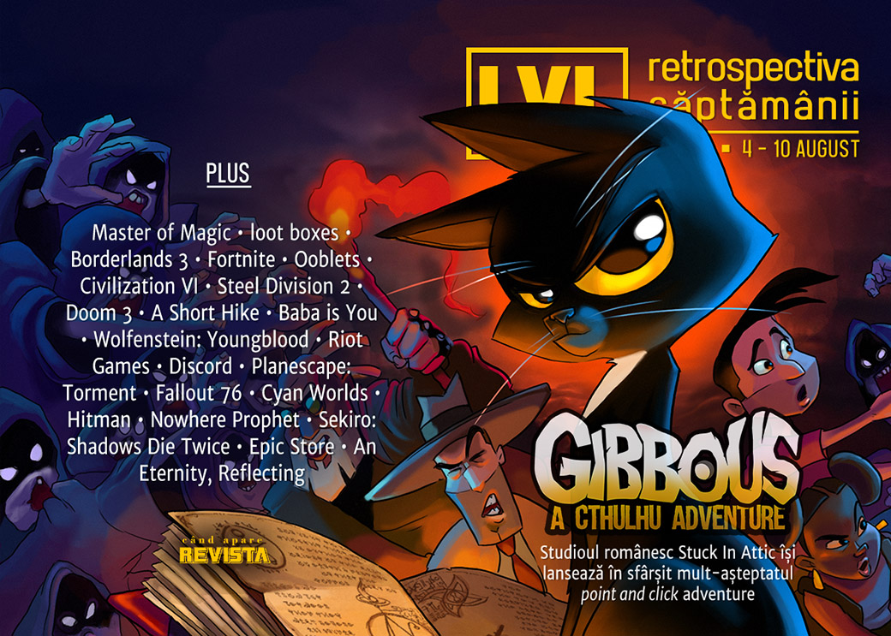

Streamer-ul Ninja face (și mai mulți) bani și aduce profit și pentru Microsoft, site-ul E3 face publice datele personale ale jurnaliștilor, turneul Fortnite aduce multe premii și îmbogățește adolescenții, iar Rockstar reușește să nu plătească impozite pe profit în Marea Britanie în ultimul deceniu. Și săptămână plină pentru jocurile indie românești: s-au lansat **Raiders Of The Lost Island** și **Space Mercs**.

Linkuri rapide:

* [Știri](#știri)
* [Articole (critică, dev, design)](#articole-critică-dev-design)
* [Made în România](#made-în-românia)
* [Anunţuri şi lansări de jocuri](#anunțuri-și-lansări-de-jocuri)
* [Prăvălii de jocuri](#prăvălii-de-jocuri)

## Știri

* Take-Two Interactive au raportat profit de 299 milioane de dolari pe primul trimestru al anului fiscal, generat de tranzacțiile din GTA Online și Red Dead Online. ([Hollywood Reporter](https://www.hollywoodreporter.com/news/take-two-posts-299m-profit-due-gta-red-dead-online-game-spending-1229223
))
* Sony, Microsoft și Nintendo au anunțat că vor cere producătorilor de jocuri pe console să facă publice șansele de câștig pentru loot boxes. ([Ars Technica](https://arstechnica.com/gaming/2019/08/console-makers-will-require-disclosure-of-loot-box-odds/), [Eurogamer](https://www.eurogamer.net/articles/2019-08-07-microsoft-sony-nintendo-wont-allow-loot-boxes-on-consoles-unless-publishers-disclose-drop-rates), [PC Gamer](https://www.pcgamer.com/microsoft-ea-ubisoft-and-others-agree-to-start-sharing-loot-box-odds/), [VideoGamesChronicle](https://www.videogameschronicle.com/news/microsoft-sony-and-nintendo-commit-to-new-loot-box-policies/), [The Verge](https://www.theverge.com/2019/8/7/20758626/nintendo-microsoft-sony-loot-box-drop-rate-disclosure-video-games), [VentureBeat](https://venturebeat.com/2019/08/07/nintendo-microsoft-and-sony-will-make-game-devs-disclose-loot-box-odds/
))
* Slitherine cumpără drepturile pentru seria Master Of Magic. ([RPS](https://www.rockpapershotgun.com/2019/08/05/slitherine-hint-at-making-a-new-master-of-magic/), [PC Gamer](https://www.pcgamer.com/master-of-magic-acquired-by-strategy-publisher-slitherine/), [GamesIndustry.biz](https://www.gamesindustry.biz/articles/2019-08-05-slitherine-acquires-master-of-magic-franchise), [PC Invasion](https://www.pcinvasion.com/slitherine-acquires-rights-to-master-of-magic/
))
* 2K a angajat detectivi particulari pentru a-l monitoriza și interoga pe unul dintre streamerii care au transmis detalii neautorizate despre Borderlands 3. ([PC Gamer](https://www.pcgamer.com/2k-confirms-sending-private-investigators-to-borderlands-streamers-house/), [VG247](https://www.vg247.com/2019/08/08/borderlands-3-supmatto-private-investigators-take-two-leaks/), [Spiel Times](https://www.spieltimes.com/news/2k-sent-private-investigators-to-monitor-the-home-of-a-borderlands-3-streamer/), [Eurogamer](https://www.eurogamer.net/articles/2019-08-08-fans-campaign-for-borderlands-3-boycott-after-youtuber-says-take-two-sent-investigators-to-his-door), [The Verge](https://www.theverge.com/2019/8/7/20758955/2k-games-borderlands-3-supmatto-defense-leaks-youtube))
* Epic Games sunt dați în judecată pentru o breșă de securitate din 2018 care a permis hackerilor să afle datele de login ale jucătorilor de Fortnite.   ([VG247](https://www.vg247.com/2019/08/10/fortnite-security-breach-class-action/), [Polygon](https://www.polygon.com/2019/8/9/20799032/epic-games-fortnite-lawsuit-security-data), [RPS](https://www.rockpapershotgun.com/2019/08/10/epic-games-faces-class-action-lawsuit-following-fortnite-data-breach/
))

## Articole (critică, dev, design)

* [Activision's post-launch microtransactions are the peak of anti-consumer practices](https://www.destructoid.com/activision-s-post-launch-microtransactions-are-the-peak-of-anti-consumer-practices-562857.phtml
) (Destructoid)
* [Making penises in games: it's hard](https://www.pcgamer.com/making-penises-in-games-its-hard/
) (PC Gamer)
* [The 18-month fence hop, the six-day chair, and why video games are so hard to make](https://www.polygon.com/features/2019/8/7/20755231/the-18-month-fence-hop-the-six-day-chair-remedy-control-and-why-video-games-are-so-hard-to-make
) (Polygon)
* [Game DNA: growing order from chaos](https://www.rockpapershotgun.com/2019/08/08/game-dna-growing-order-from-chaos/
) (RPS)
* [I like bad luck and I cannot lie ](https://www.eurogamer.net/articles/2019-08-06-i-like-bad-luck-and-i-cannot-lie
) (Eurogamer)

---

### Actualitate
* [Ooblets: The Story So Far – What’s with the outrage and fake screenshots?](https://www.pcinvasion.com/ooblets-the-story-so-far-whats-with-the-outrage-and-fake-screenshots/
) (PC Invasion)
* [Epic Store Rage Has Gotten Out Of Hand](https://kotaku.com/epic-store-rage-has-gotten-out-of-hand-1837008625
) (Kotaku)
* [NBA 2K20’s gameplay reveal for the WNBA is met with sickening, saddening mockery](https://www.polygon.com/2019/8/10/20799905/nba-2k20-wnba-debut-sexist-reactions-memes
) (Polygon)
* [Trump's video game scapegoating feels downright nostalgic](https://www.gamesindustry.biz/articles/2019-08-09-video-game-scapegoating-feels-downright-nostalgic-opinion
) (GamesIndustry.biz)
* [Blaming Video Games For Gun Violence is a Tired Old Song](https://www.usgamer.net/articles/blaming-video-games-for-gun-violence-is-a-tired-old-song
) (USgamer)
* [The video game industry must stand up against the right’s bad-faith attacks](https://venturebeat.com/2019/08/09/the-video-game-industry-must-defend-itself-against-the-rights-bad-faith-attacks/
) (VentureBeat)
* [The ESA Leak Puts the Future of E3 In Question](https://www.usgamer.net/articles/the-esa-leak-puts-the-future-of-e3-in-question
) (USgamer)

---

### _Not-a-review_
* [The joy of Civilization 6’s giant, real-world maps](https://www.polygon.com/2019/8/10/20759051/civilization-6-real-world-earth-maps-windows-pc
) (Polygon)
* [Teamfight Tactics vs Dota Underlords: The State of Auto Chess Now That the Dust Has Settled](https://www.usgamer.net/articles/teamfight-tactics-vs-dota-underlords-the-state-of-auto-chess-now-that-the-dust-has-settled
) (USgamer)
* [The DeanBeat: My obsession with WWII real-time strategy game Steel Division 2](https://venturebeat.com/2019/08/09/the-deanbeat-my-obsession-with-wwii-real-time-strategy-game-steel-division-2/
) (VentureBeat)
* [I Love The Little Robots In Doom 3](https://kotaku.com/i-love-the-little-robots-in-doom-3-1837077829
) (Kotaku)
* [&#39;A Short Hike&#39; Takes a Nice Long Day to Reinvent the Walking Simulator](https://www.vice.com/en_us/article/8xw983/a-short-hike-takes-a-nice-long-day-to-reinvent-the-walking-simulator
) (Vice)
* [“Killing Nuance,” by Reid McCarter](http://www.bulletpointsmonthly.com/2019/08/07/killing-nuance/
) (Bullet Points Monthly)
* ["Baba is you" is a postmodern masterpiece](https://intothespine.com/2019/08/07/baba-is-you-is-a-postmodern-masterpiece/
) (Into The Spine)

---

### Reportaj
* [Riot Games And Sexism, One Year Later](https://www.kotaku.co.uk/2019/08/07/riot-games-and-sexism-one-year-later
) (Kotaku)

---

### Industrie
* [Opinion: Care about game developers? Then stop getting angry about studios going exclusive with the Epic Games Store](https://www.pcgamesinsider.biz/news/69469/opinion-care-about-game-developers-then-stop-getting-angry-about-studios-going-exclusive-with-the-epic-games-store/
) (PCGamesInsider.biz)
* [How Discord attracted 250m users in four years](https://www.pcgamesinsider.biz/success-story/69464/how-discord-attracted-250m-users-in-four-years/
) (PCGamesInsider.biz)
* [Video games do not cause violence – but makers do need to think about it](https://www.theguardian.com/games/2019/aug/07/video-games-do-not-cause-violence-but-makers-do-need-to-think-about-it
) (The Guardian)
* [Loot boxes a matter of "life or death," says researcher](https://www.gamesindustry.biz/articles/2019-08-08-loot-boxes-a-matter-of-life-or-death
) (GamesIndustry.biz)
* [Growing the industry with evening-sized games](https://www.gamesindustry.biz/articles/2019-08-08-growing-the-industry-with-evening-sized-games
) (GamesIndustry.biz)

---

### Istorie, retrospectivă
* [In 1999, video game writing hit a high-water mark](https://games.avclub.com/in-1999-video-game-writing-hit-a-high-water-mark-1837020765
) (A.V. Club)
* [Rebuilding After the Fallout](https://egmnow.com/rebuilding-after-the-fallout/
) (EGM)
* [Hot dogs and history at Cyan Worlds](https://obscuritory.com/essay/hot-dogs-and-history-at-cyan-worlds/
) (Obscuritory)

---

### Dev, making of, mecanici
* [Discoverability - A 'Hot or Not?' Genre Guide](https://www.gamasutra.com/blogs/SimonCarless/20190807/348240/Discoverability__A_Hot_or_Not_Genre_Guide.php
) (Gamasutra)
* [Video: A postmortem of indie kingdom-builder  Kingdoms and Castles](https://www.gamasutra.com/view/news/348227/Video_A_postmortem_of_indie_kingdombuilder_Kingdoms_and_Castles.php
) (Gamasutra)
* [The AI of Hitman (2016)](https://www.gamasutra.com/blogs/TommyThompson/20190807/346425/The_AI_of_Hitman_2016.php
) (Gamasutra)
* [The design and iteration of tactical deck-building game  Nowhere Prophet](https://www.gamasutra.com/view/news/348169/The_design_and_iteration_of_tactical_deckbuilding_game_Nowhere_Prophet.php
) (Gamasutra)

---

### Design, world-building, artă
* [Talking Places in Sekrio: Shadows Die Twice](https://egmnow.com/talking-places-in-sekrio-shadows-die-twice/
) (EGM)
* [This PC gaming bedroom art is a powerful hit of nostalgia](https://www.pcgamer.com/this-pc-gaming-bedroom-art-is-a-powerful-hit-of-nostalgia/
) (PC Gamer)
* [Some unofficial ideas for new Apex Legends characters](https://kotaku.com/some-unofficial-ideas-for-new-apex-legends-characters-1836989080
) (Kotaku)
* [More rejected Borderlands 3 cover art](https://www.pcgamer.com/more-rejected-borderlands-3-cover-art/
) (PC Gamer)
* [A First-Person Adventure Is One of the Coolest Mario Maker Levels Yet](https://www.vice.com/en_ca/article/9ke53y/a-first-person-adventure-is-one-of-the-coolest-mario-maker-levels-yet
) (Vice)
* [Quakin' In His Boots](https://kotaku.com/quakin-in-his-boots-1837051226
) (Kotaku)
* [Game Box Art Critique August: Control, Astral Chain, Man of Medan](https://www.videogamer.com/features/game-box-art-critique-august-control-astral-chain-man-of-medan
) (VideoGamer)

## Made în România

* S-a lansat **Gibbous - A Cthulhu Adventure**. ([Go4it.ro](http://jocuri.go4it.ro/gibbous-a-cthulhu-adventure-review), [Overheat.ro](https://www.overheat.ro/2019/08/07/indie-romanesc-gibbous-cthulhu-adventure/), [PC Invasion](https://www.pcinvasion.com/gibbous-a-cthulhu-adventure-wriggling-out-on-steam-and-gog-today/), [IndieGamesPlus](https://indiegamesplus.com/2019/08/gibbous-is-a-silly-adventure-of-lovecraftian-horrors
))

## Anunțuri și lansări de jocuri

* [Total War Saga: Troy gets trademarked by The Creative Assembly](https://www.rockpapershotgun.com/2019/08/09/total-war-saga-troy-trademark-creative-assembly/
) (RPS)
* [The new Guilty Gear looks gorgeous](https://www.polygon.com/2019/8/5/20754681/new-guilty-gear-2020-evo-teaser-trailer
) (Polygon)

### Anunţate
* **Romance of The Three Kingdoms 14** ([PC Gamer](https://www.pcgamer.com/romance-of-the-three-kingdoms-14-announced-due-early-2020/
))
* **Cook, Serve, Delicious 3!** ([Kotaku](https://kotaku.com/cook-serve-delicious-3-takes-the-intense-restaurant-s-1836998392
))
* **Gamedec**, un nou RPG cyberpunk ([PC Gamer](https://www.pcgamer.com/solve-virtual-crimes-in-cyberpunk-rpg-gamedec-next-year/
))
* **Dark Envoy** ([PC Invasion](https://www.pcinvasion.com/dark-envoy-is-a-steampunkish-crpg-inspired-by-divinity-and-bioware-rpgs/
))

### Acum cu dată de lansare
* **Ashes of Oahu**: 29 august ([GameSpace](https://www.gamespace.com/all-articles/news/ashes-of-oahu-sets-launch-date-for-august/))
* **Decay of Logos**: 30 august ([Shacknews](https://www.shacknews.com/article/113274/decay-of-logos-scores-august-release-date-on-pc-and-consoles
))
* **Children of Morta**: 3 septembrie ([TechRaptor](https://techraptor.net/content/children-of-morta-release-date-trailer
))
* **Flotsam**: 26 septembrie ([Hardcore Gamer](https://www.hardcoregamer.com/2019/08/06/flotsam-launch-date-announced-for-steam-early-access-and-kartridge/353541/
))
* **Trine 4: The Nightmare Prince**: 8 octombrie ([DSOGaming ](https://www.dsogaming.com/news/trine-4-the-nightmare-prince-releases-on-october-8th-gets-a-brand-new-gameplay-trailer/
))
* **Indivisible**: 8 octombrie ([Destructoid](https://www.destructoid.com/indivisible-will-finally-see-the-light-of-day-in-october-563264.phtml
))
* **Crossroads Inn**: 18 octombrie ([PC Gamer](https://www.pcgamer.com/crossroads-inn-release-date-sandbox-gameplay/
))

### Amânate
* **XIII** remake: 2020 în loc de noiembrie 2019 ([Eurogamer](https://www.eurogamer.net/articles/2019-08-08-remake-of-cult-cel-shaded-shooter-xiii-delayed-into-next-year))

### Lansate
* 6 august: **Age of Wonders: Planetfall** ([Steam](https://store.steampowered.com/app/718850/Age_of_Wonders_Planetfall/
), [GOG](https://www.gog.com/game/age_of_wonders_planetfall))
* 6 august: **Metal Wolf Chaos XD** ([Steam](https://store.steampowered.com/app/820630/Metal_Wolf_Chaos_XD/
), [GOG](https://www.gog.com/game/metal_wolf_chaos_xd))
* 6 august: **Cliff Empire** (iese din early access) ([Steam](https://store.steampowered.com/app/809140/Cliff_Empire/
))
* 6 august: **RASHLANDER** ([Steam](https://store.steampowered.com/app/1054270/RASHLANDER/
))
* 7 august: **Gibbous - A Cthulhu Adventure** ([Steam](https://store.steampowered.com/app/914020/Gibbous___A_Cthulhu_Adventure/
), [GOG](https://www.gog.com/game/gibbous_a_cthulhu_adventure))
* 8 august: **Stone Story RPG** (early access) ([Steam](https://store.steampowered.com/app/603390/Stone_Story_RPG/
))
* 8 august: **Steel Circus** (early access) ([Steam](https://store.steampowered.com/app/969680/Steel_Circus/
))

## Prăvălii de jocuri

### Știri
* [After Epic purchase, Psyonix removes random loot boxes from Rocket League](https://arstechnica.com/gaming/2019/08/after-epic-purchase-psyonix-removes-random-loot-boxes-from-rocket-league/
) (Ars Technica)
* [Severe local 0-Day escalation exploit found in Steam Client Services](https://arstechnica.com/gaming/2019/08/severe-local-0-day-escalation-exploit-found-in-steam-client-services/
) (Ars Technica)
* [Valve has put a stop to the Steam release date exploit](https://www.pcgamer.com/valve-appears-to-have-put-a-stop-to-the-steam-release-date-exploit/
) (PC Gamer)
* [Epic Games Store quietly delays most features set for July](https://www.pcinvasion.com/epic-games-store-quietly-delays-most-features-set-for-july/
) (PC Invasion)

### Articole
* [Why Epic's strategy makes a lot of sense](https://www.positech.co.uk/cliffsblog/2019/08/07/why-epics-strategy-makes-a-lot-of-sense/
) (Positech)
* [Ooblets devs reveal threats of violence and racist abuse following Epic Store announcement](https://www.pcgamer.com/ooblets-devs-reveal-threats-of-violence-and-racist-abuse-following-epic-store-announcement/
) (PC Gamer)
* [Epic’s CEO shouldn’t be riling the mob going after Ooblets over its Epic exclusivity](https://www.rockpapershotgun.com/2019/08/05/epics-ceo-shouldnt-be-riling-the-mob-going-after-ooblets-over-its-epic-exclusivity/
) (RPS)

### Update catalog
* [Destiny 2 moves its PC home from Battle.net to Steam on October 1](https://venturebeat.com/2019/08/08/destiny-2-moves-its-pc-home-from-battle-net-to-steam-on-october-1/
) (VentureBeat)
* [DuckTales: Remastered  is being pulled from digital stores on August 8](https://www.gamasutra.com/view/news/348219/DuckTales_Remastered_is_being_pulled_from_digital_stores_on_August_8.php
) (Gamasutra)
* [Origin Access set to add Vampyr and Warhammer: Chaosbane to its collection](https://www.spieltimes.com/news/origin-access-set-to-add-vampyr-and-warhammer-chaosbane-to-its-collection/
) (Spiel Times)

### Jocuri gratis și free weekends
* [Wholesome puzzle game GNOG goes free on the Epic Games Store](https://www.destructoid.com/wholesome-puzzle-game-gnog-goes-free-on-the-epic-games-store-562990.phtml
) (Destructoid)
* [Confront the past in beautiful free adventure game An Eternity, Reflecting](https://www.pcgamer.com/confront-the-past-in-beautiful-free-adventure-game-an-eternity-reflecting/
) (PC Gamer)
* [One of the devs behind The Stanley Parable made a free MMO](https://www.rockpapershotgun.com/2019/08/09/one-of-the-devs-behind-the-stanley-parable-made-a-free-mmo/
) (RPS)
* [Street Fighter 5 is free to play on Steam this weekend](https://www.vg247.com/2019/08/09/street-fighter-5-free-play-steam/
) (VG247)

### Reduceri și promoții
* [Humble Indie Hits sale discounts Bloodstained, No Man's Sky and more](https://www.eurogamer.net/articles/2019-08-09-humble-indie-hits-sale-discounts-bloodstained-no-mans-sky-and-more
) (Eurogamer)
* [Weekend PC Download Deals for Aug 8: No Man's Sky goes Beyond](https://www.shacknews.com/article/113319/weekend-pc-download-deals-for-aug-8-no-mans-sky-goes-beyond
) (Shacknews)
* [Weekend Console Download Deals for Aug 9: Mario Tennis Aces free week](https://www.shacknews.com/article/113316/weekend-console-download-deals-for-aug-9-mario-tennis-aces-free-week
) (Shacknews)
* [Some of the PC's best visual novels are 80% off this weekend](https://www.pcgamer.com/some-of-the-pcs-best-visual-novels-are-80-off-this-weekend/
) (PC Gamer)
* [Fanatical Bento Bundle 2 Offers Up Super-Low Prices on Great Games](https://www.hardcoregamer.com/2019/08/07/fanatical-bento-bundle-2-offers-up-super-low-prices-on-great-games/353706/
) (Hardcore Gamer)
* [Humble Bohemia Interactive Bundle](https://zonait.ro/humble-bohemia-interactive-bundle/
) (Zona IT)
