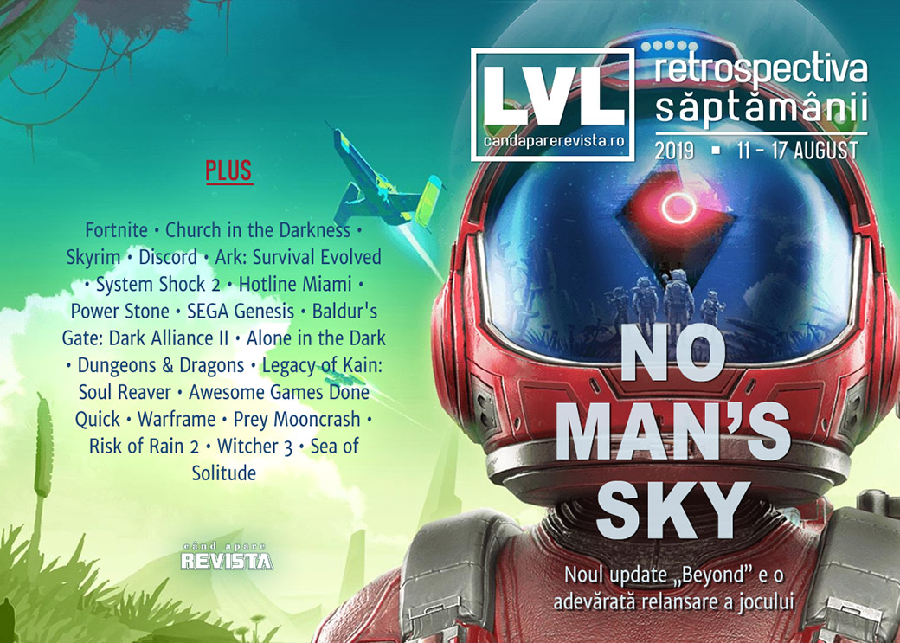

O săptămână și mai săracă în știri decât precedenta, dar avem mai multe aniversări și retrospective - Legacy of Kain: Soul Reaver, System Shock 2 și SEGA Genesis, plus anunțuri interesante: o ediție îmbunătățită pentru System Shock 2, un nou Need for Speed, două titluri ACE Team și... King's Bounty 2. Și s-a lansat un nou (și cel mai mare de până acum) update pentru No Man's Sky, ajuns acum la ani lumină de starea în care s-a lansat.

Linkuri rapide:

* [Știri](#știri)
* [Articole (critică, dev, design)](#articole-critică-dev-design)
* [Anunţuri şi lansări de jocuri](#anunțuri-și-lansări-de-jocuri)
* [Prăvălii de jocuri](#prăvălii-de-jocuri)

## Știri

* Campionul recent încheiatului campionat mondial de Fortnite a fost ținta unui incident de tip _swatting_ chiar în timpul unui stream live. Vizita polițiștilor s-a încheiat însă rapid, fără victime sau incidente. ([Ars Technica](https://arstechnica.com/gaming/2019/08/3-million-fortnite-winner-and-his-parents-become-latest-swatting-targets/), [PC Gamer](https://www.pcgamer.com/fortnites-16-year-old-solo-champion-was-swatted-during-a-stream/), [Eurogamer](https://www.eurogamer.net/articles/2019-08-12-16-year-old-fortnite-world-cup-champion-swatted-during-livestream), [The Guardian](https://www.theguardian.com/sport/2019/aug/12/bugha-swatted-fortnite-world-cup-champion-police), [VG247](https://www.vg247.com/2019/08/12/bugha-swatting/))
* My.Games, divizia de gaming a companiei rusești Mail.ru, va lansa un magazin digital de jocuri care se va adresa pieței internaționale. ([GamesIndustry.biz](https://www.gamesindustry.biz/articles/2019-08-16-my-games-to-launch-new-pc-gaming-storefront), [PCGamesInsider.biz](https://www.pcgamesinsider.biz/news/69537/russias-mygames-is-launching-a-brand-new-store/), [Gamasutra](https://www.gamasutra.com/view/news/348912/MyGames_is_launching_its_own_PC_video_game_storefront.php), [VentureBeat](https://venturebeat.com/2019/08/16/my-games-will-launch-global-game-store-in-q4/))
* Streamer-ul de care scriam săptămâna trecută că a fost vizitat de investigatori privați trimiși de 2K și-a închis canalul de YouTube și toate celelalte conturi de pe rețelele sociale. ([Eurogamer](https://www.eurogamer.net/articles/2019-08-16-borderlands-3-youtubers-channel-disappears-amidst-take-two-investigation-over-leaks), [PC Gamer](https://www.pcgamer.com/the-borderlands-youtuber-being-investigated-by-2k-no-longer-has-a-channel/))
* Trade-N-Games, un magazin de jocuri din SUA, a fost ținta unui jaf, hoții golind un seif cu aproape 150 de jocuri rare în valoare de peste 100.000 de dolari. ([TechRaptor](https://techraptor.net/content/trade-n-games-100000-stolen-rare-games-theft))

## Articole (critică, dev, design)

* [Video game corporate satire is really overdue an upgrade](https://www.eurogamer.net/articles/2019-08-09-videogame-corporate-satire-is-really-overdue-an-upgrade) (Eurogamer)
* [What goes right and wrong when games like Diablo 3 take a decade to make](https://www.polygon.com/2019/8/14/20752364/what-goes-wrong-diablo-3-decade-10-year-development) (Polygon)
* [The people who watch video games, but never play them](https://www.polygon.com/2019/8/16/20807731/youtube-twitch-fandom-video-games-cosplay-fan-art) (Polygon)
* [Why we now talk about politics in games so much](https://www.eurogamer.net/articles/2019-08-14-why-we-now-talk-about-politics-in-games-so-much) (Eurogamer)
* [Finding Human Interest Stories in Virtual Reality](https://hyperallergic.com/509737/syrmor-youtube-vrchat-interviews/) (Hyperallergic )
* [Applying Videogame Theory to Escape Rooms: the Definition of a &quot;Game&quot;](https://www.gamasutra.com/blogs/AlastairAitchison/20190813/348526/Applying_Videogame_Theory_to_Escape_Rooms__the_Definition_of_a_quotGamequot.php) (Gamasutra)
* [The Uncertain Future of Video Game History](https://egmnow.com/the-uncertain-future-of-video-game-history/) (EGM)

---

### Reportaj
* [What It’s Really Like to Be a QA Tester](https://egmnow.com/what-its-really-like-to-be-a-qa-tester/) (EGM)

---

### _Not-a-review_
* [No Man&#039;s Sky Beyond Is Finally Feeling Like the Game I Wanted Three Years Ago](https://www.usgamer.net/articles/no-mans-sky-is-finally-feeling-like-the-game-i-wanted-three-years-ago) (USgamer)
* [A Mysterious Cult Isn&#39;t Enough for the Repetitive &#39;Church in the Darkness&#39;](https://www.vice.com/en_us/article/zmjvka/church-in-the-darkness-review) (Vice)
* [In praise of Skyrim&#039;s oldest mystery](https://theface.com/life/skyrims-insect-jars-conspiracy-theories) (The Face)

---

### Industrie
* [Phil Spencer Doesn't Think That Cloud Systems Will Fully Replace Traditional Consoles Just Yet](https://www.gamespot.com/articles/phil-spencer-cloud-gaming-is-inevitable-but-isnt-r/1100-6468840/) (Gamespot)
* [Stop asking &quot;is it political?&quot; It always is](https://www.gamesindustry.biz/articles/2019-08-15-stop-asking-is-it-political-it-always-is-opinion) (GamesIndustry.biz)
* [Discord Explains How It Handles Harassment, Doxxing, and Threatening Behaviour](https://www.kotaku.co.uk/2019/08/14/discord-explains-how-it-handles-harassment-doxxing-and-threatening-behavior) (Kotaku)
* [How Ark: Survival Evolved &quot;fell into sustainable revenue&quot; without skins or loot boxes](https://www.gamesindustry.biz/articles/2019-08-16-how-ark-survival-evolved-fell-into-sustainable-revenue-without-skins-or-loot-boxes) (GamesIndustry.biz)

---

### Istorie, retrospectivă
* [The Timeless Horror of &#39;System Shock 2&#39;](https://www.vice.com/en_us/article/j5yxny/the-timeless-horror-of-system-shock-2) (Vice)
* [How one phone call saved a tiny new studio and gave the world System Shock 2](https://www.pcgamer.com/system-shock-2-retrospective-20th-anniversary/) (PC Gamer)
* [The messy story behind the Hotline Miami mod that never was](https://www.eurogamer.net/articles/2019-08-13-the-messy-story-behind-the-hotline-miami-mod-that-never-was) (Eurogamer)
* [Power Stone: the Dreamcast brawler that foresaw Fortnite and Overwatch](https://www.theguardian.com/games/2019/aug/14/power-stone-sega-dreamcast-fortnite-overwatch) (The Guardian)
* [Sega Genesis at 30: the console that made the modern games industry](https://www.theguardian.com/games/2019/aug/16/sega-genesis-at-30-mega-drive-console-modern-games-industry) (The Guardian)
* [Member Baldur&#039;s Gate: Dark Alliance II?](https://www.hardcoregamer.com/2019/08/16/member-baldurs-gate-dark-alliance-ii/331447/) (Hardcore Gamer)
* [Alone in the Dark](https://www.filfre.net/2019/08/alone-in-the-dark/) (The Digital Antiquarian)
* [The Game Archaeologist: Dungeons & Dragons](https://massivelyop.com/2019/08/17/the-game-archaeologist-dungeons-dragons/) (Massively OP)
* [As Legacy of Kain: Soul Reaver turns 20, let's remember why it was brilliant](https://www.eurogamer.net/articles/2019-08-17-as-legacy-of-kain-soul-reaver-turns-20-lets-remember-why-it-was-brilliant) (Eurogamer)
* [The Origins of Awesome Games Done Quick](https://egmnow.com/the-origins-of-awesome-games-done-quick/) (EGM)

---

### Dev, making of, mecanici
* [Making A Better Card Feel Worse With UX](https://www.pentadact.com/2019-08-12-making-a-better-card-feel-worse-with-ux/) (Tom Francis Blog)
* [What we can learn from... Warframe](https://www.gamesindustry.biz/articles/2019-08-15-what-we-can-learn-from-warframe) (GamesIndustry.biz)
* [Like a boss: The secrets behind great boss design](https://www.gamesindustry.biz/articles/2019-08-13-like-a-boss-the-secrets-behind-great-boss-design) (GamesIndustry.biz)
* [How Prey Mooncrash Gave us a AAA RogueLike](https://www.gamasutra.com/blogs/JoshBycer/20190816/348870/How_Prey_Mooncrash_Gave_us_a_AAA_RogueLike.php) (Gamasutra)
* [How moving from 2D to 3D shaped the design of  Risk of Rain 2](https://www.gamasutra.com/view/news/348375/How_moving_from_2D_to_3D_shaped_the_design_of_Risk_of_Rain_2.php) (Gamasutra)

---

### Design, world-building, artă
* [Planning Novigrad](https://unwinnable.com/2019/08/12/planning-novigrad/) (Unwinnable)
* [How the creators of Sea of Solitude turned fear and anxiety into monsters](https://www.theverge.com/2019/8/13/20803626/sea-of-solitude-cornelia-geppert-art-design-interview-ea-originals-creatures) (The Verge)
* [Your View Inside of Atlus' Amazing Art Exhibit Dedicated to Persona 5 and Catherine](https://www.gameinformer.com/2019/08/17/your-view-inside-of-atlus-amazing-art-exhibit-dedicated-to-persona-5-and-catherine) (Game Informer)
* [Star Wars: A Studio Ghibli Story](https://kotaku.com/star-wars-a-studio-ghibli-story-1837228715) (Kotaku)
* [Rush Hour](https://kotaku.com/rush-hour-1837161541) (Kotaku)

## Anunțuri și lansări de jocuri

* [Shantae and the Seven Sirens reveals title, plot details and first screenshots](https://www.destructoid.com/shantae-and-the-seven-sirens-reveals-title-and-first-screenshots-563797.phtml) (Destructoid)
* [A New Saints Row Is On The Way](https://www.gameinformer.com/2019/08/14/a-new-saints-row-is-on-the-way) (Games Informer)
* [4A Games is working on the next Metro game](https://www.dsogaming.com/news/4a-games-is-working-on-the-next-metro-game/) (DSOGaming )

### Anunţate
* **System Shock 2: Enhanced Edition** ([Shacknews](https://www.shacknews.com/article/113335/system-shock-2-enhanced-edition-announced-coming-soon)). Și, legat de asta: [System Shock 2 Has Been Getting New Patches For Years, Based On The Work Of A Fan Nobody Can Find](https://kotaku.com/system-shock-2-has-been-getting-new-patches-for-years-1837180538) (Kotaku)
* **Need for Speed Heat** ([Kotaku](https://kotaku.com/the-next-need-for-speed-is-need-for-speed-heat-a-styli-1837235524))
* **Liberated** ([Polygon](https://www.polygon.com/2019/8/12/20802136/liberated-trailer-pc-switch-ps4-xbox-one))
* **Still There** ([GameSpace](https://www.gamespace.com/all-articles/news/still-there-announcement-trailer/))
* **Rock of Ages 3: Make & Break** ([PC Gamer](https://www.pcgamer.com/rock-of-ages-3-make-and-break-is-coming-to-flatten-your-castle-next-year/))
* **Project Thalassa** ([PCGamesInsider.biz](https://www.pcgamesinsider.biz/news/69533/my-child-lebensborn-developer-sarepta-studios-announces-its-next-ambitious-project-thalassa/))
* **King's Bounty 2** ([PC Gamer](https://www.pcgamer.com/kings-bounty-2-takes-the-tactical-rpg-in-a-new-direction/))
* **The Eternal Cylinder** ([RPS](https://www.rockpapershotgun.com/2019/08/16/the-endless-cylinder-launching-in-2020/))
* **The Falconeer** ([Wccf tech](https://wccftech.com/open-world-rpg-the-falconeer/))

### Acum cu dată de lansare
* **Telling Lies**: 23 august ([Destructoid](https://www.destructoid.com/telling-lies-the-follow-up-to-the-fmv-filled-her-story-is-out-next-week-563903.phtml))
* **Knights and Bikes**: 27 august ([Eurogamer](https://www.eurogamer.net/articles/2019-08-12-knights-and-bikes-lands-august-release-date))
* **Nauticrawl**: 16 septembrie ([PC Gamer](https://www.pcgamer.com/learn-how-to-pilot-a-stolen-alien-vehicle-in-nauticrawl/))
* **Session** (early access): 17 septembrie ([PC Gamer](https://www.pcgamer.com/session-release-date/))
* **Daymare: 1998**: 17 septembrie  ([DSOGaming ](https://www.dsogaming.com/news/daymare-1998-releases-on-the-pc-this-september-free-demo-available-for-download/))
* **Doraemon Story of Seasons**: 11 octombrie ([Destructoid](https://www.destructoid.com/doraemon-story-of-seasons-lands-on-switch-and-pc-this-october-563687.phtml))

### Amânate
* **Spelunky 2**: 2020 în loc de 2019 ([Games Informer](https://www.gameinformer.com/2019/08/14/spelunky-2-delayed-out-of-2019))

### Anulate
* **Lazarus** ([Eurogamer](https://www.eurogamer.net/articles/2019-08-12-another-spatialos-games-been-canned-making-it-the-third-this-year))

### Lansate
* 12 august: **Anodyne 2: Return to Dust** ([Steam](https://store.steampowered.com/app/877810/Anodyne_2_Return_to_Dust/))
* 12 august: **Eliza** ([Steam](https://store.steampowered.com/app/716500/Eliza/), [gog.com](https://www.gog.com/game/eliza))
* 13 august: **Exception** ([Steam](https://store.steampowered.com/app/456390/Exception/))
* 13 august: **Dicey Dungeons** ([Steam](https://store.steampowered.com/app/861540/Dicey_Dungeons/))
* 13 august: **Vicious Circle** ([Steam](https://store.steampowered.com/app/556440/Vicious_Circle/))
* 13 august: **Rebel Galaxy Outlaw** ([Epic Store](https://www.epicgames.com/store/en-US/product/rebel-galaxy-outlaw/))
* 14 august: **The Great Perhaps** ([Steam](https://store.steampowered.com/app/1016930/The_Great_Perhaps/), [gog.com](https://www.gog.com/game/the_great_perhaps))
* 15 august: **Ion Fury** ([Steam](https://store.steampowered.com/app/562860/Ion_Fury/), [gog.com](https://www.gog.com/game/ion_fury))
* 15 august: **DARQ** ([Steam](https://store.steampowered.com/app/433550/DARQ/), [gog.com](https://www.gog.com/game/darq))
* 15 august: **Shortest Trip to Earth** (iese din early access) ([Steam](https://store.steampowered.com/app/812040/Shortest_Trip_to_Earth/), [gog.com](https://www.gog.com/game/shortest_trip_to_earth))
* 15 august: **Lichtspeer: Double Speer Edition** ([Steam](https://store.steampowered.com/app/994040/Lichtspeer_Double_Speer_Edition/))
* 15 august: **Hot Shot Burn** (early access) ([Steam](https://store.steampowered.com/app/801750/Hot_Shot_Burn/))
* 15 august: **FlowScape**, un tool pentru crearea de scene 3D animate ([Steam](https://store.steampowered.com/app/1043390/FlowScape/))

## Prăvălii de jocuri

### Știri
* [Some Steam Workshop submissions now require moderator approval](https://www.pcgamesn.com/counter-strike-global-offensive/steam-workshop-moderation) (PCGamesN)
* [Epic Games Store update adds more cloud saves and Humble Bundle Keyless Integration](https://www.vg247.com/2019/08/15/epic-games-store-cloud-saves-update/) (VG247)
* [There's a way to hide games on the Steam store that you already own elsewhere](https://www.destructoid.com/there-s-a-way-to-hide-games-on-the-steam-store-that-you-already-own-elsewhere-563784.phtml) (Destructoid)
* [Utomik crosses more than 1,000 PC games for subscription download service](https://venturebeat.com/2019/08/12/utomik-crosses-more-than-1000-pc-games-for-subscription-download-service/) (VentureBeat)

### Update catalog
* [Grid 2 has been removed from Steam](https://www.pcgamer.com/grid-2-has-been-removed-from-steam/) (PC Gamer)
* [Total War: SHOGUN II – Fall of the Samurai joins the Total War Saga family](https://www.dsogaming.com/news/total-war-shogun-ii-fall-of-the-samurai-joins-the-total-war-saga-family/) (DSOGaming )
* [Forza Motorsport 6 To Be Removed From Xbox Live Marketplace On September 15](https://www.gameinformer.com/psa/2019/08/16/forza-motorsport-6-to-be-removed-from-xbox-live-marketplace-on-september-15) (Games Informer)

### Jocuri gratis și free weekends
* [Hyper Light Drifter and Mutant Year Zero: Road to Eden are free at the Epic Games Store](https://www.polygon.com/deals/2019/8/15/20806999/epic-games-store-free-games-list-hyper-light-drifter-mutant-year-zero) (Polygon)
* [Mr Flipper is a free pinball game with one hell of a twist](https://www.pcgamer.com/mr-flipper-is-a-free-pinball-game-with-one-hell-of-a-twist/) (PC Gamer)
* [Play Galactic Civilizations III for free on Steam this weekend](https://www.gamespace.com/all-articles/news/play-galactic-civilizations-iii-for-free-on-steam-this-weekend/) (GameSpace)
* [New Free Steam Demo Is A Modern-Day Superman Game](https://kotaku.com/new-free-steam-demo-is-a-modern-day-superman-game-1837178287) (Kotaku)
