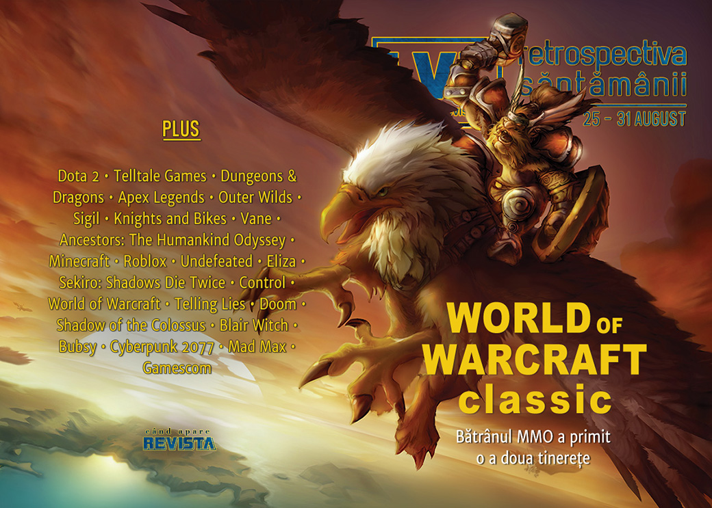

Val de acuze despre abuzuri sexuale și emoționale ies la iveală despre mai mulți oameni cunoscuți din industrie, compania Telltale Games revine la viață cu numele și se lansează două dintre cele mai așteptate jocuri alte toamnei: World of Warcraft Classic și Control al celor de la Remedy. Și, nu în ultimul rând, este anunțat Homeworld 3.

Linkuri rapide:

* [Știri](#știri)
* [Articole (critică, dev, design)](#articole-critică-dev-design)
* [Made în România](#made-în-românia)
* [Anunţuri şi lansări de jocuri](#anunțuri-și-lansări-de-jocuri)
* [Prăvălii de jocuri](#prăvălii-de-jocuri)

## Știri

Mai multe persoane cunoscute din industria jocurilor au fost acuzate de foști angajați de abuzuri sexuale sau emoționale în diferite forme ([RPS](https://www.rockpapershotgun.com/2019/08/27/skyrim-composer-jeremy-soule-and-night-in-the-woods-co-creator-alec-holowka-accused-of-sexual-assault/), [The Verge](https://www.theverge.com/2019/8/27/20835249/game-developers-sexual-assault-publicly-accused-allegations-metoo), [PC Gamer](https://www.pcgamer.com/multiple-men-in-the-games-industry-accused-of-sexual-abuse-or-assault/), [Vice](https://www.vice.com/en_us/article/vb5dp4/three-prominent-video-game-developers-accused-of-sexual-assault-in-one-day), [GamesIndustry.biz](https://www.gamesindustry.biz/articles/2019-08-28-more-women-come-forward-with-accounts-of-emotional-abuse-and-sexual-assault)):

* Jeremy Soule, compozitorul seriei Elder Scrolls ([Eurogamer](https://www.eurogamer.net/articles/2019-08-27-skyrim-guild-wars-composer-jeremy-soule-accused-of-rape), [Kotaku](https://kotaku.com/two-women-accuse-skyrim-composer-jeremy-soule-of-sexual-1837677315), [GamesIndustry.biz](https://www.gamesindustry.biz/articles/2019-08-29-voice-actor-shares-a-second-warning-about-skyrim-composer))
* Michael Antonov, unul dintre fondatorii companiei Oculus ([The Verge](https://www.theverge.com/2019/8/29/20838741/facebook-oculus-co-founder-michael-antonov-sexual-assault-groping-allegation-gdchttps://www.theverge.com/2019/8/29/20838741/facebook-oculus-co-founder-michael-antonov-sexual-assault-groping-allegation-gdc), [Kotaku](https://kotaku.com/woman-says-oculus-rift-cofounder-put-his-hand-up-her-sk-1837718101), [GamesIndustry.biz](https://www.gamesindustry.biz/articles/2019-08-29-oculus-vr-faces-two-allegations-of-sexual-assault-and-harrassment))
* Alexis Kennedy, creatorul lui **Cultist Simulator** ([Eurogamer](https://www.eurogamer.net/articles/2019-08-30-two-women-accuse-cultist-simulator-developer-alexis-kennedy-of-exploitative-behaviour), [GamesIndustry.biz](https://www.gamesindustry.biz/articles/2019-08-29-former-colleagues-accuse-alexis-kennedy-of-abuse-retaliation), [PCGamesInsider.biz](https://www.pcgamesinsider.biz/news/69602/allegations-of-abusive-behaviour-levelled-against-weather-factorys-alexis-kennedy/))
* Alec Holowka, designer și compozitor pentru **Night in the Woods** ([Eurogamer](https://www.eurogamer.net/articles/2019-08-27-night-in-the-woods-co-creator-accused-of-sexual-assault)). În acest caz, urmările au fost imediate și tragice:
  * mai întâi studioul care a creat jocul, Infinite Fall, a anunțat că întrerupe legăturile cu compozitorul, inclusiv anularea unui mic proiect aflat în lucru ([Shacknews](https://www.shacknews.com/article/113671/night-in-the-woods-devs-cut-ties-with-alex-holowka-following-abuse-allegations), [The Verge](https://www.theverge.com/2019/8/28/20837342/night-in-the-woods-game-cancelled-alec-holowka-assault), [Polygon](https://www.polygon.com/2019/8/29/20835673/night-in-the-woods-alec-holowka-abuse-zoe-quinn), [RPS](https://www.rockpapershotgun.com/2019/08/30/night-in-the-woods-devs-cutting-ties-with-co-creator-following-abuse-allegations), [Ars Technica](https://arstechnica.com/gaming/2019/08/night-in-the-woods-devs-cut-ties-with-collaborator-accused-of-assault/), [GamesIndustry.biz](https://www.gamesindustry.biz/articles/2019-08-29-night-of-the-woods-team-cuts-ties-with-alec-holowka))
    * iar sâmbătă sora lui Holowka a anunțat că acesta a decedat, fără să menționeze cauza, dar aparent fiind vorba de sinucidere ([Shacknews](https://twitter.com/derangedpoetess/status/1167855630385909760), [IGN](https://www.shacknews.com/article/113711/night-in-the-woods-dev-alec-holowka-has-passed-away), [GamesIndustry.biz](https://www.gamesindustry.biz/articles/2019-08-31-night-in-the-woods-developer-alec-holowka-dies))

### Alte știri
* O echipă de Dota 2 devine prima din istorie care câștigă de două ori la rând concursul The International și, totodată, cel mai mare premiu din istoria esporturilor: 15 milioane de dolari. ([Eurogamer](https://www.eurogamer.net/articles/2019-08-25-og-becomes-first-team-ever-to-win-the-internationals-massive-prize-pool-twice), [PC Gamer](https://www.pcgamer.com/og-dota-wins-the-international-for-the-second-year-in-a-row-claims-biggest-esports-prize-ever/), [GameDaily.biz](https://gamedaily.biz/article/1169/og-wins-the-international-2019-splitting-a-156-million-first-prize), [GamesIndustry.biz](https://www.gamesindustry.biz/articles/2019-08-26-og-wins-dota-2s-international-for-second-straight-year))
* Telltale Games este readusă la viață de compania care a cumpărat numele și bunurile care au rămas în urma închiderii Telltale de la sfârșitul anului trecut. Telltale încă deține drepturile asupra unor francize precum The Wolf Among Us și Batman.  ([GameDaily.biz](https://gamedaily.biz/article/1175/telltale-games-rises-from-the-dead-with-a-renewed-dedication-to-creativity-and-sustainable-business), [Kotaku](https://kotaku.com/two-people-who-didnt-work-at-telltale-games-say-theyre-1837654392), [Ars Technica](https://arstechnica.com/gaming/2019/08/like-a-zombie-the-telltale-brand-is-coming-back-from-the-dead/), [Destructoid](https://www.destructoid.com/lcg-entertainment-acquires-telltale-games-will-revive-select-games-565088.phtml), [PC Gamer](https://www.pcgamer.com/telltale-games-to-return-under-new-management/), [The Verge](https://www.theverge.com/2019/8/28/20836555/telltale-games-new-ownership-walking-dead-game-of-thrones-ottilie-waddle), [VideoGamesChronicle](https://www.videogameschronicle.com/news/telltale-games-brand-to-relaunch-under-new-ownership/), [Eurogamer](https://www.eurogamer.net/articles/2019-08-29-investors-announce-plans-to-revive-telltale-games), [GamesIndustry.biz](https://www.gamesindustry.biz/articles/2019-08-28-lcg-entertainment-relaunches-telltale-games-brand))
* Acțiunile Activision Blizzard cresc la maximul ultimelor 9 luni după lansarea lui World of Warcraft Classic. ([VideoGamesChronicle](https://www.videogameschronicle.com/news/activision-blizzard-shares-hit-9-month-high-on-world-of-warcraft-classic-release/))

## Articole (critică, dev, design)

* [Dungeons &amp; Deceptions: The First D&amp;D Players Push Back On The Legend Of Gary Gygax](https://kotaku.com/dungeons-deceptions-the-first-d-d-players-push-back-1837516834) (Kotaku)
* [On Your Marx: The Developers Bringing Socialism to Games](https://egmnow.com/on-your-marx-the-developers-bringing-socialism-to-games/) (EGM)
* [What the Heck are Surprise Mechanics?](http://www.psychologyofgames.com/2019/08/what-the-heck-are-surprise-mechanics/) (The Psychology of Video Games)
* [Depiction of War in Games: Can You Do Better?](https://www.gamasutra.com/blogs/AndrewBarron/20190826/348562/Depiction_of_War_in_Games_Can_You_Do_Better.php) (Gamasutra)
* [Video Games & Nostalgia: An Intertwined Relationship](https://www.gamasutra.com/blogs/MattBoyer/20190826/349367/Video_Games__Nostalgia_An_Intertwined_Relationship.php) (Gamasutra)
* [Poetry in motion - FMV&#39;s unlikely revival](https://wireframe.raspberrypi.org/features/poetry-in-motion-fmvs-unlikely-revival) (Wireframe magazine)

---

### Actualitate
* [Anonymity and Mob Mentality: The Dual Nature of Apex Legends’ Asshat Gaffe](https://techraptor.net/content/anonymity-and-mob-mentality-the-dual-nature-of-apex-legends-asshat-gaffe) (TechRaptor)
* [Telltale Games employees speak out about the studio’s controversial revival](https://www.polygon.com/2019/8/29/20838817/telltale-games-return-aftermath-employees-interview) (Polygon)
* [NBA 2K20 trailer sells the thrill of gambling](https://www.gamesindustry.biz/articles/2019-08-29-nba-2k20-trailer-sells-the-thrill-of-gambling-opinion) (GamesIndustry.biz)
* [Developers sound off after abuse accusations](https://www.gamesindustry.biz/articles/2019-08-28-developers-sound-off-after-abuse-accusations) (GamesIndustry.biz)

---

### _Not-a-review_
* (Spoilers!) [The Haunting Discoveries Of Outer Wilds](https://kotaku.com/the-haunting-discoveries-of-outer-wilds-1837299985) (Kotaku)
* [Romero returns to Doom to play tricks in Sigil](https://www.pcgamer.com/romero-returns-to-doom-to-play-tricks-in-sigil/) (PC Gamer)
* [&#39;Knights and Bikes&#39; Is a Sweetly Scary Game About Childhood&#39;s End](https://www.vice.com/en_us/article/7x5beq/knights-and-bikes-double-fine-adventure) (Vice)
* [Surreal adventure Vane is darkly beautiful and occasionally frustrating](https://www.pcgamer.com/surreal-adventure-vane-is-darkly-beautiful-and-occasionally-frustrating/) (PC Gamer)
* [&#39;Ancestors&#39; Is an Audacious Experiment. I Never Want to Play It Again.](https://www.vice.com/en_us/article/7x5v5z/ancestors-is-an-audacious-experiment-i-never-want-to-play-it-again) (Vice)
* [Open Worlds](https://reallifemag.com/open-worlds/) (Real Life Magazine)
* [Undefeated](http://deep-hell.com/undefeated/) (Deep Hell)
* [Eliza Shows Why Human Bias Is Necessary](https://unwinnable.com/2019/08/28/eliza-shows-why-human-bias-is-necessary/) (Unwinnable)
* [Snakeskin and Monkey Business: The Animals of Sekiro](https://www.kotaku.co.uk/2019/08/27/snakeskin-and-monkey-business-the-animals-of-sekiro) (Kotaku)

#### Control
* [“A Loose Grip on Reality”](http://www.bulletpointsmonthly.com/2019/08/29/a-loose-grip-on-reality/) (Bullet Points Monthly)
* [Control Proves That An Office Building Is The Perfect Setting For A Metroid-Like](https://kotaku.com/control-proves-that-an-office-building-is-the-perfect-s-1837618911) (Kotaku)
* [The Fonts In Control Make Its World Feel Way Creepier](https://kotaku.com/the-fonts-in-control-make-its-world-feel-way-creepier-1837714580) (Kotaku)
* [Control’s Hidden Puppet Show Is A Horror Masterpiece](https://kotaku.com/control-s-hidden-puppet-show-is-a-horror-masterpiece-1837746659) (Kotaku)

#### World of Warcraft
* [The casualties of WoW Classic's battle for authenticity](https://www.destructoid.com/the-casualties-of-wow-classic-s-battle-for-authenticity-564692.phtml) (Destructoid)
* [World of Warcraft Classic is a beast of a game and a reminder of how far MMOs have come](https://www.destructoid.com/world-of-warcraft-classic-is-a-beast-of-a-game-and-a-reminder-of-how-far-mmos-have-come-563571.phtml) (Destructoid)
* [World Of Warcraft Classic is more than just a phase](https://www.rockpapershotgun.com/2019/08/27/world-of-warcraft-classic-is-more-than-just-a-phase/) (RPS)
* [How the internet has reacted to World of Warcraft Classic](https://www.pcgamer.com/how-the-internet-has-reacted-to-world-of-warcraft-classic/) (PC Gamer)
* [Can ‘World of Warcraft Classic’ Revive the Past?](https://www.theringer.com/2019/8/28/20834884/world-of-warcraft-classic-asmongold-twitch) (The Ringer)
* [WoW Classic Brings The Community Back To World Of Warcraft](https://kotaku.com/wow-classic-brings-the-community-back-to-world-of-warcr-1837747800) (Kotaku)
* [Opinion: Can  World of Warcraft Classic  capture the MMO's original glory?](https://www.gamasutra.com/view/news/349723/Opinion_Can_World_of_Warcraft_Classic_capture_the_MMOs_original_glory.php) (Gamasutra)

---

### Industrie
* [Her Story, Telling Lies creator Sam Barlow talks Hitchcock, Metroid, and his lengthy casting process](https://www.destructoid.com/her-story-telling-lies-creator-sam-barlow-talks-hitchcock-metroid-and-his-lengthy-casting-process-564893.phtml) (Destructoid)
* [&#39;Doom&#39; Programmer John Carmack Says Games Industry Doesn&#39;t Need Laws Against Crunch](https://www.vice.com/en_us/article/7x5b5a/doom-programmer-john-carmack-says-games-industry-doesnt-need-laws-against-crunch) (Vice)
* [UPlay+, Google Stadia and China: How Ubisoft is hoping to reach five billion gamers](https://www.pcgamesinsider.biz/feature/69589/uplay-google-stadia-and-china-how-ubisoft-is-hoping-to-reach-five-billion-gamers/) (PCGamesInsider.biz)
* [Fumito Ueda on weaving empathy into victory in  Shadow of the Colossus](https://www.gamasutra.com/view/news/349499/Fumito_Ueda_on_weaving_empathy_into_victory_in_Shadow_of_the_Colossus.php) (Gamasutra)

---

### Istorie, retrospectivă
* [The Not-So-Wonderful Games of Oz](https://www.destructoid.com/the-not-so-wonderful-games-of-oz-564681.phtml) (Destructoid)
* [Click, whir, ping: the lost sounds of loading video games](https://www.theguardian.com/games/2019/aug/27/click-whir-ping-lost-sounds-of-loading-video-games) (The Guardian)
* [The First, Mostly Forgotten Blair Witch Games Were Weird as Hell](https://egmnow.com/the-first-mostly-forgotten-blair-witch-games-were-weird-as-hell/) (EGM)
* [Bubsy Cannot Be Stopped](https://egmnow.com/bubsy-cannot-be-stopped/) (EGM)

---

### Dev, making of, mecanici
* [How World of Warcraft Classic devs will right the wrongs of the 2004 launch](https://www.polygon.com/2019/8/26/20813226/world-of-warcraft-mmorpg-classic-vanilla-servers-social-raiding) (Polygon)
* [Sam Barlow on crafting stories players tell themselves](https://www.gamesindustry.biz/articles/2019-08-30-sam-barlow-on-crafting-stories-players-tell-themselves) (GamesIndustry.biz)

#### Control & ray-tracing
* [&#8216;The best game I&#8217;ve ever made&#8217;: How Remedy made Control](https://www.videogameschronicle.com/features/the-best-game-ive-ever-made-how-remedy-made-control/) (VideoGamesChronicle)
* [Control is the best, most complex implementation of ray tracing in a game so far](https://www.pcgamer.com/control-is-the-best-most-complex-implementation-of-ray-tracing-in-a-game-so-far/) (PC Gamer)
* [Control PC: a vision for the future of real-time rendering?](https://www.eurogamer.net/articles/digitalfoundry-2019-control-pc-a-vision-for-next-gen-rendering) (Eurogamer)
* [What the Heck is Ray Tracing and Why Does it Matter for Next-Generation Consoles? An Explainer](https://www.usgamer.net/articles/what-the-heck-is-ray-tracing-and-why-does-it-matter-for-next-generation-consoles) (USgamer)

---

### Design, world-building, artă
* [Five Fun Facts About The Artist Behind Persona And Catherine](https://www.gameinformer.com/2019/08/27/five-fun-facts-about-the-artist-behind-persona-and-catherine) (Games Informer)
* [Art game: Yuliya Kozhemyako and Kargarita Skomorokh's Overseas (2019)](https://www.gamescenes.org/2019/08/art-game.html) (Gamescenes)
* [Cities of the Future: Art &amp; Design in Cyberpunk 2077](https://www.gamereactor.eu/cities-of-the-future-art-design-in-cyberpunk-2077/) (Gamereactor)
* [Tranquility in the Wasteland: The Sobering Impact of Mad Max’s Photo Mode](http://www.haywiremag.com/features/tranquility-in-the-wasteland-the-sobering-impact-of-mad-maxs-photo-mode/) (Haywire Magazine)
* [A Collection Of Beautiful, Hand-Drawn Maps For Video Games And RPGs](https://kotaku.com/a-collection-of-beautiful-hand-drawn-maps-for-video-ga-1837598071) (Kotaku)
* [Jawbones And Swords, Man, That&#39;s What I Do](https://kotaku.com/jawbones-and-swords-man-thats-what-i-do-1837563854) (Kotaku)
* [It&#39;s 1945, And The USSR Has Bombed A Hole In Space And Time](https://kotaku.com/its-1945-and-the-ussr-has-bombed-a-hole-in-space-and-t-1837635690) (Kotaku)

## Made în România
* StartupCafe.ro și Ziua de Cluj scriu despre studiourile românești care au participat la Gamescom cu jocurile lor: Rikodu (**Second Hand: Frankie’s Revenge**), Critique Gaming (**Interrogation**), Last Tales (**Raiders of the Lost Island**), Sand Sailor Studio (**Bossgard**), AMC Games (**Future Tribes**). ([StartupCafe.ro](https://www.startupcafe.ro/idei-si-antreprenori/startup-nation-firma-itc-gamescom-2019-jocuri-video.htm), [Ziua de Cluj](https://ziuadecj.realitatea.net/economie/creatorii-clujeni-de-jocuri-video-si-au-lansat-produsele-in-germania--189225.html))
* Interviu pe gamesindustry.biz cu Critique Gaming, creatorii jocului **Interrogation**. ([GamesIndustry.biz](https://www.gamesindustry.biz/articles/2019-08-30-critique-gaming-we-try-to-explore-reality-in-meaningful-ways))

## Anunțuri și lansări de jocuri
### Anunţate
* Remasterizări **The Lion King HD** și **Aladdin HD** ([DSOGaming ](https://www.dsogaming.com/news/the-lion-king-and-aladdin-hd-remasters-announced-coming-out-in-october-2019/))
* **Warriors Orochi 4 Ultimate** ([Destructoid](https://www.destructoid.com/warriors-orochi-4-ultimate-announced-for-ps4-pc-and-nintendo-switch-565062.phtml))
* **Shovel Knight Dig** ([Shacknews](https://www.shacknews.com/article/113667/yacht-club-games-new-shovel-knight-dig-game-announced))
* **Boreal Blade**, un PvP de la Frozenbyte ([TechRaptor](https://techraptor.net/content/boreal-blade-available-now-frozenbyte))
* **If Found** ([PCGamesN](https://www.pcgamesn.com/if-found/annapurna))
* **Homeworld 3** ([Kotaku](https://kotaku.com/homeworld-3-is-coming-hell-yes-1837724886))

### Acum cu dată de lansare
* **Spyro Reignited Trilogy**: 3 septembrie ([Destructoid](https://www.destructoid.com/spyro-reignited-trilogy-comes-to-pc-and-nintendo-switch-next-week-564961.phtml))
* **Atomicrops** (early access): 5 septembrie ([Destructoid](https://www.destructoid.com/atomicrops-sprouts-into-early-access-next-week-565000.phtml))
* **PlanetSide Arena** (early access): 19 septembrie ([Destructoid](https://www.destructoid.com/planetside-arena-enters-early-access-next-month-full-launch-in-q2-2020-565253.phtml))
* **Overland**: 19 septembrie ([Polygon](https://www.polygon.com/2019/8/29/20838623/overland-launch-release-date-pc-ps4-xbox-one))
* **Untitled Goose Game**: 20 septembrie ([EGM](https://egmnow.com/untitled-goose-game-gets-a-release-date/))
* **Noita**: 24 septembrie ([Shacknews](https://www.shacknews.com/article/113683/pixelated-rogue-lite-noita-gets-september-early-access-release-date))
* **Last Oasis** (early access): 10 octombrie ([GameSpace](https://www.gamespace.com/all-articles/news/last-oasis-builds-up-for-early-access-in-october/))
* **Ashen** se lansează și pe Steam după un an de exclusivitate Epic Store: 9 decembrie ([PC Gamer](https://www.pcgamer.com/uk/ashen-will-drop-epic-games-store-exclusivity-and-arrive-on-steam-and-gog-this-year/))

### Amânate
* **Conan Chop Chop** apare acum în prima parte a lui 2020 ([PC Gamer](https://www.pcgamer.com/conan-chop-chop-the-april-fools-joke-that-became-a-real-game-delayed-to-2020/))

### Lansate
* 27 august: **Control** ([Epic Store](https://www.epicgames.com/store/en-US/product/control/))
* 27 august: **Ancestors: The Humankind Odyssey** ([Epic Store](https://www.epicgames.com/store/en-US/product/ancestors/))
* 27 august: **World of Warcraft: Classic** ([World of Warcraft](https://worldofwarcraft.com/en-us/wowclassic))
* 27 august: **Knights and Bikes** ([Steam](https://store.steampowered.com/app/592480/Knights_And_Bikes/), [gog.com](https://www.gog.com/game/knights_and_bikes))
* 27 august: **Minoria** ([Steam](https://store.steampowered.com/app/940910/Minoria/), [gog.com](https://www.gog.com/game/minoria))
* 27 august: **Hunt: Showdown** (iese din early access) ([Steam](https://store.steampowered.com/app/594650/Hunt_Showdown/))
* 27 august: **The Bard's Tale IV Director's Cut** ([Steam](https://store.steampowered.com/app/1091980/The_Bards_Tale_IV_Directors_Cut/), [gog.com](https://www.gog.com/game/the_bards_tale_iv_directors_cut_standard_edition))
* 27 august: **Pagan Online** (iese din earlya access) ([Steam](https://store.steampowered.com/app/992640/Pagan_Online/))
* 28 august: **Monster Sanctuary** (early access) ([Steam](https://store.steampowered.com/app/814370/Monster_Sanctuary/))
* 29 august: **Ashes of Oahu** ([Steam](https://store.steampowered.com/app/671600/Ashes_of_Oahu/))
* 29 august: **The Lord of the Rings: Adventure Card Game** ([Steam](https://store.steampowered.com/app/509580/The_Lord_of_the_Rings_Adventure_Card_Game/))
* 29 august: **Heave Ho** ([Steam](https://store.steampowered.com/app/905340/Heave_Ho/), [gog.com](https://www.gog.com/game/heave_ho))
* 30 august: **The Dark Pictures Anthology: Man of Medan** ([Steam](https://store.steampowered.com/app/939850/The_Dark_Pictures_Anthology_Man_of_Medan/))
* 30 august: **Blair Witch** ([Steam](https://store.steampowered.com/app/1092660/Blair_Witch/))
* 30 august: **Decay of Logos** ([Steam](https://store.steampowered.com/app/759570/Decay_of_Logos/), [gog.com](https://www.gog.com/game/decay_of_logos))

## Prăvălii de jocuri
### Știri
* [Valve will fight European Commission's anti-competition ruling against Steam](https://www.pcgamer.com/valve-will-fight-european-commissions-anti-competition-ruling-against-steam/) (PC Gamer)
* [Alto is coming to the Epic Games Store along with a bunch of other indies](https://www.theverge.com/2019/8/29/20838677/altos-adventure-odyssey-epic-games-store-bunch-other-indies-ooblets-wattam-fortnite-steam) (The Verge)
* [Epic revamped the Epic Games Store roadmap to remove target months](https://www.pcgamer.com/epic-revamped-the-epic-games-store-roadmap-to-remove-target-months/) (PC Gamer)

### Articole
* [Fortnite Maker Wants to Sell More Games, and Build a Platform to Do It](https://www.nytimes.com/2019/08/27/business/steam-epic-games-store.html) (NY Times)

### Update catalog
* [Batman: Arkham Knight leads PlayStation Plus' games for September](https://www.eurogamer.net/articles/2019-08-28-batman-arkham-knight-darksiders-3-are-playstation-plus-games-for-september) (Eurogamer)
* [Hitman, Tekken Tag Tournament are free on Xbox Games With Gold in September](https://www.polygon.com/2019/8/29/20839494/xbox-games-with-gold-free-games-september-2019) (Polygon)

### Jocuri gratis și free weekends
* [Rainbow Six Siege will be free for a week starting tomorrow](https://www.pcgamer.com/rainbow-six-siege-will-be-free-for-a-week-starting-tomorrow/) (PC Gamer)
* [Assassin's Creed Odyssey: Fate of Atlantis Episode 1 is free](https://www.pcgamer.com/assassins-creed-odyssey-fate-of-atlantis-episode-1-is-free/) (PC Gamer)
* [The Elder Scrolls Online is free to play for a limited time](https://egmnow.com/the-elder-scrolls-online-is-free-to-play-for-a-limited-time/) (EGM)
* [Two Point Hospital is currently free to try for the weekend on Steam](https://www.eurogamer.net/articles/2019-08-29-two-point-hospital-is-currently-free-to-try-on-steam) (Eurogamer)
* [Celeste and Inside go free on Epic Games Store, with another two next week](https://www.pcgamer.com/celeste-and-inside-go-free-on-epic-games-store-with-another-two-next-week/) (PC Gamer)
* [Dirt Rally is free to keep on the Humble Store](https://www.pcgamer.com/dirt-rally-is-free-to-keep-on-the-humble-store/) (PC Gamer)

### Reduceri și promoții
* [Get Ready for Halloween With Humble&#39;s Spooky Horror Bundle](https://kinjadeals.theinventory.com/get-ready-for-halloween-with-humbles-spooky-horror-bund-1837709989) (The Inventory)
* [Best PC gaming deals of the week &#8211; 30th August 2019](https://www.rockpapershotgun.com/2019/08/30/best-pc-gaming-deals-of-the-week-30th-august-2019/) (RPS)