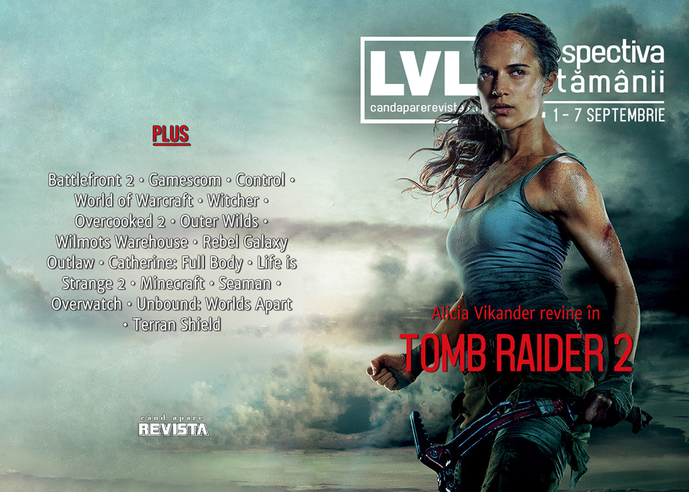

Tomb Raider 2 devine o certitudine și va intra în producție la anul, Electronic Arts intră în Cartea Recordurilor, dar în sens negativ, lumea vorbește încă despre Control și World of Warcraft, aflăm povestea vânzării Origin Systems către Electronic Arts din 1992 și avem un Kickstarter nou pentru un joc românesc: Terran Shield.

Linkuri rapide:

* [Știri](#știri)
* [Articole (critică, dev, design)](#articole-critică-dev-design)
* [Made în România](#made-în-românia)
* [Anunţuri şi lansări de jocuri](#anunțuri-și-lansări-de-jocuri)
* [Prăvălii de jocuri](#prăvălii-de-jocuri)

## Știri

* Alicia Vikander revine în continuarea Tomb Raider-ului din 2018, care are acum un regizor în persoana lui Ben Wheatley și care va apărea în 2021. ([PC Gamer](https://www.pcgamer.com/alicia-vikander-tomb-raider-sequel-confirmed-for-2021/), [Destructoid](https://www.destructoid.com/kill-list-s-ben-wheatley-directing-tomb-raider-movie-sequel-for-2021-release-565903.phtml), [VideoGamesChronicle](https://www.videogameschronicle.com/news/tomb-raider-film-sequel-to-be-helmed-by-high-rise-director/))
* Postarea făcută de EA pe Reddit încercând să explice loot box-urile și sistemul de progresie din Battlefront 2 a intrat în Cartea Recordurilor Guiness drept postarea cu cele mai multe voturi negative ale platformei din istorie. ([PC Gamer](https://www.pcgamer.com/eas-infamous-defense-of-lootboxes-wins-a-guinness-world-record-for-most-downvoted-comment-on-reddit/), [Kotaku](https://kotaku.com/ea-received-a-guinness-world-record-for-most-downvoted-1837955807))
* Fostul președinte al Nintendo America, Reggie Fils-Aimé, devine profesor la Universitatea Cornell din New York, aceeași pe care a absolvit-o în urmă cu aproape 40 de ani. ([Destructoid](https://www.destructoid.com/reggie-fils-aime-returning-to-former-college-in-teaching-role-565619.phtml), [USgamer](https://www.usgamer.net/articles/reggie-fils-aimes-first-post-nintendo-gig-is-at-his-alma-mater-cornell-university))
* Ikumi Nakamura, creative director în cadrul Tango Gameworks și Zenimax, care s-a făcut remarcată prin prezentarea jocului GhostWire: Tokyo pe care a făcut-o în timpul E3-ului de anul acesta, a părăsit compania la doar câteva luni după ce a anunțat jocul la care lucrează.  ([Polygon](https://www.polygon.com/2019/9/4/20850088/e3-2019-star-ikumi-nakamura-leaving-bethesda-ghostwire-tokyo), [VideoGamesChronicle](https://www.videogameschronicle.com/news/ghostwire-tokyo-creative-director-leaves-tango-gameworks/), [GamesIndustry.biz](https://www.gamesindustry.biz/articles/2019-09-05-ikumi-nakamura-departs-tango-zenimax))

## Articole (critică, dev, design)

* [PleaseFundMe: How Crowdfunding Is Changing the Way We Talk About Games](https://egmnow.com/pleasefundme-how-crowdfunding-is-changing-the-way-we-talk-about-games/) (EGM)
* [Making Lore Personal](https://unwinnable.com/2019/09/04/making-lore-personal/) (Unwinnable)
* [‘World of Warcraft Classic’ Is a Nostalgia Trip For a Game That Doesn&#39;t Exist](https://www.vice.com/en_us/article/3kxd8y/world-of-warcraft-classic-is-a-nostalgia-trip-for-a-game-that-doesnt-exist) (Vice)
* [Opinion – An Argument Against Character Cameos In Games](https://www.gameinformer.com/2019/09/06/opinion-an-argument-against-character-cameos-in-games) (Games Informer)
* [What's the game equivalent of the cut?](https://www.eurogamer.net/articles/2019-09-07-whats-the-game-equivalent-of-the-cut) (Eurogamer)
* [The Pernicious, Persistent Myth That Games Will Break Our Brains](https://egmnow.com/the-pernicious-persistent-myth-that-games-will-break-our-brains/) (EGM)

---

### Actualitate
* [Gamescom&#8217;s best of the rest: the coolest indies round up](https://www.rockpapershotgun.com/2019/09/05/gamescoms-best-of-the-rest-the-coolest-indies-round-up/) (RPS)
* [The DeanBeat: A tragic but almost necessary meltdown for the game industry](https://venturebeat.com/2019/09/06/the-deanbeat-a-tragic-but-almost-necessary-meltdown-for-the-game-industry/) (VentureBeat)

---

### _Not-a-review_
* [Playing World Of Warcraft For The First Time Ever Is Wonderful](https://kotaku.com/playing-world-of-warcraft-for-the-first-time-ever-is-wo-1837866593) (Kotaku)
* [The Witching Hour Part 2 &#8211; The Last Wish](https://graceinthemachine.com/2019/09/02/the-witching-hour-part-2-the-last-wish/) (Grace In The Machine)
* [I Can&#39;t Convince My Friends That Overcooked 2 Is Fun, Not Stressful](https://kotaku.com/i-cant-convince-my-friends-that-overcooked-2-is-fun-no-1837838614) (Kotaku)
* [In Outer Wilds, Summer Camp is Home](https://videoda.me/outer-wilds-summer-camp-735794e91556) (Medium)
* [Wilmot&#39;s Warehouse Is A Great Puzzle Game](https://kotaku.com/wilmots-warehouse-is-a-great-puzzle-game-1837879681) (Kotaku)
* [&#8216;Wilmot&#8217;s Warehouse is a language game&#8217;, please discuss](https://www.rockpapershotgun.com/2019/09/04/wilmots-warehouse-is-a-language-game-please-discuss/) (RPS)
* [Rebel Galaxy Outlaw Is A Space Combat Throwback In Most Of The Best Ways](https://kotaku.com/rebel-galaxy-outlaw-is-a-space-combat-throwback-in-most-1837644320) (Kotaku)
* [Catherine: Full Body nails the joy of not doing anything](https://www.videogamer.com/features/catherine-full-body-nails-the-joy-of-not-doing-anything) (VideoGamer)
* [The Rising Reception of Life is Strange 2](https://techraptor.net/content/life-is-strange-2-michel-koch-interview) (TechRaptor)
* [I Love The Posters Found In Control](https://kotaku.com/i-love-the-posters-found-in-control-1837746677) (Kotaku)
* [The Mysterious &quot;Board&quot; in &#39;Control&#39; Is One of the Game&#39;s Best, Most Unsettling Ideas](https://www.vice.com/en_us/article/j5ypj3/control-the-board-pyramid) (Vice)
* [Control&#39;s Eerie Architecture Took Me Back To My College Days](https://kotaku.com/controls-eerie-architecture-took-me-back-to-my-college-1837926694) (Kotaku)
* [World of Warcraft Classic’s community is all about kindness ... for the most part](https://www.polygon.com/2019/9/2/20839572/world-of-warcraft-classic-community-player-culture) (Polygon)
* [WoW Classic: Returning Home](https://www.gamespace.com/reviews/wow-classic-returning-home/) (GameSpace)

---

### Industrie
* [Nick Berry interview &#8212; A data scientist confronts his own mortality](https://venturebeat.com/2019/09/02/nick-berry-interview-a-data-scientist-confronts-his-own-mortality/) (VentureBeat)
* [Report: A decade on, Minecraft could be 'more valuable than Halo' (DFC Intelligence)](https://gamedaily.biz/article/1189/report-a-decade-on-minecraft-could-be-more-valuable-than-halo-dfc-intelligence) (GameDaily.biz)
* [Tim Schafer talks Microsoft acquisition, why Japan doesn't like his games, and what's after Psychonauts 2](https://www.destructoid.com/tim-schafer-talks-microsoft-acquisition-why-japan-doesn-t-like-his-games-and-what-s-after-psychonauts-2-565976.phtml) (Destructoid)

---

### Istorie, retrospectivă
* [Remembering Microsoft Entertainment Packs, the Candy Crush of the 1990s](https://www.eurogamer.net/articles/2019-09-01-remembering-microsoft-entertainment-packs-the-candy-crush-of-the-1990s) (Eurogamer)
* [Developers and industry legends on the games that defined the last 20 years](https://www.eurogamer.net/articles/2019-09-05-developers-and-industry-legends-on-the-games-that-defined-the-last-20-years) (Eurogamer)
* [From Weird Dreams to Granny's Garden: a brief history of cursed video games](https://www.theguardian.com/games/2019/sep/06/weird-cursed-video-games-spectrum-commodore-playstation) (The Guardian)
* [E.T.: Why it was a victim of its own schedule](https://wireframe.raspberrypi.org/features/e-t-why-it-was-a-victim-of-its-own-schedule) (Wireframe magazine)
* [Origin Sells Out](https://www.filfre.net/2019/09/origin-sells-out/) (The Digital Antiquarian)
* [Seaman creator Yoot Saito on the fishy Dreamcast AI that was way ahead of its time](https://www.theverge.com/2019/9/6/20850674/yoot-saito-interview-seaman-sega-dreamcast-ai-20th-anniversary) (The Verge)
* [Searching for Scorpia — Whatever Happened to Gaming's First Celebrity Critic?](https://www.kotaku.co.uk/2019/09/06/searching-for-scorpia-whatever-happened-to-gamings-first-celebrity-critic) (Kotaku)

#### Site-ul Eurogamer a împlinit 20 de ani
* [20 years in 20 Eurogamer articles - as they appeared at the time](https://www.eurogamer.net/articles/2019-09-04-20-years-in-20-eurogamer-articles-as-they-appeared-at-the-time) (Eurogamer)
* [Eurogamer at 20: Adapting to a changing industry](https://www.gamesindustry.biz/articles/2019-09-04-eurogamer-at-20) (Eurogamer)

---

### Design, world-building, artă
* [Cartografia ca poveste: Jocurile video și hărțile care le dau viață](https://mindcraftstories.ro/index.php/2019/09/02/cartografia-ca-poveste-jocurile-video-si-hartile-care-le-dau-viata/) (Mindcraft Stories)
* [Remedy's Control is built on concrete foundations](https://www.eurogamer.net/articles/2019-09-03-remedys-control-is-built-on-concrete-foundations) (Eurogamer)
* [The UX of Overwatch Role Queue](https://www.gamasutra.com/blogs/NidaAhmad/20190830/349771/The_UX_of_Overwatch_Role_Queue.php) (Gamasutra)
* [Living Architecture](https://unwinnable.com/2019/09/06/living-architecture/) (Unwinnable)
* [Game Box Art Critique: Borderlands 3, Link&#039;s Awakening, PES 2020](https://www.videogamer.com/features/game-box-art-critique-borderlands-3-links-awakening-pes-2020) (VideoGamer)
* [Midnight Stop](https://kotaku.com/midnight-stop-1837801541) (Kotaku)

## Made în România
* Sergiu Crăițoiu de la Alien Pixel Studios a scris un articol despre campania de Kickstarter pentru **Unbound: Worlds Apart**. ([Gamasutra](https://www.gamasutra.com/blogs/SergiuCraitoiu/20190904/349792/Kickstarter_adventures_in_2019_based_on_our_game_Unbound_Worlds_Apart.php))
* Studioul Zamolxis Entertainment a demarat o campanie Kickstarter pentru jocul la care lucrează, Terran Shield, un TBS inspirat de Terror from the Deep. ([Kickstarter](https://www.kickstarter.com/projects/419885320/terran-shield-edge-of-the-abyss))

## Anunțuri și lansări de jocuri
* [All the big headlines from today's Nintendo Direct](https://www.destructoid.com/all-the-big-headlines-from-today-s-nintendo-direct-565856.phtml) (Destructoid)
* [Bioware is currently working on new several other super-secret big projects](https://www.dsogaming.com/news/bioware-is-currently-working-on-new-several-other-big-super-secret-projects/) (DSOGaming )

### Anunţate
* **Land of War: The Beginning** ([Destructoid](https://www.destructoid.com/land-of-war-the-beginning-will-be-the-first-shooter-to-focus-on-the-defense-of-poland-in-world-war-ii-565426.phtml))
* **Tales From Off-Peak City**, un joc nou de la Cosmo D ([RPS](https://www.rockpapershotgun.com/2019/09/02/tales-from-off-peak-city-will-take-us-back-to-cosmo-ds-world/))
* **Anthology of Fear** ([DSOGaming ](https://www.dsogaming.com/news/anthology-of-fear-is-a-new-first-person-psychological-horror-game-first-details-screenshots-trailer/))
* **Rogue Company**, un nou shooter multiplayer de la Hi-Rez ([DSOGaming ](https://www.dsogaming.com/news/hi-rez-studios-announces-a-new-a-new-multiplayer-shooter-rogue-company/))

### Acum cu dată de lansare
* **Little Misfortune**: 18 septembrie ([Eurogamer](https://www.eurogamer.net/articles/2019-09-02-fran-bow-devs-adorably-macabre-narrative-adventure-little-misfortune-is-out-this-month))
* **Overland**: 19 septembrie ([PC Gamer](https://www.pcgamer.com/overland-hits-the-road-on-september-19/))
* **Crying Suns**: 19 septembrie ([PC Gamer](https://www.pcgamer.com/crying-suns-the-ftl-inspired-strategy-space-opera-comes-out-this-month/))
* **Yooka-Laylee and the Impossible Lair**: 8 octombrie ([Eurogamer](https://www.eurogamer.net/articles/2019-09-03-yooka-laylee-and-the-impossible-lair-comes-to-pc-and-consoles-next-month))
* **The Legend of Bum-Bo**: 12 noiembrie ([Destructoid](https://www.destructoid.com/the-legend-of-bum-bo-trailer-reveals-november-release-date-on-pc-565772.phtml))

### Lansate
* 3 septembrie: **Children of Morta** ([Steam](https://store.steampowered.com/app/330020/Children_of_Morta/), [gog.com](https://www.gog.com/game/children_of_morta))
* 3 septembrie: **Final Fantasy VIII Remastered** ([Steam](https://store.steampowered.com/app/1026680/FINAL_FANTASY_VIII__REMASTERED/))
* 3 septembrie: **Spyro: Reignited Trilogy** ([Steam](https://store.steampowered.com/app/996580/Spyro_Reignited_Trilogy/))
* 4 septembrie: **Plants vs. Zombies: Battle for Neighborville** (early access) ([EA Store](https://www.ea.com/games/plants-vs-zombies/plants-vs-zombies-battle-for-neighborville/buy/pc))
* 5 septembrie: **Green Hell** (iese din early access) ([Steam](https://store.steampowered.com/app/815370/Green_Hell/))
* 5 septembrie: **NBA 2K20** ([Steam](https://store.steampowered.com/app/1089350/NBA_2K20/))
* 5 septembrie: **The Light Keeps Us Safe** (iese din early access) ([Steam](https://store.steampowered.com/app/853240/The_Light_Keeps_Us_Safe/))
* 5 septembrie: **Atomicrops** (early access) ([Epic Store](https://www.epicgames.com/store/en-US/product/atomicrops))
* 5 septembrie: **River City Girls** ([Steam](https://store.steampowered.com/app/1049320/River_City_Girls/))
* 5 septembrie: **WRC 8 FIA World Rally Championship** ([Epic Store](https://www.epicgames.com/store/en-US/product/wrc-8/))
* 5 septembrie: **Fantasy General II** ([Steam](https://store.steampowered.com/app/1025440/Fantasy_General_II/), [gog.com](https://www.gog.com/game/fantasy_general_ii_invasion))
* 5 septembrie: **Sin Slayers** ([Steam](https://store.steampowered.com/app/783190/Sin_Slayers/), [gog.com](https://www.gog.com/game/sin_slayers))
* 6 septembrie: **Falcon Age** ([Epic Store](https://www.epicgames.com/store/en-US/product/falcon-age/))
* 6 septembrie: **Creature in the Well** ([Steam](https://store.steampowered.com/app/852300/Creature_in_the_Well/), [gog.com](https://www.gog.com/game/creature_in_the_well))
* 9 septembrie: **Gears 5** ([Steam](https://store.steampowered.com/app/1097840/Gears_5/), [Microsoft Store](https://www.microsoft.com/ro-ro/p/gears-5-ultimate-edition-pre-order/9P29X4PJG09X))

## Prăvălii de jocuri

### Știri
* [Steam’s new, handsome “Library” update is better 16 years late than never](https://arstechnica.com/gaming/2019/09/steam-library-update-will-dynamically-sort-your-gaming-backlog-coming-sept-17/) (Ars Technica)
* [Adult visual novel removed from Steam, raising questions about Valve's inconsistent curation](https://gamedaily.biz/article/1195/adult-visual-novel-removed-from-steam-raising-questions-about-valves-inconsistent-curation) (GameDaily.biz)

### Articole
* [What convinced Ubisoft to launch its own subscription service?](https://www.gamesindustry.biz/articles/2019-09-03-what-convinced-ubisoft-to-launch-its-own-subscription-service) (GamesIndustry.biz)
* [The tricky relationship between Steam wishlists and sales](https://www.gamesindustry.biz/articles/2019-09-03-the-tricky-relationship-between-steam-wishlists-and-sales) (GamesIndustry.biz)
* [The (not) new Russian games store taking on Epic and Steam](https://www.gamesindustry.biz/articles/2019-09-05-the-not-new-russian-games-store-taking-on-epic-and-steam) (GamesIndustry.biz)
* [&#39;It Wasn&#39;t Meant To Be This Lightning Rod&#39;: Valve Developer Looks Back At Company&#39;s Epic Store Exclusivity Comments](https://kotaku.com/it-wasnt-meant-to-be-this-lightning-rod-valve-develope-1837882590) (Kotaku)
* [Steam has over 40,000 &#8216;indie&#8217; games, and this is fine](https://venturebeat.com/2019/09/06/steam-has-over-40000-indie-games-and-this-is-fine/) (VentureBeat)

### Update catalog
* [LittleBigPlanet 3, Farming Simulator 19, and more join PlayStation Now](https://egmnow.com/littlebigplanet-3-farming-simulator-19-and-more-join-playstation-now/) (EGM)
* [Gears 5, Dead Cells, and more coming this month to Xbox Game Pass for PC](http://www.pcgamer.com/gears-5-dead-cells-and-more-coming-this-month-to-xbox-game-pass-for-pc) (PC Gamer)
* [Nintendo Switch will finally get SNES games—20 of them—starting tomorrow](https://arstechnica.com/gaming/2019/09/nintendo-switch-will-finally-get-snes-games-20-of-them-starting-tomorrow/) (Ars Technica)

### Jocuri gratis și free weekends
* [Abzu and The End is Nigh are free on PC](https://egmnow.com/abzu-and-the-end-is-nigh-are-free-on-pc/) (EGM)
* [Kingdom Come Deliverance is free to play on Steam this weekend - DSOGaming](https://www.dsogaming.com/news/kingdom-come-deliverance-is-free-to-play-on-steam-this-weekend/) (DSOGaming )

### Reduceri și promoții
* [Borderlands, Pillars of Eternity and Tyranny feature in the Humble RPG Bundle](https://www.eurogamer.net/articles/2019-09-04-borderlands-pillars-of-eternity-and-tyranny-feature-in-the-humble-rpg-bundle) (Eurogamer)
* [Get Battletech for $12 in October's Humble Monthly bundle](https://www.rockpapershotgun.com/2019/09/06/battletech-humble-monthly-bundle/) (RPS)
* [Weekend PC Download Deals for Sep. 6: Kingdom Come: Deliverance free weekend](https://www.shacknews.com/article/113811/weekend-pc-download-deals-for-sep-6-kingdom-come-deliverance-free-weekend) (Shacknews)
* [Weekend Console Download Deals for Sep. 6: Free Madden NFL 20 weekend](https://www.shacknews.com/article/113809/weekend-console-download-deals-for-sep-6-free-madden-nfl-20-weekend) (Shacknews)
* [Best PC gaming deals of the week &#8211; 6th September 2019](https://www.rockpapershotgun.com/2019/09/06/best-pc-gaming-deals-of-the-week-6th-september-2019/) (RPS)

---

{}
**Retrospectiva săptămânii** este rubrica duminicală în care trecem în revistă evenimentele săptămânii de pe frontul de gaming: știri şi articole (scrise de alții, bineînțeles, că e mai ușor aşa), industrie, lansări, oferte de jocuri, toate numai de savurat la cafeaua de duminică dimineața.

De asemenea, rubrica e deschisă oricui vrea și poate contribui. Dacă ai citit vreun articol sau vreo știre interesantă și crezi că merită incluse în retrospectiva săptămânii, te așteptăm pe forum pe unul dintre topicurile dedicate: [Știri](https://forum.candaparerevista.ro/viewtopic.php?f=4&t=46), [Articole](https://forum.candaparerevista.ro/viewtopic.php?f=4&t=206), [Gaming România](https://forum.candaparerevista.ro/viewtopic.php?f=4&t=1622)].
{}
