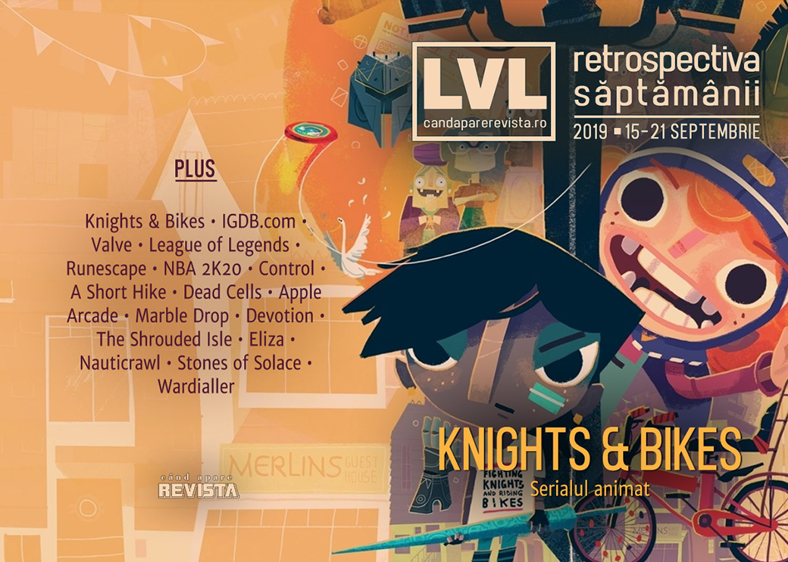

Indie-ul proaspăt publicat de Double Fine devine un serial animat, Twitch cumpără igdb.com, iar un tribunal francez dă un verdict care ar putea schimba felul în care cumpărăm și folosim jocurile pe Steam. De asemenea, s-a lansat Apple Arcade, aflăm câți bani au plătit Epic Store pentru exclusivitatea lui Control, s-au lansat o mulțime de jocuri, a fost anunțat un nou joc Total War și avem în sfârșit o dată de lansare pentru Disco Elysium.

Linkuri rapide:

* [Știri](#știri)
* [Articole (critică, dev, design)](#articole-critică-dev-design)
* [Made în România](#made-în-românia)
* [Anunţuri şi lansări de jocuri](#anunțuri-și-lansări-de-jocuri)
* [Prăvălii de jocuri](#prăvălii-de-jocuri)

## Știri

* Proaspăt lansat, **Knights & Bikes** publicat de Double Fine devine acum un serial animat produs de un studio britanic. ([Destructoid](https://www.destructoid.com/knights-bikes-to-be-adapted-into-animated-tv-series-567110.phtml), [PC Gamer](https://www.pcgamer.com/knights-and-bikes-might-be-getting-a-cartoon-spin-off/), [Eurogamer](https://www.eurogamer.net/articles/2019-09-17-knights-and-bikes-is-getting-an-animated-tv-series))
* Twitch a cumpărat site-ul IGDB.com (The Internet Game Database). ([PC Gamer](https://www.pcgamer.com/twitch-has-acquired-the-internet-gaming-database/), [PCGamesInsider.biz](https://www.pcgamesinsider.biz/news/69700/twitch-acquires-the-internet-gaming-database/), [Game World Observer](https://gameworldobserver.com/2019/09/19/twitch-acquires-igdb/), [VentureBeat](https://venturebeat.com/2019/09/19/twitch-acquires-igdb/))
* Un verdict al unui tribunal francez obligă Valve să permită utilizatorilor să-și vândă jocurile pe care le-au cumpărat pe Steam. Procesul a fost inițiat de o organizație franceză ce militează pentru drepturile consumatorilor. Verdictul nu e final și Valve au anunțat deja că îl vor contesta, dar ar putea avea consecințe majore pentru toți utilizatorii (cel puțin cei europeni) ai Steam dacă va fi menținut. ([Polygon](https://www.polygon.com/2019/9/19/20874384/french-court-steam-valve-used-games-eu-law), [Eurogamer](https://www.eurogamer.net/articles/2019-09-19-french-court-rules-steam-users-have-right-to-resell-their-games), [GameDaily.biz](https://gamedaily.biz/article/1227/steam-must-allow-users-to-resell-their-games-says-french-court), [Kotaku](https://kotaku.com/french-court-says-valve-must-allow-steam-users-to-resel-1838259529), [RPS](https://www.rockpapershotgun.com/2019/09/19/steam-should-let-users-resell-games-french-court-rules/), [GamesIndustry.biz](https://www.gamesindustry.biz/articles/2019-09-19-french-court-rules-countrys-steam-users-can-resell-their-games))
* League of Legends ajunge la 8 milioane de jucători simultani, ceea ce-i consolidează statutul de cel mai popular joc pentru PC (doar o clonă de Counter-Strike din Asia se mai poate lăuda cu cifre asemănătoare). ([PC Gamer](https://www.pcgamer.com/8-million-people-play-league-of-legends-every-day-making-it-the-most-popular-game-on-pc/))
* Producătorii lui Football Manager 2020, Sega și Sports Interactive, anunță că au dezvoltat un nou ambalaj pentru jocurile fizice mult mai prietenos cu mediul, care nu folosește plastic, și îndeamnă toți actorii din industrie să abandoneze actualele ambalaje din plastic. ([Ars Technica](https://arstechnica.com/gaming/2019/09/football-manager-nixes-plastic-for-eco-friendly-cardboard-game-package/), [PCGamesInsider.biz](https://www.pcgamesinsider.biz/news/69698/football-manager-2020s-packaging-will-be-100-recyclable/), [GamesIndustry.biz](https://www.gamesindustry.biz/articles/2019-09-17-football-manager-boss-miles-jacobson-calls-for-an-end-to-plastic-packaging))

## Articole (critică, dev, design)

* [How EA and Plants vs. Zombies are battling binge culture](https://www.polygon.com/2019/9/11/20859185/plants-vs-zombies-ea-release-neighborville) (Polygon)
* [The Platforming Genre That Might Have Been](https://unwinnable.com/2019/09/19/the-platforming-genre-that-might-have-been/) (Unwinnable)
* [The Truth About Video Games and Violent Crime](https://remptongames.com/2019/09/08/the-truth-about-video-games-and-violent-crime/) (Rempton Games)
* [Fan-made: when gamers become developers](https://wireframe.raspberrypi.org/features/fan-made-when-gamers-become-developers) (Wireframe magazine)

---

### Actualitate
* [Apple Arcade invests in developers while ensuring studios retain rights to their games](https://gamedaily.biz/article/1221/apple-arcade-invests-in-developers-while-ensuring-studios-retain-rights-to-their-games) (GameDaily.biz)
* [Apple Arcade is Mobile Gaming Without All the Bullshit](https://www.kotaku.co.uk/2019/09/19/apple-arcade-is-mobile-gaming-without-all-the-bullshit) (Kotaku)
* [A Major Legal Battle May Change How Digital Game Sales Work](https://www.wired.com/story/valve-resell-digital-games/) (Wired)
* [Apple Arcade is great because developers have steadily made iOS an amazing platform](https://www.eurogamer.net/articles/2019-09-21-apple-arcade-is-great-because-developers-have-steadily-made-ios-an-amazing-platform) (Eurogamer)

---

### Reportaj
* [Player Spends $62,000 In Runescape, Reigniting Community Anger Around Microtransactions](https://kotaku.com/player-spends-62-000-in-runescape-reigniting-communit-1838227818) (Kotaku)

---

### _Not-a-review_
* [The unavoidable reality behind NBA 2K20’s avoidable microtransactions](https://www.polygon.com/2019/9/15/20867492/nba-2k20-microtransactions-mycareer-virtual-currency-mtx-2k-sports-ps4-xbox-one-pc) (Polygon)
* [Most video games ask me to do everything, which makes doing nothing so fun](https://www.polygon.com/2019/9/14/20864555/a-short-hike-how-to-do-nothing-impressions) (Polygon)
* [The Creepypasta Community That Influenced Control](https://kotaku.com/the-creepypasta-community-that-influenced-control-1838283594) (Kotaku)
* [Object of Power](http://deep-hell.com/oops/) (Deep Hell)

---

### Industrie
* ['This industry has a problem with abuse': dealing with gaming's #MeToo moment](https://www.theguardian.com/games/2019/sep/17/gaming-metoo-moment-harassment-women-in-games) (The Guardian)
* [Too Big to Bail: Why Dead Cells’ Creators Built an Evil Empire](https://egmnow.com/too-big-to-bail-why-dead-cells-creators-built-an-evil-empire/) (EGM)
* [Indie game pricing is in a familiar death spiral](https://www.gamesindustry.biz/articles/2019-09-18-indie-game-pricing-is-in-a-familiar-death-spiral-opinion) (GamesIndustry.biz)
* [Is it time to retire virtual currency?](https://www.gamesindustry.biz/articles/2019-09-20-is-it-time-to-retire-virtual-currency) (GamesIndustry.biz)
* [The DeanBeat: After all these years, Hollywood still doesn&#8217;t get games](https://venturebeat.com/2019/09/20/the-deanbeat-after-all-these-years-hollywood-still-doesnt-get-games/) (VentureBeat)

---

### Istorie, retrospectivă
* [20 years later, Command & Conquer: Tiberian Sun is still a frightening prophecy](https://www.eurogamer.net/articles/2019-09-16-20-years-later-command-and-conquer-tiberian-sun-is-still-a-frightening-prophecy) (Eurogamer)
* [Arcade Perfect: How Pac-Man was ported to consoles](https://www.videogameschronicle.com/features/arcade-perfect-how-pac-man-was-ported-to-consoles/) (VideoGamesChronicle), plus [Arcade perfect: charting the often tortured journey of old school ports](https://www.eurogamer.net/articles/2019-09-15-arcade-perfect-charting-the-often-tortured-journey-of-old-school-ports) (Eurogamer)
* [A Panel Shaped Screen: remembering the sprite comics of the mid-2000s](https://www.rockpapershotgun.com/2019/09/19/a-panel-shaped-screen-the-games-we-use-to-make-comics/) (RPS)
* [Marble Drop](https://obscuritory.com/puzzle/marble-drop/) (The Obscuritory)
* [The Game Archaeologist: The day Dungeons and Dragons Online dropped the free-to-play bomb](https://massivelyop.com/2019/09/21/the-game-archaeologist-the-day-dungeons-and-dragons-online-dropped-the-free-to-play-bomb/) (Massively OP)

---

### Dev, making of, mecanici
* [The making of Devotion, China's least favourite horror game](https://www.eurogamer.net/articles/2019-09-16-the-making-of-devotion-chinas-least-favourite-horror-game) (Eurogamer)
* [Video: Crafting emergent tragedies in Kitfox's  The Shrouded Isle](https://www.gamasutra.com/view/news/350821/Video_Crafting_emergent_tragedies_in_Kitfoxs_The_Shrouded_Isle.php) (Gamasutra)
* [Control  freak: Inside the narrative design of Remedy's least linear game](https://www.gamasutra.com/view/news/350785/Control_freak_Inside_the_narrative_design_of_Remedys_least_linear_game.php) (Gamasutra)
* [Eliza developer Matthew Burns on stress, choices that matter, and language of games](https://gameworldobserver.com/2019/09/13/matthew-burns/) (Game World Observer)
* [Deep dive: a chat with the creator of Nauticrawl](https://wireframe.raspberrypi.org/features/deep-dive-a-chat-with-the-creator-of-nauticrawl) (Wireframe magazine)

---

### Design, world-building, artă
* [The Witcher, Only It&#39;s The 1980s](https://kotaku.com/the-witcher-only-its-the-1980s-1838086332) (Kotaku)

## Made în România

* Zamolxis Entertainment Studious au relansat campania Kickstarter pentru **Terran Shield** cu o țintă de finanțare mult mai redusă. ([Kickstarter](https://www.kickstarter.com/projects/419885320/terran-shield-edge-of-the-abyss-0))

## Anunţuri şi lansări de jocuri
### Anunţate
* **Taxi Simulator** ([Steam](https://store.steampowered.com/app/1159390/Taxi_Simulator/))
* **Mondo Museum** ([TechRaptor](https://techraptor.net/content/mondo-museum-release-date-2020-steam))
* **Enemy On Board** ([GameSpace](https://www.gamespace.com/all-articles/news/windwalk-games-enemy-on-board/))
* **Morels: The Hunt** ([PC Gamer](https://www.pcgamer.com/get-ready-for-a-game-about-hunting-the-most-dangerous-prey-of-all-mushrooms/))
* **Narcos: Rise of the Cartels** ([DSOGaming ](https://www.dsogaming.com/news/netflix-narcos-rise-of-the-cartels-is-a-new-turn-based-strategy-game-coming-to-the-pc-in-late-2019/))
* **Terminator: Resistance** ([Eurogamer](https://www.eurogamer.net/articles/2019-09-19-terminator-resistance-is-a-single-player-fps-set-31-years-after-judgment-day))
* **A Total War Saga: Troy** ([Eurogamer](https://www.eurogamer.net/articles/2019-09-19-a-total-war-saga-troy-will-lay-siege-to-your-pc-in-2020), [EGM](https://egmnow.com/total-war-saga-troy-announced-for-pc/))

### Acum cu dată de lansare
* **Neo Cab**: 3 octombrie ([TechRaptor](https://techraptor.net/content/neo-cab-release-date-free-demo))
* **John Wick Hex**: 8 octombrie ([Eurogamer](https://www.eurogamer.net/articles/2019-09-19-john-wick-hex-gets-an-october-release-date))
* **Disco Elysium**: 15 octombrie ([Eurogamer](https://www.eurogamer.net/articles/2019-09-18-disco-elysium-release-date-set-for-october))

### Lansate
* 16 septembrie: **Nauticrawl** ([Steam](https://store.steampowered.com/app/922100/Nauticrawl/))
* 17 septembrie: **Rebel Cops** ([Steam](https://store.steampowered.com/app/970960/Rebel_Cops/), [gog.com](https://www.gog.com/game/rebel_cops))
* 17 septembrie: **Showdown Bandit** ([Steam](https://store.steampowered.com/app/1076280/Showdown_Bandit/))
* 17 septembrie: **Daymare: 1998** ([Steam](https://store.steampowered.com/app/842100/Daymare_1998/))
* 18 septembrie: **Little Misfortune** ([Steam](https://store.steampowered.com/app/714120/Little_Misfortune/), [gog.com](https://www.gog.com/game/little_misfortune))
* 18 septembrie: **AI: The Somnium Files** ([Steam](https://store.steampowered.com/app/948740/AI_The_Somnium_Files/))
* 19 septembrie: **Crying Suns** ([Steam](https://store.steampowered.com/app/873940/Crying_Suns/), [gog.com](https://www.gog.com/game/crying_suns))
* 19 septembrie: **Sayonara Wild Hearts** ([Nintendo Store](https://www.nintendo.com/games/detail/sayonara-wild-hearts-switch/))
* 19 septembrie: **Overland** ([Steam](https://store.steampowered.com/app/355680/Overland/), [gog.com](http://www.gog.com/news/release_boverlandb))
* 19 septembrie: **Hot Lava** ([Steam](https://store.steampowered.com/app/382560/Hot_Lava/))
* 19 septembrie: **Mutazione** ([Steam](https://store.steampowered.com/app/1080750/Mutazione/), [gog.com](https://www.gog.com/game/mutazione))
* 19 septembrie: **Jenny LeClue** ([Steam](https://store.steampowered.com/app/319870/Jenny_LeClue__Detectivu/), [gog.com](https://www.gog.com/game/jenny_leclue_detectivu))
* 19 septembrie: **PlanetSide Arena** (early access) ([Steam](https://store.steampowered.com/app/987350/PlanetSide_Arena/))
* 20 septembrie: **Ni no Kuni Wrath of the White Witch Remastered** ([Steam](https://store.steampowered.com/app/798460/Ni_no_Kuni_Wrath_of_the_White_Witch_Remastered/))
* 19 septembrie: **Cardpocalypse** ([Epic Store](https://www.epicgames.com/store/en-US/product/cardpocalypse/))
* 19 septembrie: **Police Stories** ([Steam](https://store.steampowered.com/app/539470/Police_Stories/))
* 20 septembrie: **Untitled Goose Game** ([Nintendo Store](https://www.nintendo.com/games/detail/untitled-goose-game-switch/), [Steam](https://store.steampowered.com/app/837470/Untitled_Goose_Game/))
* 20 septembrie: **The Legend of Zelda: Link's Awakening** ([Nintendo Store](https://www.nintendo.com/games/detail/the-legend-of-zelda-links-awakening-switch/))
* 20 septembrie: **Untitled Goose Game** ([Epic Store](https://www.epicgames.com/store/en-US/product/untitled-goose-game))
* 20 septembrie: **Sojourn** ([Epic Store](https://www.epicgames.com/store/en-US/product/the-sojourn/))

## Prăvălii de jocuri
### Știri
* [Rockstar rolls out its new PC launcher, gives away San Andreas to anyone who installs it](https://www.destructoid.com/rockstar-rolls-out-its-new-pc-launcher-gives-away-san-andreas-to-anyone-who-installs-it-567136.phtml) (Destructoid)
* [Steam's Discovery update is making things worse for some indie developers](https://www.pcgamer.com/steams-discovery-update-is-making-things-worse-for-some-indie-developers/) (PC Gamer)
* [GOG Galaxy 2.0 now supports “basically any game in existence,” from Steam to NES](https://www.pcgamesn.com/gog-galaxy-2-update) (PCGamesN)
* [Steam releases Labs 005 Deep Dive and 006 Search functions](https://www.shacknews.com/article/114036/steam-releases-labs-005-deep-dive-and-006-search-functions) (Shacknews)
* [Epic seems to have paid $10.5 million for Control’s PC exclusivity](https://arstechnica.com/gaming/2019/09/epic-seems-to-have-paid-10-5-million-for-controls-pc-exclusivity/) (Ars Technica)

### Articole
* [Why Russia&#039;s My.Games has entered the store wars](https://www.pcgamesinsider.biz/interviews-and-opinion/69694/why-russias-mygames-has-entered-the-store-wars/) (PCGamesInsider.biz)

### Update catalog
* [Here’s the full list of games coming to Apple Arcade on launch day](https://www.polygon.com/apple/2019/9/17/20870210/apple-arcade-line-up-full-list-release-date-november-19) (Polygon)
* [Anthem is now part of EA’s cheapest Origin Access subscription](https://www.pcgamesn.com/anthem/origin-access) (PCGamesN)

### Jocuri gratis și free weekends
* [Hack the '80s internet in free hacking adventure Wardialler](https://www.pcgamer.com/hack-the-80s-internet-in-free-hacking-adventure-wardialler/) (PC Gamer)
* [Humble Bundle Features Building Games and Portals](https://techraptor.net/content/humble-bundle-features-building-games-and-portals) (TechRaptor)
* [Six Batman games are now free on the Epic Games Store, Metro 2033 Redux free next week](https://www.dsogaming.com/news/six-batman-games-are-now-free-on-the-epic-games-store-metro-2033-redux-free-next-week/) (DSOGaming )
* [Conan Exiles and Conan: Unconquered are free to play on Steam this weekend](https://www.dsogaming.com/news/conan-exiles-and-conan-unconquered-are-free-to-play-on-steam-this-weekend/) (DSOGaming )
* [Commune with the animal gods in free ritual game Stones of Solace](https://www.pcgamer.com/commune-with-the-animal-gods-in-free-ritual-game-stones-of-solace/) (PC Gamer)

### Reduceri și promoții
* [Weekend Console Deals for Sep. 20: Untitled Goose Game launch discount](https://www.shacknews.com/article/114052/weekend-console-deals-for-sep-20-untitled-goose-game-launch-discount) (Shacknews)
* [Weekend PC Download Deals for Sep. 20: Batman's 80th Anniversary](https://www.shacknews.com/article/114056/weekend-pc-download-deals-for-sep-20-batmans-80th-anniversary) (Shacknews)
* [Best PC gaming deals of the week &#8211; 20th September 2019](https://www.rockpapershotgun.com/2019/09/20/best-pc-gaming-deals-of-the-week-20th-september-2019/) (RPS)

---

{}
**Retrospectiva săptămânii** este rubrica duminicală în care trecem în revistă evenimentele săptămânii de pe frontul de gaming: știri şi articole (scrise de alții, bineînțeles, că e mai ușor aşa), industrie, lansări, oferte de jocuri, toate numai de savurat la cafeaua de duminică dimineața.

De asemenea, rubrica e deschisă oricui vrea și poate contribui. Dacă ai citit vreun articol sau vreo știre interesantă și crezi că merită incluse în retrospectiva săptămânii, te așteptăm pe forum pe unul dintre topicurile dedicate: [Știri](https://forum.candaparerevista.ro/viewtopic.php?f=4&t=46), [Articole](https://forum.candaparerevista.ro/viewtopic.php?f=4&t=206), [Gaming România](https://forum.candaparerevista.ro/viewtopic.php?f=4&t=1622)].
{}
