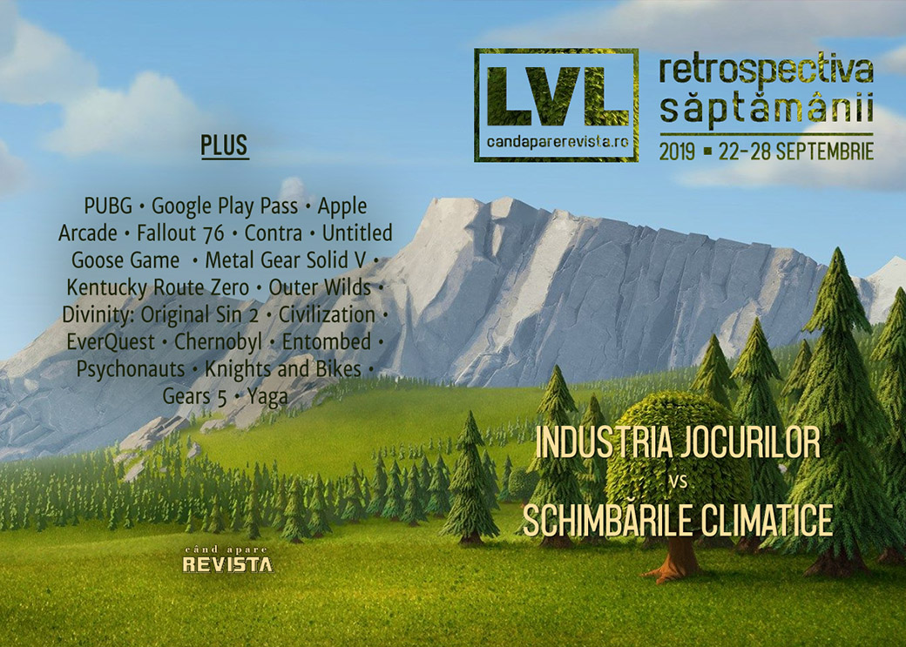

Marile companii din industria jocurilor anunță măsuri pentru combaterea schimbărilor climatice, Google își lansează propriul abonament care să concureze cu Apple Arcade, filmul-joc Bandersnatch câștigă premii Emmy, Fallout 76 riscă să omoare oameni și IRL, Shacknews publică un nou mega-articol, de data asta despre EverQuest, iar **Yaga** e primul joc românesc pe Epic Store.

Linkuri rapide:

* [Știri](#știri)
* [Articole (critică, dev, design)](#articole-critică-dev-design)
* [Made în România](#made-în-românia)
* [Anunţuri şi lansări de jocuri](#anunțuri-și-lansări-de-jocuri)
* [Prăvălii de jocuri](#prăvălii-de-jocuri)

## Știri

* Un număr de companii din industria jocurilor, printre care nume importante precum Sony, Microsoft, Google Stadia, Ubisoft sau Twitch,  au anunțat inițiativa „Playing For The Planet Alliance” sub egida ONU, care își propune creșterea gradului de conștientizare a schimbărilor climatice și reducerea emisiilor de carbon. ([VideoGamesChronicle](https://www.videogameschronicle.com/news/playstation-xbox-and-make-climate-change-commitments/), [Game World Observer](https://gameworldobserver.com/2019/09/23/video-games-climate-change/), [GamesIndustry.biz](https://www.gamesindustry.biz/articles/2019-09-23-playstation-xbox-stadia-and-more-sign-up-to-united-nations-climate-change-initiative), [PCGamesInsider.biz](https://www.pcgamesinsider.biz/news/69725/xbox-playstation-ubisoft-google-and-twitch-among-game-firms-making-climate-change-commitments/), [Gamasutra](https://www.gamasutra.com/view/news/350978/21_game_companies_join_Playing_for_the_Planet_Alliance_to_combat_climate_change.php))
* PUBG Mobile devine primul joc battle royale pentru dispozitive mobile care obține venituri de 1 miliard de dolari. ([GamesIndustry.biz](https://www.gamesindustry.biz/articles/2019-09-23-pubg-becomes-first-mobile-battle-royale-to-surpass-usd1bn-revenue), [GamesIndustry.biz](https://www.gamesindustry.biz/articles/2019-09-23-pubg-becomes-first-mobile-battle-royale-to-surpass-usd1bn-revenue))
* Google lansează un abonament de acces la un număr de aplicații de Android. Se numește Play Pass, costă 5 dolari/lună și oferă acces complet la mai mult de 350 de jocuri și aplicații, printre care Stardew Valley, Monument Valley, Limbo și multe altele. ([Blog Google](https://blog.google/products/google-play/google-play-pass-enjoy-apps-and-games-without-ads-or-app-purchases/), [Ars Technica](https://arstechnica.com/gaming/2019/09/google-play-pass-on-android-5mo-for-350-games-apps-sans-microtransactions/), [Shacknews](https://www.shacknews.com/article/114091/new-google-play-pass-subscription-bundles-350-apps), [Destructoid](https://www.destructoid.com/google-is-launching-a-5-per-month-play-pass-for-android-users-567724.phtml), [Eurogamer](https://www.eurogamer.net/articles/2019-09-23-google-launching-play-pass-game-and-app-subscription-service-for-android-this-week))
* Black Mirror Bandersnatch câștigă 2 premii Emmy, printre care și cel pentru Cel mai bun film pentru televiziune. ([VideoGamesChronicle](https://www.videogameschronicle.com/news/black-mirror-bandersnatch-wins-2-emmy-awards/), [Polygon](https://www.polygon.com/2019/9/22/20874803/bandersnatch-black-mirror-netflix-best-tv-movie-winner-emmys-2019))
* O cască de colecție pentru Fallout 76 vândută de GameStop a fost retrasă de la vânzare din cauza unor riscuri de a dezvolta mucegaiuri periculoase pentru sănătate. ([Vice](https://www.vice.com/en_us/article/bjwdxw/fallout-helmet-sold-by-gamestop-recalled-because-its-prone-to-growing-mold), [DSOGaming ](https://www.dsogaming.com/news/fallout-76-nuka-cola-edition-helmet-is-being-recalled/), [The Verge](https://www.theverge.com/2019/9/25/20883431/fallout-76-helmet-recalled-mold-gamestop))

## Articole (critică, dev, design)

* [Pleasure to Burn: Why Campfires Are so Ubiquitous in Games](https://egmnow.com/pleasure-to-burn-why-campfires-are-so-ubiquitous-in-games/) (EGM)
* [Game preservation and the quest for immortality](https://historianon.wordpress.com/2019/09/24/game-preservation-and-the-quest-for-immortality/) (Historian On Games)
* [How games like Minecraft and No Man’s Sky help players connect to their worlds](https://www.theverge.com/2019/9/24/20880104/minecraft-no-mans-sky-building-games-new-perspective) (The Verge)
* [Why are we seeing more and more video game remakes?](https://www.vg247.com/2019/09/24/video-game-remakes/) (VG247)
* [Live Services, Roadmaps and Broken Promises](http://www.vgchartz.com/article/440701/live-services-roadmaps-and-broken-promises/) (VGChartz)

---

### Actualitate
* [Video Game Companies Vow Action On Climate Change, But Critics Say They Need To Do More](https://kotaku.com/video-game-companies-vow-action-on-climate-change-but-1838420425) (Kotaku)
* [Can game makers rise to meet the challenge of climate change?](https://www.gamesindustry.biz/articles/2019-09-27-can-game-makers-rise-to-the-challenge-of-climate-change) (GamesIndustry.biz)
* [Google Play Pass is the answer to Apple Arcade without the exclusives](https://gamedaily.biz/article/1236/google-play-pass-is-the-answer-to-apple-arcade-without-the-exclusives) (GameDaily.biz)

---

### _Not-a-review_
* [A Birdwatcher&#39;s Review of Untitled Goose Game](https://gizmodo.com/a-birdwatchers-review-of-untitled-goose-game-1838402227) (Gizmodo)
* [With its final puzzle, Untitled Goose Game becomes a masterpiece of the stealth genre](https://games.avclub.com/with-its-final-puzzle-untitled-goose-game-becomes-a-ma-1838423723) (A.V. Club)
* [You don&#8217;t play Untitled Goose Game; you perform it](https://venturebeat.com/2019/09/26/you-dont-play-untitled-goose-game-you-perform-it/) (VentureBeat)
* [Gone for Good: The Phantom Pain of Peace in Metal Gear Solid V](https://egmnow.com/gone-for-good-the-phantom-pain-of-peace-in-metal-gear-solid-v/) (EGM)
* [Outer Wilds Helped Me Understand the Relationship Between Progress and Purpose](http://www.firstpersonscholar.com/outer-wilds-progress-and-purpose/) (First Person Scholar)
* [Kentucky Route Zero](https://www.critical-distance.com/2019/09/26/kentucky-route-zero/) (Critical Distance)
* [Divinity: Original Sin 2’s Switch cross-save signals the future of gaming](https://www.pcgamesn.com/divinity-original-sin-2/switch-port-pc) (PCGamesN)

---

### Industrie
* [Apple Arcade Makes You Ask, What Is a Videogame Worth?](https://www.wired.com/story/apple-arcade-videogame-value/) (Wired)
* [On love, death, sustaining an indie studio and following Keanu Reeves onstage](https://www.eurogamer.net/articles/2019-09-27-on-love-death-sustaining-an-indie-studio-and-following-keanu-reeves-onstage) (Eurogamer)
* [Fig CEO: &quot;The Kickstarter model sets game developers up to fail&quot;](https://www.gamesindustry.biz/articles/2019-09-26-the-kickstarter-model-sets-game-developers-up-to-fail) (GamesIndustry.biz)
* [Finding Time for Games and &quot;Sweet Revenge:&quot; An Interview with Double Fine&#039;s Tim Schafer](https://www.usgamer.net/articles/finding-time-for-games-and-sweet-revenge-an-interview-with-double-fines-tim-schafer) (USgamer)
* [Contra: Rogue Corps director on the game’s origins, E3 2011 tease, working on the series for over 25 years, more](https://nintendoeverything.com/interview-contra-rogue-corps-director-on-the-games-origins-e3-2011-tease-working-on-the-series-for-over-25-years-more/) (Nintendo Everything)

---

### Istorie, retrospectivă
* [Video: Ars talks Civilization with the man himself: Sid Meier](https://arstechnica.com/gaming/2019/09/video-ars-talks-civilization-with-the-man-himself-sid-meier/) (Ars Technica)
* [Returning to Greenvale 9 Years Later with Deadly Premonition Origins](https://www.hardcoregamer.com/2019/09/25/returning-to-greenvale-9-years-later-with-deadly-premonition-origins/358330/) (Hardcore Gamer)
* [Better Together: Stories of EverQuest](https://www.shacknews.com/article/110494/better-together-stories-of-everquest) (Shacknews)
* [In a 1987 video game, Chernobyl’s nuclear reactor was nearly impossible to blow up](https://games.avclub.com/in-a-1987-video-game-chernobyl-s-nuclear-reactor-was-n-1838124865) (A.V. Club)
* [Why Were Old PCs Beige?](https://www.kotaku.co.uk/2019/09/26/why-were-old-pcs-beige) (Kotaku)
* [The mysterious origins of an uncrackable video game](http://www.bbc.com/future/story/20190919-the-maze-puzzle-hidden-within-an-early-video-game) (BBC)

---

### Dev, making of, mecanici
* [How a joke about the milkman inspired Psychonauts' best level](https://www.pcgamer.com/how-a-joke-about-the-milkman-inspired-psychonauts-best-level/) (PC Gamer)
* [How Untitled Goose Game adapted Debussy for its dynamic soundtrack](https://www.theverge.com/2019/9/23/20879792/untitled-goose-game-nintendo-switch-debussy) (The Verge)
* [The beautifully simple secret of Untitled Goose Game’s success](https://www.polygon.com/interviews/2019/9/27/20887298/untitled-goose-game-success-house-interview-comedy-nintendo-switch-pc-mac) (Polygon)
* [Silicon Valley And &#39;Skepticism For Disruption&#39; Inspired This Futuristic Taxi Game](https://kotaku.com/silicon-valley-and-skepticism-for-disruption-inspired-t-1838497612) (Kotaku)
* [Knights And Bikes:  Turning aesthetic mood into gameplay](https://www.gamasutra.com/view/news/350572/Knights_And_Bikes_Turning_aesthetic_mood_into_gameplay.php) (Gamasutra)
* ['It was the right choice': how the Gears 5 team built a credible female hero](https://www.theguardian.com/games/2019/sep/26/how-the-gears-5-team-built-a-credible-female-hero) (The Guardian)
* [Combat, co-op, and proc gen: Inside the design of  Remnant: From the Ashes](https://www.gamasutra.com/view/news/350883/Combat_coop_and_proc_gen_Inside_the_design_of_Remnant_From_the_Ashes.php) (Gamasutra)
* [Raven Software devs look back at the making of  Jedi Outcast](https://www.gamasutra.com/view/news/351134/Raven_Software_devs_look_back_at_the_making_of_Jedi_Outcast.php) (Gamasutra)
* [How Gears of War changed to become Xbox Game Pass’ biggest launch](https://www.polygon.com/xbox-one/2019/9/28/20889044/gears-5-xbox-game-pass-multiplayer-boot-camp-xbox-one-pc) (Polygon)

---

### Design, world-building, artă
* [The Art Of Control](https://kotaku.com/the-art-of-control-1838340502) (Kotaku)
* [The Art Of Borderlands 3](https://kotaku.com/the-art-of-borderlands-3-1838379304) (Kotaku)
* [World of Warcraft’s Classic experience is being chronicled by a fan artist](https://www.polygon.com/2019/9/23/20875807/world-of-warcraft-classic-experience-fan-art) (Polygon)

## Made în România

* **Yaga** e primul joc românesc pe Epic Store și are pagină pentru pre-comenzi. ([GameSpace](https://www.gamespace.com/all-articles/news/yagas-action-blacksmithing-is-taking-pre-orders-now), [Epic Store](https://www.epicgames.com/store/en-US/product/yaga))

## Anunţuri şi lansări de jocuri
### Anunţate
* **Help Will Come Tomorrow** ([PC Gamer](https://www.pcgamer.com/help-will-come-tomorrow-is-a-story-driven-survival-game-set-in-pre-revolution-russia/))
* **Vendetta 1943** ([DSOGaming ](https://www.dsogaming.com/news/vendetta-1943-is-a-new-first-person-ww2-game-gets-debut-gameplay-trailer-and-screenshots/))
* **Project Haven** ([DSOGaming ](https://www.dsogaming.com/news/project-haven-is-a-new-tactical-turn-based-rpg-first-details-screenshots-and-gameplay-trailer/))

### Acum cu dată de lansare
* **What The Golf?**: 1 octombrie ([RPS](https://www.rockpapershotgun.com/2019/09/21/what-the-golf-tumbles-into-stores-in-october/))
* **Valfaris**: 10 octombrie ([DSOGaming ](https://www.dsogaming.com/news/2d-heavy-metal-action-platformer-valfaris-releases-on-october-10th/))
* **Grandia 1** și **2 HD**: 15 octombrie ([Eurogamer](https://www.eurogamer.net/articles/2019-09-23-grandia-1-and-2-hd-remasters-gets-october-release-date-on-pc))
* **Felix The Reaper**: 17 octombrie ([RPS](https://www.rockpapershotgun.com/2019/09/25/felix-the-reaper-begins-his-dance-with-death-next-month/))
* **Six Ages**: 17 octombrie ([PC Gamer](https://www.pcgamer.com/six-ages-release-date/))
* **Autonauts**: 17 octombrie ([PC Gamer](https://www.pcgamer.com/cute-colony-management-game-autonauts-is-launching-in-october/))
* **The Jackbox Party Pack 6**: 17 octombrie ([EGM](https://egmnow.com/the-jackbox-party-pack-6-launches-next-month/))
* **The Long Dark Episode Three: Crossroads Elegy**: 22 octombrie ([Shacknews](https://www.shacknews.com/article/114088/the-long-dark-episode-three-crossroads-elegy-coming-in-october))

### Amânate
* **Last Oasis**: „2020” în loc de octombrie ([PC Gamer](https://www.pcgamer.com/last-oasis-early-access-has-been-delayed-until-2020/))

### Anulate
* **notmycar** se închide pe 30 septembrie ([GameSpace](https://www.gamespace.com/all-articles/news/notmycar-game-is-driving-into-the-sunset-on-september-30th))

### Lansate
* 24 septembrie: **Contra Rogue Corps** ([Steam](https://store.steampowered.com/app/1020540/CONTRA_ROGUE_CORPS/))
* 24 septembrie: **FIFA 20** ([EA Store](https://www.ea.com/en-gb/games/fifa/fifa-20))
* 24 septembrie: **The Surge 2** ([Steam](https://store.steampowered.com/app/644830/The_Surge_2/))
* 24 septembrie: **Cat Quest II** ([Steam](https://store.steampowered.com/app/914710/Cat_Quest_II/))
* 24 septembrie: **Noita** (early access) ([Steam](https://store.steampowered.com/app/881100/Noita/), [gog.com](https://www.gog.com/game/noita))
* 24 septembrie: **Power Rangers: Battle for the Grid** ([Steam](https://store.steampowered.com/app/1110100/Power_Rangers_Battle_for_the_Grid/))
* 24 septembrie: **Spellcaster University** (early access) ([Steam](https://store.steampowered.com/app/895620/Spellcaster_University/))
* 25 septembrie: **The Executioner** ([Steam](https://store.steampowered.com/app/1133430/Ashes_of_Creation_Apocalypse/))
* 25 septembrie: **Ashes of Creation Apocalypse** ([Steam](https://store.steampowered.com/app/1133430/Ashes_of_Creation_Apocalypse/))
* 26 septembrie: **Stygian: Reign of the Old Ones** ([Steam](https://store.steampowered.com/app/779290/Stygian_Reign_of_the_Old_Ones/), [gog.com](https://www.gog.com/game/stygian_reign_of_the_old_ones))
* 26 septembrie: **Encased** (early access) ([Steam](https://store.steampowered.com/app/921800/Encased_A_SciFi_PostApocalyptic_RPG/), [gog.com](https://www.gog.com/game/encased_a_scifi_postapocalyptic_rpg))
* 26 septembrie: **Flotsam** (early access) ([Steam](https://store.steampowered.com/app/821250/Flotsam/), [gog.com](https://www.gog.com/game/flotsam))
* 26 septembrie: **Wanderlust Travel Stories** ([Steam](https://store.steampowered.com/app/1051410/Wanderlust_Travel_Stories/), [gog.com](https://www.gog.com/game/wanderlust_travel_stories))
* 27 septembrie: **Code Vein** ([Steam](https://store.steampowered.com/app/678960/CODE_VEIN/))
* 27 septembrie: **Pandemic Express - Zombie Escape** ([Steam](https://store.steampowered.com/app/939510))
* 27 septembrie: **Infinity: Battlescape** ([Steam](https://store.steampowered.com/app/1079620/Infinity_Battlescape/))

## Prăvălii de jocuri

### Articole
* [It’s Hard to Use Apple Arcade Without Wondering How Developers Will Be Paid](https://www.vice.com/en_us/article/43k4ww/its-hard-to-use-apple-arcade-without-wondering-how-developers-will-be-paid) (Vice)

### Update catalog
* [Xbox Game Pass for PC gets Bad North, Saints Row 4, and more](https://www.shacknews.com/article/114128/xbox-game-pass-for-pc-gets-bad-north-saints-row-4-and-more) (Shacknews)
* [13 more indie games confirmed for Xbox Game Pass](https://www.videogameschronicle.com/news/13-more-indie-games-confirmed-for-xbox-game-pass/) (VideoGamesChronicle)
* [The Last of Us Remastered free on PlayStation Plus for October 2019](https://www.shacknews.com/article/114121/the-last-of-us-remastered-free-on-playstation-plus-for-october-2019) (Shacknews)
* [Frogwares games pulled after split with Focus Home Interactive](https://www.gamesindustry.biz/articles/2019-09-26-frogwares-games-pulled-after-split-with-focus-home-interactive) (GamesIndustry.biz)

### Jocuri gratis și free weekends
* [Ecosystem has burst my mind, and you could be playing it right now](https://www.rockpapershotgun.com/2019/09/25/ecosystem-has-burst-my-mind-and-you-could-be-playing-it-right-now/) (RPS)
* [Undertale meets Necrodancer in free game Everhood](https://www.pcgamer.com/undertale-meets-necrodancer-in-free-game-everhood/) (PC Gamer)
* [Metro 2033 Redux and Everything currently free on the Epic Games Store](https://www.eurogamer.net/articles/2019-09-27-metro-2033-redux-and-everything-currently-free-on-the-epic-games-store) (Eurogamer)
* [Go foraging in lovely free text adventure Mushroom Hunt](https://www.pcgamer.com/be-a-real-fungi-in-lovely-free-text-adventure-mushroom-hunt/) (PC Gamer)

### Reduceri și promoții
* [Gloomhaven gets a well-needed tutorial in time for Asmodee's Steam sale](https://www.destructoid.com/gloomhaven-gets-a-well-needed-tutorial-in-time-for-asmodee-s-steam-sale-568062.phtml) (Destructoid)
* [Best PC gaming deals of the week &#8211; 27th September 2019](https://www.rockpapershotgun.com/2019/09/27/best-pc-gaming-deals-of-the-week-27th-september-2019/) (RPS)

---

{}
**Retrospectiva săptămânii** este rubrica duminicală în care trecem în revistă evenimentele săptămânii de pe frontul de gaming: știri şi articole (scrise de alții, bineînțeles, că e mai ușor aşa), industrie, lansări, oferte de jocuri, toate numai de savurat la cafeaua de duminică dimineața.

De asemenea, rubrica e deschisă oricui vrea și poate contribui. Dacă ai citit vreun articol sau vreo știre interesantă și crezi că merită incluse în retrospectiva săptămânii, te așteptăm pe forum pe unul dintre topicurile dedicate: [Știri](https://forum.candaparerevista.ro/viewtopic.php?f=4&t=46), [Articole](https://forum.candaparerevista.ro/viewtopic.php?f=4&t=206), [Gaming România](https://forum.candaparerevista.ro/viewtopic.php?f=4&t=1622)].
{}
