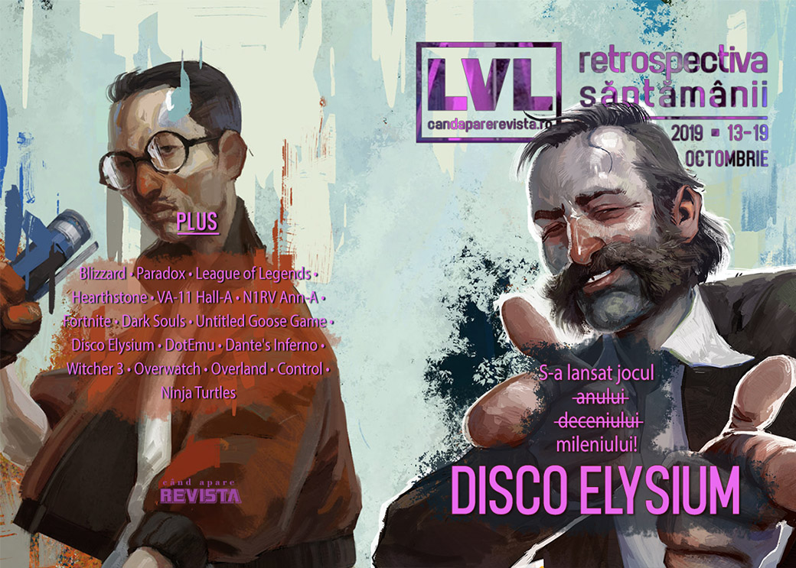

Blizzard se afundă mai adânc în consecințele sancțiunii de săptămâna trecută, arhiva internetului se îmbogățește cu mii de jocuri gratuite, Humble scumpește abonamentul lunar, Riot și Paradox anunță o mulțime de titluri noi - printre care Crusader Kings III - și avem câteva lansări importante: Postal 4 (surpriză), Six Ages, succesorul spiritual al lui King of Dragon Pass, și, desigur, Disco Elysium, cel mai planescapetorment joc de la Planescape Torment încoace.

Linkuri rapide:

* [Știri](#știri)
* [Articole (critică, dev, design)](#articole-critică-dev-design)
* [Made în România](#made-în-românia)
* [Anunţuri şi lansări de jocuri](#anunţuri-şi-lansări-de-jocuri)
* [Prăvălii de jocuri](#prăvălii-de-jocuri)

## Știri

* Internet Archive își suplimentează colecția de jocuri video cu 2500 titluri pentru DOS (printre care The Secret of Monkey Island, Microsoft Flight Simulator, The Incredible Machine 2, TES Daggerfall și multe altele). ([PC Gamer](https://www.pcgamer.com/2500-more-dos-games-added-to-the-internet-archive/), [Ars Technica](https://arstechnica.com/gaming/2019/10/thousands-of-dos-games-have-been-added-to-the-internet-archive/), [Destructoid](https://www.destructoid.com/the-internet-archive-added-2-500-games-to-its-ms-dos-treasure-trove-569550.phtml), [Polygon](https://www.polygon.com/2019/10/15/20915967/internet-archive-goose-game-ms-dos-archive), [Kotaku](https://kotaku.com/2500-classic-ms-dos-games-are-now-free-to-play-1839076618))

### Blizzard - Hong Kong
Câteva noutăți în subiectul de săptămâna trecută despre Blizzard:

* Blizzard anulează un eveniment în New York cu ocazia lansării lui Overwatch pe Switch ([Kotaku](https://kotaku.com/blizzard-cancels-overwatch-launch-event-in-new-york-cit-1839046627), [Destructoid](https://www.destructoid.com/blizzard-cancels-overwatch-on-switch-launch-party-at-nintendo-new-york-569561.phtml), [Polygon](https://www.polygon.com/2019/10/15/20915358/overwatch-launch-event-cancelled-nintendo-nyc-store), [Vice](https://www.vice.com/en_us/article/j5ya3d/blizzard-cancels-overwatch-launch-event-amid-china-censorship-controversy), [Eurogamer](https://www.eurogamer.net/articles/2019-10-15-nintendo-new-yorks-overwatch-for-switch-launch-event-cancelled-in-wake-of-blizzard-boycott)) și amână un eveniment din Taiwan dedicat aniversării a 15 ani de World of Warcraft. ([Polygon](https://www.polygon.com/2019/10/17/20919539/blizzard-entertainment-world-of-warcraft-event-taiwan-hong-kong-protests))
* Echipa universitară de Hearthstone, care a protestat împotriva deciziei de a-l suspenda pe Blitzchung, au fost în sfârșit suspendați, după o perioadă mai lungă în care nu s-a întâmplat nimic ([Polygon](https://www.polygon.com/2019/10/16/20917672/hearthstone-college-team-hong-kong-suspension-blizzard), [PC Gamer](https://www.pcgamer.com/hearthstone-collegiate-team-that-held-up-a-free-hong-kong-sign-has-been-suspended/), [The Verge](https://www.theverge.com/2019/10/16/20917574/blizzard-ban-hearthstone-college-students-grandmaster-china-hong-kong-protests), [Kotaku](https://kotaku.com/blizzard-gives-6-month-ban-to-college-team-that-held-up-1839103489), [Ars Technica](https://arstechnica.com/gaming/2019/10/blizzard-belatedly-punishes-college-hearthstone-team-for-hong-kong-protest/))
* Iar mai mulți senatori din Congresul Statelor Unite, din ambele partide, au trimis o scrisare deschisă CEO-ului Activision-Blizzard pentru a-i cere să revoce pedeapsa acordată jucătorului și să-și revizuiască politicile de sancționare a dreptului de liberă exprimare. ([Ars Technica](https://arstechnica.com/gaming/2019/10/us-legislators-urge-blizzard-to-reverse-hong-kong-protest-player-ban/), [VideoGamesChronicle](https://www.videogameschronicle.com/news/us-politicians-urge-activision-blizzard-to-drop-blitzchung-ban/), [RPS](https://www.rockpapershotgun.com/2019/10/19/us-congress-members-concerned-over-blizzards-blitzchung-ban/), [Eurogamer](https://www.eurogamer.net/articles/2019-10-19-us-politicians-write-to-activision-blizzard-boss-bobby-kotick-expressing-deep-concern-over-punishment-of-hong-kong-hearthstone-pro), [PC Gamer](https://www.pcgamer.com/bipartisan-members-of-congress-call-on-blizzard-to-reverse-blitzchung-punishment/), [PC Gamer](https://www.pcgamer.com/bipartisan-members-of-congress-call-on-blizzard-to-reverse-blitzchung-punishment/))

## Articole (critică, dev, design)
* [Games Don’t Cause Violence—But They Might Help Breed the Online Hate That Does](https://egmnow.com/games-dont-cause-violence-but-they-might-help-breed-the-online-hate-that-does/) (EGM)
* [The boy behind the biggest coin-op conversion of the 80s](https://www.eurogamer.net/articles/2019-10-13-the-boy-behind-the-biggest-coin-op-conversion-of-the-80s) (Eurogamer)
* [VA-11 Hall-A, N1RV Ann-A, and the Struggle to Create in a Country on the Brink](https://egmnow.com/va-11-hall-a-n1rv-ann-a-and-the-struggle-to-create-in-a-country-on-the-brink/) (EGM)
* [The Problem of the Indie Game Pedestal](https://www.gamasutra.com/blogs/JoshBycer/20191014/352119/The_Problem_of_the_Indie_Game_Pedestal.php) (Gamasutra)
* [The red and the black: exploring the leather jacket in video games](https://theface.com/life/video-games-leather-jackets-duke-nukem-busby-bobcat-mass-effect) (The Face)

---

### Actualitate
* [Riot's 7 new games are a declaration of war against Blizzard](https://www.pcgamer.com/riots-7-new-games-are-a-declaration-of-war-against-blizzard/) (PC Gamer)
* [How Riot Games could overtake Blizzard Entertainment](https://www.pcinvasion.com/riot-games-could-overtake-blizzard-entertainment/) (PC Invasion)
* [The DeanBeat: Riot Games sheds its image as a single-game company](https://venturebeat.com/2019/10/18/the-deanbeat-riot-games-sheds-its-image-as-a-single-game-company/) (VentureBeat)
* [Blizzard faces an impossible choice, but choose it must](https://www.eurogamer.net/articles/2019-10-19-blizzard-faces-an-impossible-choice-but-choose-it-must) (Eurogamer)

---

### _Not-a-review_
* [Fortnite has reached The End – changing video game storytelling for good](https://www.theguardian.com/games/2019/oct/14/fortnite-has-reached-the-end-changing-video-games-for-good) (The Guardian)
* [Farewell to Fortnite's living island](https://www.eurogamer.net/articles/2019-10-14-farewell-to-fortnites-living-island) (Eurogamer)
* [Dementia in diegesis](http://www.firstpersonscholar.com/dementia-and-diegesis/) (First Person Scholar)
* [Untitled Goose Game and the Inconvenient Natural World](https://graceinthemachine.com/2019/10/13/untitled-goose-game-and-the-inconvenient-natural-world/) (Grace In The Machine)
* [Disco Elysium Proves Why It's Sometimes Good to Play to Fail](https://www.pastemagazine.com/articles/2019/10/disco-elysium.html) (Paste)

---

### Industrie
* [Devolver Boss Defends Steam Amid Epic Store And Exclusivity Controversy](https://www.gamespot.com/articles/devolver-boss-defends-steam-amid-epic-store-and-ex/1100-6470544/) (Gamespot)
* [Why it took a decade for Riot to follow League of Legends with a new game](https://www.theverge.com/2019/10/15/20915506/riot-games-league-of-legends-10th-anniversary-marc-merrill-interview) (The Verge)
* [Honks vs. Quacks: A Long Chat With the Developers of &#39;Untitled Goose Game&#39;](https://www.vice.com/en_us/article/xwe7jk/honks-vs-quacks-a-long-chat-with-the-developers-of-untitled-goose-game) (Vice)
* [For the ESA, the E3 Data Breach Came at the Worst Possible Time](https://egmnow.com/for-the-esa-the-e3-data-breach-came-at-the-worst-possible-time/) (EGM)
* [Call of Duty won’t be the last high-profile game to get rid of loot boxes](https://qz.com/1731220/call-of-duty-modern-warfare-wont-be-the-last-to-ditch-loot-boxes/) (Quartz)
* [Why retro porting house Dotemu launched its Arcade Crew publishing label](https://www.pcgamesinsider.biz/interviews-and-opinion/69843/why-retro-porting-house-dotemu-launched-its-arcade-crew-publishing-label/) (PCGamesInsider.biz)
* [Three million square miles of wilderness: How Silk advances a lost genre](https://www.gamesindustry.biz/articles/2019-10-17-three-million-square-miles-of-wilderness-how-silk-advances-a-lost-genre) (GamesIndustry.biz)
* [Big spending whales aren't the problem with free-to-play games](https://www.gamesindustry.biz/articles/2019-10-18-big-spending-whales-arent-the-problem-with-free-to-play-games-opinion) (GamesIndustry.biz)

---

### Istorie, retrospectivă
* [Kine: From &quot;artsy bullshit&quot; to Stadia launch title and Epic exclusive](https://www.gamesindustry.biz/articles/2019-10-16-kine-from-artsy-bullshit-to-stadia-launch-title-and-epic-exclusive) (GamesIndustry.biz)
* [The nostalgic joy of '90s style PC game installers](https://www.pcgamer.com/the-nostalgic-joy-of-90s-style-pc-game-installers/) (PC Gamer)
* [Member Dante&#039;s Inferno?](https://www.hardcoregamer.com/2019/10/18/member-dantes-inferno/359763/) (Hardcore Gamer)
* [A Response to Ahoy&#8217;s &#8220;The First Video Game&#8221;](https://thehistoryofhowweplay.wordpress.com/2019/10/16/a-response-to-ahoys-the-first-video-game/) (The History of How We Play)

---

### Dev, making of, mecanici
* [Video: How (and why) Blizzard finally ported Overwatch to Switch](https://arstechnica.com/gaming/2019/10/video-how-and-why-blizzard-finally-ported-overwatch-to-switch/) (Ars Technica)
* [The writing of The Witcher 3](https://www.eurogamer.net/articles/2019-10-15-the-writing-of-witcher-3) (Eurogamer)
* [Designing for disaster in Finji's  Overland](https://www.gamasutra.com/view/news/352192/Designing_for_disaster_in_Finjis_Overland.php) (Gamasutra)
* [Explaining how fighting games use delay-based and rollback netcode](https://arstechnica.com/gaming/2019/10/explaining-how-fighting-games-use-delay-based-and-rollback-netcode/) (Ars Technica)

---

### Design, world-building, artă
* [All the discussions about the artistic nature of videogames overlook these three crucial aspects](https://gamasutra.com/blogs/SophiaGardner/20191016/352287/All_the_discussions_about_the_artistic_nature_of_videogames_overlook_these_three_crucial_aspects.php) (Gamasutra)
* [The real buildings that inspired  Control 's Oldest House](https://www.gamasutra.com/view/news/352097/The_real_buildings_that_inspired_Controls_Oldest_House.php) (Gamasutra)
* [Inside the Art of Star Wars Jedi: Fallen Order, Kashyyyk&#x27;s Giant Spiders Are More Horrifying Than Ever](https://io9.gizmodo.com/inside-the-art-of-star-wars-jedi-fallen-order-kashyyy-1839059824) (Gizmodo)
* [The Art Of Ghost Recon Breakpoint](https://kotaku.com/the-art-of-ghost-recon-breakpoint-1839015361) (Kotaku)
* [Move Like A Ghost](https://kotaku.com/move-like-a-ghost-1839084374) (Kotaku)
* [Teeth Teeth Teeth Teeth Teeth](https://kotaku.com/teeth-teeth-teeth-teeth-teeth-1839118696) (Kotaku)

## Made în România
* Un articol Startup Cafe despre procesul de producție a jocurilor video în România. ([StartupCafe.ro](https://www.startupcafe.ro/smart-tech/cum-fac-jocuri-video-romania.htm))

## Anunţuri şi lansări de jocuri
* Riot Games anunță, cu ocazia aniversării de 10 ani, multe proiecte aflate în lucru, printre care și primele jocuri pe care le dezvoltă în afară de League of Legends ([Ars Technica](https://arstechnica.com/gaming/2019/10/riot-is-expanding-the-league-of-legends-universe-into-multiple-new-genres/), [Destructoid](https://www.destructoid.com/everything-riot-announced-for-their-massive-league-of-legends-10-year-anniversary-569703.phtml), [Polygon](https://www.polygon.com/2019/10/15/20916213/league-of-legends-10th-anniversary-stream-announcements), [Eurogamer](https://www.eurogamer.net/articles/2019-10-16-heres-everything-riots-announced-so-far-for-league-of-legends-10-year-anniversary))
  * **League of Legends: Wild Rift**, un nou MOBA ([VG247](https://www.vg247.com/2019/10/16/league-legends-wild-rift-console/))
  * **Legends of Runeterra**, un card game ([Polygon](https://www.polygon.com/2019/10/15/20914850/legends-of-runeterra-card-game-riot-games))
  * **League of Legends Esports Manager**, un manager de echipă de League of Legends ([PC Gamer](https://www.pcgamer.com/league-of-legends-is-getting-its-own-football-manager-like-business-sim-where-you-manage-a-pro-team/))
  * Joc neintitulat, nume de cod "Project A", un character-based shooter ([PC Gamer](https://www.pcgamer.com/riot-games-just-announced-a-new-competitive-first-person-shooter/), [RPS](https://www.rockpapershotgun.com/2019/10/16/riot-games-announce-hero-shooter-codenamed-project-a/))
  * Joc neintitulat, nume de cod "Project L", un fighting game ([Polygon](https://www.polygon.com/2019/10/15/20915736/league-of-legends-fighting-game-project-l-riot-games), [PC Gamer](https://www.pcgamer.com/league-of-legends-fighting-game/))
  * Joc neintitulat, nume de cod "Project F", un action RPG ([Polygon](https://www.polygon.com/2019/10/15/20913863/project-f-league-of-legends-dev))

* Paradox a organizat o nouă ediție a convenției anuale dedicată propriilor jocuri, PDXCON ([PC Gamer](https://www.pcgamer.com/pdxcon-2019-all-the-announcements-from-paradoxs-annual-convention/), [Kotaku](https://kotaku.com/everything-paradox-interactive-announced-at-pdxcon-2019-1839189987)). Printre titlurile anunțate se numără: 
  * **Crusader Kings III** ([VideoGamesChronicle](https://www.videogameschronicle.com/news/paradox-announces-crusader-kings-3-for-steam-and-game-pass/), [RPS](https://www.rockpapershotgun.com/2019/10/19/crusader-kings-3-is-happening-heres-ten-things-we-know-so-far/))
  * **Stellaris: Federations**, expansion nou ([RPS](https://www.rockpapershotgun.com/2019/10/19/stellaris-federations-expansion-announced-and-will-bring-new-origins-for-your-empires/))
  * **Heavy Metal**, expansion nou pentru Battletech ([VentureBeat](https://venturebeat.com/2019/10/19/battletech-gets-heavy-metal-expansion-on-november-21/))
  * **Surviving the Aftermath** anunțat oficial și lansat surpriză în early access pe Epic Store

### Anunţate
* **The Europa Wager**, un nou expansion pentru Offworld Trading Company ([PC Gamer](https://www.pcgamer.com/offworld-trading-company-is-going-to-a-cold-gassy-moon-in-the-next-expansion/))
* **Iron Danger** ([DSOGaming ](https://www.dsogaming.com/news/daedalic-entertainment-will-launch-iron-danger-in-early-2020-on-the-pc-releases-new-teaser-trailer/))
* **GolfTopia** ([Eurogamer](https://www.eurogamer.net/articles/2019-10-15-simgolf-goes-sci-fi-in-management-sim-tower-defense-pinball-hybrid-golftopia))
* **Werewolf: The Apocalypse – Earthblood** ([DSOGaming ](https://www.dsogaming.com/news/werewolf-the-apocalypse-earthblood-is-coming-to-the-pc-in-2020-gets-an-official-reveal-trailer/))

### Acum cu dată de lansare
* **Zombie Army 4: Dead War**: 4 februarie 2020 ([Destructoid](https://www.destructoid.com/zombie-army-4-dead-war-gets-february-release-date-and-collector-s-edition-569695.phtml))

### Amânate
* **Divinity: Fallen Heroes**: amânat pe termen nedefinit ([Destructoid](https://www.destructoid.com/divinity-fallen-heroes-shelved-a-month-before-launch-569625.phtml))
* **Vampire: The Masquerade - Bloodlines 2**: amânat din martie pentru mai târziu în cursul lui 2020 ([DSOGaming ](https://www.dsogaming.com/news/vampire-the-masquerade-bloodlines-2-has-been-delayed-still-planned-for-a-2020-release/))

### Lansate
* 14 octombrie: **Postal 4: No Regerts** anunț și lansare surpriză în early access ([Steam](https://store.steampowered.com/app/707030/POSTAL_4_No_Regerts/))
* 15 octombrie: **Disco Elysium** ([Steam](https://store.steampowered.com/app/632470/Disco_Elysium/), [gog.com](https://www.gog.com/game/disco_elysium))
* 15 octombrie: **Outbuddies** ([Steam](https://store.steampowered.com/app/1083310/OUTBUDDIES/), [gog.com](https://www.gog.com/game/outbuddies))
* 15 octombrie: **Grandia HD Remaster** ([Steam](https://store.steampowered.com/app/1034860/GRANDIA_HD_Remaster/))
* 15 octombrie: **Rebel Inc: Escalation** (early access) ([Steam](https://store.steampowered.com/app/1088790/Rebel_Inc_Escalation/))
* 16 octombrie: **Chernobylite** (early access) ([Steam](https://store.steampowered.com/app/1016800/Chernobylite/), [gog.com](https://www.gog.com/game/chernobylite))
* 16 octombrie: **Beat Hazard 2** (iese din early access) ([Steam](https://store.steampowered.com/app/618740/Beat_Hazard_2/), [gog.com](https://www.gog.com/game/beat_hazard_2))
* 17 octombrie: **Felix The Reaper** ([Steam](https://store.steampowered.com/app/919410/Felix_The_Reaper/), [gog.com](https://www.gog.com/game/felix_the_reaper))
* 17 octombrie: **Autonauts** ([Steam](https://store.steampowered.com/app/979120/Autonauts/))
* 17 octombrie: **Little Big Workshop** ([Steam](https://store.steampowered.com/app/574720/Little_Big_Workshop/), [gog.com](https://www.gog.com/game/little_big_workshop))
* 17 octombrie: **Six Ages: Ride Like the Wind** ([Steam](https://store.steampowered.com/app/881420/Six_Ages_Ride_Like_the_Wind/), [gog.com](https://www.gog.com/game/six_ages_ride_like_the_wind))
* 17 octombrie: **Sea Salt** ([Steam](https://store.steampowered.com/app/983350/Sea_Salt/), [gog.com](https://www.gog.com/game/sea_salt))
* 17 octombrie: **Stranded Sails - Explorers of the Cursed Islands** ([Steam](https://store.steampowered.com/app/943260/Stranded_Sails__Explorers_of_the_Cursed_Islands/), [gog.com](https://www.gog.com/game/stranded_sails_explorers_of_the_cursed_islands))
* 17 octombrie: **The Fisherman - Fishing Planet** ([Steam](https://store.steampowered.com/app/1072480/The_Fisherman__Fishing_Planet/))
* 17 octombrie: **Kine** ([Epic Store](https://www.epicgames.com/store/en-US/product/kine/))
* 17 octombrie: **The Jackbox Party Pack 6** ([Steam](https://store.steampowered.com/app/1005300/The_Jackbox_Party_Pack_6/))
* 18 octombrie: **Plants vs. Zombies: Battle for Neighborville** (iese din early access) ([Origin](https://www.origin.com/can/en-us/store/plants-vs-zombies/pvz-battle-for-neighborville))
* 18 octombrie: **Manifold Garden** ([Epic Store](https://www.epicgames.com/store/en-US/product/manifold-garden/))
* 19 octombrie: **Surviving the Aftermath** ([Epic Store](https://www.epicgames.com/store/en-US/product/surviving-the-aftermath/))

## Prăvălii de jocuri
### Știri
* [Google Stadia Pro launches November 19](https://www.gamesindustry.biz/articles/2019-10-15-google-stadia-pro-launches-november-19) (GamesIndustry.biz)
* [Steam is now selling game soundtracks on their own](https://www.pcgamesinsider.biz/news/69842/steam-is-now-selling-game-soundtracks-on-their-own/) (PCGamesInsider.biz)
* [Humble Monthly is lightly rebooting as Humble Choice later this year](https://www.gamasutra.com/view/news/352521/Humble_Monthly_is_lightly_rebooting_as_Humble_Choice_later_this_year.php) (Gamasutra)

### Articole
* [G2A: &quot;There's no place in a business like ours for shadiness or fraud&quot;](https://www.gamesindustry.biz/articles/2019-10-15-g2a-interview) (GamesIndustry.biz)
* [Xbox Game Pass users are playing 40% more games -- including outside Game Pass](https://www.gamesindustry.biz/articles/2019-10-18-xbox-game-pass-users-are-playing-40-percent-more-games-including-outside-game-pass) (GamesIndustry.biz)

### Jocuri gratis și free weekends
* [Teenage Mutant Ninja Turtles Arcade Fan Remaster is now available for download on the PC](https://www.dsogaming.com/news/teenage-mutant-ninja-turtles-arcade-fan-remaster-is-now-available-for-download-on-the-pc/) (DSOGaming )
* [Match-3 meets the RTS in this free browser game](https://www.pcgamer.com/match-3-meets-the-rts-in-this-free-browser-game/) (PC Gamer)
* [Alan Wake&#8217;s American Nightmare and Observer are now free on the Epic Games store](https://www.videogameschronicle.com/news/alan-wakes-american-nightmare-and-observer-are-now-free-on-the-epic-games-store/) (VideoGamesChronicle)
* [Free game: Crusader Kings 2 on Steam, right now](https://www.polygon.com/pc/2019/10/18/20920885/crusader-kings-2-pc-steam-free-download-pdxcon-2019) (Polygon)

### Reduceri și promoții
* [This week's Humble Bundle is so po-mo](https://www.destructoid.com/this-week-s-humble-bundle-is-so-po-mo-569652.phtml) (Destructoid)
* [Australia, Fanatical is holding a huge 'Insanity Sale'](https://www.pcgamer.com/au/australia-fanatical-is-holding-a-huge-insanity-sale/) (PC Gamer)
* [Weekend PC Download Deals for Oct. 18: The Division 2 free weekend](https://www.shacknews.com/article/114551/weekend-pc-download-deals-for-oct-18-the-division-2-free-weekend) (Shacknews)
* [Weekend Console Download Deals for Oct. 18: PlayStation Halloween Sale](https://www.shacknews.com/article/114552/weekend-console-download-deals-for-oct-18-playstation-halloween-sale) (Shacknews)
* [Get Deep with Humble Bundle Featuring Postmodern Games](https://techraptor.net/gaming/news/get-deep-with-humble-bundle-featuring-postmodern-games) (TechRaptor)

---

{}
**Retrospectiva săptămânii** este rubrica duminicală în care trecem în revistă evenimentele săptămânii de pe frontul de gaming: știri şi articole (scrise de alții, bineînțeles, că e mai ușor aşa), industrie, lansări, oferte de jocuri, toate numai de savurat la cafeaua de duminică dimineața.

De asemenea, rubrica e deschisă oricui vrea și poate contribui. Dacă ai citit vreun articol sau vreo știre interesantă și crezi că merită incluse în retrospectiva săptămânii, te așteptăm pe forum pe unul dintre topicurile dedicate: [Știri](https://forum.candaparerevista.ro/viewtopic.php?f=4&t=46), [Articole](https://forum.candaparerevista.ro/viewtopic.php?f=4&t=206), [Gaming România](https://forum.candaparerevista.ro/viewtopic.php?f=4&t=1622)].
{}
